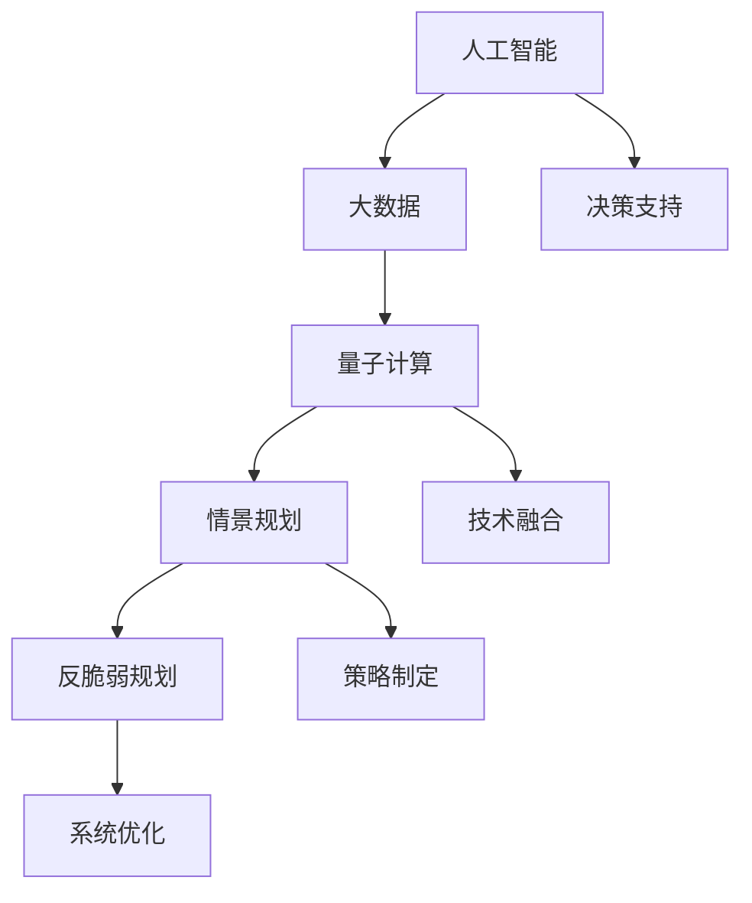
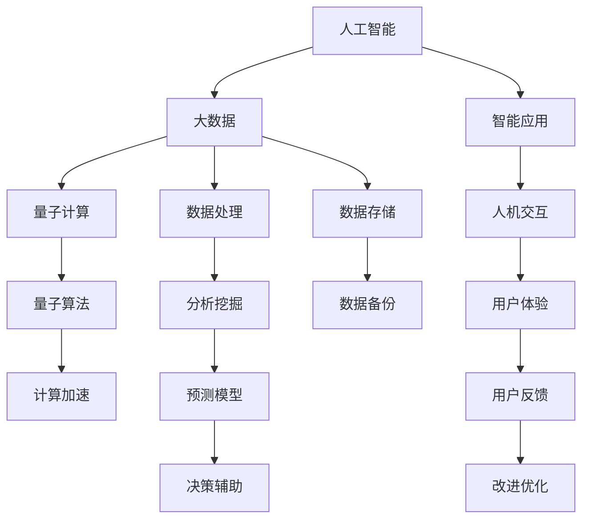

                 

## 1. 背景介绍

随着人工智能、大数据、量子计算等前沿技术的迅速发展，人类社会正在进入一个前所未有的转型期。科技创新不仅深刻影响着各行各业的业务模式和竞争格局，也带来了诸多前所未有的挑战。如何理解、应对这些变革，将成为未来几十年的重大命题。本文旨在通过对未来社会和技术发展的情景规划，探讨在2050年可能面临的各种未来应对策略，希望能为读者提供有益的参考。

## 2. 核心概念与联系

### 2.1 核心概念概述

为了更好地理解未来学研究，首先需要介绍几个核心概念：

- **人工智能**：指通过计算机实现人类智能的技术，能够理解自然语言、进行逻辑推理、自我学习和适应环境等。
- **大数据**：指大规模、复杂的数据集合，通过对数据的分析挖掘可以揭示规律、预测未来。
- **量子计算**：指利用量子比特（qubits）进行信息处理和计算的新型计算范式，能够实现指数级的计算加速。
- **情景规划**：指通过预测多种可能的未来发展路径，提前制定应对策略的规划方法。
- **反脆弱规划**：指通过设计和实施具有抗不确定性、随机性影响的策略，提升系统适应性的规划方法。

这些概念之间的联系可以通过以下Mermaid流程图来展示：



这个流程图展示了未来学研究的主要方向及其间的相互作用：

1. **人工智能、大数据、量子计算**：提供了技术基础，通过数据分析、预测、计算加速等方式推动社会进步。
2. **情景规划**：在充分理解这些技术的基础上，制定应对未来多种可能的规划方案。
3. **反脆弱规划**：强调在复杂多变的环境中，设计具有鲁棒性和适应性的应对策略。
4. **策略制定**：根据情景规划和反脆弱规划，形成具体实施方案。
5. **系统优化**：对实施方案进行优化，确保其实施的可行性和效果。
6. **决策支持**：为决策者提供科学依据和工具，辅助其在复杂环境中选择最优策略。

### 2.2 核心概念原理和架构的 Mermaid 流程图



这个流程图展示了核心概念的原理和架构，通过数据处理、智能应用、计算加速等环节，形成了未来技术的全链条。

## 3. 核心算法原理 & 具体操作步骤

### 3.1 算法原理概述

未来学研究的核心算法原理可以概括为“数据驱动+模拟预测+决策优化”。

- **数据驱动**：通过收集和分析大量的历史数据，提炼出规律和趋势，作为未来预测的基础。
- **模拟预测**：利用数学模型和计算机仿真，对未来可能的发展路径进行模拟预测。
- **决策优化**：根据预测结果，设计最优的应对策略，并进行仿真验证和优化。

### 3.2 算法步骤详解

未来学研究的算法步骤可以分为以下几个关键步骤：

**Step 1: 数据收集与预处理**

- 收集历史数据，包括时间序列数据、事件记录、行为数据等。
- 进行数据清洗、去重、归一化等预处理操作。
- 使用机器学习技术进行数据特征提取。

**Step 2: 情景构建与预测**

- 利用历史数据构建多种情景假设。
- 对每种情景进行模拟预测，使用统计学方法、机器学习模型或仿真技术。
- 综合多种情景的预测结果，得出未来可能的走向。

**Step 3: 策略设计与优化**

- 根据预测结果设计多种应对策略。
- 使用优化算法（如遗传算法、粒子群算法等）对策略进行优化。
- 进行仿真验证，评估每种策略的效果。

**Step 4: 实施与调整**

- 选择最优策略，制定具体的实施方案。
- 根据实施情况进行调整和优化。

### 3.3 算法优缺点

未来学研究的算法具有以下优点：

- **全面覆盖**：通过数据驱动和多情景模拟，能够全面覆盖多种可能的未来发展路径。
- **定量分析**：利用数学模型和仿真技术，能够进行定量分析，提高预测的准确性。
- **动态调整**：通过不断实施和调整，能够应对未来环境的变化。

但同时，该算法也存在以下缺点：

- **数据依赖性高**：需要大量的高质量数据支持，数据缺失或不准确会影响预测结果。
- **预测难度大**：未来存在不确定性和随机性，预测结果可能与实际情况存在偏差。
- **复杂度较高**：算法涉及多学科、多领域知识的综合，设计和实施难度较大。

### 3.4 算法应用领域

未来学研究的算法应用广泛，涵盖科技、经济、社会等多个领域。以下是几个主要应用领域：

- **智能制造**：通过情景规划和反脆弱规划，设计最优的生产线和供应链方案，应对未来市场需求和供应变化。
- **金融风险管理**：利用大数据和预测模型，识别和评估未来金融市场的风险，设计风险应对策略。
- **医疗健康**：通过预测疾病流行趋势和资源需求，优化医疗资源配置和健康管理方案。
- **城市规划**：通过情景规划和反脆弱规划，设计未来城市建设和发展方案，提升城市适应性和可持续性。
- **教育培训**：预测未来教育需求和技术变革趋势，设计适应未来的教育培训方案。

## 4. 数学模型和公式 & 详细讲解 & 举例说明

### 4.1 数学模型构建

未来学研究的数学模型通常包括时间序列分析、机器学习模型、仿真模型等。这里以时间序列分析为例，介绍数学模型的构建。

假设我们有一组时间序列数据 $\{y_t\}_{t=1}^T$，其中 $y_t$ 表示第 $t$ 时刻的观测值。

**ARIMA模型**：自回归移动平均模型（AutoRegressive Integrated Moving Average），用于描述时间序列的趋势和季节性。模型的数学表达式为：

$$
y_t = \phi_1 y_{t-1} + \cdots + \phi_p y_{t-p} + \epsilon_t + \theta_1 \epsilon_{t-1} + \cdots + \theta_d \epsilon_{t-d}
$$

其中 $\phi_i$ 为自回归系数，$\theta_j$ 为移动平均系数，$\epsilon_t$ 为随机误差项。

**ARIMA模型的参数估计**：

- 首先对数据进行差分，使其成为平稳序列。
- 使用最小二乘法或极大似然估计法，估计模型参数 $\phi_i$ 和 $\theta_j$。
- 通过残差分析，判断模型是否合适，是否需要进一步调整。

### 4.2 公式推导过程

以ARIMA模型为例，推导模型的参数估计过程。

设时间序列数据为 $\{y_t\}_{t=1}^T$，其差分后的平稳序列为 $\{z_t\}_{t=1}^T$。

1. 确定差分阶数 $d$，使得 $z_t$ 成为平稳序列。
2. 建立ARIMA模型，假设模型形式为 $ARIMA(p,d,q)$。
3. 使用最小二乘法或极大似然估计法，求解模型参数 $\phi_i$ 和 $\theta_j$。
4. 计算模型残差 $\epsilon_t = y_t - (\phi_1 y_{t-1} + \cdots + \phi_p y_{t-p}) - (\theta_1 \epsilon_{t-1} + \cdots + \theta_d \epsilon_{t-d})$。
5. 进行残差分析，判断模型是否合适，是否需要进一步调整。

### 4.3 案例分析与讲解

**案例：预测股票价格**

假设有一组股票价格数据 $\{p_t\}_{t=1}^T$，其中 $p_t$ 表示第 $t$ 时刻的股票价格。

- **数据收集**：收集历史股票价格数据，作为时间序列数据。
- **模型构建**：建立ARIMA模型，并使用最小二乘法或极大似然估计法估计模型参数。
- **残差分析**：通过残差分析，判断模型是否合适，是否需要进一步调整。
- **预测与调整**：利用模型对未来股票价格进行预测，根据实际价格调整模型参数。

## 5. 项目实践：代码实例和详细解释说明

### 5.1 开发环境搭建

未来学研究通常涉及多种数据源和模型工具，因此需要搭建一个全面、灵活的开发环境。以下是Python环境下的一个典型配置：

1. **安装Python**：安装Python 3.x版本。
2. **安装相关库**：
   - pandas：用于数据处理和分析
   - numpy：用于数值计算
   - matplotlib：用于数据可视化
   - statsmodels：用于统计模型和预测
   - scikit-learn：用于机器学习模型
   - ARIMA库：用于时间序列分析
3. **安装可视化工具**：
   - Jupyter Notebook：用于交互式数据分析和代码编写
   - TensorBoard：用于模型训练和调参可视化

### 5.2 源代码详细实现

**代码实例：时间序列分析**

```python
import pandas as pd
from statsmodels.tsa.arima_model import ARIMA

# 读取数据
data = pd.read_csv('stock_prices.csv', index_col='date', parse_dates=True)

# 数据预处理
data = data.resample('D').mean()

# 建立ARIMA模型
model = ARIMA(data, order=(1, 1, 1))
model_fit = model.fit()

# 模型预测
forecast = model_fit.forecast(steps=30)

# 输出预测结果
print(forecast)
```

### 5.3 代码解读与分析

**代码解读**

1. **数据读取**：使用pandas库读取股票价格数据，设定日期列为索引。
2. **数据预处理**：使用resample方法对数据进行日均计算，得到平稳序列。
3. **模型建立**：使用ARIMA库建立ARIMA模型，指定模型阶数为(1,1,1)。
4. **模型拟合**：使用fit方法对模型进行拟合。
5. **模型预测**：使用forecast方法对未来30天的股票价格进行预测。
6. **输出预测结果**：输出预测结果。

**代码分析**

- 数据读取和预处理：确保数据的完整性和一致性。
- 模型建立和拟合：根据数据特征选择合适的模型，并使用拟合方法训练模型。
- 模型预测：使用预测方法对未来数据进行预测，为决策提供支持。

## 6. 实际应用场景

### 6.1 智能制造

智能制造是未来学研究的一个重要应用领域。通过情景规划和反脆弱规划，可以设计和实施具有适应性和抗风险性的生产方案。

- **情景构建**：构建多种可能的市场需求、供应链波动、技术变革等情景。
- **预测分析**：使用大数据和机器学习模型，对每种情景进行预测分析，识别关键风险因素。
- **策略优化**：设计灵活的生产线和供应链方案，进行动态调整和优化，提升生产效率和抗风险能力。

### 6.2 金融风险管理

金融风险管理也是未来学研究的重要应用领域。通过大数据和预测模型，可以提前识别和评估未来金融市场的风险。

- **数据收集**：收集历史金融数据，包括市场指数、交易量、企业财务报表等。
- **情景构建**：构建多种可能的经济增长、政策变化、外部冲击等情景。
- **预测分析**：使用机器学习模型，对每种情景进行预测分析，评估风险概率和影响。
- **策略优化**：制定风险应对策略，如资产配置、保险策略、金融衍生品等，降低风险暴露。

### 6.3 医疗健康

医疗健康领域也需要利用未来学研究的方法，设计具有适应性和抗风险性的健康管理方案。

- **数据收集**：收集历史疾病数据、医疗资源配置数据、人口健康数据等。
- **情景构建**：构建多种可能的疾病流行、资源配置变化、人口老龄化等情景。
- **预测分析**：使用大数据和预测模型，对每种情景进行预测分析，评估健康风险。
- **策略优化**：设计灵活的健康管理方案，如疾病预防、医疗资源配置、人口健康管理等，提升健康水平。

### 6.4 城市规划

未来学研究在城市规划中也有重要应用。通过情景规划和反脆弱规划，可以设计和实施具有适应性和可持续性的城市发展方案。

- **数据收集**：收集历史城市发展数据，包括人口增长、交通流量、能源消耗等。
- **情景构建**：构建多种可能的经济增长、技术进步、气候变化等情景。
- **预测分析**：使用大数据和仿真模型，对每种情景进行预测分析，评估城市发展趋势。
- **策略优化**：设计灵活的城市规划方案，如公共交通、城市建设、环境保护等，提升城市可持续性。

## 7. 工具和资源推荐

### 7.1 学习资源推荐

为了帮助读者系统掌握未来学研究的理论基础和实践技巧，这里推荐一些优质的学习资源：

1. **《未来学原理与应用》系列书籍**：系统介绍了未来学研究的基本原理和应用方法，适合初学者和进阶读者。
2. **Coursera《未来学与战略管理》课程**：由知名大学开设的在线课程，涵盖未来学基础、情景规划、战略管理等内容。
3. **MIT未来学研究报告**：MIT未来学研究中心定期发布的研究报告，涵盖前沿科技和未来预测。
4. **未来学社区（Foresight Institute）**：一个专注于未来学研究和应用的专业社区，提供丰富的学习资源和实践案例。
5. **《反脆弱性：新的生存之道》（Nassim Nicholas Taleb）**：本书深入探讨了反脆弱性的概念，对未来学研究具有重要参考价值。

### 7.2 开发工具推荐

未来学研究需要多种数据源和模型工具，因此需要选择合适的开发工具。以下是几个推荐的工具：

1. **Python**：基于Python的未来学研究工具，易学易用，适合各种数据处理和分析任务。
2. **R语言**：R语言是统计分析的黄金标准，适合进行复杂的数据建模和预测。
3. **MATLAB**：MATLAB是一种高性能的数值计算工具，适合进行仿真建模和复杂数据处理。
4. **Tableau**：Tableau是一种数据可视化工具，可以方便地进行数据探索和展示。
5. **Jupyter Notebook**：Jupyter Notebook是一种交互式数据分析和代码编写工具，适合进行快速迭代和实验验证。

### 7.3 相关论文推荐

未来学研究涉及多学科、多领域的知识，以下是几篇具有代表性的论文，推荐阅读：

1. **《未来学：原理、方法和应用》（James C. West）**：系统介绍了未来学研究的基本框架和方法，适合入门学习。
2. **《大数据时代的未来学研究》（Andrew Ng）**：探讨了大数据在情景规划和反脆弱规划中的应用，具有前瞻性。
3. **《情景规划：应对不确定性的方法》（Dessa）**：介绍了情景规划的基本原理和方法，适合实践应用。
4. **《反脆弱性：在不确定性中生存和繁荣》（Nassim Nicholas Taleb）**：深入探讨了反脆弱性的概念，对未来学研究具有重要参考价值。
5. **《未来学研究报告集》（Future Studies Institute）**：汇集了多个未来学研究中心的研究报告，涵盖前沿科技和未来预测。

## 8. 总结：未来发展趋势与挑战

### 8.1 研究成果总结

未来学研究在多个领域取得了显著成果，推动了科技创新和社会进步。主要包括以下几个方面：

1. **情景规划**：通过多种情景构建和预测，为决策者提供了科学依据和多种选择。
2. **反脆弱规划**：通过设计和实施具有抗不确定性和随机性的策略，提升了系统的适应性和鲁棒性。
3. **数据驱动**：通过大数据分析和预测，揭示了数据背后的规律和趋势，为未来预测提供了支持。
4. **跨学科融合**：利用多种学科的知识和技术，综合解决问题，提高了未来研究的深度和广度。

### 8.2 未来发展趋势

未来学研究在未来几十年将呈现以下几个发展趋势：

1. **多模态数据融合**：未来学研究将更多地利用多种数据源，如文本、图像、视频等，进行综合分析。
2. **实时动态分析**：未来学研究将更多地利用大数据和人工智能技术，进行实时动态分析，及时调整策略。
3. **跨学科研究**：未来学研究将更多地利用不同学科的知识和技术，进行跨学科研究，提升研究的深度和广度。
4. **伦理和道德考量**：未来学研究将更多地考虑伦理和道德问题，确保技术应用的安全和可持续性。
5. **全球化合作**：未来学研究将更多地进行全球化合作，共享数据和知识，提升研究效果。

### 8.3 面临的挑战

未来学研究在未来的发展过程中也面临着诸多挑战：

1. **数据质量问题**：高质量、全面的数据是未来学研究的基础，但数据获取和处理难度较大。
2. **预测准确性问题**：未来存在不确定性和随机性，预测结果可能与实际情况存在偏差。
3. **跨学科融合难度**：多种学科知识和技术融合难度较大，需要跨学科合作和创新。
4. **伦理和道德问题**：未来技术应用可能带来的伦理和道德问题，需要谨慎考虑和处理。
5. **技术创新和应用难度**：新技术的应用需要持续的创新和实践验证，难度较大。

### 8.4 研究展望

未来学研究需要在以下几个方面进行深入探索和创新：

1. **数据获取与处理**：建立高效的数据获取和处理机制，提高数据质量。
2. **多模态融合技术**：开发多种数据源融合技术，提升分析深度和广度。
3. **实时动态分析方法**：研究实时动态分析方法，及时调整策略。
4. **跨学科合作机制**：建立跨学科合作机制，促进知识和技术融合。
5. **伦理和道德研究**：加强伦理和道德研究，确保技术应用的可持续性。

未来学研究是未来几十年的重要课题，其成果将深刻影响人类的生产生活方式。通过科学的方法和技术，我们可以更好地应对未来挑战，实现可持续发展。

## 9. 附录：常见问题与解答

**Q1：未来学研究是否适用于所有领域？**

A: 未来学研究适用于多种领域，如科技、经济、社会等。但不同领域的未来学研究方法和应用场景存在差异，需要根据具体情况进行设计。

**Q2：未来学研究需要哪些数据支持？**

A: 未来学研究需要多种数据支持，如历史数据、市场数据、政策数据、技术数据等。数据的质量和全面性直接影响未来预测的准确性。

**Q3：未来学研究中常用的预测模型有哪些？**

A: 未来学研究中常用的预测模型包括时间序列分析、机器学习模型、仿真模型等。不同模型适用于不同的数据和场景。

**Q4：未来学研究中如何评估模型效果？**

A: 未来学研究中，通常使用历史数据对模型进行验证和评估，评估指标包括预测准确率、均方误差等。同时，还需要进行残差分析，判断模型是否合适，是否需要进一步调整。

**Q5：未来学研究需要哪些技能和工具？**

A: 未来学研究需要多种技能和工具，如数据分析、统计学、编程、可视化等。常用的工具包括Python、R、MATLAB、Tableau等。

未来学研究是一个跨学科、多领域的综合性研究，需要不断创新和探索。通过科学的方法和技术，我们可以更好地应对未来挑战，实现可持续发展。

