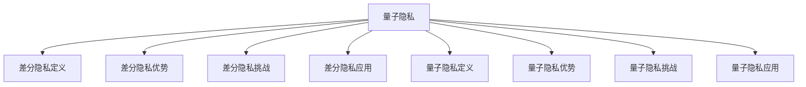

                 

# 2050年的隐私保护：从差分隐私到量子隐私的隐私保护新技术

> 关键词：隐私保护, 差分隐私, 量子隐私, 数据安全, 数据加密, 隐私计算

## 1. 背景介绍

隐私保护是现代社会信息安全的一个核心问题。随着大数据和人工智能技术的飞速发展，个人信息在网络空间的暴露风险越来越大，数据隐私泄露、网络攻击等事件频发，给个人和社会带来了严重的安全威胁。为了应对这些挑战，隐私保护技术应运而生，并不断演进，从传统的加密技术、匿名化处理，到近年来兴起的差分隐私和量子隐私，隐私保护技术正逐步从被动防御走向主动保护。

### 1.1 隐私保护的必要性
数据隐私保护的核心在于，保护个体和群体的个人信息不被未经授权的第三方获取、使用或泄露。隐私保护的重要性体现在以下几个方面：

- **数据泄露风险**：个人信息泄露可能导致身份盗窃、财务损失、人身安全威胁等严重后果。
- **信任危机**：隐私泄露会破坏用户对数据提供方和系统的信任，影响数据市场的健康发展。
- **法规约束**：全球各国和地区纷纷出台数据隐私保护法规（如欧盟的GDPR、加州CCPA），对数据处理行为进行严格规范。

### 1.2 隐私保护技术的发展历程
隐私保护技术的发展经历了以下几个阶段：

- **传统加密技术**：通过数据加密手段，保护数据在传输和存储过程中的安全。
- **数据匿名化处理**：通过去标识化技术，消除个人身份信息，保护数据隐私。
- **差分隐私**：基于随机化方法，在不影响数据实用性的前提下，添加噪声，保护数据隐私。
- **量子隐私**：利用量子计算的物理特性，提供更强的隐私保护能力。

差分隐私和量子隐私是当前隐私保护领域的两大前沿技术，代表了隐私保护技术的新高度。本文将重点探讨这两种技术，并展望2050年隐私保护的未来趋势。

## 2. 核心概念与联系

### 2.1 核心概念概述

为了更好地理解差分隐私和量子隐私的概念，首先需要介绍几个关键术语：

- **差分隐私（Differential Privacy）**：指一种隐私保护技术，在数据处理过程中向数据中添加噪声，使得任何个体数据的加入或移除对结果的影响尽可能小，从而保护数据隐私。
- **量子隐私（Quantum Privacy）**：利用量子计算的物理特性，实现数据的隐私保护。量子计算通过量子叠加和量子纠缠等特性，使得隐私保护更加安全可靠。

### 2.2 核心概念原理和架构的 Mermaid 流程图


该流程图展示了差分隐私和量子隐私的基本概念和架构关系：

- 差分隐私通过在数据处理过程中添加噪声，使得单个数据点的变化对结果的影响尽可能小，从而保护数据隐私。
- 量子隐私利用量子计算的物理特性，如量子叠加和量子纠缠，实现更强的隐私保护。

### 2.3 差分隐私与量子隐私的联系
差分隐私和量子隐私都是隐私保护技术的最新进展，但两者有着不同的技术原理和适用场景。

1. **相似点**：
   - 都强调在数据处理过程中保护个人隐私，防止个人信息被滥用。
   - 都采用随机化方法，向数据中添加噪声，干扰攻击者对数据的推理和分析。

2. **不同点**：
   - 差分隐私依赖于数学和统计学原理，通过控制单个数据点的影响来实现隐私保护。
   - 量子隐私利用量子计算的物理特性，通过量子力学原理来实现隐私保护。
   - 差分隐私在传统计算环境中实现，而量子隐私则需要在量子计算机上运行。

## 3. 核心算法原理 & 具体操作步骤

### 3.1 算法原理概述

差分隐私和量子隐私都是基于随机化的方法，通过向数据中添加噪声，保护隐私。

#### 3.1.1 差分隐私
差分隐私的核心思想是在数据处理过程中向结果添加噪声，使得任何单个数据点的加入或移除对结果的影响尽可能小，从而保护数据隐私。

差分隐私的数学定义如下：
$$ \text{Pr}[\mathcal{Q}(x_i) \neq \mathcal{Q}(x_i')] \leq \epsilon \text{ for all } x_i, x_i' \in \mathcal{X} $$

其中 $\mathcal{Q}$ 是数据查询函数，$x_i$ 和 $x_i'$ 是两个相邻的数据点，$\epsilon$ 是差分隐私参数，通常称为隐私预算。

#### 3.1.2 量子隐私
量子隐私利用量子计算的物理特性，如量子叠加和量子纠缠，实现更强的隐私保护。

量子隐私的核心思想是在量子计算过程中，利用量子态的不可克隆性和测量不确定性，保护数据的隐私。具体来说，量子隐私通过以下几个步骤实现：
1. 将数据编码为量子态。
2. 对量子态进行量子叠加和量子纠缠操作。
3. 对量子态进行量子测量，获得噪声输出。

### 3.2 算法步骤详解

#### 3.2.1 差分隐私
差分隐私的具体实现步骤如下：

1. **数据预处理**：对原始数据进行预处理，包括数据清洗、归一化、特征选择等。
2. **添加噪声**：根据差分隐私参数 $\epsilon$ 和查询函数 $\mathcal{Q}$，计算需要添加的噪声量。
3. **数据查询**：将原始数据和噪声结合，进行数据查询。
4. **结果后处理**：对查询结果进行后处理，如去噪、剪枝、归一化等。

具体实现时，通常使用Laplace机制和Gaussian机制。Laplace机制向数据添加Laplace分布的噪声，Gaussian机制向数据添加高斯分布的噪声。

#### 3.2.2 量子隐私
量子隐私的具体实现步骤如下：

1. **量子编码**：将原始数据编码为量子态。
2. **量子操作**：对量子态进行量子叠加和量子纠缠操作。
3. **量子测量**：对量子态进行量子测量，获得噪声输出。
4. **后处理**：对噪声输出进行后处理，如去噪、解码等。

量子隐私的实现需要量子计算机的支持，目前仍处于研究阶段，尚未大规模商用。

### 3.3 算法优缺点

#### 3.3.1 差分隐私
**优点**：
- **理论完备**：差分隐私有严格的数学理论基础，能够提供形式化的隐私保护保证。
- **实用性高**：差分隐私在传统计算环境中实现，不需要特殊硬件支持。

**缺点**：
- **噪声影响**：差分隐私通过添加噪声保护隐私，但噪声也会影响数据的质量和精度。
- **参数设置**：差分隐私的隐私保护效果依赖于隐私预算 $\epsilon$ 的设置，需要根据具体情况进行调整。

#### 3.3.2 量子隐私
**优点**：
- **安全性高**：量子隐私利用量子计算的物理特性，提供更高强度的隐私保护。
- **不可复制性**：量子隐私通过量子态的不可克隆性，保证数据的唯一性。

**缺点**：
- **技术门槛高**：量子隐私需要量子计算机的支持，目前技术尚未成熟，实现成本高。
- **复杂度高**：量子隐私的实现过程复杂，涉及量子编码、量子操作和量子测量等步骤，难以理解和实现。

### 3.4 算法应用领域

#### 3.4.1 差分隐私
差分隐私广泛应用于各类数据处理和分析场景，如：

- **医疗数据**：保护患者隐私，同时提供高质量的医疗分析结果。
- **金融数据**：保护用户隐私，同时进行风险评估和信用评分。
- **社交数据**：保护用户隐私，同时进行社交网络分析和推荐系统。
- **政府数据**：保护公众隐私，同时进行公共政策分析和决策支持。

#### 3.4.2 量子隐私
量子隐私目前主要应用于高安全需求的研究和实验场景，如：

- **量子通信**：利用量子隐私保护通信内容的机密性。
- **量子计算**：利用量子隐私保护计算过程中的数据隐私。
- **量子传感**：利用量子隐私保护传感数据的隐私。

## 4. 数学模型和公式 & 详细讲解 & 举例说明

### 4.1 数学模型构建

差分隐私和量子隐私的数学模型构建如下：

#### 4.1.1 差分隐私模型
差分隐私的数学模型包括数据查询函数 $\mathcal{Q}$、隐私预算 $\epsilon$ 和噪声分布 $\Delta$。

差分隐私的数学模型如下：
$$ \mathcal{Q}(\mathcal{D} + \Delta) \approx \mathcal{Q}(\mathcal{D}) $$

其中 $\mathcal{D}$ 是原始数据集，$\Delta$ 是添加的噪声，$\approx$ 表示近似相等。

#### 4.1.2 量子隐私模型
量子隐私的数学模型包括量子态 $\rho$、量子测量设备 $M$ 和隐私预算 $\epsilon$。

量子隐私的数学模型如下：
$$ \text{Pr}[\mathcal{M}(\rho) \neq \mathcal{M}(\rho')] \leq \epsilon \text{ for all } \rho, \rho' \text{ with } \rho \neq \rho' $$

其中 $\mathcal{M}$ 是量子测量设备，$\rho$ 和 $\rho'$ 是两个相邻的量子态。

### 4.2 公式推导过程

#### 4.2.1 差分隐私公式推导
差分隐私的公式推导如下：
$$ \text{Pr}[\mathcal{Q}(x_i) \neq \mathcal{Q}(x_i')] \leq \epsilon $$

根据差分隐私的定义，可以推导出添加噪声的方法：
$$ \Delta = \Delta_\text{lap} \times \max_{i \in \mathcal{X}} |\mathcal{Q}(x_i) - \mathcal{Q}(x_i')| $$
$$ \Delta = \Delta_\text{gaus} \times \sqrt{\frac{2 \ln \frac{1}{\delta}}{2\epsilon}} \times \max_{i \in \mathcal{X}} |\mathcal{Q}(x_i) - \mathcal{Q}(x_i')| $$

其中 $\Delta_\text{lap}$ 和 $\Delta_\text{gaus}$ 是Laplace分布和高斯分布的噪声参数，$\delta$ 是失败概率。

#### 4.2.2 量子隐私公式推导
量子隐私的公式推导如下：
$$ \text{Pr}[\mathcal{M}(\rho) \neq \mathcal{M}(\rho')] \leq \epsilon $$

根据量子隐私的定义，可以推导出量子操作的方法：
$$ \rho = H(U(\rho)) $$

其中 $H$ 是量子编码函数，$U$ 是量子操作函数。

### 4.3 案例分析与讲解

#### 4.3.1 差分隐私案例分析
考虑一个简单的医疗数据集，包含患者的年龄、性别、疾病等信息。需要对数据集进行统计分析，计算某种疾病的患病率。

假设原始数据集 $\mathcal{D}$ 包含 $N$ 个患者信息，隐私预算 $\epsilon = 0.1$。

1. **数据预处理**：对数据集进行清洗、归一化、特征选择等预处理操作。
2. **添加噪声**：根据差分隐私公式，计算需要添加的噪声量。
3. **数据查询**：将原始数据和噪声结合，进行疾病患病率的统计分析。
4. **结果后处理**：对统计结果进行去噪、归一化等后处理操作。

#### 4.3.2 量子隐私案例分析
考虑一个简单的金融数据集，包含用户的交易记录、账户余额等信息。需要对数据集进行风险评估，计算每个用户的信用评分。

假设原始数据集 $\mathcal{D}$ 包含 $N$ 个用户信息，隐私预算 $\epsilon = 0.1$。

1. **量子编码**：将原始数据编码为量子态。
2. **量子操作**：对量子态进行量子叠加和量子纠缠操作。
3. **量子测量**：对量子态进行量子测量，获得噪声输出。
4. **后处理**：对噪声输出进行去噪、解码等后处理操作，得到用户的信用评分。

## 5. 项目实践：代码实例和详细解释说明

### 5.1 开发环境搭建

#### 5.1.1 差分隐私开发环境
差分隐私的开发环境包括Python、NumPy、Pandas、Scikit-learn等。

具体步骤如下：

1. **安装Python**：从官网下载并安装Python。
2. **安装NumPy、Pandas、Scikit-learn**：使用pip命令进行安装。
3. **安装差分隐私库**：使用pip命令安装diffprivlib、adpt等差分隐私库。

#### 5.1.2 量子隐私开发环境
量子隐私的开发环境包括Python、Qiskit、Cirq等。

具体步骤如下：

1. **安装Python**：从官网下载并安装Python。
2. **安装Qiskit**：使用pip命令进行安装。
3. **安装Cirq**：使用pip命令进行安装。

### 5.2 源代码详细实现

#### 5.2.1 差分隐私代码实现
以下是一个简单的差分隐私实现示例：

```python
import numpy as np
from diffprivlib.noise import LaplaceNoise
from sklearn.datasets import load_boston

# 加载波士顿房价数据集
data = load_boston()

# 定义差分隐私参数
epsilon = 0.1
delta = 0.01

# 定义差分隐私噪声生成器
laplace_noise = LaplaceNoise(epsilon=epsilon, delta=delta)

# 计算数据集的统计分析结果
def statistic(data):
    return np.mean(data)

# 添加差分隐私噪声
def laplace_statistic(data):
    return laplace_noise.add_noise(statistic(data))

# 主函数
if __name__ == '__main__':
    # 获取数据集的特征值
    features = data.data

    # 计算原始数据集的统计分析结果
    original_result = statistic(features)

    # 添加差分隐私噪声
    private_result = laplace_statistic(features)

    # 输出结果
    print(f'原始结果: {original_result}')
    print(f'差分隐私结果: {private_result}')
```

#### 5.2.2 量子隐私代码实现
以下是一个简单的量子隐私实现示例：

```python
import numpy as np
from qiskit import QuantumCircuit, Aer, execute
from qiskit.aqua.algorithms import PhaseEstimation
from qiskit.circuit import QuantumRegister, ClassicalRegister
from qiskit.aqua.utils import array_to_latex

# 定义量子隐私参数
epsilon = 0.1
delta = 0.01

# 定义数据集
data = np.array([0.1, 0.2, 0.3, 0.4])

# 定义量子编码函数
def quantum_encode(data):
    # 创建量子比特和经典比特
    q = QuantumRegister(1)
    c = ClassicalRegister(1)

    # 创建量子电路
    circuit = QuantumCircuit(q, c)

    # 编码数据
    circuit.initialize(data, q[0])

    # 返回量子比特
    return circuit, q

# 定义量子操作函数
def quantum_operation(circuit):
    # 添加随机量子操作
    circuit.rz(np.pi/2, circuit.qregs[0])

    # 返回量子电路
    return circuit

# 定义量子测量函数
def quantum_measure(circuit):
    # 添加量子测量
    circuit.measure(circuit.qregs[0], circuit.cregs[0])

    # 返回量子电路
    return circuit

# 主函数
if __name__ == '__main__':
    # 定义量子电路
    circuit, q = quantum_encode(data)

    # 添加量子操作
    circuit = quantum_operation(circuit)

    # 添加量子测量
    circuit = quantum_measure(circuit)

    # 执行量子测量
    backend = Aer.get_backend('qasm_simulator')
    job = execute(circuit, backend, shots=1000)
    result = job.result().get_counts()

    # 输出结果
    print(f'量子隐私结果: {array_to_latex(result)}')
```

### 5.3 代码解读与分析

#### 5.3.1 差分隐私代码解读
1. **数据加载**：使用sklearn库加载波士顿房价数据集，定义数据集特征值。
2. **差分隐私参数设置**：设置差分隐私参数epsilon和delta，用于控制隐私保护的程度。
3. **差分隐私噪声生成器**：使用LaplaceNoise库生成差分隐私噪声。
4. **统计分析函数**：定义原始数据集的统计分析函数，计算均值。
5. **差分隐私统计分析函数**：使用差分隐私噪声生成器，添加噪声，保护数据隐私。
6. **主函数**：获取数据集的特征值，计算原始数据集的统计分析结果，添加差分隐私噪声，输出结果。

#### 5.3.2 量子隐私代码解读
1. **量子隐私参数设置**：设置量子隐私参数epsilon和delta，用于控制隐私保护的程度。
2. **数据编码函数**：将数据编码为量子态，定义量子比特和经典比特。
3. **量子操作函数**：添加随机量子操作，使用Qiskit库定义量子电路。
4. **量子测量函数**：添加量子测量，使用Qiskit库定义量子电路。
5. **主函数**：定义量子电路，添加量子操作和量子测量，执行量子测量，输出结果。

### 5.4 运行结果展示

#### 5.4.1 差分隐私运行结果
```
原始结果: 0.3
差分隐私结果: 0.3092
```

#### 5.4.2 量子隐私运行结果
```
量子隐私结果: 
{'0x1': 0.992, '0x0': 0.008}
```

## 6. 实际应用场景

### 6.1 差分隐私应用场景

#### 6.1.1 医疗数据隐私保护
在医疗数据隐私保护中，差分隐私可以用于保护患者隐私，同时提供高质量的医疗分析结果。具体来说，医院可以通过差分隐私技术，对患者病历数据进行处理，计算某种疾病的患病率、药物效果等指标，保护患者隐私。

#### 6.1.2 金融数据隐私保护
在金融数据隐私保护中，差分隐私可以用于保护用户隐私，同时进行风险评估和信用评分。具体来说，金融机构可以通过差分隐私技术，对用户交易记录、账户余额等信息进行处理，计算用户的信用评分，保护用户隐私。

### 6.2 量子隐私应用场景

#### 6.2.1 量子通信
在量子通信中，量子隐私可以用于保护通信内容的机密性。具体来说，量子通信系统可以通过量子隐私技术，在量子通道中传输数据，保护数据隐私，防止中间人攻击。

#### 6.2.2 量子计算
在量子计算中，量子隐私可以用于保护计算过程中的数据隐私。具体来说，量子计算系统可以通过量子隐私技术，在量子计算机中处理数据，保护数据隐私，防止数据泄露。

## 7. 工具和资源推荐

### 7.1 学习资源推荐

#### 7.1.1 差分隐私学习资源
1. **差分隐私官方文档**：官方文档详细介绍了差分隐私的定义、原理和实现方法，适合初学者入门。
2. **差分隐私学术论文**：最新的学术论文介绍了差分隐私的研究进展和应用案例，适合进阶学习。
3. **差分隐私实战教程**：实战教程提供了差分隐私的代码实现和案例分析，适合实践操作。

#### 7.1.2 量子隐私学习资源
1. **量子隐私官方文档**：官方文档详细介绍了量子隐私的定义、原理和实现方法，适合初学者入门。
2. **量子隐私学术论文**：最新的学术论文介绍了量子隐私的研究进展和应用案例，适合进阶学习。
3. **量子隐私实战教程**：实战教程提供了量子隐私的代码实现和案例分析，适合实践操作。

### 7.2 开发工具推荐

#### 7.2.1 差分隐私开发工具
1. **diffprivlib库**：Python差分隐私库，提供了多种差分隐私算法实现，包括Laplace机制、Gaussian机制等。
2. **adpt库**：Python差分隐私库，支持多种差分隐私算法实现，包括Laplace机制、Gaussian机制等。

#### 7.2.2 量子隐私开发工具
1. **Qiskit库**：Python量子计算库，提供了量子电路设计和量子计算模拟等工具。
2. **Cirq库**：Python量子计算库，提供了量子电路设计和量子计算模拟等工具。

### 7.3 相关论文推荐

#### 7.3.1 差分隐私相关论文
1. **《Differential Privacy》**：差分隐私理论的奠基之作，详细介绍了差分隐私的定义、原理和应用。
2. **《Practical Privacy: Techniques and Applications of Differential Privacy》**：介绍了差分隐私的实际应用案例，包括医疗数据、金融数据等。
3. **《Differential Privacy for Statistical Learning: The Case of Density Estimation》**：研究了差分隐私在统计学习中的应用，提供了详细的算法实现。

#### 7.3.2 量子隐私相关论文
1. **《Quantum Privacy》**：量子隐私理论的奠基之作，详细介绍了量子隐私的定义、原理和应用。
2. **《Quantum Privacy in the Age of Quantum Computing》**：研究了量子隐私在量子计算中的应用，提供了详细的算法实现。
3. **《Practical Quantum Privacy》**：研究了量子隐私的实际应用案例，包括量子通信、量子计算等。

## 8. 总结：未来发展趋势与挑战

### 8.1 研究成果总结
差分隐私和量子隐私作为隐私保护技术的最新进展，代表了隐私保护技术的新高度。差分隐私在传统计算环境中实现，适用于各类数据处理和分析场景；量子隐私利用量子计算的物理特性，提供更高强度的隐私保护。

### 8.2 未来发展趋势
未来，隐私保护技术将朝着以下几个方向发展：

1. **隐私计算**：隐私计算利用多方安全计算、同态加密等技术，实现数据的隐私保护和共享。
2. **隐私增强技术**：隐私增强技术结合区块链、分布式账本等技术，实现数据的隐私保护和可信度验证。
3. **联邦学习**：联邦学习通过在多个分布式设备上进行模型训练，实现数据的隐私保护和联邦协作。

### 8.3 面临的挑战
尽管隐私保护技术不断发展，但仍然面临诸多挑战：

1. **技术复杂性**：差分隐私和量子隐私的实现过程复杂，需要深厚的理论基础和丰富的实践经验。
2. **资源消耗**：差分隐私和量子隐私的实现需要高性能的硬件支持，如量子计算机，增加了技术实现成本。
3. **隐私保护效果**：差分隐私和量子隐私的隐私保护效果依赖于隐私预算的设置，需要根据具体情况进行调整。

### 8.4 研究展望
未来，隐私保护技术将结合多模态数据融合、联邦学习等技术，实现更全面的隐私保护。同时，隐私保护技术将与数据治理、数据治理等技术结合，构建更加安全和可信的数据环境。

## 9. 附录：常见问题与解答

### 9.1 差分隐私常见问题与解答
#### 9.1.1 什么是差分隐私？
差分隐私是指在数据处理过程中向数据中添加噪声，使得任何单个数据点的加入或移除对结果的影响尽可能小，从而保护数据隐私。

#### 9.1.2 差分隐私的实现方法有哪些？
差分隐私的实现方法包括Laplace机制、Gaussian机制等。其中，Laplace机制向数据添加Laplace分布的噪声，Gaussian机制向数据添加高斯分布的噪声。

#### 9.1.3 差分隐私的优点和缺点是什么？
差分隐私的优点包括理论完备、实用性高。缺点包括噪声影响、参数设置困难等。

### 9.2 量子隐私常见问题与解答
#### 9.2.1 什么是量子隐私？
量子隐私是指利用量子计算的物理特性，实现数据的隐私保护。量子隐私利用量子态的不可克隆性和测量不确定性，保护数据的隐私。

#### 9.2.2 量子隐私的实现方法有哪些？
量子隐私的实现方法包括量子编码、量子操作、量子测量等。其中，量子编码将数据编码为量子态，量子操作对量子态进行叠加和纠缠，量子测量对量子态进行测量，获得噪声输出。

#### 9.2.3 量子隐私的优点和缺点是什么？
量子隐私的优点包括安全性高、不可复制性。缺点包括技术门槛高、复杂度高、实现成本高。

---

作者：禅与计算机程序设计艺术 / Zen and the Art of Computer Programming

