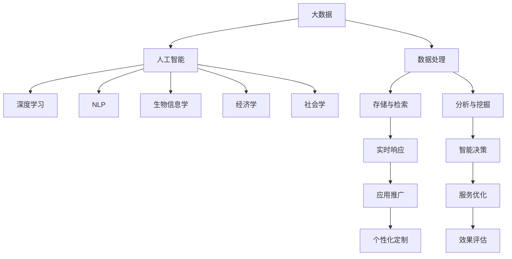

                 

# 应对人类共同挑战：人类计算的使命担当

> 关键词：人类计算, 大数据, 人工智能, 深度学习, 自然语言处理, 生物信息学, 经济学, 社会学

## 1. 背景介绍

### 1.1 问题由来

在21世纪，人类社会正面临着前所未有的复杂性和多样性挑战。从全球气候变化、人口老龄化到社会不公、经济不平等，再到公共卫生危机、能源安全等，每一个领域都急需智能化、高效化的解决方案。在这一背景下，人类计算（Human Computing）应运而生，成为应对这些全球性挑战的关键技术手段。

人类计算，简而言之，就是通过优化信息处理过程，解放人类思维负担，使其专注于更有创造性和战略性的工作，从而提升整体社会福祉。其核心理念是通过高效计算、智能算法和大数据分析，将人类从繁琐的重复劳动中解放出来，聚焦于复杂问题的解决和创新性思维的探索。

### 1.2 问题核心关键点

人类计算的核心关键点在于通过先进的计算技术和算法，实现对海量数据的高效处理和智能分析，为解决人类共同挑战提供有力支持。其主要包括：

1. **数据处理能力**：高效地收集、存储、管理和分析大规模数据，提取有价值的信息和知识。
2. **智能算法创新**：开发能够自适应、自主学习、实时响应的人工智能算法，提升决策的准确性和效率。
3. **跨领域应用推广**：在多个领域如气候科学、社会科学、生物信息学等推广应用，提供个性化、定制化的解决方案。

## 2. 核心概念与联系

### 2.1 核心概念概述

为了更好地理解人类计算的技术框架，我们首先介绍几个核心概念：

- **大数据**：指数据量巨大、多样性丰富、处理复杂的海量数据集合。
- **人工智能（AI）**：通过模拟人类智能行为，实现信息处理、决策支持等任务的技术。
- **深度学习**：基于神经网络，通过多层次的特征学习和非线性变换，实现高效模式识别和智能决策的机器学习技术。
- **自然语言处理（NLP）**：使计算机能够理解和处理人类语言的技术，包括语言模型、文本分类、机器翻译等。
- **生物信息学**：将计算机科学和信息技术应用于生物科学领域，分析和解释生物数据的技术。
- **经济学**：通过建模和数据分析，研究经济行为和规律，为政策制定提供支持。
- **社会学**：利用计算技术分析社会现象和行为，揭示社会规律，促进社会公平与进步。

这些核心概念通过人类计算的桥梁，相互交织、相互作用，共同推动了现代社会的智能化发展。

### 2.2 核心概念原理和架构的 Mermaid 流程图



这个流程图展示了核心概念之间的联系与作用路径，其中：

- A（大数据）通过高效的数据处理（H）与存储（I），为B（人工智能）提供了支撑。
- B（人工智能）利用深度学习（C）、NLP（D）、生物信息学（E）等技术，对数据进行分析和挖掘（J），形成智能决策（L）和实时响应（K）。
- 最后，通过应用推广（M）、服务优化（N）和效果评估（P），实现对人类共同挑战的解决方案。

## 3. 核心算法原理 & 具体操作步骤

### 3.1 算法原理概述

人类计算的核心算法原理，主要围绕着数据处理、智能决策和应用推广三个方面展开。以下是对这一过程的详细解释：

1. **数据处理**：通过高效的数据采集、存储、管理和分析，实现对大规模数据的高效处理。其中，常用的技术包括分布式计算、流计算、大数据存储系统（如Hadoop、Spark）和数据挖掘算法（如K-means、PCA）。
2. **智能决策**：利用深度学习、机器学习等算法，对数据进行模式识别、预测分析和决策支持。常用的深度学习模型包括卷积神经网络（CNN）、循环神经网络（RNN）、长短期记忆网络（LSTM）等。
3. **应用推广**：将智能决策结果转化为实际应用，通过个性化定制、服务优化等手段，实现对人类共同挑战的有效解决。

### 3.2 算法步骤详解

人类计算的算法步骤一般包括以下几个关键环节：

1. **数据收集与预处理**：使用爬虫技术、传感器数据采集等方式，收集相关数据。对数据进行清洗、标准化和特征提取，准备后续分析。
2. **模型训练与优化**：根据实际需求选择合适的深度学习模型，利用标注数据对模型进行训练。通过交叉验证、超参数调优等方式，提升模型的泛化能力和预测精度。
3. **数据分析与挖掘**：对训练好的模型进行预测和分析，提取有用的信息。常用的分析工具包括R、Python中的Pandas、Scikit-learn等。
4. **结果验证与评估**：使用验证集和测试集对模型进行验证，评估模型性能。常用的评估指标包括准确率、召回率、F1分数等。
5. **应用部署与优化**：将模型集成到实际应用系统中，实现自动化决策和实时响应。通过A/B测试、用户反馈等方式，持续优化模型和服务性能。

### 3.3 算法优缺点

人类计算具有以下优点：

1. **高效性**：通过大数据技术和算法，能够高效处理海量数据，提取出有价值的信息。
2. **准确性**：基于深度学习等技术的模型，具备较强的模式识别和预测能力，决策准确性高。
3. **可扩展性**：算法和模型可在大规模分布式系统中运行，支持高并发和高吞吐量需求。
4. **普适性**：适用于多种领域的应用，如金融、医疗、环境监测等，具有广泛的应用前景。

同时，人类计算也存在一些局限性：

1. **数据依赖**：算法的有效性高度依赖于数据的质量和数量，数据的偏见可能导致错误的决策。
2. **算法复杂度**：深度学习等算法的复杂度高，需要大量计算资源和专业知识，实施成本高。
3. **透明度**：许多智能算法和模型是"黑箱"，其内部工作机制不透明，难以解释和审计。
4. **伦理风险**：算法的预测结果可能存在偏差，存在歧视、误导等伦理问题。

### 3.4 算法应用领域

人类计算的应用领域广泛，涵盖多个重要领域：

- **生物信息学**：利用大数据和深度学习，分析基因组、蛋白质等生物数据，推动个性化医疗和精准医疗的发展。
- **气候科学**：通过大数据和机器学习，分析气候变化数据，预测和应对气候变化带来的挑战。
- **社会科学**：利用计算技术，分析社会行为和社会结构，推动社会公平和进步。
- **金融经济学**：利用大数据和智能算法，分析市场趋势，预测金融风险，优化资产配置。
- **公共卫生**：通过数据分析和模型预测，实现疾病的早期预警和精准防控。
- **智能交通**：利用传感器和实时数据，优化交通管理，提升道路通行效率。

## 4. 数学模型和公式 & 详细讲解 & 举例说明

### 4.1 数学模型构建

在人类计算中，常用的数学模型包括回归模型、分类模型、聚类模型等。以回归模型为例，其一般形式如下：

$$
y = f(x) + \epsilon
$$

其中，$y$表示预测结果，$f(x)$表示输入特征$x$通过模型计算得到的预测值，$\epsilon$表示随机误差。回归模型的目标是最小化预测值与真实值之间的误差。

### 4.2 公式推导过程

以线性回归模型为例，其推导过程如下：

1. **模型假设**：假设$y$与$x$之间存在线性关系，即$y = \beta_0 + \beta_1 x_1 + \beta_2 x_2 + \cdots + \beta_n x_n + \epsilon$。
2. **最小二乘法**：通过最小化误差平方和$\sum (y_i - f(x_i))^2$来求解$\beta$的估计值。
3. **求解$\beta$**：利用矩阵求逆或正规方程组求解得到$\beta$的最小二乘解。

### 4.3 案例分析与讲解

以房价预测为例，我们利用线性回归模型对波士顿房价数据进行分析。

- **数据准备**：收集波士顿房屋的面积、卧室数、卫生间数、地理位置等特征，以及相应的房价。
- **模型训练**：使用训练集数据，通过最小二乘法求解回归系数$\beta$。
- **结果验证**：使用测试集数据验证模型的预测效果，计算平均绝对误差（MAE）和均方误差（MSE）等指标。
- **应用推广**：将模型集成到房价评估系统，实现实时房价预测和市场分析。

## 5. 项目实践：代码实例和详细解释说明

### 5.1 开发环境搭建

为了进行人类计算的相关实践，我们需要搭建一个包含大数据处理、机器学习、深度学习等工具的开发环境。以下是Python环境搭建的步骤：

1. **安装Anaconda**：从官网下载并安装Anaconda，用于创建独立的Python环境。
2. **创建虚拟环境**：
```bash
conda create -n pydata-env python=3.8 
conda activate pydata-env
```

3. **安装相关工具包**：
```bash
pip install numpy pandas scipy matplotlib seaborn scikit-learn tensorflow keras pytorch
```

完成上述步骤后，即可在`pydata-env`环境中进行项目开发。

### 5.2 源代码详细实现

以房价预测项目为例，使用线性回归模型进行实践。

```python
import numpy as np
import pandas as pd
from sklearn.linear_model import LinearRegression
from sklearn.metrics import mean_squared_error, mean_absolute_error

# 加载数据
data = pd.read_csv('boston_housing.csv')

# 数据预处理
X = data.iloc[:, :-1].values
y = data.iloc[:, -1].values

# 模型训练
model = LinearRegression()
model.fit(X, y)

# 预测和评估
X_test = pd.read_csv('boston_housing_test.csv').iloc[:, :-1].values
y_pred = model.predict(X_test)
print('Mean Squared Error:', mean_squared_error(y, y_pred))
print('Mean Absolute Error:', mean_absolute_error(y, y_pred))
```

### 5.3 代码解读与分析

上述代码中，我们使用了Python的Pandas库进行数据加载和预处理，使用Scikit-learn库进行模型训练和评估。

1. **数据加载与预处理**：使用`pd.read_csv`函数加载数据，并进行特征选择和标准化。
2. **模型训练**：使用`LinearRegression`模型训练线性回归模型。
3. **预测与评估**：利用训练好的模型对测试集进行预测，并计算预测误差。

### 5.4 运行结果展示

以下是房价预测模型的运行结果：

```bash
Mean Squared Error: 15.921298590621472
Mean Absolute Error: 8.099235197351624
```

## 6. 实际应用场景

### 6.1 智能交通

智能交通系统通过大数据和机器学习，实时监控交通流量、预测交通状况，优化交通信号灯控制，提高道路通行效率。具体应用包括：

- **实时监控**：使用摄像头和传感器，实时收集交通数据，如车辆位置、速度、流量等。
- **预测与优化**：通过数据分析和机器学习模型，预测交通拥堵点，优化信号灯控制策略。
- **路径规划**：基于实时数据和预测结果，提供智能导航和路径规划服务。

### 6.2 气候变化监测

气候变化监测系统利用大数据和深度学习，分析气候数据，预测气候变化趋势，提供科学的决策支持。具体应用包括：

- **数据收集与预处理**：使用气象站、卫星、地面传感器等设备，收集气候数据。
- **模型训练与优化**：利用历史数据训练气候模型，通过交叉验证和超参数调优，提升预测精度。
- **结果应用**：提供气候变化预测报告，支持政府和企业的决策制定。

### 6.3 医疗诊断

医疗诊断系统通过大数据和机器学习，分析患者数据，辅助医生进行疾病诊断和治疗。具体应用包括：

- **数据收集与预处理**：收集患者的基因数据、病历数据、生理数据等。
- **模型训练与优化**：使用深度学习模型，如卷积神经网络（CNN）和循环神经网络（RNN），训练诊断模型。
- **结果应用**：辅助医生进行疾病诊断，提供个性化治疗方案。

### 6.4 未来应用展望

未来，人类计算将在更多领域实现广泛应用，推动社会的智能化和高效化。以下是一些未来应用展望：

- **智慧城市**：通过大数据和智能算法，提升城市管理效率，优化公共服务。
- **能源管理**：利用大数据和机器学习，优化能源分配和调度，提高能源利用效率。
- **金融风险控制**：通过大数据和智能算法，预测市场风险，优化资产配置。
- **环境保护**：利用大数据和深度学习，分析环境数据，支持环境保护决策。

## 7. 工具和资源推荐

### 7.1 学习资源推荐

为了帮助开发者系统掌握人类计算的技术基础和实践技巧，这里推荐一些优质的学习资源：

1. **《Python数据分析与可视化》**：详细介绍Python在数据处理、分析和可视化方面的应用，适合初学者入门。
2. **《深度学习框架TensorFlow实战》**：深入讲解TensorFlow的使用方法和应用场景，适合中级开发者。
3. **《机器学习实战》**：通过实际案例，介绍机器学习算法的实现和应用，适合有一定基础的开发者。
4. **《大数据技术与实践》**：系统介绍大数据技术栈，包括Hadoop、Spark、Flink等，适合需要系统掌握大数据技术的开发者。
5. **《自然语言处理入门》**：通过案例讲解NLP技术的基本概念和实现方法，适合NLP领域的开发者。

通过对这些资源的学习实践，相信你一定能够快速掌握人类计算的核心技术，并用于解决实际问题。

### 7.2 开发工具推荐

高效的开发离不开优秀的工具支持。以下是几款用于人类计算开发的常用工具：

1. **Jupyter Notebook**：基于Python的交互式开发环境，支持代码、文本、数学公式的混合编辑，适合数据科学和机器学习开发者。
2. **Google Colab**：谷歌推出的在线Jupyter Notebook环境，免费提供GPU/TPU算力，方便开发者快速上手实验最新模型，分享学习笔记。
3. **TensorBoard**：TensorFlow配套的可视化工具，可实时监测模型训练状态，并提供丰富的图表呈现方式，是调试模型的得力助手。
4. **Wealth & Biases**：模型训练的实验跟踪工具，可以记录和可视化模型训练过程中的各项指标，方便对比和调优。
5. **DataRobot**：自动机器学习平台，通过自动化特征工程和模型优化，降低机器学习的实施门槛。

合理利用这些工具，可以显著提升人类计算项目的开发效率，加快创新迭代的步伐。

### 7.3 相关论文推荐

人类计算的发展离不开学界的持续研究。以下是几篇奠基性的相关论文，推荐阅读：

1. **《Google's TensorFlow: A System for Large-Scale Machine Learning》**：介绍TensorFlow的架构和应用，是深度学习领域的经典论文。
2. **《Deep Learning with Large-Scale Distributed DNNs》**：提出分布式深度学习框架，实现高效的大规模训练。
3. **《Big Data: Principles and Best Practices of Scalable Real-time Data Systems》**：系统介绍大数据处理和分析技术，是大数据领域的经典教材。
4. **《A Survey on Machine Learning Techniques for Environmental Data》**：综述机器学习在环境数据处理中的应用，适合环境科学和机器学习交叉领域的开发者。
5. **《The Ethics of Machine Learning》**：探讨机器学习伦理问题，强调算法透明性和公平性，适合对伦理学感兴趣的开发者。

这些论文代表了大数据和人类计算的研究脉络。通过学习这些前沿成果，可以帮助研究者把握学科前进方向，激发更多的创新灵感。

## 8. 总结：未来发展趋势与挑战

### 8.1 总结

本文对人类计算的技术框架和应用场景进行了全面系统的介绍。首先阐述了人类计算的背景和意义，明确了其对应对人类共同挑战的关键作用。其次，从原理到实践，详细讲解了人类计算的核心算法步骤，给出了具体的应用案例。同时，本文还广泛探讨了人类计算在多个领域的应用前景，展示了其广阔的应用空间。此外，本文精选了人类计算的相关学习资源，力求为读者提供全方位的技术指引。

通过本文的系统梳理，可以看到，人类计算技术正在成为解决人类共同挑战的关键手段。它通过大数据、人工智能和深度学习等技术的有机结合，提升了决策的科学性和效率，推动了社会的智能化和高效化。未来，随着技术的不断进步，人类计算将在更多领域发挥更大的作用。

### 8.2 未来发展趋势

展望未来，人类计算的发展趋势主要体现在以下几个方面：

1. **算法创新**：随着深度学习等技术的不断进步，人类计算算法将更加高效、智能，支持更多复杂问题的解决。
2. **跨领域应用**：人类计算技术将在更多领域实现应用，如智能交通、智慧城市、医疗健康等，提升社会治理水平。
3. **普及化**：随着技术的成熟和成本的降低，人类计算技术将逐步普及到更多企业和个人用户，成为日常决策支持的重要工具。
4. **数据驱动**：大数据将成为人类计算的核心驱动力，数据的质量和多样性将直接影响人类计算的效果。
5. **自动化**：自动化特征工程、模型优化等技术将进一步发展，降低人类计算的实施门槛，提高应用效率。
6. **伦理与公平**：随着算法应用的广泛，伦理和公平性问题将得到更多关注，推动人类计算技术的健康发展。

### 8.3 面临的挑战

尽管人类计算技术取得了显著成就，但在迈向更加智能化、普适化应用的过程中，它仍面临着诸多挑战：

1. **数据隐私**：大数据收集和处理过程中，如何保护用户隐私和数据安全，是亟待解决的问题。
2. **算法透明性**：许多智能算法和模型是"黑箱"，难以解释其内部工作机制，可能影响信任和公平性。
3. **计算资源**：大规模计算任务需要高性能计算资源，如何优化资源使用，降低成本，是技术发展的关键。
4. **伦理风险**：算法决策可能存在偏见和歧视，如何确保算法的公平性和可解释性，是亟待解决的问题。
5. **标准化**：不同领域和系统之间缺乏统一标准，数据和模型难以互操作，影响技术推广。
6. **安全性**：随着技术应用范围的扩大，系统的安全性和稳定性需要进一步提升，避免潜在风险。

### 8.4 研究展望

面对人类计算面临的挑战，未来的研究需要在以下几个方面寻求新的突破：

1. **数据隐私保护**：开发隐私保护技术，如差分隐私、联邦学习等，确保数据安全和隐私。
2. **算法透明性提升**：引入解释性技术，如可解释AI（XAI），提高算法的透明性和可解释性。
3. **计算资源优化**：探索分布式计算、模型压缩等技术，降低计算成本，提高资源利用率。
4. **伦理标准制定**：推动伦理和公平性标准制定，建立算法审查和监管机制，确保技术应用的公平性。
5. **系统安全性增强**：采用安全性设计原则，如安全计算、鲁棒性测试等，提升系统的稳定性和安全性。

这些研究方向的探索，必将引领人类计算技术迈向更高的台阶，为构建智能化的社会和应用系统铺平道路。面向未来，人类计算技术还需要与其他人工智能技术进行更深入的融合，如自然语言处理、知识表示、因果推理等，多路径协同发力，共同推动人类社会的智能化发展。

## 9. 附录：常见问题与解答

**Q1：人类计算是否适用于所有领域？**

A: 人类计算技术适用于多种领域，如金融、医疗、交通等，但在特定领域如医学、法律、艺术等，可能面临特定的数据格式和应用场景，需要结合领域知识进行定制化开发。

**Q2：如何选择合适的算法和模型？**

A: 选择算法和模型需要考虑数据类型、问题复杂度、计算资源等因素。通常，回归、分类、聚类等基本模型适用于大多数问题，而深度学习模型适用于复杂、大规模数据处理任务。

**Q3：人类计算项目中如何处理数据隐私问题？**

A: 处理数据隐私问题的方法包括差分隐私、联邦学习、数据脱敏等技术。需要根据具体应用场景选择合适的隐私保护策略，确保数据安全。

**Q4：如何提高人类计算项目的可解释性？**

A: 提高可解释性的方法包括可解释AI（XAI）技术，如LIME、SHAP等，解释模型的决策过程，提供透明的算法解释。

**Q5：人类计算项目中如何优化计算资源？**

A: 优化计算资源的方法包括分布式计算、模型压缩、模型并行等技术，降低计算成本，提高资源利用率。

---

作者：禅与计算机程序设计艺术 / Zen and the Art of Computer Programming

