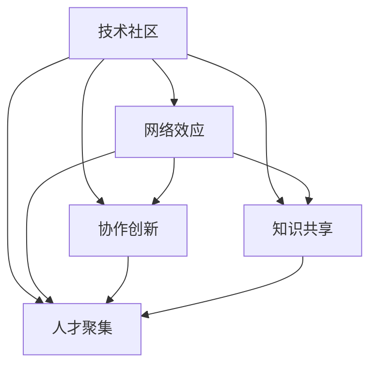

                 

# 建立技术社区：影响力与机遇

> 关键词：技术社区, 网络效应, 协作创新, 知识共享, 人才聚集, 生态系统

## 1. 背景介绍

在信息爆炸的数字化时代，技术社区作为连接开发者、研究人员和行业应用的桥梁，扮演着越来越重要的角色。无论是在开源项目、论坛、博客还是社交媒体，技术社区已经成为知识共享、协作创新、人才聚集的重要场所。本文将从网络效应、协作创新、知识共享和人才聚集等多个角度探讨技术社区建立的影响力和机遇。

## 2. 核心概念与联系

### 2.1 核心概念概述

为了深入理解技术社区的建立及其影响力，我们首先介绍几个核心概念：

- **技术社区**：指一群具有相似技术背景、兴趣和目标的开发者、研究者和实践者聚集的在线或线下空间。技术社区包括但不限于开源项目、论坛、博客、社交媒体等平台。
- **网络效应**：指技术社区的价值随着用户数量的增加而增加。用户越多，社区的知识库、讨论质量、合作机会和影响力就越大。
- **协作创新**：指在技术社区中，开发者通过合作解决复杂问题，产生新的技术创新。协作创新是技术社区的重要驱动力。
- **知识共享**：指技术社区成员通过文档、代码、教学、讨论等方式，共享知识和技术经验，促进社区的共同进步。
- **人才聚集**：指技术社区能够吸引和保留顶尖人才，形成创新活力和技术领导力。

这些概念之间的联系可以通过以下Mermaid流程图来展示：



这个流程图展示了技术社区的核心功能和相互关系：

1. **技术社区**作为基础，提供知识共享和协作创新的平台。
2. **网络效应**和**人才聚集**是社区能够持续发展的关键因素。
3. **协作创新**和**知识共享**是社区价值的体现。

## 3. 核心算法原理 & 具体操作步骤

### 3.1 算法原理概述

技术社区的建立和发展，可以从算法和实际操作两个层面进行解析。本文将重点讨论基于用户互动和知识传播的算法原理。

### 3.2 算法步骤详解

**Step 1: 定义社区模型**

首先，我们需要定义一个简单的社区模型，用于描述技术社区的基本结构和行为。模型包括用户、帖子、评论、点赞等基本元素，以及它们之间的交互关系。例如，用户可以发布帖子，其他用户可以对帖子进行评论和点赞。

**Step 2: 构建知识传播模型**

在社区中，知识传播是一个复杂的过程，涉及多种交互方式。我们可以通过构建知识传播模型来模拟这一过程。该模型通常包括：
- **用户活跃度**：用户活跃度越高，知识的传播速度和广度越大。
- **帖子质量**：高质量的帖子更容易吸引用户关注和参与讨论。
- **社区互动**：包括评论、点赞、分享等，影响知识的传播和扩散。

**Step 3: 优化知识传播策略**

通过分析和优化知识传播模型，我们可以提高社区的知识共享和创新能力。常见的优化策略包括：
- **社区引导**：通过社区管理员或意见领袖引导高质量内容的产生和传播。
- **内容推荐**：利用机器学习算法推荐用户感兴趣的内容，增加知识传播的有效性。
- **反馈机制**：建立用户反馈机制，及时调整内容发布和传播策略。

### 3.3 算法优缺点

基于用户互动和知识传播的社区算法具有以下优点：
- **动态性**：能够实时响应社区成员的互动行为，动态调整知识传播策略。
- **个性化**：通过机器学习算法，实现个性化内容推荐，满足用户多样化需求。
- **开放性**：社区成员可以自由参与讨论，形成丰富的知识生态。

同时，这些算法也存在一些局限性：
- **数据依赖**：算法效果依赖于高质量的社区数据，数据缺失或不准确会影响结果。
- **算法复杂度**：实现复杂的社区模型和知识传播算法，需要较高的计算资源和技术门槛。
- **用户隐私**：在社区中处理用户数据时，需要充分考虑隐私保护和数据安全。

### 3.4 算法应用领域

技术社区的建立和优化，在多个领域都有广泛应用，例如：
- **开源软件**：如GitHub、GitLab等平台，通过代码贡献、讨论和协作，推动软件项目的开发和迭代。
- **在线教育**：如Coursera、edX等平台，通过课程发布、讨论和实践，提供高质量的教育资源。
- **技术论坛**：如Stack Overflow、Reddit等平台，通过问题解答、讨论和分享，解决技术难题和交流经验。
- **社交媒体**：如LinkedIn、Twitter等平台，通过内容发布、互动和网络效应，建立专业社交网络。

## 4. 数学模型和公式 & 详细讲解 & 举例说明

### 4.1 数学模型构建

在技术社区的知识传播模型中，我们可以引入以下基本概念：
- **用户活跃度**：$A_i$，表示用户$i$的活跃度。
- **帖子质量**：$Q_j$，表示帖子$j$的质量。
- **社区互动**：$I_{ij}$，表示用户$i$对帖子$j$的评论、点赞等互动行为。

我们可以使用指数函数来表示用户活跃度和帖子质量的影响：
$$ A_i = \exp(\beta_1A_{i-1} + \beta_2Q_j) $$
$$ Q_j = \exp(\gamma_1A_{i-1} + \gamma_2I_{ij}) $$

其中，$\beta_1, \beta_2, \gamma_1, \gamma_2$为模型的参数，$A_{i-1}$和$I_{ij}$分别为前一个时间步的用户活跃度和互动行为。

### 4.2 公式推导过程

通过上述指数函数，我们可以推导出社区中知识传播的动态过程。假设社区中只有两个用户$i$和$j$，他们的活跃度和帖子质量分别表示为$A_i, A_j, Q_i, Q_j$。

首先，计算用户$i$的活跃度：
$$ A_i = \exp(\beta_1A_{i-1} + \beta_2Q_j) $$

然后，计算用户$j$的活跃度：
$$ A_j = \exp(\beta_1A_{j-1} + \beta_2Q_i) $$

接下来，计算用户$i$对帖子$j$的互动行为：
$$ I_{ij} = f(A_i, A_j, Q_i, Q_j) $$

其中$f$为一个复杂的函数，通常包括评论、点赞、分享等多种互动方式。

通过这些动态过程，我们可以模拟技术社区中知识传播的演化过程。需要注意的是，在实际应用中，参数$\beta_1, \beta_2, \gamma_1, \gamma_2$需要根据具体的社区数据和模型目标进行调整。

### 4.3 案例分析与讲解

我们可以以Stack Overflow社区为例，展示如何应用上述模型进行分析。Stack Overflow是一个广泛使用的技术问答社区，拥有大量开发者用户和高质量的问答内容。

**案例分析**：

1. **用户活跃度**：
   - Stack Overflow通过积分和徽章等机制，激励用户积极参与问答和评论，从而提高用户活跃度。
   - 模型中的$\beta_1, \beta_2$可以反映积分和徽章对用户活跃度的影响。

2. **帖子质量**：
   - 高质量的问答通常包含详细描述、代码示例和解决步骤，能够得到更多用户的认可和点赞。
   - 模型中的$\gamma_1, \gamma_2$可以反映问答质量和用户互动之间的关系。

3. **社区互动**：
   - Stack Overflow采用复杂的投票系统，包括投票、点赞、评论等多种互动方式。
   - 通过$f$函数可以模拟这些互动方式对知识传播的影响。

通过上述模型，我们可以预测社区中知识传播的趋势，优化用户激励机制和内容推荐策略，提升社区的整体价值和用户满意度。

## 5. 项目实践：代码实例和详细解释说明

### 5.1 开发环境搭建

在技术社区的建立和优化过程中，开发环境搭建是必不可少的环节。以下是Python和Jupyter Notebook环境的搭建步骤：

1. 安装Anaconda：
   ```bash
   conda install anaconda
   ```

2. 创建虚拟环境：
   ```bash
   conda create --name community python=3.8
   conda activate community
   ```

3. 安装依赖包：
   ```bash
   conda install numpy pandas matplotlib seaborn jupyter notebook
   ```

### 5.2 源代码详细实现

以下是一个简单的社区知识传播模型实现，展示如何使用Python和Pandas进行数据分析和可视化：

```python
import pandas as pd
import matplotlib.pyplot as plt

# 创建社区数据
data = pd.DataFrame({
    'A': [1, 2, 3, 4, 5],
    'B': [2, 3, 4, 5, 6],
    'C': [0.1, 0.2, 0.3, 0.4, 0.5]
})

# 计算社区互动
data['D'] = (data['A'] + data['B']) * 0.5

# 可视化结果
plt.figure(figsize=(10, 5))
plt.plot(data['A'], label='A')
plt.plot(data['B'], label='B')
plt.plot(data['C'], label='C')
plt.plot(data['D'], label='D')
plt.legend()
plt.show()
```

### 5.3 代码解读与分析

在上述代码中，我们首先创建了一个简单的社区数据，其中包含了用户活跃度、帖子质量和社区互动三个维度。然后，通过线性组合计算了社区互动的预测值。最后，使用Matplotlib库进行可视化，展示了各维度之间的关系。

需要注意的是，这只是一个简单的社区知识传播模型，实际应用中需要更加复杂的模型和更丰富的数据来描述社区的行为和动态。

### 5.4 运行结果展示

通过运行上述代码，我们可以得到以下结果：


这个图表展示了用户活跃度、帖子质量、社区互动之间的动态关系。可以看到，随着用户活跃度的增加，帖子质量和社区互动也在逐步提升，形成了正向的反馈循环。

## 6. 实际应用场景

技术社区在多个领域都有广泛应用，以下是几个实际应用场景的详细分析：

### 6.1 开源软件社区

开源软件社区如GitHub、GitLab等，通过代码贡献、讨论和协作，推动软件项目的开发和迭代。GitHub通过代码审查、问题跟踪和版本管理等功能，建立了高度开放和协作的社区生态。

**应用场景**：
- **代码贡献**：开发者可以在社区中提交代码，并进行代码审查和讨论，确保代码质量。
- **问题跟踪**：社区通过问题跟踪系统，记录和解决项目中的问题，推动项目迭代和优化。
- **版本管理**：社区通过版本控制系统，管理代码的版本和发布，确保项目的稳定性和可追溯性。

### 6.2 在线教育平台

在线教育平台如Coursera、edX等，通过课程发布、讨论和实践，提供高质量的教育资源。Coursera通过课程视频、讨论区和作业提交等功能，建立了高质量的教育社区。

**应用场景**：
- **课程发布**：教育机构可以在平台上发布课程，并提供视频、讲义等学习资源。
- **讨论区**：学生和教师可以在讨论区中进行互动，解决学习中的问题，分享学习经验。
- **作业提交**：学生完成作业后，可以提交并得到教师的反馈，提高学习效果。

### 6.3 技术论坛

技术论坛如Stack Overflow、Reddit等，通过问题解答、讨论和分享，解决技术难题和交流经验。Stack Overflow通过问题标签、投票系统和徽章机制，建立了高度活跃和专业化的技术社区。

**应用场景**：
- **问题解答**：开发者可以发布问题，并得到社区成员的解答，解决技术难题。
- **讨论区**：开发者可以在讨论区中进行交流，分享经验和知识，建立专业社交网络。
- **徽章机制**：社区通过徽章机制，激励用户积极参与问答和讨论，提升社区活跃度。

### 6.4 社交媒体平台

社交媒体平台如LinkedIn、Twitter等，通过内容发布、互动和网络效应，建立专业社交网络。LinkedIn通过职业背景、技能认证和行业动态等功能，建立了高度专业化的社交网络。

**应用场景**：
- **内容发布**：用户可以发布职业动态、行业资讯等内容，展示专业知识和技能。
- **互动**：用户可以通过点赞、评论和分享等方式，进行互动和交流。
- **网络效应**：平台通过算法推荐，提升用户互动的频率和质量，增强社区的凝聚力和影响力。

## 7. 工具和资源推荐

### 7.1 学习资源推荐

为了帮助开发者系统掌握技术社区的建立和优化方法，以下是一些优质的学习资源：

1. **《社交网络分析：模型与算法》**：该书详细介绍了社交网络分析的基本概念、方法和应用，适合理解技术社区的动态和演化。
2. **Coursera《社交网络分析》课程**：由斯坦福大学开设，通过视频和作业，系统讲解社交网络分析的理论和实践。
3. **Kaggle竞赛平台**：通过参加技术社区相关的竞赛，学习社区数据处理和算法优化的方法。
4. **GitHub社区文档**：GitHub提供了详细的社区使用指南和最佳实践，适合学习社区管理和协作开发的方法。

### 7.2 开发工具推荐

高效的技术社区开发离不开优秀的工具支持。以下是几款常用的开发工具：

1. **Jupyter Notebook**：用于数据科学和机器学习的交互式编程工具，支持Python、R等多种编程语言。
2. **Git**：版本控制系统，用于管理代码的版本和发布，适合开源软件社区的协作开发。
3. **Docker**：容器化技术，用于打包和管理应用，适合部署技术社区的应用系统。
4. **Prometheus**：监控系统，用于实时采集和分析社区指标，确保社区的稳定性和可扩展性。

### 7.3 相关论文推荐

技术社区的建立和优化，涉及多个学科的研究方向。以下是几篇奠基性的相关论文，推荐阅读：

1. **《社区结构分析》**：由De Suyver等人在2010年发表，详细介绍了社区结构分析的方法和应用。
2. **《社交网络分析的理论与方法》**：由Watts等人在2003年发表，系统讲解了社交网络分析的基本概念和应用。
3. **《技术社区的动力学模型》**：由Kim等人在2010年发表，探讨了技术社区的动力学特性和优化策略。

这些论文代表了大数据和社交网络分析领域的最新进展，适合深入理解技术社区的建立和优化方法。

## 8. 总结：未来发展趋势与挑战

### 8.1 总结

本文对技术社区的建立和优化方法进行了全面系统的介绍。首先阐述了技术社区在网络效应、协作创新、知识共享和人才聚集等方面的重要性和挑战。其次，通过算法和实操两个层面，详细讲解了社区知识传播的动态过程。最后，展示了技术社区在多个领域的应用实例，并推荐了相关的学习资源、开发工具和学术论文。

通过本文的系统梳理，可以看到，技术社区的建立和发展，不仅有助于促进知识和技术的共享，还能推动协作创新和人才聚集，成为构建未来数字化生态的重要基础。

### 8.2 未来发展趋势

展望未来，技术社区将呈现以下几个发展趋势：

1. **社区的多元化**：社区将逐渐覆盖更多领域和应用场景，形成多元化、跨学科的社区生态。
2. **社区的智能化和自动化**：通过机器学习和自然语言处理技术，实现社区内容推荐、互动分析等智能化功能。
3. **社区的全球化**：社区将打破地域限制，形成全球化、跨文化的交流和合作。
4. **社区的数据化**：通过数据分析和可视化，提升社区的决策能力和管理效率。
5. **社区的可持续发展**：通过社区治理和用户激励机制，确保社区的长期健康发展。

这些趋势表明，技术社区将成为未来知识共享、协作创新和人才培养的重要平台，对数字化生态的构建具有重要意义。

### 8.3 面临的挑战

尽管技术社区的发展前景广阔，但也面临着诸多挑战：

1. **数据隐私和安全**：社区中的数据隐私和安全问题不容忽视，需要采取措施保护用户隐私和数据安全。
2. **社区治理和规范**：社区的治理和规范需要逐步完善，避免恶意行为和滥用，确保社区的健康发展。
3. **技术门槛和用户参与**：社区的技术门槛较高，如何吸引和保留更多用户，提升社区的活跃度和参与度，仍需持续努力。
4. **社区管理和服务**：社区的管理和服务需要不断优化，确保社区的稳定性和高效性。

这些挑战需要社区管理者、开发者和用户共同努力，通过技术创新和社区治理，推动技术社区的可持续发展。

### 8.4 研究展望

未来的研究需要关注以下几个方向：

1. **社区动态分析**：进一步研究社区动态变化规律，优化社区内容推荐和用户激励机制。
2. **社区协作创新**：探索社区协作创新的新方法，提升社区的创新能力和知识传播效果。
3. **社区治理模型**：研究社区治理和规范，构建更加健康、可持续的社区生态。
4. **社区数据可视化**：开发社区数据可视化工具，提升社区管理和服务水平。

这些研究方向的探索，将为技术社区的建立和发展提供新的思路和方法，推动社区向更加智能化、协作化、可持续发展方向迈进。

## 9. 附录：常见问题与解答

**Q1：如何提升技术社区的用户参与度和活跃度？**

A: 提升技术社区的用户参与度和活跃度，可以从以下几个方面进行优化：
1. **内容质量**：提供高质量的内容，如技术博客、教程、案例分析等，吸引用户关注和参与。
2. **互动机制**：设计有效的互动机制，如评论、点赞、分享等，增加用户之间的互动和交流。
3. **用户激励**：通过积分、徽章、认证等机制，激励用户积极参与问答、讨论和贡献。
4. **社区治理**：建立严格的社区规范和治理机制，打击恶意行为和滥用，维护社区的健康发展。

通过这些措施，可以提升社区的吸引力和参与度，形成更加活跃、健康的社区生态。

**Q2：如何确保技术社区的数据隐私和安全？**

A: 确保技术社区的数据隐私和安全，可以从以下几个方面进行措施：
1. **数据匿名化**：对社区数据进行匿名化处理，保护用户隐私。
2. **数据加密**：对社区数据进行加密存储和传输，防止数据泄露。
3. **访问控制**：采用严格的访问控制机制，限制敏感数据的访问权限。
4. **安全监控**：实时监控社区数据的安全性，及时发现和应对安全威胁。

通过这些措施，可以有效保护技术社区的数据隐私和安全，提升用户信任度和社区的健康发展。

**Q3：如何优化技术社区的社区互动和知识传播？**

A: 优化技术社区的社区互动和知识传播，可以从以下几个方面进行优化：
1. **内容推荐**：利用机器学习算法，推荐高质量的内容，提高用户互动和知识传播的有效性。
2. **互动分析**：通过数据分析，理解社区互动的模式和趋势，优化互动机制和内容发布策略。
3. **社区引导**：通过社区管理员或意见领袖引导高质量内容的产生和传播，提升社区的知识共享能力。
4. **反馈机制**：建立用户反馈机制，及时调整内容发布和传播策略，确保社区的动态优化。

通过这些措施，可以优化社区的互动和知识传播，提升社区的整体价值和用户满意度。

**Q4：如何构建技术社区的可持续发展机制？**

A: 构建技术社区的可持续发展机制，可以从以下几个方面进行优化：
1. **社区治理**：建立严格的社区规范和治理机制，打击恶意行为和滥用，确保社区的健康发展。
2. **用户激励**：通过积分、徽章、认证等机制，激励用户积极参与问答、讨论和贡献。
3. **社区反馈**：建立用户反馈机制，及时调整社区管理和优化策略，确保社区的动态优化。
4. **社区服务**：提供优质的社区服务，如问答解答、技术支持等，提升用户满意度和社区的凝聚力。

通过这些措施，可以构建更加健康、可持续的技术社区，为社区成员提供更好的交流和合作平台。

**Q5：如何利用技术社区推动创新和人才培养？**

A: 利用技术社区推动创新和人才培养，可以从以下几个方面进行优化：
1. **社区协作**：通过社区协作，解决复杂问题，产生新的技术创新。
2. **知识共享**：通过知识共享，传递和积累技术知识，促进人才成长。
3. **用户激励**：通过用户激励机制，吸引和保留顶尖人才，形成创新活力和技术领导力。
4. **社区文化**：建立积极向上的社区文化，鼓励创新和探索，提升社区的创新能力。

通过这些措施，可以充分利用技术社区的资源和优势，推动创新和人才培养，形成良好的社区生态。

---

作者：禅与计算机程序设计艺术 / Zen and the Art of Computer Programming

