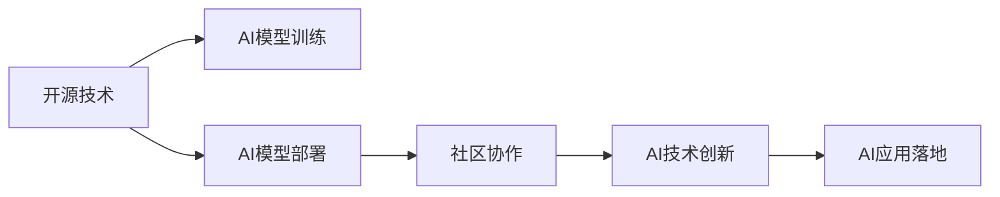

                 

## 1. 背景介绍

在人工智能（AI）的迅猛发展中，开源技术发挥了至关重要的作用。开源技术的普及和繁荣不仅推动了AI研究与应用的深入，也加速了AI技术的商业化进程。本文将从背景介绍开始，梳理开源技术在AI进步中的作用，并探讨其在未来发展中的趋势与挑战。

## 2. 核心概念与联系

### 2.1 核心概念概述

- **开源技术（Open Source Technology）**：指的是在一定的开源协议下，可以自由地获取、使用、修改和共享的软件或技术。
- **人工智能（Artificial Intelligence, AI）**：指通过计算机系统模拟人类智能行为的技术，包括机器学习、深度学习、自然语言处理等。
- **模型训练（Model Training）**：指的是使用大量的数据集对AI模型进行训练，使其能够自动学习并执行特定任务。
- **模型部署（Model Deployment）**：指的是将训练好的AI模型应用于实际业务场景中的过程。
- **社区协作（Community Collaboration）**：指利用社区的力量进行技术的开发、优化和共享。

### 2.2 核心概念原理和架构的 Mermaid 流程图



这个流程图展示了开源技术在AI进步中的作用：开源技术促进了AI模型的训练与部署，并借助社区协作推动技术创新与应用落地。

## 3. 核心算法原理 & 具体操作步骤

### 3.1 算法原理概述

开源技术在AI中的应用主要体现在以下几个方面：

- **数据集的开源共享**：开源数据集为AI研究提供了丰富的训练资源，例如Kaggle平台上的各类数据集。
- **模型的开源实现**：开源模型提供了高效的算法实现，例如TensorFlow、PyTorch等深度学习框架。
- **工具的开源合作**：开源工具促进了模型训练、部署和管理的自动化，例如Docker、Kubernetes等。
- **社区的开源协作**：开源社区的协作加速了技术的迭代与优化，如GitHub上的代码贡献。

### 3.2 算法步骤详解

- **数据集获取与处理**：从开源数据集库中获取数据集，并根据任务需求进行预处理，包括数据清洗、归一化等。
- **模型选择与训练**：选择合适的开源深度学习框架，并搭建训练流程，对模型进行训练和调参。
- **模型部署与优化**：使用开源容器化技术将模型封装成可移植的镜像，部署到目标环境中，并进行性能优化。
- **社区协作与迭代**：在开源社区中分享代码、模型和实验结果，获取反馈并持续改进。

### 3.3 算法优缺点

**优点**：
- 成本低：开源技术免费使用，降低了科研与开发成本。
- 灵活性高：开源社区提供了丰富的资源和工具，开发者可自由选择和组合。
- 迭代快：开源社区快速迭代，新技术和新方法不断涌现。

**缺点**：
- 质量参差不齐：开源技术质量不一，需要开发者具备一定的技术能力和经验。
- 维护复杂：开源技术更新频繁，开发者需不断跟踪和学习。
- 依赖问题：过度依赖开源技术可能限制自身技术体系的独立性。

### 3.4 算法应用领域

开源技术在AI的应用领域非常广泛，涵盖了机器学习、深度学习、自然语言处理、计算机视觉等众多领域。以下是几个典型的应用案例：

- **自然语言处理（NLP）**：开源工具如NLTK、SpaCy，提供了文本处理、实体识别等NLP任务的支持。
- **计算机视觉（CV）**：开源框架如TensorFlow、Keras，提供了图像分类、目标检测等CV任务的支持。
- **强化学习（RL）**：开源环境如Gym、OpenAI Gym，提供了环境模拟、智能体训练等RL任务的支持。

## 4. 数学模型和公式 & 详细讲解 & 举例说明

### 4.1 数学模型构建

开源AI技术的数学模型构建通常基于以下几个基本组件：

- **数据集**：用于训练模型的数据集。
- **模型**：训练好的AI模型。
- **损失函数**：衡量模型预测与真实值之间差异的函数。
- **优化器**：用于最小化损失函数的算法。

### 4.2 公式推导过程

以深度学习中的反向传播算法为例，其核心公式如下：

$$
\nabla_{\theta} L = \nabla_{\theta} \frac{1}{m} \sum_{i=1}^{m} L(y^{(i)}, \hat{y}^{(i)})
$$

其中，$\theta$为模型参数，$m$为训练样本数，$L$为损失函数，$y$为真实值，$\hat{y}$为模型预测值。

### 4.3 案例分析与讲解

以TensorFlow为例，其框架基于计算图模型，可以灵活定义和优化模型结构。以下是使用TensorFlow进行模型训练的简单代码：

```python
import tensorflow as tf

# 定义模型
model = tf.keras.Sequential([
    tf.keras.layers.Dense(64, activation='relu', input_shape=(784,)),
    tf.keras.layers.Dense(10, activation='softmax')
])

# 加载数据集
(x_train, y_train), (x_test, y_test) = tf.keras.datasets.mnist.load_data()

# 数据预处理
x_train = x_train / 255.0
x_test = x_test / 255.0

# 定义损失函数和优化器
loss_fn = tf.keras.losses.SparseCategoricalCrossentropy()
optimizer = tf.keras.optimizers.Adam()

# 训练模型
model.compile(optimizer=optimizer,
              loss=loss_fn,
              metrics=['accuracy'])

model.fit(x_train, y_train, epochs=5, validation_data=(x_test, y_test))
```

## 5. 项目实践：代码实例和详细解释说明

### 5.1 开发环境搭建

进行AI项目开发，需要搭建一个完整的开发环境。以下是一个基本的环境配置流程：

1. **安装Python**：下载并安装Python，推荐使用Anaconda环境。
2. **安装依赖库**：使用pip安装所需的库，例如TensorFlow、Keras、Pandas等。
3. **设置虚拟环境**：使用virtualenv创建虚拟环境，以避免库版本冲突。
4. **配置开发环境**：配置编辑器（如VSCode）和IDE（如Jupyter Notebook），以方便开发。

### 5.2 源代码详细实现

以下是一个简单的图像分类项目，使用TensorFlow进行实现：

```python
import tensorflow as tf

# 定义模型
model = tf.keras.Sequential([
    tf.keras.layers.Conv2D(32, (3, 3), activation='relu', input_shape=(28, 28, 1)),
    tf.keras.layers.MaxPooling2D((2, 2)),
    tf.keras.layers.Flatten(),
    tf.keras.layers.Dense(10, activation='softmax')
])

# 加载数据集
(x_train, y_train), (x_test, y_test) = tf.keras.datasets.mnist.load_data()

# 数据预处理
x_train = x_train / 255.0
x_test = x_test / 255.0
x_train = tf.reshape(x_train, (x_train.shape[0], 28, 28, 1))
x_test = tf.reshape(x_test, (x_test.shape[0], 28, 28, 1))

# 定义损失函数和优化器
loss_fn = tf.keras.losses.SparseCategoricalCrossentropy()
optimizer = tf.keras.optimizers.Adam()

# 训练模型
model.compile(optimizer=optimizer,
              loss=loss_fn,
              metrics=['accuracy'])

model.fit(x_train, y_train, epochs=5, validation_data=(x_test, y_test))
```

### 5.3 代码解读与分析

代码中使用了TensorFlow的Sequential模型，定义了一个包含卷积层、池化层和全连接层的神经网络。使用MNIST数据集进行训练，并使用交叉熵损失和Adam优化器进行模型优化。

### 5.4 运行结果展示

训练完成后，可以通过以下代码进行模型评估：

```python
model.evaluate(x_test, y_test)
```

## 6. 实际应用场景

开源AI技术已经在多个领域得到了广泛应用。以下是几个典型场景：

### 6.1 金融风控

金融机构可以利用开源机器学习库进行客户信用评分、欺诈检测等任务，有效降低金融风险。例如，可以使用TensorFlow或PyTorch构建模型，并使用Scikit-learn进行数据预处理和特征工程。

### 6.2 医疗影像分析

医疗影像分析是AI技术的重要应用之一。开源框架如TensorFlow、Keras提供了图像分类、分割等任务的支持。医疗专家可以使用这些工具快速训练和部署影像分析模型，提高诊断效率。

### 6.3 智能客服

智能客服系统需要处理大量的客户查询，利用开源NLP库如NLTK、SpaCy，可以快速构建自然语言处理模型，进行文本分析和情感识别。

### 6.4 未来应用展望

未来，开源AI技术将进一步推动AI技术的发展，可能涌现出更多创新应用：

- **联邦学习**：在保护数据隐私的前提下，利用分布式计算进行模型训练。
- **边缘计算**：将AI模型部署在边缘设备上，实现实时数据处理和分析。
- **自动驾驶**：开源自动驾驶技术将推动自动驾驶汽车的普及和应用。
- **智能制造**：开源AI技术将促进智能制造的数字化转型，提高生产效率和质量。

## 7. 工具和资源推荐

### 7.1 学习资源推荐

为了深入理解开源AI技术，可以关注以下资源：

- **TensorFlow官方文档**：提供了丰富的API参考和实例代码，适合快速上手。
- **PyTorch官方文档**：提供了深度学习框架的详细文档和代码示例，适合学术研究。
- **Kaggle平台**：提供了大量的数据集和竞赛，适合实践和探索。
- **GitHub开源项目**：可以浏览和学习他人的代码，获取灵感。

### 7.2 开发工具推荐

- **Jupyter Notebook**：轻量级的交互式编程环境，适合数据探索和模型验证。
- **VSCode**：功能强大的编辑器，支持Python和其他AI库。
- **Docker**：容器化技术，方便模型部署和管理。
- **Kubernetes**：容器编排工具，支持分布式训练和推理。

### 7.3 相关论文推荐

- **TensorFlow论文**：描述了TensorFlow框架的设计和实现，适合了解深度学习模型的底层原理。
- **PyTorch论文**：描述了PyTorch框架的设计和优化，适合理解动态图模型的优势。
- **AlphaGo论文**：描述了深度强化学习的突破性应用，适合了解AI在决策领域的应用。

## 8. 总结：未来发展趋势与挑战

### 8.1 研究成果总结

开源AI技术在AI研究与开发中发挥了重要作用，推动了AI技术的广泛应用和产业化进程。开源技术的普及与应用，极大地降低了科研与开发成本，加速了AI技术的迭代和优化。

### 8.2 未来发展趋势

未来，开源AI技术将呈现以下发展趋势：

- **联邦学习**：利用分布式计算进行模型训练，保护数据隐私。
- **边缘计算**：将AI模型部署在边缘设备上，实现实时数据处理和分析。
- **自动驾驶**：开源自动驾驶技术将推动自动驾驶汽车的普及和应用。
- **智能制造**：开源AI技术将促进智能制造的数字化转型，提高生产效率和质量。

### 8.3 面临的挑战

开源AI技术的发展仍面临一些挑战：

- **数据隐私**：如何在保护数据隐私的前提下进行模型训练。
- **计算资源**：如何利用有限的计算资源进行高效的模型训练和优化。
- **模型可解释性**：如何增强模型的可解释性，使其能够被理解和信任。
- **模型鲁棒性**：如何提高模型的鲁棒性，避免对噪声数据的过度拟合。

### 8.4 研究展望

未来，开源AI技术需要从以下几个方面进行研究：

- **分布式计算**：利用分布式计算技术，提高模型训练效率。
- **自动化优化**：利用自动化工具，进行模型调参和优化。
- **模型可解释性**：增强模型的可解释性，提升其可信度。
- **跨学科融合**：与心理学、社会学等学科结合，推动AI技术的深入应用。

## 9. 附录：常见问题与解答

**Q1：如何选择合适的开源AI框架？**

A: 选择开源AI框架需要考虑以下几个因素：

- **应用场景**：根据任务需求选择合适的框架。例如，NLP任务可以选择PyTorch，图像处理任务可以选择TensorFlow。
- **开发经验**：选择你或团队熟悉和擅长的框架。
- **社区支持**：选择社区活跃，资源丰富的框架。

**Q2：如何处理开源AI框架之间的兼容性问题？**

A: 处理框架兼容性问题可以采取以下几种方法：

- **版本控制**：使用虚拟环境和conda工具，管理不同框架的版本。
- **API封装**：使用封装工具，如TensorFlow Estimator，隐藏底层框架的复杂性。
- **模块化开发**：将不同框架的功能模块化，降低集成难度。

**Q3：如何提升开源AI模型的性能？**

A: 提升开源AI模型性能可以采取以下几种方法：

- **数据增强**：通过数据增强技术，扩充训练数据。
- **模型优化**：使用正则化、dropout等技术，防止过拟合。
- **硬件加速**：利用GPU、TPU等硬件设备，提高计算效率。
- **模型融合**：使用集成学习技术，结合多个模型的优势。

**Q4：开源AI技术如何应对安全性问题？**

A: 开源AI技术应对安全性问题可以采取以下几种方法：

- **数据隐私保护**：使用联邦学习等技术，保护数据隐私。
- **模型鲁棒性**：使用对抗样本训练，提高模型的鲁棒性。
- **模型监控**：实时监控模型性能和异常，及时发现和修复漏洞。
- **伦理审查**：建立伦理审查机制，确保模型应用的合规性。

---

作者：禅与计算机程序设计艺术 / Zen and the Art of Computer Programming

