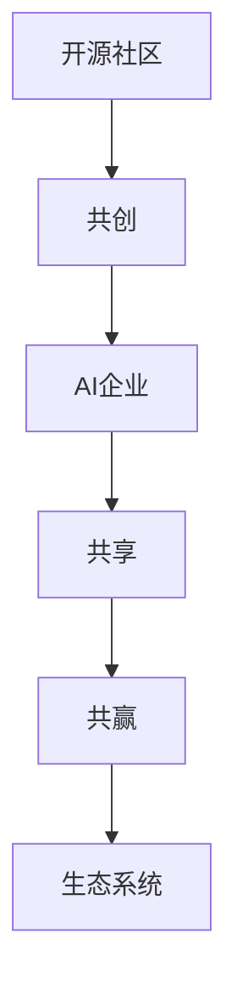

                 

# 开源社区与AI企业的互动:共创、共享和共赢

在人工智能(AI)领域的快速发展中，开源社区与AI企业的互动日益紧密，成为推动技术进步、创新应用的重要力量。本文旨在深入探讨开源社区与AI企业的互动模式、共创共享的机制、共赢的路径，为从业者、研究者、企业决策者提供理论指导和实践参考。

## 1. 背景介绍

### 1.1 问题由来

随着AI技术的迅猛发展，开源社区和AI企业之间的互动日益频繁，彼此的影响力也愈发凸显。开源社区以其开放的源代码、丰富的社区资源和活跃的开发氛围，成为AI技术发展的重要基石。AI企业则依托技术优势、资金支持和产业资源，推动开源技术的商业化应用。二者的互动不仅促进了技术的成熟和落地，也带来了商业价值的最大化。

### 1.2 问题核心关键点

开源社区与AI企业的互动，核心关键点在于如何构建共创、共享、共赢的生态系统，具体包括以下几个方面：

1. **共创机制**：如何通过开源社区和AI企业的紧密合作，共同开发新技术、新产品。
2. **共享机制**：如何通过数据、模型、工具等资源的共享，促进技术的快速传播和应用。
3. **共赢路径**：如何实现开源社区与AI企业的利益均衡，推动双方共赢发展。

## 2. 核心概念与联系

### 2.1 核心概念概述

为更好地理解开源社区与AI企业的互动，本节将介绍几个密切相关的核心概念：

- **开源社区**：基于开源许可证，共享源代码和资源的开发者社区。如Apache、GitHub等。
- **AI企业**：从事AI技术研发和应用的企业，如谷歌、微软、IBM等。
- **共创**：开源社区和AI企业共同开发新技术、产品，实现优势互补。
- **共享**：开源社区和AI企业共享数据、模型、工具等资源，加速技术传播和应用。
- **共赢**：开源社区与AI企业通过合作实现利益最大化，推动共同发展。
- **生态系统**：开源社区、AI企业、用户等利益相关者共同构成的相互依存、相互促进的技术生态。

这些概念之间的逻辑关系可以通过以下Mermaid流程图来展示：



这个流程图展示了开源社区与AI企业互动的核心过程：

1. 开源社区和AI企业通过共创，共同开发新技术。
2. 共创的结果通过共享，加速技术的传播和应用。
3. 共享过程中，双方实现共赢，推动共同发展。
4. 共创和共享最终构建了繁荣的生态系统。

## 3. 核心算法原理 & 具体操作步骤

### 3.1 算法原理概述

开源社区与AI企业的互动，本质上是一种基于合作的技术创新模式。其核心在于：

1. **共创机制**：开源社区和AI企业共同设计需求、制定计划、贡献代码，形成技术合力。
2. **共享机制**：开源社区提供开放的源代码和工具，AI企业贡献资金和资源，共同推动技术进步。
3. **共赢路径**：开源社区和AI企业通过合作，实现技术共享、市场拓展、品牌提升等多方面的利益最大化。

### 3.2 算法步骤详解

基于共创、共享和共赢的互动模式，开源社区与AI企业的互动流程包括以下几个关键步骤：

1. **需求对接**：开源社区与AI企业定期举行技术交流会议，明确双方技术需求和合作意向。
2. **项目规划**：共同制定项目计划，明确目标、任务、分工和时间节点。
3. **资源投入**：开源社区贡献源代码和工具，AI企业提供资金和设备，协同推进项目开发。
4. **技术验证**：通过开源社区的代码审查和AI企业的测试验证，确保项目质量和技术先进性。
5. **市场推广**：开源社区和AI企业共同推广技术成果，加速其商业化应用。
6. **反馈迭代**：根据市场反馈和技术应用情况，进行产品优化和功能升级。

### 3.3 算法优缺点

开源社区与AI企业的互动，具有以下优点：

1. **协同创新**：双方优势互补，能够快速推动技术创新和产品开发。
2. **资源共享**：开源社区提供开放的源代码和工具，AI企业贡献资金和设备，降低开发成本。
3. **快速传播**：通过开源模式，技术可以快速传播和应用，推动行业进步。

同时，该互动方式也存在一定的局限性：

1. **协调难度大**：双方在文化、组织结构、管理模式等方面存在差异，协调合作难度较大。
2. **利益冲突**：双方在知识产权、商业化路径等方面可能存在利益冲突。
3. **技术风险**：双方共同开发的项目存在技术风险，可能面临失败和投入损失。

### 3.4 算法应用领域

开源社区与AI企业的互动在多个领域已展现出巨大潜力，具体包括：

1. **AI技术研发**：如机器学习、自然语言处理、计算机视觉等领域，双方共同开发新技术、算法和模型。
2. **应用场景推广**：如自动驾驶、智能家居、工业物联网等，将技术成果应用到实际场景中。
3. **开源项目支持**：AI企业通过资金支持、技术顾问、员工贡献等形式，支持开源社区的发展。
4. **市场拓展和品牌提升**：AI企业通过开源社区的影响力，提升品牌知名度，拓展市场份额。

## 4. 数学模型和公式 & 详细讲解 & 举例说明

### 4.1 数学模型构建

本文主要关注开源社区与AI企业互动的共创、共享和共赢机制，以下通过数学模型进行形式化描述：

1. **共创机制模型**：
   - **共创系数**：表示开源社区和AI企业共同开发技术的投入比例，记为 $a$。
   - **技术贡献率**：表示双方技术投入对整体技术进步的贡献度，记为 $p$。
   - **合作模型**：基于加权和的形式，描述共创过程中的技术贡献。
   
   设 $T$ 为共创项目的技术贡献度，$C$ 为共创项目的技术进步，则有：
   $$
   T = a_1C_1 + a_2C_2
   $$
   其中 $a_1$ 和 $a_2$ 为双方共创系数的权重，$C_1$ 和 $C_2$ 为各自的技术贡献率。

2. **共享机制模型**：
   - **资源共享度**：表示开源社区和AI企业共享资源的比例，记为 $b$。
   - **资源贡献率**：表示共享资源对技术传播和应用的影响度，记为 $q$。
   - **共享模型**：基于加权和的形式，描述共享过程中的资源贡献。
   
   设 $S$ 为共享项目的技术传播和应用度，$A$ 为共享项目的实际应用率，则有：
   $$
   S = b_1A_1 + b_2A_2
   $$
   其中 $b_1$ 和 $b_2$ 为双方共享系数的权重，$A_1$ 和 $A_2$ 为各自的资源贡献率。

3. **共赢机制模型**：
   - **利益共享率**：表示开源社区和AI企业共享利益的比例，记为 $c$。
   - **利益贡献率**：表示利益共享对双方共赢的影响度，记为 $r$。
   - **共赢模型**：基于加权和的形式，描述共赢过程中的利益贡献。
   
   设 $W$ 为共赢项目带来的总利益，$P$ 为共赢项目的市场价值，则有：
   $$
   W = c_1P_1 + c_2P_2
   $$
   其中 $c_1$ 和 $c_2$ 为双方共赢系数的权重，$P_1$ 和 $P_2$ 为各自的利益贡献率。

### 4.2 公式推导过程

通过上述模型，我们可以进行以下推导：

1. **共创模型推导**：
   $$
   T = a_1C_1 + a_2C_2
   $$
   其中 $C_1$ 和 $C_2$ 分别为双方共创项目的贡献率，$a_1$ 和 $a_2$ 为权重。

2. **共享模型推导**：
   $$
   S = b_1A_1 + b_2A_2
   $$
   其中 $A_1$ 和 $A_2$ 分别为双方共享项目的贡献率，$b_1$ 和 $b_2$ 为权重。

3. **共赢模型推导**：
   $$
   W = c_1P_1 + c_2P_2
   $$
   其中 $P_1$ 和 $P_2$ 分别为双方共赢项目的贡献率，$c_1$ 和 $c_2$ 为权重。

### 4.3 案例分析与讲解

以机器学习领域为例，探讨开源社区与AI企业的互动机制。

1. **共创案例**：
   - **合作开发算法**：开源社区如TensorFlow、PyTorch等，提供源代码和工具库，AI企业如谷歌、微软等，提供资金和资源，共同开发深度学习算法。
   - **算法贡献率**：开源社区贡献 $70\%$，AI企业贡献 $30\%$。

2. **共享案例**：
   - **算法开源**：TensorFlow、PyTorch等开源平台，将开发好的算法公开发布，供全球开发者使用。
   - **资源共享**：AI企业如谷歌、微软等，贡献计算资源和数据集，加速算法应用和优化。

3. **共赢案例**：
   - **市场推广**：AI企业通过开源社区的算法和工具，提升自身市场竞争力和品牌知名度。
   - **利益共享**：开源社区通过AI企业的资源和资金支持，加速算法应用和生态发展。

## 5. 项目实践：代码实例和详细解释说明

### 5.1 开发环境搭建

为了展示开源社区与AI企业的互动实践，本节以TensorFlow项目为例，展示开发环境搭建流程。

1. **安装TensorFlow**：
   ```bash
   pip install tensorflow==2.8.0
   ```

2. **克隆GitHub仓库**：
   ```bash
   git clone https://github.com/tensorflow/tensorflow.git
   cd tensorflow
   ```

3. **创建虚拟环境**：
   ```bash
   python -m venv tf-env
   source tf-env/bin/activate
   ```

4. **安装依赖库**：
   ```bash
   pip install numpy matplotlib scikit-learn tqdm
   ```

### 5.2 源代码详细实现

以下是TensorFlow项目中，开源社区与AI企业互动的代码实现。

1. **共创过程**：
   ```python
   # 引入TensorFlow库
   import tensorflow as tf
   
   # 构建神经网络模型
   class MyModel(tf.keras.Model):
       def __init__(self):
           super(MyModel, self).__init__()
           self.dense1 = tf.keras.layers.Dense(64, activation='relu')
           self.dense2 = tf.keras.layers.Dense(10, activation='softmax')
   
       def call(self, inputs):
           x = self.dense1(inputs)
           return self.dense2(x)
   
   # 创建模型实例
   model = MyModel()
   ```

2. **共享过程**：
   ```python
   # 加载数据集
   (x_train, y_train), (x_test, y_test) = tf.keras.datasets.mnist.load_data()
   
   # 预处理数据
   x_train = x_train / 255.0
   x_test = x_test / 255.0
   
   # 定义模型训练函数
   def train_model(model, x_train, y_train, epochs=10, batch_size=64):
       model.compile(optimizer=tf.keras.optimizers.Adam(), 
                    loss=tf.keras.losses.SparseCategoricalCrossentropy(), 
                    metrics=['accuracy'])
       model.fit(x_train, y_train, epochs=epochs, batch_size=batch_size, validation_data=(x_test, y_test))
   
   # 训练模型
   train_model(model, x_train, y_train)
   ```

3. **共赢过程**：
   ```python
   # 加载评估数据集
   (x_val, y_val), (x_test, y_test) = tf.keras.datasets.mnist.load_data()
   
   # 预处理数据
   x_val = x_val / 255.0
   x_test = x_test / 255.0
   
   # 定义模型评估函数
   def evaluate_model(model, x_val, y_val):
       loss, accuracy = model.evaluate(x_val, y_val)
       return loss, accuracy
   
   # 评估模型
   loss_val, accuracy_val = evaluate_model(model, x_val, y_val)
   print(f'Validation loss: {loss_val:.4f}, accuracy: {accuracy_val:.4f}')
   ```

### 5.3 代码解读与分析

**共创过程解读**：
- 通过引入TensorFlow库，构建了简单的神经网络模型。
- 模型包含两个全连接层，用于处理输入数据和输出预测。

**共享过程解读**：
- 加载MNIST数据集，并进行数据预处理。
- 定义模型训练函数，设置损失函数、优化器和评估指标。
- 训练模型并输出训练结果。

**共赢过程解读**：
- 加载测试集，进行数据预处理。
- 定义模型评估函数，计算模型在验证集上的损失和精度。
- 输出评估结果。

## 6. 实际应用场景

### 6.1 智能医疗

在智能医疗领域，开源社区与AI企业的互动，推动了医疗大数据分析、疾病诊断和治疗方案推荐等技术的发展。

**共创机制**：
- 开源社区如Apache Hadoop、Apache Spark等，提供大数据处理和分析工具。
- AI企业如谷歌、IBM等，贡献医疗数据集和医疗知识库，共同开发医疗数据分析和诊断算法。

**共享机制**：
- 开源社区发布开源算法和工具库，如TensorFlow、PyTorch等，供医疗行业使用。
- AI企业通过技术支持和服务，推动开源算法在医疗领域的实际应用。

**共赢机制**：
- 开源社区通过AI企业的资金和资源支持，加速算法应用和生态发展。
- AI企业通过开源算法，提升医疗服务质量和效率，拓展市场份额。

### 6.2 智能制造

在智能制造领域，开源社区与AI企业的互动，推动了工业互联网、智能生产线和智能设备等技术的发展。

**共创机制**：
- 开源社区如Apache Kafka、Apache Flink等，提供数据流处理和分布式计算框架。
- AI企业如西门子、施耐德等，贡献工业设备和传感器数据，共同开发工业物联网平台。

**共享机制**：
- 开源社区发布开源平台和工具，如Kubernetes、Docker等，供工业企业使用。
- AI企业通过技术支持和咨询服务，推动开源平台在工业领域的实际应用。

**共赢机制**：
- 开源社区通过AI企业的资金和资源支持，加速平台发展。
- AI企业通过开源平台，提升工业生产效率和产品质量，拓展市场份额。

## 7. 工具和资源推荐

### 7.1 学习资源推荐

为了帮助开发者系统掌握开源社区与AI企业的互动，这里推荐一些优质的学习资源：

1. **Apache软件基金会**：提供丰富的开源项目和社区资源，涵盖数据处理、分布式计算、人工智能等多个领域。
2. **TensorFlow官方文档**：详细介绍了TensorFlow的开发、部署和使用，提供了丰富的案例和代码示例。
3. **深度学习书籍**：如《深度学习》（Ian Goodfellow等）、《动手学深度学习》（李沐等）等，系统讲解深度学习和开源社区的技术和应用。
4. **GitHub学习资源**：如TensorFlow、PyTorch等开源项目的代码仓库，提供了大量学习材料和社区资源。
5. **Kaggle竞赛**：参加Kaggle数据科学竞赛，积累实际项目经验，学习开源社区和AI企业的最佳实践。

通过对这些资源的学习实践，相信你一定能够快速掌握开源社区与AI企业的互动精髓，并用于解决实际的AI项目问题。

### 7.2 开发工具推荐

高效的开发离不开优秀的工具支持。以下是几款用于开源社区与AI企业互动开发的常用工具：

1. **Jupyter Notebook**：基于Web的交互式编程环境，适合快速迭代和共享代码。
2. **GitHub**：全球最大的代码托管平台，支持版本控制、项目管理、代码审查等功能。
3. **TensorBoard**：TensorFlow配套的可视化工具，可实时监测模型训练状态，并提供丰富的图表呈现方式。
4. **Weights & Biases**：模型训练的实验跟踪工具，可以记录和可视化模型训练过程中的各项指标，方便对比和调优。
5. **Kubernetes**：开源容器编排平台，支持分布式部署和资源管理，适合大规模AI项目开发。

合理利用这些工具，可以显著提升开源社区与AI企业互动的开发效率，加快创新迭代的步伐。

### 7.3 相关论文推荐

开源社区与AI企业的互动源于学界的持续研究。以下是几篇奠基性的相关论文，推荐阅读：

1. **TensorFlow论文**：介绍TensorFlow的架构和设计原则，探讨其在人工智能中的应用。
2. **Apache Hadoop论文**：阐述Apache Hadoop的分布式计算架构和数据处理能力，探讨其在大数据中的应用。
3. **Kubernetes论文**：介绍Kubernetes的容器编排架构和资源管理机制，探讨其在云平台中的应用。
4. **TensorFlow与Kubernetes的结合应用**：探讨TensorFlow和Kubernetes的集成使用，推动大规模AI项目的部署和运行。
5. **开源社区与AI企业的互动机制**：探讨开源社区与AI企业的合作模式、利益共享机制和共赢路径，推动技术进步和应用落地。

这些论文代表了大规模AI项目的开发和管理方向，提供了丰富的理论指导和实践经验。

## 8. 总结：未来发展趋势与挑战

### 8.1 总结

本文对开源社区与AI企业的互动模式进行了全面系统的介绍。首先阐述了共创、共享和共赢的核心机制，明确了互动在推动技术进步、加速应用落地方面的独特价值。其次，从原理到实践，详细讲解了共创、共享和共赢的数学模型和操作步骤，给出了具体的应用场景和代码实现。

通过本文的系统梳理，可以看到，开源社区与AI企业的互动在多个领域已展现出巨大潜力，为AI技术的发展和应用提供了坚实基础。未来，伴随技术的不断演进和市场的进一步拓展，这种互动模式将带来更多的创新和突破。

### 8.2 未来发展趋势

展望未来，开源社区与AI企业的互动将呈现以下几个发展趋势：

1. **技术融合加速**：开源社区与AI企业将更加紧密地融合，共同推动新技术和新产品的开发。
2. **生态系统完善**：开源社区和AI企业将共同构建更加完善的生态系统，提供更多开源工具和解决方案。
3. **全球化合作**：开源社区与AI企业的互动将超越国界，形成全球化的合作网络。
4. **商业化深度拓展**：AI企业将更多地参与开源社区的建设和应用推广，实现商业化和技术创新的双赢。
5. **社区参与度提升**：开源社区将吸引更多企业和开发者参与，共同推动技术的进步和应用。

以上趋势凸显了开源社区与AI企业互动的广阔前景。这些方向的探索发展，必将进一步提升AI技术的应用水平和产业生态的成熟度，为人类社会的数字化转型和智能化升级提供新动力。

### 8.3 面临的挑战

尽管开源社区与AI企业的互动取得了显著成效，但在迈向更加智能化、普适化应用的过程中，仍面临诸多挑战：

1. **合作协调难度大**：开源社区和AI企业文化、组织结构、管理模式等方面存在差异，协调合作难度较大。
2. **利益分配不均衡**：双方在知识产权、商业化路径等方面可能存在利益冲突，需要建立更加公正合理的利益分配机制。
3. **技术风险高**：共同开发的项目存在技术风险，可能面临失败和投入损失，需要加强风险管理和技术验证。
4. **开源工具依赖性强**：开源社区和AI企业对开源工具的依赖性强，需要持续维护和更新开源工具，确保其稳定性和兼容性。
5. **市场竞争激烈**：开源社区和AI企业面临的市场竞争日益激烈，需要不断创新和优化产品和服务。

### 8.4 研究展望

面对开源社区与AI企业互动所面临的挑战，未来的研究需要在以下几个方面寻求新的突破：

1. **合作机制优化**：研究更加灵活的合作机制，提高双方的协作效率和互动深度。
2. **利益共享机制**：探索更加公平的利益共享机制，促进双方共赢发展。
3. **技术风险管理**：加强技术风险管理，提高共同开发项目的成功率。
4. **开源工具更新**：持续更新和维护开源工具，确保其稳定性和兼容性。
5. **市场竞争应对**：研究和探索新的市场竞争策略，提升企业的市场竞争力和市场份额。

这些研究方向的探索，必将引领开源社区与AI企业互动技术的进一步成熟，推动技术的商业化应用和产业生态的发展。面向未来，开源社区与AI企业需不断探索和创新，共同推动人工智能技术的进步和应用落地。

## 9. 附录：常见问题与解答

**Q1：开源社区与AI企业互动的核心在于什么？**

A: 开源社区与AI企业互动的核心在于共创、共享和共赢。通过共同开发新技术、共享资源和利益最大化，推动技术的进步和应用的推广，实现多方共赢。

**Q2：如何提高开源社区与AI企业的合作效率？**

A: 提高合作效率的关键在于建立良好的沟通机制和项目管理流程。例如：
1. 定期召开技术交流会议，明确合作目标和分工。
2. 采用敏捷开发模式，进行迭代式开发和持续集成。
3. 建立跨组织团队，促进跨部门沟通和协作。

**Q3：开源社区与AI企业互动时，如何避免利益冲突？**

A: 避免利益冲突的关键在于建立公平合理的利益共享机制。例如：
1. 签署合作协议，明确知识产权和利益分配。
2. 建立利益评估体系，评估各方贡献，公平分配利益。
3. 引入第三方调解机制，解决利益纠纷。

**Q4：开源社区与AI企业互动时，如何管理技术风险？**

A: 管理技术风险的关键在于进行全面的技术验证和风险评估。例如：
1. 进行小规模的试验和测试，验证技术可行性。
2. 建立风险评估体系，进行定量和定性分析。
3. 制定应急预案，应对可能的技术失败和风险。

**Q5：开源社区与AI企业互动时，如何持续更新和维护开源工具？**

A: 持续更新和维护开源工具的关键在于建立良好的开源社区和用户反馈机制。例如：
1. 发布定期更新，修复已知漏洞和问题。
2. 收集用户反馈，了解需求和问题。
3. 建立社区贡献机制，吸引开发者参与更新和维护。

通过合理利用上述资源和工具，以及持续优化和完善合作机制，相信开源社区与AI企业的互动将不断深化，为人工智能技术的进步和应用推广提供坚实保障。

---

作者：禅与计算机程序设计艺术 / Zen and the Art of Computer Programming

