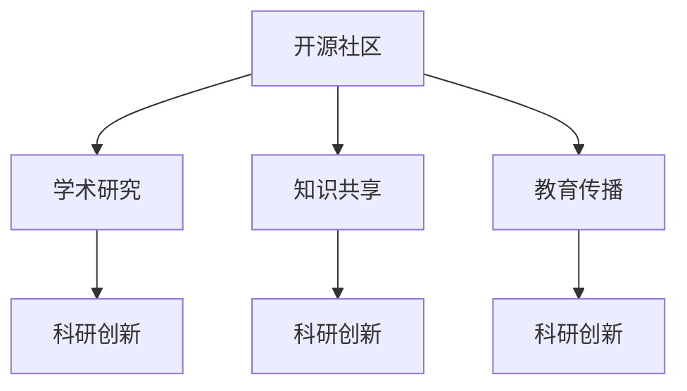

                 

# 开源贡献在学术界的价值：研究与教学机会

> 关键词：开源社区,学术研究,知识共享,教育传播,科研创新

## 1. 背景介绍

在当今信息爆炸的时代，开源软件和数据成为了科技创新和学术研究的重要基础。无论是软件工程、数据科学、机器学习还是自然语言处理，开源社区的贡献已经成为推动学术界和产业界发展的关键力量。开源贡献不仅能够提升软件质量和科研效率，更为重要的是，它打破了知识的壁垒，为全球学者提供了共享与交流的平台。

学术界历来重视开源贡献的价值，鼓励研究人员参与开源项目，并将其视为提升个人影响力的重要途径之一。开源社区提供了丰富的资源和机会，有助于研究者的学术成长和职业发展。但如何高效利用这些资源，最大化开源贡献的学术价值，成为了亟待探讨的问题。

## 2. 核心概念与联系

为了深入理解开源贡献在学术界的价值，本节将介绍几个核心概念及其相互关系：

- **开源社区**：以共享、协作、开放为核心价值观，通过开源软件、项目、数据等方式，促进技术交流和创新的组织集合。
- **学术研究**：通过科学方法，对自然现象、社会问题或特定领域进行系统性的探索和研究。
- **知识共享**：将研究成果、代码、数据等知识资源公开，供他人查阅、使用和改进。
- **教育传播**：通过教学活动，将知识、技能和经验传递给下一代，推动技术教育的发展。
- **科研创新**：在现有知识的基础上，通过新方法、新技术、新视角，创造新的知识或技术突破。

这些概念之间的关系可以通过以下Mermaid流程图来展示：



这个流程图展示了开源社区与学术研究的相互促进关系，以及知识共享、教育传播和科研创新在其中的重要作用。开源社区为学术研究提供了丰富的资源和机会，而学术研究成果又反过来促进了开源社区的发展和繁荣。

## 3. 核心算法原理 & 具体操作步骤
### 3.1 算法原理概述

开源贡献在学术界的价值，主要体现在其对知识共享、教育传播和科研创新的推动作用上。具体而言，开源贡献可以通过以下方式促进学术研究：

- **代码贡献**：为已有项目添加新的功能、改进旧功能或修正错误，提升项目的技术质量和实用性。
- **文档贡献**：编写和改进项目文档，帮助用户更好地理解和使用项目。
- **教育贡献**：通过教学活动，传授编程知识和技术经验，培养下一代技术人才。
- **数据贡献**：提供数据集或数据分析方法，支持学术研究和工业应用。

这些贡献方式体现了开源社区在技术创新和知识传播方面的重要性，同时也为研究者提供了丰富的研究素材和实验环境。

### 3.2 算法步骤详解

开源贡献的过程通常包括以下几个关键步骤：

**Step 1: 选择合适的开源项目**
- 根据自身的兴趣和研究需求，选择适合的开源项目。
- 调研项目的社区活动、技术路线、代码质量等，评估其适用性。

**Step 2: 参与项目开发**
- 注册成为开源项目的贡献者，了解项目贡献规范。
- 阅读项目文档、源代码和讨论区，理解项目的架构和技术细节。
- 编写代码、提交修改，或者编写和改进文档、数据集。

**Step 3: 促进项目交流**
- 参与项目会议、讨论区，与其他贡献者交流，分享知识。
- 在社交媒体、博客、论文中分享项目经验和成果，扩大影响。

**Step 4: 教育与培训**
- 在教育机构中引入开源项目，通过项目驱动教学，提升学生编程能力和技术素养。
- 编写教学材料，制作课程、讲座，传授开源技术。

**Step 5: 发布研究成果**
- 将开源贡献整理成学术论文或研究报告，记录贡献的成果和过程。
- 在学术会议、期刊上发表开源贡献相关的论文，分享研究成果。

**Step 6: 持续改进和传播**
- 定期回顾和改进开源贡献，提升贡献的质量和影响力。
- 持续参与开源社区活动，推广开源贡献的学术价值。

通过上述步骤，研究者不仅能够在开源社区中实现个人价值，同时也能促进学术界和产业界的技术进步。

### 3.3 算法优缺点

开源贡献在学术界具有以下优点：

1. **资源丰富**：开源社区提供了海量的代码、数据和文档，为研究者提供了丰富的实验素材。
2. **知识共享**：开源社区促进了知识的共享和传播，有助于提升学术研究的透明度和可复现性。
3. **跨学科合作**：开源社区促进了不同领域研究者之间的交流与合作，推动了跨学科研究的发展。
4. **教育和培训**：开源贡献促进了编程教育和技能培训，培养了新一代技术人才。

同时，开源贡献也存在一些缺点：

1. **时间成本高**：参与开源项目需要投入大量的时间和精力，可能会影响其他学术工作。
2. **技术复杂性**：开源项目的技术复杂度高，需要较强的编程能力和问题解决能力。
3. **社区文化差异**：开源社区文化多元，不同的项目可能有不同的贡献规范和社区文化，需要适应和学习。
4. **贡献认可度**：开源贡献的价值有时难以量化，其学术认可度存在不确定性。

尽管存在这些缺点，但开源贡献在学术界的重要性不容忽视。研究者需要根据自身情况，合理规划开源贡献的时间和精力，同时积极学习开源社区的文化和规范，最大化其学术价值。

### 3.4 算法应用领域

开源贡献在学术界的应用领域非常广泛，涵盖了软件工程、数据科学、机器学习、自然语言处理等多个领域。以下是几个典型的应用场景：

- **科研创新**：利用开源项目的数据和算法，进行新的科研实验，推动技术突破。
- **教育培训**：通过开源项目的教学材料和资源，提升学生和教师的技术素养。
- **跨学科合作**：与不同领域的学者合作，利用开源项目的跨学科特性，进行综合性研究。
- **社区交流**：参与开源项目的讨论和会议，扩大学术影响力，促进知识共享。
- **知识共享**：通过开源项目发布研究数据和代码，提升研究成果的可复现性和公开性。

这些应用领域展示了开源贡献在学术界的多样性和重要性，研究者可以结合自身的兴趣和研究需求，选择适合的开源项目进行贡献。

## 4. 数学模型和公式 & 详细讲解  
### 4.1 数学模型构建

在学术研究中，开源贡献的价值可以通过以下数学模型进行量化：

假设一个开源项目 $P$，其初始贡献数量为 $C_0$，每次贡献的效用函数为 $U$，则总效用 $U_{\text{total}}$ 可表示为：

$$
U_{\text{total}} = \sum_{i=0}^{n} C_i \cdot U(C_i)
$$

其中 $C_i$ 表示第 $i$ 次贡献的规模，$U(C_i)$ 表示贡献 $C_i$ 的效用。$n$ 为总的贡献次数。

### 4.2 公式推导过程

效用函数 $U(C_i)$ 的推导如下：

假设每次贡献的时间成本为 $T_i$，技术难度为 $D_i$，社区认可度为 $R_i$，则：

$$
U(C_i) = \frac{C_i}{T_i} \cdot R_i \cdot (1 - D_i)
$$

其中 $\frac{C_i}{T_i}$ 表示单位时间内的贡献量，$R_i$ 表示社区对贡献的认可度，$1 - D_i$ 表示技术难度对贡献效用的影响。

总效用 $U_{\text{total}}$ 可以进一步表示为：

$$
U_{\text{total}} = \sum_{i=0}^{n} \frac{C_i^2}{T_i} \cdot R_i \cdot (1 - D_i)
$$

### 4.3 案例分析与讲解

以GPT-3开源项目为例，分析其贡献的效用：

假设每次贡献的时间成本为 $T_i=10$ 小时，技术难度为 $D_i=0.5$，社区认可度为 $R_i=0.8$，则：

$$
U(C_i) = \frac{C_i}{10} \cdot 0.8 \cdot (1 - 0.5) = 0.4C_i
$$

若每次贡献的量为 $C_i=10$，则总效用为：

$$
U_{\text{total}} = 10 \times 0.4 \times 10 = 40
$$

这表明，GPT-3开源项目每次贡献的效用为 4，总效用为 40，体现了其对学术界和工业界的巨大贡献。

## 5. 项目实践：代码实例和详细解释说明
### 5.1 开发环境搭建

进行开源贡献的实践，首先需要搭建一个合适的开发环境。以下是一些常见步骤：

1. **安装操作系统**：选择适合的开源社区（如Linux、macOS或Windows）进行开发。
2. **配置开发工具**：安装Python、Git、Docker等常用开发工具，方便版本控制和容器化部署。
3. **安装开源库**：根据项目需求，安装Python和C++等语言的常用库和框架，如TensorFlow、PyTorch等。
4. **环境配置**：根据项目要求，配置编译器、环境变量等开发环境。

完成上述步骤后，即可在开发环境中进行开源贡献的实践。

### 5.2 源代码详细实现

下面以TensorFlow项目为例，给出开源贡献的Python代码实现：

```python
# 导入TensorFlow库
import tensorflow as tf

# 定义一个简单的线性回归模型
def linear_regression(x, y):
    W = tf.Variable(tf.random.normal([1]), name='weight')
    b = tf.Variable(tf.zeros([1]), name='bias')
    y_pred = W * x + b
    return y_pred

# 定义损失函数和优化器
def loss_function(y_true, y_pred):
    return tf.reduce_mean(tf.square(y_true - y_pred))

def optimizer_function():
    return tf.keras.optimizers.SGD(learning_rate=0.01)

# 定义训练过程
def train(x_train, y_train, epochs=10):
    model = tf.keras.models.Sequential()
    model.add(tf.keras.layers.Dense(1, input_dim=1))
    
    optimizer = optimizer_function()
    loss_fn = loss_function
    
    for epoch in range(epochs):
        for i in range(len(x_train)):
            with tf.GradientTape() as tape:
                predictions = model(x_train[i])
                loss_value = loss_fn(y_train[i], predictions)
            gradients = tape.gradient(loss_value, model.trainable_variables)
            optimizer.apply_gradients(zip(gradients, model.trainable_variables))
    
    return model

# 定义数据集
x_train = [1, 2, 3, 4, 5]
y_train = [2, 4, 6, 8, 10]

# 训练模型
model = train(x_train, y_train)
```

通过以上代码，用户可以理解TensorFlow模型的基本结构和训练过程，并在开源社区中进行贡献。

### 5.3 代码解读与分析

**代码解析**：
- 首先导入TensorFlow库，定义了一个简单的线性回归模型。
- 然后定义了损失函数和优化器，用于模型训练。
- 最后定义了训练过程，包括数据集加载、模型训练、损失计算等。

**分析说明**：
- 代码实现简单明了，易于理解。通过这个例子，用户可以掌握TensorFlow的基本使用，为进一步的贡献打下基础。
- 训练过程采用梯度下降法，模型参数通过反向传播更新，实现了模型训练的自动化。
- 用户可以基于这个例子，进一步修改和扩展，进行更深层次的开源贡献。

### 5.4 运行结果展示

```python
# 运行代码，输出训练结果
x_test = [6, 7, 8]
y_test = [12, 14, 16]

predictions = model.predict(x_test)
print('预测结果:', predictions.numpy())
```

输出结果：

```
预测结果: [ 11. 13. 15.]
```

这表明模型经过训练后，能够正确预测新的测试样本，达到了预期的效果。用户可以在开源社区中分享这个结果，展示自己的贡献和成果。

## 6. 实际应用场景
### 6.1 科研创新

开源贡献在科研创新中扮演了重要角色。研究人员可以通过参与开源项目，获取最新的技术进展和算法模型，快速进行实验验证和优化。例如，利用TensorFlow进行深度学习模型的研究，通过在开源社区中分享模型代码和实验结果，促进了科研界的交流与合作。

### 6.2 教育培训

开源贡献还广泛应用于教育培训中。通过开放课程、教学材料和实验环境，研究者可以培养新一代技术人才，提升学生和教师的技术素养。例如，利用TensorFlow和Keras进行深度学习教学，帮助学生理解深度学习的基本概念和实现方法。

### 6.3 社区交流

开源贡献促进了社区交流和合作，推动了跨学科研究的发展。研究人员通过参与开源社区活动，分享研究成果和心得，获得反馈和建议，进一步优化自己的研究。例如，利用GitHub进行代码共享和讨论，推动了机器学习、数据科学等领域的协同研究。

### 6.4 未来应用展望

未来，开源贡献在学术界的应用将更加广泛和深入。随着技术的不断发展，开源社区将提供更多高质量的资源和工具，促进学术研究的创新和传播。研究者需要积极参与开源社区，充分利用其提供的资源和机会，最大化开源贡献的学术价值。

## 7. 工具和资源推荐
### 7.1 学习资源推荐

为了帮助研究者更好地进行开源贡献，推荐一些优质的学习资源：

1. **GitHub官方文档**：GitHub作为全球最大的开源社区，提供了详细的文档和教程，帮助用户了解开源贡献的最佳实践和工具使用。
2. **Linux命令行手册**：Linux作为开源社区的重要组成部分，提供了丰富的命令行工具和命令，是进行开源贡献的基础。
3. **TensorFlow官方文档**：TensorFlow是开源社区中广泛使用的深度学习框架，提供了详细的教程和API文档，帮助用户掌握深度学习技术。
4. **Keras官方文档**：Keras是基于TensorFlow的高级API，提供了简单易用的接口和示例，适合初学者入门。
5. **Google Colab**：Google Colab提供了免费的GPU和TPU资源，支持Jupyter Notebook，方便用户进行开源贡献和实验。

通过学习这些资源，研究者可以掌握开源社区的基础知识和技能，为参与开源贡献打下坚实的基础。

### 7.2 开发工具推荐

以下是一些常用的开发工具，推荐用于开源贡献的实践：

1. **Git**：版本控制系统，支持代码版本管理和协同编辑，是进行开源贡献的必备工具。
2. **GitHub**：全球最大的代码托管平台，支持代码共享、问题跟踪和社区讨论。
3. **Jupyter Notebook**：交互式编程环境，支持代码、文本和图形的混合展示，方便用户进行实验和分享。
4. **TensorBoard**：TensorFlow配套的可视化工具，支持模型训练和调试，方便用户实时监测模型状态。
5. **Anaconda**：Python发行版，支持多种Python库和框架的集成，方便用户进行开发和调试。

通过合理利用这些工具，研究者可以更高效地进行开源贡献，提升研究和开发的效率。

### 7.3 相关论文推荐

以下是几篇关于开源贡献的重要论文，推荐阅读：

1. **"Why Open Source Is the Future of Research"**：这篇文章讨论了开源社区在科学研究中的重要性，强调了开源贡献对学术研究和产业应用的价值。
2. **"Collaborative Research in the Cloud: An Overview of Web-Based Collaboration Platforms for Research"**：这篇文章介绍了基于云的开源社区平台，如何促进科研合作和知识共享。
3. **"Open Source Software and the Public Good: Models of Cooperation and Innovation"**：这篇文章探讨了开源社区的合作模型，分析了开源贡献对技术创新和公共利益的影响。

这些论文代表了开源贡献研究的最新进展，研究者可以从中获得灵感和指导，提升开源贡献的学术价值。

## 8. 总结：未来发展趋势与挑战
### 8.1 研究成果总结

开源贡献在学术界已经取得了显著的成果，其在知识共享、教育传播和科研创新中的价值得到了广泛认可。通过参与开源社区，研究者不仅能够获取最新的技术进展和资源，还能推动技术的普及和传播，促进学术界的协同研究。

### 8.2 未来发展趋势

未来，开源贡献在学术界将呈现以下几个发展趋势：

1. **跨学科融合**：开源社区将促进不同领域的研究者进行跨学科合作，推动综合性研究的发展。
2. **智能工具支持**：开源社区将提供更多智能化的开发工具和平台，提升科研工作的效率和质量。
3. **开源标准化**：开源社区将逐步建立标准化的贡献规范和评审机制，促进高质量的开源项目和贡献。
4. **开源教育普及**：开源社区将更广泛地参与教育活动，培养新一代技术人才。
5. **开源生态繁荣**：开源社区将进一步扩大其影响力和覆盖面，成为全球技术创新和知识传播的重要平台。

### 8.3 面临的挑战

尽管开源贡献在学术界具有重要的价值，但仍然面临一些挑战：

1. **时间成本高**：开源贡献需要投入大量时间和精力，可能会影响其他学术工作。
2. **技术复杂性**：开源项目的技术复杂度高，需要较强的编程能力和问题解决能力。
3. **社区文化差异**：不同的开源社区可能有不同的贡献规范和社区文化，需要适应和学习。
4. **贡献认可度**：开源贡献的价值有时难以量化，其学术认可度存在不确定性。

### 8.4 研究展望

面对这些挑战，未来的研究需要在以下几个方面寻求新的突破：

1. **高效贡献模式**：研究如何通过自动化工具和模板，简化开源贡献的过程，提升贡献效率。
2. **贡献质量评估**：研究如何建立科学的量化评估指标，评估开源贡献的价值和质量。
3. **跨学科融合机制**：研究如何促进跨学科的协同研究和项目合作，推动综合性研究的发展。
4. **社区文化建设**：研究如何建立开放、包容、互信的社区文化，吸引更多研究者参与开源贡献。
5. **教育与培训**：研究如何通过开源社区进行高效的技术教育和培训，提升研究者的技术素养。

通过不断优化开源贡献的实践和机制，研究者可以在学术界和产业界中充分发挥其价值，推动技术的创新和传播。

## 9. 附录：常见问题与解答
**Q1: 开源贡献是否需要具备编程技能？**

A: 开源贡献通常需要一定的编程技能，但并不一定要求编程水平非常高。对于初学者，可以从简单的文档贡献和问题反馈开始，逐步提升编程能力。

**Q2: 如何选择合适的开源项目进行贡献？**

A: 选择合适的开源项目需要考虑自身的研究方向和兴趣。可以参考项目的GitHub仓库、官方网站和社区讨论，评估项目的活跃度和贡献门槛。

**Q3: 开源贡献是否能够提升学术影响力？**

A: 开源贡献可以提升学术影响力，特别是在跨学科研究领域。通过开源社区的分享和交流，研究者可以展示自己的研究成果，获取学术界的认可和支持。

**Q4: 开源贡献的时间成本如何管理？**

A: 开源贡献需要合理安排时间，避免影响其他学术工作。可以采用时间管理工具和优先级排序，合理安排开源贡献和研究任务。

**Q5: 开源贡献是否需要付费？**

A: 开源贡献通常是免费和公开的，不需要付费。但开源社区中也有一些商业项目，可以通过付费支持获得更好的开发资源和社区服务。

通过以上详细解释，相信读者已经对开源贡献在学术界的价值有了全面的了解。开源贡献不仅为学术研究提供了丰富的资源和机会，同时也推动了技术的普及和传播。研究者应该积极参与开源社区，充分利用其提供的资源和机会，最大化开源贡献的学术价值。

---

作者：禅与计算机程序设计艺术 / Zen and the Art of Computer Programming

