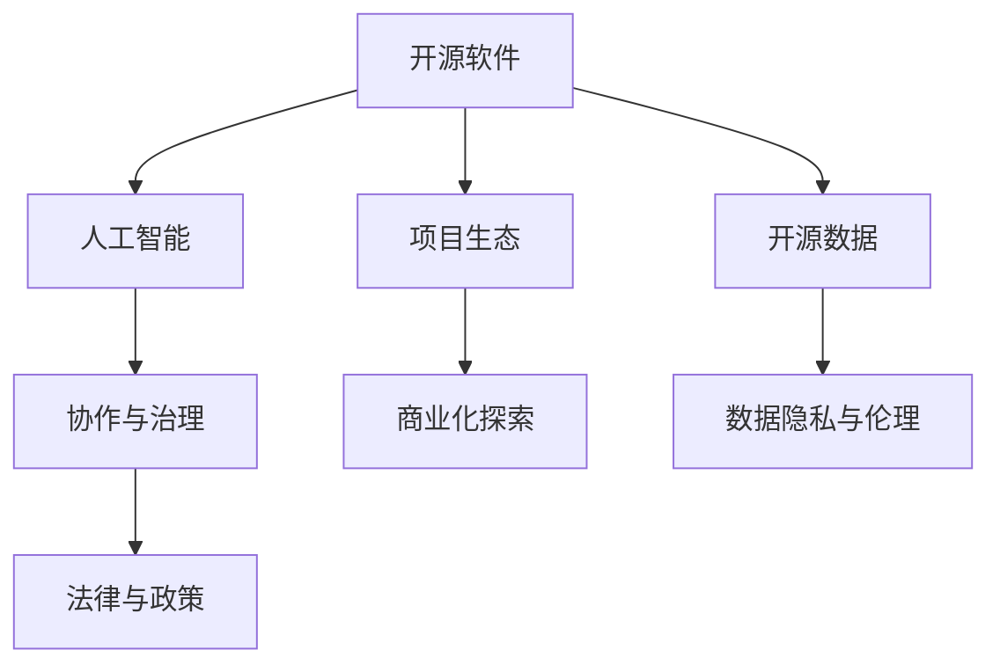

                 

# 开源运动与AI发展:机遇与挑战

## 1. 背景介绍

### 1.1 问题由来
开源运动（Open Source Movement）与人工智能（AI）的发展密切相关，两者相互促进，共同推动了技术进步和社会变革。开源软件和数据资源为AI研究提供了强大的工具和数据支持，而AI技术的不断突破，又进一步激发了开源社区的创新活力。然而，开源运动在AI发展过程中也面临诸多挑战，如版权问题、数据隐私、商业化探索等。本文将系统探讨开源运动与AI发展的机遇与挑战，为未来这一领域的可持续发展提供参考。

### 1.2 问题核心关键点
- **开源资源利用**：开源软件和数据如何被AI研究有效利用，以加速技术创新。
- **数据隐私与伦理**：在开源AI项目中如何处理数据隐私和伦理问题，确保数据使用的合法性和道德性。
- **商业模式探索**：开源AI项目如何探索商业化路径，同时保持其开放性和社区的参与度。
- **协作与治理**：开源社区如何通过合理的治理机制，促进跨组织、跨领域的协作，提升AI项目效率和质量。
- **法律与政策**：开源AI项目面临的法律与政策挑战，如知识产权保护、数据跨境传输等。

## 2. 核心概念与联系

### 2.1 核心概念概述

为更好地理解开源运动与AI发展的机遇与挑战，本节将介绍几个密切相关的核心概念：

- **开源软件**：指在开放源代码许可证下发布的、免费向公众提供使用的软件。用户可以自由地使用、修改和分发源代码，推动了软件行业的快速发展和技术创新。

- **开源数据**：指以开放许可证的形式提供的数据集，用户可以自由地访问、使用和修改数据，促进了数据驱动的AI研究。

- **人工智能**：指利用算法和计算能力，使计算机模拟人类智能的技术，包括机器学习、深度学习等子领域。

- **协作与治理**：指开源社区如何通过组织结构、规则流程等手段，促进项目成员之间的协作，同时确保项目的健康稳定发展。

- **法律与政策**：指与开源运动和AI发展相关的法律框架和政策环境，如知识产权法、数据保护法等。

这些核心概念之间的逻辑关系可以通过以下Mermaid流程图来展示：



这个流程图展示了几者之间的相互联系：

1. 开源软件和开源数据为人工智能提供了基础技术支持和数据资源。
2. 人工智能技术的进步推动了开源软件和数据的发展。
3. 协作与治理是开源项目成功的关键，促进了高效的项目管理和社区参与。
4. 法律与政策环境对开源项目和AI研究有着重要影响。
5. 开源项目生态和商业化探索是开源运动在AI领域的两个重要方向。

## 3. 核心算法原理 & 具体操作步骤
### 3.1 算法原理概述

开源运动与AI发展的核心在于通过开放源代码和数据，推动技术的共享和合作，加速技术创新和应用落地。其核心思想是：

1. **开放与共享**：通过开放源代码和数据，使全球的研究者能够访问和利用最先进的工具和技术，促进技术共享和合作。
2. **协作与创新**：在开源社区中，通过协作和贡献机制，吸引全球的人才和资源，共同推动技术创新。
3. **可重复性与验证**：开源项目可重复性强，易于验证和复现，提高研究可信度。

### 3.2 算法步骤详解

开源运动与AI发展的大致流程可以分为以下几个关键步骤：

**Step 1: 开源项目筹备**
- 定义项目目标和范围，选择合适的开源许可证（如GPL、Apache等）。
- 创建项目组织结构，确定项目维护者和贡献者规则。

**Step 2: 数据与算法开源**
- 收集和整理项目所需的开源数据，发布到公共数据存储库（如GitHub等）。
- 开发和实现AI算法模型，编写清晰的文档和示例代码，方便其他开发者使用。

**Step 3: 社区协作与贡献**
- 通过代码审查、问题跟踪、贡献者管理等机制，促进社区成员之间的协作和贡献。
- 鼓励社区成员提交修复、新特性、优化建议等，提升项目质量和多样性。

**Step 4: 商业化探索**
- 在开源项目的基础上，探索商业化路径，如建立商业模式、成立商业公司等。
- 保持开源项目的开放性和社区的参与度，确保商业化探索不会偏离项目的初衷。

**Step 5: 法律与政策合规**
- 遵守开源许可证的要求，确保开源项目的合法合规。
- 处理数据隐私、版权保护等问题，确保数据使用的合法性和道德性。

### 3.3 算法优缺点

开源运动与AI发展具有以下优点：

1. **加速技术创新**：开放源代码和数据，吸引全球人才和资源，加速技术创新和应用落地。
2. **推动技术共享**：通过开源项目，使技术知识在全球范围内共享，减少重复劳动。
3. **促进社区参与**：开源项目鼓励社区成员贡献，提升项目的质量和多样性。
4. **提升研究可信度**：开源项目可重复性强，易于验证和复现，提高研究可信度。

同时，该方法也存在一定的局限性：

1. **资源投入高**：开源项目通常需要大量的资金、时间和人力投入，资源投入高。
2. **数据隐私风险**：开源数据可能包含敏感信息，处理不当易引发隐私风险。
3. **法律与政策问题**：开源项目涉及法律和政策问题，需要遵守相关规定。
4. **商业化挑战**：开源项目与商业公司之间存在利益冲突，商业化探索难度大。

尽管存在这些局限性，但就目前而言，开源运动与AI发展的大趋势已经显现，相信未来将有更多的成功案例和创新应用。

### 3.4 算法应用领域

开源运动与AI发展在多个领域中已经取得了显著的成果：

1. **自然语言处理（NLP）**：开源语言模型如BERT、GPT等，基于开源数据集如IMDB、Yelp等，实现了NLP任务的突破性进展。
2. **计算机视觉（CV）**：开源数据集如CIFAR、ImageNet等，结合开源模型如TensorFlow、PyTorch，推动了CV技术的快速发展。
3. **机器人与自动化**：开源项目如Robot Operating System（ROS），通过开放的接口和工具，促进了机器人技术的普及和应用。
4. **医疗健康**：开源医疗数据集如MIMIC、Genomics等，结合开源AI模型，推动了医疗数据的分析和应用。

这些领域中的成功案例展示了开源运动与AI发展的巨大潜力，未来将在更多领域得到应用和推广。

## 4. 数学模型和公式 & 详细讲解 & 举例说明

### 4.1 数学模型构建

本节将使用数学语言对开源运动与AI发展的基本模型进行更加严格的刻画。

设开源AI项目 $P$，其开源数据集为 $D=\{d_1,d_2,\cdots,d_N\}$，算法模型为 $M=\{M_1,M_2,\cdots,M_n\}$，其中 $M_i$ 为第 $i$ 个AI模型。设 $C$ 为社区成员集合，$C=\{c_1,c_2,\cdots,c_M\}$，其中 $c_i$ 为第 $i$ 个社区成员。

定义开源项目的总效益 $B$，包括技术创新效益 $B_{\text{innovation}}$、社区参与效益 $B_{\text{contribution}}$ 和商业化效益 $B_{\text{commercialization}}$。

$$
B = B_{\text{innovation}} + B_{\text{contribution}} + B_{\text{commercialization}}
$$

技术创新效益 $B_{\text{innovation}}$ 可以表示为模型改进的平均速度和质量：

$$
B_{\text{innovation}} = \frac{1}{N} \sum_{i=1}^N f(d_i,M)
$$

其中 $f(d_i,M)$ 为模型 $M$ 在数据集 $d_i$ 上的性能提升。

社区参与效益 $B_{\text{contribution}}$ 可以表示为社区成员的平均贡献：

$$
B_{\text{contribution}} = \frac{1}{M} \sum_{i=1}^M g(c_i)
$$

其中 $g(c_i)$ 为社区成员 $c_i$ 对项目的贡献度。

商业化效益 $B_{\text{commercialization}}$ 可以表示为商业化项目带来的收益：

$$
B_{\text{commercialization}} = h(P_{\text{commercial}},P_{\text{open}})
$$

其中 $h$ 为商业化项目与开源项目的收益函数，$P_{\text{commercial}}$ 为商业化项目，$P_{\text{open}}$ 为开源项目。

### 4.2 公式推导过程

以下我们以自然语言处理（NLP）任务为例，推导开源AI项目的效益函数及其优化过程。

假设开源项目 $P$ 在NLP任务上的开源数据集为 $D=\{(x_i,y_i)\}_{i=1}^N$，模型 $M$ 在输入 $x$ 上的输出为 $\hat{y}=M(x) \in \mathcal{Y}$，真实标签为 $y \in \mathcal{Y}$。定义模型 $M$ 在数据集 $D$ 上的准确率为 $R$：

$$
R = \frac{1}{N} \sum_{i=1}^N \mathbb{I}(\hat{y_i} = y_i)
$$

其中 $\mathbb{I}$ 为指示函数，$1$ 表示 $\hat{y_i} = y_i$ 成立，$0$ 表示不成立。

假设社区成员 $c_i$ 对项目的贡献度为 $g(c_i)$，贡献度与提交的代码行数成正比：

$$
g(c_i) = k \times \text{code\_lines}(c_i)
$$

其中 $k$ 为贡献度系数，$\text{code\_lines}(c_i)$ 为社区成员 $c_i$ 提交的代码行数。

假设商业化项目带来的收益为 $h(P_{\text{commercial}},P_{\text{open}})$，可以通过以下公式计算：

$$
h(P_{\text{commercial}},P_{\text{open}}) = R_{\text{commercial}} \times V
$$

其中 $R_{\text{commercial}}$ 为商业化项目的准确率，$V$ 为商业化项目的市场价值。

将这些效益函数代入总效益 $B$，得到：

$$
B = \frac{1}{N} \sum_{i=1}^N f(d_i,M) + \frac{1}{M} \sum_{i=1}^M k \times \text{code\_lines}(c_i) + R_{\text{commercial}} \times V
$$

通过最大化总效益 $B$，可以找到最优的开源AI项目策略。

### 4.3 案例分析与讲解

以开源语言模型BERT为例，分析其在开源运动与AI发展中的应用。

BERT 在自然语言处理（NLP）领域取得了突破性进展，得益于其在大规模无标注文本数据上进行预训练，学习到丰富的语言表示。BERT 模型通过开源数据集，如 Wikipedia 和 BookCorpus，在预训练过程中获得了广泛的语料支持，极大地提高了模型的泛化能力。

在微调过程中，研究人员通过开源社区的贡献，不断改进 BERT 的模型架构和训练方法。例如，社区成员开发了基于 BERT 的情感分析模型，并在开源数据集上进行验证，验证结果表明该模型在情感分类任务上表现优异。

此外，研究人员还探索了 BERT 的商业化路径，将 BERT 应用于搜索引擎、智能客服等场景，建立了多个开源商业项目。这些商业项目不仅带来了可观的经济收益，还促进了 BERT 模型的进一步发展，形成了良性循环。

## 5. 项目实践：代码实例和详细解释说明

### 5.1 开发环境搭建

在进行开源AI项目开发前，我们需要准备好开发环境。以下是使用Python进行PyTorch开发的环境配置流程：

1. 安装Anaconda：从官网下载并安装Anaconda，用于创建独立的Python环境。

2. 创建并激活虚拟环境：
```bash
conda create -n pytorch-env python=3.8 
conda activate pytorch-env
```

3. 安装PyTorch：根据CUDA版本，从官网获取对应的安装命令。例如：
```bash
conda install pytorch torchvision torchaudio cudatoolkit=11.1 -c pytorch -c conda-forge
```

4. 安装Transformer库：
```bash
pip install transformers
```

5. 安装各类工具包：
```bash
pip install numpy pandas scikit-learn matplotlib tqdm jupyter notebook ipython
```

完成上述步骤后，即可在`pytorch-env`环境中开始开源AI项目开发。

### 5.2 源代码详细实现

下面我们以开源自然语言处理（NLP）项目为例，给出使用Transformers库进行开源项目开发的PyTorch代码实现。

首先，定义NLP任务的数据处理函数：

```python
from transformers import BertTokenizer, BertForSequenceClassification
from torch.utils.data import Dataset, DataLoader
import torch

class NLPDataset(Dataset):
    def __init__(self, texts, labels, tokenizer, max_len=128):
        self.texts = texts
        self.labels = labels
        self.tokenizer = tokenizer
        self.max_len = max_len
        
    def __len__(self):
        return len(self.texts)
    
    def __getitem__(self, item):
        text = self.texts[item]
        label = self.labels[item]
        
        encoding = self.tokenizer(text, return_tensors='pt', max_length=self.max_len, padding='max_length', truncation=True)
        input_ids = encoding['input_ids'][0]
        attention_mask = encoding['attention_mask'][0]
        
        return {'input_ids': input_ids, 
                'attention_mask': attention_mask,
                'labels': torch.tensor(label, dtype=torch.long)}
```

然后，定义模型和优化器：

```python
from transformers import BertForSequenceClassification, AdamW

model = BertForSequenceClassification.from_pretrained('bert-base-cased', num_labels=2)

optimizer = AdamW(model.parameters(), lr=2e-5)
```

接着，定义训练和评估函数：

```python
from tqdm import tqdm

device = torch.device('cuda') if torch.cuda.is_available() else torch.device('cpu')
model.to(device)

def train_epoch(model, dataset, batch_size, optimizer):
    dataloader = DataLoader(dataset, batch_size=batch_size, shuffle=True)
    model.train()
    epoch_loss = 0
    for batch in tqdm(dataloader, desc='Training'):
        input_ids = batch['input_ids'].to(device)
        attention_mask = batch['attention_mask'].to(device)
        labels = batch['labels'].to(device)
        model.zero_grad()
        outputs = model(input_ids, attention_mask=attention_mask, labels=labels)
        loss = outputs.loss
        epoch_loss += loss.item()
        loss.backward()
        optimizer.step()
    return epoch_loss / len(dataloader)

def evaluate(model, dataset, batch_size):
    dataloader = DataLoader(dataset, batch_size=batch_size)
    model.eval()
    preds, labels = [], []
    with torch.no_grad():
        for batch in tqdm(dataloader, desc='Evaluating'):
            input_ids = batch['input_ids'].to(device)
            attention_mask = batch['attention_mask'].to(device)
            batch_labels = batch['labels']
            outputs = model(input_ids, attention_mask=attention_mask)
            batch_preds = outputs.logits.argmax(dim=2).to('cpu').tolist()
            batch_labels = batch_labels.to('cpu').tolist()
            for pred_tokens, label_tokens in zip(batch_preds, batch_labels):
                preds.append(pred_tokens[:len(label_tokens)])
                labels.append(label_tokens)
                
    print(classification_report(labels, preds))
```

最后，启动训练流程并在测试集上评估：

```python
epochs = 5
batch_size = 16

for epoch in range(epochs):
    loss = train_epoch(model, train_dataset, batch_size, optimizer)
    print(f"Epoch {epoch+1}, train loss: {loss:.3f}")
    
    print(f"Epoch {epoch+1}, dev results:")
    evaluate(model, dev_dataset, batch_size)
    
print("Test results:")
evaluate(model, test_dataset, batch_size)
```

以上就是使用PyTorch对开源NLP项目进行开发的完整代码实现。可以看到，得益于Transformers库的强大封装，我们可以用相对简洁的代码完成模型的加载和训练。

### 5.3 代码解读与分析

让我们再详细解读一下关键代码的实现细节：

**NLPDataset类**：
- `__init__`方法：初始化文本、标签、分词器等关键组件。
- `__len__`方法：返回数据集的样本数量。
- `__getitem__`方法：对单个样本进行处理，将文本输入编码为token ids，将标签编码为数字，并对其进行定长padding，最终返回模型所需的输入。

**训练和评估函数**：
- 使用PyTorch的DataLoader对数据集进行批次化加载，供模型训练和推理使用。
- 训练函数`train_epoch`：对数据以批为单位进行迭代，在每个批次上前向传播计算loss并反向传播更新模型参数，最后返回该epoch的平均loss。
- 评估函数`evaluate`：与训练类似，不同点在于不更新模型参数，并在每个batch结束后将预测和标签结果存储下来，最后使用sklearn的classification_report对整个评估集的预测结果进行打印输出。

**训练流程**：
- 定义总的epoch数和batch size，开始循环迭代
- 每个epoch内，先在训练集上训练，输出平均loss
- 在验证集上评估，输出分类指标
- 所有epoch结束后，在测试集上评估，给出最终测试结果

可以看到，PyTorch配合Transformers库使得开源NLP项目的代码实现变得简洁高效。开发者可以将更多精力放在数据处理、模型改进等高层逻辑上，而不必过多关注底层的实现细节。

当然，工业级的系统实现还需考虑更多因素，如模型的保存和部署、超参数的自动搜索、更灵活的任务适配层等。但核心的开源范式基本与此类似。

## 6. 实际应用场景
### 6.1 智能客服系统

开源AI项目在智能客服系统中的应用前景广阔。传统客服系统依赖大量人工处理，成本高且效率低。开源AI项目可以基于开源语言模型和数据，构建智能客服机器人，实现7x24小时服务，提升客户咨询体验。

具体而言，可以通过收集企业内部的客服对话记录，将其整理为开源数据集，然后在开源语言模型基础上进行微调，训练出一个能够理解用户意图、自动回复问题的智能客服系统。该系统可以不断学习和优化，适应不同用户群体的需求，提升客服效率和质量。

### 6.2 金融舆情监测

开源AI项目在金融舆情监测中的应用也有很大潜力。金融行业需要实时监测市场舆情，以应对潜在的风险。开源AI项目可以基于开源数据集和开源模型，构建舆情监测系统，实现对金融舆情的实时分析和预警。

具体而言，可以收集金融领域的新闻、评论、报告等文本数据，并在开源模型上进行微调，训练出一个能够自动识别舆情方向、情绪倾向的系统。系统可以根据舆情变化，自动生成报告和预警，帮助金融机构及时应对市场波动。

### 6.3 个性化推荐系统

开源AI项目在个性化推荐系统中的应用也颇具前景。当前的推荐系统依赖用户行为数据，难以满足用户多样化的需求。开源AI项目可以通过开源数据集和开源模型，构建个性化推荐系统，根据用户兴趣和历史行为，推荐个性化的商品或内容。

具体而言，可以收集用户浏览、点击、评价等行为数据，并在开源模型上进行微调，训练出一个能够根据用户兴趣和行为推荐商品的系统。系统可以根据用户实时反馈，不断优化推荐策略，提升推荐效果。

### 6.4 未来应用展望

展望未来，开源运动与AI发展将在更多领域得到应用，为各行各业带来变革性影响。

在智慧医疗领域，开源AI项目可以基于开源医疗数据集和开源模型，构建智能诊断和辅助系统，提升医疗服务的智能化水平，辅助医生诊疗，加速新药开发进程。

在智能教育领域，开源AI项目可以基于开源教育数据集和开源模型，构建智能教学系统，根据学生的学习行为和兴趣，推荐个性化的学习内容，因材施教，促进教育公平，提高教学质量。

在智慧城市治理中，开源AI项目可以基于开源城市数据集和开源模型，构建智能城市管理系统，实现对城市事件的实时监测和预警，提高城市管理的自动化和智能化水平，构建更安全、高效的未来城市。

此外，在企业生产、社会治理、文娱传媒等众多领域，开源AI项目也将不断涌现，为传统行业数字化转型升级提供新的技术路径。相信随着技术的日益成熟，开源运动与AI发展必将在构建人机协同的智能时代中扮演越来越重要的角色。

## 7. 工具和资源推荐
### 7.1 学习资源推荐

为了帮助开发者系统掌握开源运动与AI发展的理论基础和实践技巧，这里推荐一些优质的学习资源：

1. 《深入浅出TensorFlow》系列博文：由TensorFlow官方和社区成员撰写，详细介绍了TensorFlow的使用和开发技巧。

2. 《Python深度学习》课程：由DeepLearning.ai提供，涵盖了从基础到高级的深度学习知识，适合初学者和进阶开发者。

3. 《TensorFlow实战》书籍：TensorFlow官方书籍，介绍了TensorFlow在实际项目中的应用案例，是动手实践的好资源。

4. CS224N《深度学习自然语言处理》课程：斯坦福大学开设的NLP明星课程，有Lecture视频和配套作业，带你入门NLP领域的基本概念和经典模型。

5. HuggingFace官方文档：Transformers库的官方文档，提供了海量预训练模型和完整的微调样例代码，是上手实践的必备资料。

通过对这些资源的学习实践，相信你一定能够快速掌握开源运动与AI发展的精髓，并用于解决实际的AI问题。

### 7.2 开发工具推荐

高效的开发离不开优秀的工具支持。以下是几款用于开源AI项目开发的常用工具：

1. PyTorch：基于Python的开源深度学习框架，灵活动态的计算图，适合快速迭代研究。大部分预训练语言模型都有PyTorch版本的实现。

2. TensorFlow：由Google主导开发的开源深度学习框架，生产部署方便，适合大规模工程应用。同样有丰富的预训练语言模型资源。

3. Transformers库：HuggingFace开发的NLP工具库，集成了众多SOTA语言模型，支持PyTorch和TensorFlow，是进行开源项目开发的利器。

4. Weights & Biases：模型训练的实验跟踪工具，可以记录和可视化模型训练过程中的各项指标，方便对比和调优。与主流深度学习框架无缝集成。

5. Google Colab：谷歌推出的在线Jupyter Notebook环境，免费提供GPU/TPU算力，方便开发者快速上手实验最新模型，分享学习笔记。

合理利用这些工具，可以显著提升开源AI项目开发的效率，加快创新迭代的步伐。

### 7.3 相关论文推荐

开源运动与AI发展源于学界的持续研究。以下是几篇奠基性的相关论文，推荐阅读：

1. Deep learning with large expressive neural networks：提出深度学习模型，通过多层神经网络结构实现复杂的非线性映射，奠定了深度学习的基础。

2. Learning word embeddings efficiently with negative sampling：提出Word2Vec模型，使用负采样技术高效训练词向量，推动了自然语言处理的发展。

3. ImageNet classification with deep convolutional neural networks：提出CNN模型，通过卷积神经网络结构实现图像分类任务，取得了SOTA结果。

4. Google's Neural Machine Translation System：介绍谷歌的神经机器翻译系统，通过使用深度学习模型实现高质量的翻译任务。

5. Distributed deep learning with TensorFlow：介绍TensorFlow的分布式训练机制，实现了高效的并行计算，推动了深度学习在大型数据集上的应用。

这些论文代表了大规模语言模型与开源运动发展的关键节点，通过学习这些前沿成果，可以帮助研究者把握学科前进方向，激发更多的创新灵感。

## 8. 总结：未来发展趋势与挑战

### 8.1 总结

本文对开源运动与AI发展的机遇与挑战进行了全面系统的介绍。首先阐述了开源运动与AI发展的重要性和基本原理，明确了开源运动在推动技术共享、促进协作和创新方面的价值。其次，从理论到实践，详细讲解了开源AI项目的开发流程和关键步骤，给出了开源NLP项目的完整代码实现。同时，本文还探讨了开源AI项目在智能客服、金融舆情、个性化推荐等实际应用场景中的应用前景，展示了开源运动与AI发展的广阔潜力。此外，本文精选了开源运动与AI发展的各类学习资源，力求为读者提供全方位的技术指引。

通过本文的系统梳理，可以看到，开源运动与AI发展已经成为推动技术进步的重要手段，为AI研究者和开发者提供了强大的工具和数据支持。未来，随着技术的不断进步和开源社区的壮大，开源运动与AI发展必将在更多领域得到应用和推广，为各行各业带来变革性影响。

### 8.2 未来发展趋势

展望未来，开源运动与AI发展将在多个方面呈现新的趋势：

1. **开源工具和框架的成熟**：开源AI项目将更加依赖成熟、稳定的工具和框架，如TensorFlow、PyTorch等，提升开发效率和模型精度。

2. **数据共享与合作**：开源数据集和开源模型将进一步开放，促进跨领域、跨组织的数据共享与合作，推动AI技术的快速迭代和应用落地。

3. **AI技术的泛化与应用**：开源AI项目将更加注重模型在多个任务和场景中的泛化能力，提升AI技术的实际应用价值。

4. **模型透明性与可解释性**：开源AI项目将更加注重模型的透明性与可解释性，确保模型决策过程的可理解和可解释。

5. **隐私保护与伦理合规**：开源AI项目将更加重视数据隐私和伦理合规问题，确保数据使用的合法性和道德性。

6. **跨模态融合**：开源AI项目将更加注重跨模态数据融合，提升模型的综合理解能力，推动AI技术在多模态场景中的应用。

以上趋势凸显了开源运动与AI发展的广阔前景，相信未来将有更多的成功案例和创新应用。

### 8.3 面临的挑战

尽管开源运动与AI发展取得了显著成果，但在迈向更加智能化、普适化应用的过程中，它仍面临诸多挑战：

1. **资源投入高**：开源AI项目通常需要大量的资金、时间和人力投入，资源投入高。

2. **数据隐私风险**：开源数据可能包含敏感信息，处理不当易引发隐私风险。

3. **法律与政策问题**：开源AI项目涉及法律和政策问题，需要遵守相关规定。

4. **商业化挑战**：开源项目与商业公司之间存在利益冲突，商业化探索难度大。

5. **技术成熟度**：开源AI项目的技术成熟度仍需进一步提高，模型性能和稳定性有待提升。

尽管存在这些挑战，但随着开源运动与AI研究的不断深入，相信未来将有更多突破和创新，解决现有问题，推动AI技术的进一步发展。

### 8.4 研究展望

未来，开源运动与AI发展需要解决以下几个方面的问题：

1. **提高开源数据的开放性**：推动更多的开源数据集和开源模型开放，促进跨领域、跨组织的数据共享与合作。

2. **提升模型的可解释性**：开发更透明、可解释的AI模型，确保模型决策过程的可理解和可解释。

3. **加强隐私保护**：开发隐私保护技术，确保数据使用的合法性和道德性。

4. **探索商业化路径**：探索开源AI项目的商业化路径，实现技术落地和价值转化。

5. **推动跨模态融合**：开发跨模态数据融合技术，提升模型的综合理解能力，推动AI技术在多模态场景中的应用。

这些研究方向将引领开源运动与AI发展走向更高的台阶，为构建安全、可靠、可解释、可控的智能系统铺平道路。面向未来，开源运动与AI发展需要更多的跨学科合作和政策支持，才能真正实现技术共享和协同创新。

## 9. 附录：常见问题与解答

**Q1：开源软件和开源数据如何被AI研究有效利用？**

A: 开源软件和开源数据为AI研究提供了强大的工具和数据支持，加速了AI技术的开发和应用。研究者可以通过开源软件和数据集，方便地进行模型开发、训练和测试，避免了从头开发所需的高昂成本和重复劳动。同时，开源社区的合作与贡献机制，也为研究者提供了丰富的资源和支持。

**Q2：开源AI项目如何处理数据隐私和伦理问题？**

A: 开源AI项目处理数据隐私和伦理问题的方法包括：
1. 在数据集发布时，使用严格的隐私保护措施，如去标识化、数据匿名化等。
2. 明确数据使用范围，确保数据使用的合法性和道德性。
3. 建立数据使用协议，规范数据访问和共享行为。
4. 引入伦理委员会，监督和审查项目中涉及的数据隐私和伦理问题。

**Q3：开源AI项目如何探索商业化路径？**

A: 开源AI项目探索商业化路径的方法包括：
1. 建立商业公司，将开源项目商业化，开发商业产品。
2. 提供API接口和开发工具，促进开源项目的商业应用。
3. 通过技术授权、合作研发等方式，实现开源项目的商业化。
4. 开发开源和商业两种版本，以满足不同用户的需求。

**Q4：开源AI项目如何保持社区的参与度？**

A: 开源AI项目保持社区参与度的方法包括：
1. 提供贡献指南和奖励机制，鼓励社区成员提交代码、参与讨论。
2. 定期组织线上线下活动，促进社区成员的互动和交流。
3. 公开项目进展和成果，提升社区成员的归属感和自豪感。
4. 引入开源治理机制，规范社区成员的行为和贡献。

**Q5：开源AI项目如何实现跨模态融合？**

A: 开源AI项目实现跨模态融合的方法包括：
1. 开发跨模态数据融合技术，如多模态特征提取、多模态联合训练等。
2. 引入跨模态数据集，提供多模态数据的访问和利用。
3. 与跨模态技术开发者合作，开发跨模态应用场景。
4. 通过API接口，实现不同模态数据的整合和协同建模。

这些问题的解答展示了开源AI项目在实际应用中的关键挑战和解决方案，帮助开发者更好地理解开源运动与AI发展的机遇与挑战。

