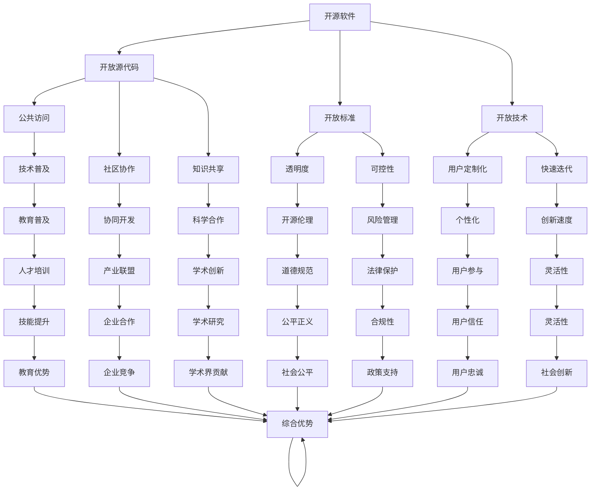

                 

# 开源运动的社会影响:知识共享和技术普惠

## 1. 背景介绍

随着信息时代的到来，开源运动已经逐渐成为推动科技创新、知识共享和社会变革的重要力量。开源软件、开源硬件、开源数据等形式的创新，不仅极大推动了科技产业的进步，也正在深刻改变人们的工作方式、教育模式、社会治理等各个方面。本文将深入探讨开源运动的社会影响，重点关注其在知识共享和技术普惠方面的表现。

## 2. 核心概念与联系

### 2.1 核心概念概述

开源运动（Open Source Movement），是指通过开放源代码、开放标准、开放技术等形式，使知识和技术资源共享和普及的一种社会运动。这一运动的核心在于打破知识壁垒，促进知识的自由流动，从而推动科技进步和社会创新。

在开源运动中，以下是几个关键概念：

- **开源软件**：指源代码公开可访问的软件，包括但不限于操作系统、数据库、中间件等。
- **开源硬件**：指设计公开、制造开放、组件可替换的硬件设备。
- **开源数据**：指可以被任何人自由使用的数据集，包括公共数据集、学术数据集等。

这些概念通过开源许可协议（如Apache、MIT、GPL等）得以实现，确保任何人都能在遵守协议的前提下使用、修改和分享源代码、设计和数据。

### 2.2 核心概念原理和架构的 Mermaid 流程图



### 2.3 核心概念的联系

开源运动通过开放的源代码、标准和技术，打破了传统的知识产权壁垒，使得知识共享和技术普惠成为可能。这不仅降低了技术创新的门槛，也推动了科技与社会的深度融合，促进了知识的广泛传播和技术的深度应用。

开源运动的核心在于以下几点：

- **知识共享**：源代码的公开使得任何人都可以自由使用、修改和分享，大大促进了知识共享和传播。
- **技术普惠**：开放标准和技术使得技术资源可以无障碍地被普及和应用，使得社会各阶层都能够平等接触到最新的技术成果。
- **社区协作**：开源项目的协作开发模式，聚集了全球各地的开发者和用户，共同推动技术的进步和应用。

这些因素共同构成了开源运动的社会影响基础，使得其在推动知识共享和技术普惠方面具有独特的优势。

## 3. 核心算法原理 & 具体操作步骤

### 3.1 算法原理概述

开源运动的知识共享和技术普惠主要通过以下几个步骤实现：

1. **开放源代码**：将软件、硬件和数据的源代码开放给所有人，使得任何人都可以自由访问和使用。
2. **社区协作**：通过开放平台和协作工具，使得开发者、用户和研究者能够共同参与到项目开发和应用中，形成合作创新。
3. **开放标准**：制定和推广开放的技术标准，确保不同系统和设备之间的兼容性和互操作性。
4. **用户参与**：鼓励用户对源代码和设计进行反馈和改进，推动技术的迭代和优化。

### 3.2 算法步骤详解

以下是一个简化的开源运动操作步骤：

1. **项目启动**：选择具有社会价值或商业潜力的项目，明确项目目标和开放标准。
2. **开放源代码**：将项目的源代码、设计文档和技术规范公开，确保所有人可以自由访问和使用。
3. **社区协作**：搭建协作平台，如GitHub、Apache等，使开发者和用户可以自由提交代码、问题和改进建议。
4. **推广应用**：通过各种渠道推广项目，吸引更多开发者和用户参与，形成生态系统。
5. **迭代优化**：根据用户反馈和技术进展，持续优化和改进项目，推动技术进步。

### 3.3 算法优缺点

开源运动的优点在于：

- **降低创新门槛**：开源模式降低了技术创新的门槛，使得任何人都可以参与到项目开发中，推动技术进步。
- **促进知识共享**：开放源代码和设计，使得知识可以自由流动，推动知识的广泛传播和应用。
- **增强协作效率**：社区协作模式提高了技术创新的效率，使得项目可以快速迭代和优化。

然而，开源运动也存在一些缺点：

- **风险管理**：开源项目缺乏商业化激励，可能面临资金短缺和资源匮乏的问题。
- **知识产权问题**：开源许可协议可能与商业化需求冲突，知识产权保护也存在挑战。
- **社区管理**：开源项目的社区管理难度大，需要制定明确的规则和标准，确保项目的健康发展。

### 3.4 算法应用领域

开源运动在多个领域都得到了广泛应用，以下是一些典型应用领域：

- **软件开发**：开源操作系统（如Linux）、中间件（如Apache）、编程语言（如Python）等。
- **硬件设计**：开源硬件（如Arduino）、芯片设计（如RISC-V）等。
- **数据科学**：开源数据集（如TensorFlow、Kaggle）、科学计算工具（如NumPy、SciPy）等。
- **教育领域**：开源教材（如Khan Academy）、在线学习平台（如Coursera）等。
- **社会治理**：开源城市规划（如OpenStreetMap）、社会管理平台（如Airtable）等。

## 4. 数学模型和公式 & 详细讲解 & 举例说明

### 4.1 数学模型构建

在开源运动中，数学模型和公式的构建主要是为了优化和评估项目的性能和影响。以下是一些常见的数学模型和公式：

- **Git网络模型**：用于描述开源项目的贡献者网络，计算项目的合作度。
- **代码复杂度模型**：用于衡量代码的复杂度和可维护性，优化代码质量。
- **用户参与度模型**：用于衡量用户对项目的参与度，评估项目的普及和影响力。

### 4.2 公式推导过程

以下是一些常见数学公式的推导过程：

- **Git网络模型**：
  $$
  C_i = \sum_{j=1}^n (C_{i,j})
  $$
  其中，$C_i$ 表示项目贡献者 $i$ 的贡献度，$C_{i,j}$ 表示 $i$ 和 $j$ 之间的合作次数。
  
- **代码复杂度模型**：
  $$
  S = \sum_{i=1}^n (C_i)
  $$
  其中，$S$ 表示项目代码的复杂度，$C_i$ 表示第 $i$ 个代码文件的复杂度。

- **用户参与度模型**：
  $$
  P = \frac{\sum_{i=1}^n (A_i)}{\sum_{i=1}^n (T_i)}
  $$
  其中，$P$ 表示用户参与度，$A_i$ 表示第 $i$ 个用户提交的贡献次数，$T_i$ 表示第 $i$ 个用户访问项目次数。

### 4.3 案例分析与讲解

以TensorFlow为例，分析其开源模式的成功案例：

TensorFlow作为一款开源深度学习框架，通过其开放源代码、社区协作和用户参与，实现了快速的技术进步和广泛的应用。TensorFlow的成功得益于以下几点：

- **开放源代码**：TensorFlow的源代码公开，使得任何人都可以自由访问和使用，大大降低了技术入门的门槛。
- **社区协作**：TensorFlow拥有庞大的开发者社区，通过GitHub等平台，开发者可以自由提交代码、问题和改进建议，推动项目快速迭代和优化。
- **用户参与**：TensorFlow的用户遍布全球，通过社区论坛和邮件列表，用户可以自由交流和分享，形成良好的生态系统。

这些因素共同推动了TensorFlow的成功，使其成为当前最流行的深度学习框架之一。

## 5. 项目实践：代码实例和详细解释说明

### 5.1 开发环境搭建

开源项目的开发环境搭建通常包括以下几个步骤：

1. **安装依赖包**：根据项目的需求，安装必要的依赖包，如Python、Git、GitHub等。
2. **搭建开发环境**：使用虚拟环境或Docker等工具，搭建稳定可靠的开发环境。
3. **克隆代码仓库**：通过Git克隆项目的代码仓库，确保能够访问最新的代码和更新。

### 5.2 源代码详细实现

以Apache Kafka为例，分析其开源模式的实现：

1. **项目启动**：Apache Kafka通过社区讨论和投票机制，选择具有社会价值的项目，明确项目的开发目标和开放标准。
2. **开放源代码**：Apache Kafka的源代码和设计文档公开，任何人都可以自由访问和使用。
3. **社区协作**：Apache Kafka通过Apache基金会搭建协作平台，使开发者和用户可以自由提交代码、问题和改进建议。
4. **推广应用**：Apache Kafka通过各种渠道推广项目，吸引更多开发者和用户参与，形成生态系统。
5. **迭代优化**：根据用户反馈和技术进展，Apache Kafka持续优化和改进项目，推动技术进步。

### 5.3 代码解读与分析

以Apache Kafka为例，分析其代码实现的关键点：

1. **模块化设计**：Apache Kafka通过模块化设计，使得代码易于维护和扩展。
2. **高性能架构**：Apache Kafka采用异步消息传递和分布式架构，保证了系统的稳定性和可扩展性。
3. **社区支持**：Apache Kafka通过社区支持，使得项目能够快速迭代和优化。

### 5.4 运行结果展示

以Apache Kafka为例，展示其运行结果：

```bash
$ kafka-topic-create --bootstrap-server localhost:9092 --topic test-topic --partitions 3 --replication-factor 2
```

以上命令创建了一个名为 `test-topic` 的Kafka主题，并设置了3个分区和2个复制因子，成功创建了主题后，可以通过以下命令查看主题信息：

```bash
$ kafka-topic-inspect --bootstrap-server localhost:9092 --topic test-topic
```

以上命令展示了 `test-topic` 主题的详细信息，包括分区、复制因子、领导者等信息。

## 6. 实际应用场景

### 6.1 教育领域

开源运动在教育领域的应用主要体现在以下几个方面：

- **在线教育平台**：开源教材和课程的开发，使得教育资源更加丰富和免费，促进了教育的普及和公平。
- **教育工具**：开源教育工具和平台，如Khan Academy、Coursera等，提供了丰富的在线学习资源，支持全球学生自主学习。
- **数据科学教育**：开源数据集和科学计算工具，如TensorFlow、Kaggle等，为学生提供了实验和实践的机会，提升了学生的实践能力。

### 6.2 社会治理

开源运动在社会治理中的应用主要体现在以下几个方面：

- **公共服务**：开源城市规划和公共管理平台，如OpenStreetMap、Airtable等，提供了丰富的公共服务，支持城市管理和社区治理。
- **社会参与**：开源项目鼓励社区参与，提高了社会参与度，增强了社区自治能力。
- **透明度和信任**：开源项目的透明度和开放性，增强了政府和社会的信任，促进了社会治理的透明化和公开化。

### 6.3 商业领域

开源运动在商业领域的应用主要体现在以下几个方面：

- **开源软件**：开源操作系统（如Linux）、中间件（如Apache）、编程语言（如Python）等，广泛应用于企业IT基础设施中。
- **开源硬件**：开源硬件（如Arduino）、芯片设计（如RISC-V）等，广泛应用于物联网和嵌入式设备中。
- **开源数据**：开源数据集（如TensorFlow、Kaggle）、科学计算工具（如NumPy、SciPy）等，为企业提供了丰富的数据资源和科学计算支持。

## 7. 工具和资源推荐

### 7.1 学习资源推荐

为了帮助开发者系统掌握开源运动的知识和技能，以下是一些优质的学习资源：

1. **Apache软件基金会**：提供了丰富的开源项目和资源，涵盖了开源软件、硬件、数据等多个领域。
2. **GitHub**：全球最大的开源代码托管平台，提供了丰富的开源项目和协作工具。
3. **Khan Academy**：提供了丰富的在线教育资源，支持全球学生自主学习。
4. **Coursera**：提供了大量的在线课程，涵盖了多个领域的知识。
5. **Kaggle**：提供了丰富的开源数据集和竞赛，支持数据科学和机器学习的学习和实践。

### 7.2 开发工具推荐

为了帮助开发者高效开发开源项目，以下是一些常用的开发工具：

1. **Git**：全球最流行的版本控制系统，支持分布式协作开发。
2. **GitHub**：全球最大的开源代码托管平台，提供了丰富的协作工具和社区支持。
3. **Docker**：容器化工具，支持快速构建和部署开源项目。
4. **Jenkins**：开源持续集成和持续部署工具，支持自动化测试和部署。
5. **JIRA**：开源项目管理工具，支持任务跟踪和协作管理。

### 7.3 相关论文推荐

开源运动的发展得益于学界的持续研究。以下是几篇奠基性的相关论文，推荐阅读：

1. **“The Apache Software Foundation: Why It Works”**：分析了Apache软件基金会的成功模式，探讨了开源项目的可持续发展机制。
2. **“Open Source and Open Collaboration: The Economics of Free Software”**：探讨了开源运动的经济模型，分析了开源项目的多样性和复杂性。
3. **“The Influence of Open Source Software on Knowledge Creation and Diffusion”**：分析了开源软件对知识生产和传播的影响，探讨了开源运动的全球化效应。

## 8. 总结：未来发展趋势与挑战

### 8.1 研究成果总结

开源运动在推动知识共享和技术普惠方面，已经取得了显著的成果。通过开放源代码、社区协作和用户参与，开源项目不仅在技术创新上取得了突破，也在社会和教育领域产生了深远影响。

### 8.2 未来发展趋势

开源运动的未来发展趋势主要体现在以下几个方面：

1. **开放标准的普及**：开源标准的推广将进一步促进不同系统和设备之间的互操作性，推动技术的广泛应用。
2. **社区协作的深化**：开源社区的协作模式将进一步深化，形成更加紧密的合作网络。
3. **用户参与的扩展**：开源项目的用户参与度将进一步提升，推动项目的普及和创新。
4. **跨领域融合**：开源运动将与其他技术领域深度融合，推动科技与社会的全面发展。

### 8.3 面临的挑战

尽管开源运动取得了诸多成功，但也面临一些挑战：

1. **知识产权问题**：开源许可协议可能与商业化需求冲突，知识产权保护也存在挑战。
2. **社区管理**：开源项目的社区管理难度大，需要制定明确的规则和标准，确保项目的健康发展。
3. **资金支持**：开源项目缺乏商业化激励，可能面临资金短缺和资源匮乏的问题。
4. **用户参与度**：开源项目的用户参与度可能受限于项目的复杂度和易用性。

### 8.4 研究展望

未来的研究需要在以下几个方面寻求新的突破：

1. **知识产权保护**：探索更加灵活和多样化的开源许可协议，确保知识产权的保护和商业化需求的一致性。
2. **社区管理**：建立更加规范和透明的社区管理机制，确保项目的健康和可持续性。
3. **资金支持**：探索开源项目的商业化路径，吸引更多的资金和资源支持。
4. **用户参与度**：设计更加易用和友好的开源项目，提升用户参与度。

## 9. 附录：常见问题与解答

**Q1：开源运动的主要优势是什么？**

A: 开源运动的主要优势在于：

- **降低创新门槛**：开源模式降低了技术创新的门槛，使得任何人都可以参与到项目开发中，推动技术进步。
- **促进知识共享**：开放源代码和设计，使得知识可以自由流动，推动知识的广泛传播和应用。
- **增强协作效率**：社区协作模式提高了技术创新的效率，使得项目可以快速迭代和优化。

**Q2：开源运动在教育领域的应用主要体现在哪些方面？**

A: 开源运动在教育领域的应用主要体现在以下几个方面：

- **在线教育平台**：开源教材和课程的开发，使得教育资源更加丰富和免费，促进了教育的普及和公平。
- **教育工具**：开源教育工具和平台，如Khan Academy、Coursera等，提供了丰富的在线学习资源，支持全球学生自主学习。
- **数据科学教育**：开源数据集和科学计算工具，如TensorFlow、Kaggle等，为学生提供了实验和实践的机会，提升了学生的实践能力。

**Q3：开源运动在社会治理中的应用主要体现在哪些方面？**

A: 开源运动在社会治理中的应用主要体现在以下几个方面：

- **公共服务**：开源城市规划和公共管理平台，如OpenStreetMap、Airtable等，提供了丰富的公共服务，支持城市管理和社区治理。
- **社会参与**：开源项目鼓励社区参与，提高了社会参与度，增强了社区自治能力。
- **透明度和信任**：开源项目的透明度和开放性，增强了政府和社会的信任，促进了社会治理的透明化和公开化。

**Q4：开源运动的未来发展趋势主要体现在哪些方面？**

A: 开源运动的未来发展趋势主要体现在以下几个方面：

1. **开放标准的普及**：开源标准的推广将进一步促进不同系统和设备之间的互操作性，推动技术的广泛应用。
2. **社区协作的深化**：开源社区的协作模式将进一步深化，形成更加紧密的合作网络。
3. **用户参与的扩展**：开源项目的用户参与度将进一步提升，推动项目的普及和创新。
4. **跨领域融合**：开源运动将与其他技术领域深度融合，推动科技与社会的全面发展。

---

作者：禅与计算机程序设计艺术 / Zen and the Art of Computer Programming

