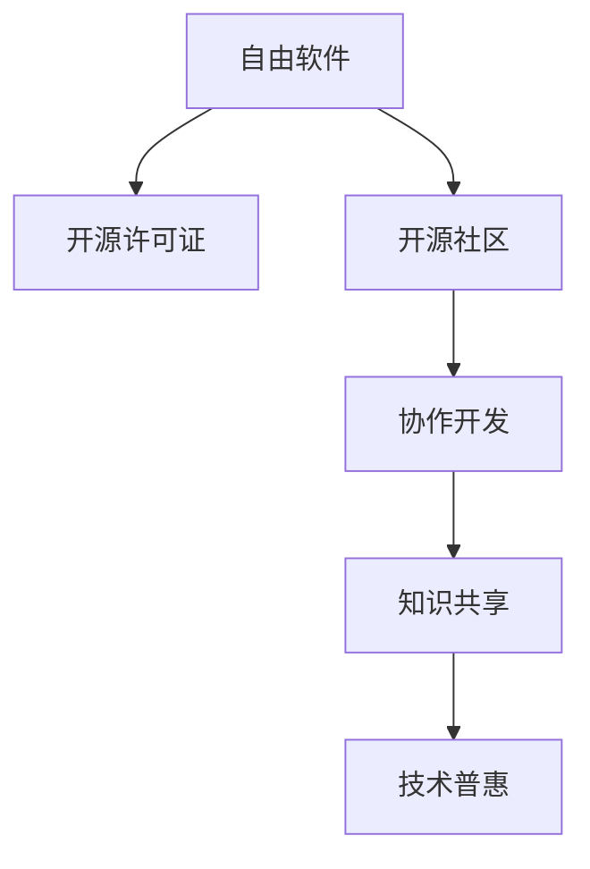

                 

# 开源运动的社会影响:知识共享和技术普惠

## 1. 背景介绍

### 1.1 问题由来
开源运动（Open Source Movement）自1990年代以来，通过引入协作开发、自由软件的分发和使用模式，极大地推动了软件和技术的普及与发展。从Linux操作系统到Apache Web服务器，从Android移动平台到Git版本控制，这些开源项目已经成为当今全球信息技术的基石。开源运动不仅改变了技术产品，也在社会经济、文化教育等诸多领域产生了深远影响。

### 1.2 问题核心关键点
开源运动的核心在于知识共享和技术普惠，通过打破传统闭源模式，促进技术社区的协作与创新，最终实现技术成果的广泛普及和应用。其关键点包括：
1. 自由软件分发：用户可以自由地获取、使用、修改和分发开源软件，无需支付许可费用。
2. 协作开发模式：开发者通过Git等工具在云端协作开发代码，实现资源共享和智慧聚合。
3. 标准化与互操作性：开源标准和协议促进了不同系统、应用和服务的互操作性，提高了生态系统的整体效率。
4. 社区驱动的创新：技术创新由社区成员共同推动，开放透明的讨论环境有助于挖掘和利用更多的创意。

### 1.3 问题研究意义
研究开源运动的社会影响，对于理解开源文化如何塑造技术生态、推动社会进步具有重要意义。开源运动不仅促进了技术知识的全球传播与普及，还推动了企业数字化转型、教育培训、政府治理等多个领域的创新与发展。本文将通过分析开源运动在知识共享和技术普惠方面的表现，揭示其深远的社会影响，并探讨未来发展趋势。

## 2. 核心概念与联系

### 2.1 核心概念概述

开源运动涉及多个关键概念，以下将详细介绍这些概念的含义及其相互关系：

- **自由软件（Free Software）**：指用户可以在遵守自由软件定义的条件下，自由获取、使用、修改和分发软件，最著名的代表包括GNU/Linux操作系统。
- **开源许可证（Open Source License）**：指一套规定软件分发和使用的规则，如GPL、Apache和MIT等，保证用户自由，限制商业化利用。
- **开源社区（Open Source Community）**：由志愿者组成的技术团队，共同维护和开发开源项目，促进技术交流与合作。
- **协作开发（Collaborative Development）**：开发者通过分布式协作，共同完成软件的开发和迭代，利用集体的智慧实现技术创新。
- **知识共享（Knowledge Sharing）**：开源项目促进了技术知识和经验的共享，使技术社区形成知识累积效应。
- **技术普惠（Technology Accessibility）**：开源软件的低成本、易获取性，使得技术知识和服务得以广泛普及。

这些概念通过以下Mermaid流程图展示其联系：

这个流程图展示了开源运动从自由软件的分发到知识共享和技术普惠的全过程。

## 3. 核心算法原理 & 具体操作步骤
### 3.1 算法原理概述

开源运动的成功不仅依赖于技术创新，还需要有一套合理的算法和流程支撑。其核心算法原理可概述为：

1. **版本控制（Version Control）**：如Git等工具提供了代码追踪和版本管理的机制，确保开发者能够高效协作和版本回溯。
2. **贡献管理（Contribution Management）**：开源社区采用如Gerrit、GitHub Issues等工具，管理贡献者、任务和代码审查流程。
3. **质量保障（Quality Assurance）**：持续集成（CI）和持续交付（CD）技术保证了代码质量和快速交付。
4. **社区治理（Community Governance）**：通过代码审查、项目维护等机制，保证开源项目的健康发展和标准化。

这些算法通过以下详细步骤来实现：

### 3.2 算法步骤详解

**步骤1：自由软件的分发**
- 用户可以从GitHub、GitLab等平台获取开源软件，无需支付任何费用。
- 用户根据自由软件定义，自由分发软件和修改源代码。

**步骤2：协作开发模式**
- 开发者使用Git等工具，在云端创建仓库，实时更新代码。
- 代码通过pull request提交修改，并经代码审查通过后合并到主分支。

**步骤3：开源许可证的选择**
- 开源项目根据其自由度选择不同的开源许可证，如GPL、Apache、MIT等。
- 用户在使用开源软件时，需遵守相应的许可证规定，如不得商业化利用。

**步骤4：知识共享与技术普惠**
- 开源社区通过Wiki、邮件列表等平台分享知识和经验。
- 开源软件低成本、易获取，使更多用户和开发者能够受益。

**步骤5：持续集成与质量保障**
- 持续集成（CI）系统如Jenkins、Travis CI等，自动执行构建、测试和部署流程。
- 持续交付（CD）确保软件迭代更新，快速响应市场和用户需求。

### 3.3 算法优缺点

开源运动的优点包括：
1. **成本低廉**：无须支付许可费用，降低了企业和社会的技术应用门槛。
2. **资源丰富**：开源社区汇聚了全球技术人才，开发资源丰富。
3. **创新迅速**：开源模式鼓励创新，技术迭代速度快。
4. **标准化**：开源标准和协议提高了软件和服务的互操作性。
5. **社区驱动**：开发者共同决策，推动技术进步和普及。

然而，开源运动也面临一些挑战：
1. **质量控制**：开源项目的质量依赖于社区的自我监督，存在质量不稳定的问题。
2. **维护成本**：开源项目需要持续维护，存在人力和时间资源不足的问题。
3. **依赖关系复杂**：开源生态系统依赖众多组件和工具，复杂度高。
4. **隐私问题**：开源项目强调开放性，用户隐私保护问题较为复杂。

### 3.4 算法应用领域

开源运动已经渗透到各个行业领域，以下是其主要应用领域：

**软件开发（Software Development）**：如Linux、Apache、MySQL等。
**网络基础设施（Network Infrastructure）**：如OpenSSL、OpenVSwitch等。
**云计算（Cloud Computing）**：如OpenStack、Kubernetes等。
**物联网（Internet of Things）**：如TensorFlow、Arduino等。
**教育培训（Education and Training）**：如Open Educational Resources (OER)等。

## 4. 数学模型和公式 & 详细讲解 & 举例说明

### 4.1 数学模型构建

开源运动的数学模型可以从多个角度构建，以下以软件开源和知识共享为例，构建相应的数学模型。

**开源软件模型**：
- 假设开源软件项目包含$N$个功能模块，每个功能模块由$M$个开发者贡献。
- 开发者的贡献度为$C_i$，其中$i \in [1, M]$。
- 功能模块的实现度为$S_j$，其中$j \in [1, N]$。

**知识共享模型**：
- 开源社区的知识传播速度为$K$，知识更新的频率为$F$。
- 社区中每个成员的知识获取量为$L_i$，其中$i \in [1, N]$。

### 4.2 公式推导过程

**开源软件贡献模型**：
- 假设每个开发者对某个功能模块的贡献度为$C_i$，且贡献相互独立。
- 根据中心极限定理，总贡献度$C$的期望为$\mathbb{E}[C] = \sum_{i=1}^M C_i$，方差为$\mathbb{V}[C] = \sum_{i=1}^M C_i^2$。

**知识共享传播模型**：
- 假设知识传播速度$K$为固定值，社区知识更新频率$F$为常数。
- 社区总知识量$L$的期望为$\mathbb{E}[L] = \sum_{i=1}^N L_i$，方差为$\mathbb{V}[L] = \sum_{i=1}^N L_i^2$。

### 4.3 案例分析与讲解

**开源软件案例**：
- Linux操作系统由全球众多开发者共同维护，各开发者贡献代码并遵循自由软件定义。
- 通过Git版本控制和持续集成系统，Linux得以快速迭代和质量保障。

**知识共享案例**：
- Wikipedia通过维基编辑社区的协作，实现全球知识的大规模共享。
- 维基编辑社区通过Wiki平台共享编辑经验和技术知识，促进了全球知识的传播。

## 5. 项目实践：代码实例和详细解释说明
### 5.1 开发环境搭建

**环境搭建**：
- 安装Python：确保Python版本为3.6及以上，并添加相关依赖库。
- 安装Git：使用Git进行版本控制和代码协作。
- 安装GitHub或GitLab：创建和管理项目仓库。
- 安装CI工具：如Jenkins、Travis CI，用于持续集成和质量保障。

### 5.2 源代码详细实现

**开源项目实现**：
- 创建一个Git仓库，并使用README.md文件说明项目的开源性质和使用方式。
- 在GitHub或GitLab上发布项目，开放源代码供全球开发者下载和使用。

**知识共享平台实现**：
- 创建维基平台，提供Wiki编辑功能，方便全球用户共同编辑和传播知识。
- 使用邮件列表或社区论坛，供用户交流和分享知识。

### 5.3 代码解读与分析

**开源代码分析**：
- 分析Git仓库中的代码提交记录，统计各开发者的贡献度和代码质量。
- 利用代码覆盖率和持续集成报告，评估代码质量和迭代速度。

**知识共享分析**：
- 分析维基平台的访问记录和编辑历史，统计知识的传播速度和用户贡献度。
- 利用社区论坛的讨论内容，分析用户获取知识和分享知识的模式。

### 5.4 运行结果展示

**开源软件运行结果**：
- 显示Git仓库的代码提交记录和贡献者统计。
- 展示CI系统的持续集成报告和测试结果。

**知识共享运行结果**：
- 显示维基平台的访问统计和编辑历史。
- 展示社区论坛的讨论内容和使用数据。

## 6. 实际应用场景
### 6.1 企业数字化转型

企业通过使用开源软件，能够快速搭建和部署内部系统，降低技术应用成本。开源软件支持灵活的定制和扩展，能够满足企业多样化的业务需求。

**案例**：
- 企业内部管理系统：如JIRA、Confluence等开源项目，帮助企业构建敏捷开发和知识管理平台。
- 企业级应用程序：如Hadoop、Spark等开源大数据平台，实现数据存储和处理。

### 6.2 教育培训

开源教育资源（OER）的广泛应用，使得教育资源更加丰富和开放，促进了教育公平和个性化学习。

**案例**：
- 在线学习平台：如Khan Academy、Coursera等，提供丰富的开源课程和学习资源。
- 开放教材：如OpenStax、MIT OpenCourseWare等，供全球学生免费学习。

### 6.3 政府治理

开源项目在政府治理中的应用，提升了公共服务的效率和透明度，推动了政府信息化建设。

**案例**：
- 电子政务系统：如OpenGIS、OpenLGS等，促进了政府数据的开放和共享。
- 公共服务应用：如Open311、Mapbox等，提高了城市管理和公共服务的水平。

### 6.4 未来应用展望

开源运动未来的发展方向包括：

**技术融合**：
- 开源技术与其他前沿技术融合，如区块链、AI等，提升开源生态的智能化和自动化水平。
**社区协同**：
- 开源社区更加注重跨项目、跨领域的协同合作，形成更广泛的技术生态。
**标准化提升**：
- 开源标准和协议的不断完善和扩展，提升开源项目的互操作性和可靠性。
**文化普及**：
- 开源文化的推广和普及，进一步提升全球技术社区的协作水平和创新能力。

## 7. 工具和资源推荐
### 7.1 学习资源推荐

**开源资源学习**：
- GitHub Learning Lab：提供免费的Git和GitHub基础教程。
- Linux Mastery：提供Linux操作系统和相关工具的教程。
- Open Source Initiative：提供开源许可证和相关知识的教育资源。

**开源开发工具**：
- Git：版本控制工具，支持分布式协作开发。
- Jenkins：持续集成工具，自动执行构建、测试和部署。
- Docker：容器化工具，便于代码的打包和部署。

**开源管理平台**：
- GitHub：代码托管和协作平台，支持代码审查和版本控制。
- GitLab：开源社区平台，提供CI/CD和项目管理功能。
- Bitbucket：代码托管和协作平台，支持Git和Mercurial版本控制。

### 7.2 开发工具推荐

**开源项目构建工具**：
- JIRA：项目管理和问题追踪工具，适合企业级开源项目管理。
- Confluence：知识管理工具，支持文档编辑和协作。
- Trello：任务管理和团队协作工具，支持开源社区的日常运营。

**开源知识共享平台**：
- Wikipedia：全球知识共享平台，供用户编辑和阅读维基百科。
- GitHub Wiki：代码项目文档和知识共享平台，供用户编辑和分享项目文档。
- GitLab Wiki：开源项目文档和知识共享平台，支持多种格式文档的编辑和存储。

**开源质量保障工具**：
- Jenkins：持续集成工具，支持自动化测试和部署。
- Travis CI：持续集成工具，支持开源项目的自动化构建和测试。
- CircleCI：持续集成工具，支持跨平台构建和测试。

### 7.3 相关论文推荐

**开源运动研究论文**：
- "The Promise of Open Source"（开源的承诺）：讲述开源运动对技术和社会的影响。
- "Open Source Software: A Peer-Reviewed Model"（开源软件的同行评审模型）：讨论开源软件的审查机制和质量保障。
- "Open Source Software: A Scientific Case Study"（开源软件的科学案例研究）：分析开源项目的技术创新和应用效果。

**开源管理研究论文**：
- "A Survey on Open Source Software Management"（开源软件管理综述）：综述开源项目管理的方法和工具。
- "Managing Open Source Software Projects"（开源软件项目管理）：探讨开源项目的管理策略和流程。
- "Open Source Software: Trends, Impact, and Concerns"（开源软件趋势、影响和关注点）：分析开源软件的发展趋势和挑战。

## 8. 总结：未来发展趋势与挑战

### 8.1 总结

本文系统介绍了开源运动的知识共享和技术普惠效应，揭示了开源文化如何推动技术生态的发展和社会的进步。开源运动不仅改变了技术产品的形态和应用方式，还在教育、政府治理等多个领域产生了深远影响。未来，开源运动将继续在技术创新和社会变革中扮演重要角色。

### 8.2 未来发展趋势

开源运动的未来发展趋势包括：

1. **技术融合**：开源技术与其他前沿技术的深度融合，如AI、区块链等，提升开源生态的智能化和自动化水平。
2. **社区协同**：开源社区的跨项目、跨领域协同合作，形成更广泛的技术生态。
3. **标准化提升**：开源标准和协议的完善和扩展，提升开源项目的互操作性和可靠性。
4. **文化普及**：开源文化的推广和普及，进一步提升全球技术社区的协作水平和创新能力。

### 8.3 面临的挑战

开源运动虽然取得了显著成果，但也面临诸多挑战：

1. **质量控制**：开源项目的质量依赖于社区的自我监督，存在质量不稳定的问题。
2. **维护成本**：开源项目需要持续维护，存在人力和时间资源不足的问题。
3. **依赖关系复杂**：开源生态系统依赖众多组件和工具，复杂度高。
4. **隐私问题**：开源项目强调开放性，用户隐私保护问题较为复杂。

### 8.4 研究展望

未来的研究需要在以下几个方面寻求新的突破：

1. **质量保障**：探索开源项目的质量保障机制，建立开源社区的质量评估体系。
2. **资源分配**：研究开源项目的资源分配策略，提升开源社区的资源利用效率。
3. **隐私保护**：研究开源项目中的隐私保护措施，确保用户数据安全。
4. **国际化支持**：推动开源项目的多语言支持和国际化扩展，提升全球社区的协作能力。

## 9. 附录：常见问题与解答

**Q1：开源软件和闭源软件的区别是什么？**

A: 开源软件是指用户可以自由获取、使用、修改和分发软件，而闭源软件则需要支付许可费用，且用户不能修改或分发源代码。

**Q2：开源运动对企业有哪些具体好处？**

A: 开源运动降低了企业的技术应用门槛，提供了灵活的定制和扩展能力，有助于企业构建敏捷开发和知识管理平台。

**Q3：开源运动对教育有哪些具体好处？**

A: 开源教育资源（OER）的广泛应用，使得教育资源更加丰富和开放，促进了教育公平和个性化学习。

**Q4：开源运动对政府有哪些具体好处？**

A: 开源项目在政府治理中的应用，提升了公共服务的效率和透明度，推动了政府信息化建设。

**Q5：开源运动对社会有哪些具体好处？**

A: 开源运动促进了技术知识的全球传播与普及，推动了社会进步和经济发展的多样化和创新性。

---

作者：禅与计算机程序设计艺术 / Zen and the Art of Computer Programming

