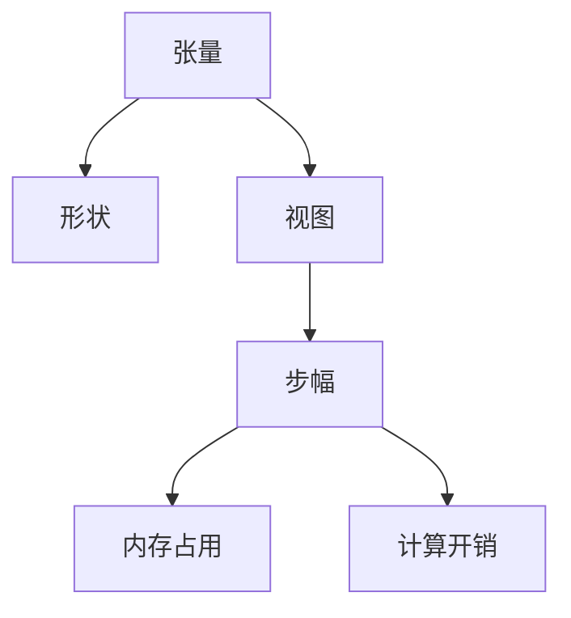

                 

# 张量操作：形状、视图和步幅的重要性

> 关键词：张量操作, 形状, 视图, 步幅, 多维数组, 深度学习, 优化算法, 数值计算

## 1. 背景介绍

张量操作是现代计算机科学中最基础也是最常用的操作之一，尤其是在深度学习、科学计算和数据分析等领域。张量通常是一个多维数组，可以视作一个离散的数学对象，支持向量空间的任意维数和形状。理解张量操作的细节对优化算法、数值计算和机器学习模型有重要影响。

张量操作的核心要素包括形状（shape）、视图（view）和步幅（stride）。在本文中，我们将深入探索这三个概念，并探讨它们在深度学习和科学计算中的重要性。

## 2. 核心概念与联系

### 2.1 核心概念概述

为了更好地理解张量操作的细节，本节将介绍几个关键概念：

- **张量**：一种多维数组，用于表示高维数据结构，广泛应用于深度学习、科学计算和数据分析等领域。
- **形状**：指张量每个维度的尺寸大小，通常表示为一系列非负整数。
- **视图**：指张量的一个子集，可以通过共享数据来减少内存占用和计算开销。
- **步幅**：指张量在多个维度上的跨度，影响访问数据时所需的内存和计算资源。

这些核心概念之间的关系可以通过以下Mermaid流程图来展示：



这个流程图展示了张量、形状、视图和步幅之间的逻辑关系：

1. 张量通过其形状定义其在多维空间中的尺寸。
2. 视图是对张量的子集，可以优化内存使用和计算效率。
3. 步幅决定了访问张量元素时所需的空间跨度和计算成本。

这些概念相互关联，共同影响着张量的内存占用和计算性能。

## 3. 核心算法原理 & 具体操作步骤

### 3.1 算法原理概述

张量操作的核心算法原理基于多维数组的数学模型。在数学上，张量可以看作是一个多维向量空间中的元素，其形状、视图和步幅定义了其在不同维度的访问方式。这种多维数组的数学模型在深度学习和科学计算中被广泛应用，因为它们允许高效地处理和分析大规模数据。

### 3.2 算法步骤详解

#### 3.2.1 形状操作

形状操作是张量操作中最基础的部分，主要涉及改变张量的维度和大小。常见的形状操作包括：

- 扩展（expand）：增加张量的维度或某个维度的尺寸。
- 收缩（squeeze）：减少张量的维度，如果某个维度的尺寸为1。
- 重塑（reshape）：在不改变数据内容的情况下，改变张量的形状。

在实践中，这些操作通常使用Python中的NumPy库实现。以下是一个简单的示例：

```python
import numpy as np

# 创建一个二维张量
a = np.array([[1, 2], [3, 4]])

# 扩展形状
b = np.expand_dims(a, axis=0)  # 在第一个维度增加一个尺寸

# 收缩形状
c = np.squeeze(b)  # 删除最后一个维度

# 重塑形状
d = np.reshape(a, (1, 2, 1, 2))
```

#### 3.2.2 视图操作

视图操作允许在不改变原始张量数据的情况下，创建一个对张量的子集进行访问的视图。视图通过共享原始张量的内存来减少内存占用和计算开销。常见的视图操作包括：

- 切片（slice）：从张量中提取一个子集。
- 索引（indexing）：通过标签或坐标访问张量的元素。
- 取转置（transpose）：交换张量的某些维度的顺序。

以下是一个示例：

```python
# 创建一个二维张量
a = np.array([[1, 2, 3], [4, 5, 6]])

# 切片操作
b = a[:, :1]  # 取出第一列

# 索引操作
c = a[0, 1]  # 取出第一行第二列

# 转置操作
d = a.T  # 交换行和列
```

#### 3.2.3 步幅操作

步幅操作决定了访问张量元素时所需的内存跨度和计算成本。步幅通常是一个整数数组，每个元素表示在相应维度上步幅的大小。步幅操作可以帮助优化深度学习中的卷积和池化等操作，提高模型的计算效率。

以下是一个示例：

```python
# 创建一个二维张量
a = np.array([[1, 2, 3], [4, 5, 6]])

# 步幅操作
b = np.strides((2, 1))  # 设置步幅为[2, 1]
```

### 3.3 算法优缺点

#### 3.3.1 优点

张量操作具有以下优点：

- **高效性**：通过视图和步幅操作，可以减少内存占用和计算开销。
- **灵活性**：张量操作支持多维数组的任意维数和形状，适应性强。
- **可复用性**：张量操作可以通过共享数据来复用内存，提高计算效率。

#### 3.3.2 缺点

张量操作也存在一些缺点：

- **复杂性**：张量操作的实现较为复杂，需要理解形状、视图和步幅等概念。
- **内存占用**：虽然视图操作可以优化内存使用，但在某些情况下，仍然需要较大的内存空间。
- **计算开销**：步幅操作虽然可以优化计算效率，但在某些情况下，仍需大量计算资源。

## 4. 数学模型和公式 & 详细讲解 & 举例说明

### 4.1 数学模型构建

张量操作在数学上可以表示为一个多维数组，其元素为标量或向量。张量 $A$ 的形状表示为 $A_{d_1, d_2, ..., d_n}$，其中 $d_i$ 表示张量在 $i$ 维度的尺寸。

### 4.2 公式推导过程

设张量 $A$ 的形状为 $A_{d_1, d_2, ..., d_n}$，步幅为 $s_1, s_2, ..., s_n$，则张量元素 $A_{i_1, i_2, ..., i_n}$ 的计算公式为：

$$
A_{i_1, i_2, ..., i_n} = A_{i_1 * s_1 + j_1, i_2 * s_2 + j_2, ..., i_n * s_n + j_n}
$$

其中 $j_k$ 表示在 $k$ 维度的偏移量，通常为 $0$ 或 $1$。

### 4.3 案例分析与讲解

假设有一个三维张量 $A$，形状为 $2 \times 3 \times 4$，步幅为 $1, 2, 1$。则访问 $A_{1, 2, 3}$ 元素时，需要进行的计算为：

$$
A_{1, 2, 3} = A_{1 * 1 + 1, 2 * 2 + 1, 3 * 1 + 3} = A_{1, 5, 3}
$$

这意味着在第一个维度上，步幅为 $1$，即每次访问增加 $1$；在第二个维度上，步幅为 $2$，即每次访问增加 $2$；在第三个维度上，步幅为 $1$，即每次访问增加 $1$。

## 5. 项目实践：代码实例和详细解释说明

### 5.1 开发环境搭建

在进行张量操作的项目实践前，我们需要准备好开发环境。以下是使用Python进行NumPy开发的简单环境配置：

1. 安装NumPy：
```bash
pip install numpy
```

2. 创建虚拟环境：
```bash
python -m venv env
source env/bin/activate
```

3. 安装相关依赖：
```bash
pip install matplotlib pandas
```

完成上述步骤后，即可在虚拟环境中进行张量操作的项目开发。

### 5.2 源代码详细实现

以下是一个简单的Python代码示例，演示了如何使用NumPy进行张量操作：

```python
import numpy as np

# 创建一个二维张量
a = np.array([[1, 2], [3, 4]])

# 扩展形状
b = np.expand_dims(a, axis=0)  # 在第一个维度增加一个尺寸

# 收缩形状
c = np.squeeze(b)  # 删除最后一个维度

# 重塑形状
d = np.reshape(a, (1, 2, 1, 2))

# 切片操作
e = a[:, :1]

# 索引操作
f = a[0, 1]

# 转置操作
g = a.T

# 输出结果
print(b.shape)  # (1, 2, 2)
print(c.shape)  # (2,)
print(d.shape)  # (1, 1, 2, 2)
print(e.shape)  # (2, 1)
print(f)  # 2
print(g.shape)  # (2, 2)
```

### 5.3 代码解读与分析

让我们再详细解读一下关键代码的实现细节：

**expand_dims函数**：
- 用于在张量的某个维度上扩展形状，返回一个新的视图张量。

**squeeze函数**：
- 用于减少张量的维度，如果某个维度的尺寸为1，则返回一个新的视图张量。

**reshape函数**：
- 用于在不改变数据内容的情况下，改变张量的形状，返回一个新的视图张量。

**切片操作**：
- 通过指定张量的切片区间，返回一个新的视图张量。

**索引操作**：
- 通过指定张量的索引，返回一个新的视图张量。

**转置操作**：
- 通过交换张量的某些维度的顺序，返回一个新的视图张量。

这些函数都是NumPy库中的基础函数，用于进行张量的形状操作和视图操作。在实际应用中，根据具体需求选择不同的函数，可以灵活地对张量进行操作。

## 6. 实际应用场景

### 6.1 深度学习

张量操作在深度学习中具有重要应用，特别是在卷积神经网络（CNN）和循环神经网络（RNN）等模型中。张量操作可以通过改变形状和步幅，优化模型的计算效率和内存使用。例如，在CNN中，通过改变卷积核的形状和步幅，可以改变卷积操作的大小和跨度，从而适应不同的输入数据。

### 6.2 科学计算

在科学计算中，张量操作被广泛应用于数值计算、矩阵运算和线性代数等领域。例如，在求解线性方程组时，可以通过改变矩阵的形状和步幅，优化求解算法的效率和内存使用。

### 6.3 数据分析

张量操作在数据分析中被广泛应用，特别是在处理和分析大规模数据集时。通过改变数据集的形状和视图，可以优化计算效率和内存使用，从而提高数据分析的速度和准确性。

## 7. 工具和资源推荐

### 7.1 学习资源推荐

为了帮助开发者系统掌握张量操作的理论基础和实践技巧，这里推荐一些优质的学习资源：

1. **NumPy官方文档**：NumPy库的官方文档，提供了详细的使用指南和函数参考，是学习NumPy的必备资源。
2. **深度学习入门教程**：由Coursera和edX等平台提供的深度学习入门课程，涵盖深度学习的核心概念和常用框架。
3. **TensorFlow和PyTorch官方文档**：TensorFlow和PyTorch库的官方文档，提供了丰富的张量操作函数和示例。
4. **Python科学计算书籍**：《Python科学计算基础》、《Python数据科学手册》等书籍，深入浅出地介绍了Python在科学计算中的应用。

### 7.2 开发工具推荐

高效的开发离不开优秀的工具支持。以下是几款用于张量操作开发的常用工具：

1. **NumPy**：Python科学计算的基础库，提供高效的多维数组操作和数学函数。
2. **TensorFlow**：由Google开发的深度学习框架，提供丰富的张量操作和优化算法。
3. **PyTorch**：由Facebook开发的深度学习框架，提供灵活的张量操作和动态计算图。
4. **Jupyter Notebook**：交互式的Python编程环境，适合进行数据分析和实验。

### 7.3 相关论文推荐

张量操作的发展源于学界的持续研究。以下是几篇奠基性的相关论文，推荐阅读：

1. **TensorFlow: A System for Large-Scale Machine Learning**：由Google发表的TensorFlow论文，介绍了TensorFlow的核心架构和张量操作。
2. **Efficient estimation of optimal transport with a convex relaxation**：由Levin et al.发表的论文，介绍了如何使用优化算法优化张量操作的计算。
3. **Tensor networks and tensor network states in many-body physics**：由Orus发表的论文，介绍了如何使用张量网络模型进行多体物理问题的计算。

## 8. 总结：未来发展趋势与挑战

### 8.1 总结

本文对张量操作的细节进行了全面系统的介绍。首先阐述了张量操作的定义和作用，明确了形状、视图和步幅等核心概念的重要性。其次，从原理到实践，详细讲解了张量操作的数学模型和具体步骤，给出了张量操作任务的完整代码实例。同时，本文还探讨了张量操作在深度学习、科学计算和数据分析等多个领域的应用前景，展示了张量操作的巨大潜力。

通过本文的系统梳理，可以看到，张量操作在现代计算机科学中具有广泛的应用，是深度学习和科学计算的核心工具。掌握张量操作的细节，可以显著提升模型的性能和计算效率，加速科学计算和数据分析的进程。

### 8.2 未来发展趋势

展望未来，张量操作技术将呈现以下几个发展趋势：

1. **分布式计算**：随着数据规模的不断增长，张量操作需要支持分布式计算，利用多台计算机的计算资源，提高计算效率和可扩展性。
2. **自动微分**：自动微分技术将逐步融入张量操作，使模型训练和优化变得更加高效和灵活。
3. **异构计算**：张量操作将支持多种计算资源，如CPU、GPU和TPU等，提高计算效率和能效比。
4. **混合精度计算**：采用混合精度计算技术，减少计算开销，提高计算效率。
5. **模型压缩**：通过模型压缩和量化技术，减少内存占用和计算开销，提高计算效率和可扩展性。

以上趋势凸显了张量操作的广阔前景。这些方向的探索发展，必将进一步提升张量操作的性能和应用范围，为现代计算机科学带来新的突破。

### 8.3 面临的挑战

尽管张量操作已经取得了显著的进展，但在迈向更加智能化、普适化应用的过程中，它仍面临着诸多挑战：

1. **内存管理**：大规模张量操作需要大量的内存资源，如何在保证计算效率的同时，有效管理内存，是一大难题。
2. **计算开销**：复杂张量操作需要大量计算资源，如何在保证计算效率的同时，降低计算开销，是一大挑战。
3. **异构资源兼容性**：张量操作需要支持多种计算资源，如何优化不同资源之间的兼容性，是一大挑战。
4. **自动微分复杂性**：自动微分技术虽然可以提高计算效率，但其复杂性较高，需要更多的研究和实践。
5. **模型压缩难度**：模型压缩技术虽然可以降低内存占用和计算开销，但其效果有限，需要更多的创新。

这些挑战需要研究者和开发者共同努力，积极探索和解决，才能使张量操作技术更加成熟和实用。

### 8.4 研究展望

面对张量操作技术所面临的挑战，未来的研究需要在以下几个方面寻求新的突破：

1. **优化内存管理**：开发更加高效的内存管理算法，减少内存占用和计算开销。
2. **优化计算开销**：研究更加高效的计算模型和算法，降低计算开销和计算资源需求。
3. **优化异构资源兼容性**：开发能够支持多种计算资源的张量操作框架，提高异构资源的兼容性。
4. **优化自动微分技术**：研究更加高效和易于使用的自动微分技术，降低自动微分复杂性。
5. **开发高效模型压缩技术**：研究更加高效的模型压缩技术，减少内存占用和计算开销，提高计算效率和可扩展性。

这些研究方向的探索，必将引领张量操作技术迈向更高的台阶，为现代计算机科学带来新的突破。面向未来，张量操作技术还需要与其他计算机科学技术进行更深入的融合，共同推动科学计算、深度学习等领域的发展。只有勇于创新、敢于突破，才能不断拓展张量操作的边界，为现代计算机科学带来新的动力。

## 9. 附录：常见问题与解答

**Q1: 什么是张量操作？**

A: 张量操作是现代计算机科学中最基础也是最常用的操作之一，用于处理多维数组。张量操作通过改变形状、视图和步幅等属性，实现对多维数组的高效处理和优化。

**Q2: 张量操作和数组操作有什么区别？**

A: 张量操作是基于多维数组的操作，而数组操作是基于一维数组的操作。张量操作支持任意维数的数组，可以处理高维数据，适用于深度学习和科学计算等领域。数组操作则适用于简单的线性代数和数值计算。

**Q3: 如何优化张量操作的计算效率？**

A: 优化张量操作的计算效率，需要从多个方面进行考虑。可以使用视图操作减少内存占用，使用步幅操作优化计算开销，使用自动微分技术加速模型训练，使用分布式计算提高可扩展性等。

**Q4: 张量操作在深度学习中的应用有哪些？**

A: 张量操作在深度学习中具有重要应用，特别是在卷积神经网络（CNN）和循环神经网络（RNN）等模型中。张量操作可以通过改变形状和步幅，优化模型的计算效率和内存使用。例如，在CNN中，通过改变卷积核的形状和步幅，可以改变卷积操作的大小和跨度，从而适应不同的输入数据。

**Q5: 张量操作在科学计算中的应用有哪些？**

A: 在科学计算中，张量操作被广泛应用于数值计算、矩阵运算和线性代数等领域。例如，在求解线性方程组时，可以通过改变矩阵的形状和步幅，优化求解算法的效率和内存使用。

---

作者：禅与计算机程序设计艺术 / Zen and the Art of Computer Programming

