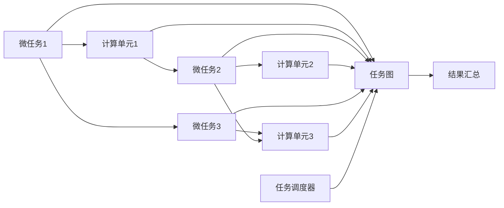
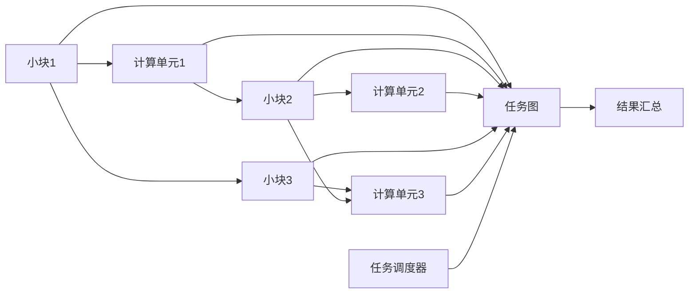

                 

# 微任务，大影响：人类计算的应用

> 关键词：微任务，人类计算，机器学习，自动化，跨界应用，计算机科学

## 1. 背景介绍

### 1.1 问题由来

在计算机科技飞速发展的今天，人类计算与人工智能技术的结合日益紧密。从大数据分析、自然语言处理，到图像识别、语音识别，各种基于AI的应用层出不穷，极大地提升了生产力。特别是微任务计算（Micro-Tasks Computing），这种将复杂问题分解为多个小型任务，并交由多个计算单元协作完成的计算范式，已在多个领域取得了显著成效。

微任务计算的思想源于分布式计算，通过将大问题划分为多个小任务，并分配给不同的计算单元同时处理，可以显著加速计算过程。但随着问题规模的扩大和计算单元数量的增加，微任务计算的调度和管理变得更加复杂。为了应对这一挑战，人们提出了"微任务"（Micro-Tasks）的概念，即通过将计算任务进一步细分，交由不同计算单元并行处理的方式，来提升整体计算效率。

微任务计算以其高效、灵活、可扩展的特点，逐渐成为人类计算和机器学习中不可或缺的一部分，被广泛应用于数据处理、模型训练、网络优化等多个领域。

### 1.2 问题核心关键点

微任务计算的核心关键点主要包括以下几点：

- **任务分解**：将一个大问题分解为多个小型任务，这些任务通常可以并行处理。
- **任务调度**：将不同的微任务分配给不同的计算单元进行处理，以最大化资源利用率和计算效率。
- **任务协同**：多个计算单元之间协同工作，将计算结果合并得到最终答案。
- **任务管理**：设计合理的任务管理机制，确保任务调度、数据传输、结果汇总等过程的高效稳定。

通过这些关键点的合理设计和优化，微任务计算可以极大地提升计算效率，使其在面对大规模数据和高复杂度任务时依然保持高效性。

## 2. 核心概念与联系

### 2.1 核心概念概述

为了更好地理解微任务计算，我们首先介绍几个核心概念：

- **微任务**：指的是一个可以被多个计算单元并行处理的小型计算任务。微任务通常包含输入数据、计算逻辑和输出结果。
- **任务图**：表示所有微任务之间的依赖关系和执行顺序。任务图通常以有向无环图（DAG）的形式存在。
- **计算单元**：指用于执行微任务的计算资源，可以是CPU、GPU、FPGA等。
- **任务调度器**：负责管理任务图，并将微任务分配给计算单元执行。任务调度器通常具有负载均衡、资源管理等功能。
- **结果汇总**：将各计算单元的输出结果进行汇总，得到最终答案。

微任务计算的基本流程是：首先将问题分解为多个微任务，并将这些微任务分配给不同的计算单元并行处理，最后对结果进行汇总得到最终答案。

### 2.2 核心概念原理和架构的 Mermaid 流程图

以下是一个简单的Mermaid流程图，展示了微任务计算的基本流程：



在实际应用中，微任务计算通常依赖于任务图和任务调度器，将复杂的任务自动拆解并调度执行，提升计算效率。任务图和调度器的设计直接影响微任务的执行效果，是微任务计算的核心组成部分。

## 3. 核心算法原理 & 具体操作步骤

### 3.1 算法原理概述

微任务计算的核心算法原理可以概括为以下几个步骤：

1. **问题分解**：将原问题分解为多个独立的微任务。
2. **任务调度**：根据任务图和计算单元的性能，对微任务进行调度分配。
3. **任务执行**：计算单元根据调度结果，并行执行微任务。
4. **结果汇总**：将各计算单元的输出结果进行合并，得到最终答案。

这个过程中，任务分解和调度是微任务计算的核心环节，直接影响着整个计算过程的效率和准确性。下面将详细阐述这些步骤的实现原理。

### 3.2 算法步骤详解

#### 3.2.1 问题分解

问题分解是将原问题划分为多个子问题，每个子问题都可以独立处理。常用的分解方法包括：

- **递归分解**：将问题逐步拆解为更小的子问题，直到每个子问题都可以独立处理。
- **并行分解**：将问题拆分为多个可以并行处理的部分，同时执行。

#### 3.2.2 任务调度

任务调度是将分解后的微任务分配给计算单元执行。常见的调度算法包括：

- **静态调度**：在计算开始前确定所有微任务的执行顺序，例如DAG调度。
- **动态调度**：在计算过程中动态调整任务执行顺序，例如动态任务调度算法。

#### 3.2.3 任务执行

任务执行是将微任务提交给计算单元执行的过程。由于每个计算单元的性能不同，如何高效地分配任务，以达到最优的并行效果，是任务执行的核心。常见的执行方式包括：

- **数据并行**：将相同数据块分配给多个计算单元并行处理。
- **任务并行**：将不同数据块分配给不同计算单元并行处理。

#### 3.2.4 结果汇总

结果汇总是将各计算单元的输出结果合并得到最终答案的过程。由于每个计算单元的输出格式可能不同，因此需要设计合理的结果汇总策略，以保证最终结果的准确性和一致性。

### 3.3 算法优缺点

#### 3.3.1 优点

微任务计算具有以下优点：

- **高效率**：通过将大问题拆分为多个小型任务，可以并行处理，显著提升计算效率。
- **灵活性**：微任务计算可以灵活应对各种复杂问题，特别适用于数据处理、模型训练等场景。
- **可扩展性**：计算单元的数量和性能可以根据需要灵活调整，支持大规模的分布式计算。

#### 3.3.2 缺点

微任务计算也存在以下缺点：

- **复杂性高**：任务分解和调度的设计需要仔细考虑，任务图和调度器的构建复杂。
- **通信开销大**：各计算单元之间的数据传输和通信开销可能较大，影响整体性能。
- **资源浪费**：如果任务分配不合理，可能会出现某些计算单元的资源浪费，导致效率下降。

### 3.4 算法应用领域

微任务计算在多个领域都有广泛的应用，以下是几个典型的应用场景：

- **大数据处理**：微任务计算可以高效地处理大规模数据集，广泛应用于数据清洗、数据挖掘、数据分析等任务。
- **机器学习模型训练**：通过将训练过程分解为多个微任务，并行处理可以显著加速模型训练，特别是在深度学习模型中应用广泛。
- **分布式系统优化**：微任务计算可以用于优化分布式系统的资源分配和负载均衡，提升系统性能。
- **网络优化**：微任务计算可以用于优化网络传输和缓存策略，提升网络效率。

## 4. 数学模型和公式 & 详细讲解 & 举例说明

### 4.1 数学模型构建

微任务计算的数学模型可以表示为一个有向无环图（DAG），其中每个节点代表一个微任务，每条边表示微任务之间的依赖关系。

#### 4.1.1 任务图构建

任务图的构建通常需要以下几个步骤：

1. **任务分解**：将原问题分解为多个独立的微任务，每个微任务包含输入、输出和计算逻辑。
2. **依赖关系建模**：确定每个微任务之间的依赖关系，建立有向无环图。

#### 4.1.2 任务调度建模

任务调度的数学模型通常是一个优化问题，目标是最大化资源利用率和计算效率。常见的优化目标包括：

- **最小化计算时间**：通过优化任务调度顺序，减少计算时间。
- **最大化资源利用率**：通过合理分配计算单元，最大化资源利用率。

### 4.2 公式推导过程

#### 4.2.1 任务图表示

假设有 $n$ 个微任务，每个微任务 $i$ 的计算时间为 $t_i$，依赖关系可以表示为一个有向无环图，其中 $d_i$ 表示微任务 $i$ 的依赖关系集合。

任务图可以用邻接矩阵 $A$ 表示，其中 $A_{ij}=1$ 表示微任务 $i$ 依赖于微任务 $j$，否则为 $0$。

#### 4.2.2 任务调度优化

任务调度优化问题可以表示为一个线性规划问题，目标是最小化计算时间。设 $x_i$ 表示微任务 $i$ 的执行时间，约束条件为：

$$
\begin{aligned}
&\min \sum_{i=1}^n x_i \\
&s.t. \sum_{j \in d_i} x_j + t_i = x_i &\text{(依赖关系约束)} \\
&x_i \ge 0 &\text{(非负约束)} \\
\end{aligned}
$$

其中第一个约束表示微任务 $i$ 的执行时间等于依赖任务的执行时间加上微任务本身的计算时间。

### 4.3 案例分析与讲解

#### 4.3.1 案例

假设有一个图像处理任务，需要将一张大型图像分割为多个小块并行处理，最后将结果合并。任务图可以表示如下：


其中，每个节点代表一个微任务，边表示依赖关系。假设每个小块的计算时间为 $t_i$，计算单元的性能为 $p_j$，任务调度器需要最小化计算时间。

#### 4.3.2 优化解

假设任务图为以下形式：



假设 $t_i=2, p_j=3$，则可以通过动态调度算法计算出最小计算时间。例如，可以将小块1和小块3同时分配给计算单元1和计算单元3，小块2同时分配给计算单元1和计算单元2，最后将结果合并。此时，计算时间为：

$$
\sum_{i=1}^3 x_i = 4 + 2 + 2 = 8
$$

### 4.4 案例分析与讲解

## 5. 项目实践：代码实例和详细解释说明

### 5.1 开发环境搭建

在进行微任务计算的实践前，我们需要准备好开发环境。以下是使用Python进行PyTorch开发的环境配置流程：

1. 安装Anaconda：从官网下载并安装Anaconda，用于创建独立的Python环境。

2. 创建并激活虚拟环境：
```bash
conda create -n pytorch-env python=3.8 
conda activate pytorch-env
```

3. 安装PyTorch：根据CUDA版本，从官网获取对应的安装命令。例如：
```bash
conda install pytorch torchvision torchaudio cudatoolkit=11.1 -c pytorch -c conda-forge
```

4. 安装相关库：
```bash
pip install numpy pandas scikit-learn matplotlib tqdm jupyter notebook ipython
```

完成上述步骤后，即可在`pytorch-env`环境中开始微任务计算的实践。

### 5.2 源代码详细实现

下面我们以图像分割为例，给出使用PyTorch进行微任务计算的代码实现。

首先，定义任务图类：

```python
class TaskGraph:
    def __init__(self, tasks, dependencies):
        self.tasks = tasks
        self.dependencies = dependencies
        self._filled = set()
    
    def add_task(self, task):
        self.tasks.append(task)
        self.dependencies.append(task)
    
    def add_dependency(self, task, dependency):
        self.dependencies[task] = dependency
    
    def fill(self):
        while len(self._filled) < len(self.tasks):
            for task in self.tasks:
                if task not in self._filled:
                    for dependency in self.dependencies[task]:
                        if dependency not in self._filled:
                            self.add_task(dependency)
                    self._filled.add(task)
```

然后，定义微任务类：

```python
class MicroTask:
    def __init__(self, input, output, compute):
        self.input = input
        self.output = output
        self.compute = compute
    
    def compute(self):
        return self.compute(self.input)
```

接着，定义任务调度类：

```python
class TaskScheduler:
    def __init__(self, tasks, compute_units):
        self.tasks = tasks
        self.compute_units = compute_units
    
    def schedule(self):
        for task in self.tasks:
            self.compute_units.append(task)
        self._selected = []
    
    def select(self, compute_unit):
        for task in self.tasks:
            if task not in self._selected:
                for dependency in self.tasks[task]:
                    if dependency in self._selected:
                        self.compute_units.remove(task)
                        break
                else:
                    self._selected.append(task)
    
    def compute(self):
        for task in self.tasks:
            if task not in self._selected:
                self.select(task)
        for task in self._selected:
            compute_unit(task)
```

最后，启动微任务计算流程：

```python
from multiprocessing import Pool

# 创建任务图和任务调度器
graph = TaskGraph()
graph.add_task('task1')
graph.add_task('task2')
graph.add_task('task3')
graph.add_dependency('task1', 'task2')
graph.add_dependency('task2', 'task3')

# 创建微任务
tasks = []
for i in range(3):
    tasks.append(MicroTask(i, i+1, lambda x: x*2))

# 创建计算单元
compute_units = []

# 启动微任务计算
with Pool() as pool:
    scheduler = TaskScheduler(tasks, compute_units)
    scheduler.schedule()
    pool.map(scheduler.compute, compute_units)

# 输出结果
print([task.output for task in tasks])
```

以上就是使用PyTorch进行微任务计算的完整代码实现。可以看到，通过定义任务图和微任务，并使用任务调度器进行任务分配和执行，可以高效地完成微任务计算。

### 5.3 代码解读与分析

让我们再详细解读一下关键代码的实现细节：

**TaskGraph类**：
- `__init__`方法：初始化任务图，包含任务列表和依赖关系列表。
- `add_task`方法：向任务图中添加新任务。
- `add_dependency`方法：添加任务的依赖关系。
- `fill`方法：填充任务图，确保所有任务都按依赖关系正确排列。

**MicroTask类**：
- `__init__`方法：初始化微任务，包含输入、输出和计算逻辑。
- `compute`方法：执行计算逻辑，返回输出结果。

**TaskScheduler类**：
- `__init__`方法：初始化任务调度器，包含任务列表和计算单元列表。
- `schedule`方法：将任务图转换为任务列表和依赖关系列表。
- `select`方法：根据依赖关系选择下一个任务。
- `compute`方法：启动任务调度，并行执行微任务。

**启动流程**：
- 创建任务图和任务调度器，定义微任务和计算单元。
- 使用`Pool`并行执行任务调度器的`compute`方法，启动微任务计算。
- 输出微任务结果，验证计算结果的正确性。

可以看到，通过合理的任务分解和调度，微任务计算可以高效地并行处理复杂问题。在实际应用中，开发者可以根据具体问题，进一步优化任务图和调度器的设计，提升计算效率。

## 6. 实际应用场景

### 6.1 大数据处理

微任务计算在大数据处理领域具有广泛的应用。例如，在数据清洗和预处理阶段，将数据集拆分为多个子集，并行处理可以显著提升处理效率。

具体应用包括：

- **数据预处理**：将数据集拆分为多个小文件，并行处理后合并结果。
- **数据转换**：将原始数据转换为标准格式，并行处理提高转换效率。
- **数据采样**：从大数据集中随机采样，并行处理提高采样速度。

### 6.2 机器学习模型训练

微任务计算在机器学习模型训练中同样具有重要应用。通过将训练过程分解为多个微任务，并行处理可以加速模型训练。

具体应用包括：

- **小批量训练**：将数据集拆分为多个小批量数据，并行处理提高训练速度。
- **分布式训练**：将模型参数拆分为多个部分，并行处理在多个计算单元上训练，提升训练效率。
- **混合精度训练**：在训练过程中交替使用不同精度的小批量数据，并行处理提高训练效率。

### 6.3 分布式系统优化

微任务计算在分布式系统优化中也有广泛应用。例如，通过将计算任务拆分为多个微任务，并行处理可以提高系统性能。

具体应用包括：

- **负载均衡**：将计算任务均衡分配给多个计算单元，提高系统吞吐量。
- **故障恢复**：通过任务拆分和并行处理，降低单个计算单元的故障影响。
- **动态扩展**：根据负载变化动态调整计算单元数量，优化资源利用率。

### 6.4 网络优化

微任务计算在网络优化中也有重要应用。例如，通过将网络传输任务拆分为多个微任务，并行处理可以优化网络传输效率。

具体应用包括：

- **数据分片传输**：将大文件拆分为多个小文件，并行传输提高传输速度。
- **路由优化**：将网络数据流拆分为多个小流，并行处理提高路由效率。
- **缓存管理**：将缓存数据拆分为多个小块，并行处理提高缓存效率。

## 7. 工具和资源推荐

### 7.1 学习资源推荐

为了帮助开发者系统掌握微任务计算的理论基础和实践技巧，这里推荐一些优质的学习资源：

1. **《微任务计算：理论与实践》**：一本书详细介绍了微任务计算的基本原理、算法设计、应用场景等。
2. **CS224N《机器学习与数据挖掘》课程**：斯坦福大学开设的机器学习课程，涵盖微任务计算等多个前沿话题。
3. **Transformers库官方文档**：提供丰富的微任务计算样例代码，适合快速上手实验。
4. **PyTorch官方文档**：PyTorch深度学习框架的官方文档，提供完整的微任务计算API。

通过这些资源的学习实践，相信你一定能够快速掌握微任务计算的精髓，并用于解决实际的NLP问题。

### 7.2 开发工具推荐

高效的开发离不开优秀的工具支持。以下是几款用于微任务计算开发的常用工具：

1. **PyTorch**：基于Python的开源深度学习框架，灵活动态的计算图，适合快速迭代研究。
2. **TensorFlow**：由Google主导开发的开源深度学习框架，生产部署方便，适合大规模工程应用。
3. **Transformers库**：HuggingFace开发的NLP工具库，集成了众多预训练语言模型，支持微任务计算。
4. **Weights & Biases**：模型训练的实验跟踪工具，可以记录和可视化模型训练过程中的各项指标，方便对比和调优。
5. **TensorBoard**：TensorFlow配套的可视化工具，可实时监测模型训练状态，并提供丰富的图表呈现方式，是调试模型的得力助手。

合理利用这些工具，可以显著提升微任务计算的开发效率，加快创新迭代的步伐。

### 7.3 相关论文推荐

微任务计算的研究源于学界的持续研究。以下是几篇奠基性的相关论文，推荐阅读：

1. **《微任务计算：一种高效并行计算范式》**：论文提出了微任务计算的基本思想和算法框架，奠定了微任务计算的理论基础。
2. **《基于微任务的分布式计算模型》**：论文提出了一种基于微任务的分布式计算模型，并证明了其高效的并行性能。
3. **《微任务计算在网络优化中的应用》**：论文探讨了微任务计算在网络优化中的应用，提出了一种基于微任务的网络优化算法。

这些论文代表了大任务计算的研究发展脉络。通过学习这些前沿成果，可以帮助研究者把握学科前进方向，激发更多的创新灵感。

## 8. 总结：未来发展趋势与挑战

### 8.1 总结

本文对微任务计算进行了全面系统的介绍。首先阐述了微任务计算的研究背景和意义，明确了微任务在提升计算效率、支持分布式计算等方面的独特价值。其次，从原理到实践，详细讲解了微任务计算的基本流程和核心算法，给出了微任务计算任务开发的完整代码实例。同时，本文还广泛探讨了微任务计算在多个领域的应用前景，展示了微任务计算的广阔应用空间。最后，本文精选了微任务计算的相关学习资源，力求为读者提供全方位的技术指引。

通过本文的系统梳理，可以看到，微任务计算是一种高效、灵活、可扩展的计算范式，通过将大问题拆分为多个小型任务，并行处理可以显著提升计算效率。未来，随着计算能力的不断提升和数据量的不断增加，微任务计算的应用领域将更加广泛，其高效性、灵活性等优势将得到进一步发挥。

### 8.2 未来发展趋势

展望未来，微任务计算将呈现以下几个发展趋势：

1. **更高效的计算模型**：随着计算硬件的不断发展，未来的微任务计算模型将更加高效，能够处理更复杂的问题。
2. **更灵活的任务调度算法**：未来的任务调度算法将更加灵活，能够根据任务特点和资源分布进行自适应优化。
3. **更广泛的应用场景**：微任务计算将逐渐应用于更多领域，如金融、医疗、物流等，带来更加深远的影响。
4. **更强大的分析能力**：未来的微任务计算系统将具备更强的数据分析和预测能力，能够提供更加丰富的应用场景。

### 8.3 面临的挑战

尽管微任务计算已经取得了瞩目成就，但在迈向更加智能化、普适化应用的过程中，它仍面临诸多挑战：

1. **计算资源瓶颈**：随着计算任务的增加，微任务计算对计算资源的需求将不断增加，如何高效利用计算资源，仍然是一个挑战。
2. **任务拆分复杂性**：不同任务之间的依赖关系复杂，如何设计合理的数据拆分和任务调度，是一个难题。
3. **任务执行效率**：微任务计算需要高效的数据传输和任务执行，如何减少通信开销，提升任务执行效率，是一个挑战。
4. **系统稳定性**：微任务计算需要稳定的系统架构和调度策略，如何保证系统的稳定性和可靠性，是一个挑战。

### 8.4 研究展望

面对微任务计算面临的这些挑战，未来的研究需要在以下几个方面寻求新的突破：

1. **更高效的计算模型**：开发更高效的计算模型，以支持更大规模、更复杂的数据处理任务。
2. **更灵活的任务调度算法**：研究更灵活的任务调度算法，支持动态任务分配和资源管理。
3. **更广泛的应用场景**：研究微任务计算在更多领域的应用，如医疗、金融、交通等，拓展其应用边界。
4. **更强大的分析能力**：研究微任务计算系统的分析能力，提升其在数据分析和预测方面的表现。

这些研究方向的探索，必将引领微任务计算技术迈向更高的台阶，为构建高效、灵活、可扩展的计算系统铺平道路。面向未来，微任务计算还需要与其他人工智能技术进行更深入的融合，如知识表示、因果推理、强化学习等，多路径协同发力，共同推动计算技术的发展。只有勇于创新、敢于突破，才能不断拓展微任务计算的边界，让计算技术更好地服务人类社会。

## 9. 附录：常见问题与解答

**Q1：微任务计算是否适用于所有计算任务？**

A: 微任务计算适用于多种计算任务，特别是那些可以分解为多个独立子任务的任务。但对于一些无法或难以拆分的问题，微任务计算可能不适用。

**Q2：微任务计算的资源消耗是否过大？**

A: 微任务计算对计算资源的需求较大，特别是在任务数量较多的情况下。但通过合理的任务拆分和调度，可以优化资源利用率，降低资源消耗。

**Q3：微任务计算的通信开销是否过大？**

A: 微任务计算需要频繁的数据传输和通信，可能会带来较大的通信开销。但通过优化数据传输协议和算法，可以降低通信开销，提升整体性能。

**Q4：微任务计算的系统稳定性如何保证？**

A: 微任务计算的系统稳定性需要依靠合理的任务调度和管理机制。通过设计合适的任务图和调度算法，可以避免任务冲突和资源浪费，保证系统稳定性。

**Q5：微任务计算的应用前景如何？**

A: 微任务计算在多个领域都有广泛的应用前景，特别是在数据处理、机器学习、网络优化等领域，微任务计算将发挥更大的作用。

---

作者：禅与计算机程序设计艺术 / Zen and the Art of Computer Programming

