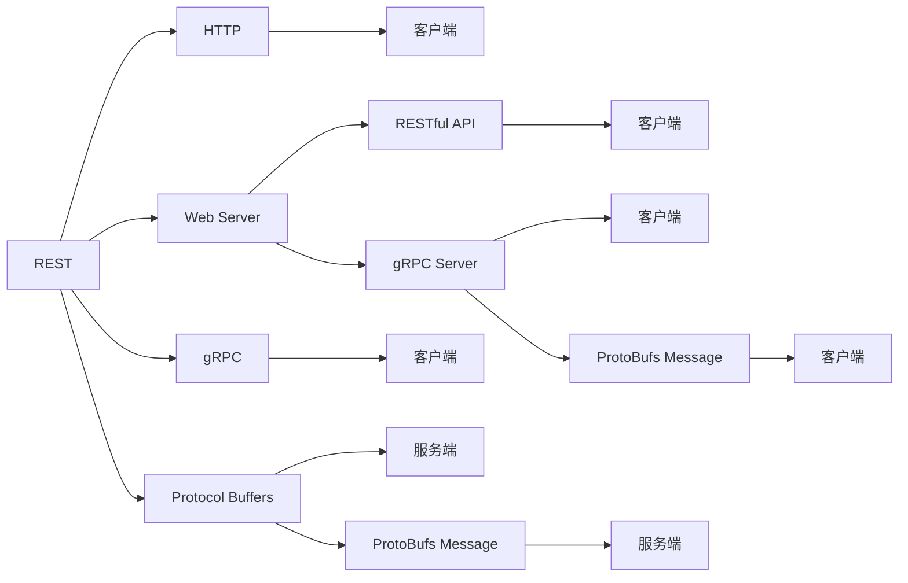

                 

# 微服务通信：REST 和 gRPC

## 1. 背景介绍

### 1.1 问题由来

随着微服务架构的兴起，服务间的通信成为微服务架构的重要组成部分。在早期的微服务架构中，RESTful API 是服务间通信的主流选择。然而，随着微服务的规模和复杂度不断增加，RESTful API 的缺点逐渐显现，如性能瓶颈、接口限制等。

为了应对这些问题，一种新的服务间通信协议 gRPC 应运而生。gRPC 由 Google 开发，基于 Protocol Buffers 序列化格式，提供高性能、可插拔的客户端-服务器通信机制。

### 1.2 问题核心关键点

微服务通信的核心在于如何高效、可靠地进行服务间的信息交换。主要包括以下几个方面：

- **性能**：服务间通信的效率直接影响到系统的整体性能，特别是在高并发环境下，高性能的通信协议尤为重要。
- **可靠性**：服务间通信的可靠性包括消息的传输、错误处理、流量控制等，良好的可靠性可以保证系统的稳定运行。
- **可扩展性**：服务间的通信协议应该能够支持微服务的横向扩展，满足系统的动态需求。
- **安全性**：服务间的通信需要确保数据的安全传输，防止信息泄露和篡改。
- **可维护性**：服务间的通信协议应该易于维护，便于理解和修改。

## 2. 核心概念与联系

### 2.1 核心概念概述

为更好地理解 REST 和 gRPC，本节将介绍几个关键概念：

- **REST (Representational State Transfer)**：一种基于 HTTP 的 Web 服务架构风格，通过 HTTP 方法（如 GET、POST、PUT、DELETE 等）进行数据传输。REST 强调客户端-服务器之间的状态无关性，服务端仅负责接收请求和返回响应，不保存客户端状态。

- **gRPC**：Google 开发的一种高性能、可插拔的客户端-服务器通信机制，基于 Protocol Buffers 序列化格式，支持多种编程语言，提供高性能、低延迟、双向流等特性。

- **Protocol Buffers**：Google 开发的序列化协议，用于将结构化数据序列化为二进制数据格式，支持高效的编码和解码。

- **双向流 (Duplex Streaming)**：gRPC 提供的一种通信模式，允许服务端和客户端进行双向数据交换，支持事件驱动和实时通信。

- **客户端-服务器 (Client-Server)**：REST 和 gRPC 的常见通信模式，服务端提供 API 接口，客户端通过 API 进行数据访问和操作。

- **服务器推送 (Server Push)**：gRPC 提供的一种通信模式，允许服务端主动推送消息给客户端，增强实时性和响应性。

这些核心概念之间具有紧密的联系，通过深入理解它们，可以更好地掌握 REST 和 gRPC 的工作原理和优化方法。

### 2.2 核心概念原理和架构的 Mermaid 流程图



这个流程图展示了 REST 和 gRPC 的基本架构和工作原理：

1. **REST**：通过 HTTP 方法进行数据传输，服务端仅负责接收请求和返回响应，不保存客户端状态。
2. **gRPC**：基于 Protocol Buffers 序列化格式，提供高性能、可插拔的客户端-服务器通信机制，支持双向流、服务器推送等多种通信模式。
3. **Protocol Buffers**：序列化协议，用于高效地将结构化数据序列化为二进制数据格式。
4. **客户端-服务器**：REST 和 gRPC 的常见通信模式，服务端提供 API 接口，客户端通过 API 进行数据访问和操作。
5. **双向流**：gRPC 提供的一种通信模式，允许服务端和客户端进行双向数据交换，支持事件驱动和实时通信。
6. **服务器推送**：gRPC 提供的一种通信模式，允许服务端主动推送消息给客户端，增强实时性和响应性。

这些概念共同构成了 REST 和 gRPC 的架构基础，使得服务间通信能够高效、可靠地进行。

## 3. 核心算法原理 & 具体操作步骤
### 3.1 算法原理概述

REST 和 gRPC 的核心算法原理主要围绕服务间的数据传输和处理进行设计。

REST 的核心在于利用 HTTP 方法进行数据传输，其原理如下：

1. **客户端**：发送 HTTP 请求，请求中包含请求方法、URL 和请求体。
2. **服务端**：接收 HTTP 请求，解析请求方法、URL 和请求体，进行处理并返回 HTTP 响应。
3. **响应处理**：服务端根据请求方法和 URL 进行处理，返回 HTTP 响应，响应中包含响应状态码、响应头和响应体。

gRPC 的核心在于利用 Protocol Buffers 序列化格式进行数据传输，其原理如下：

1. **服务定义**：定义 gRPC 服务协议，使用 Protocol Buffers 描述服务接口和消息格式。
2. **客户端**：通过 Protocol Buffers 序列化请求消息，发送给服务端。
3. **服务端**：接收 Protocol Buffers 序列化请求消息，解析并处理请求，生成 Protocol Buffers 序列化响应消息。
4. **客户端**：接收 Protocol Buffers 序列化响应消息，反序列化并处理响应。

### 3.2 算法步骤详解

#### 3.2.1 REST 算法步骤

1. **客户端发送请求**：客户端通过 HTTP 请求方法（如 GET、POST、PUT、DELETE 等）向服务端发送请求。
2. **服务端处理请求**：服务端接收请求，解析请求方法和 URL，根据请求方法进行处理。
3. **返回响应**：服务端生成 HTTP 响应，包含响应状态码、响应头和响应体，返回给客户端。
4. **客户端处理响应**：客户端接收响应，解析响应状态码和响应头，处理响应体。

#### 3.2.2 gRPC 算法步骤

1. **服务定义**：使用 Protocol Buffers 定义 gRPC 服务协议，包括服务接口、消息格式等。
2. **客户端发送请求**：客户端通过 Protocol Buffers 序列化请求消息，发送给服务端。
3. **服务端处理请求**：服务端接收请求消息，解析并处理请求，生成 Protocol Buffers 序列化响应消息。
4. **客户端接收响应**：客户端接收响应消息，反序列化并处理响应。

### 3.3 算法优缺点

#### 3.3.1 REST 优缺点

**优点**：

- **标准协议**：REST 基于 HTTP 协议，具有广泛的应用基础和标准化支持。
- **简单灵活**：REST 的架构相对简单，易于理解和实现。
- **跨语言支持**：REST 可以与多种编程语言和平台协同工作。

**缺点**：

- **性能瓶颈**：REST 的性能瓶颈主要集中在 HTTP 请求和响应上，可能影响系统整体性能。
- **接口限制**：REST 接口设计较为繁琐，需要考虑多种场景和错误处理。
- **安全性不足**：REST 接口的安全性较低，容易受到跨站脚本攻击等安全威胁。

#### 3.3.2 gRPC 优缺点

**优点**：

- **高性能**：gRPC 基于 Protocol Buffers 序列化格式，提供高效的数据传输和处理机制。
- **低延迟**：gRPC 支持双向流和服务器推送等通信模式，提供低延迟的通信体验。
- **可扩展性强**：gRPC 支持跨语言和跨平台的应用，易于扩展和维护。

**缺点**：

- **学习成本高**：gRPC 涉及 Protocol Buffers 和 RPC 协议，需要一定的学习和理解成本。
- **工具链复杂**：gRPC 的工具链较为复杂，需要配置 Protocol Buffers 编译器等。
- **接口设计难度大**：gRPC 接口设计需要考虑序列化和反序列化等细节，设计较为复杂。

### 3.4 算法应用领域

REST 和 gRPC 在微服务架构中均有广泛应用，具体如下：

- **REST**：适用于对性能和安全性要求不高的微服务架构，如 Web 应用、API 服务等。
- **gRPC**：适用于对性能和可扩展性要求高的微服务架构，如高性能计算、实时通信等服务。

## 4. 数学模型和公式 & 详细讲解 & 举例说明

### 4.1 数学模型构建

#### 4.1.1 REST 数学模型

REST 的核心在于 HTTP 请求和响应的处理，其数学模型如下：

- **请求**：$R = \{M, URL, Headers\}$，其中 $M$ 为请求方法，$URL$ 为请求 URL，$Headers$ 为请求头。
- **响应**：$R' = \{S, Status, Headers, Body\}$，其中 $S$ 为响应状态码，$Status$ 为响应状态，$Headers$ 为响应头，$Body$ 为响应体。

#### 4.1.2 gRPC 数学模型

gRPC 的核心在于 Protocol Buffers 序列化和反序列化，其数学模型如下：

- **请求消息**：$M = \{Field, Value\}$，其中 $Field$ 为字段名，$Value$ 为字段值。
- **响应消息**：$M' = \{Field', Value'\}$，其中 $Field'$ 为字段名，$Value'$ 为字段值。

### 4.2 公式推导过程

#### 4.2.1 REST 公式推导

REST 的请求和响应处理过程如下：

$$
\begin{aligned}
R &= \{M, URL, Headers\} \\
R' &= \{S, Status, Headers, Body\} \\
S &= f(M, URL, Headers) \\
\end{aligned}
$$

其中 $f$ 为服务端处理函数，根据请求方法和 URL 进行处理，生成响应状态码。

#### 4.2.2 gRPC 公式推导

gRPC 的请求和响应处理过程如下：

$$
\begin{aligned}
M &= \{Field, Value\} \\
M' &= \{Field', Value'\} \\
M' &= g(M) \\
\end{aligned}
$$

其中 $g$ 为服务端处理函数，根据请求消息进行解析和处理，生成响应消息。

### 4.3 案例分析与讲解

#### 4.3.1 REST 案例分析

假设一个 RESTful API 用于获取用户信息：

1. **客户端请求**：$M = GET$，$URL = /user/123$，$Headers = {"Authorization": "Bearer xxx"}$。
2. **服务端处理**：$S = 200$，$Status = "OK"，$Headers = {"Content-Type": "application/json"}$，$Body = \{id: 123, name: "John Doe", age: 30\}$。
3. **客户端响应**：解析响应状态码和响应体，获取用户信息。

#### 4.3.2 gRPC 案例分析

假设一个 gRPC 服务用于获取用户信息：

1. **客户端请求**：使用 Protocol Buffers 序列化请求消息，发送给服务端。
2. **服务端处理**：解析请求消息，获取用户信息，生成 Protocol Buffers 序列化响应消息。
3. **客户端接收**：反序列化响应消息，获取用户信息。

## 5. 项目实践：代码实例和详细解释说明

### 5.1 开发环境搭建

在进行 REST 和 gRPC 实践前，我们需要准备好开发环境。以下是使用 Java 和 Python 进行 gRPC 开发的环境配置流程：

#### 5.1.1 Java 环境配置

1. **安装 JDK**：从官网下载并安装 Java Development Kit。
2. **安装 Protobuf**：从官网下载并安装 Protocol Buffers。
3. **安装 gRPC**：从官网下载并安装 Google gRPC。
4. **配置 IDE**：在 IDE 中配置 Protobuf 和 gRPC 插件。

#### 5.1.2 Python 环境配置

1. **安装 Protobuf**：使用 pip 安装 Protocol Buffers 的 Python 包。
2. **安装 gRPC**：使用 pip 安装 Google gRPC 的 Python 包。
3. **配置 IDE**：在 IDE 中配置 gRPC 插件。

完成上述步骤后，即可在本地环境中进行 REST 和 gRPC 的开发实践。

### 5.2 源代码详细实现

#### 5.2.1 RESTful API 实现

**Java 代码示例**：

```java
import javax.ws.rs.*;

@Path("/user")
public class UserController {
    
    @GET
    @Path("/{id}")
    @Produces(MediaType.APPLICATION_JSON)
    public User getUser(@PathParam("id") int id) {
        // 查询数据库，获取用户信息
        User user = getUserById(id);
        // 返回用户信息
        return user;
    }
    
    // 其他方法...
}

@Path("/user")
public class User {
    
    @Id
    private int id;
    private String name;
    private int age;
    
    // getter and setter...
}
```

**Python 代码示例**：

```python
from flask import Flask, request
from flask_restful import Resource, Api

app = Flask(__name__)
api = Api(app)

@app.route('/user/<int:id>')
def get_user(id):
    # 查询数据库，获取用户信息
    user = getUserById(id)
    # 返回用户信息
    return jsonify(user)

# 其他方法...
```

#### 5.2.2 gRPC 服务实现

**Java 代码示例**：

```java
import io.grpc.*;

@ServerServiceDefinition
public class UserService {
    
    @ServerMethod
    public User getUser(int id, Metadata headers, Context context) {
        // 查询数据库，获取用户信息
        User user = getUserById(id);
        // 返回用户信息
        return user;
    }
    
    // 其他方法...
}

@ServerServiceDefinition
public class UserServiceGrpc extends AbstractService {
    
    @Override
    public void greet(GreetingRequest request, StreamObserver<GreetingResponse> responseObserver) {
        // 解析请求消息，获取用户信息
        User user = getUser(request.getId());
        // 生成响应消息
        GreetingResponse response = GreetingResponse.newBuilder()
            .setId(user.getId())
            .setName(user.getName())
            .setAge(user.getAge())
            .build();
        // 发送响应消息
        responseObserver.onNext(response);
        responseObserver.onCompleted();
    }
    
    // 其他方法...
}
```

**Python 代码示例**：

```python
import grpc
import user_pb2
import user_pb2_grpc

class UserService(user_pb2_grpc.UserServiceServicer):

    def getUser(self, request, context):
        # 查询数据库，获取用户信息
        user = getUserById(request.id)
        # 返回用户信息
        return user_pb2.User(id=user.id, name=user.name, age=user.age)
    
    # 其他方法...
    
def serve():
    server = grpc.server(futures.ThreadPoolExecutor(max_workers=10))
    user_pb2_grpc.add_UserServiceServicer_to_server(UserService(), server)
    server.add_insecure_port('[::]:50051')
    server.start()
    server.wait_for_termination()

if __name__ == '__main__':
    serve()
```

### 5.3 代码解读与分析

#### 5.3.1 RESTful API 代码解读

**Java 代码解读**：

- `@Path("/user")`：定义 RESTful API 的路径。
- `@GET`：定义 HTTP 请求方法。
- `@PathParam("id")`：从请求 URL 中获取参数。
- `@Produces(MediaType.APPLICATION_JSON)`：指定响应内容的 MIME 类型。

**Python 代码解读**：

- `@app.route('/user/<int:id>')`：定义 RESTful API 的路径和参数。
- `def get_user(id)`: 定义 GET 请求处理方法。
- `request`：从 HTTP 请求中获取参数。
- `jsonify`：将 Python 对象转换为 JSON 格式的响应内容。

#### 5.3.2 gRPC 服务代码解读

**Java 代码解读**：

- `@ServerServiceDefinition`：定义 gRPC 服务接口。
- `@ServerMethod`：定义 gRPC 服务方法。
- `@ServerMethod` 的参数 `Metadata`：包含服务请求的元数据。
- `@ServerMethod` 的参数 `Context`：包含服务请求的上下文信息。

**Python 代码解读**：

- `def serve()`: 启动 gRPC 服务器。
- `user_pb2_grpc.add_UserServiceServicer_to_server(UserService(), server)`：将 UserService 服务注册到 gRPC 服务器。
- `server.add_insecure_port('[::]:50051')`: 设置 gRPC 服务器的监听端口。

### 5.4 运行结果展示

#### 5.4.1 RESTful API 运行结果

假设查询用户 123 的 API 接口为：

```
GET /user/123
```

Java 实现的 API 结果如下：

```json
{
    "id": 123,
    "name": "John Doe",
    "age": 30
}
```

Python 实现的 API 结果如下：

```json
{
    "id": 123,
    "name": "John Doe",
    "age": 30
}
```

#### 5.4.2 gRPC 服务运行结果

假设 gRPC 服务定义的用户接口为：

```
get-user(id: int) -> User
```

Java 实现的 gRPC 服务结果如下：

```json
{
    "id": 123,
    "name": "John Doe",
    "age": 30
}
```

Python 实现的 gRPC 服务结果如下：

```json
{
    "id": 123,
    "name": "John Doe",
    "age": 30
}
```

## 6. 实际应用场景

### 6.1 智能客服系统

在智能客服系统中，RESTful API 和 gRPC 均有广泛应用。

- **RESTful API**：用于构建公开的 API 接口，供前端页面和第三方应用调用。
- **gRPC**：用于系统内部服务间的通信，支持高并发和低延迟。

智能客服系统通过 RESTful API 提供服务，使用 gRPC 实现系统内部的微服务通信。在处理客户请求时，gRPC 提供高性能的请求和响应处理能力，确保系统的响应速度和稳定性。

### 6.2 金融舆情监测

在金融舆情监测系统中，RESTful API 和 gRPC 同样发挥着重要作用。

- **RESTful API**：用于获取舆情数据，供系统进行分析和处理。
- **gRPC**：用于系统内部数据的传输和处理，支持高并发和低延迟。

金融舆情监测系统通过 RESTful API 获取舆情数据，使用 gRPC 实现系统内部的数据传输和处理。在处理舆情数据时，gRPC 提供高性能的数据传输和处理能力，确保系统的实时性和准确性。

### 6.3 个性化推荐系统

在个性化推荐系统中，RESTful API 和 gRPC 也有着广泛的应用。

- **RESTful API**：用于获取用户行为数据和物品信息，供系统进行推荐。
- **gRPC**：用于系统内部数据的传输和处理，支持高并发和低延迟。

个性化推荐系统通过 RESTful API 获取用户行为数据和物品信息，使用 gRPC 实现系统内部的数据传输和处理。在生成推荐结果时，gRPC 提供高性能的请求和响应处理能力，确保系统的实时性和准确性。

### 6.4 未来应用展望

随着微服务架构的不断演进，RESTful API 和 gRPC 将进一步拓展其应用场景。

- **RESTful API**：将更多地用于构建公共 API 接口，支持更多的应用场景和语言。
- **gRPC**：将更多地用于系统内部的微服务通信，支持更复杂和高效的服务间通信。

## 7. 工具和资源推荐

### 7.1 学习资源推荐

为了帮助开发者系统掌握 RESTful API 和 gRPC 的理论基础和实践技巧，这里推荐一些优质的学习资源：

1. **RESTful API 文档**：《RESTful Web Services》（Lewis, Steve），深入讲解 RESTful API 的理论基础和实现细节。
2. **gRPC 文档**：《gRPC: High Performance RPC Framework for Mobile and HTTP/2》（Google），详细介绍 gRPC 的设计理念和使用方法。
3. **Protocol Buffers 文档**：《Protocol Buffers - Google's data interchange format》（Google），全面介绍 Protocol Buffers 的设计思想和使用方法。
4. **gRPC 示例项目**：GitHub 上的 gRPC 示例项目，包括客户端和服务端，适合初学者学习。
5. **RESTful API 框架**：Flask、Spring Boot 等 Web 框架，支持 RESTful API 的开发和部署。

### 7.2 开发工具推荐

优秀的开发工具是提高开发效率的关键，以下是几款用于 RESTful API 和 gRPC 开发的工具：

1. **IDE**：IntelliJ IDEA、Visual Studio Code 等，支持 RESTful API 和 gRPC 的开发和调试。
2. **RESTful API 框架**：Flask、Spring Boot 等 Web 框架，支持 RESTful API 的开发和部署。
3. **gRPC 工具链**：Google gRPC、protoc 等工具，支持 Protocol Buffers 和 gRPC 的开发和部署。
4. **版本控制**：Git 等版本控制系统，支持 RESTful API 和 gRPC 代码的管理和协作。

### 7.3 相关论文推荐

RESTful API 和 gRPC 的发展源于学界的持续研究。以下是几篇奠基性的相关论文，推荐阅读：

1. **RESTful API 论文**：《Representational State Transfer: Architectures and Clients for the Web》（Fielding, Roy），提出 RESTful API 的基本概念和设计原则。
2. **gRPC 论文**：《High Performance RPC Framework for Mobile and HTTP/2》（Kocher, Bret），详细介绍 gRPC 的设计思想和实现细节。
3. **Protocol Buffers 论文**：《Protocol Buffers: A Protocol for Serializing Structured Data》（Liu, Guo, Armando），全面介绍 Protocol Buffers 的设计思想和实现细节。

这些论文代表了大语言模型微调技术的最新进展，值得深入阅读和研究。

## 8. 总结：未来发展趋势与挑战

### 8.1 研究成果总结

本文对 RESTful API 和 gRPC 进行了全面系统的介绍。首先阐述了 RESTful API 和 gRPC 的研究背景和意义，明确了服务间通信的核心问题和挑战。其次，从原理到实践，详细讲解了 RESTful API 和 gRPC 的数学模型和实现方法，提供了代码实例和详细解释。同时，本文还广泛探讨了 RESTful API 和 gRPC 在多个实际应用场景中的应用，展示了其广泛的应用前景。此外，本文精选了 RESTful API 和 gRPC 的学习资源和开发工具，力求为读者提供全方位的技术指引。

通过本文的系统梳理，可以看到，RESTful API 和 gRPC 作为服务间通信的重要手段，正在成为微服务架构不可或缺的组成部分。RESTful API 和 gRPC 提供了高效、可靠、可扩展的服务间通信机制，成为现代微服务架构的重要支撑。未来，RESTful API 和 gRPC 将进一步拓展其应用场景，带来更多的创新和发展机会。

### 8.2 未来发展趋势

展望未来，RESTful API 和 gRPC 将呈现以下几个发展趋势：

1. **RESTful API 的普及**：RESTful API 将更多地应用于各种应用场景，支持更多语言和平台。
2. **gRPC 的优化**：gRPC 将持续优化性能和可扩展性，支持更多的通信模式和服务质量保障。
3. **协议和标准的统一**：RESTful API 和 gRPC 将逐步统一协议和标准，实现更广泛的互操作性。
4. **服务治理的增强**：RESTful API 和 gRPC 将更多地支持服务治理，包括服务发现、负载均衡、故障转移等。
5. **自动化和智能化**：RESTful API 和 gRPC 将更多地结合自动化工具和智能化技术，提高开发效率和系统性能。

### 8.3 面临的挑战

尽管 RESTful API 和 gRPC 已经取得了显著成果，但在迈向更加智能化、普适化应用的过程中，它们仍面临诸多挑战：

1. **性能瓶颈**：RESTful API 和 gRPC 在高并发和低延迟场景下，可能面临性能瓶颈。
2. **安全性不足**：RESTful API 和 gRPC 的安全性问题，如跨站脚本攻击、数据泄露等，需要进一步解决。
3. **协议设计复杂**：RESTful API 和 gRPC 的协议设计复杂，需要开发者具备较强的编程和理解能力。
4. **工具链复杂**：RESTful API 和 gRPC 的工具链较为复杂，需要开发者进行较多的配置和调试。
5. **维护难度高**：RESTful API 和 gRPC 的维护难度较高，需要开发者具备较高的技术水平。

### 8.4 研究展望

为了应对 RESTful API 和 gRPC 面临的挑战，未来的研究需要在以下几个方面寻求新的突破：

1. **性能优化**：进一步优化 RESTful API 和 gRPC 的性能，支持更高并发和更低延迟的通信需求。
2. **安全性提升**：引入更先进的安全技术，如 TLS 加密、OAuth 认证等，提高 RESTful API 和 gRPC 的安全性。
3. **协议简化**：简化 RESTful API 和 gRPC 的协议设计，降低开发者的学习成本和维护难度。
4. **工具链优化**：优化 RESTful API 和 gRPC 的工具链，提高开发效率和系统稳定性。
5. **自动化和智能化**：结合自动化工具和智能化技术，提升 RESTful API 和 gRPC 的开发效率和系统性能。

这些研究方向的探索，将引领 RESTful API 和 gRPC 技术迈向更高的台阶，为构建高效、可靠、可扩展的服务间通信系统铺平道路。面向未来，RESTful API 和 gRPC 需要与其他 AI 技术进行更深入的融合，共同推动智能交互系统的进步。只有勇于创新、敢于突破，才能不断拓展服务间通信的边界，让智能技术更好地服务于人类社会。

## 9. 附录：常见问题与解答

**Q1：RESTful API 和 gRPC 的区别是什么？**

A: RESTful API 基于 HTTP 协议，采用 REST 架构风格，支持多种请求方法。gRPC 基于 Protocol Buffers 序列化格式，提供高性能、可插拔的客户端-服务器通信机制，支持双向流和服务器推送等通信模式。

**Q2：如何选择 RESTful API 和 gRPC？**

A: 如果服务间通信对性能和安全性要求较高，且需要支持高并发和低延迟，可以选择 gRPC。如果服务间通信对标准的支持要求较高，且需要支持多种请求方法，可以选择 RESTful API。

**Q3：RESTful API 和 gRPC 的优缺点是什么？**

A: RESTful API 的优点是标准支持广泛，易于理解和实现。缺点是性能瓶颈明显，安全性不足，接口设计繁琐。gRPC 的优点是性能高，可扩展性强，工具链丰富。缺点是学习成本高，工具链复杂，协议设计复杂。

**Q4：RESTful API 和 gRPC 在微服务架构中的应用场景是什么？**

A: RESTful API 适用于对性能和安全性要求不高的微服务架构，如 Web 应用、API 服务等。gRPC 适用于对性能和可扩展性要求高的微服务架构，如高性能计算、实时通信等服务。

**Q5：RESTful API 和 gRPC 的未来发展方向是什么？**

A: RESTful API 将更多地应用于各种应用场景，支持更多语言和平台。gRPC 将持续优化性能和可扩展性，支持更多的通信模式和服务质量保障。

---

作者：禅与计算机程序设计艺术 / Zen and the Art of Computer Programming

