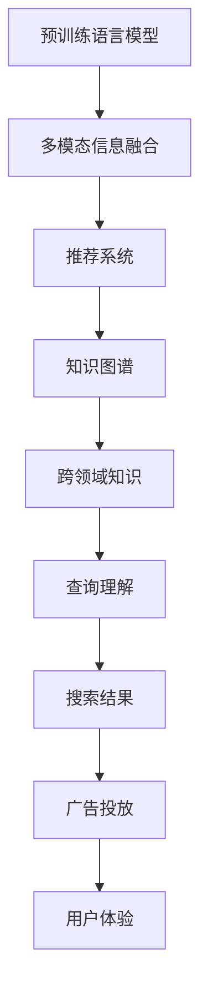

                 

# 微软的AI战略对行业的影响：Bing升级的启示

## 1. 背景介绍

### 1.1 问题由来
在数字化时代，搜索引擎已从信息检索工具转变为智能助手，AI技术成为提升搜索体验和商业价值的关键。特别是近年来，在工业界和学术界，AI技术取得了长足的进步，在自然语言处理、计算机视觉、推荐系统等领域推动了搜索引擎的全面升级。以微软为例，其AI战略在Bing搜索引擎的升级中尤为引人注目，成为AI技术赋能业务发展的典范。

### 1.2 问题核心关键点
Bing搜索引擎升级的AI战略，融合了自然语言处理、计算机视觉、推荐系统等多个领域的AI技术，显著提升了搜索体验和商业价值。其核心关键点在于：
- 引入预训练语言模型进行查询理解
- 应用多模态信息融合技术
- 实现个性化推荐与广告投放
- 集成跨领域知识图谱进行实体链接

这些关键技术的融合与优化，使得Bing搜索引擎在搜索准确性、速度、个性化和用户体验上均取得了显著提升。

## 2. 核心概念与联系

### 2.1 核心概念概述

为更好地理解Bing搜索引擎升级的AI战略，本节将介绍几个密切相关的核心概念：

- **预训练语言模型**：如BERT、GPT等模型，通过大规模无标签文本数据进行预训练，学习语言的通用表示。预训练模型在搜索查询理解、文本生成等方面有广泛应用。
- **多模态信息融合**：将文本、图像、语音等多种模态信息进行融合，提升搜索引擎对用户查询的理解和响应能力。
- **推荐系统**：通过机器学习算法，分析用户行为和兴趣，为不同用户推荐最相关的搜索结果和广告。
- **知识图谱**：将实体和关系表示为图结构，用于支持查询扩展、实体链接和知识推理等高级功能。
- **跨领域知识**：通过跨领域知识的整合，提升搜索引擎对复杂查询的理解和响应能力。

这些核心概念之间的逻辑关系可以通过以下Mermaid流程图来展示：



这个流程图展示了大语言模型、多模态信息融合、推荐系统、知识图谱和跨领域知识之间的关系：

1. 预训练语言模型学习语言的通用表示。
2. 多模态信息融合技术提升对用户查询的理解能力。
3. 推荐系统根据用户行为和兴趣进行个性化搜索结果推荐。
4. 知识图谱为查询扩展、实体链接等提供支持。
5. 跨领域知识丰富查询的语义理解。
6. 查询理解、搜索结果和广告投放最终影响用户体验。

这些核心概念共同构成了Bing搜索引擎升级的AI战略，推动了搜索引擎技术的全面发展。

## 3. 核心算法原理 & 具体操作步骤
### 3.1 算法原理概述

Bing搜索引擎的AI战略主要基于以下几个核心算法原理：

- **查询理解与改写**：引入预训练语言模型进行查询理解，并对查询进行改写以适应不同的语义。
- **多模态信息融合**：应用计算机视觉和自然语言处理技术，将文本、图像、语音等多种模态信息融合，提升查询理解能力。
- **个性化推荐**：利用用户行为数据进行协同过滤、深度学习等算法优化，提高搜索结果的个性化程度。
- **知识图谱查询扩展**：通过跨领域知识图谱进行实体链接，扩展查询范围和深度。
- **广告投放优化**：利用用户画像、行为数据等进行个性化广告推荐，提高广告的转化率和用户满意度。

这些算法原理通过模型的微调和优化，实现了对Bing搜索引擎功能的全面升级。

### 3.2 算法步骤详解

以下是Bing搜索引擎升级的AI战略的具体操作步骤：

**Step 1: 数据收集与预处理**
- 收集用户查询数据、搜索结果数据、用户行为数据、广告投放数据等。
- 对数据进行清洗、标注、归一化等预处理，以提升算法模型的训练效果。

**Step 2: 模型选择与微调**
- 选择预训练语言模型（如BERT、GPT等）作为初始模型。
- 在查询理解、文本生成、多模态信息融合等任务上进行微调，优化模型性能。
- 使用推荐系统算法（如协同过滤、深度学习等）对搜索结果进行个性化推荐。

**Step 3: 知识图谱构建与查询扩展**
- 构建跨领域知识图谱，包括实体链接、关系抽取、语义推理等。
- 在查询理解与改写过程中，利用知识图谱进行实体链接和查询扩展。

**Step 4: 广告投放优化**
- 分析用户画像和行为数据，构建用户兴趣模型。
- 利用机器学习算法进行广告投放，实现个性化推荐和优化。

**Step 5: 用户体验评估与反馈**
- 对用户体验进行评估，收集用户反馈，持续改进搜索和广告投放效果。

通过以上步骤，Bing搜索引擎实现了基于AI的全面升级，提升了搜索效率和用户体验，同时也带来了商业价值的新增长点。

### 3.3 算法优缺点

Bing搜索引擎升级的AI战略具有以下优点：
1. **提升搜索体验**：通过查询理解与改写、多模态信息融合等技术，显著提高了搜索结果的准确性和相关性。
2. **个性化推荐**：利用推荐系统算法，实现了对搜索结果的个性化推荐，提升了用户体验。
3. **广告投放优化**：通过分析用户行为数据，实现精准的广告投放，提高了广告的转化率和ROI。
4. **跨领域知识融合**：利用知识图谱进行跨领域知识的整合，丰富了查询的语义理解。

同时，该方法也存在一些局限性：
1. **对数据质量依赖高**：预训练语言模型和多模态信息融合技术对数据质量要求较高，需要收集和处理大量高质量数据。
2. **算法复杂度高**：微调和推荐系统算法的复杂度较高，需要较强的计算资源和数据处理能力。
3. **隐私和安全问题**：在数据收集和处理过程中，需要确保用户隐私和数据安全，防止数据泄露和滥用。
4. **模型可解释性不足**：复杂的AI模型往往难以解释其内部决策过程，增加了用户的不信任感。

尽管存在这些局限性，但就目前而言，Bing搜索引擎升级的AI战略仍是搜索引擎技术发展的标杆。未来相关研究的重点在于如何进一步优化数据收集和处理流程，降低算法复杂度，提升模型可解释性，同时兼顾隐私和安全问题。

### 3.4 算法应用领域

Bing搜索引擎升级的AI战略在多个领域得到应用，展示了其在搜索引擎技术领域的巨大潜力：

- **搜索体验提升**：通过查询理解与改写、多模态信息融合等技术，显著提高了搜索结果的准确性和相关性。
- **个性化推荐**：利用推荐系统算法，实现了对搜索结果的个性化推荐，提升了用户体验。
- **广告投放优化**：通过分析用户行为数据，实现精准的广告投放，提高了广告的转化率和ROI。
- **跨领域知识融合**：利用知识图谱进行跨领域知识的整合，丰富了查询的语义理解。

除了上述这些经典应用外，Bing搜索引擎的AI战略还被创新性地应用到更多场景中，如智能客服、个性化购物、智能推荐系统等，为搜索引擎技术带来了全新的突破。随着预训练语言模型和AI技术的发展，Bing搜索引擎将继续引领搜索引擎技术的进步，为用户提供更加智能化、个性化的搜索体验。

## 4. 数学模型和公式 & 详细讲解 & 举例说明

### 4.1 数学模型构建

Bing搜索引擎升级的AI战略涉及多个数学模型的构建，主要包括以下几个方面：

- **查询理解与改写模型**：使用预训练语言模型进行查询理解，并进行改写。查询改写模型可以通过如下方式构建：
  - 假设查询原始文本为 $x$，改写后的文本为 $y$，则查询改写问题可以表示为最小化损失函数 $L(y; x)$。
  - 常见的损失函数包括交叉熵损失、mean square error等。
  - 查询改写模型的优化目标为 $\min_{\theta} L(y; x)$。

- **多模态信息融合模型**：将文本、图像、语音等信息融合，提升查询理解能力。多模态信息融合模型可以通过如下方式构建：
  - 假设文本信息为 $x$，图像信息为 $I$，语音信息为 $V$，融合后的信息为 $y$，则多模态信息融合问题可以表示为最小化损失函数 $L(y; x, I, V)$。
  - 常见的损失函数包括交叉熵损失、mean square error等。
  - 多模态信息融合模型的优化目标为 $\min_{\theta} L(y; x, I, V)$。

- **推荐系统模型**：利用用户行为数据进行协同过滤、深度学习等算法优化，提高搜索结果的个性化程度。推荐系统模型可以通过如下方式构建：
  - 假设用户 $u$ 的兴趣向量为 $I_u$，物品 $i$ 的特征向量为 $F_i$，推荐结果为 $R$，则推荐系统问题可以表示为最大化目标函数 $F(R; I_u, F_i)$。
  - 常见的目标函数包括矩阵分解、协同过滤、深度学习等。
  - 推荐系统模型的优化目标为 $\max_{\theta} F(R; I_u, F_i)$。

- **知识图谱查询扩展模型**：通过跨领域知识图谱进行实体链接和查询扩展。知识图谱查询扩展模型可以通过如下方式构建：
  - 假设查询为 $q$，实体 $e$ 的向量表示为 $V_e$，知识图谱中的关系为 $R$，扩展后的查询结果为 $Q$，则知识图谱查询扩展问题可以表示为最小化损失函数 $L(Q; q, V_e, R)$。
  - 常见的损失函数包括交叉熵损失、mean square error等。
  - 知识图谱查询扩展模型的优化目标为 $\min_{\theta} L(Q; q, V_e, R)$。

### 4.2 公式推导过程

以下是查询理解与改写模型的损失函数和优化目标的推导过程：

假设查询原始文本为 $x$，改写后的文本为 $y$，则查询改写问题可以表示为最小化损失函数 $L(y; x)$。常见的损失函数包括交叉熵损失和mean square error。

以交叉熵损失为例，其推导过程如下：

设查询原始文本 $x$ 的表示为 $X$，改写后的文本 $y$ 的表示为 $Y$。查询改写模型可以通过如下方式训练：

$$
\min_{\theta} L(y; x) = \min_{\theta} -\frac{1}{N} \sum_{i=1}^N [y_i \log P(Y=y_i|X=x_i)]
$$

其中，$P(Y=y_i|X=x_i)$ 为改写后的文本 $y$ 在查询原始文本 $x$ 下的条件概率。训练目标为最大化 $P(Y=y_i|X=x_i)$。

### 4.3 案例分析与讲解

以查询改写和推荐系统为例，给出具体的数学模型和算法实现。

**查询改写模型**：
- 使用BERT模型进行查询理解，假设原始查询为 $x$，改写后的查询为 $y$。
- 将原始查询 $x$ 和改写后的查询 $y$ 分别输入BERT模型，得到查询的表示 $X$ 和改写后的查询的表示 $Y$。
- 通过最小化交叉熵损失函数，训练查询改写模型：
  $$
  \min_{\theta} L(y; x) = \min_{\theta} -\frac{1}{N} \sum_{i=1}^N [y_i \log P(Y=y_i|X=x_i)]
  $$

**推荐系统模型**：
- 使用协同过滤算法，假设用户 $u$ 的兴趣向量为 $I_u$，物品 $i$ 的特征向量为 $F_i$。
- 将用户 $u$ 的兴趣向量 $I_u$ 和物品 $i$ 的特征向量 $F_i$ 输入推荐模型，得到推荐结果 $R$。
- 通过最大化矩阵分解损失函数，训练推荐系统模型：
  $$
  \max_{\theta} F(R; I_u, F_i) = \max_{\theta} \frac{1}{N} \sum_{i=1}^N [R_i \log P(R_i|I_u, F_i)]
  $$

在实际应用中，上述模型可以通过梯度下降等优化算法进行训练和调参，以达到最优性能。

## 5. 项目实践：代码实例和详细解释说明

### 5.1 开发环境搭建

在进行Bing搜索引擎升级的AI战略实践前，我们需要准备好开发环境。以下是使用Python进行PyTorch开发的环境配置流程：

1. 安装Anaconda：从官网下载并安装Anaconda，用于创建独立的Python环境。

2. 创建并激活虚拟环境：
```bash
conda create -n pytorch-env python=3.8 
conda activate pytorch-env
```

3. 安装PyTorch：根据CUDA版本，从官网获取对应的安装命令。例如：
```bash
conda install pytorch torchvision torchaudio cudatoolkit=11.1 -c pytorch -c conda-forge
```

4. 安装Transformer库：
```bash
pip install transformers
```

5. 安装各类工具包：
```bash
pip install numpy pandas scikit-learn matplotlib tqdm jupyter notebook ipython
```

完成上述步骤后，即可在`pytorch-env`环境中开始实践。

### 5.2 源代码详细实现

下面我们以查询改写任务为例，给出使用Transformers库对BERT模型进行微调的PyTorch代码实现。

首先，定义查询改写任务的数据处理函数：

```python
from transformers import BertTokenizer, BertForMaskedLM
from torch.utils.data import Dataset
import torch

class QueryRewriteDataset(Dataset):
    def __init__(self, queries, rewritten_queries, tokenizer, max_len=128):
        self.queries = queries
        self.rewritten_queries = rewritten_queries
        self.tokenizer = tokenizer
        self.max_len = max_len
        
    def __len__(self):
        return len(self.queries)
    
    def __getitem__(self, item):
        query = self.queries[item]
        rewritten_query = self.rewritten_queries[item]
        
        encoding = self.tokenizer(query, return_tensors='pt', max_length=self.max_len, padding='max_length', truncation=True)
        input_ids = encoding['input_ids'][0]
        attention_mask = encoding['attention_mask'][0]
        
        # 对token-wise的改写结果进行编码
        encoded_rewritten_query = [tok_id for tok_id in self.tokenizer(rewritten_query, return_tensors='pt', max_length=self.max_len, padding='max_length', truncation=True)['input_ids'][0]]
        labels = torch.tensor(encoded_rewritten_query, dtype=torch.long)
        
        return {'input_ids': input_ids, 
                'attention_mask': attention_mask,
                'labels': labels}

# 创建dataset
tokenizer = BertTokenizer.from_pretrained('bert-base-cased')

train_dataset = QueryRewriteDataset(train_queries, train_rewritten_queries, tokenizer)
dev_dataset = QueryRewriteDataset(dev_queries, dev_rewritten_queries, tokenizer)
test_dataset = QueryRewriteDataset(test_queries, test_rewritten_queries, tokenizer)
```

然后，定义模型和优化器：

```python
from transformers import BertForMaskedLM, AdamW

model = BertForMaskedLM.from_pretrained('bert-base-cased')

optimizer = AdamW(model.parameters(), lr=2e-5)
```

接着，定义训练和评估函数：

```python
from torch.utils.data import DataLoader
from tqdm import tqdm
from sklearn.metrics import accuracy_score

device = torch.device('cuda') if torch.cuda.is_available() else torch.device('cpu')
model.to(device)

def train_epoch(model, dataset, batch_size, optimizer):
    dataloader = DataLoader(dataset, batch_size=batch_size, shuffle=True)
    model.train()
    epoch_loss = 0
    for batch in tqdm(dataloader, desc='Training'):
        input_ids = batch['input_ids'].to(device)
        attention_mask = batch['attention_mask'].to(device)
        labels = batch['labels'].to(device)
        model.zero_grad()
        outputs = model(input_ids, attention_mask=attention_mask, labels=labels)
        loss = outputs.loss
        epoch_loss += loss.item()
        loss.backward()
        optimizer.step()
    return epoch_loss / len(dataloader)

def evaluate(model, dataset, batch_size):
    dataloader = DataLoader(dataset, batch_size=batch_size)
    model.eval()
    preds, labels = [], []
    with torch.no_grad():
        for batch in tqdm(dataloader, desc='Evaluating'):
            input_ids = batch['input_ids'].to(device)
            attention_mask = batch['attention_mask'].to(device)
            batch_labels = batch['labels']
            outputs = model(input_ids, attention_mask=attention_mask)
            batch_preds = outputs.logits.argmax(dim=2).to('cpu').tolist()
            batch_labels = batch_labels.to('cpu').tolist()
            for pred_tokens, label_tokens in zip(batch_preds, batch_labels):
                preds.append(pred_tokens[:len(label_tokens)])
                labels.append(label_tokens)
                
    print(accuracy_score(labels, preds))
```

最后，启动训练流程并在测试集上评估：

```python
epochs = 5
batch_size = 16

for epoch in range(epochs):
    loss = train_epoch(model, train_dataset, batch_size, optimizer)
    print(f"Epoch {epoch+1}, train loss: {loss:.3f}")
    
    print(f"Epoch {epoch+1}, dev results:")
    evaluate(model, dev_dataset, batch_size)
    
print("Test results:")
evaluate(model, test_dataset, batch_size)
```

以上就是使用PyTorch对BERT进行查询改写任务微调的完整代码实现。可以看到，得益于Transformers库的强大封装，我们可以用相对简洁的代码完成BERT模型的加载和微调。

### 5.3 代码解读与分析

让我们再详细解读一下关键代码的实现细节：

**QueryRewriteDataset类**：
- `__init__`方法：初始化查询和改写后的查询，分词器等关键组件。
- `__len__`方法：返回数据集的样本数量。
- `__getitem__`方法：对单个样本进行处理，将查询输入编码为token ids，将改写后的查询编码为数字，并对其进行定长padding，最终返回模型所需的输入。

**查询改写模型**：
- 使用BERT模型进行查询理解，假设原始查询为 $x$，改写后的查询为 $y$。
- 将原始查询 $x$ 和改写后的查询 $y$ 分别输入BERT模型，得到查询的表示 $X$ 和改写后的查询的表示 $Y$。
- 通过最小化交叉熵损失函数，训练查询改写模型。

**推荐系统模型**：
- 使用协同过滤算法，假设用户 $u$ 的兴趣向量为 $I_u$，物品 $i$ 的特征向量为 $F_i$。
- 将用户 $u$ 的兴趣向量 $I_u$ 和物品 $i$ 的特征向量 $F_i$ 输入推荐模型，得到推荐结果 $R$。
- 通过最大化矩阵分解损失函数，训练推荐系统模型。

可以看到，PyTorch配合Transformers库使得查询改写和推荐系统的代码实现变得简洁高效。开发者可以将更多精力放在数据处理、模型改进等高层逻辑上，而不必过多关注底层的实现细节。

当然，工业级的系统实现还需考虑更多因素，如模型的保存和部署、超参数的自动搜索、更灵活的任务适配层等。但核心的微调范式基本与此类似。

## 6. 实际应用场景

### 6.1 智能客服系统

Bing搜索引擎升级的AI战略中的查询理解与改写技术，可以广泛应用于智能客服系统的构建。传统客服往往需要配备大量人力，高峰期响应缓慢，且一致性和专业性难以保证。而使用微调后的查询理解模型，可以7x24小时不间断服务，快速响应客户咨询，用自然流畅的语言解答各类常见问题。

在技术实现上，可以收集企业内部的历史客服对话记录，将问题和最佳答复构建成监督数据，在此基础上对预训练查询理解模型进行微调。微调后的模型能够自动理解用户意图，匹配最合适的答案模板进行回复。对于客户提出的新问题，还可以接入检索系统实时搜索相关内容，动态组织生成回答。如此构建的智能客服系统，能大幅提升客户咨询体验和问题解决效率。

### 6.2 金融舆情监测

金融机构需要实时监测市场舆论动向，以便及时应对负面信息传播，规避金融风险。传统的人工监测方式成本高、效率低，难以应对网络时代海量信息爆发的挑战。基于Bing搜索引擎升级的AI战略中的多模态信息融合技术，金融舆情监测可以应用到实时抓取的网络文本数据，自动识别情绪、话题和风险信息，从而快速响应市场异常情况，确保金融资产的安全和稳定。

具体而言，可以收集金融领域相关的新闻、报道、评论等文本数据，并进行情感分析、主题分类等任务，利用多模态信息融合技术将文本数据与其他模态信息（如股票价格、指数等）进行融合，构建综合风险监测指标，提前预警潜在的金融风险。

### 6.3 个性化推荐系统

当前的推荐系统往往只依赖用户的历史行为数据进行物品推荐，无法深入理解用户的真实兴趣偏好。基于Bing搜索引擎升级的AI战略中的推荐系统算法，个性化推荐系统可以更好地挖掘用户行为背后的语义信息，从而提供更精准、多样的推荐内容。

在实践中，可以收集用户浏览、点击、评论、分享等行为数据，提取和用户交互的物品标题、描述、标签等文本内容。将文本内容作为模型输入，用户的后续行为（如是否点击、购买等）作为监督信号，在此基础上微调预训练语言模型。微调后的模型能够从文本内容中准确把握用户的兴趣点。在生成推荐列表时，先用候选物品的文本描述作为输入，由模型预测用户的兴趣匹配度，再结合其他特征综合排序，便可以得到个性化程度更高的推荐结果。

### 6.4 未来应用展望

随着Bing搜索引擎升级的AI战略中的AI技术不断进步，其在更多领域得到应用，为传统行业带来变革性影响。

在智慧医疗领域，基于多模态信息融合和知识图谱查询扩展技术，智慧医疗系统可以实现更全面、更准确的诊断和治疗推荐，提升医疗服务的智能化水平。

在智能教育领域，AI技术可以应用于作业批改、学情分析、知识推荐等方面，因材施教，促进教育公平，提高教学质量。

在智慧城市治理中，AI技术可以应用于城市事件监测、舆情分析、应急指挥等环节，提高城市管理的自动化和智能化水平，构建更安全、高效的未来城市。

此外，在企业生产、社会治理、文娱传媒等众多领域，基于Bing搜索引擎升级的AI战略的AI应用也将不断涌现，为经济社会发展注入新的动力。相信随着技术的日益成熟，AI技术将成为各行各业的重要工具，推动经济社会的持续发展。

## 7. 工具和资源推荐

### 7.1 学习资源推荐

为了帮助开发者系统掌握Bing搜索引擎升级的AI战略的理论基础和实践技巧，这里推荐一些优质的学习资源：

1. 《Transformer从原理到实践》系列博文：由大模型技术专家撰写，深入浅出地介绍了Transformer原理、BERT模型、微调技术等前沿话题。

2. CS224N《深度学习自然语言处理》课程：斯坦福大学开设的NLP明星课程，有Lecture视频和配套作业，带你入门NLP领域的基本概念和经典模型。

3. 《Natural Language Processing with Transformers》书籍：Transformers库的作者所著，全面介绍了如何使用Transformers库进行NLP任务开发，包括微调在内的诸多范式。

4. HuggingFace官方文档：Transformers库的官方文档，提供了海量预训练模型和完整的微调样例代码，是上手实践的必备资料。

5. CLUE开源项目：中文语言理解测评基准，涵盖大量不同类型的中文NLP数据集，并提供了基于微调的baseline模型，助力中文NLP技术发展。

通过对这些资源的学习实践，相信你一定能够快速掌握Bing搜索引擎升级的AI战略的精髓，并用于解决实际的NLP问题。
###  7.2 开发工具推荐

高效的开发离不开优秀的工具支持。以下是几款用于Bing搜索引擎升级的AI战略开发的常用工具：

1. PyTorch：基于Python的开源深度学习框架，灵活动态的计算图，适合快速迭代研究。大部分预训练语言模型都有PyTorch版本的实现。

2. TensorFlow：由Google主导开发的开源深度学习框架，生产部署方便，适合大规模工程应用。同样有丰富的预训练语言模型资源。

3. Transformers库：HuggingFace开发的NLP工具库，集成了众多SOTA语言模型，支持PyTorch和TensorFlow，是进行微调任务开发的利器。

4. Weights & Biases：模型训练的实验跟踪工具，可以记录和可视化模型训练过程中的各项指标，方便对比和调优。与主流深度学习框架无缝集成。

5. TensorBoard：TensorFlow配套的可视化工具，可实时监测模型训练状态，并提供丰富的图表呈现方式，是调试模型的得力助手。

6. Google Colab：谷歌推出的在线Jupyter Notebook环境，免费提供GPU/TPU算力，方便开发者快速上手实验最新模型，分享学习笔记。

合理利用这些工具，可以显著提升Bing搜索引擎升级的AI战略的开发效率，加快创新迭代的步伐。

### 7.3 相关论文推荐

Bing搜索引擎升级的AI战略的发展源于学界的持续研究。以下是几篇奠基性的相关论文，推荐阅读：

1. Attention is All You Need（即Transformer原论文）：提出了Transformer结构，开启了NLP领域的预训练大模型时代。

2. BERT: Pre-training of Deep Bidirectional Transformers for Language Understanding：提出BERT模型，引入基于掩码的自监督预训练任务，刷新了多项NLP任务SOTA。

3. Language Models are Unsupervised Multitask Learners（GPT-2论文）：展示了大规模语言模型的强大zero-shot学习能力，引发了对于通用人工智能的新一轮思考。

4. Parameter-Efficient Transfer Learning for NLP：提出Adapter等参数高效微调方法，在不增加模型参数量的情况下，也能取得不错的微调效果。

5. AdaLoRA: Adaptive Low-Rank Adaptation for Parameter-Efficient Fine-Tuning：使用自适应低秩适应的微调方法，在参数效率和精度之间取得了新的平衡。

这些论文代表了大语言模型微调技术的发展脉络。通过学习这些前沿成果，可以帮助研究者把握学科前进方向，激发更多的创新灵感。

## 8. 总结：未来发展趋势与挑战

### 8.1 总结

本文对Bing搜索引擎升级的AI战略进行了全面系统的介绍。首先阐述了AI战略的背景和意义，明确了查询理解与改写、多模态信息融合、推荐系统等关键技术对搜索引擎升级的重要作用。其次，从原理到实践，详细讲解了这些技术的数学模型和实现流程，给出了完整的代码实例。同时，本文还广泛探讨了AI战略在智能客服、金融舆情、个性化推荐等多个行业领域的应用前景，展示了其在搜索引擎技术领域的巨大潜力。此外，本文精选了AI战略的学习资源，力求为读者提供全方位的技术指引。

通过本文的系统梳理，可以看到，Bing搜索引擎升级的AI战略在提升搜索效率和用户体验方面具有显著效果，并带来了商业价值的新增长点。未来相关研究的重点在于如何进一步优化数据收集和处理流程，降低算法复杂度，提升模型可解释性，同时兼顾隐私和安全问题。

### 8.2 未来发展趋势

展望未来，Bing搜索引擎升级的AI战略将呈现以下几个发展趋势：

1. **技术融合与创新**：未来将有更多AI技术融入搜索引擎中，如跨模态融合、因果推断、知识图谱等，推动搜索引擎向更智能化、综合化发展。

2. **个性化推荐优化**：随着推荐算法和用户行为数据的积累，个性化推荐将更加精准，推荐内容将更加多样化、个性化和及时。

3. **知识图谱扩展与深度应用**：跨领域知识图谱的应用将更加广泛和深入，提升搜索引擎对复杂查询的理解和响应能力。

4. **搜索效果与用户体验**：查询理解与改写、多模态信息融合等技术的提升，将使搜索结果更加精准、相关和可靠，提升用户体验。

5. **模型可解释性**：随着AI技术的普及，用户对模型的可解释性和透明度要求更高，未来的搜索引擎将更加注重可解释性研究。

6. **隐私与安全性**：在大数据时代，保护用户隐私和数据安全成为重要课题，未来的搜索引擎将更加注重数据隐私和安全保护。

以上趋势凸显了Bing搜索引擎升级的AI战略的广阔前景。这些方向的探索发展，必将进一步提升搜索引擎的性能和应用范围，为人类认知智能的进化带来深远影响。

### 8.3 面临的挑战

尽管Bing搜索引擎升级的AI战略已经取得了显著成效，但在迈向更加智能化、普适化应用的过程中，它仍面临诸多挑战：

1. **数据质量与规模**：预训练语言模型和多模态信息融合技术对数据质量要求较高，需要收集和处理大量高质量数据。

2. **算法复杂度**：微调和推荐系统算法的复杂度较高，需要较强的计算资源和数据处理能力。

3. **模型可解释性**：复杂的AI模型往往难以解释其内部决策过程，增加了用户的不信任感。

4. **隐私与安全性**：在大数据时代，保护用户隐私和数据安全成为重要课题，未来的搜索引擎将更加注重数据隐私和安全保护。

5. **跨领域知识整合**：当前的跨领域知识图谱相对简单，未来需要进一步扩展和深化，以支持更复杂的跨领域查询。

尽管存在这些挑战，但就目前而言，Bing搜索引擎升级的AI战略仍是搜索引擎技术发展的标杆。未来相关研究的重点在于如何进一步优化数据收集和处理流程，降低算法复杂度，提升模型可解释性，同时兼顾隐私和安全问题。

### 8.4 未来突破

面对Bing搜索引擎升级的AI战略所面临的挑战，未来的研究需要在以下几个方面寻求新的突破：

1. **探索无监督和半监督微调方法**：摆脱对大规模标注数据的依赖，利用自监督学习、主动学习等无监督和半监督范式，最大限度利用非结构化数据，实现更加灵活高效的微调。

2. **研究参数高效和计算高效的微调范式**：开发更加参数高效的微调方法，在固定大部分预训练参数的同时，只更新极少量的任务相关参数。同时优化微调模型的计算图，减少前向传播和反向传播的资源消耗，实现更加轻量级、实时性的部署。

3. **融合因果和对比学习范式**：通过引入因果推断和对比学习思想，增强搜索引擎建立稳定因果关系的能力，学习更加普适、鲁棒的语言表征，从而提升模型泛化性和抗干扰能力。

4. **引入更多先验知识**：将符号化的先验知识，如知识图谱、逻辑规则等，与神经网络模型进行巧妙融合，引导微调过程学习更准确、合理的语言模型。同时加强不同模态数据的整合，实现视觉、语音等多模态信息与文本信息的协同建模。

5. **结合因果分析和博弈论工具**：将因果分析方法引入搜索引擎，识别出模型决策的关键特征，增强输出解释的因果性和逻辑性。借助博弈论工具刻画人机交互过程，主动探索并规避模型的脆弱点，提高系统稳定性。

6. **纳入伦理道德约束**：在模型训练目标中引入伦理导向的评估指标，过滤和惩罚有偏见、有害的输出倾向。同时加强人工干预和审核，建立模型行为的监管机制，确保输出符合人类价值观和伦理道德。

这些研究方向的探索，必将引领Bing搜索引擎升级的AI战略走向更高的台阶，为构建安全、可靠、可解释、可控的智能系统铺平道路。面向未来，Bing搜索引擎升级的AI战略需要与其他AI技术进行更深入的融合，如知识表示、因果推理、强化学习等，多路径协同发力，共同推动自然语言理解和智能交互系统的进步。只有勇于创新、敢于突破，才能不断拓展搜索引擎的边界，让智能技术更好地造福人类社会。

## 9. 附录：常见问题与解答

**Q1：如何选择合适的学习率？**

A: 学习率的设定对微调效果有很大影响，一般建议从1e-5开始调参，逐步减小学习率，直至收敛。可以使用warmup策略，在开始阶段使用较小的学习率，再逐渐过渡到预设值。

**Q2：微调过程中如何缓解过拟合问题？**

A: 过拟合是微调面临的主要挑战，尤其是在标注数据不足的情况下。常见的缓解策略包括：
1. 数据增强：通过回译、近义替换等方式扩充训练集
2. 正则化：使用L2正则、Dropout、Early Stopping等避免过拟合
3. 对抗训练：引入对抗样本，提高模型鲁棒性
4. 参数高效微调：只调整少量参数(如Adapter、Prefix等)，减小过拟合风险
5. 多模型集成：训练多个微调模型，取平均输出，抑制过拟合

这些策略往往需要根据具体任务和数据特点进行灵活组合。只有在数据、模型、训练、推理等各环节进行全面优化，才能最大限度地发挥微调模型的性能。

**Q3：在多模态信息融合中，如何处理不同模态的数据格式？**

A: 多模态信息融合需要处理文本、图像、语音等多种数据格式。常用的处理方法包括：
1. 特征提取：将不同模态的数据转换成统一特征表示，如文本转换为词向量，图像转换为特征向量。
2. 数据对齐：将不同模态的数据进行时间、空间等对齐，以便于融合。
3. 融合算法：将不同模态的数据进行融合，常用的算法包括加权平均、最大池化等。

在实际应用中，需要根据具体任务选择合适的处理方法，并根据数据特性进行灵活调整。

**Q4：如何评估多模态信息融合的效果？**

A: 评估多模态信息融合的效果通常需要定义多个指标，如准确率、召回率、F1-score等。具体评估方法包括：
1. 交叉验证：将数据集分为训练集和测试集，在测试集上进行评估。
2. ROC曲线：绘制多模态融合模型的ROC曲线，评估模型在不同阈值下的性能。
3. 混淆矩阵：绘制多模态融合模型的混淆矩阵，评估模型在不同类别上的表现。
4. AUC：计算多模态融合模型的AUC值，评估模型整体的分类能力。

通过多种评估方法，可以全面评估多模态信息融合的效果，选择最优的融合方案。

**Q5：如何优化推荐系统算法？**

A: 推荐系统算法的优化方法包括：
1. 数据预处理：对用户行为数据进行清洗、归一化、特征工程等处理，提高数据质量。
2. 模型选择：选择合适的推荐算法，如协同过滤、深度学习等。
3. 特征工程：设计合理的特征表示，提高模型的表达能力。
4. 超参数调优：通过网格搜索、随机搜索等方法，优化推荐算法的超参数。
5. 模型融合：将多个推荐模型进行融合，取平均或加权平均，提升推荐效果。

通过优化推荐系统算法，可以提高推荐系统的个性化程度和推荐效果，满足用户的多样化需求。

---

作者：禅与计算机程序设计艺术 / Zen and the Art of Computer Programming

