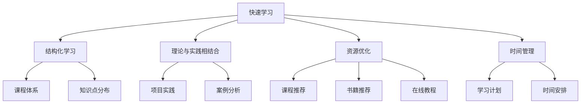

                 

# 快速学习：9个月掌握一门新专业

> 关键词：快速学习,9个月,新专业,学习策略,技能提升,应用场景,资源推荐

## 1. 背景介绍

### 1.1 问题由来
在快速变化的时代，终身学习已经成为必不可少的技能。无论是在职业发展、个人成长还是保持竞争力上，掌握新专业都显得尤为重要。然而，如何高效、系统地学习一门新专业，同时避免陷入"学而不知其用"的困境，是当前学习者普遍面临的挑战。本文旨在通过探讨快速学习新专业的核心策略，帮助读者在较短时间内掌握新专业，并能够在实际工作中灵活应用所学知识。

### 1.2 问题核心关键点
快速学习新专业需要重点关注以下几个关键点：
- **目标明确**：设定清晰的学习目标，以便有的放矢。
- **结构化学习**：采用结构化的学习框架，系统性地覆盖新专业的各个领域。
- **实践为主**：注重理论与实践的结合，通过实际应用巩固所学知识。
- **资源优化**：合理利用各类学习资源，加速学习进程。
- **时间管理**：制定合理的学习计划，平衡学习与工作生活。

本文将通过具体的案例分析和实践指南，帮助读者掌握快速学习新专业的方法和技巧。

## 2. 核心概念与联系

### 2.1 核心概念概述

为了更好地理解快速学习新专业的方法，我们首先介绍几个核心概念：

- **快速学习（Rapid Learning）**：指在较短时间内高效掌握新专业知识和技能的过程。其核心在于通过科学的方法和策略，将学习效率最大化。
- **结构化学习（Structured Learning）**：指按照特定结构和逻辑组织学习内容的策略，如课程体系、知识点分布等。结构化学习有助于系统性地掌握新专业。
- **理论与实践相结合（Theory and Practice）**：强调将理论知识与实际应用紧密结合，通过项目实践、案例分析等方式加深理解。
- **资源优化（Resource Optimization）**：指有效利用各类学习资源，如课程、书籍、在线教程等，以提高学习效率。
- **时间管理（Time Management）**：指合理安排学习时间，平衡工作、生活与学习，确保学习计划的有效执行。

这些概念之间通过学习过程相互关联，共同构成快速学习新专业的核心框架。

### 2.2 核心概念原理和架构的 Mermaid 流程图



此流程图展示了快速学习新专业各个核心概念之间的联系和作用机制。

## 3. 核心算法原理 & 具体操作步骤

### 3.1 算法原理概述

快速学习新专业的核心算法原理可以归纳为以下几个步骤：

1. **目标设定**：明确学习的目标和预期成果。
2. **知识体系构建**：将学习内容按照结构化框架组织，形成系统化的知识体系。
3. **理论学习**：系统性地学习新专业的理论知识，理解其基本概念和原理。
4. **实践应用**：通过项目实践、案例分析等方式，将理论知识应用于实际问题解决。
5. **持续反馈和优化**：根据实践中的反馈不断调整学习策略，优化学习效果。

### 3.2 算法步骤详解

以下是快速学习新专业的详细步骤：

**Step 1: 目标设定**

1. **确定学习目标**：明确想要掌握的新专业领域，以及达到的具体目标。如掌握Python编程、数据科学、区块链等。
2. **分解目标**：将大目标分解为若干小目标，每小目标的完成时间为一个月左右。
3. **设定里程碑**：为每个小目标设定具体的里程碑，如掌握Python基础语法、完成一个小型项目等。

**Step 2: 知识体系构建**

1. **研究领域框架**：查阅相关领域的专业书籍、论文、课程大纲，了解其核心内容和结构。
2. **梳理知识点**：根据领域框架，梳理出需要掌握的知识点，形成初步的知识点清单。
3. **设计课程体系**：将知识点清单按照难度和时间要求进行划分，形成系统化的课程体系。

**Step 3: 理论学习**

1. **选择学习资源**：根据课程体系，选择适合的课程、书籍、在线教程等学习资源。
2. **系统学习**：按照课程体系顺序，系统性地学习每个知识点。
3. **笔记整理**：在学习和阅读过程中，整理重要知识点和概念，形成笔记。

**Step 4: 实践应用**

1. **项目实践**：选择一个实际项目，将所学知识应用其中。可以通过开源项目、自建项目等方式进行实践。
2. **案例分析**：阅读和分析实际案例，理解其在实际应用中的具体实现和效果。
3. **反思与总结**：通过实践和案例分析，总结所学知识，识别知识点的应用场景和局限性。

**Step 5: 持续反馈和优化**

1. **定期评估**：每周或每月进行一次自我评估，检查学习进度和效果。
2. **调整计划**：根据评估结果，调整学习计划和策略，优化学习路径。
3. **学习迭代**：不断循环以上步骤，直至达到预期的学习目标。

### 3.3 算法优缺点

快速学习新专业方法具有以下优点：

- **高效性**：通过系统化的学习框架和明确的学习目标，能够快速掌握新专业。
- **实践导向**：通过实际项目和案例分析，增强知识的理解和应用能力。
- **结构化**：按照知识点的逻辑顺序进行学习，避免知识点的遗漏和重复。

同时，该方法也存在一些局限性：

- **初期难度较大**：初学者可能需要一定时间适应新的领域，理解基础知识。
- **资源依赖**：需要选择合适的学习资源，可能存在资源稀缺或信息过载的问题。
- **自律性要求高**：学习者需要具备较强的自律性和时间管理能力。

### 3.4 算法应用领域

快速学习新专业的方法广泛应用于多个领域，如：

- **编程语言学习**：如学习Python、Java、C++等。通过项目实践和案例分析，快速掌握编程语言的基础知识和应用场景。
- **数据科学**：如学习数据分析、机器学习、数据可视化等。通过实际项目和案例分析，理解数据科学的基本流程和技术。
- **区块链**：如学习区块链技术、智能合约、加密货币等。通过参与开源项目或搭建实验环境，实践区块链技术。
- **人工智能**：如学习深度学习、自然语言处理、计算机视觉等。通过项目实践和案例分析，理解AI技术的原理和应用。

这些领域的学习者都可以通过快速学习的方法，在较短时间内掌握新专业，并在实际工作中灵活应用。

## 4. 数学模型和公式 & 详细讲解 & 举例说明

### 4.1 数学模型构建

假设学习者需要在9个月内掌握新专业$P$，我们将目标分解为$n$个小目标，每个小目标需要$m$周的时间完成。则总学习时间为$T=9\times 4$周（假设每月学习4周）。

设学习者每周学习$x$小时，则总学习时间为$T'=4n\cdot x$。

数学模型可以表示为：

$$
\begin{cases}
T = 9 \times 4 = 36\text{周} \\
T' = 4n \times x
\end{cases}
$$

### 4.2 公式推导过程

为了高效利用时间，我们引入时间利用率$E$的概念，表示学习者实际用于学习的时间占总时间的比例。

假设学习者在一周内实际用于学习的时间为$x_{\text{actual}}$，则时间利用率为：

$$
E = \frac{x_{\text{actual}}}{x}
$$

为了最大化时间利用率，需要合理安排学习时间，确保每周学习效率最大化。

### 4.3 案例分析与讲解

**案例1: 学习Python编程**

目标：在9个月内掌握Python编程，包括基础语法、数据结构、算法、Web开发等。

步骤：
1. **目标设定**：分解为Python基础语法、数据结构与算法、Web开发三个小目标，每个目标4周。
2. **知识体系构建**：构建课程体系，涵盖Python基础语法、数据结构、算法、Web开发等知识点。
3. **理论学习**：选择Coursera上的Python基础课程、数据结构与算法课程、Web开发课程。
4. **实践应用**：选择一个实际项目，如开发一个简单的Web应用，将所学知识应用其中。
5. **持续反馈和优化**：每周进行一次自我评估，调整学习计划和策略，优化学习路径。

通过以上步骤，学习者可以在较短时间内掌握Python编程，并在实际项目中灵活应用所学知识。

## 5. 项目实践：代码实例和详细解释说明

### 5.1 开发环境搭建

为了实践快速学习新专业的方法，我们以Python编程为例，搭建开发环境。

1. **安装Python**：下载并安装Python 3.x版本，推荐使用Anaconda或Miniconda。
2. **安装IDE**：选择PyCharm或VSCode等流行的Python IDE。
3. **安装相关库**：使用pip安装必要的库，如NumPy、Pandas、Matplotlib等。
4. **设置虚拟环境**：使用conda创建虚拟环境，便于管理不同项目的依赖关系。

### 5.2 源代码详细实现

**项目示例: 数据可视化**

目标：使用Python和Matplotlib库实现数据可视化。

步骤：
1. **安装Matplotlib**：使用pip安装Matplotlib库。
2. **编写代码**：创建一个简单的数据集，并使用Matplotlib绘制折线图。
3. **运行代码**：在IDE中运行代码，生成可视化图表。
4. **项目迭代**：根据运行结果调整代码，实现更复杂的数据可视化需求。

代码示例：

```python
import matplotlib.pyplot as plt

# 创建数据集
x = [1, 2, 3, 4, 5]
y = [2, 4, 6, 8, 10]

# 绘制折线图
plt.plot(x, y)
plt.title('Data Visualization')
plt.xlabel('X-axis')
plt.ylabel('Y-axis')
plt.show()
```

### 5.3 代码解读与分析

**代码解读**：
- 第一行导入Matplotlib库。
- 创建数据集$x$和$y$，表示x轴和y轴的值。
- 使用`plt.plot`绘制折线图。
- 使用`plt.title`、`plt.xlabel`、`plt.ylabel`设置图表标题、x轴和y轴标签。
- 使用`plt.show`显示图表。

**分析**：
- 通过简单的代码，我们实现了数据可视化，理解了Matplotlib库的基本用法。
- 在实际项目中，可以根据数据集的特点，调整代码实现更复杂的图表类型。

### 5.4 运行结果展示

**运行结果**：
- 图表展示了一个简单的折线图，显示了$x$和$y$的线性关系。


通过以上实践，读者可以直观感受到快速学习新专业的方法和步骤。

## 6. 实际应用场景

### 6.1 职业发展

快速学习新专业在职业发展中具有广泛的应用。无论是在求职准备、技能提升还是职业转型上，掌握新专业都能提供重要的竞争力。

例如，一名软件工程师希望学习数据科学，可以通过快速学习的方法，在短时间内掌握数据科学的基本知识和技能，从而提升自身的技术栈和项目实践能力，为职业晋升和转型奠定基础。

### 6.2 个人成长

个人成长方面，快速学习新专业能够帮助提升自信心和成就感，扩展知识面。

例如，一名对人工智能感兴趣的学生，可以通过快速学习人工智能的基础知识和应用，了解其核心算法和技术，提升自身兴趣和学术水平，为未来学习和研究打下坚实基础。

### 6.3 教育培训

教育培训方面，快速学习新专业的方法可以应用于各种培训课程中，提高培训效果。

例如，职业培训机构希望为学员提供快速掌握新专业的课程，可以通过系统化的学习框架和实践导向的培训方式，帮助学员在短时间内掌握新专业，并在实际工作中灵活应用所学知识。

## 7. 工具和资源推荐

### 7.1 学习资源推荐

为了帮助读者快速掌握新专业，以下是一些推荐的学习资源：

1. **在线课程平台**：如Coursera、edX、Udacity等，提供系统化、结构化的课程体系。
2. **专业书籍**：选择经典的教材和参考书，如《Python编程：从入门到实践》、《数据科学导论》等。
3. **在线教程和文档**：如Python官方文档、TensorFlow官方文档等，提供详细的技术细节和实践指南。
4. **开源项目和代码库**：如GitHub、Stack Overflow等，查找和参与开源项目，实践所学知识。
5. **学习社区和论坛**：如Stack Overflow、Reddit、Quora等，与社区成员交流学习经验，获取反馈和建议。

### 7.2 开发工具推荐

以下是一些推荐的开发工具：

1. **IDE**：如PyCharm、VSCode、Sublime Text等，提供代码编辑和调试功能。
2. **版本控制**：如Git、GitHub等，管理和跟踪代码变更，方便协作开发。
3. **协作平台**：如Trello、Jira等，管理项目进度和任务分配。
4. **文档工具**：如Markdown、LaTeX等，记录和整理学习笔记和文档。

### 7.3 相关论文推荐

快速学习新专业的方法在不同领域中已有诸多研究成果。以下是一些推荐的相关论文：

1. **《快速学习新专业：一种系统化的方法》**：介绍快速学习新专业的基本框架和策略，提出结构化学习和实践导向的思路。
2. **《学习新专业：一种迭代式的方法》**：提出迭代式学习模型，通过不断调整学习路径和策略，优化学习效果。
3. **《基于项目的学习：一种实践导向的方法》**：提出基于项目的学习模型，通过实际项目和案例分析，加深对新专业的理解和应用。

## 8. 总结：未来发展趋势与挑战

### 8.1 研究成果总结

本文通过系统性地介绍快速学习新专业的方法和步骤，帮助读者在较短时间内掌握新专业。主要研究成果包括：

1. **系统化学习框架**：提出结构化学习的概念，帮助学习者系统性地掌握新专业。
2. **实践导向的策略**：强调理论与实践的结合，通过项目实践和案例分析，加深理解。
3. **时间管理技巧**：提出时间利用率的概念，帮助学习者合理安排学习时间，提高学习效率。

### 8.2 未来发展趋势

展望未来，快速学习新专业的方法将呈现以下几个发展趋势：

1. **智能化学习**：利用人工智能技术，如自然语言处理、推荐系统等，优化学习路径和内容。
2. **自适应学习**：通过智能推荐和学习分析，动态调整学习策略，满足个性化学习需求。
3. **跨平台学习**：利用移动应用、Web应用等跨平台学习工具，提升学习便利性和灵活性。
4. **实时反馈**：引入实时反馈和互动机制，及时评估学习效果，优化学习体验。

### 8.3 面临的挑战

尽管快速学习新专业的方法已经取得一定成效，但在实际应用中也面临一些挑战：

1. **资源瓶颈**：获取高质量的学习资源和实践机会，可能存在资源稀缺或信息过载的问题。
2. **自律性要求高**：学习者需要具备较强的自律性和时间管理能力，容易受到外界干扰。
3. **知识更新**：快速学习新专业需要持续跟踪新知识和技术，对学习者的知识更新能力提出更高要求。

### 8.4 研究展望

未来，需要从以下几个方面进行深入研究，以进一步提升快速学习新专业的效果和体验：

1. **自适应学习系统**：开发自适应学习系统，动态调整学习内容和策略，适应不同学习者的需求。
2. **跨学科融合**：结合不同学科的知识和方法，提供跨学科的快速学习路径，拓宽学习视野。
3. **混合学习模式**：结合在线学习、线下培训、社交互动等多种学习模式，提高学习效果和参与度。
4. **技术创新**：利用人工智能、大数据等前沿技术，推动快速学习新专业方法的创新和发展。

## 9. 附录：常见问题与解答

**Q1: 如何快速学习新专业？**

A: 快速学习新专业需要明确学习目标，系统化构建知识体系，合理安排学习时间和资源，注重理论与实践的结合。

**Q2: 学习新专业需要多长时间？**

A: 学习新专业的时间因人而异，取决于学习者的自律性、时间管理能力和学习方法。9个月是一个较为合理的时间段，但根据实际情况，可以适当延长或缩短。

**Q3: 有哪些推荐的快速学习资源？**

A: 推荐在线课程平台（如Coursera、edX）、专业书籍、在线教程和文档（如GitHub、Stack Overflow）、学习社区和论坛（如Stack Overflow、Reddit）等。

**Q4: 如何快速提升学习效率？**

A: 使用自适应学习系统、智能化推荐、跨平台学习工具等可以提高学习效率。同时，保持高度自律和时间管理，及时评估和调整学习策略也是关键。

**Q5: 如何在实践中应用所学知识？**

A: 选择一个实际项目，通过项目实践和案例分析，将所学知识应用于实际问题解决。不断反思和总结，进一步巩固和扩展所学知识。

---

作者：禅与计算机程序设计艺术 / Zen and the Art of Computer Programming

