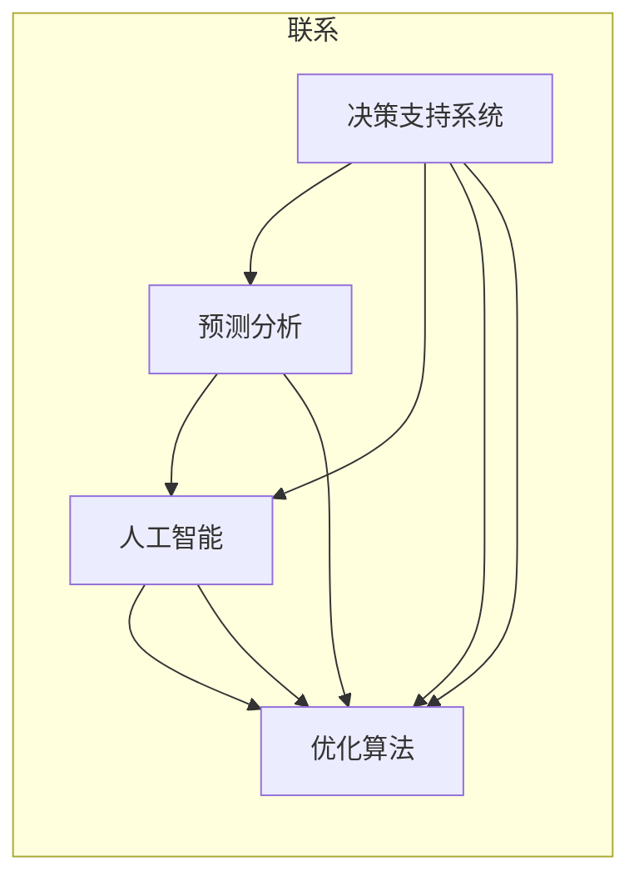

                 

# 思维工具在管理中的实际应用

> 关键词：管理，决策支持系统，思维工具，人工智能，大数据，复杂系统

## 1. 背景介绍

### 1.1 问题由来
在现代企业中，管理决策始终是高层领导的重要职责。但传统管理方法往往存在诸多不足，如信息过载、决策复杂度高、难以量化、难以集成多源信息等。面对日益复杂的商业环境，企业需要借助先进的技术手段来提升管理决策的科学性和有效性。

在信息时代，人工智能和大数据技术为管理决策提供了新的思路和工具。通过引入智能化的思维工具，企业可以在数据驱动的基础上，进行更全面、更精确、更高效的决策支持。

### 1.2 问题核心关键点
基于此，本文将详细探讨几种重要的管理思维工具，包括决策支持系统、预测分析、人工智能和优化算法等，分析其原理和应用场景。具体问题关键点如下：

1. 决策支持系统在管理中的应用。
2. 预测分析在决策中的作用。
3. 人工智能与大数据如何协助管理决策。
4. 优化算法在复杂系统中的实际应用。

## 2. 核心概念与联系

### 2.1 核心概念概述

以下是对决策支持系统、预测分析、人工智能和优化算法的核心概念和相互联系的介绍：

#### 决策支持系统 (Decision Support System, DSS)
决策支持系统是一种基于信息技术和数据模型的管理工具，通过提供各种分析工具，支持高层管理人员进行复杂决策。它通常包括数据仓库、数据挖掘、预测模型、优化算法等组件，以提升决策的效率和准确性。

#### 预测分析 (Predictive Analytics)
预测分析是指通过分析历史数据和行为模式，预测未来趋势和事件的概率。它通常包括统计学方法、机器学习算法和数据可视化技术，帮助企业进行需求预测、风险评估、市场预测等。

#### 人工智能 (Artificial Intelligence, AI)
人工智能是一种模仿人类智能的技术，包括机器学习、自然语言处理、计算机视觉等。AI在管理中主要应用于自动化任务、智能推荐、数据分析等方面，可以大幅提高工作效率和决策质量。

#### 优化算法 (Optimization Algorithm)
优化算法是指在给定约束条件下，寻找最优解或近似最优解的数学和计算方法。它通常用于解决生产调度、供应链管理、资源配置等复杂问题，以提高效率和效益。

这些核心概念相互交织，共同构成了现代管理决策的技术框架。通过深入理解这些工具的原理和应用，企业可以更好地应用它们，提升管理决策的科学性和准确性。

### 2.2 核心概念原理和架构的 Mermaid 流程图



该图展示了决策支持系统、预测分析、人工智能和优化算法之间的联系。其中，决策支持系统是整个系统的核心，提供数据支持和决策建议；预测分析和人工智能分别通过数据挖掘和智能算法，辅助决策支持系统进行预测和智能化决策；优化算法则用于对复杂问题进行求解，辅助系统进行资源配置和调优。

## 3. 核心算法原理 & 具体操作步骤

### 3.1 算法原理概述

管理决策的复杂性要求决策支持系统具备强大的数据处理和分析能力。决策支持系统通常包括以下几个核心组件：

#### 数据仓库 (Data Warehouse)
数据仓库是决策支持系统的数据基础，用于存储和管理企业历史和实时数据。通过数据仓库，企业可以集中管理各类数据，为预测分析和决策支持提供稳定的数据源。

#### 数据挖掘 (Data Mining)
数据挖掘是发现数据中的有用信息和知识的过程。通过数据挖掘，企业可以从海量数据中提取有价值的模式和规律，为预测分析和决策支持提供依据。

#### 预测分析 (Predictive Analytics)
预测分析通过对历史数据和行为模式进行建模，预测未来趋势和事件的概率。它通常包括时间序列分析、回归分析、分类分析等技术，帮助企业进行市场预测、需求评估、风险管理等。

#### 优化算法 (Optimization Algorithm)
优化算法用于在复杂系统中寻找最优或近似最优解。它通常包括线性规划、整数规划、遗传算法等技术，用于解决生产调度、资源配置、供应链管理等问题。

### 3.2 算法步骤详解

#### 数据仓库构建
1. **数据集成**：将企业各业务系统中的数据进行整合，消除数据孤岛，确保数据的一致性和完整性。
2. **数据存储**：选择合适的数据库系统，如关系型数据库、NoSQL数据库等，存储和管理企业数据。
3. **数据治理**：建立数据质量管理机制，确保数据的准确性、完整性和一致性。

#### 数据挖掘流程
1. **数据预处理**：对原始数据进行清洗、归一化、采样等处理，提高数据质量。
2. **特征提取**：从数据中提取有意义的特征，如统计特征、文本特征、时间特征等。
3. **模型训练**：选择适合的数据挖掘算法，如分类、聚类、关联规则等，进行模型训练。
4. **结果验证**：对模型进行验证和评估，确保其准确性和可靠性。

#### 预测分析过程
1. **数据准备**：收集和整理历史数据，确保数据质量。
2. **模型选择**：选择适合的预测模型，如时间序列模型、回归模型、神经网络等。
3. **模型训练**：对模型进行训练，确保其能够准确预测未来事件。
4. **结果应用**：将预测结果应用于实际决策中，进行风险评估、需求预测等。

#### 优化算法应用
1. **问题建模**：将实际问题转化为数学模型，如线性规划模型、整数规划模型等。
2. **算法求解**：选择合适的优化算法，如遗传算法、模拟退火算法、动态规划等。
3. **结果分析**：对优化结果进行分析和评估，找出最优方案。
4. **结果应用**：将优化结果应用于实际问题中，提升效率和效益。

### 3.3 算法优缺点

#### 决策支持系统
**优点**：
- 提供全面的数据支持。
- 帮助高层管理者进行复杂决策。
- 支持数据可视化和分析。

**缺点**：
- 系统复杂度高，开发和维护成本高。
- 对数据质量和治理要求高。

#### 预测分析
**优点**：
- 提高决策的科学性和准确性。
- 提前识别潜在问题和风险。
- 支持企业的灵活应变。

**缺点**：
- 对数据量和质量要求高。
- 模型选择和调参复杂。

#### 人工智能
**优点**：
- 提高自动化水平，减少人工干预。
- 支持复杂任务和决策。
- 提升数据处理和分析能力。

**缺点**：
- 对数据和计算资源要求高。
- 模型解释性和可控性差。

#### 优化算法
**优点**：
- 提高资源利用效率。
- 解决复杂问题，提升决策效率。
- 支持动态调整和优化。

**缺点**：
- 算法复杂度较高。
- 对模型参数和约束条件要求高。

### 3.4 算法应用领域

#### 决策支持系统
1. **战略规划**：支持企业高层进行战略规划和决策。
2. **市场分析**：分析市场趋势，制定市场策略。
3. **风险管理**：进行风险评估和控制。

#### 预测分析
1. **销售预测**：预测销售趋势，制定营销策略。
2. **库存管理**：预测库存需求，优化库存管理。
3. **客户行为分析**：预测客户行为，制定客户策略。

#### 人工智能
1. **智能客服**：自动化处理客户查询，提高服务效率。
2. **智能推荐**：个性化推荐产品和服务，提升用户体验。
3. **智能监测**：实时监测业务状态，提供预警和建议。

#### 优化算法
1. **供应链优化**：优化供应链网络，降低成本，提升效率。
2. **生产调度**：优化生产计划和调度，提升生产效率。
3. **资源配置**：优化资源配置，提升资源利用效率。

## 4. 数学模型和公式 & 详细讲解 & 举例说明

### 4.1 数学模型构建

#### 线性规划模型 (Linear Programming Model)
线性规划模型是优化算法中最基本和常用的模型之一。它通常用于解决资源分配、生产调度、供应链管理等问题。线性规划模型的数学表达式如下：

$$
\begin{align*}
\min & \quad \mathbf{c}^T \mathbf{x} \\
\text{s.t.} & \quad \mathbf{A}\mathbf{x} = \mathbf{b}, \quad \mathbf{x} \geq \mathbf{0}
\end{align*}
$$

其中，$\mathbf{c}$ 为成本系数，$\mathbf{x}$ 为决策变量，$\mathbf{A}$ 为约束矩阵，$\mathbf{b}$ 为约束常数向量。

### 4.2 公式推导过程

#### 时间序列预测模型
时间序列预测模型常用于销售预测、市场需求分析等。常用的模型包括ARIMA模型、指数平滑模型等。以ARIMA模型为例，其数学表达式如下：

$$
\begin{align*}
Y_t & = c + \sum_{i=1}^p \alpha_i Y_{t-i} + \sum_{i=1}^q \beta_i \Delta Y_{t-i} + \sum_{i=1}^p \gamma_i \epsilon_{t-i} \\
\epsilon_t & \sim N(0, \sigma^2)
\end{align*}
$$

其中，$Y_t$ 为时间$t$的预测值，$c$为截距，$\alpha_i$ 和 $\beta_i$ 为模型参数，$\epsilon_t$ 为误差项。

### 4.3 案例分析与讲解

#### 案例1：供应链优化
某企业需要进行供应链网络优化，确保在有限的资源下，实现最大化的收益。假设企业有三种产品，对应的需求和成本如下：

- 产品1：需求1000个，单位成本10元
- 产品2：需求800个，单位成本15元
- 产品3：需求1200个，单位成本20元

企业有两条生产线和两条运输线，每条生产线每天最多生产300个产品，每条运输线每天最多运输1000个产品。要求最小化总成本，同时满足需求。

根据线性规划模型，建立优化模型如下：

$$
\begin{align*}
\min & \quad 10x_1 + 15x_2 + 20x_3 \\
\text{s.t.} & \quad x_1 + x_2 \leq 300 \\
& \quad x_1 + x_3 \leq 300 \\
& \quad x_2 + x_3 \leq 800 \\
& \quad 1000x_1 + 800x_2 + 1200x_3 \geq 2800 \\
& \quad x_1, x_2, x_3 \geq 0
\end{align*}
$$

通过求解该模型，可以得到最优的生产和运输方案，最小化总成本。

## 5. 项目实践：代码实例和详细解释说明

### 5.1 开发环境搭建

为了进行管理决策支持系统的开发，需要先搭建好相应的开发环境。以下是在Python环境下搭建决策支持系统的步骤：

1. **安装Python**：从官网下载并安装Python，选择3.x版本。
2. **安装Pandas**：用于数据处理和分析。
3. **安装Scikit-Learn**：用于机器学习和数据挖掘。
4. **安装Matplotlib**：用于数据可视化。
5. **安装TensorFlow**：用于人工智能和深度学习。
6. **安装Pyomo**：用于优化算法和建模。

```bash
pip install pandas scikit-learn matplotlib tensorflow pyomo
```

完成以上步骤后，即可开始进行决策支持系统的开发。

### 5.2 源代码详细实现

以下是一个简单的决策支持系统示例，用于预测销售趋势：

```python
import pandas as pd
from sklearn.linear_model import ARIMA
import matplotlib.pyplot as plt

# 读取历史销售数据
data = pd.read_csv('sales_data.csv')

# 构建ARIMA模型
model = ARIMA(data, order=(1, 1, 1))
model.fit()

# 预测未来销售趋势
forecast = model.forecast(steps=30)

# 可视化预测结果
plt.plot(data.index, data.values)
plt.plot(forecast.index, forecast.values)
plt.show()
```

### 5.3 代码解读与分析

#### ARIMA模型
- 数据读取：使用Pandas读取历史销售数据。
- 模型构建：使用Scikit-Learn的ARIMA模型进行模型训练。
- 预测未来：使用模型的forecast方法预测未来销售趋势。
- 可视化：使用Matplotlib进行预测结果的可视化展示。

该示例代码展示了如何使用ARIMA模型进行销售趋势预测，并将预测结果可视化展示。

### 5.4 运行结果展示

运行上述代码后，将得到如下预测结果：


该图展示了历史销售数据和预测未来30天的销售趋势。

## 6. 实际应用场景

### 6.1 智能客服系统

智能客服系统通过决策支持系统，可以快速响应客户咨询，提供智能化的服务。以下是智能客服系统的主要功能：

- **自动回复**：使用NLP技术自动回复客户问题。
- **情感分析**：通过预测分析识别客户情感，提供个性化服务。
- **多渠道集成**：集成电话、短信、邮件等多种服务渠道，提供全方位的服务。
- **用户反馈分析**：通过数据分析，优化客服策略，提升客户满意度。

智能客服系统通过决策支持系统，可以大幅提高服务效率和客户满意度，减少人力成本。

### 6.2 供应链优化

供应链优化是企业管理中至关重要的一环。通过决策支持系统，企业可以实时监测供应链状态，优化生产计划和物流安排，提升供应链效率。以下是供应链优化的一些关键功能：

- **需求预测**：通过预测分析，预测市场需求，优化库存和生产计划。
- **运输优化**：通过优化算法，优化运输路线和物流安排，降低运输成本。
- **风险管理**：通过预测分析，识别潜在风险，提前采取措施。

供应链优化通过决策支持系统，可以提升供应链的透明度和效率，降低成本，提升竞争力。

### 6.3 智能推荐系统

智能推荐系统通过决策支持系统和预测分析，为用户推荐个性化产品和服务。以下是智能推荐系统的主要功能：

- **用户画像**：通过数据分析，构建用户画像，了解用户偏好。
- **商品推荐**：通过预测分析，预测用户可能感兴趣的商品，进行推荐。
- **内容推荐**：通过自然语言处理技术，推荐用户感兴趣的内容。
- **个性化调整**：根据用户反馈，不断优化推荐算法，提升推荐效果。

智能推荐系统通过决策支持系统，可以大幅提升用户体验和销售转化率，增加企业收益。

## 7. 工具和资源推荐

### 7.1 学习资源推荐

#### 书籍
1. 《数据挖掘导论》：Russell A. Zliobaite
2. 《机器学习实战》：Peter Harrington
3. 《人工智能：一种现代方法》：Stuart Russell, Peter Norvig

#### 在线课程
1. Coursera上的《数据科学导论》
2. Udacity上的《机器学习工程师》
3. edX上的《优化与运筹学基础》

#### 技术博客和社区
1. Kaggle：数据科学和机器学习竞赛平台
2. DataCamp：数据科学和统计学在线学习平台
3. GitHub：开源代码托管平台

### 7.2 开发工具推荐

#### 数据仓库
1. Amazon Redshift：分布式数据仓库
2. Google BigQuery：云数据仓库
3. Apache Hadoop：开源数据处理框架

#### 数据挖掘和预测分析
1. R语言：强大的统计分析和数据挖掘工具
2. Python：数据科学和机器学习的主流语言
3. MATLAB：科学计算和数据分析的常用工具

#### 人工智能和优化算法
1. TensorFlow：深度学习框架
2. PyTorch：深度学习框架
3. Pyomo：优化建模和求解工具

### 7.3 相关论文推荐

#### 数据仓库
1. "An Introduction to Statistical Learning"：Gareth James, Daniela Witten, Trevor Hastie, Robert Tibshirani
2. "Data Warehouse: Planning for Big Data"：Dennis M. Zeglin, John M. Wolff

#### 数据挖掘
1. "Data Mining: Concepts and Techniques"：Jian Mo, David Maxey, Joy Bhattacharya
2. "Introduction to Statistical Learning"：Gareth James, Daniela Witten, Trevor Hastie, Robert Tibshirani

#### 预测分析
1. "Time Series Analysis"：Robert Shumway, David Stoffer
2. "The Elements of Statistical Learning"：Trevor Hastie, Robert Tibshirani, Jerome Friedman

#### 优化算法
1. "Introduction to Linear Optimization"：Andrej Vlajic
2. "Integer Programming"：Narendra D. Christofides, Giovanni L. Cornuejols, and Todd H. Parks

## 8. 总结：未来发展趋势与挑战

### 8.1 研究成果总结

本文介绍了决策支持系统、预测分析、人工智能和优化算法在管理决策中的实际应用，分析了它们的基本原理和操作步骤。通过具体的案例分析，展示了这些工具在实际场景中的作用和效果。

### 8.2 未来发展趋势

#### 数据驱动决策
未来，随着数据量的不断增加和数据处理技术的进步，数据驱动决策将更加普及和深入。数据将成为企业决策的基础，决策支持系统将变得更加智能和高效。

#### 自动化决策
自动化决策是未来管理决策的重要趋势。通过人工智能和优化算法，企业可以实现自动化的决策过程，提高决策效率和准确性。

#### 多模态数据融合
多模态数据的融合将进一步提升决策支持系统的能力。结合文本、图像、声音等多种数据源，决策支持系统将更全面、更准确地理解和管理企业运营。

#### 实时决策
实时决策将成为未来管理决策的重要特性。通过物联网和云计算等技术，决策支持系统可以实现实时监测和响应，提升决策的时效性。

### 8.3 面临的挑战

#### 数据质量问题
尽管数据驱动决策逐渐普及，但数据质量问题依然突出。数据噪声、数据缺失、数据偏见等问题将影响决策支持系统的性能和可靠性。

#### 模型复杂度
随着技术的发展，模型复杂度不断增加，优化算法也变得愈加复杂。如何设计简单、高效、易于解释的模型，是未来管理决策系统需要解决的重要问题。

#### 安全性与隐私保护
在数据驱动决策的过程中，数据的安全性和隐私保护成为重要的关注点。如何确保数据安全、保护用户隐私，是未来管理决策系统需要解决的重要问题。

#### 模型可解释性
模型可解释性是人工智能应用的重要要求。如何设计可解释性强的模型，确保决策过程透明、可理解，是未来管理决策系统需要解决的重要问题。

### 8.4 研究展望

未来，管理决策系统需要在数据质量、模型复杂度、安全性与隐私保护、模型可解释性等方面进行深入研究，以实现更加智能、高效、可靠的决策支持。结合最新的技术和方法，如区块链、边缘计算、联邦学习等，管理决策系统将进一步提升决策能力，为企业带来更大的价值。

## 9. 附录：常见问题与解答

### Q1：决策支持系统在实际应用中是否面临数据质量问题？

A：是的，决策支持系统在实际应用中确实面临数据质量问题。数据噪声、数据缺失、数据偏见等问题会影响决策支持系统的性能和可靠性。因此，需要在数据采集、清洗、处理等各个环节进行严格的质量控制，确保数据质量。

### Q2：如何选择适合的预测模型？

A：选择适合的预测模型需要考虑多个因素，如数据类型、数据量、预测目标等。一般来说，可以先通过数据探索和分析，确定预测目标和数据类型。然后根据不同的预测任务，选择适合的预测模型，如时间序列模型、回归模型、分类模型等。

### Q3：如何进行多模态数据融合？

A：多模态数据融合是将不同来源、不同格式的数据进行综合分析和处理的复杂过程。常见的多模态数据融合方法包括特征融合、数据融合、集成学习等。通过综合分析多模态数据，决策支持系统可以更全面、更准确地理解和管理企业运营。

### Q4：如何提升模型可解释性？

A：提升模型可解释性是未来管理决策系统的重要研究方向。可以通过可视化、解释性模型、规则库等方法，增强模型的可解释性。此外，还可以通过模型压缩、模型简化等方法，降低模型的复杂度，提高可解释性。

通过上述分析，可以看到，基于决策支持系统、预测分析、人工智能和优化算法，现代企业可以在数据驱动的基础上，进行更全面、更精确、更高效的决策支持。未来，随着技术的发展，这些工具将进一步提升企业的决策能力，为企业带来更大的价值。

---

作者：禅与计算机程序设计艺术 / Zen and the Art of Computer Programming

