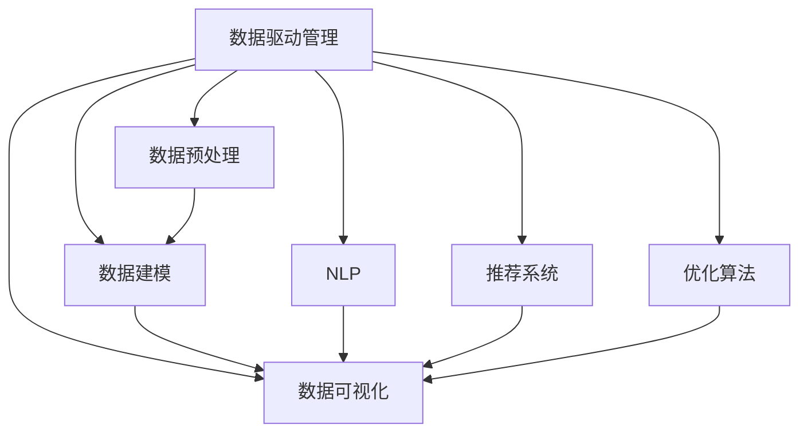

                 

## 1. 背景介绍

### 1.1 问题由来

在数字化浪潮下，管理模式和管理工具也在不断进化。传统的管理模式，如层次结构、监督式管理、标准化流程等，虽然保证了组织运行的稳定性，但面对快速变化的市场环境和员工个性化需求，显得僵化且不够灵活。如何提升管理的效率和适应性，成为新时代管理技术需要解决的重要问题。

近年来，随着人工智能、大数据、云计算等技术的快速发展，智能管理工具逐渐进入管理者的视野。智能管理工具通过数据驱动的决策支持，自然语言处理技术的人机交互，以及复杂系统优化算法，帮助管理者更精准地洞察问题、预测趋势，并做出更科学的决策。这不仅极大地提升了管理效率，还使得管理更具柔性、可操作性。

### 1.2 问题核心关键点

智能管理工具的核心在于数据驱动的决策支持。基于数据科学和人工智能的算法，对企业运行过程中的海量数据进行分析，从中挖掘出有价值的信息，帮助管理者做出更科学的决策。核心技术包括：

- **数据预处理**：数据清洗、数据特征提取、数据标准化等。
- **数据建模**：回归模型、分类模型、聚类模型、时序模型等。
- **数据可视化**：图表展示、仪表盘、实时报表等。
- **自然语言处理(NLP)**：文本分析、情感分析、意图识别等。
- **推荐系统**：协同过滤、基于内容的推荐、矩阵分解等。
- **优化算法**：遗传算法、模拟退火、线性规划、整数规划等。

这些技术整合在一起，构成了现代智能管理工具的框架，帮助管理者提升管理效率，降低决策风险，实现柔性管理。

### 1.3 问题研究意义

智能管理工具的出现，对传统管理模式产生了深远影响：

1. **提升决策质量**：通过数据驱动，智能管理工具提供了更全面、客观的决策支持，减少了决策的盲目性和失误。
2. **提高管理效率**：智能管理工具能自动处理复杂的数据分析和报表生成，节省了大量人工操作时间。
3. **增强柔性管理**：通过自然语言处理和个性化推荐，智能管理工具能更好地适应员工个性化需求，提升管理柔性。
4. **优化资源配置**：智能管理工具能预测资源需求，优化配置方案，减少资源浪费。
5. **加强风险控制**：智能管理工具能实时监测企业运行状态，预测潜在的风险点，帮助企业及时调整策略。

总之，智能管理工具的出现，为管理模式的创新提供了新的思路和方法，是管理技术发展的重要方向。

## 2. 核心概念与联系

### 2.1 核心概念概述

智能管理工具的核心概念主要包括：

- **数据驱动管理**：通过数据科学和人工智能技术，提取、分析、预测和管理组织运行中的各类数据，支持管理者做出科学决策。
- **自然语言处理(NLP)**：通过自然语言处理技术，实现人机交互，抽取文本数据中的关键信息，进行意图识别、情感分析等操作。
- **推荐系统**：通过协同过滤、基于内容的推荐等算法，个性化推荐用户感兴趣的内容，提高用户体验和满意度。
- **优化算法**：通过遗传算法、模拟退火、线性规划等算法，优化复杂问题的解法，提升管理效率和效果。

这些概念之间存在密切联系，共同构成了智能管理工具的技术基础。

### 2.2 核心概念原理和架构的 Mermaid 流程图



这个流程图展示了智能管理工具的核心架构，其中：

- **数据驱动管理**：是整个系统的起点，通过数据预处理、建模、可视化等技术，提供决策支持。
- **数据预处理**：对原始数据进行清洗、标准化等处理，为后续建模和可视化提供可靠的数据基础。
- **数据建模**：通过对历史数据的建模，预测未来趋势，辅助决策。
- **数据可视化**：通过图表展示、仪表盘等方式，直观地展示数据，支持管理者对复杂问题的理解。
- **自然语言处理(NLP)**：通过文本分析、情感分析等技术，从非结构化数据中提取关键信息，支持人机交互。
- **推荐系统**：通过个性化推荐，提高用户体验和满意度。
- **优化算法**：通过复杂系统优化算法，提升资源配置效率，优化管理方案。

这些核心概念和技术整合在一起，构成了智能管理工具的核心框架，能够有效地提升管理效率和决策质量。

## 3. 核心算法原理 & 具体操作步骤
### 3.1 算法原理概述

智能管理工具的算法原理主要包括以下几个方面：

- **数据预处理**：通过数据清洗、特征提取、标准化等技术，确保数据的准确性和一致性。
- **数据建模**：使用回归模型、分类模型、聚类模型、时序模型等，从历史数据中挖掘出有价值的信息，支持决策。
- **数据可视化**：通过图表展示、仪表盘等技术，直观地展示数据，辅助管理者对复杂问题的理解。
- **自然语言处理(NLP)**：通过文本分析、情感分析等技术，从非结构化数据中提取关键信息，支持人机交互。
- **推荐系统**：通过协同过滤、基于内容的推荐等算法，个性化推荐用户感兴趣的内容，提高用户体验和满意度。
- **优化算法**：通过遗传算法、模拟退火、线性规划等算法，优化复杂问题的解法，提升管理效率和效果。

这些算法的核心目标是通过数据驱动的方式，提供更科学、更高效的决策支持。

### 3.2 算法步骤详解

智能管理工具的实现一般包括以下几个关键步骤：

**Step 1: 数据收集与清洗**
- 收集企业内部的历史数据、运营数据、客户数据等，包括结构化数据和非结构化数据。
- 对数据进行初步清洗，去除异常值、缺失值、重复值等，确保数据的质量。
- 使用数据标准化技术，统一不同数据源的数据格式和单位。

**Step 2: 特征提取与选择**
- 对清洗后的数据进行特征提取，生成模型所需的各种特征。
- 使用特征选择技术，选择对模型最有预测能力的特征。
- 进行特征工程，如数据归一化、特征缩放等，提升模型性能。

**Step 3: 模型训练与评估**
- 选择适合的数据建模方法，如回归模型、分类模型、聚类模型、时序模型等。
- 在历史数据上训练模型，并通过交叉验证等技术进行评估。
- 选择性能最好的模型进行微调，提升模型的预测能力。

**Step 4: 可视化与展示**
- 使用数据可视化工具，将模型的预测结果和关键指标直观展示。
- 设计仪表盘，实时监测企业运行状态，支持管理者决策。

**Step 5: 系统集成与部署**
- 将数据处理和模型预测模块集成到统一的系统中。
- 部署系统到企业内部或云端，提供稳定可靠的服务。
- 进行系统测试和优化，确保系统性能和稳定性。

### 3.3 算法优缺点

智能管理工具的优点包括：

- **数据驱动**：通过数据科学和人工智能技术，提供更客观、全面的决策支持。
- **高效灵活**：智能管理工具能够自动处理复杂的数据分析和报表生成，节省了大量人工操作时间。
- **用户友好**：通过自然语言处理和个性化推荐，提高用户体验和满意度。
- **决策质量高**：通过数据建模和预测，提高决策的科学性和准确性。

同时，这些工具也存在一些缺点：

- **依赖高质量数据**：数据的质量和完整性直接影响模型的预测结果，如果数据存在噪声或偏差，模型性能将大打折扣。
- **技术门槛较高**：需要具备一定的数据科学和人工智能技术背景，否则难以设计出高效、可靠的系统。
- **模型复杂度高**：复杂系统优化算法和自然语言处理算法，对硬件和软件的要求较高，需要较高的资源投入。
- **解释性不足**：许多智能管理工具使用的模型，如神经网络，其决策过程较难解释，管理者难以理解和调试。

### 3.4 算法应用领域

智能管理工具在多个领域得到了广泛应用，具体包括：

- **人力资源管理**：通过数据驱动的方式，提升招聘效率、员工满意度、绩效管理等。
- **财务分析与管理**：通过数据建模和预测，优化资源配置、风险控制、成本管理等。
- **市场营销**：通过个性化推荐和市场分析，提升客户转化率、客户满意度、市场洞察力等。
- **供应链管理**：通过数据建模和可视化，优化供应链流程、库存管理、需求预测等。
- **客户服务**：通过自然语言处理和自动化客服，提升客户体验、服务效率、客户满意度等。
- **项目管理**：通过数据驱动和预测，优化项目进度、资源配置、风险控制等。

这些应用领域展示了智能管理工具的强大能力和广泛适用性。

## 4. 数学模型和公式 & 详细讲解 & 举例说明
### 4.1 数学模型构建

智能管理工具的核心数学模型主要包括以下几种：

- **回归模型**：$y = \beta_0 + \beta_1x_1 + \beta_2x_2 + ... + \beta_nx_n + \epsilon$，其中 $y$ 为预测目标，$x_i$ 为自变量，$\beta_i$ 为系数，$\epsilon$ 为误差项。
- **分类模型**：$P(y|x) = \sigma(W^T \phi(x) + b)$，其中 $y$ 为分类目标，$x$ 为特征向量，$W$ 为权重矩阵，$b$ 为偏置项，$\sigma$ 为激活函数。
- **聚类模型**：$k$ 均值算法：$C_k = \arg\min_{C} \sum_{i=1}^n \min_{j=1,...,k} ||x_i - \mu_j||^2$，其中 $C$ 为聚类中心，$x_i$ 为样本点，$\mu_j$ 为聚类中心点。
- **时序模型**：$ARIMA(p,d,q)(P,D,Q)[s]$，其中 $ARIMA$ 为自回归移动平均模型，$p$ 为自回归阶数，$d$ 为差分阶数，$q$ 为移动平均阶数，$P$ 为季节性自回归阶数，$D$ 为季节性差分阶数，$Q$ 为季节性移动平均阶数，$s$ 为季节性周期。

这些模型通过数据驱动的方式，提取数据中的规律和趋势，支持科学决策。

### 4.2 公式推导过程

以回归模型为例，我们推导其数学表达式。

设 $y$ 为预测目标，$x_i$ 为自变量，$y$ 和 $x_i$ 之间存在线性关系，则回归模型可表示为：

$$
y = \beta_0 + \beta_1x_1 + \beta_2x_2 + ... + \beta_nx_n + \epsilon
$$

其中，$\beta_i$ 为系数，$\epsilon$ 为误差项。

通过对模型进行最小二乘法估计，可以求得 $\beta_i$ 的值：

$$
\beta_i = \frac{\sum_{j=1}^n (x_{ij}\bar{y} - y_j)}{\sum_{j=1}^n (x_{ij}^2)}
$$

其中，$\bar{y}$ 为 $y$ 的平均值，$x_{ij}$ 为 $x_i$ 的第 $j$ 个值，$y_j$ 为 $y$ 的第 $j$ 个观测值。

### 4.3 案例分析与讲解

**案例分析：财务预测**

一家制造企业希望通过智能管理工具进行财务预测，以便更好地规划生产计划和财务预算。该企业收集了过去5年的财务数据，包括销售额、成本、利润等，共10000个样本。

**步骤1: 数据预处理**

- 收集过去5年的财务数据，并进行初步清洗，去除异常值和缺失值。
- 对数据进行标准化，统一单位和格式。

**步骤2: 特征提取**

- 提取销售额、成本、利润、市场份额等特征，作为模型的输入。
- 选择对预测目标（下一年的利润）最有影响的特征，如销售额、成本、市场份额等。

**步骤3: 模型训练与评估**

- 使用线性回归模型进行预测，训练模型并评估其性能。
- 通过交叉验证，选择性能最好的模型，并对其进行微调。

**步骤4: 可视化与展示**

- 使用数据可视化工具，展示预测结果和关键指标。
- 设计仪表盘，实时监测企业财务状况，支持管理者决策。

通过智能管理工具，该企业能够更加科学地进行财务预测，优化资源配置，降低财务风险，提升管理效率。

## 5. 项目实践：代码实例和详细解释说明
### 5.1 开发环境搭建

智能管理工具的开发通常需要使用Python和R语言，因此需要安装相关的开发环境。以下是使用Python进行开发的环境配置流程：

1. 安装Anaconda：从官网下载并安装Anaconda，用于创建独立的Python环境。

2. 创建并激活虚拟环境：
```bash
conda create -n py35 python=3.5 
conda activate py35
```

3. 安装必要的库：
```bash
pip install pandas numpy matplotlib seaborn scikit-learn scipy statsmodels joblib
```

4. 安装TensorFlow和Keras：
```bash
pip install tensorflow keras
```

完成上述步骤后，即可在`py35`环境中开始开发。

### 5.2 源代码详细实现

以下是使用Python和Keras实现财务预测的代码示例：

```python
import pandas as pd
from sklearn.model_selection import train_test_split
from sklearn.linear_model import LinearRegression
from sklearn.metrics import mean_squared_error

# 读取数据
data = pd.read_csv('financial_data.csv')

# 数据预处理
data = data.dropna()

# 特征选择
X = data[['sales', 'cost', 'market_share']]
y = data['profit']

# 划分训练集和测试集
X_train, X_test, y_train, y_test = train_test_split(X, y, test_size=0.2)

# 模型训练
model = LinearRegression()
model.fit(X_train, y_train)

# 模型评估
y_pred = model.predict(X_test)
mse = mean_squared_error(y_test, y_pred)
print('MSE:', mse)
```

这段代码展示了使用Python和Keras进行财务预测的过程，包括数据预处理、特征选择、模型训练和评估等步骤。

### 5.3 代码解读与分析

**代码解读**：

- `pd.read_csv()`：读取财务数据文件，存储为DataFrame格式。
- `dropna()`：去除缺失值。
- `train_test_split()`：划分训练集和测试集，比例为80%训练，20%测试。
- `LinearRegression()`：创建线性回归模型。
- `fit()`：训练模型，输入为训练数据。
- `predict()`：预测测试集数据。
- `mean_squared_error()`：计算预测误差，这里使用的是均方误差。

**分析**：

- **数据预处理**：数据预处理是智能管理工具的重要环节，通过去除缺失值、标准化数据等手段，提升模型的预测能力。
- **特征选择**：选择对预测目标最有影响的特征，提升模型的预测效果。
- **模型训练与评估**：通过训练模型，评估其预测能力，选择性能最好的模型进行微调。
- **可视化与展示**：使用数据可视化工具，直观展示预测结果和关键指标，支持管理者决策。

## 6. 实际应用场景
### 6.1 智能人力资源管理

智能人力资源管理系统通过数据分析和人工智能技术，帮助企业优化人力资源管理。具体应用包括：

- **招聘效率提升**：通过数据分析，识别出招聘流程中的瓶颈和问题，优化招聘流程，提升招聘效率。
- **员工绩效评估**：通过员工绩效数据的建模，预测员工未来的表现，支持科学的绩效评估。
- **员工满意度提升**：通过情感分析等技术，监测员工满意度，及时发现问题，提升员工满意度。
- **人才流失预测**：通过数据分析，预测员工流失的风险，提前采取措施，减少人才流失。

通过智能人力资源管理工具，企业能够更好地管理和利用人才资源，提升人力资源管理的效率和效果。

### 6.2 智能财务分析

智能财务分析系统通过数据分析和机器学习技术，支持企业进行财务预测和风险控制。具体应用包括：

- **财务预测**：通过财务数据的建模，预测企业未来的财务状况，支持财务规划和决策。
- **风险控制**：通过数据分析，识别财务风险，支持企业采取风险控制措施，降低财务风险。
- **成本管理**：通过数据分析，优化资源配置，降低成本，提升企业利润。

通过智能财务分析系统，企业能够更加科学地进行财务预测和风险控制，提升财务管理的效率和效果。

### 6.3 智能市场营销

智能市场营销系统通过数据分析和人工智能技术，支持企业进行市场分析和个性化营销。具体应用包括：

- **客户细分**：通过数据分析，识别出不同客户群体的特点，进行精准客户细分。
- **客户流失预测**：通过数据分析，预测客户流失的风险，提前采取措施，提升客户满意度。
- **个性化推荐**：通过推荐系统，个性化推荐客户感兴趣的产品和服务，提升客户体验和满意度。

通过智能市场营销系统，企业能够更好地进行市场分析和个性化营销，提升市场营销的效果和效率。

### 6.4 未来应用展望

未来，智能管理工具将在更多领域得到应用，为企业管理带来变革性影响。

在智慧城市治理中，智能管理工具可应用于城市事件监测、舆情分析、应急指挥等环节，提高城市管理的自动化和智能化水平，构建更安全、高效的未来城市。

在智慧农业中，智能管理工具可应用于作物监测、灾害预警、产量预测等环节，提高农业生产效率和可持续发展能力。

在智能交通中，智能管理工具可应用于交通流量预测、车辆调度、交通安全等环节，提升交通管理的效率和安全性。

总之，随着人工智能和数据科学技术的不断发展，智能管理工具将在更多领域得到应用，为企业和社会的管理带来深远影响。

## 7. 工具和资源推荐
### 7.1 学习资源推荐

为了帮助开发者系统掌握智能管理工具的理论基础和实践技巧，这里推荐一些优质的学习资源：

1. **《Python数据分析实战》**：由知名数据科学家撰写，详细介绍Python数据分析的各个环节，包括数据清洗、数据建模、数据可视化等。
2. **《TensorFlow实战》**：由TensorFlow官方团队撰写，全面介绍TensorFlow的使用方法和经典案例，涵盖深度学习、计算机视觉、自然语言处理等多个领域。
3. **《深度学习框架实战》**：由国内知名AI技术社区撰写，详细介绍多种深度学习框架的使用方法和经典案例，涵盖Keras、PyTorch、MXNet等。
4. **《数据科学实战》**：由知名数据科学家撰写，详细介绍数据科学实战的各个环节，包括数据清洗、数据建模、数据可视化等。
5. **《自然语言处理》**：由斯坦福大学开设的NLP课程，有Lecture视频和配套作业，带你入门NLP领域的基本概念和经典模型。

通过对这些资源的学习实践，相信你一定能够快速掌握智能管理工具的核心技术，并用于解决实际的业务问题。

### 7.2 开发工具推荐

高效的开发离不开优秀的工具支持。以下是几款用于智能管理工具开发的常用工具：

1. **Jupyter Notebook**：免费、开源的交互式开发环境，支持Python、R等多种语言，方便开发和实验。
2. **TensorFlow**：由Google主导开发的深度学习框架，生产部署方便，适合大规模工程应用。
3. **Scikit-learn**：Python中的机器学习库，包含多种经典机器学习算法，如回归、分类、聚类等。
4. **Keras**：由Google主导开发的深度学习库，简洁易用，适合快速迭代研究。
5. **Pandas**：Python中的数据处理库，方便数据清洗、数据特征提取等操作。
6. **NumPy**：Python中的科学计算库，方便数组和矩阵计算。

合理利用这些工具，可以显著提升智能管理工具的开发效率，加快创新迭代的步伐。

### 7.3 相关论文推荐

智能管理工具的发展源于学界的持续研究。以下是几篇奠基性的相关论文，推荐阅读：

1. **《数据驱动管理：理论、方法与应用》**：介绍了数据驱动管理的基本概念和理论基础，详细探讨了数据驱动管理的各个环节。
2. **《人工智能与决策支持系统》**：介绍了人工智能技术在决策支持系统中的应用，详细探讨了自然语言处理、推荐系统等关键技术。
3. **《智能优化算法》**：介绍了多种智能优化算法，如遗传算法、模拟退火等，详细探讨了算法的原理和应用。
4. **《深度学习在金融数据分析中的应用》**：介绍了深度学习在金融数据分析中的应用，详细探讨了回归模型、分类模型等关键技术。
5. **《智能推荐系统》**：介绍了推荐系统的基本原理和应用，详细探讨了协同过滤、基于内容的推荐等算法。

这些论文代表了大数据、人工智能技术在管理中的应用方向，对于深入理解智能管理工具的理论基础和实践技术具有重要意义。

## 8. 总结：未来发展趋势与挑战
### 8.1 总结

本文对智能管理工具进行了全面系统的介绍。首先阐述了智能管理工具的研究背景和意义，明确了其数据驱动和人工智能技术的基础。其次，从原理到实践，详细讲解了智能管理工具的各个环节，包括数据预处理、数据建模、数据可视化、自然语言处理、推荐系统和优化算法。最后，介绍了智能管理工具在多个领域的应用，展示了其强大能力和广泛适用性。

通过本文的系统梳理，可以看到，智能管理工具正在成为企业管理技术的重要方向，通过数据驱动和人工智能技术，提升管理效率和决策质量，实现柔性管理。未来，智能管理工具将在更多领域得到应用，为企业和社会的管理带来深远影响。

### 8.2 未来发展趋势

智能管理工具的未来发展趋势包括：

1. **智能化程度提升**：通过更先进的算法和技术，提升智能管理工具的智能化水平，支持更加复杂和多样化的管理需求。
2. **多模态数据整合**：整合多模态数据，提升智能管理工具的全面性和准确性。
3. **实时性增强**：通过大数据和云计算技术，提升智能管理工具的实时性和响应速度，支持实时决策和优化。
4. **用户友好性提升**：通过自然语言处理和个性化推荐技术，提升智能管理工具的用户友好性，支持更好的用户体验。
5. **多领域应用扩展**：在更多领域推广应用智能管理工具，如智慧城市、智慧农业、智能交通等。
6. **跨行业协同**：在多个行业之间推广应用智能管理工具，形成跨行业的协同效应，提升整体管理水平。

这些趋势展示了智能管理工具的广阔前景，为企业管理提供了新的思路和方法。

### 8.3 面临的挑战

尽管智能管理工具已经取得了显著成果，但仍面临诸多挑战：

1. **数据质量问题**：数据的质量和完整性直接影响智能管理工具的预测能力和决策效果。
2. **技术门槛较高**：智能管理工具需要具备一定的数据科学和人工智能技术背景，难以大规模普及。
3. **模型复杂性**：复杂系统优化算法和自然语言处理算法，对硬件和软件的要求较高，需要较高的资源投入。
4. **可解释性不足**：许多智能管理工具使用的模型，如神经网络，其决策过程较难解释，难以满足监管和审计需求。
5. **伦理和安全问题**：智能管理工具可能涉及隐私保护和数据安全问题，需要加强数据安全和隐私保护措施。

这些挑战需要在未来研究中不断突破，才能更好地发挥智能管理工具的潜力，实现其在企业管理中的应用。

### 8.4 研究展望

未来，智能管理工具的研究方向包括：

1. **多模态数据融合**：整合多模态数据，提升智能管理工具的全面性和准确性。
2. **实时数据处理**：通过大数据和云计算技术，提升智能管理工具的实时性和响应速度，支持实时决策和优化。
3. **可解释性研究**：研究模型解释性，提升智能管理工具的可解释性和透明度，满足监管和审计需求。
4. **跨行业应用推广**：在更多行业推广应用智能管理工具，形成跨行业的协同效应，提升整体管理水平。
5. **多领域协同研究**：在多个领域进行协同研究，形成跨领域的知识共享和创新。

这些研究方向将推动智能管理工具的发展，为企业管理带来新的突破和创新。

## 9. 附录：常见问题与解答

**Q1: 智能管理工具在实际应用中如何确保数据质量？**

A: 确保数据质量是智能管理工具成功应用的关键。以下是几种确保数据质量的方法：

1. **数据清洗**：通过数据清洗技术，去除异常值、缺失值、重复值等，确保数据的完整性和一致性。
2. **数据标准化**：通过数据标准化技术，统一不同数据源的数据格式和单位，确保数据的一致性。
3. **数据验证**：通过数据验证技术，验证数据的准确性和可靠性，确保数据的质量。
4. **数据抽样**：通过数据抽样技术，抽样验证数据的准确性和一致性，确保数据的质量。

这些方法可以帮助确保数据质量，提升智能管理工具的预测能力和决策效果。

**Q2: 智能管理工具的模型复杂性如何处理？**

A: 智能管理工具的模型复杂性是影响其应用的一个关键问题。以下是几种处理模型复杂性的方法：

1. **模型简化**：通过模型简化技术，去除不必要的特征和参数，降低模型的复杂性。
2. **模型压缩**：通过模型压缩技术，压缩模型的存储空间和计算资源，提升模型效率。
3. **模型并行**：通过模型并行技术，将模型并行处理，提升模型的计算效率。
4. **模型集成**：通过模型集成技术，将多个模型的预测结果进行融合，提升模型的准确性和鲁棒性。

这些方法可以帮助处理模型复杂性，提升智能管理工具的应用效果。

**Q3: 智能管理工具的可解释性如何增强？**

A: 增强智能管理工具的可解释性是提升其应用效果的关键。以下是几种增强可解释性的方法：

1. **模型解释性研究**：研究模型的解释性，提升模型的可解释性和透明度。
2. **可视化技术**：通过可视化技术，直观展示模型的预测结果和决策过程，支持用户理解。
3. **规则引擎**：通过规则引擎，将规则与模型结合，提升模型的可解释性和可操作性。
4. **知识图谱**：通过知识图谱技术，将专家知识与模型结合，提升模型的可解释性和可操作性。

这些方法可以帮助增强智能管理工具的可解释性，提升用户对模型的理解和信任。

**Q4: 智能管理工具的伦理和安全问题如何处理？**

A: 智能管理工具的伦理和安全问题需要特别关注。以下是几种处理伦理和安全问题的方法：

1. **隐私保护**：通过隐私保护技术，保护用户的隐私信息，确保数据的安全性。
2. **数据匿名化**：通过数据匿名化技术，保护用户的隐私信息，确保数据的安全性。
3. **数据安全**：通过数据安全技术，保护数据的安全性，防止数据泄露和攻击。
4. **合规性审查**：通过合规性审查，确保智能管理工具的合规性，防止违规行为。

这些方法可以帮助处理伦理和安全问题，确保智能管理工具的安全性和可靠性。

**Q5: 智能管理工具在实际应用中如何提高用户友好性？**

A: 提高智能管理工具的用户友好性是提升其应用效果的关键。以下是几种提高用户友好性的方法：

1. **自然语言处理(NLP)**：通过自然语言处理技术，实现人机交互，提升用户体验和满意度。
2. **个性化推荐**：通过个性化推荐技术，推荐用户感兴趣的内容，提升用户体验和满意度。
3. **用户界面设计**：通过用户界面设计，优化用户操作体验，提升用户体验和满意度。
4. **可视化技术**：通过可视化技术，直观展示数据和分析结果，支持用户理解和决策。

这些方法可以帮助提高智能管理工具的用户友好性，提升用户对工具的信任和满意度。

总之，智能管理工具在企业管理中的应用前景广阔，但也面临诸多挑战和问题。未来，需要通过技术创新和不断优化，提升智能管理工具的性能和可靠性，实现其在企业管理中的应用。

---

作者：禅与计算机程序设计艺术 / Zen and the Art of Computer Programming

