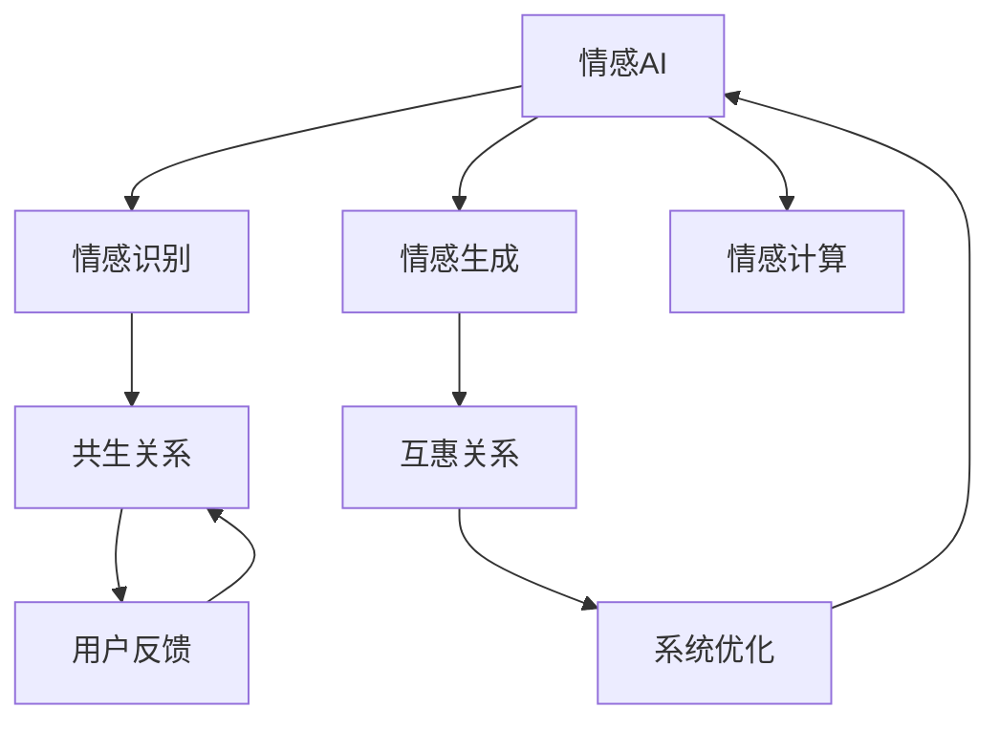

                 

# 情感AI共生：人机情感的互惠关系

> 关键词：情感AI, 人机交互, 共生, 互惠关系, 情感识别, 情感生成, 智能客服, 情感计算, 自然语言处理

## 1. 背景介绍

### 1.1 问题由来
随着人工智能技术的快速发展，情感AI成为AI领域的前沿研究方向之一。情感AI通过深度学习模型对人类情感进行识别、理解、生成和响应，使得机器能够更好地理解人的情绪和行为，从而实现更高效的人机交互。然而，尽管情感AI技术已经取得了诸多进展，但真正在实际应用中落地，却面临着诸多挑战。如何构建出能真正理解并共生互惠的人机情感关系，是当前情感AI研究的重要课题。

### 1.2 问题核心关键点
情感AI的核心关键点在于：

1. **情感识别**：准确识别出用户表达的情感类型和强度。
2. **情感生成**：基于情感识别结果，生成符合情感需求的响应或内容。
3. **情感计算**：通过数学建模和算法，使机器能够理解情感间的复杂关系。
4. **共生关系**：人机之间情感的互动与反馈，形成良好的人机情感共生关系。
5. **互惠关系**：情感AI能够为人类提供情感支持，同时也能通过反馈机制不断提升自身性能。

## 2. 核心概念与联系

### 2.1 核心概念概述

为更好地理解情感AI共生的原理和机制，本节将介绍几个关键概念：

- **情感AI**：利用深度学习模型对人类情感进行识别、理解和生成的人工智能技术。
- **人机交互**：通过各种交互媒介（如语音、文本、图像等），实现人与机器的信息交流。
- **情感共生**：在情感AI系统设计中，充分考虑人的情感需求，使机器能够感知和共情人类的情绪，构建出和谐的人机情感关系。
- **互惠关系**：情感AI系统不仅能够识别和生成情感，还能通过交互反馈持续改进自身性能，实现人机之间情感的双向交流。

这些概念之间的联系可以通过以下Mermaid流程图来展示：



这个流程图展示出情感AI的各个核心组件及其相互关系：

1. 情感AI系统通过情感识别模块捕获用户情感信息。
2. 情感生成模块根据情感识别结果，生成相应的情感回应。
3. 情感计算模块通过建模计算，理解不同情感间的复杂关系。
4. 共生关系通过用户反馈机制建立，使机器更好地理解人类情感。
5. 互惠关系则是在共生关系的基础上，系统通过不断优化提升自身性能，实现人机情感的双向交流。

## 3. 核心算法原理 & 具体操作步骤
### 3.1 算法原理概述

情感AI共生基于以下核心算法原理：

- **情感识别**：利用深度学习模型对输入的文本、语音、图像等信息进行情感分类。常用的算法包括卷积神经网络(CNN)、递归神经网络(RNN)、长短期记忆网络(LSTM)、Transformer等。
- **情感生成**：基于情感识别结果，通过语言模型生成符合情感需求的文本、语音、图像等输出。常见的生成算法包括GAN、VAE、Transformer等。
- **情感计算**：利用数学建模和算法，计算不同情感之间的关系。如情感距离、情感演化等。

### 3.2 算法步骤详解

基于情感AI共生的算法步骤，可以分为以下几个关键环节：

1. **数据收集与预处理**：收集用户的多模态数据，包括文本、语音、图像等，并进行预处理，如文本分词、语音特征提取、图像归一化等。

2. **情感识别**：使用深度学习模型对预处理后的数据进行情感分类。常用的方法包括使用卷积神经网络(CNN)、递归神经网络(RNN)、长短期记忆网络(LSTM)、Transformer等进行文本情感分类。同时，也可以使用情感词典、情感分析等方法进行情感识别。

3. **情感生成**：基于情感识别结果，使用生成模型生成情感响应。如使用变分自编码器(VAE)生成文本、图像，使用GAN生成语音等。

4. **情感计算**：利用数学建模和算法，计算不同情感之间的关系。常用的方法包括计算情感距离、情感演化等。

5. **用户反馈与系统优化**：通过用户对情感响应的反馈，调整情感生成模型和情感识别模型，以提升系统性能。

### 3.3 算法优缺点

情感AI共生的算法具有以下优点：

1. **高效准确**：利用深度学习模型，能够高效准确地识别和生成情感。
2. **适应性强**：能够适应不同场景和用户需求，提供多样化的情感响应。
3. **互惠互利**：通过用户反馈，不断优化模型，实现人机情感的共生互惠。

同时，也存在一些局限性：

1. **数据依赖**：情感识别和生成的准确性依赖于大量标注数据，数据获取成本较高。
2. **情感多样性**：当前模型难以准确识别复杂的情感表达，特别是微妙和隐晦的情感。
3. **计算资源**：训练和推理情感模型需要较大的计算资源，对硬件要求较高。

### 3.4 算法应用领域

情感AI共生的算法在多个领域都有广泛的应用：

- **智能客服**：通过情感AI实现情感识别和生成，提升客户服务体验，减少人工客服成本。
- **健康护理**：利用情感AI进行患者情感识别和生成，提升心理健康服务质量。
- **教育培训**：通过情感AI识别学生情感状态，提供个性化学习建议。
- **游戏娱乐**：通过情感AI生成符合玩家情感需求的虚拟角色对话和情节。
- **市场营销**：利用情感AI进行情感分析，优化广告投放策略。

## 4. 数学模型和公式 & 详细讲解 & 举例说明

### 4.1 数学模型构建

情感AI共生的数学模型可以描述为：

$$
Y = f(X; \theta)
$$

其中，$X$ 为输入的多模态数据，$Y$ 为情感分类结果，$f$ 为情感识别和生成模型，$\theta$ 为模型参数。

### 4.2 公式推导过程

假设我们采用Transformer模型进行情感识别。Transformer模型中的自注意力机制可以表示为：

$$
\text{Attention}(Q, K, V) = \text{softmax}(\frac{QK^T}{\sqrt{d_k}})V
$$

其中，$Q$、$K$、$V$分别为查询向量、键向量和值向量，$d_k$ 为注意力向量的维度。

### 4.3 案例分析与讲解

以智能客服场景为例，情感AI共生模型的构建过程如下：

1. **数据收集**：收集用户与客服的对话记录，包括文本和语音信息。
2. **情感识别**：使用Transformer模型对文本和语音进行情感分类，识别出用户的情感状态。
3. **情感生成**：基于情感分类结果，生成符合用户情感需求的回复。
4. **情感计算**：计算对话过程中情感的变化，如情绪从激动到平静的变化。
5. **用户反馈**：用户对回复的满意度反馈，调整情感生成模型。

## 5. 项目实践：代码实例和详细解释说明
### 5.1 开发环境搭建

在进行情感AI共生项目实践前，我们需要准备好开发环境。以下是使用Python进行PyTorch开发的环境配置流程：

1. 安装Anaconda：从官网下载并安装Anaconda，用于创建独立的Python环境。

2. 创建并激活虚拟环境：
```bash
conda create -n pytorch-env python=3.8 
conda activate pytorch-env
```

3. 安装PyTorch：根据CUDA版本，从官网获取对应的安装命令。例如：
```bash
conda install pytorch torchvision torchaudio cudatoolkit=11.1 -c pytorch -c conda-forge
```

4. 安装Transformer库：
```bash
pip install transformers
```

5. 安装各类工具包：
```bash
pip install numpy pandas scikit-learn matplotlib tqdm jupyter notebook ipython
```

完成上述步骤后，即可在`pytorch-env`环境中开始情感AI共生项目的开发。

### 5.2 源代码详细实现

下面以情感识别为例，给出使用Transformers库进行情感分类的PyTorch代码实现。

首先，定义情感分类任务的数据处理函数：

```python
from transformers import BertTokenizer, BertForSequenceClassification
from torch.utils.data import Dataset
import torch

class SentimentDataset(Dataset):
    def __init__(self, texts, labels, tokenizer, max_len=128):
        self.texts = texts
        self.labels = labels
        self.tokenizer = tokenizer
        self.max_len = max_len
        
    def __len__(self):
        return len(self.texts)
    
    def __getitem__(self, item):
        text = self.texts[item]
        label = self.labels[item]
        
        encoding = self.tokenizer(text, return_tensors='pt', max_length=self.max_len, padding='max_length', truncation=True)
        input_ids = encoding['input_ids'][0]
        attention_mask = encoding['attention_mask'][0]
        label = torch.tensor(label, dtype=torch.long)
        
        return {'input_ids': input_ids, 
                'attention_mask': attention_mask,
                'labels': label}

# 标签与id的映射
label2id = {'negative': 0, 'positive': 1}
id2label = {v: k for k, v in label2id.items()}

# 创建dataset
tokenizer = BertTokenizer.from_pretrained('bert-base-cased')

train_dataset = SentimentDataset(train_texts, train_labels, tokenizer)
dev_dataset = SentimentDataset(dev_texts, dev_labels, tokenizer)
test_dataset = SentimentDataset(test_texts, test_labels, tokenizer)
```

然后，定义模型和优化器：

```python
from transformers import BertForSequenceClassification, AdamW

model = BertForSequenceClassification.from_pretrained('bert-base-cased', num_labels=2)

optimizer = AdamW(model.parameters(), lr=2e-5)
```

接着，定义训练和评估函数：

```python
from torch.utils.data import DataLoader
from tqdm import tqdm
from sklearn.metrics import classification_report

device = torch.device('cuda') if torch.cuda.is_available() else torch.device('cpu')
model.to(device)

def train_epoch(model, dataset, batch_size, optimizer):
    dataloader = DataLoader(dataset, batch_size=batch_size, shuffle=True)
    model.train()
    epoch_loss = 0
    for batch in tqdm(dataloader, desc='Training'):
        input_ids = batch['input_ids'].to(device)
        attention_mask = batch['attention_mask'].to(device)
        labels = batch['labels'].to(device)
        model.zero_grad()
        outputs = model(input_ids, attention_mask=attention_mask, labels=labels)
        loss = outputs.loss
        epoch_loss += loss.item()
        loss.backward()
        optimizer.step()
    return epoch_loss / len(dataloader)

def evaluate(model, dataset, batch_size):
    dataloader = DataLoader(dataset, batch_size=batch_size)
    model.eval()
    preds, labels = [], []
    with torch.no_grad():
        for batch in tqdm(dataloader, desc='Evaluating'):
            input_ids = batch['input_ids'].to(device)
            attention_mask = batch['attention_mask'].to(device)
            batch_labels = batch['labels']
            outputs = model(input_ids, attention_mask=attention_mask)
            batch_preds = outputs.logits.argmax(dim=1).to('cpu').tolist()
            batch_labels = batch_labels.to('cpu').tolist()
            for pred, label in zip(batch_preds, batch_labels):
                preds.append(pred)
                labels.append(label)
                
    print(classification_report(labels, preds))
```

最后，启动训练流程并在测试集上评估：

```python
epochs = 5
batch_size = 16

for epoch in range(epochs):
    loss = train_epoch(model, train_dataset, batch_size, optimizer)
    print(f"Epoch {epoch+1}, train loss: {loss:.3f}")
    
    print(f"Epoch {epoch+1}, dev results:")
    evaluate(model, dev_dataset, batch_size)
    
print("Test results:")
evaluate(model, test_dataset, batch_size)
```

以上就是使用PyTorch对BERT进行情感识别任务微调的完整代码实现。可以看到，得益于Transformers库的强大封装，我们可以用相对简洁的代码完成BERT模型的加载和微调。

### 5.3 代码解读与分析

让我们再详细解读一下关键代码的实现细节：

**SentimentDataset类**：
- `__init__`方法：初始化文本、标签、分词器等关键组件。
- `__len__`方法：返回数据集的样本数量。
- `__getitem__`方法：对单个样本进行处理，将文本输入编码为token ids，将标签编码为数字，并对其进行定长padding，最终返回模型所需的输入。

**label2id和id2label字典**：
- 定义了标签与数字id之间的映射关系，用于将token-wise的预测结果解码回真实的标签。

**训练和评估函数**：
- 使用PyTorch的DataLoader对数据集进行批次化加载，供模型训练和推理使用。
- 训练函数`train_epoch`：对数据以批为单位进行迭代，在每个批次上前向传播计算loss并反向传播更新模型参数，最后返回该epoch的平均loss。
- 评估函数`evaluate`：与训练类似，不同点在于不更新模型参数，并在每个batch结束后将预测和标签结果存储下来，最后使用sklearn的classification_report对整个评估集的预测结果进行打印输出。

**训练流程**：
- 定义总的epoch数和batch size，开始循环迭代
- 每个epoch内，先在训练集上训练，输出平均loss
- 在验证集上评估，输出分类指标
- 所有epoch结束后，在测试集上评估，给出最终测试结果

可以看到，PyTorch配合Transformers库使得情感识别任务的代码实现变得简洁高效。开发者可以将更多精力放在数据处理、模型改进等高层逻辑上，而不必过多关注底层的实现细节。

当然，工业级的系统实现还需考虑更多因素，如模型的保存和部署、超参数的自动搜索、更灵活的任务适配层等。但核心的情感识别范式基本与此类似。

## 6. 实际应用场景
### 6.1 智能客服系统

基于情感AI共生的对话技术，可以广泛应用于智能客服系统的构建。传统客服往往需要配备大量人力，高峰期响应缓慢，且一致性和专业性难以保证。而使用情感AI共生的对话模型，可以7x24小时不间断服务，快速响应客户咨询，用自然流畅的语言解答各类常见问题。

在技术实现上，可以收集企业内部的历史客服对话记录，将问题和最佳答复构建成监督数据，在此基础上对预训练模型进行微调。微调后的对话模型能够自动理解用户意图，匹配最合适的答案模板进行回复。对于客户提出的新问题，还可以接入检索系统实时搜索相关内容，动态组织生成回答。如此构建的智能客服系统，能大幅提升客户咨询体验和问题解决效率。

### 6.2 健康护理

利用情感AI共生的情感识别和生成技术，可以构建智能健康护理系统，提升患者的心理健康服务质量。系统可以通过语音识别和情感分析，识别出患者的情绪状态，及时提供心理支持和建议。对于需要心理干预的患者，系统可以自动生成符合其情感需求的对话内容，进行情感安抚和心理辅导。如此构建的智能健康护理系统，能更好地满足患者的情感需求，提升其心理健康水平。

### 6.3 教育培训

在教育培训领域，情感AI共生的技术可以应用于情感识别和生成，提升个性化学习体验。系统可以通过分析学生的表情、声音和文本输入，识别出其情感状态，并提供个性化的学习建议和资源。对于学生提出的问题，系统可以自动生成符合其情感需求的解答，提供更全面和贴心的学习支持。如此构建的智能教育培训系统，能更好地满足学生的情感需求，提升学习效果。

### 6.4 游戏娱乐

在游戏娱乐领域，情感AI共生的技术可以应用于游戏角色的情感生成，提升游戏体验。系统可以通过分析玩家的表情和行为，生成符合其情感需求的虚拟角色对话和情节。对于玩家提出的问题，系统可以自动生成符合其情感需求的回复，增强游戏的互动性和沉浸感。如此构建的智能游戏娱乐系统，能更好地满足玩家的情感需求，提升游戏体验。

### 6.5 市场营销

在市场营销领域，情感AI共生的技术可以应用于情感分析，优化广告投放策略。系统可以通过分析用户的情感状态，优化广告的内容和形式，提升广告的点击率和转化率。对于用户反馈，系统可以自动生成符合其情感需求的回复，增强用户互动和品牌忠诚度。如此构建的智能市场营销系统，能更好地满足用户的情感需求，提升品牌影响力和市场竞争力。

## 7. 工具和资源推荐
### 7.1 学习资源推荐

为了帮助开发者系统掌握情感AI共生的理论基础和实践技巧，这里推荐一些优质的学习资源：

1. 《深度学习与人工智能》系列博文：由大模型技术专家撰写，深入浅出地介绍了深度学习与情感AI的原理和应用。

2. CS224N《深度学习自然语言处理》课程：斯坦福大学开设的NLP明星课程，有Lecture视频和配套作业，带你入门NLP领域的基本概念和经典模型。

3. 《自然语言处理与深度学习》书籍：全面介绍了自然语言处理和深度学习的基本原理和应用，包括情感AI等前沿技术。

4. HuggingFace官方文档：Transformer库的官方文档，提供了海量预训练模型和完整的情感AI共生样例代码，是上手实践的必备资料。

5. ICLR、ICML等顶级会议论文：情感AI共生技术的前沿研究，涵盖各类最新算法和应用场景，值得深入阅读。

通过对这些资源的学习实践，相信你一定能够快速掌握情感AI共生的精髓，并用于解决实际的情感问题。

### 7.2 开发工具推荐

高效的开发离不开优秀的工具支持。以下是几款用于情感AI共生开发的常用工具：

1. PyTorch：基于Python的开源深度学习框架，灵活动态的计算图，适合快速迭代研究。大部分预训练语言模型都有PyTorch版本的实现。

2. TensorFlow：由Google主导开发的开源深度学习框架，生产部署方便，适合大规模工程应用。同样有丰富的预训练语言模型资源。

3. Transformers库：HuggingFace开发的NLP工具库，集成了众多SOTA语言模型，支持PyTorch和TensorFlow，是进行情感AI共生任务开发的利器。

4. Weights & Biases：模型训练的实验跟踪工具，可以记录和可视化模型训练过程中的各项指标，方便对比和调优。与主流深度学习框架无缝集成。

5. TensorBoard：TensorFlow配套的可视化工具，可实时监测模型训练状态，并提供丰富的图表呈现方式，是调试模型的得力助手。

6. Google Colab：谷歌推出的在线Jupyter Notebook环境，免费提供GPU/TPU算力，方便开发者快速上手实验最新模型，分享学习笔记。

合理利用这些工具，可以显著提升情感AI共生任务的开发效率，加快创新迭代的步伐。

### 7.3 相关论文推荐

情感AI共生的研究源于学界的持续研究。以下是几篇奠基性的相关论文，推荐阅读：

1. Sentiment Analysis with Deep Learning: A Survey（深度学习情感分析综述）：概述了情感分析领域的主要研究方向和算法，包括情感AI等前沿技术。

2. Emotion AI: An Overview（情感AI概述）：介绍了情感AI的技术框架和应用场景，涵盖了情感识别和生成等方面的研究。

3. A Survey on Sentiment Analysis（情感分析综述）：详细介绍了情感分析领域的主要研究方向和算法，包括情感AI等前沿技术。

4. Emotion Recognition and Generation with Deep Learning（基于深度学习的情感识别和生成）：介绍了深度学习在情感识别和生成中的应用，包括情感AI等前沿技术。

5. A Survey on Emotion Recognition and Generation Using AI（基于AI的情感识别和生成综述）：概述了情感识别和生成领域的主要研究方向和算法，包括情感AI等前沿技术。

这些论文代表了大语言模型微调技术的发展脉络。通过学习这些前沿成果，可以帮助研究者把握学科前进方向，激发更多的创新灵感。

## 8. 总结：未来发展趋势与挑战

### 8.1 总结

本文对基于情感AI共生的情感识别和生成技术进行了全面系统的介绍。首先阐述了情感AI共生的研究背景和意义，明确了情感AI共生在构建人机情感共生关系方面的独特价值。其次，从原理到实践，详细讲解了情感识别和生成算法的数学原理和关键步骤，给出了情感AI共生任务开发的完整代码实例。同时，本文还广泛探讨了情感AI共生技术在智能客服、健康护理、教育培训等多个行业领域的应用前景，展示了情感AI共生的巨大潜力。

通过本文的系统梳理，可以看到，情感AI共生技术正在成为情感计算研究的重要范式，极大地拓展了人机情感交互的边界，催生了更多的落地场景。随着深度学习模型的不断发展，情感AI共生的性能将进一步提升，为构建更智能化、更人性化的人机情感关系提供强有力的技术支撑。

### 8.2 未来发展趋势

展望未来，情感AI共生技术将呈现以下几个发展趋势：

1. **情感多样性提升**：情感AI模型将能更好地识别复杂的情感表达，特别是微妙和隐晦的情感。
2. **多模态情感计算**：利用多模态数据融合技术，情感AI能够更好地理解人类的情感状态。
3. **实时情感反馈**：通过实时情感分析，情感AI能够动态调整其生成策略，提供更个性化和及时的情感支持。
4. **情感共生深化**：情感AI将能够更好地理解和共情人类的情感需求，构建更深入的人机情感共生关系。
5. **情感优化增强**：情感AI将能够通过用户反馈不断优化其情感识别和生成能力，实现人机情感的双向交流。

以上趋势凸显了情感AI共生技术的广阔前景。这些方向的探索发展，必将进一步提升情感AI系统的性能和应用范围，为构建智能化的情感计算系统铺平道路。

### 8.3 面临的挑战

尽管情感AI共生技术已经取得了诸多进展，但在迈向更加智能化、普适化应用的过程中，它仍面临着诸多挑战：

1. **数据依赖**：情感识别和生成的准确性依赖于大量标注数据，数据获取成本较高。
2. **情感多样性**：当前模型难以准确识别复杂的情感表达，特别是微妙和隐晦的情感。
3. **计算资源**：训练和推理情感模型需要较大的计算资源，对硬件要求较高。
4. **情感偏见**：情感AI模型可能学习到有偏见的数据，导致输出结果的不公平性。
5. **隐私保护**：情感AI需要收集大量的用户数据，如何保护用户隐私成为一个重要问题。

正视情感AI共生面临的这些挑战，积极应对并寻求突破，将是大语言模型微调走向成熟的必由之路。相信随着学界和产业界的共同努力，这些挑战终将一一被克服，情感AI共生必将在构建安全、可靠、可解释、可控的智能系统中扮演越来越重要的角色。

### 8.4 研究展望

面向未来，情感AI共生技术需要在以下几个方面寻求新的突破：

1. **无监督学习**：摆脱对大规模标注数据的依赖，利用自监督学习、主动学习等无监督范式，最大限度利用非结构化数据，实现更加灵活高效的情感AI共生。
2. **多模态融合**：将文本、语音、图像等多模态数据进行融合，提升情感AI共生的准确性和鲁棒性。
3. **实时情感分析**：通过实时情感分析，动态调整情感生成策略，提供更个性化和及时的情感支持。
4. **情感共生优化**：通过用户反馈不断优化情感AI共生模型，实现人机情感的双向交流。
5. **情感偏见消除**：在模型训练过程中引入伦理导向的评估指标，过滤和惩罚有偏见、有害的输出倾向。
6. **隐私保护机制**：设计隐私保护机制，确保用户数据的安全性和隐私性。

这些研究方向的探索，必将引领情感AI共生技术迈向更高的台阶，为构建安全、可靠、可解释、可控的智能情感系统铺平道路。面向未来，情感AI共生技术还需要与其他人工智能技术进行更深入的融合，如知识表示、因果推理、强化学习等，多路径协同发力，共同推动情感计算系统的进步。

只有勇于创新、敢于突破，才能不断拓展情感AI共生的边界，让情感智能技术更好地造福人类社会。

## 9. 附录：常见问题与解答

**Q1：情感AI共生技术是否适用于所有情感识别和生成场景？**

A: 情感AI共生技术在大多数情感识别和生成场景上都能取得不错的效果，特别是对于数据量较小的场景。但对于一些特定领域的情感识别和生成，如医学、法律等，仅仅依靠通用语料预训练的模型可能难以很好地适应。此时需要在特定领域语料上进一步预训练，再进行微调，才能获得理想效果。

**Q2：情感AI共生技术在训练和推理过程中需要哪些硬件资源？**

A: 训练和推理情感AI共生模型需要较大的计算资源，特别是对于大规模模型。通常需要GPU或TPU等高性能设备。在推理过程中，还需要考虑模型的存储和读取效率，可以使用模型压缩、稀疏化存储等方法进行优化。

**Q3：情感AI共生技术在实际应用中如何避免情感偏见？**

A: 为了避免情感AI模型学习到有偏见的数据，需要在使用数据时进行严格的筛选和清洗，避免包含歧视性或有害信息。同时，在模型训练过程中引入伦理导向的评估指标，过滤和惩罚有偏见、有害的输出倾向。在设计隐私保护机制时，也要考虑如何保护用户的情感数据隐私。

**Q4：情感AI共生技术在落地部署时需要注意哪些问题？**

A: 将情感AI共生模型转化为实际应用，还需要考虑以下因素：
1. 模型裁剪：去除不必要的层和参数，减小模型尺寸，加快推理速度。
2. 量化加速：将浮点模型转为定点模型，压缩存储空间，提高计算效率。
3. 服务化封装：将模型封装为标准化服务接口，便于集成调用。
4. 弹性伸缩：根据请求流量动态调整资源配置，平衡服务质量和成本。
5. 监控告警：实时采集系统指标，设置异常告警阈值，确保服务稳定性。
6. 安全防护：采用访问鉴权、数据脱敏等措施，保障数据和模型安全。

情感AI共生技术需要在数据、算法、工程、业务等多个维度协同发力，才能真正实现其应用价值。只有在不断优化模型性能、提升用户体验的同时，才能构建出真正智能化的情感计算系统。

