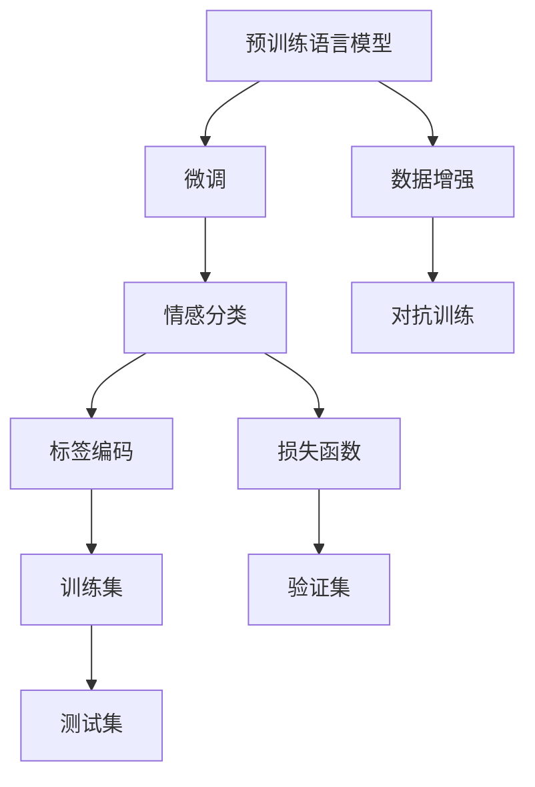

                 

# 情感分析：AI理解用户意图的新维度

## 1. 背景介绍

### 1.1 问题由来
在数字化时代，情感分析作为一种重要的自然语言处理(NLP)技术，扮演着越来越关键的角色。它可以帮助企业、政府机构和研究人员洞察用户的情感倾向，理解用户的需求和偏好，从而优化产品和服务，制定更加精准的营销策略。情感分析不仅在社交媒体、电子商务、在线评论等领域有着广泛应用，而且在舆情监控、客户服务、心理健康等多个场景中都有着重要作用。

然而，传统的情感分析方法往往依赖于手动标注的情感数据集，对标注成本、质量和时间有着较高要求。此外，情感分类结果往往是基于词袋模型，难以捕捉情感表达的细微差别，容易产生偏差。因此，寻找更加高效、准确、自动化的情感分析方法，已成为当前研究的热点和难点。

近年来，深度学习和大语言模型在情感分析领域取得了突破性进展。基于预训练语言模型的情感分析方法，通过在海量无标签文本数据上进行预训练，学习到丰富的语言表示，能够在有限标注数据下取得显著的性能提升。这些方法不仅显著降低了标注成本，而且提升了情感分析的准确性和鲁棒性。

## 2. 核心概念与联系

### 2.1 核心概念概述
情感分析的目的是从文本中识别出用户的情感倾向，如正面、负面、中性等。常见的情感分析方法包括基于规则的方法、基于词典的方法和基于机器学习的方法。其中，基于深度学习的情感分析方法，通过在大规模预训练语言模型上进行微调，利用其强大的语言理解和生成能力，在情感分析任务上取得了显著的效果。

本文将重点介绍基于深度学习的情感分析方法，并详细探讨其核心概念和实现原理。这些核心概念包括：

- 预训练语言模型：通过在海量无标签文本数据上进行自监督预训练，学习到丰富的语言表示。常用的预训练模型包括BERT、GPT、RoBERTa等。
- 情感分类：利用预训练模型学习到的语言表示，进行情感分类的微调，使模型能够识别出文本中的情感倾向。
- 微调：基于监督学习，使用有限标注数据对预训练模型进行有监督微调，使其适应特定情感分类任务。
- 标签编码：将情感分类任务转化为多分类问题，定义合适的标签编码方法。
- 损失函数：设计适合情感分类的损失函数，如交叉熵损失、Focal Loss等。

这些概念之间的逻辑关系可以通过以下Mermaid流程图来展示：



这个流程图展示了大语言模型在情感分析中的工作原理：

1. 预训练语言模型通过大量无标签文本数据进行预训练，学习到语言表示。
2. 在情感分类任务上进行微调，利用模型学习到的语言表示，进行情感分类。
3. 定义情感分类任务的标签编码方法，将情感分类任务转化为多分类问题。
4. 设计合适的损失函数，用于衡量模型预测和真实标签之间的差异。
5. 利用数据增强和对抗训练等技术，提升模型鲁棒性。
6. 在训练集和验证集上进行训练和验证，最终在测试集上评估模型性能。

## 3. 核心算法原理 & 具体操作步骤

### 3.1 算法原理概述

情感分析的算法原理是基于监督学习的大语言模型微调。其核心思想是：利用预训练语言模型的强大表示能力，在有限标注数据下进行微调，使其能够自动识别出文本中的情感倾向。

假设预训练语言模型为 $M_{\theta}$，其中 $\theta$ 为预训练得到的模型参数。给定情感分类任务 $T$ 的标注数据集 $D=\{(x_i, y_i)\}_{i=1}^N$，其中 $x_i$ 为文本样本，$y_i$ 为对应的情感标签。微调的目标是最小化经验风险，即找到最优参数 $\hat{\theta}$，使得模型在情感分类任务上的表现最佳：

$$
\hat{\theta} = \mathop{\arg\min}_{\theta} \mathcal{L}(M_{\theta},D)
$$

其中 $\mathcal{L}$ 为情感分类任务的损失函数。常见的损失函数包括交叉熵损失、Focal Loss等。

### 3.2 算法步骤详解

基于监督学习的大语言模型情感分析，主要包括以下几个关键步骤：

**Step 1: 准备预训练模型和数据集**
- 选择合适的预训练语言模型 $M_{\theta}$ 作为初始化参数，如 BERT、GPT 等。
- 准备情感分类任务 $T$ 的标注数据集 $D$，划分为训练集、验证集和测试集。标注数据集通常由正面、负面、中性等情感标签构成。

**Step 2: 添加情感分类层**
- 根据情感分类任务类型，在预训练模型顶层设计合适的输出层和损失函数。
- 对于二分类任务，通常在顶层添加二分类输出层和交叉熵损失函数。
- 对于多分类任务，通常使用多分类输出层和交叉熵损失函数。

**Step 3: 设置微调超参数**
- 选择合适的优化算法及其参数，如 AdamW、SGD 等，设置学习率、批大小、迭代轮数等。
- 设置正则化技术及强度，包括权重衰减、Dropout、Early Stopping等。
- 确定冻结预训练参数的策略，如仅微调顶层，或全部参数都参与微调。

**Step 4: 执行梯度训练**
- 将训练集数据分批次输入模型，前向传播计算损失函数。
- 反向传播计算参数梯度，根据设定的优化算法和学习率更新模型参数。
- 周期性在验证集上评估模型性能，根据性能指标决定是否触发 Early Stopping。
- 重复上述步骤直到满足预设的迭代轮数或 Early Stopping 条件。

**Step 5: 测试和部署**
- 在测试集上评估微调后模型 $M_{\hat{\theta}}$ 的性能，对比微调前后的精度提升。
- 使用微调后的模型对新样本进行推理预测，集成到实际的应用系统中。
- 持续收集新的数据，定期重新微调模型，以适应数据分布的变化。

以上是基于监督学习微调大语言模型进行情感分析的一般流程。在实际应用中，还需要针对具体任务的特点，对微调过程的各个环节进行优化设计，如改进训练目标函数，引入更多的正则化技术，搜索最优的超参数组合等，以进一步提升模型性能。

### 3.3 算法优缺点

基于监督学习的大语言模型情感分析方法具有以下优点：
1. 简单高效。只需准备少量标注数据，即可对预训练模型进行快速适配，获得较大的性能提升。
2. 通用适用。适用于各种NLP下游任务，包括分类、匹配、生成等，设计简单的任务适配层即可实现情感分析。
3. 效果显著。在学术界和工业界的诸多任务上，基于微调的方法已经刷新了最先进的性能指标。
4. 参数高效。利用参数高效微调技术，在固定大部分预训练参数的情况下，仍可取得不错的提升。

同时，该方法也存在一定的局限性：
1. 依赖标注数据。情感分析的效果很大程度上取决于标注数据的质量和数量，获取高质量标注数据的成本较高。
2. 迁移能力有限。当目标任务与预训练数据的分布差异较大时，微调的性能提升有限。
3. 负面效果传递。预训练模型的固有偏见、有害信息等，可能通过微调传递到情感分析任务，造成负面影响。
4. 可解释性不足。微调模型的决策过程通常缺乏可解释性，难以对其推理逻辑进行分析和调试。

尽管存在这些局限性，但就目前而言，基于监督学习的微调方法仍是大语言模型情感分析的主流范式。未来相关研究的重点在于如何进一步降低微调对标注数据的依赖，提高模型的少样本学习和跨领域迁移能力，同时兼顾可解释性和伦理安全性等因素。

### 3.4 算法应用领域

基于大语言模型微调的情感分析方法，在NLP领域已经得到了广泛的应用，覆盖了几乎所有常见任务，例如：

- 情感分类：如评论情感分类、客户满意度分析、社交媒体情感分析等。通过微调使模型学习文本-情感映射。
- 情感极性判断：判断文本的情感倾向是正面还是负面。通过微调使模型学习情感分类器。
- 情感强度分析：评估文本情感的强度，如轻度、中度、重度等。通过微调使模型学习情感强度分类器。
- 情感转移分析：分析文本中情感的转移情况，如从正面到负面、从负面到正面等。通过微调使模型学习情感转移模型。
- 情感演化分析：跟踪情感在时间序列上的变化趋势，如情感变化、情感波动等。通过微调使模型学习情感演化模型。

除了上述这些经典任务外，大语言模型微调还被创新性地应用到更多场景中，如情感标签生成、情感翻译、情感扩展等，为情感分析技术带来了全新的突破。随着预训练模型和微调方法的不断进步，相信情感分析技术将在更广阔的应用领域大放异彩。

## 4. 数学模型和公式 & 详细讲解 & 举例说明

### 4.1 数学模型构建

本节将使用数学语言对基于监督学习的大语言模型情感分析过程进行更加严格的刻画。

记预训练语言模型为 $M_{\theta}$，其中 $\theta$ 为预训练得到的模型参数。假设情感分类任务 $T$ 的训练集为 $D=\{(x_i,y_i)\}_{i=1}^N$，其中 $x_i$ 为文本样本，$y_i$ 为对应的情感标签。

定义模型 $M_{\theta}$ 在输入 $x$ 上的输出为 $\hat{y}=M_{\theta}(x)$。情感分类任务的目标是将输入文本 $x$ 分类为正面、负面或中性，即 $\hat{y} \in \{0,1,2\}$，分别对应负面、正面、中性情感。

情感分类任务的损失函数定义为：

$$
\mathcal{L}(\theta) = -\frac{1}{N}\sum_{i=1}^N \log \hat{y_i}
$$

其中 $\hat{y_i}$ 为模型预测的情感标签。

### 4.2 公式推导过程

以下我们以二分类情感分析任务为例，推导交叉熵损失函数及其梯度的计算公式。

假设模型 $M_{\theta}$ 在输入 $x$ 上的输出为 $\hat{y}=M_{\theta}(x)$，表示样本属于正面情感的概率。真实标签 $y \in \{0,1\}$。则二分类交叉熵损失函数定义为：

$$
\ell(M_{\theta}(x),y) = -[y\log \hat{y} + (1-y)\log(1-\hat{y})]
$$

将其代入经验风险公式，得：

$$
\mathcal{L}(\theta) = -\frac{1}{N}\sum_{i=1}^N [y_i\log \hat{y_i} + (1-y_i)\log(1-\hat{y_i})]
$$

根据链式法则，损失函数对参数 $\theta_k$ 的梯度为：

$$
\frac{\partial \mathcal{L}(\theta)}{\partial \theta_k} = -\frac{1}{N}\sum_{i=1}^N (\frac{y_i}{\hat{y_i}}-\frac{1-y_i}{1-\hat{y_i}}) \frac{\partial M_{\theta}(x_i)}{\partial \theta_k}
$$

其中 $\frac{\partial M_{\theta}(x_i)}{\partial \theta_k}$ 可进一步递归展开，利用自动微分技术完成计算。

在得到损失函数的梯度后，即可带入参数更新公式，完成模型的迭代优化。重复上述过程直至收敛，最终得到适应情感分类任务的最优模型参数 $\theta^*$。

## 5. 项目实践：代码实例和详细解释说明

### 5.1 开发环境搭建

在进行情感分析实践前，我们需要准备好开发环境。以下是使用Python进行PyTorch开发的环境配置流程：

1. 安装Anaconda：从官网下载并安装Anaconda，用于创建独立的Python环境。

2. 创建并激活虚拟环境：
```bash
conda create -n pytorch-env python=3.8 
conda activate pytorch-env
```

3. 安装PyTorch：根据CUDA版本，从官网获取对应的安装命令。例如：
```bash
conda install pytorch torchvision torchaudio cudatoolkit=11.1 -c pytorch -c conda-forge
```

4. 安装Transformers库：
```bash
pip install transformers
```

5. 安装各类工具包：
```bash
pip install numpy pandas scikit-learn matplotlib tqdm jupyter notebook ipython
```

完成上述步骤后，即可在`pytorch-env`环境中开始情感分析实践。

### 5.2 源代码详细实现

下面我们以情感分类任务为例，给出使用Transformers库对BERT模型进行情感分类的PyTorch代码实现。

首先，定义情感分类任务的数据处理函数：

```python
from transformers import BertTokenizer
from torch.utils.data import Dataset
import torch

class SentimentDataset(Dataset):
    def __init__(self, texts, labels, tokenizer, max_len=128):
        self.texts = texts
        self.labels = labels
        self.tokenizer = tokenizer
        self.max_len = max_len
        
    def __len__(self):
        return len(self.texts)
    
    def __getitem__(self, item):
        text = self.texts[item]
        label = self.labels[item]
        
        encoding = self.tokenizer(text, return_tensors='pt', max_length=self.max_len, padding='max_length', truncation=True)
        input_ids = encoding['input_ids'][0]
        attention_mask = encoding['attention_mask'][0]
        
        # 对token-wise的标签进行编码
        encoded_label = torch.tensor(label, dtype=torch.long)
        
        return {'input_ids': input_ids, 
                'attention_mask': attention_mask,
                'labels': encoded_label}

# 标签编码
label2id = {'negative': 0, 'positive': 1, 'neutral': 2}
id2label = {v: k for k, v in label2id.items()}

# 创建dataset
tokenizer = BertTokenizer.from_pretrained('bert-base-cased')

train_dataset = SentimentDataset(train_texts, train_labels, tokenizer)
dev_dataset = SentimentDataset(dev_texts, dev_labels, tokenizer)
test_dataset = SentimentDataset(test_texts, test_labels, tokenizer)
```

然后，定义模型和优化器：

```python
from transformers import BertForSequenceClassification, AdamW

model = BertForSequenceClassification.from_pretrained('bert-base-cased', num_labels=len(label2id))

optimizer = AdamW(model.parameters(), lr=2e-5)
```

接着，定义训练和评估函数：

```python
from torch.utils.data import DataLoader
from tqdm import tqdm
from sklearn.metrics import classification_report

device = torch.device('cuda') if torch.cuda.is_available() else torch.device('cpu')
model.to(device)

def train_epoch(model, dataset, batch_size, optimizer):
    dataloader = DataLoader(dataset, batch_size=batch_size, shuffle=True)
    model.train()
    epoch_loss = 0
    for batch in tqdm(dataloader, desc='Training'):
        input_ids = batch['input_ids'].to(device)
        attention_mask = batch['attention_mask'].to(device)
        labels = batch['labels'].to(device)
        model.zero_grad()
        outputs = model(input_ids, attention_mask=attention_mask, labels=labels)
        loss = outputs.loss
        epoch_loss += loss.item()
        loss.backward()
        optimizer.step()
    return epoch_loss / len(dataloader)

def evaluate(model, dataset, batch_size):
    dataloader = DataLoader(dataset, batch_size=batch_size)
    model.eval()
    preds, labels = [], []
    with torch.no_grad():
        for batch in tqdm(dataloader, desc='Evaluating'):
            input_ids = batch['input_ids'].to(device)
            attention_mask = batch['attention_mask'].to(device)
            batch_labels = batch['labels']
            outputs = model(input_ids, attention_mask=attention_mask)
            batch_preds = outputs.logits.argmax(dim=1).to('cpu').tolist()
            batch_labels = batch_labels.to('cpu').tolist()
            for pred, label in zip(batch_preds, batch_labels):
                preds.append(pred)
                labels.append(label)
                
    print(classification_report(labels, preds))
```

最后，启动训练流程并在测试集上评估：

```python
epochs = 5
batch_size = 16

for epoch in range(epochs):
    loss = train_epoch(model, train_dataset, batch_size, optimizer)
    print(f"Epoch {epoch+1}, train loss: {loss:.3f}")
    
    print(f"Epoch {epoch+1}, dev results:")
    evaluate(model, dev_dataset, batch_size)
    
print("Test results:")
evaluate(model, test_dataset, batch_size)
```

以上就是使用PyTorch对BERT进行情感分类任务微调的完整代码实现。可以看到，得益于Transformers库的强大封装，我们可以用相对简洁的代码完成BERT模型的加载和微调。

### 5.3 代码解读与分析

让我们再详细解读一下关键代码的实现细节：

**SentimentDataset类**：
- `__init__`方法：初始化文本、标签、分词器等关键组件。
- `__len__`方法：返回数据集的样本数量。
- `__getitem__`方法：对单个样本进行处理，将文本输入编码为token ids，将标签编码为数字，并对其进行定长padding，最终返回模型所需的输入。

**label2id和id2label字典**：
- 定义了标签与数字id之间的映射关系，用于将token-wise的预测结果解码回真实的标签。

**训练和评估函数**：
- 使用PyTorch的DataLoader对数据集进行批次化加载，供模型训练和推理使用。
- 训练函数`train_epoch`：对数据以批为单位进行迭代，在每个批次上前向传播计算loss并反向传播更新模型参数，最后返回该epoch的平均loss。
- 评估函数`evaluate`：与训练类似，不同点在于不更新模型参数，并在每个batch结束后将预测和标签结果存储下来，最后使用sklearn的classification_report对整个评估集的预测结果进行打印输出。

**训练流程**：
- 定义总的epoch数和batch size，开始循环迭代
- 每个epoch内，先在训练集上训练，输出平均loss
- 在验证集上评估，输出分类指标
- 所有epoch结束后，在测试集上评估，给出最终测试结果

可以看到，PyTorch配合Transformers库使得BERT微调的代码实现变得简洁高效。开发者可以将更多精力放在数据处理、模型改进等高层逻辑上，而不必过多关注底层的实现细节。

当然，工业级的系统实现还需考虑更多因素，如模型的保存和部署、超参数的自动搜索、更灵活的任务适配层等。但核心的微调范式基本与此类似。

## 6. 实际应用场景
### 6.1 电商平台情感分析

基于大语言模型微调的情感分析方法，可以广泛应用于电商平台的情感分析系统。通过收集用户对商品、服务的评论，分析其情感倾向，电商平台可以及时发现用户的不满意情况，提供更优质的服务。

在技术实现上，可以收集电商平台的历史评论数据，将评论情感分为正面、负面、中性等。在此基础上对预训练语言模型进行微调，使其能够自动理解评论情感，预测用户对商品和服务的满意度。将微调后的模型应用于实时获取的评论数据，便可以进行情感分类和趋势分析，帮助电商平台制定优化策略，提升用户满意度。

### 6.2 舆情监控系统

舆情监控系统是政府机构、媒体机构、公关公司等的重要工具，用于监测社会舆情，评估公众情绪。通过情感分析技术，舆情监控系统可以自动识别出网络舆情中的正面、负面情感，预测舆情发展趋势。

在实践中，可以收集各类社交媒体、新闻媒体、论坛等平台上的公开文本数据，进行情感分析。将情感分析结果与时间序列数据结合，便可构建舆情预测模型，实时监测网络舆情，为政策制定和舆情应对提供支持。

### 6.3 舆情应对系统

舆情应对系统是公关公司、企业品牌管理部门的重要工具，用于及时响应网络舆情，维护企业声誉。通过情感分析技术，舆情应对系统可以自动识别出负面舆情，生成应对策略。

在实际应用中，舆情应对系统可以结合社交媒体监控系统，实时获取负面评论和话题。通过情感分析，确定负面情感的来源和传播路径，生成针对性的应对策略，包括回应、澄清、整改等。将微调后的模型应用于实时获取的评论数据，生成自动化的舆情应对建议，帮助企业快速响应负面舆情，维护品牌形象。

### 6.4 未来应用展望

随着大语言模型微调技术的发展，情感分析将在更多领域得到应用，为人类认知智能的进化带来深远影响。

在智慧医疗领域，情感分析技术可以帮助医疗机构了解患者情绪，优化诊疗过程，提高医疗服务的质量。

在金融行业，情感分析技术可以用于分析用户对金融产品的情感倾向，预测市场情绪，制定投资策略。

在教育领域，情感分析技术可以用于分析学生的情感状态，提供个性化的学习支持，提高教学效果。

此外，在企业生产、社会治理、文娱传媒等众多领域，基于大模型微调的情感分析技术也将不断涌现，为经济社会发展注入新的动力。相信随着技术的日益成熟，情感分析技术必将在更广阔的应用领域大放异彩，深刻影响人类的生产生活方式。

## 7. 工具和资源推荐
### 7.1 学习资源推荐

为了帮助开发者系统掌握大语言模型微调的理论基础和实践技巧，这里推荐一些优质的学习资源：

1. 《Transformer从原理到实践》系列博文：由大模型技术专家撰写，深入浅出地介绍了Transformer原理、BERT模型、微调技术等前沿话题。

2. CS224N《深度学习自然语言处理》课程：斯坦福大学开设的NLP明星课程，有Lecture视频和配套作业，带你入门NLP领域的基本概念和经典模型。

3. 《Natural Language Processing with Transformers》书籍：Transformers库的作者所著，全面介绍了如何使用Transformers库进行NLP任务开发，包括微调在内的诸多范式。

4. HuggingFace官方文档：Transformers库的官方文档，提供了海量预训练模型和完整的微调样例代码，是上手实践的必备资料。

5. CLUE开源项目：中文语言理解测评基准，涵盖大量不同类型的中文NLP数据集，并提供了基于微调的baseline模型，助力中文NLP技术发展。

通过对这些资源的学习实践，相信你一定能够快速掌握大语言模型微调的精髓，并用于解决实际的NLP问题。
###  7.2 开发工具推荐

高效的开发离不开优秀的工具支持。以下是几款用于大语言模型微调开发的常用工具：

1. PyTorch：基于Python的开源深度学习框架，灵活动态的计算图，适合快速迭代研究。大部分预训练语言模型都有PyTorch版本的实现。

2. TensorFlow：由Google主导开发的开源深度学习框架，生产部署方便，适合大规模工程应用。同样有丰富的预训练语言模型资源。

3. Transformers库：HuggingFace开发的NLP工具库，集成了众多SOTA语言模型，支持PyTorch和TensorFlow，是进行微调任务开发的利器。

4. Weights & Biases：模型训练的实验跟踪工具，可以记录和可视化模型训练过程中的各项指标，方便对比和调优。与主流深度学习框架无缝集成。

5. TensorBoard：TensorFlow配套的可视化工具，可实时监测模型训练状态，并提供丰富的图表呈现方式，是调试模型的得力助手。

6. Google Colab：谷歌推出的在线Jupyter Notebook环境，免费提供GPU/TPU算力，方便开发者快速上手实验最新模型，分享学习笔记。

合理利用这些工具，可以显著提升大语言模型微调任务的开发效率，加快创新迭代的步伐。

### 7.3 相关论文推荐

大语言模型和微调技术的发展源于学界的持续研究。以下是几篇奠基性的相关论文，推荐阅读：

1. Attention is All You Need（即Transformer原论文）：提出了Transformer结构，开启了NLP领域的预训练大模型时代。

2. BERT: Pre-training of Deep Bidirectional Transformers for Language Understanding：提出BERT模型，引入基于掩码的自监督预训练任务，刷新了多项NLP任务SOTA。

3. Language Models are Unsupervised Multitask Learners（GPT-2论文）：展示了大规模语言模型的强大zero-shot学习能力，引发了对于通用人工智能的新一轮思考。

4. Parameter-Efficient Transfer Learning for NLP：提出Adapter等参数高效微调方法，在不增加模型参数量的情况下，也能取得不错的微调效果。

5. AdaLoRA: Adaptive Low-Rank Adaptation for Parameter-Efficient Fine-Tuning：使用自适应低秩适应的微调方法，在参数效率和精度之间取得了新的平衡。

这些论文代表了大语言模型微调技术的发展脉络。通过学习这些前沿成果，可以帮助研究者把握学科前进方向，激发更多的创新灵感。

## 8. 总结：未来发展趋势与挑战

### 8.1 总结

本文对基于监督学习的大语言模型情感分析方法进行了全面系统的介绍。首先阐述了情感分析的重要性及其在大语言模型微调方法中的地位。其次，从原理到实践，详细讲解了情感分析的数学原理和关键步骤，给出了情感分析任务开发的完整代码实例。同时，本文还广泛探讨了情感分析方法在电商、舆情监控、舆情应对等多个领域的应用前景，展示了情感分析范式的巨大潜力。此外，本文精选了情感分析技术的各类学习资源，力求为读者提供全方位的技术指引。

通过本文的系统梳理，可以看到，基于大语言模型的情感分析方法正在成为NLP领域的重要范式，极大地拓展了情感分析模型的应用边界，催生了更多的落地场景。受益于大规模语料的预训练，情感分析模型以更低的时间和标注成本，在情感分类、情感分析等任务上取得了显著的效果，有力推动了NLP技术的产业化进程。未来，伴随预训练语言模型和微调方法的不断进步，相信情感分析技术将在更广阔的应用领域大放异彩，深刻影响人类的生产生活方式。

### 8.2 未来发展趋势

展望未来，大语言模型情感分析技术将呈现以下几个发展趋势：

1. 模型规模持续增大。随着算力成本的下降和数据规模的扩张，预训练语言模型的参数量还将持续增长。超大规模语言模型蕴含的丰富语言知识，有望支撑更加复杂多变的情感分析任务。

2. 微调方法日趋多样。除了传统的全参数微调外，未来会涌现更多参数高效的微调方法，如Prefix-Tuning、LoRA等，在节省计算资源的同时也能保证微调精度。

3. 持续学习成为常态。随着数据分布的不断变化，情感分析模型也需要持续学习新知识以保持性能。如何在不遗忘原有知识的同时，高效吸收新样本信息，将成为重要的研究课题。

4. 标注样本需求降低。受启发于提示学习(Prompt-based Learning)的思路，未来的情感分析方法将更好地利用大模型的语言理解能力，通过更加巧妙的任务描述，在更少的标注样本上也能实现理想的微调效果。

5. 标注样本需求降低。受启发于提示学习(Prompt-based Learning)的思路，未来的情感分析方法将更好地利用大模型的语言理解能力，通过更加巧妙的任务描述，在更少的标注样本上也能实现理想的微调效果。

6. 模型通用性增强。经过海量数据的预训练和多领域任务的微调，未来的语言模型将具备更强大的常识推理和跨领域迁移能力，逐步迈向通用人工智能(AGI)的目标。

以上趋势凸显了大语言模型情感分析技术的广阔前景。这些方向的探索发展，必将进一步提升情感分析系统的性能和应用范围，为人类认知智能的进化带来深远影响。

### 8.3 面临的挑战

尽管大语言模型情感分析技术已经取得了瞩目成就，但在迈向更加智能化、普适化应用的过程中，它仍面临着诸多挑战：

1. 标注成本瓶颈。虽然微调大大降低了标注数据的需求，但对于长尾应用场景，难以获得充足的高质量标注数据，成为制约微调性能的瓶颈。如何进一步降低微调对标注样本的依赖，将是一大难题。

2. 模型鲁棒性不足。当前情感分析模型面对域外数据时，泛化性能往往大打折扣。对于测试样本的微小扰动，情感分析模型的预测也容易发生波动。如何提高情感分析模型的鲁棒性，避免灾难性遗忘，还需要更多理论和实践的积累。

3. 推理效率有待提高。大规模语言模型虽然精度高，但在实际部署时往往面临推理速度慢、内存占用大等效率问题。如何在保证性能的同时，简化模型结构，提升推理速度，优化资源占用，将是重要的优化方向。

4. 可解释性亟需加强。当前情感分析模型通常缺乏可解释性，难以解释其内部工作机制和决策逻辑。对于医疗、金融等高风险应用，算法的可解释性和可审计性尤为重要。如何赋予情感分析模型更强的可解释性，将是亟待攻克的难题。

5. 安全性有待保障。预训练语言模型难免会学习到有偏见、有害的信息，通过微调传递到情感分析任务，产生误导性、歧视性的输出，给实际应用带来安全隐患。如何从数据和算法层面消除模型偏见，避免恶意用途，确保输出的安全性，也将是重要的研究课题。

6. 知识整合能力不足。现有的情感分析模型往往局限于任务内数据，难以灵活吸收和运用更广泛的先验知识。如何让情感分析过程更好地与外部知识库、规则库等专家知识结合，形成更加全面、准确的信息整合能力，还有很大的想象空间。

正视情感分析面临的这些挑战，积极应对并寻求突破，将是大语言模型情感分析走向成熟的必由之路。相信随着学界和产业界的共同努力，这些挑战终将一一被克服，大语言模型情感分析必将在构建人机协同的智能时代中扮演越来越重要的角色。

### 8.4 未来突破

面对大语言模型情感分析所面临的种种挑战，未来的研究需要在以下几个方面寻求新的突破：

1. 探索无监督和半监督情感分析方法。摆脱对大规模标注数据的依赖，利用自监督学习、主动学习等无监督和半监督范式，最大限度利用非结构化数据，实现更加灵活高效的情感分析。

2. 研究参数高效和计算高效的情感分析范式。开发更加参数高效的情感分析方法，在固定大部分预训练参数的同时，只更新极少量的任务相关参数。同时优化情感分析模型的计算图，减少前向传播和反向传播的资源消耗，实现更加轻量级、实时性的部署。

3. 引入因果分析和博弈论工具。通过引入因果推断和博弈论思想，增强情感分析模型建立稳定因果关系的能力，学习更加普适、鲁棒的语言表征，从而提升模型泛化性和抗干扰能力。

4. 纳入伦理道德约束。在模型训练目标中引入伦理导向的评估指标，过滤和惩罚有偏见、有害的输出倾向。同时加强人工干预和审核，建立模型行为的监管机制，确保输出符合人类价值观和伦理道德。

这些研究方向的探索，必将引领大语言模型情感分析技术迈向更高的台阶，为构建安全、可靠、可解释、可控的智能系统铺平道路。面向未来，大语言模型情感分析技术还需要与其他人工智能技术进行更深入的融合，如知识表示、因果推理、强化学习等，多路径协同发力，共同推动自然语言理解和智能交互系统的进步。只有勇于创新、敢于突破，才能不断拓展语言模型的边界，让智能技术更好地造福人类社会。

## 9. 附录：常见问题与解答

**Q1：情感分析是否可以用于多语言情感分析？**

A: 情感分析技术可以用于多语言情感分析，但需要针对不同语言的特点进行微调。由于不同语言的语义和句法结构不同，通用的大模型需要进行语言适配，才能在特定语言上取得较好的情感分析效果。此外，不同语言的情感词典和标签编码方式也可能不同，需要针对具体语言进行设计。

**Q2：情感分析模型是否可以用于情感转移分析？**

A: 情感分析模型可以用于情感转移分析，但需要进一步改进模型的推理逻辑和表达能力。情感转移分析涉及情感在不同文本和情感单元之间的转移，需要模型理解复杂的情感链和情感依赖关系。可以通过在情感分类任务上加入情感转移标签，进行联合训练，提高模型的情感转移能力。

**Q3：情感分析模型是否可以用于情感演化分析？**

A: 情感分析模型可以用于情感演化分析，但需要设计合适的特征提取方法和时间序列模型。情感演化分析需要捕捉情感在时间序列上的变化趋势，需要利用时间序列数据进行建模。可以通过加入时间特征、利用LSTM等时间序列模型进行情感演化分析。

**Q4：情感分析模型是否可以用于情感生成？**

A: 情感分析模型可以用于情感生成，但需要设计合适的生成模型和训练目标。情感生成涉及生成新的文本，表达特定的情感倾向。可以通过利用预训练语言模型生成初始文本，再通过情感分类任务对其进行情感约束，生成符合情感要求的文本。

**Q5：情感分析模型是否可以用于情感摘要？**

A: 情感分析模型可以用于情感摘要，但需要设计合适的摘要模型和情感融合方法。情感摘要涉及对情感文本进行总结，提取其中情感信息。可以通过利用预训练语言模型进行文本摘要，再通过情感分类任务对摘要进行情感筛选，生成情感摘要。

综上所述，情感分析模型具有广泛的应用前景，但需要针对具体任务进行优化设计。通过不断提升模型的语言理解能力、推理能力、生成能力和泛化能力，情感分析技术必将在更多领域发挥重要作用，深刻影响人类的认知智能和社会发展。

---

作者：禅与计算机程序设计艺术 / Zen and the Art of Computer Programming

