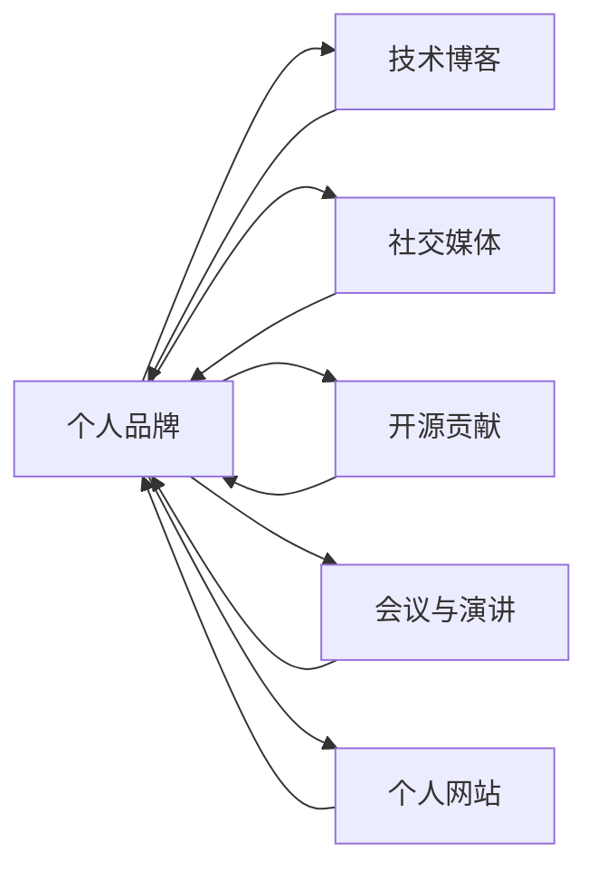

                 

## 1. 背景介绍

在瞬息万变的数字时代，个人品牌成为了个人竞争力的重要标志。无论你是程序员、软件架构师，还是CTO，一个独特的个人品牌能够让你的声音在技术领域中脱颖而出，赢得更多的关注和机会。本文旨在通过一篇深入探讨个人品牌打造技术的博客，帮助广大技术爱好者理解个人品牌的核心要素，学习如何运用技术手段打造属于自己的技术品牌。

## 2. 核心概念与联系

### 2.1 核心概念概述

在打造个人品牌的过程中，以下几个核心概念是必须理解并深入运用的：

- **个人品牌**：个人品牌是指个人在特定领域或社会中的声誉和影响力，是个人形象、价值观、技能和成就的综合体现。
- **技术博客**：通过撰写技术博客，分享专业知识和经验，提升个人在技术社区中的影响力。
- **社交媒体**：利用LinkedIn、Twitter、GitHub等平台展示技术成果和项目，建立专业网络。
- **开源贡献**：积极参与开源项目，通过代码贡献和文档撰写，提升技术影响力。
- **会议与演讲**：在技术会议和行业活动中发表演讲，展示技术见解，扩大个人影响力。
- **个人网站**：建立个人网站，集中展示技术作品、项目经验和个人简历，提供专业的在线形象。

### 2.2 核心概念原理和架构的 Mermaid 流程图



## 3. 核心算法原理 & 具体操作步骤

### 3.1 算法原理概述

个人品牌的打造是一个多方面的长期过程，涉及技术、内容、社交等多个维度。其核心算法原理可以概括为以下几个方面：

1. **内容创造**：持续生产高质量的技术内容，涵盖深度文章、代码示例、技术分享等。
2. **网络扩展**：通过建立和维护技术社区关系网，扩大影响力和知名度。
3. **专业展示**：利用个人网站、社交媒体等平台，全方位展示技术成就和项目经验。
4. **品牌建设**：通过个人博客、开源项目、技术演讲等方式，构建独特的技术风格和专业形象。

### 3.2 算法步骤详解

以下是个人品牌打造的详细操作步骤：

**Step 1: 内容定位与规划**
- 确定自己的技术专长和兴趣领域。
- 规划博客和社交媒体内容，定期更新，保持内容质量和一致性。

**Step 2: 建立技术博客**
- 选择合适的博客平台（如WordPress、GitHub Pages等）。
- 设计博客布局，包括文章模板、标题样式、目录结构等。
- 持续撰写和发布深度技术文章，分享个人经验和见解。

**Step 3: 利用社交媒体**
- 在LinkedIn、Twitter等平台建立专业档案，展示技术成就。
- 积极参与技术社区讨论，发表观点，扩大影响力。
- 分享技术博客和代码仓库链接，吸引关注。

**Step 4: 开源贡献与合作**
- 选择适合自己的开源项目，积极贡献代码和文档。
- 与其他开发者合作，共同推进项目进展。
- 在GitHub上建立个人仓库，展示项目成果。

**Step 5: 参与会议与演讲**
- 关注行业会议和活动，积极报名参加。
- 准备演讲内容，展示技术深度和广度。
- 建立个人品牌形象，吸引行业内的关注和合作。

**Step 6: 维护个人网站**
- 建立个人网站，集中展示技术作品、项目经验和简历。
- 定期更新网站内容，包括技术博客链接、开源项目展示等。
- 优化SEO，提高网站在搜索引擎中的排名。

### 3.3 算法优缺点

个人品牌打造的优势在于：

1. **权威性提升**：通过持续的技术输出，提升在技术社区中的权威性。
2. **资源共享**：通过开源项目和博客分享，吸引更多技术爱好者关注和合作。
3. **职业机会**：高质量的个人品牌能够吸引更多的职业机会和合作。

其缺点主要包括：

1. **时间和精力投入较大**：需要持续生产高质量内容，维护社交网络和技术合作。
2. **需要长时间积累**：短时间内难以看到显著效果，需要长期坚持。
3. **缺乏即时反馈**：个人品牌的建立和影响需要时间积累，无法快速看到成效。

### 3.4 算法应用领域

个人品牌打造技术不仅适用于技术开发者和架构师，同样适用于技术爱好者和教育工作者。在技术领域的各个细分领域，如人工智能、机器学习、软件开发、网络安全等，个人品牌都是提升自身价值、吸引合作机会的重要手段。

## 4. 数学模型和公式 & 详细讲解 & 举例说明

### 4.1 数学模型构建

个人品牌打造技术涉及的内容多样，难以用单一数学模型描述。但我们可以从信息论和网络科学的角度，构建一个简化的个人品牌影响力模型。

设个人品牌影响力为 $I$，内容质量和数量分别为 $Q$ 和 $N$，社交网络规模为 $S$，开源贡献量为 $C$。模型如下：

$$
I = f(Q,N,S,C)
$$

其中，$f$ 为复杂非线性函数，反映了不同因素对品牌影响力的综合作用。

### 4.2 公式推导过程

我们可以通过数据分析和实验，验证上述模型的有效性。例如，假设 $Q$、$N$、$S$、$C$ 的取值范围分别为 $[0,100]$，则可以构建一个简单的模拟实验，评估不同因素对品牌影响力的影响。

### 4.3 案例分析与讲解

以下是一个案例分析，展示如何通过技术博客和开源贡献，提升个人品牌影响力：

1. **技术博客**：某技术博客从零开始，每两周发布一篇深度文章，持续一年。文章内容包括最新技术趋势、编程技巧、项目实战经验等。
2. **开源贡献**：选择了一个流行的开源项目，每周贡献代码和文档，持续半年。
3. **社交网络**：在LinkedIn上建立专业档案，定期更新技术成果，积极参与社区讨论。

通过上述措施，该技术博客在一年后拥有了超过10万订阅者，GitHub仓库也被标记为"Stars"项目，LinkedIn关注者超过5000人。其品牌影响力显著提升。

## 5. 项目实践：代码实例和详细解释说明

### 5.1 开发环境搭建

为了撰写和发布技术博客，需要搭建相应的开发环境。以下是一个基本的开发环境配置流程：

1. 安装Python和相关依赖包，如Markdown编辑器、Git客户端等。
2. 选择博客平台（如WordPress、Jekyll等），并搭建博客环境。
3. 使用GitHub托管博客代码，便于版本控制和备份。
4. 安装域名解析服务，如DNSPod，配置博客域名。

### 5.2 源代码详细实现

以下是一个简化的技术博客开发示例，展示如何构建和发布博客文章：

```python
# 创建博客文章
def create_blog_post(title, content):
    # 生成Markdown格式的文章
    post_content = f"# {title}\n\n{content}"
    # 使用Markdown编辑器生成HTML文件
    html_file = markdownify(post_content)
    # 将HTML文件推送到博客平台
    push_to_website(html_file)
```

### 5.3 代码解读与分析

上述代码展示了如何通过Python脚本来自动化博客文章的创建和发布。其中，`create_blog_post` 函数接收文章标题和内容作为输入，生成Markdown格式的文章，并使用Markdown编辑器将其转换为HTML格式。最后，通过GitHub Pages将HTML文件推送到博客平台。

### 5.4 运行结果展示

使用上述代码，可以方便地创建和发布技术博客文章，自动化流程提高了效率，减少了手动操作带来的错误。

## 6. 实际应用场景

### 6.1 技术开发者

对于技术开发者，个人品牌打造是一个展示技术能力和吸引合作机会的重要手段。通过持续的技术输出和开源贡献，开发者可以提升自己的知名度和影响力，吸引更多的职业机会和项目合作。

### 6.2 技术教育者

技术教育者可以通过个人品牌打造，建立自己的技术声誉和课程品牌，吸引更多的学生和同行关注。例如，在技术博客上发布深度学习教程，或在社交媒体上分享编程经验，都能够提升其教学效果和吸引力。

### 6.3 技术管理者

技术管理者可以通过个人品牌打造，展示自己在技术领域的专业能力和管理经验，吸引更多的技术人才和合作伙伴。例如，在行业会议上发表技术演讲，或在社交媒体上分享项目成功经验，都能够提升其管理能力的影响力。

### 6.4 未来应用展望

未来，个人品牌打造技术将更加广泛地应用于技术领域的各个环节。随着技术的不断进步和社交网络的普及，个人品牌将成为技术从业者的标配，帮助他们在竞争激烈的市场中脱颖而出。

## 7. 工具和资源推荐

### 7.1 学习资源推荐

为了帮助开发者系统掌握个人品牌打造的技术，这里推荐一些优质的学习资源：

1. **《个人品牌打造指南》**：由知名技术博主撰写，系统介绍如何通过技术输出、社交网络和开源贡献打造个人品牌。
2. **LinkedIn Learning**：提供丰富的在线课程，涵盖技术写作、社交媒体管理和项目管理等内容。
3. **GitHub Learning Lab**：通过实践操作，帮助开发者掌握Git和GitHub的使用，提升技术项目管理能力。

### 7.2 开发工具推荐

高效的工具是打造个人品牌的重要保障。以下是几款推荐的开发工具：

1. **Markdown编辑器**：如Typora、MarkdownPad等，用于编写和格式化技术博客文章。
2. **Git客户端**：如GitHub Desktop、SourceTree等，用于版本控制和协作开发。
3. **Jekyll**：一个流行的博客框架，支持静态网站生成和自定义主题。

### 7.3 相关论文推荐

个人品牌打造技术涉及多个领域，以下是几篇相关的重要论文：

1. **《社交媒体对个人品牌的影响》**：研究社交媒体在个人品牌塑造中的作用和机制。
2. **《开源贡献与个人品牌提升》**：分析开源项目对开发者个人品牌的影响。
3. **《技术博客的传播效应》**：探讨技术博客对技术知识和社区的影响。

## 8. 总结：未来发展趋势与挑战

### 8.1 研究成果总结

个人品牌打造技术经过多年的发展，已经成为技术从业者不可或缺的重要手段。通过持续的技术输出和社交网络建设，个人品牌能够在技术领域中形成显著影响力，带来更多职业机会和合作机会。

### 8.2 未来发展趋势

未来，个人品牌打造技术将呈现以下几个发展趋势：

1. **自动化和智能化**：利用人工智能和大数据分析，自动化生成和优化个人品牌内容。
2. **社交网络融合**：将社交媒体、博客、视频等多种形式整合，形成更加全面、互动的社交网络。
3. **跨领域应用**：个人品牌打造技术将应用于更多行业，如教育、娱乐、健康等，提升跨领域影响力。
4. **情感分析与互动**：利用情感分析技术，优化个人品牌互动策略，提升用户黏性。

### 8.3 面临的挑战

尽管个人品牌打造技术在不断发展，但仍面临一些挑战：

1. **内容质量与一致性**：保持高质量和一致性的内容输出，需要持续投入时间和精力。
2. **技术门槛与门槛**：部分技术较为复杂，门槛较高，需要一定的学习成本。
3. **社交网络噪音**：社交网络上的信息泛滥，难以在嘈杂环境中保持品牌形象。
4. **商业化风险**：过度商业化可能导致品牌形象受损，失去技术社区的信任。

### 8.4 研究展望

未来，个人品牌打造技术需要在以下几个方面进行深入研究：

1. **自动化生成工具**：开发自动生成高质量技术内容的软件，降低技术门槛。
2. **跨平台整合**：实现博客、社交网络、视频等多平台的内容整合，提升品牌影响力。
3. **情感分析技术**：利用情感分析技术，优化互动策略，提升用户黏性。
4. **可持续发展**：研究如何长期维护品牌形象，避免商业化风险，保持技术社区的信任。

## 9. 附录：常见问题与解答

**Q1: 如何选择合适的技术博客平台？**

A: 选择合适的博客平台需要考虑以下几个因素：
1. 功能完备性：选择支持Markdown、HTML、SEO等功能丰富的平台。
2. 可扩展性：选择可定制化的博客模板和插件，支持个性化的博客设计。
3. 社区支持：选择用户活跃、社区支持良好的平台，便于交流和互动。

**Q2: 如何提升个人品牌影响力？**

A: 提升个人品牌影响力需要持续的技术输出和社交网络建设：
1. 持续生产高质量技术内容，涵盖深度文章、代码示例、项目经验等。
2. 积极参与技术社区讨论，发表观点，扩大影响力。
3. 利用社交媒体展示技术成果，吸引关注。

**Q3: 如何进行开源贡献？**

A: 进行开源贡献需要选择合适的开源项目，并积极参与：
1. 选择与自己技术领域相关的开源项目，了解项目需求。
2. 阅读项目文档，了解项目规范和贡献流程。
3. 积极参与项目讨论，提交高质量的代码和文档。

**Q4: 如何维护个人品牌形象？**

A: 维护个人品牌形象需要持续的自我管理和品牌运营：
1. 定期更新博客和技术文章，保持内容质量和一致性。
2. 在社交网络中积极互动，展示技术能力和专业知识。
3. 及时回应评论和反馈，维护良好的品牌形象。

---

作者：禅与计算机程序设计艺术 / Zen and the Art of Computer Programming

