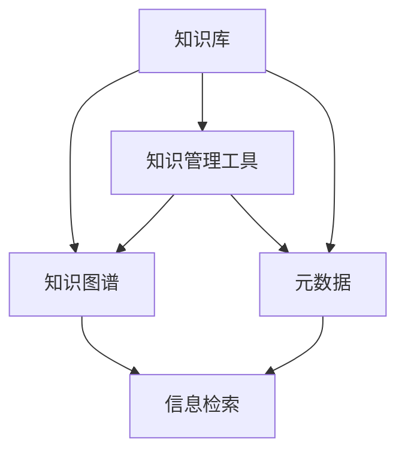

                 

## 1. 背景介绍

### 1.1 问题由来

在信息化高速发展的当下，无论是企业员工还是个人工作者，知识管理工作变得越来越重要。良好的知识管理工作不仅能够提升工作效率，还能帮助个体在复杂多变的职业环境中保持持续的学习和成长。然而，随着知识量的爆炸性增长，传统的知识管理方式已难以满足实际需求。如何高效组织和利用知识资源，成为了信息时代的一项重要挑战。

### 1.2 问题核心关键点

1. **知识管理效率低**：海量的文档、资料难以快速定位，利用率低，浪费时间和资源。
2. **知识积累难以结构化**：个人经验和知识零散无序，难以系统化地沉淀和复用。
3. **信息过载与信息碎片化**：每天接收到大量信息，难以区分重要性和优先级，导致信息碎片化。
4. **知识更新快但难以持续跟进**：各领域的知识更新快速，个人难以跟上最新进展，容易产生知识断层。
5. **缺乏系统化的知识管理工具**：现有的知识管理软件功能有限，难以满足个性化需求。

### 1.3 问题研究意义

构建一个高效的知识管理工作流，对于提升个人和企业的知识管理能力，优化决策过程，促进创新，具有重要意义。

1. **提升工作效率**：通过系统化的知识管理，可以快速定位所需信息，减少查找时间。
2. **促进知识复用**：将零散知识结构化，形成知识库，便于复用和传承。
3. **提高决策质量**：通过系统化的信息筛选和分析，提升决策的全面性和科学性。
4. **支持持续学习**：系统化的知识更新机制，保证个人能够持续学习，跟上最新知识进展。
5. **增强竞争优势**：高效的知识管理工作流，能提高团队的知识共享和创新能力。

## 2. 核心概念与联系

### 2.1 核心概念概述

为更好地理解如何打造个人知识管理工作流，本节将介绍几个核心概念：

- **知识库**：组织和存储知识的基本单元，通常包含文档、笔记、代码、视频等多种形式的资料。
- **知识图谱**：通过关系型数据模型，对知识库中的信息进行关联和推理，形成知识网络。
- **知识图谱**：通过图数据库技术，对知识库中的信息进行关联和推理，形成知识网络。
- **知识管理工具**：如Notion、Evernote、OneNote等，帮助用户高效管理知识库，进行信息检索、分类、标签等操作。
- **元数据**：对知识资源进行结构化描述，如创建时间、修改时间、分类、标签等，辅助信息检索和分类。

这些核心概念之间的逻辑关系可以通过以下Mermaid流程图来展示：



这个流程图展示了几类核心概念的相互关系：

1. 知识库是存储知识的基本容器。
2. 知识图谱通过关系型数据对知识库中的信息进行关联和推理，形成知识网络。
3. 知识管理工具是知识库的管理和检索工具，辅助用户高效管理知识库。
4. 元数据对知识资源进行结构化描述，辅助信息检索和分类。

这些概念共同构成了个人知识管理工作流的核心框架，使得知识的管理、检索、复用变得更加高效和智能化。

## 3. 核心算法原理 & 具体操作步骤

### 3.1 算法原理概述

个人知识管理工作流的核心算法原理主要基于知识图谱和元数据。通过构建知识图谱，将知识库中的信息进行关联和推理，形成知识网络。通过元数据对知识资源进行结构化描述，辅助信息检索和分类。

### 3.2 算法步骤详解

1. **数据采集**：从各种渠道收集知识资源，如文档、笔记、代码等，将内容保存到知识库。
2. **知识抽取**：通过自然语言处理(NLP)等技术，从文本中抽取关键信息，形成元数据。
3. **知识图谱构建**：将元数据输入知识图谱构建工具，生成知识网络。
4. **知识检索与分类**：利用知识图谱和元数据，辅助用户进行知识检索和分类。
5. **知识更新与维护**：定期更新知识库中的知识，维护知识图谱的准确性和完整性。

### 3.3 算法优缺点

知识管理工作流的算法具有以下优点：

1. **信息检索高效**：通过知识图谱和元数据，可以快速定位所需信息。
2. **知识结构化**：将零散知识结构化，便于复用和传承。
3. **辅助决策**：通过知识图谱的推理能力，辅助用户进行决策。
4. **知识更新便捷**：知识库支持定期更新，保持最新知识。

同时，该算法也存在一些局限性：

1. **依赖技术**：算法依赖于NLP、图数据库等技术，需要一定的技术门槛。
2. **知识图谱构建复杂**：知识图谱的构建需要大量时间，且对数据质量要求高。
3. **维护成本高**：知识库和知识图谱的维护需要持续投入资源。
4. **无法处理非结构化数据**：知识图谱主要处理结构化数据，对非结构化数据的处理能力有限。

### 3.4 算法应用领域

知识管理工作流的算法在个人和企业的知识管理中都有广泛的应用：

1. **项目管理**：通过知识库和知识图谱，管理项目文档、代码、报告等资料。
2. **研发协作**：构建研发团队的知识库，促进知识共享和创新。
3. **教育培训**：构建学习者的知识库，辅助学习、考试等。
4. **医疗健康**：构建医疗知识库，支持医疗决策和知识共享。
5. **政府机构**：构建政策法规、研究报告等知识库，辅助政策制定和执行。
6. **金融领域**：构建金融知识库，辅助投资决策和风险管理。

## 4. 数学模型和公式 & 详细讲解 & 举例说明

### 4.1 数学模型构建

知识管理工作流中的数学模型主要涉及知识图谱的构建和知识检索。知识图谱通常表示为图 $G(V,E)$，其中 $V$ 为节点集，$E$ 为边集。节点 $v$ 表示知识库中的实体，边 $e$ 表示实体之间的关系。知识图谱的构建可以通过以下步骤：

1. **实体抽取**：从知识库中的文本中抽取实体，形成节点。
2. **关系抽取**：抽取实体之间的关系，形成边。
3. **图数据库构建**：将抽取的实体和关系存储到图数据库中。

知识检索的数学模型通常使用概率图模型，如PageRank、DeepWalk等。这些模型通过计算节点之间的相似度，进行信息检索和推荐。

### 4.2 公式推导过程

以PageRank算法为例，计算节点 $v$ 的PageRank值：

$$
\text{PR}(v) = \frac{1}{c} \sum_{u \in N(v)} \text{PR}(u) + d/(1+d) \cdot \frac{1}{M}
$$

其中 $N(v)$ 为节点 $v$ 的邻居节点集，$c$ 为归一化系数，$d$ 为阻尼系数，$M$ 为节点总数。

### 4.3 案例分析与讲解

以某企业的知识管理工作流为例：

1. **数据采集**：企业从各业务部门收集文档、代码、报告等资料，保存至知识库。
2. **知识抽取**：使用NLP技术抽取文档中的实体和关系，生成元数据。
3. **知识图谱构建**：将元数据输入Neo4j等图数据库，构建知识图谱。
4. **知识检索与分类**：用户输入查询关键词，通过PageRank算法计算相关性，辅助检索和分类。
5. **知识更新与维护**：定期更新知识库中的资料，维护知识图谱的准确性和完整性。

## 5. 项目实践：代码实例和详细解释说明

### 5.1 开发环境搭建

构建个人知识管理工作流，需要搭建开发环境，具体步骤如下：

1. **安装Python**：从官网下载Python安装包，进行安装。
2. **安装相关的NLP库**：如NLTK、spaCy等，用于自然语言处理。
3. **安装图数据库**：如Neo4j、OrientDB等，用于存储知识图谱。
4. **安装知识管理工具**：如Notion、Evernote、OneNote等，辅助管理知识库。

### 5.2 源代码详细实现

以下是一个使用Python和Neo4j构建知识图谱的示例代码：

```python
from neo4j import GraphDatabase

# 连接数据库
driver = GraphDatabase.driver("bolt://localhost:7687", auth=("neo4j", "password"))

# 创建节点
def create_node(tx, name, type):
    result = tx.run("MERGE (n) RETURN n", name)
    if not result:
        tx.run("MERGE (n:$type) {name: $name}", name=name)

# 创建关系
def create_relation(tx, node1, node2, rel_type):
    tx.run("MERGE (a:$node1 {name: $node1})-[:$rel_type]->(b:$node2 {name: $node2})", node1=node1, node2=node2, rel_type=rel_type)

# 使用示例
with driver.session() as session:
    create_node(session, "公司", "Company")
    create_node(session, "部门", "Department")
    create_relation(session, "公司", "研发部", "contains")
```

### 5.3 代码解读与分析

该示例代码实现了一个简单的知识图谱构建功能，具体步骤如下：

1. **连接数据库**：使用GraphDatabase库连接Neo4j数据库。
2. **创建节点**：使用MERGE语句创建节点，如果不存在则新增。
3. **创建关系**：使用MERGE语句创建关系，如果不存在则新增。
4. **使用示例**：创建一家公司和部门的关系。

通过不断完善上述代码，可以实现复杂的知识图谱构建功能。

### 5.4 运行结果展示

运行上述代码后，可以在Neo4j的浏览器中查看构建的知识图谱：

```
+-----------------------------------+
| (n0)<-[:contains]-->(n1)            |
+-----------------------------------+
|                                 n0 |
|                                 n1 |
| company                          department |
+-----------------------------------+
```

## 6. 实际应用场景

### 6.1 项目管理

在项目管理中，知识管理工作流可以帮助项目经理高效地管理项目文档、代码、报告等资料。通过构建知识图谱，可以快速检索所需信息，辅助决策。

### 6.2 研发协作

在研发协作中，知识管理工作流可以通过知识库和知识图谱，促进团队内部的知识共享和创新。

### 6.3 教育培训

在教育培训中，知识管理工作流可以帮助学习者高效地管理学习资料，辅助学习、考试等。

### 6.4 医疗健康

在医疗健康中，知识管理工作流可以帮助医生高效地管理医疗知识库，支持医疗决策和知识共享。

### 6.5 政府机构

在政府机构中，知识管理工作流可以帮助政策制定者管理政策法规、研究报告等资料，辅助政策制定和执行。

### 6.6 金融领域

在金融领域中，知识管理工作流可以帮助投资者管理投资报告、研究报告等资料，辅助投资决策和风险管理。

## 7. 工具和资源推荐

### 7.1 学习资源推荐

为帮助开发者系统掌握知识管理工作流的理论基础和实践技巧，这里推荐一些优质的学习资源：

1. **《知识管理与信息系统》课程**：斯坦福大学开设的课程，深入讲解知识管理的基本原理和技术。
2. **《知识图谱：构建、查询与推理》书籍**：系统讲解知识图谱的构建、查询和推理技术。
3. **《深度学习与知识图谱》书籍**：讲解深度学习在知识图谱构建中的应用。
4. **知识管理相关论文**：阅读相关论文，掌握最新的研究成果和应用案例。

### 7.2 开发工具推荐

高效的开发离不开优秀的工具支持。以下是几款用于知识管理工作流开发的常用工具：

1. **Notion**：提供知识库管理、文档协作、数据库等功能，适合个人和企业使用。
2. **Evernote**：提供笔记管理、标签、分类等功能，适合个人使用。
3. **OmniFocus**：提供任务管理、时间管理等功能，适合个人使用。
4. **Notion AI**：提供智能摘要、智能推荐等功能，辅助知识管理。
5. **Zotero**：提供文献管理、引用生成等功能，适合科研工作者使用。

### 7.3 相关论文推荐

知识管理工作流的技术发展依赖于学界的持续研究。以下是几篇奠基性的相关论文，推荐阅读：

1. **《知识图谱构建与推理技术综述》**：总结了知识图谱构建和推理的最新研究进展。
2. **《知识管理框架与实践》**：提出了一种基于多维模型的知识管理框架。
3. **《深度学习在知识图谱中的应用》**：讨论了深度学习在知识图谱构建和推理中的应用。

## 8. 总结：未来发展趋势与挑战

### 8.1 总结

本文对如何打造个人知识管理工作流进行了全面系统的介绍。首先阐述了知识管理工作流的重要性，明确了知识管理工作流在提升效率、促进知识传承、辅助决策等方面的独特价值。其次，从原理到实践，详细讲解了知识管理工作流的数学模型和关键步骤，给出了知识管理工作流的完整代码实例。同时，本文还探讨了知识管理工作流在多个行业领域的应用前景，展示了知识管理工作流的广泛应用潜力。最后，本文精选了知识管理工作流的各类学习资源，力求为读者提供全方位的技术指引。

通过本文的系统梳理，可以看到，知识管理工作流在提升个人和企业的知识管理能力，优化决策过程，促进创新，具有重要意义。未来，伴随知识管理工作流的不断发展，相信将为个人和企业的知识管理带来新的变革，推动知识管理的规模化、智能化进程。

### 8.2 未来发展趋势

展望未来，知识管理工作流将呈现以下几个发展趋势：

1. **智能化知识管理**：通过AI技术，实现知识图谱的自动构建、智能推荐等功能。
2. **多模态知识管理**：融合文本、图像、视频等多种形式的知识，形成多模态知识库。
3. **动态知识管理**：构建实时更新的知识图谱，保证知识的时效性和准确性。
4. **社区化知识管理**：构建知识共享平台，促进社区化知识交流和协作。
5. **跨领域知识融合**：将知识管理工作流与其他领域的技术（如区块链、大数据等）进行融合，形成更加全面的知识管理解决方案。
6. **知识图谱可视化**：利用可视化技术，展示知识图谱的复杂关系，辅助用户理解和操作。

以上趋势凸显了知识管理工作流在智能化、多模态、动态化等方面的发展方向。这些方向的探索和发展，必将推动知识管理工作流迈向更高的台阶，为知识管理带来新的突破。

### 8.3 面临的挑战

尽管知识管理工作流已经取得了不小的进展，但在迈向更加智能化、普适化应用的过程中，仍面临诸多挑战：

1. **技术门槛高**：知识管理工作流依赖于NLP、图数据库等技术，需要较高的技术门槛。
2. **数据质量要求高**：知识图谱的构建依赖于高质量的数据，数据清洗和标注工作量较大。
3. **知识图谱规模大**：知识图谱的规模较大，存储和检索效率要求高。
4. **用户接受度低**：部分用户对新技术和新工具的接受度较低，需要持续推广和教育。
5. **隐私和安全问题**：知识管理工作流涉及大量敏感信息，需要严格的数据隐私和安全保护。

### 8.4 研究展望

面对知识管理工作流面临的挑战，未来的研究需要在以下几个方面寻求新的突破：

1. **降低技术门槛**：开发更易于使用的知识管理工作流工具，降低技术门槛。
2. **提升数据质量**：研究数据清洗和标注自动化技术，提升数据质量。
3. **优化知识图谱构建**：优化知识图谱构建算法，提高效率和准确性。
4. **增强用户友好性**：提升知识管理工作流的使用体验，降低用户学习成本。
5. **强化隐私和安全保护**：研究数据隐私和安全保护技术，确保知识管理工作流的安全性。
6. **跨领域融合**：探索知识管理工作流与其他领域技术的融合，提升综合应用能力。

这些研究方向将引领知识管理工作流技术的不断发展，为知识管理带来新的突破。相信通过学界和产业界的共同努力，知识管理工作流将更加智能、普适、高效，成为知识管理的重要工具。

## 9. 附录：常见问题与解答

**Q1：如何选择合适的知识管理工作流工具？**

A: 选择合适的知识管理工作流工具需要考虑以下几个方面：

1. **功能需求**：根据实际需求选择合适的功能，如文档管理、任务管理、时间管理等。
2. **用户友好性**：选择易于上手、界面友好的工具，降低学习成本。
3. **协作能力**：选择支持团队协作的工具，便于知识共享和协作。
4. **扩展性**：选择可扩展性强的工具，适应未来的需求变化。
5. **成本预算**：根据预算选择合适的工具，平衡成本和功能。

**Q2：如何构建高效的知识图谱？**

A: 构建高效的知识图谱需要以下几个步骤：

1. **数据采集**：从各种渠道收集知识资源，确保数据来源多样性和准确性。
2. **实体抽取**：使用NLP技术从文本中抽取实体，形成节点。
3. **关系抽取**：抽取实体之间的关系，形成边。
4. **图数据库构建**：将抽取的实体和关系存储到图数据库中，选择合适的存储引擎和查询语言。
5. **模型优化**：使用图神经网络等技术，优化知识图谱的表示和推理能力。
6. **持续更新**：定期更新知识图谱，保证其时效性和准确性。

**Q3：知识管理工作流如何支持团队协作？**

A: 知识管理工作流可以通过以下方式支持团队协作：

1. **文档共享**：通过知识库管理文档，方便团队成员共享和查看。
2. **任务分配**：使用任务管理工具分配任务，跟踪任务进度。
3. **协同编辑**：支持多人协同编辑，实时共享文档和反馈。
4. **知识沉淀**：将团队成员的经验和知识沉淀到知识库中，便于复用和传承。
5. **知识交流**：提供知识交流平台，促进团队成员之间的知识共享和交流。

**Q4：知识管理工作流如何确保数据安全？**

A: 知识管理工作流可以通过以下方式确保数据安全：

1. **数据加密**：对敏感数据进行加密，防止数据泄露。
2. **访问控制**：设置严格的访问权限，控制数据访问和操作。
3. **审计和监控**：记录和审计数据访问和操作日志，监控异常行为。
4. **备份和恢复**：定期备份数据，确保数据不会丢失。
5. **安全培训**：对团队成员进行数据安全培训，提高数据保护意识。

通过上述措施，可以有效地保障知识管理工作流中的数据安全。

**Q5：知识管理工作流如何支持多模态数据管理？**

A: 知识管理工作流可以通过以下方式支持多模态数据管理：

1. **多模态数据采集**：从不同渠道采集文本、图像、视频等多种形式的数据。
2. **多模态知识抽取**：使用多模态NLP技术从不同数据中抽取知识。
3. **多模态知识融合**：将不同形式的知识融合到知识库中，形成统一的知识表示。
4. **多模态查询和推荐**：使用多模态图数据库和推荐算法，辅助多模态知识的检索和推荐。

通过多模态数据管理，可以更全面地掌握和利用各种形式的知识，提升知识管理工作流的实用性。

---

作者：禅与计算机程序设计艺术 / Zen and the Art of Computer Programming

