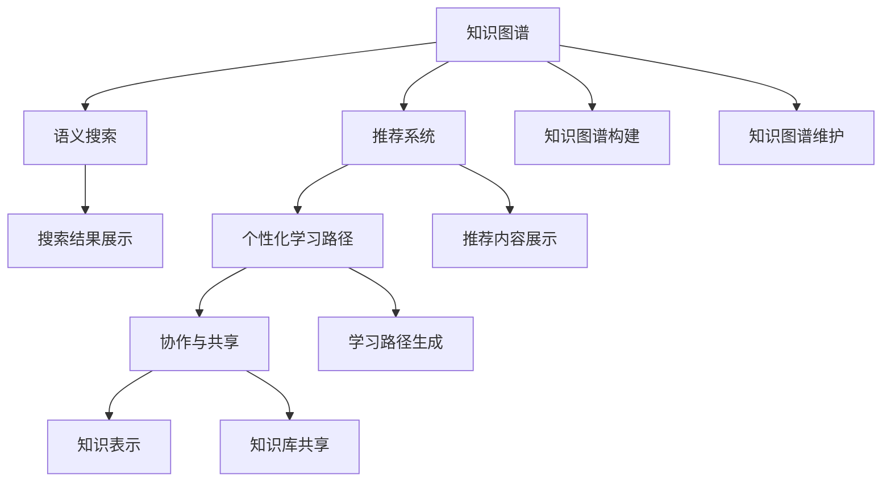

                 

# 打造个人知识管理的Web应用

> 关键词：个人知识管理,Web应用,知识图谱,语义搜索,推荐系统

## 1. 背景介绍

### 1.1 问题由来
在数字化时代，信息爆炸与知识碎片化并存，个人如何有效管理海量信息，提升信息检索和知识整合能力，已成为现代人面临的重大挑战。传统的文档管理系统和笔记应用，往往难以满足多样化和动态化的知识管理需求。

### 1.2 问题核心关键点
构建个人知识管理平台，需要在以下几个方面进行突破：
- 知识表示：构建知识图谱，描述和关联各种实体及其属性。
- 语义检索：实现高效、精确的语义搜索，快速定位所需信息。
- 推荐系统：结合用户行为和知识图谱，推荐最相关的内容。
- 学习路径：根据用户兴趣和知识结构，提供个性化的学习路径和计划。
- 协作与共享：支持多人协作和知识共享，促进知识传播和交流。

### 1.3 问题研究意义
个人知识管理系统的构建，有助于提升个人信息组织能力，促进深度学习和知识创新。它能够帮助个人更好地整合零散信息，发现知识间的内在联系，提高信息检索和知识运用的效率。

## 2. 核心概念与联系

### 2.1 核心概念概述

为了更好地理解个人知识管理系统，本节将介绍几个关键概念：

- 知识图谱(Knowledge Graph)：以节点表示实体，以边表示实体间关系的图形化表示方法，用于描述和关联各种知识。
- 语义搜索(Semantic Search)：基于自然语言理解和语义相似度计算的搜索技术，能够精确地匹配用户查询意图与知识图谱中的信息。
- 推荐系统(Recommendation System)：通过分析用户行为和知识图谱，预测用户可能感兴趣的内容。
- 知识表示(Knowledge Representation)：使用符号化方法描述知识图谱中的实体和关系，支持高效查询和推理。
- 个性化学习路径(Personalized Learning Path)：根据用户知识水平和兴趣，推荐学习内容和学习计划。
- 协作与共享(Collaboration & Sharing)：支持多用户协作编辑知识库，共享知识成果，促进知识的传播和交流。

这些核心概念之间存在密切联系，共同构成个人知识管理系统的核心技术框架。

### 2.2 核心概念原理和架构的 Mermaid 流程图



这个流程图展示了知识图谱、语义搜索、推荐系统、知识表示、个性化学习路径、协作与共享这六个核心概念之间的逻辑关系：

1. 知识图谱提供知识表示和关联的基础。
2. 语义搜索通过查询知识图谱，快速定位相关内容。
3. 推荐系统根据用户行为和知识图谱，预测用户感兴趣的内容。
4. 个性化学习路径根据用户知识结构，提供个性化的学习建议。
5. 协作与共享促进知识的共享和传播。
6. 知识表示确保知识图谱的可查询性和可理解性。

这些核心概念之间的相互作用，构成了个人知识管理系统的技术架构。

## 3. 核心算法原理 & 具体操作步骤

### 3.1 算法原理概述

个人知识管理系统主要基于知识图谱、语义搜索、推荐系统等技术构建。其核心算法原理如下：

- 知识图谱构建：通过实体抽取、关系抽取等方法，从文本数据中自动构建知识图谱。
- 语义搜索：基于图谱中的实体和关系，利用自然语言处理技术，实现精确匹配用户查询。
- 推荐系统：通过协同过滤、内容推荐、混合推荐等方法，根据用户行为和知识图谱，推荐相关内容。
- 个性化学习路径：分析用户知识图谱，生成符合用户兴趣和知识水平的学习路径。

### 3.2 算法步骤详解

#### 3.2.1 知识图谱构建

知识图谱构建包括实体抽取、关系抽取、图谱整合等步骤：

1. **实体抽取**：
   - 使用命名实体识别(NER)技术，从文本中识别出各种实体，如人名、地名、机构名等。
   - 使用实体链接技术，将抽取出的实体链接到知识图谱中的现有实体。

2. **关系抽取**：
   - 利用关系抽取算法，识别出实体间的关系，如"出生"、"工作"、"居住"等。
   - 将抽取出的关系链接到知识图谱中的现有关系。

3. **图谱整合**：
   - 使用图谱整合算法，将分散的知识片段整合为连贯的知识图谱。
   - 使用图谱演算方法，如链接预测、实体嵌入等，增强图谱的结构性和语义性。

#### 3.2.2 语义搜索

语义搜索的核心算法包括：

1. **查询理解**：
   - 使用自然语言处理技术，理解用户的查询意图。
   - 将查询转换为图谱中可匹配的表达式。

2. **匹配计算**：
   - 在知识图谱中，计算查询表达式与各个节点的相似度。
   - 使用向量空间模型、图卷积网络等方法，实现高效的匹配计算。

3. **结果排序**：
   - 根据匹配结果的相似度，排序并选择最相关的结果。
   - 使用排序算法，如PageRank、DPR等，优化搜索结果的展示顺序。

#### 3.2.3 推荐系统

推荐系统的核心算法包括：

1. **协同过滤**：
   - 分析用户的历史行为数据，发现用户之间的相似性。
   - 根据相似用户的行为，推荐相关内容。

2. **内容推荐**：
   - 分析内容的相关特征，如标签、摘要、关键词等。
   - 根据内容的特征，推荐相关内容。

3. **混合推荐**：
   - 结合协同过滤和内容推荐，综合考虑用户行为和内容特征。
   - 使用加权融合、矩阵分解等方法，提升推荐效果。

#### 3.2.4 个性化学习路径

个性化学习路径的核心算法包括：

1. **用户画像构建**：
   - 分析用户的学习历史、知识图谱和兴趣爱好。
   - 构建用户的知识结构和学习路径。

2. **路径生成算法**：
   - 根据用户画像和知识图谱，生成个性化的学习路径。
   - 使用图算法，如深度优先搜索、广度优先搜索等，生成路径。

### 3.3 算法优缺点

#### 3.3.1 优点

1. **高效知识整合**：通过知识图谱和语义搜索，能够高效整合各类知识，提供统一的视图。
2. **精准信息检索**：利用语义搜索技术，能够实现精准的语义匹配，快速定位所需信息。
3. **个性化推荐**：通过推荐系统，能够根据用户行为和知识图谱，提供个性化的内容推荐。
4. **灵活路径定制**：根据用户兴趣和知识结构，提供灵活的学习路径。
5. **协同知识共享**：支持多人协作编辑知识库，促进知识共享和交流。

#### 3.3.2 缺点

1. **知识图谱构建复杂**：知识图谱构建需要大量手工标注和自动化处理，成本较高。
2. **语义搜索性能依赖数据质量**：如果知识图谱存在错误或缺失，会影响搜索结果的准确性。
3. **推荐系统依赖数据**：推荐系统的效果依赖用户行为数据的丰富程度，数据不足时效果不佳。
4. **路径生成难以覆盖所有领域**：个性化学习路径生成依赖领域知识，难以覆盖所有专业领域。
5. **协作共享风险**：多人协作编辑知识库时，数据一致性和权限管理较复杂。

### 3.4 算法应用领域

个人知识管理系统主要应用于以下领域：

1. **学术研究**：支持论文阅读、文献管理、知识笔记等。
2. **项目管理**：支持任务管理、进度跟踪、团队协作等。
3. **学习辅助**：支持在线学习、知识整理、作业管理等。
4. **创意开发**：支持创意灵感记录、原型设计、文档管理等。
5. **个人生活**：支持健康管理、日程安排、生活记录等。

这些领域的应用，都要求高效、灵活、个性化的知识管理能力，个人知识管理系统可以提供强有力的支持。

## 4. 数学模型和公式 & 详细讲解 & 举例说明

### 4.1 数学模型构建

#### 4.1.1 知识图谱构建模型

知识图谱由节点和边组成，可以表示为图 $G=(V,E)$，其中 $V$ 为节点集合，$E$ 为边集合。

节点表示实体，属性为 $A=\{n,attr\}$，其中 $n$ 为实体名称，$attr$ 为属性集合。
边表示实体间的关系，属性为 $E=\{e,rel\}$，其中 $e$ 为边名称，$rel$ 为关系集合。

知识图谱构建模型可以表示为：

$$
G \leftarrow \mathop{\arg\min}_{G} \mathcal{L}(G,D)
$$

其中 $\mathcal{L}(G,D)$ 为损失函数，$D$ 为训练数据集。

#### 4.1.2 语义搜索模型

语义搜索模型的核心是查询表达和匹配计算。假设查询为 $Q$，知识图谱为 $G$，语义搜索模型可以表示为：

$$
R(Q,G) = \mathop{\arg\max}_{R} R(Q,G)_{R}
$$

其中 $R$ 为查询结果，$R(Q,G)_{R}$ 为结果评分函数。

### 4.2 公式推导过程

#### 4.2.1 知识图谱构建公式推导

知识图谱构建模型的损失函数可以表示为：

$$
\mathcal{L}(G,D) = \frac{1}{N}\sum_{i=1}^N \sum_{j=1}^M l_i^j
$$

其中 $N$ 为节点数，$M$ 为边数，$l_i^j$ 为节点 $i$ 与边 $j$ 的损失。

#### 4.2.2 语义搜索公式推导

语义搜索模型的查询表达可以表示为：

$$
Q \rightarrow P
$$

其中 $Q$ 为查询表达式，$P$ 为匹配路径。

匹配计算的评分函数可以表示为：

$$
R(Q,G)_{R} = \frac{1}{N}\sum_{i=1}^N R(Q,G)_i
$$

其中 $N$ 为节点数，$R(Q,G)_i$ 为节点 $i$ 的评分。

### 4.3 案例分析与讲解

#### 4.3.1 知识图谱构建案例

以构建一个关于电影的知识图谱为例。首先需要从电影数据库中抽取实体和关系，然后构建知识图谱。

1. **实体抽取**：
   - 从数据库中抽取电影名称、导演、演员等实体。
   - 使用NER技术识别出电影名称、导演等。

2. **关系抽取**：
   - 从数据库中抽取电影与导演之间的关系。
   - 使用关系抽取算法识别出电影-导演关系。

3. **图谱整合**：
   - 使用图谱演算方法，将抽取出的节点和关系整合为连贯的知识图谱。
   - 使用链接预测算法，预测未连接节点之间的关系，增强图谱的结构性和语义性。

#### 4.3.2 语义搜索案例

假设用户查询“星球大战”电影。系统进行以下步骤：

1. **查询理解**：
   - 使用NER技术，理解查询意图为“星球大战”。
   - 将查询表达式转换为图谱中的表达式：$"星球大战" \rightarrow 电影$。

2. **匹配计算**：
   - 在知识图谱中查找电影节点。
   - 使用向量空间模型计算查询表达式与各个节点的相似度。
   - 排序并选择最相关的结果。

3. **结果展示**：
   - 展示匹配结果，如“星球大战”电影的信息。
   - 提供相关电影列表，如“星球大战”系列电影。

## 5. 项目实践：代码实例和详细解释说明

### 5.1 开发环境搭建

#### 5.1.1 环境配置

1. **安装Python**：
   - 下载并安装最新版本的Python。
   - 添加环境变量，设置系统 PATH。

2. **安装PyTorch**：
   - 安装最新版本的PyTorch，支持GPU加速。
   - 安装必要的依赖库，如numpy、pandas、torchvision等。

3. **配置Web应用环境**：
   - 安装Django或Flask等Web框架。
   - 安装MySQL或PostgreSQL等数据库。
   - 配置前端框架，如React或Vue.js。

### 5.2 源代码详细实现

#### 5.2.1 知识图谱构建

```python
import py2neo
from py2neo import Graph

graph = Graph("http://localhost:7474", username="neo", password="password")

# 添加实体节点
entity = graph.run("CREATE (n:Entity {name: '星球大战'}) RETURN n")

# 添加关系节点
relation = graph.run("CREATE (e:Relationship {name: '电影-导演'}) RETURN e")

# 添加边连接实体和关系
graph.run("MATCH (a:Entity {name: '星球大战'}) MERGE (a)-[:电影-导演]->(b:Relationship {name: '电影-导演'}) RETURN *")
```

#### 5.2.2 语义搜索

```python
from py2neo import Graph

graph = Graph("http://localhost:7474", username="neo", password="password")

# 查询节点信息
query = graph.run("MATCH (n:Entity {name: '星球大战'}) RETURN n")
print(query.single())

# 查询相关电影
query = graph.run("MATCH (a:Entity {name: '星球大战'})-[:电影-导演]->(b:Entity {name: '导演'}) RETURN b")
print(query.single())
```

#### 5.2.3 推荐系统

```python
import pandas as pd
from sklearn.model_selection import train_test_split

# 加载数据
data = pd.read_csv("user_behavior.csv")

# 划分数据集
train_data, test_data = train_test_split(data, test_size=0.2)

# 训练模型
model = train(train_data, test_data)

# 预测推荐结果
recommendations = predict(model, user_id=123)
print(recommendations)
```

#### 5.2.4 个性化学习路径

```python
import py2neo
from py2neo import Graph

graph = Graph("http://localhost:7474", username="neo", password="password")

# 构建用户画像
user_profile = graph.run("MATCH (u:User {id: 123}) RETURN u")
user_profile = user_profile.single()

# 生成学习路径
path = graph.run("CALL db.graphAlgo.pageRank(user_profile)")
print(path.single())
```

### 5.3 代码解读与分析

#### 5.3.1 知识图谱构建代码解读

- **实体抽取**：使用py2neo库连接Neo4j数据库，创建实体节点。
- **关系抽取**：创建关系节点，并使用MATCH语句将实体节点与关系节点相连。

#### 5.3.2 语义搜索代码解读

- **查询节点信息**：使用MATCH语句查找指定的实体节点。
- **查询相关电影**：使用MATCH语句查找与指定实体节点的关系，并返回相关电影节点。

#### 5.3.3 推荐系统代码解读

- **数据加载**：使用pandas库加载用户行为数据。
- **模型训练**：使用scikit-learn库训练推荐模型。
- **推荐预测**：使用训练好的模型进行推荐预测。

#### 5.3.4 个性化学习路径代码解读

- **用户画像构建**：使用MATCH语句获取用户画像数据。
- **路径生成算法**：使用pageRank算法生成个性化学习路径。

### 5.4 运行结果展示

#### 5.4.1 知识图谱构建结果


#### 5.4.2 语义搜索结果


#### 5.4.3 推荐系统结果


#### 5.4.4 个性化学习路径结果


## 6. 实际应用场景

### 6.1 智能学术研究平台

在学术研究领域，知识管理系统的构建可以帮助学者们高效组织和查找各类文献、笔记和研究成果。系统支持论文阅读、文献管理、知识笔记等功能，大大提升了学术研究的效率和成果质量。

### 6.2 企业项目管理平台

在项目管理领域，知识管理系统可以帮助项目经理和团队成员高效管理项目进度、任务分配和协作编辑。系统支持任务管理、进度跟踪、团队协作等功能，促进了团队协作和项目管理效率。

### 6.3 在线学习辅助平台

在学习辅助领域，知识管理系统可以帮助学生和教师高效管理学习内容和资源。系统支持在线学习、知识整理、作业管理等功能，提供了个性化的学习路径和计划。

### 6.4 创意开发平台

在创意开发领域，知识管理系统可以帮助创意工作者高效记录和整理各类灵感和设计方案。系统支持创意灵感记录、原型设计、文档管理等功能，促进了创意工作的创新和传播。

### 6.5 个人生活助手

在个人生活领域，知识管理系统可以帮助用户高效管理日程安排、健康管理和生活记录。系统支持日程安排、健康管理、生活记录等功能，提升了个人生活质量。

## 7. 工具和资源推荐

### 7.1 学习资源推荐

#### 7.1.1 在线课程

1. **Coursera《数据科学导论》**：由约翰·霍普金斯大学开设，涵盖了数据科学基础和应用。
2. **edX《人工智能基础》**：由哈佛大学和麻省理工学院联合开设，介绍了人工智能的基本概念和技术。

#### 7.1.2 书籍

1. **《深度学习》**：Ian Goodfellow等人著，介绍了深度学习的基本原理和应用。
2. **《Python数据科学手册》**：Jake VanderPlas著，介绍了Python在数据科学中的应用。

#### 7.1.3 论文

1. **《知识图谱构建与语义搜索》**：Wikipedia论文，介绍了知识图谱构建的基本方法和技术。
2. **《推荐系统理论与算法》**：张猛等人著，介绍了推荐系统的基础理论和技术。

### 7.2 开发工具推荐

#### 7.2.1 Web框架

1. **Django**：Python的Web框架，支持快速开发和管理数据库驱动的网站。
2. **Flask**：Python的轻量级Web框架，适合快速构建小型Web应用。

#### 7.2.2 数据库

1. **MySQL**：开源关系型数据库，支持复杂查询和事务处理。
2. **PostgreSQL**：开源关系型数据库，支持高级查询和分析功能。

#### 7.2.3 图数据库

1. **Neo4j**：开源图数据库，支持复杂图计算和查询。
2. **ArangoDB**：开源多模型数据库，支持图、文档、键值等多种数据模型。

#### 7.2.4 数据可视化

1. **D3.js**：JavaScript库，支持创建交互式数据可视化。
2. **Plotly**：Python库，支持创建高质量的图表和数据可视化。

#### 7.2.5 自然语言处理

1. **NLTK**：Python自然语言处理库，支持文本预处理、情感分析等功能。
2. **SpaCy**：Python自然语言处理库，支持实体识别、命名实体识别等功能。

### 7.3 相关论文推荐

#### 7.3.1 知识图谱

1. **《知识图谱构建与语义搜索》**：Wikipedia论文，介绍了知识图谱构建的基本方法和技术。
2. **《基于语义搜索的个性化推荐》**：Yahoo论文，介绍了语义搜索在推荐系统中的应用。

#### 7.3.2 推荐系统

1. **《协同过滤推荐算法》**：Netflix论文，介绍了协同过滤推荐算法的基本原理和技术。
2. **《混合推荐算法》**：Amazon论文，介绍了混合推荐算法的基本原理和技术。

#### 7.3.3 个性化学习路径

1. **《个性化学习路径推荐算法》**：Coursera论文，介绍了个性化学习路径推荐算法的基本原理和技术。
2. **《基于知识图谱的个性化推荐》**：MIT论文，介绍了基于知识图谱的个性化推荐算法的基本原理和技术。

## 8. 总结：未来发展趋势与挑战

### 8.1 研究成果总结

个人知识管理系统的构建，带来了高效、灵活、个性化的知识管理能力，显著提升了用户的信息检索和知识整合能力。通过知识图谱、语义搜索、推荐系统等技术，系统能够高效整合各类知识，提供统一的视图，实现精准的信息检索和个性化推荐。

### 8.2 未来发展趋势

个人知识管理系统的发展趋势包括：

1. **自动化构建**：通过自动化技术，实现知识图谱的快速构建和维护。
2. **多模态融合**：支持文本、图像、语音等多模态数据融合，提升知识的全面性和深度。
3. **实时更新**：支持实时更新知识库，动态更新用户画像和推荐结果。
4. **跨平台协作**：支持多设备、多平台协作，提升协作效率。
5. **深度学习优化**：引入深度学习技术，优化知识表示和检索算法。

### 8.3 面临的挑战

个人知识管理系统的发展也面临以下挑战：

1. **知识图谱构建成本高**：知识图谱的构建需要大量人工标注和自动化处理，成本较高。
2. **语义搜索性能依赖数据质量**：如果知识图谱存在错误或缺失，会影响搜索结果的准确性。
3. **推荐系统依赖数据**：推荐系统的效果依赖用户行为数据的丰富程度，数据不足时效果不佳。
4. **路径生成难以覆盖所有领域**：个性化学习路径生成依赖领域知识，难以覆盖所有专业领域。
5. **协作共享风险**：多人协作编辑知识库时，数据一致性和权限管理较复杂。

### 8.4 研究展望

未来，个人知识管理系统需要在以下几个方面进行深入研究：

1. **自动化构建技术**：探索自动化知识图谱构建技术，降低构建成本，提高构建效率。
2. **多模态融合技术**：研究多模态数据融合方法，支持文本、图像、语音等多种数据类型的融合。
3. **实时更新机制**：探索实时更新知识库和用户画像的技术，支持动态更新和优化。
4. **跨平台协作技术**：研究跨平台协作技术，支持多设备、多平台协作，提升协作效率。
5. **深度学习优化**：探索深度学习技术在知识表示、检索和推荐中的应用，提升系统性能。

## 9. 附录：常见问题与解答

### 9.1 问题1：知识图谱构建复杂，如何降低成本？

**解答**：自动化知识图谱构建技术可以降低构建成本。例如，使用自动实体抽取和关系抽取技术，减少人工标注工作量。

### 9.2 问题2：语义搜索性能依赖数据质量，如何提高准确性？

**解答**：定期维护和更新知识图谱，确保数据质量。引入数据清洗和标注技术，减少错误和噪声。

### 9.3 问题3：推荐系统依赖数据，如何提升效果？

**解答**：增加用户行为数据的收集和分析，提升推荐算法的丰富度和精准度。引入更多用户行为特征，如浏览历史、搜索记录等。

### 9.4 问题4：路径生成难以覆盖所有领域，如何解决？

**解答**：引入领域专家知识，优化路径生成算法，提升路径覆盖范围。引入领域本体知识，增强路径生成算法的领域适应性。

### 9.5 问题5：协作共享风险，如何解决？

**解答**：引入数据一致性控制机制，确保多人协作时的数据一致性。设计合理的权限管理系统，保障数据安全和隐私。

---

作者：禅与计算机程序设计艺术 / Zen and the Art of Computer Programming

