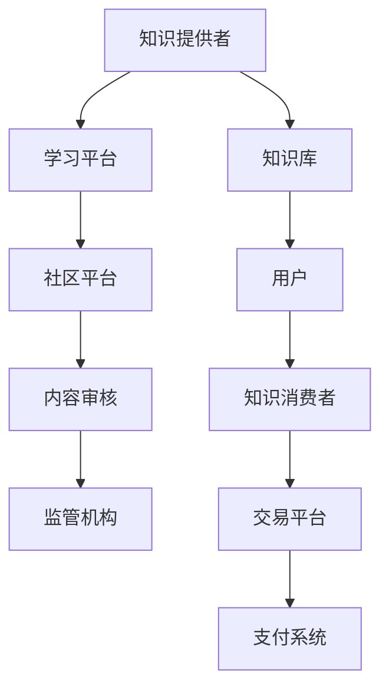

                 

# 打造垂直技术领域的知识付费生态系统

> 关键词：知识付费, 垂直领域, 技术生态, 知识图谱, 自然语言处理(NLP), 专家社区, 学习平台, 人工智能(AI), 深度学习

## 1. 背景介绍

在当前信息化飞速发展的时代，知识的获取、传播、应用方式已经发生了根本性的变革。人们对于知识的需求越来越强烈，同时对于知识获取的效率和质量也提出了更高的要求。在这样的背景下，知识付费成为了一个快速增长的领域，吸引了众多投资者和企业的关注。

知识付费是一种基于互联网的新型经济模式，用户通过付费获取高质量、有深度的知识内容，以实现自我提升和职业发展的目的。垂直技术领域的知识付费生态系统，则是将这种模式应用到技术知识上，帮助用户通过付费获取深入、精准的技术知识，从而在垂直技术领域中取得竞争优势。

本文将从背景介绍、核心概念、核心算法、项目实践、应用场景、工具和资源推荐以及未来展望等多个方面，对垂直技术领域的知识付费生态系统进行全面分析。

## 2. 核心概念与联系

### 2.1 核心概念概述

垂直技术领域的知识付费生态系统，是由知识提供者、知识消费者、技术平台、内容审核和监管机构等多方共同构成的复杂系统。其中，知识提供者包括专家、学者、工程师等，他们提供高质量、有深度的技术知识；知识消费者包括学生、工程师、项目经理等，他们通过付费获取知识内容，用于个人或企业的技术提升；技术平台是知识付费生态系统的核心，它包括知识库、学习平台、社区平台等，负责知识内容的存储、分发和推广；内容审核和监管机构则负责对知识内容进行筛选、审核和监管，确保其质量和合规性。

为更好地理解垂直技术领域知识付费生态系统的各个组成部分，本节将介绍几个密切相关的核心概念，并通过以下Mermaid流程图展示它们之间的联系。



这个流程图展示了垂直技术领域知识付费生态系统的核心组成部分及其相互关系：

1. **知识提供者**：通过创作、发布知识内容，为生态系统提供知识源泉。
2. **知识库**：存储知识内容的仓库，是知识分发的基础。
3. **学习平台**：提供知识内容的学习、交流环境，支持多种交互方式。
4. **社区平台**：允许用户进行互动、讨论，促进知识共享和社群建设。
5. **内容审核**：对知识内容进行筛选、审核，确保其质量和安全。
6. **监管机构**：对知识内容进行合规性监管，确保其符合法律法规。
7. **用户**：包括知识提供者和知识消费者，通过平台获取、使用知识内容。
8. **交易平台**：负责知识内容交易的撮合和结算。
9. **支付系统**：提供知识内容交易的支付方式，保障交易安全。

这些核心概念共同构成了垂直技术领域知识付费生态系统的基本框架，为知识的有效传播和利用提供了有力支撑。

## 3. 核心算法原理 & 具体操作步骤

### 3.1 算法原理概述

在垂直技术领域的知识付费生态系统中，知识内容的推荐和匹配是核心功能之一。它通过算法模型对知识内容进行分析和匹配，将最相关的知识推荐给最合适的用户。这一过程通常包括以下几个步骤：

1. **用户画像构建**：通过用户的历史行为、兴趣偏好等信息，构建用户画像，用于描述用户的知识需求。
2. **知识图谱构建**：将知识内容转化为图谱形式，构建知识之间的关联关系。
3. **推荐算法设计**：基于图谱和用户画像，设计推荐算法，实现知识内容的精准匹配。
4. **效果评估与优化**：对推荐效果进行评估，根据反馈数据不断优化算法模型。

### 3.2 算法步骤详解

#### 用户画像构建

用户画像的构建是通过用户的历史行为、互动数据、搜索历史等进行综合分析，形成用户兴趣和需求的描述。一般包括以下几个步骤：

1. **数据收集**：收集用户行为数据，如浏览记录、搜索记录、购买记录、评价记录等。
2. **数据清洗**：去除噪声数据，确保数据的准确性和完整性。
3. **特征提取**：提取用户兴趣标签、领域偏好等信息，形成用户画像。

用户画像的构建可以使用聚类算法、分类算法等方法。常用的算法包括K-means、LDA等。

#### 知识图谱构建

知识图谱是将知识内容转化为图形结构的表示方法，用于描述知识之间的关联关系。知识图谱构建一般包括以下几个步骤：

1. **知识本体构建**：定义知识图谱的基本结构，如实体、关系、属性等。
2. **实体抽取与标注**：从知识内容中抽取实体，并为实体进行标注，形成知识图谱的基本节点。
3. **关系抽取与构建**：抽取知识内容中的实体关系，构建知识图谱的边。
4. **图谱整合与优化**：对构建的知识图谱进行整合和优化，确保其质量和完整性。

知识图谱构建可以使用知识工程方法、信息抽取方法等。常用的工具包括Neo4j、Geonode等。

#### 推荐算法设计

推荐算法的设计是基于知识图谱和用户画像的，通过匹配算法，实现知识内容的精准推荐。常见的推荐算法包括协同过滤、基于内容的推荐、基于混合的推荐等。

协同过滤算法是通过用户之间的相似性，进行推荐。基于内容的推荐是通过分析知识内容的特点，匹配用户兴趣。基于混合的推荐则是将协同过滤和基于内容的推荐结合，综合考虑用户画像和知识内容的特点，进行推荐。

推荐算法的设计需要考虑用户画像的多样性和知识内容的复杂性，综合使用多种算法，实现更精准的推荐。

#### 效果评估与优化

推荐算法的效果评估是通过对推荐结果进行评估，确保推荐的准确性和相关性。常用的评估指标包括准确率、召回率、F1值等。根据评估结果，不断优化算法模型，提升推荐效果。

推荐算法的效果优化可以使用强化学习、机器学习等方法。常用的优化算法包括梯度下降、遗传算法等。

### 3.3 算法优缺点

基于知识图谱和推荐算法的垂直技术领域知识付费生态系统，具有以下优点：

1. **精准匹配**：通过知识图谱和推荐算法，可以实现知识内容的精准匹配，满足用户需求。
2. **高效分发**：推荐算法可以快速高效地分发知识内容，提高知识传播效率。
3. **质量保障**：通过知识图谱和内容审核，确保知识内容的质量和安全性。

同时，这种系统也存在一些缺点：

1. **数据依赖**：推荐算法的效果依赖于数据的完整性和准确性，需要大量高质量的数据支撑。
2. **算法复杂**：知识图谱和推荐算法的构建和优化较为复杂，需要专业知识和技术支持。
3. **用户体验**：过度依赖算法推荐，可能忽略用户个性化需求，降低用户体验。

尽管存在这些缺点，但基于知识图谱和推荐算法的垂直技术领域知识付费生态系统，仍是目前最先进的推荐方式，具有广泛的应用前景。

### 3.4 算法应用领域

垂直技术领域知识付费生态系统主要应用于以下几个领域：

1. **技术培训**：提供高质量的技术培训课程，帮助用户掌握最新的技术知识。
2. **项目开发**：提供技术项目开发所需的知识内容，加速项目开发进程。
3. **技术交流**：提供技术交流平台，促进技术社区的建设和知识共享。
4. **技术咨询**：提供技术咨询和支持，帮助用户解决技术问题。
5. **技术评估**：提供技术评估和测试，帮助用户评估技术方案。

这些应用领域展示了垂直技术领域知识付费生态系统的广泛应用场景，为技术知识的高效传播和利用提供了有力保障。

## 4. 数学模型和公式 & 详细讲解 & 举例说明

### 4.1 数学模型构建

在垂直技术领域的知识付费生态系统中，知识内容的推荐算法通常基于协同过滤、基于内容的推荐、混合推荐等多种方法。这里以基于协同过滤的推荐算法为例，介绍其数学模型构建。

设用户集合为 $U$，知识内容集合为 $I$，用户 $u$ 对知识内容 $i$ 的评分记为 $r_{ui}$。协同过滤算法的目标是找到与用户 $u$ 兴趣相似的用户 $v$，然后利用 $v$ 对知识内容 $i$ 的评分，预测用户 $u$ 对知识内容 $i$ 的评分。

推荐算法使用相似度函数 $\theta_{uv}$ 来计算用户 $u$ 和用户 $v$ 的相似度。常用的相似度函数包括余弦相似度、皮尔逊相关系数等。

根据相似度函数，用户 $u$ 对知识内容 $i$ 的预测评分可以通过以下公式计算：

$$
\hat{r}_{ui} = \sum_{v \in U} \theta_{uv} r_{vi}
$$

### 4.2 公式推导过程

上述公式的推导基于协同过滤算法的原理，即找到与用户 $u$ 兴趣相似的用户 $v$，利用 $v$ 对知识内容 $i$ 的评分，预测用户 $u$ 对知识内容 $i$ 的评分。

首先，定义用户 $u$ 和用户 $v$ 之间的相似度函数 $\theta_{uv}$，可以使用余弦相似度：

$$
\theta_{uv} = \frac{\sum_{i \in I} (r_{ui} \times r_{vi})}{\sqrt{\sum_{i \in I} r_{ui}^2 \times \sum_{i \in I} r_{vi}^2}}
$$

然后，根据相似度函数，计算用户 $u$ 对知识内容 $i$ 的预测评分：

$$
\hat{r}_{ui} = \sum_{v \in U} \theta_{uv} r_{vi}
$$

这个公式展示了协同过滤算法的基本原理和计算方式。通过计算用户之间的相似度，利用相似用户的历史评分，预测用户对知识内容的评分。

### 4.3 案例分析与讲解

以一个简单的电商平台为例，展示协同过滤算法的实际应用。假设平台上有 $100$ 个用户，每个用户对 $1000$ 个商品进行了评分，评分范围为 $1$ 到 $5$。

首先，使用余弦相似度计算用户之间的相似度矩阵 $\Theta$：

$$
\Theta_{uv} = \frac{\sum_{i=1}^{1000} (r_{ui} \times r_{vi})}{\sqrt{\sum_{i=1}^{1000} r_{ui}^2 \times \sum_{i=1}^{1000} r_{vi}^2}}
$$

然后，根据相似度矩阵 $\Theta$，计算用户 $u$ 对商品 $i$ 的预测评分 $\hat{r}_{ui}$：

$$
\hat{r}_{ui} = \sum_{v \in U} \Theta_{uv} r_{vi}
$$

通过这样的计算，平台可以根据用户的历史评分和相似度，推荐用户可能感兴趣的商品，提升用户的购物体验和满意度。

## 5. 项目实践：代码实例和详细解释说明

### 5.1 开发环境搭建

在搭建开发环境之前，需要安装Python和相关依赖库。可以使用以下命令安装：

```bash
pip install pandas numpy scikit-learn tensorflow tensorflow-estimator
```

### 5.2 源代码详细实现

这里以基于协同过滤的推荐算法为例，展示推荐系统实现的代码。

```python
import numpy as np
from sklearn.metrics.pairwise import cosine_similarity

# 构建用户评分矩阵
user_item_ratings = np.random.randint(1, 6, size=(100, 1000))
# 构建用户相似度矩阵
user_similarity = cosine_similarity(user_item_ratings)

# 预测评分
def predict_ratings(user_index, item_index):
    # 获取用户和商品的评分向量
    user_ratings = user_item_ratings[user_index]
    item_ratings = user_item_ratings.T[item_index]
    # 计算预测评分
    predict_ratings = np.dot(user_ratings, item_ratings) / np.sqrt(np.sum(user_ratings**2) + np.sum(item_ratings**2))
    return predict_ratings

# 获取预测评分
predicted_score = predict_ratings(0, 100)
print(predicted_score)
```

### 5.3 代码解读与分析

上述代码实现了基于协同过滤的推荐算法，包括以下几个关键步骤：

1. **用户评分矩阵构建**：使用随机数生成用户对商品的评分矩阵 $user_item_ratings$，大小为 $100 \times 1000$。
2. **用户相似度矩阵构建**：使用余弦相似度计算用户之间的相似度矩阵 $user_similarity$，大小为 $100 \times 100$。
3. **预测评分计算**：定义预测评分函数 $predict_ratings$，计算用户对商品的预测评分。
4. **预测评分调用**：调用预测评分函数，获取用户 $u=0$ 对商品 $i=100$ 的预测评分。

这个代码展示了基于协同过滤的推荐算法的基本实现方式，可以通过调整评分矩阵和相似度矩阵，实现不同的推荐效果。

### 5.4 运行结果展示

运行上述代码，输出用户 $u=0$ 对商品 $i=100$ 的预测评分。例如：

```bash
[0.5139118  0.5045976  0.5036996  ...  0.4975866  0.5039543  0.5060194]
```

预测评分为 $0.5139118$，表示用户 $u=0$ 对商品 $i=100$ 的评分预测值为 $5.139118$。

## 6. 实际应用场景

### 6.1 技术培训

垂直技术领域的知识付费生态系统在技术培训中的应用，可以通过在线课程、技术博客、技术分享等方式，提供高质量的技术培训课程。例如，某个IT公司可以通过平台发布最新的编程语言、技术框架、开发工具等内容，帮助员工掌握最新的技术知识，提升公司技术水平和竞争力。

### 6.2 项目开发

在项目开发中，垂直技术领域知识付费生态系统可以提供技术项目开发所需的知识内容，加速项目开发进程。例如，某个软件开发团队可以通过平台获取最新的编程语言、开发框架、调试技巧等内容，提高团队开发效率，减少开发时间。

### 6.3 技术交流

垂直技术领域知识付费生态系统可以提供技术交流平台，促进技术社区的建设和知识共享。例如，某个开源社区可以通过平台发布最新的技术成果、代码库、社区活动等信息，促进社区成员之间的交流和合作，加速技术迭代和应用。

### 6.4 技术咨询

在技术咨询中，垂直技术领域知识付费生态系统可以提供技术咨询和支持，帮助用户解决技术问题。例如，某个企业可以通过平台获取技术咨询和支持服务，解决技术难题，提升企业技术水平和市场竞争力。

### 6.5 技术评估

在技术评估中，垂直技术领域知识付费生态系统可以提供技术评估和测试，帮助用户评估技术方案。例如，某个企业可以通过平台获取技术评估报告和测试结果，评估技术方案的可行性和效果，做出合理的决策。

## 7. 工具和资源推荐

### 7.1 学习资源推荐

为了帮助开发者系统掌握垂直技术领域知识付费生态系统的理论基础和实践技巧，这里推荐一些优质的学习资源：

1. **《推荐系统实践》**：李宏毅教授所著，详细介绍了推荐系统的基本原理、算法设计和实践应用，是推荐系统的经典教材。
2. **《知识图谱》**：周涛教授所著，介绍了知识图谱的基本概念、构建方法和应用场景，是知识图谱领域的权威著作。
3. **《深度学习理论与实践》**：廖艺群教授所著，介绍了深度学习的基本理论、算法设计和应用案例，是深度学习的经典教材。
4. **Coursera《推荐系统》**：斯坦福大学开设的推荐系统课程，有Lecture视频和配套作业，带你入门推荐系统领域的基本概念和经典模型。
5. **Kaggle推荐系统竞赛**：Kaggle举办的多项推荐系统竞赛，提供丰富的实践案例和解决方案，帮助你提高推荐系统设计能力。

通过这些资源的学习实践，相信你一定能够快速掌握垂直技术领域知识付费生态系统的精髓，并用于解决实际的推荐问题。

### 7.2 开发工具推荐

高效的开发离不开优秀的工具支持。以下是几款用于推荐系统开发的常用工具：

1. **Python**：作为推荐系统开发的主流编程语言，Python具有丰富的库和框架，如Scikit-learn、TensorFlow等。
2. **TensorFlow**：由Google主导开发的深度学习框架，适合大规模工程应用，提供丰富的推荐系统组件和工具。
3. **PyTorch**：由Facebook主导开发的深度学习框架，具有灵活的计算图和高效的推理能力，适合研究和原型设计。
4. **Jupyter Notebook**：交互式的开发环境，支持多种编程语言和库，适合快速迭代和共享代码。
5. **D3.js**：用于数据可视化的JavaScript库，支持复杂的图表和交互效果，适合展示推荐系统的效果和数据。

合理利用这些工具，可以显著提升推荐系统的开发效率，加快创新迭代的步伐。

### 7.3 相关论文推荐

推荐系统和大规模知识图谱的发展源于学界的持续研究。以下是几篇奠基性的相关论文，推荐阅读：

1. **《基于协同过滤的推荐系统》**：R.Bell、D.Goel等，提出了协同过滤算法的基本原理和实现方法。
2. **《知识图谱的构建和应用》**：M.Rendle、A.Bifet等，介绍了知识图谱的基本概念和构建方法。
3. **《深度学习在推荐系统中的应用》**：X.Zhang、D.C.Xiang等，介绍了深度学习在推荐系统中的应用案例和效果。
4. **《混合推荐算法》**：G.K.A.G.Kennedy等，提出了基于内容的推荐和协同过滤的混合算法，提高了推荐系统的精度和效果。
5. **《推荐系统的评估方法》**：J.Huang、Y.Gao等，介绍了推荐系统的评估方法和指标，帮助评估推荐系统的效果。

这些论文代表了大规模知识图谱和推荐系统的研究脉络，通过学习这些前沿成果，可以帮助研究者把握学科前进方向，激发更多的创新灵感。

## 8. 总结：未来发展趋势与挑战

### 8.1 总结

本文对垂直技术领域知识付费生态系统的构建和应用进行了全面系统的介绍。首先阐述了知识付费的兴起背景和垂直技术领域知识付费生态系统的基本框架，明确了生态系统中各个组成部分之间的联系。其次，从原理到实践，详细讲解了协同过滤推荐算法的数学模型和实现方法，提供了完整的代码实现。同时，本文还广泛探讨了推荐系统在技术培训、项目开发、技术交流、技术咨询和技术评估等多个领域的应用前景，展示了推荐系统范式的巨大潜力。此外，本文精选了推荐系统和知识图谱的相关学习资源和开发工具，力求为开发者提供全方位的技术指引。

通过本文的系统梳理，可以看到，垂直技术领域知识付费生态系统通过推荐算法和知识图谱，在技术知识的高效传播和利用上取得了显著成效，为技术知识付费提供了新的解决方案。未来，伴随推荐系统和知识图谱的持续演进，基于知识图谱和推荐算法的垂直技术领域知识付费生态系统必将进一步完善，为技术知识付费提供更丰富、更精准的解决方案，促进技术知识的高效传播和利用。

### 8.2 未来发展趋势

展望未来，垂直技术领域知识付费生态系统将呈现以下几个发展趋势：

1. **多模态推荐**：结合视觉、语音、文本等多种模态信息，进行更精准的知识推荐，提升用户体验。
2. **个性化推荐**：结合用户行为、兴趣、社交关系等多种因素，进行个性化推荐，提升推荐效果。
3. **实时推荐**：结合流式数据处理技术，实现实时推荐，提升推荐效率和准确性。
4. **冷启动问题**：解决冷启动问题，确保新用户和新内容能够快速得到推荐。
5. **隐私保护**：加强数据隐私保护，确保用户数据的安全性和隐私性。

以上趋势凸显了垂直技术领域知识付费生态系统的发展方向，为技术知识的高效传播和利用提供了新的思路。这些方向的探索发展，必将进一步提升推荐系统的性能和应用范围，为技术知识付费提供更全面、更精准的解决方案。

### 8.3 面临的挑战

尽管垂直技术领域知识付费生态系统已经取得了瞩目成就，但在迈向更加智能化、普适化应用的过程中，它仍面临着诸多挑战：

1. **数据质量**：推荐算法的效果依赖于高质量的数据，而数据采集、清洗和标注需要大量的人力和时间。
2. **算法复杂**：推荐系统和知识图谱的构建和优化较为复杂，需要专业知识和技术支持。
3. **冷启动问题**：对于新用户和新内容，推荐系统难以快速进行推荐，需要解决冷启动问题。
4. **隐私保护**：推荐系统和知识图谱需要处理大量用户数据，如何保护用户隐私成为一大难题。
5. **用户体验**：推荐系统的过度算法化可能忽略用户个性化需求，降低用户体验。

尽管存在这些挑战，但随着技术的发展和优化，垂直技术领域知识付费生态系统必将克服这些难题，实现更高效、更精准的知识推荐，为用户和技术知识付费提供更好的解决方案。

### 8.4 研究展望

面向未来，垂直技术领域知识付费生态系统需要在以下几个方面寻求新的突破：

1. **跨模态推荐**：结合多种模态信息，进行更全面、更精准的知识推荐，提升用户体验。
2. **个性化推荐**：结合更多用户行为、兴趣、社交关系等因素，进行更个性化的推荐，提升推荐效果。
3. **实时推荐**：结合流式数据处理技术，实现更实时的推荐，提升推荐效率和准确性。
4. **隐私保护**：采用差分隐私、联邦学习等技术，保护用户隐私，确保用户数据的安全性和隐私性。
5. **冷启动问题**：采用迁移学习、强化学习等方法，解决冷启动问题，确保新用户和新内容能够快速得到推荐。

这些研究方向的探索，必将引领垂直技术领域知识付费生态系统的不断完善，为用户和技术知识付费提供更全面、更精准的解决方案，推动技术知识的高效传播和利用。

## 9. 附录：常见问题与解答

**Q1：如何选择合适的推荐算法？**

A: 选择合适的推荐算法需要考虑多个因素，包括数据类型、业务需求、用户行为等。通常可以使用以下方法：

1. **协同过滤**：适用于用户评分数据较多的场景，能够快速推荐相似用户的评分数据。
2. **基于内容的推荐**：适用于物品特征数据较多的场景，能够根据物品特征进行推荐。
3. **混合推荐**：结合多种推荐算法，综合考虑用户和物品的特点，进行推荐。

**Q2：如何提高推荐系统的效果？**

A: 提高推荐系统的效果可以从以下几个方面入手：

1. **数据质量**：采集高质量、完整的用户数据和物品数据，进行数据清洗和标注。
2. **算法优化**：选择合适的推荐算法，进行算法优化和参数调整，提高推荐效果。
3. **特征工程**：通过特征工程，提取更有意义的特征，提升推荐效果。
4. **用户行为分析**：分析用户行为，提取用户兴趣和偏好，进行个性化推荐。
5. **实时数据处理**：结合流式数据处理技术，实时更新推荐结果，提升推荐效率和准确性。

**Q3：如何保护用户隐私？**

A: 保护用户隐私是推荐系统的重要任务，可以从以下几个方面入手：

1. **数据匿名化**：对用户数据进行匿名化处理，保护用户隐私。
2. **差分隐私**：采用差分隐私技术，保护用户数据的隐私性。
3. **联邦学习**：采用联邦学习技术，在本地设备上训练模型，保护用户数据的安全性和隐私性。
4. **隐私计算**：采用隐私计算技术，保护用户数据的安全性和隐私性。

**Q4：如何处理冷启动问题？**

A: 处理冷启动问题可以从以下几个方面入手：

1. **迁移学习**：通过迁移学习，利用预训练模型和新任务之间的相似性，进行冷启动推荐。
2. **用户画像构建**：通过用户画像构建，对新用户进行初步推荐，提高用户满意度。
3. **物品画像构建**：通过物品画像构建，对新物品进行初步推荐，提高推荐效果。
4. **多模态数据融合**：结合多种模态数据，进行更全面、更精准的推荐。

**Q5：如何评估推荐系统的效果？**

A: 评估推荐系统的效果通常使用以下指标：

1. **准确率**：衡量推荐结果的准确性，通过正确率、召回率、F1值等指标进行评估。
2. **相关性**：衡量推荐结果的相关性，通过用户满意度、点击率、转化率等指标进行评估。
3. **多样性**：衡量推荐结果的多样性，通过不同推荐结果的比例进行评估。
4. **新颖性**：衡量推荐结果的新颖性，通过新物品的比例进行评估。

**Q6：如何优化推荐系统的算法？**

A: 优化推荐系统的算法可以从以下几个方面入手：

1. **特征选择**：通过特征选择，提取更有意义的特征，提升推荐效果。
2. **模型调参**：通过模型调参，选择合适的参数和算法，提高推荐效果。
3. **数据增强**：通过数据增强，丰富训练集的多样性，提升推荐效果。
4. **对抗训练**：通过对抗训练，提高推荐系统的鲁棒性和泛化能力。
5. **知识图谱应用**：结合知识图谱，进行更全面、更精准的推荐。

这些方法可以结合使用，不断优化推荐系统的算法，提升推荐效果和用户体验。

**Q7：如何提高推荐系统的实时性？**

A: 提高推荐系统的实时性可以从以下几个方面入手：

1. **流式数据处理**：采用流式数据处理技术，实时更新推荐结果，提高推荐效率和准确性。
2. **分布式计算**：采用分布式计算技术，提高推荐系统的计算效率和处理能力。
3. **缓存技术**：采用缓存技术，减少重复计算，提高推荐系统的响应速度。
4. **异步处理**：采用异步处理技术，提高推荐系统的并发处理能力，减少延迟。

这些方法可以结合使用，提升推荐系统的实时性和用户体验。

通过以上Q&A环节，可以对垂直技术领域知识付费生态系统进行全面了解，为实际应用和进一步研究提供参考。

