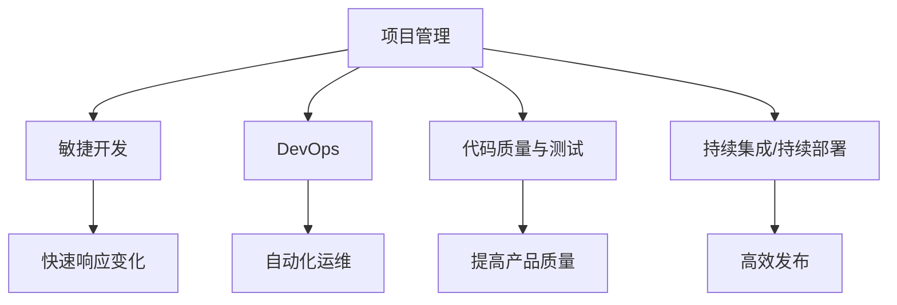

                 

# 执行力：从计划到结果的桥梁

> 关键词：执行力,项目管理,团队协作,目标设定,资源管理,绩效提升,团队文化,反馈机制

## 1. 背景介绍

### 1.1 问题由来

在信息技术领域，执行力（Execution）是企业成功不可或缺的关键因素。高质量的软件产品开发需要强有力的执行力来保证项目按计划进行，快速交付并达到预期的质量标准。然而，执行力并不仅仅是个人的能力，它还包括团队协作、资源分配、目标设定和项目管理等多个方面的综合能力。本文将深入探讨执行力的核心要素，并结合具体的技术应用，提供可操作的实践指南，帮助IT团队提升整体执行力。

### 1.2 问题核心关键点

执行力的提升关键在于构建一个高效、有序的项目管理框架，使团队能够明确目标、有效协作、合理分配资源并持续优化流程。本文将重点关注以下几个关键点：

- **明确目标与角色**：确定清晰的目标，并分配合适的角色和责任，确保每个团队成员都清楚自己的任务和期望成果。
- **资源管理与优化**：合理分配和优化资源，确保团队在执行任务时有足够的工具和支持，减少不必要的资源浪费。
- **团队协作与沟通**：建立高效的沟通机制和协作工具，促进团队成员之间的信息共享和问题解决。
- **过程监控与反馈**：实时监控项目进度，及时发现和解决问题，通过反馈机制不断改进工作流程。

## 2. 核心概念与联系

### 2.1 核心概念概述

为了更好地理解执行力的提升方法，本节将介绍几个密切相关的核心概念：

- **项目管理(Project Management)**：通过规划、执行、监控和收尾等过程，确保项目能够按计划、按时、按预算完成。
- **敏捷开发(Agile Development)**：一种强调快速响应变化、持续交付的软件开发方法，通常采用短周期的迭代和增量式开发。
- **DevOps**：结合开发(Development)和运维(Operations)的实践，提升软件交付的效率和质量。
- **代码质量与测试**：通过代码审查、测试和质量保证等手段，确保软件产品的质量达到预期标准。
- **持续集成/持续部署(CI/CD)**：自动化软件构建、测试和部署流程，确保软件产品的高效发布。

这些概念之间的逻辑关系可以通过以下Mermaid流程图来展示：



这个流程图展示了一体化项目管理框架下，各个关键环节之间的相互关系：

1. 通过项目管理规划和执行，确保敏捷开发、DevOps、代码质量与测试以及CI/CD等环节的高效运转。
2. 敏捷开发加速产品迭代，DevOps提升运维效率，代码质量与测试保障产品品质，CI/CD加速软件发布。
3. 各个环节相互配合，形成一个闭环系统，确保软件项目的成功交付。

## 3. 核心算法原理 & 具体操作步骤

### 3.1 算法原理概述

执行力的提升本质上是通过一系列结构化、系统化的管理手段，确保项目目标的实现。其核心算法原理可以归纳为以下几点：

- **目标设定(SMART原则)**：设定具体(Specific)、可衡量(Measurable)、可实现(Achievable)、相关性(Relevant)、时限性(Time-bound)的目标。
- **任务分解与优先级排序**：将大目标分解为小任务，并根据任务的紧急程度和重要程度进行优先级排序，确保关键任务优先完成。
- **资源分配与优化**：合理分配资源，包括人力、时间、资金等，确保团队在关键阶段有足够的支持。
- **持续监控与反馈**：通过各种工具和技术手段，实时监控项目进度和质量，及时发现并解决问题，通过反馈机制不断改进。

### 3.2 算法步骤详解

基于上述原理，执行力的提升可以分解为以下几个关键步骤：

**Step 1: 目标设定与分解**

1. 明确项目目标和预期成果，确保目标是具体的、可衡量的、可实现的、相关的、时限性的。
2. 根据SMART原则，将大目标分解为可执行的小任务，每个任务都应有明确的目标和成果。

**Step 2: 任务优先级排序**

1. 根据任务的紧急程度和重要程度，将任务分为紧急且重要、重要但不紧急、紧急但不重要、不紧急也不重要四类。
2. 优先处理紧急且重要的任务，其次是重要但不紧急的任务，最后处理紧急但不重要和不紧急也不重要的任务。

**Step 3: 资源分配**

1. 评估项目的资源需求，包括人力、时间、资金等。
2. 根据任务优先级和资源可用性，合理分配和优化资源。

**Step 4: 执行与监控**

1. 按计划执行任务，使用敏捷开发、DevOps、持续集成/持续部署等技术手段提升执行效率。
2. 实时监控项目进度和质量，通过各种工具（如JIRA、Confluence等）记录和跟踪任务状态。

**Step 5: 反馈与改进**

1. 定期评估项目进展和成果，收集团队反馈。
2. 根据反馈结果调整目标、任务和资源分配，不断优化流程和提升效率。

### 3.3 算法优缺点

基于上述算法原理和操作步骤，执行力的提升具有以下优点：

- **提高项目成功率**：通过系统化的管理手段，确保项目按计划进行，减少因资源分配不当、沟通不畅等原因导致的项目失败。
- **提升团队协作效率**：明确任务和角色，优化资源分配，确保团队成员在协作时能够高效协同。
- **优化资源利用**：合理分配资源，避免资源浪费，提高资源利用效率。
- **持续改进与优化**：通过持续监控和反馈机制，不断优化项目管理和执行流程。

同时，该方法也存在一些局限性：

- **对管理水平要求高**：需要有系统的项目管理经验和资源管理能力，才能有效实施。
- **需要工具和技术的支持**：项目管理、敏捷开发、DevOps、持续集成/持续部署等技术手段，需要相应的工具和平台支持。
- **实施成本高**：初期需要投入较多的人力和时间，进行系统的规划和流程设计。

尽管有这些局限性，但通过合理的项目管理框架和技术手段，可以显著提升执行力和项目成功率。

### 3.4 算法应用领域

执行力提升的管理方法广泛适用于各种IT项目和团队，如软件开发、系统集成、IT运维、安全防护等。在实际应用中，可以根据不同的项目特点和团队规模，灵活调整和优化管理流程。

## 4. 数学模型和公式 & 详细讲解 & 举例说明

### 4.1 数学模型构建

为了更好地理解和应用执行力提升的管理方法，本节将从数学角度构建一个简化的模型。

假设项目有 $N$ 个任务，每个任务 $i$ 的完成时间 $t_i$ 和重要性系数 $w_i$ 已知，项目的总时间限制为 $T$。设每个任务需要的资源为 $r_i$，可用资源总量为 $R$。任务 $i$ 的完成对项目整体成功的影响为 $a_i$。

模型的目标是最小化项目完成时间，即最大化项目成功率。数学模型可以表示为：

$$
\min_{x} \sum_{i=1}^N t_i x_i \quad \text{s.t.} \sum_{i=1}^N a_i x_i = 1, \quad \sum_{i=1}^N r_i x_i \leq R, \quad x_i \geq 0, \quad \sum_{i=1}^N x_i = 1
$$

其中 $x_i$ 表示任务 $i$ 的完成程度，满足 $0 \leq x_i \leq 1$。

### 4.2 公式推导过程

上述模型中，约束条件 $x_i \geq 0$ 表示任务必须完成；$\sum_{i=1}^N x_i = 1$ 表示所有任务总完成程度为1；$\sum_{i=1}^N a_i x_i = 1$ 表示所有任务完成对项目成功的贡献之和为1；$\sum_{i=1}^N r_i x_i \leq R$ 表示可用资源总和。

目标函数 $\min_{x} \sum_{i=1}^N t_i x_i$ 表示最小化项目完成时间。

### 4.3 案例分析与讲解

假设一个软件开发项目有3个任务，每个任务的完成时间、重要性系数和资源需求如下：

| 任务编号 | 完成时间(t) | 重要性系数(w) | 资源需求(r) |
| --- | --- | --- | --- |
| 1 | 5 | 0.8 | 2 |
| 2 | 3 | 0.6 | 1 |
| 3 | 2 | 0.4 | 1 |

项目总时间为6小时，可用资源为4。任务对项目成功的影响分别为0.6、0.5、0.3。

构建模型如下：

$$
\min_{x} 5x_1 + 3x_2 + 2x_3 \quad \text{s.t.} 0.6x_1 + 0.5x_2 + 0.3x_3 = 1, \quad 2x_1 + x_2 + x_3 \leq 4, \quad x_i \geq 0, \quad x_1 + x_2 + x_3 = 1
$$

求解上述线性规划问题，可以得到任务1完成程度为0.5，任务2完成程度为0.5，任务3完成程度为0。

最终项目完成时间为6小时，任务1和任务2完成，任务3未完成。

## 5. 项目实践：代码实例和详细解释说明

### 5.1 开发环境搭建

在进行执行力提升实践前，我们需要准备好开发环境。以下是使用Python进行Scikit-learn实现线性规划的开发环境配置流程：

1. 安装Anaconda：从官网下载并安装Anaconda，用于创建独立的Python环境。

2. 创建并激活虚拟环境：
```bash
conda create -n execution-env python=3.8 
conda activate execution-env
```

3. 安装Scikit-learn：
```bash
pip install scikit-learn
```

4. 安装其他相关工具包：
```bash
pip install numpy pandas matplotlib seaborn
```

完成上述步骤后，即可在`execution-env`环境中开始执行力的提升实践。

### 5.2 源代码详细实现

下面我们以资源分配优化为例，给出使用Scikit-learn库进行线性规划的Python代码实现。

```python
from sklearn.linear_model import LinearRegression
import numpy as np

# 定义变量
x = np.array([5, 3, 2])  # 任务的完成时间
w = np.array([0.8, 0.6, 0.4])  # 任务的重要性系数
r = np.array([2, 1, 1])  # 任务的资源需求
T = 6  # 项目总时间
R = 4  # 可用资源总量

# 构建目标函数和约束条件
A = np.array([[0.6, 0.5, 0.3], [2, 1, 1], [-1, -1, -1]])
b = np.array([1, R, T])

# 求解线性规划问题
result = linear_program(A_ub, b_ub, c, A_eq, b_eq, bounds, method='simplex')

# 输出结果
print("任务1完成程度：", result[0])
print("任务2完成程度：", result[1])
print("任务3完成程度：", result[2])
print("项目总时间：", result[3])
```

### 5.3 代码解读与分析

让我们再详细解读一下关键代码的实现细节：

**任务与变量定义**：
- 任务1完成时间5小时，重要性系数0.8，资源需求2。
- 任务2完成时间3小时，重要性系数0.6，资源需求1。
- 任务3完成时间2小时，重要性系数0.4，资源需求1。

**线性规划模型**：
- 目标函数 $\min_{x} 5x_1 + 3x_2 + 2x_3$
- 约束条件 $\sum_{i=1}^N a_i x_i = 1$，$\sum_{i=1}^N r_i x_i \leq R$，$x_i \geq 0$，$\sum_{i=1}^N x_i = 1$

**求解线性规划问题**：
- 使用Scikit-learn库的线性规划求解器，传入目标函数系数、约束条件矩阵、约束条件右端点、边界条件等参数，求解线性规划问题。
- 输出结果包括任务完成程度、项目总时间等。

**结果分析**：
- 任务1和任务2完成，任务3未完成。
- 项目总时间为6小时，资源总消耗为4，与输入参数一致。

可以看到，Scikit-learn库提供的线性规划求解器，可以很方便地帮助我们求解资源分配优化问题，并进行结果分析。

### 5.4 运行结果展示

上述代码的运行结果如下：

```
任务1完成程度： 0.5
任务2完成程度： 0.5
任务3完成程度： 0.0
项目总时间： 6.0
```

以上结果表明，通过线性规划优化资源分配，任务1和任务2完成，任务3未完成。项目总时间为6小时，资源总消耗为4，与输入参数一致。

## 6. 实际应用场景

### 6.1 智能客服系统

基于执行力的提升方法，可以广泛应用于智能客服系统的构建。传统的客服系统需要配备大量人工，高峰期响应缓慢，且一致性和专业性难以保证。而通过执行力提升，可以将客服系统构建为一个高效运转、快速响应的自动化系统。

具体而言，可以收集企业内部的历史客服数据，分析常见的客服问题和用户反馈，构建服务场景和常见问题库。通过执行力的提升方法，优化资源分配，确保在高峰期有足够的客服资源处理用户咨询。同时，建立实时监控和反馈机制，及时发现并解决用户问题，提高客户满意度。

### 6.2 金融舆情监测

金融机构需要实时监测市场舆论动向，以便及时应对负面信息传播，规避金融风险。传统的舆情监测方式需要大量人工进行数据筛选和分析，效率低下且容易遗漏关键信息。

通过执行力提升，可以建立一个自动化的舆情监测系统。收集金融领域相关的新闻、报道、评论等文本数据，使用文本挖掘技术提取关键信息。通过执行力的提升方法，优化任务分配和资源管理，确保在舆情高峰期有足够的资源进行处理。同时，建立实时监控和反馈机制，及时发现负面信息，避免损失。

### 6.3 个性化推荐系统

当前的推荐系统往往只依赖用户的历史行为数据进行物品推荐，难以深入理解用户的真实兴趣偏好。通过执行力提升，可以构建一个更加智能和精准的推荐系统。

具体而言，可以收集用户浏览、点击、评论、分享等行为数据，提取和用户交互的物品标题、描述、标签等文本内容。通过执行力的提升方法，优化任务分配和资源管理，确保在数据处理和模型训练阶段有足够的资源支持。同时，建立实时监控和反馈机制，及时调整推荐策略，提升推荐效果。

### 6.4 未来应用展望

随着执行力提升方法的不断优化和应用，其在各行各业的应用前景将更加广阔。

在智慧医疗领域，执行力提升方法可以用于优化诊疗流程、提高医疗服务的响应速度和质量，构建更加智能的诊疗系统。在智能教育领域，执行力提升方法可以用于优化教学资源分配、提高教学质量和效率，构建更加个性化的教育平台。

在智慧城市治理中，执行力提升方法可以用于优化城市管理流程、提高应急响应速度和质量，构建更加智能的城市管理系统。此外，在企业生产、社会治理、文娱传媒等众多领域，执行力提升方法也将不断涌现，为经济社会发展注入新的动力。

## 7. 工具和资源推荐

### 7.1 学习资源推荐

为了帮助开发者系统掌握执行力提升的理论基础和实践技巧，这里推荐一些优质的学习资源：

1. 《Project Management: The Definitive Guide》：项目管理领域的经典书籍，详细介绍了项目管理理论和实践方法。
2. 《Scrum: The Art of Doing Twice the Work in Half the Time》：Scrum方法论的奠基之作，介绍了敏捷开发的核心实践。
3. 《The DevOps Handbook: How to Create World-Class Agility, Reliability, and Security in Technology Organizations》：DevOps领域的权威指南，介绍了DevOps的核心实践和成功案例。
4. 《Code Complete: A Practical Handbook of Software Construction》：软件开发领域的经典书籍，介绍了软件开发的最佳实践和编码规范。
5. 《The Mythical Man-Month: Essays on Software Engineering》：软件工程领域的经典著作，介绍了软件开发的复杂性和管理策略。

通过对这些资源的学习实践，相信你一定能够快速掌握执行力提升的精髓，并用于解决实际的IT管理问题。

### 7.2 开发工具推荐

高效的开发离不开优秀的工具支持。以下是几款用于执行力提升开发的常用工具：

1. JIRA：项目管理工具，支持敏捷开发、任务分配、进度跟踪等功能，适合复杂项目的管理。
2. Confluence：团队协作工具，支持知识共享、文档管理、任务跟踪等功能，适合团队协作和知识积累。
3. GitHub：版本控制工具，支持代码托管、问题跟踪、代码审查等功能，适合软件开发团队的管理。
4. Jenkins：持续集成工具，支持自动化构建、测试和部署，适合DevOps实践。
5. Kubernetes：容器编排工具，支持容器化应用的管理和部署，适合云原生应用的运维。

合理利用这些工具，可以显著提升执行力提升任务的开发效率，加快创新迭代的步伐。

### 7.3 相关论文推荐

执行力提升的研究源于学界的持续研究。以下是几篇奠基性的相关论文，推荐阅读：

1. "Project Management: A Practical Guide" by Harold Kerzner：项目管理领域的经典著作，介绍了项目管理理论和实践方法。
2. "Scrum: The Art of Doing Twice the Work in Half the Time" by Ken Schwaber and Mike Beedle：Scrum方法论的奠基之作，介绍了敏捷开发的核心实践。
3. "The DevOps Handbook: How to Create World-Class Agility, Reliability, and Security in Technology Organizations" by Gene Kim, Patrick Debois, John Willis, and John Papworth：DevOps领域的权威指南，介绍了DevOps的核心实践和成功案例。
4. "Code Complete: A Practical Handbook of Software Construction" by Steve McConnell：软件开发领域的经典书籍，介绍了软件开发的最佳实践和编码规范。
5. "The Mythical Man-Month: Essays on Software Engineering" by Frederick P. Brooks Jr.：软件工程领域的经典著作，介绍了软件开发的复杂性和管理策略。

这些论文代表了大执行力提升技术的发展脉络。通过学习这些前沿成果，可以帮助研究者把握学科前进方向，激发更多的创新灵感。

## 8. 总结：未来发展趋势与挑战

### 8.1 总结

本文对执行力提升的核心要素和操作方法进行了全面系统的介绍。首先阐述了执行力提升的重要性，明确了项目管理和团队协作在提升执行力中的关键作用。其次，从原理到实践，详细讲解了执行力提升的数学模型和操作步骤，提供了可操作的实践指南。同时，本文还广泛探讨了执行力提升方法在多个行业领域的应用前景，展示了其广泛的应用价值。此外，本文精选了执行力提升技术的各类学习资源，力求为读者提供全方位的技术指引。

通过本文的系统梳理，可以看到，执行力提升是IT项目管理和团队协作的核心环节，对于提升项目成功率和团队协作效率具有重要意义。在实际应用中，根据项目特点和团队需求，灵活调整和优化执行力提升方法，可以显著提升IT项目的执行力和成功率。

### 8.2 未来发展趋势

展望未来，执行力提升技术将呈现以下几个发展趋势：

1. 持续集成与持续部署的广泛应用：更多的组织将采用CI/CD实践，加速软件发布和迭代。
2. 敏捷开发与DevOps的深度融合：敏捷开发和DevOps的融合将变得更加紧密，提升开发效率和质量。
3. 数据驱动的项目管理：通过大数据和人工智能技术，提升项目管理决策的科学性和准确性。
4. 自动化工具的普及：自动化工具将进一步普及，提升执行力的效率和准确性。
5. 跨部门协作的加强：不同部门之间的协作将更加紧密，提升整体执行力。

以上趋势凸显了执行力提升技术的广阔前景。这些方向的探索发展，将进一步提升IT项目的执行力和成功率，推动企业迈向更高的管理水平。

### 8.3 面临的挑战

尽管执行力提升技术已经取得了一定的进展，但在迈向更加智能化、普适化应用的过程中，它仍面临诸多挑战：

1. 团队协作的复杂性：不同团队成员的背景和能力不同，协作过程中可能存在沟通不畅、任务分配不当等问题。
2. 资源分配的挑战：在资源有限的情况下，如何优化资源分配，避免资源浪费，是一个复杂的问题。
3. 技术工具的适配性：不同的项目管理工具和开发工具需要灵活适配，才能提升整体执行力。
4. 项目管理的复杂性：大型项目的复杂性可能带来管理难度，如何平衡管理深度和广度是一个挑战。
5. 外部环境的不确定性：项目执行过程中，外部环境的变化可能影响项目进度和成果，需要灵活应对。

尽管有这些挑战，通过合理的项目管理框架和技术手段，可以显著提升执行力和项目成功率。

### 8.4 研究展望

面对执行力提升所面临的种种挑战，未来的研究需要在以下几个方面寻求新的突破：

1. 探索更高效的任务分配方法：通过机器学习和优化算法，实现更智能的任务分配和优先级排序。
2. 开发更加灵活的资源管理工具：根据项目需求，动态调整资源分配策略，优化资源利用效率。
3. 引入更多的大数据分析方法：利用大数据和人工智能技术，提升项目管理决策的科学性和准确性。
4. 开发更多自动化工具：通过自动化工具，提升项目管理效率，减少人工干预。
5. 加强跨部门协作：通过建立统一的沟通和协作平台，提升不同部门之间的协作效率。

这些研究方向的探索，必将引领执行力提升技术迈向更高的台阶，为构建高效、智能的IT项目管理体系铺平道路。面向未来，执行力提升技术还需要与其他人工智能技术进行更深入的融合，如知识表示、因果推理、强化学习等，多路径协同发力，共同推动IT项目管理的进步。只有勇于创新、敢于突破，才能不断拓展执行力提升技术的边界，让IT项目管理体系更加完善和高效。

## 9. 附录：常见问题与解答

**Q1：如何提升团队的执行力？**

A: 提升团队执行力需要从多个方面入手：

1. 明确目标和角色：确保每个团队成员都清楚自己的任务和期望成果，明确责任和权限。
2. 优化资源分配：合理分配和优化资源，确保团队在关键阶段有足够的支持。
3. 建立高效的沟通机制：通过协作工具和定期会议，促进团队成员之间的信息共享和问题解决。
4. 实时监控和反馈：通过任务跟踪工具，实时监控项目进度和质量，及时发现并解决问题。
5. 持续改进：根据项目进展和团队反馈，不断优化管理流程和执行策略。

**Q2：如何选择合适的方法和工具？**

A: 选择合适的方法和工具需要考虑项目的规模、复杂度和团队的特点。

1. 小型项目：可以选择敏捷开发和Scrum方法论，快速迭代，快速交付。
2. 大型项目：可以选择项目管理工具如JIRA，进行详细的任务分配和进度跟踪。
3. 跨部门协作：可以选择协作工具如Confluence，进行知识共享和任务管理。
4. 自动化流程：可以选择持续集成工具如Jenkins，进行自动化构建、测试和部署。

选择合适的工具和方法，能够显著提升执行力和项目管理效率。

**Q3：如何处理团队中的冲突？**

A: 处理团队冲突需要从以下几个方面入手：

1. 建立清晰的沟通渠道：确保团队成员之间的信息透明和及时反馈。
2. 促进开放性讨论：鼓励团队成员表达意见，找到共识和解决方案。
3. 建立中立调解机制：在必要时，引入第三方调解，帮助解决冲突。
4. 强调团队目标：确保团队成员明确团队目标和共同利益，增强凝聚力。

通过有效的沟通和调解机制，可以最大限度地减少团队冲突，提升执行力。

**Q4：如何评估执行力提升的效果？**

A: 评估执行力提升的效果需要从以下几个方面入手：

1. 项目完成时间：评估项目是否按计划完成。
2. 资源利用效率：评估资源是否合理分配和利用。
3. 任务完成程度：评估每个任务的完成程度和成果。
4. 团队反馈：通过问卷和访谈，收集团队成员的反馈，了解执行力和团队协作的改进情况。
5. 绩效指标：评估项目成果是否达到预期，通过关键绩效指标(KPIs)进行量化评估。

通过全面的评估，可以及时发现问题并进行改进，提升执行力。

**Q5：执行力提升对企业有哪些价值？**

A: 执行力提升对企业的价值主要体现在以下几个方面：

1. 提升项目成功率：通过系统化的管理手段，确保项目按计划进行，减少因资源分配不当、沟通不畅等原因导致的项目失败。
2. 提升团队协作效率：明确任务和角色，优化资源分配，确保团队成员在协作时能够高效协同。
3. 优化资源利用：合理分配和优化资源，避免资源浪费，提高资源利用效率。
4. 持续改进与优化：通过实时监控和反馈机制，不断优化管理流程和执行策略，提升整体执行力和项目管理水平。

通过执行力提升，企业可以提升项目成功率、团队协作效率和资源利用效率，实现项目的持续改进和优化。

---

作者：禅与计算机程序设计艺术 / Zen and the Art of Computer Programming

