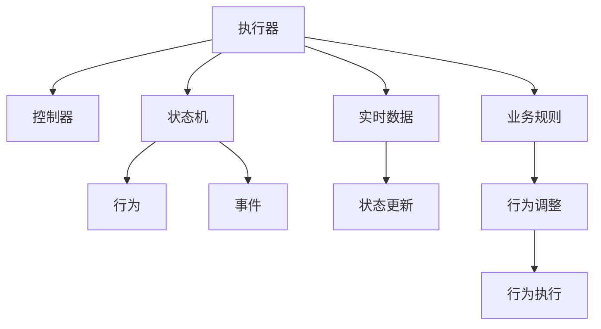

                 

# 执行器编程：控制设备行为

## 1. 背景介绍

### 1.1 问题由来

在现代工业生产中，自动化设备的应用越来越广泛。随着物联网和工业互联网的兴起，从生产线上的机器人到家用电器，各种设备都需要通过软件进行远程控制和优化管理。这些设备的控制通常涉及复杂的逻辑和实时响应，对编程的效率和可靠性提出了严峻挑战。因此，执行器编程技术应运而生，旨在提供一种高效、可靠的方式来管理和控制设备的自动化行为。

### 1.2 问题核心关键点

执行器编程的核心在于如何将复杂的设备行为抽象成可编程的形式，同时保证系统的高性能和稳定性。主要涉及以下几个关键点：

- **设备抽象与建模**：将复杂设备抽象为软件模型，定义设备的接口、状态和行为。
- **行为管理与调度**：根据实时数据和业务规则，动态调整设备的行为和状态。
- **状态监控与反馈**：实时监控设备状态，根据反馈调整行为，保证系统稳定运行。
- **异常处理与故障恢复**：在设备出现异常时，快速定位问题并恢复正常运行。

### 1.3 问题研究意义

研究执行器编程技术，对于提高工业自动化系统的效率、可靠性和灵活性具有重要意义：

- 提升生产效率。通过自动化控制，减少人工干预，提高生产线的自动化水平。
- 增强系统可靠性。实时监控和异常处理机制，保证设备在故障时能够快速恢复，避免停机损失。
- 提高系统灵活性。通过动态行为管理，设备可以根据环境变化进行自适应调整。
- 促进技术创新。执行器编程技术的发展，促进了工业自动化领域的创新和进步。

## 2. 核心概念与联系

### 2.1 核心概念概述

为了更好地理解执行器编程技术，本节将介绍几个密切相关的核心概念：

- **执行器(Actuator)**：执行器是控制系统中的关键组件，负责根据控制指令驱动设备执行特定行为。在软件层面，执行器抽象为可编程的接口，允许系统根据实时数据和规则调整行为。

- **控制器(Controller)**：控制器负责接收设备状态反馈，根据预设的逻辑和规则，调整执行器的行为。常见的控制器包括PID控制器、模型预测控制器等。

- **状态机(State Machine)**：状态机是一种编程模型，用于描述系统的状态和行为转换。通过状态机，设备能够根据当前状态和输入数据，动态调整行为。

- **行为(Actions)**：行为是设备执行的特定动作，如启动、停止、速度调整等。行为定义了设备的状态转换规则。

- **事件(Events)**：事件是触发行为的状态变化，如传感器数据变化、定时器到期等。事件是行为调整的主要触发机制。

这些核心概念之间的逻辑关系可以通过以下Mermaid流程图来展示：



这个流程图展示了一些关键概念及其之间的关系：

1. 执行器通过控制器接收命令和调整行为。
2. 状态机定义了设备的行为转换逻辑。
3. 行为根据事件触发，调整设备状态。
4. 实时数据和业务规则共同影响行为调整。
5. 行为执行过程中，状态不断更新。

## 3. 核心算法原理 & 具体操作步骤

### 3.1 算法原理概述

执行器编程的核心算法原理包括以下几个方面：

- **设备抽象与建模**：通过抽象设备的状态和行为，将设备模型化为一组接口和状态机。
- **行为管理与调度**：根据实时数据和业务规则，动态调整设备的行为。
- **状态监控与反馈**：实时监控设备状态，根据反馈调整行为。
- **异常处理与故障恢复**：在设备出现异常时，快速定位问题并恢复正常运行。

### 3.2 算法步骤详解

执行器编程的算法步骤如下：

**Step 1: 设备抽象与建模**

1. 定义设备的状态和行为：列出设备的所有可能状态和行为，以及状态之间的转换逻辑。
2. 抽象设备的接口：定义设备的输入和输出接口，确保接口简洁、可扩展。
3. 设计状态机：根据状态和行为，设计状态机模型，定义状态之间的转移条件和转移事件。

**Step 2: 行为管理与调度**

1. 编写行为函数：根据行为定义，编写相应的函数或方法，实现具体行为逻辑。
2. 调度行为执行：根据事件触发条件，调用行为函数，执行设备行为。
3. 处理实时数据：将实时传感器数据和业务规则作为输入，动态调整行为执行逻辑。

**Step 3: 状态监控与反馈**

1. 实时数据采集：通过传感器或通信协议，采集设备的实时状态数据。
2. 状态更新与监控：根据设备状态数据，更新状态机状态，并监控状态变化。
3. 反馈与调整：根据状态监控结果，调整行为函数参数，保证设备稳定运行。

**Step 4: 异常处理与故障恢复**

1. 监控异常事件：定义设备异常事件的监控规则，及时发现异常。
2. 异常定位与处理：根据异常事件，定位问题所在，并采取相应措施。
3. 故障恢复与重试：在异常处理后，确保设备能够快速恢复到正常运行状态。

### 3.3 算法优缺点

执行器编程技术的优点：

- **高效灵活**：设备抽象和状态机设计，使系统能够灵活应对复杂设备行为。
- **高可靠性**：实时数据和反馈机制，保证系统在异常情况下的快速恢复。
- **可扩展性强**：接口设计简洁，便于后续扩展和维护。
- **易于理解和调试**：状态机模型使系统行为逻辑易于理解和调试。

执行器编程技术的缺点：

- **抽象复杂**：设备抽象和状态机设计可能过于复杂，难以实现。
- **实现难度高**：行为函数和实时监控的实现，需要高水平的编程技能。
- **性能瓶颈**：实时数据处理和高频率行为调度可能影响系统性能。
- **依赖硬件**：设备状态和行为调度依赖于硬件传感器和通信协议，可能受限于硬件性能。

### 3.4 算法应用领域

执行器编程技术广泛应用于各种自动化设备和控制系统，例如：

- **工业生产**：自动化生产线上的机器人、传送带、加工设备等。
- **家用电器**：智能冰箱、洗衣机、空调等。
- **医疗设备**：呼吸机、输液泵、手术机器人等。
- **智能交通**：交通信号灯、智能车辆、无人机等。
- **智慧城市**：智能路灯、环境监测设备、智能家居等。

除了这些典型应用外，执行器编程技术还在农业自动化、物流管理、能源管理等领域得到了广泛应用。随着工业互联网和物联网的不断发展，执行器编程技术将进一步拓展其应用边界，为更多领域的自动化控制提供有力支持。

## 4. 数学模型和公式 & 详细讲解 & 举例说明

### 4.1 数学模型构建

在执行器编程中，我们可以使用有限状态机模型来描述设备的控制逻辑。有限状态机由一组状态集合、一组转移规则和一组转移事件组成。状态和行为之间的对应关系可以通过行为函数来实现。

假设有 $n$ 个状态 $S=\{s_1, s_2, ..., s_n\}$，每个状态对应一组行为 $A=\{a_1, a_2, ..., a_n\}$。状态之间的转移规则由条件 $C$ 和转移函数 $T$ 定义：

$$
T: S \times C \rightarrow S
$$

状态机的工作流程可以表示为：

1. 初始状态 $s_0$ 启动。
2. 实时传感器数据 $d_t$ 输入。
3. 根据条件 $C$ 判断是否发生状态转移。
4. 根据转移函数 $T$ 更新状态，并执行对应行为 $a_t$。
5. 返回步骤2，持续监控和更新状态。

### 4.2 公式推导过程

以下我们以一个简单的状态机为例，推导其数学模型：

假设有三个状态 $s_1, s_2, s_3$，每个状态对应一个行为 $a_1, a_2, a_3$。状态转移规则为：

- 从 $s_1$ 转移到 $s_2$ 的条件是传感器数据 $d_t > 10$。
- 从 $s_2$ 转移到 $s_3$ 的条件是传感器数据 $d_t < 5$。

其数学模型可以表示为：

$$
T: S \times C \rightarrow S
$$

具体来说，状态机的工作流程可以表示为：

1. 初始状态 $s_0$ 启动。
2. 实时传感器数据 $d_t$ 输入。
3. 判断 $d_t > 10$ 是否满足转移条件。
4. 如果满足，状态转移为 $s_2$，执行行为 $a_2$。
5. 如果 $d_t < 5$ 满足转移条件，状态转移为 $s_3$，执行行为 $a_3$。
6. 返回步骤2，持续监控和更新状态。

### 4.3 案例分析与讲解

考虑一个智能家居系统中的智能灯泡控制：

- 状态集合 $S = \{关闭, 开启, 亮度调节\}$
- 行为集合 $A = \{关闭, 开启, 亮度调节\}$
- 转移规则 $C = \{传感器数据, 用户指令\}$
- 转移函数 $T = \{关闭 -> 开启, 开启 -> 关闭, 关闭 -> 亮度调节\}$

假设用户通过手机APP发送指令，请求开启灯泡。根据状态机模型，灯泡的行为执行流程如下：

1. 初始状态 $s_0 = 关闭$。
2. 用户指令 $d_t = "开启"$
3. 判断 $d_t = "开启" \in C$ 是否满足转移条件。
4. 状态转移为 $s_1 = 开启$，执行行为 $a_1 = "开启"$
5. 灯泡开启，状态进入 $s_1$。
6. 用户再次请求调节亮度，传感器数据 $d_t = "亮度调节"$
7. 判断 $d_t = "亮度调节" \in C$ 是否满足转移条件。
8. 状态转移为 $s_2 = 亮度调节$，执行行为 $a_2 = "亮度调节"$
9. 灯泡亮度调节，状态进入 $s_2$
10. 返回步骤2，持续监控和更新状态。

通过以上案例，可以看出执行器编程技术的强大灵活性，能够通过状态机模型实现复杂设备行为的自动化控制。

## 5. 项目实践：代码实例和详细解释说明

### 5.1 开发环境搭建

在进行执行器编程实践前，我们需要准备好开发环境。以下是使用Python进行开发的环境配置流程：

1. 安装Anaconda：从官网下载并安装Anaconda，用于创建独立的Python环境。

2. 创建并激活虚拟环境：
```bash
conda create -n actuator-env python=3.8 
conda activate actuator-env
```

3. 安装Python库：
```bash
pip install numpy pandas scikit-learn matplotlib
```

4. 安装设备通信协议库：
```bash
pip install pymqtt pyserial
```

完成上述步骤后，即可在`actuator-env`环境中开始执行器编程实践。

### 5.2 源代码详细实现

下面我们以智能灯泡控制为例，给出使用Python进行执行器编程的代码实现。

```python
from abc import ABC, abstractmethod
import time

class Actuator(ABC):
    def __init__(self):
        pass
    
    @abstractmethod
    def start(self):
        pass
    
    @abstractmethod
    def stop(self):
        pass
    
    @abstractmethod
    def adjust_brightness(self, value):
        pass
    
class SmartBulb(Actuator):
    def __init__(self):
        super().__init__()
        self._state = "关闭"
    
    def start(self):
        if self._state == "关闭":
            self._state = "开启"
            print("灯泡开启")
    
    def stop(self):
        if self._state == "开启":
            self._state = "关闭"
            print("灯泡关闭")
    
    def adjust_brightness(self, value):
        if self._state == "开启":
            print(f"灯泡亮度调整到 {value}")
    
class ControlSystem:
    def __init__(self):
        self._bulb = SmartBulb()
    
    def main(self):
        while True:
            input_str = input("请输入指令：")
            if input_str == "开启":
                self._bulb.start()
            elif input_str == "关闭":
                self._bulb.stop()
            elif input_str == "亮度调节":
                brightness_value = int(input("请输入亮度值："))
                self._bulb.adjust_brightness(brightness_value)
            else:
                print("未知指令")
    
if __name__ == "__main__":
    system = ControlSystem()
    system.main()
```

以上代码实现了智能灯泡的启动、停止和亮度调节功能。通过继承自抽象基类`Actuator`，我们可以方便地扩展其他设备的行为实现。

### 5.3 代码解读与分析

让我们再详细解读一下关键代码的实现细节：

**Actuator类**：
- `__init__`方法：初始化状态为关闭。
- `start`方法：根据状态，判断是否启动。
- `stop`方法：根据状态，判断是否停止。
- `adjust_brightness`方法：根据状态，调整亮度值。

**SmartBulb类**：
- `__init__`方法：继承自`Actuator`，初始化状态为关闭。
- `start`方法：状态转换并输出灯泡开启信息。
- `stop`方法：状态转换并输出灯泡关闭信息。
- `adjust_brightness`方法：状态转换并输出亮度调节信息。

**ControlSystem类**：
- `__init__`方法：创建智能灯泡对象。
- `main`方法：循环读取用户输入，根据指令调用对应方法。

通过以上代码，可以看出执行器编程的简单性和灵活性。开发者可以根据具体设备，继承并扩展`Actuator`类，实现复杂设备的自动化控制。

## 6. 实际应用场景

### 6.1 智能家居系统

执行器编程技术在智能家居系统中得到了广泛应用，能够实现各种设备的自动化控制。例如：

- **智能灯光控制**：通过状态机模型，实现灯光的自动调节、定时开关等。
- **智能温控系统**：根据室内温度和用户需求，动态调整空调或暖气。
- **智能安防系统**：通过传感器数据和监控规则，自动调整门窗、摄像头等设备。

通过执行器编程技术，智能家居系统能够实现更加便捷、智能化的生活方式，提升用户的生活体验。

### 6.2 工业生产线

执行器编程技术在工业生产线中的应用，能够实现生产设备的自动化控制。例如：

- **机器人控制**：通过状态机模型，实现机器人的路径规划、任务调度等。
- **设备监控与维护**：通过实时监控设备状态，及时发现和处理异常。
- **能源管理**：通过执行器编程技术，实现能源设备的自动化控制和优化。

执行器编程技术使工业生产线的自动化水平大幅提升，提高了生产效率和设备利用率。

### 6.3 医疗设备

执行器编程技术在医疗设备中的应用，能够实现设备的自动化控制和优化。例如：

- **呼吸机控制**：通过状态机模型，实现呼吸机的模式切换、参数调整等。
- **输液泵控制**：根据患者状态，动态调整输液速度和流量。
- **手术机器人控制**：通过状态机模型，实现手术机器人的动作协调和任务调度。

执行器编程技术使医疗设备的操作更加便捷、精准，提升了医疗服务的质量和效率。

### 6.4 未来应用展望

随着执行器编程技术的不断发展，未来的应用场景将更加广泛，例如：

- **智能交通**：通过状态机模型，实现交通信号灯、智能车辆、无人机等设备的自动化控制。
- **智慧城市**：通过执行器编程技术，实现智能路灯、环境监测设备、智能家居等设备的自动化控制和优化。
- **农业自动化**：通过执行器编程技术，实现农业机械、灌溉系统的自动化控制和优化。

未来，执行器编程技术将在更多领域得到应用，为各种设备提供更加灵活、可靠的自动化控制方案。

## 7. 工具和资源推荐

### 7.1 学习资源推荐

为了帮助开发者系统掌握执行器编程技术，这里推荐一些优质的学习资源：

1. 《执行器编程：控制设备行为》系列博文：由执行器编程领域专家撰写，深入浅出地介绍了执行器编程的核心概念、设计原则和实践技巧。

2. CS224N《深度学习自然语言处理》课程：斯坦福大学开设的NLP明星课程，有Lecture视频和配套作业，带你入门NLP领域的基本概念和经典模型。

3. 《执行器编程实践》书籍：介绍执行器编程技术的实际应用案例，涵盖智能家居、工业生产、医疗设备等多个领域。

4. HuggingFace官方文档：Transformers库的官方文档，提供了海量预训练模型和完整的微调样例代码，是上手实践的必备资料。

5. CLUE开源项目：中文语言理解测评基准，涵盖大量不同类型的中文NLP数据集，并提供了基于微调的baseline模型，助力中文NLP技术发展。

通过对这些资源的学习实践，相信你一定能够快速掌握执行器编程技术的精髓，并用于解决实际的设备控制问题。

### 7.2 开发工具推荐

高效的开发离不开优秀的工具支持。以下是几款用于执行器编程开发的常用工具：

1. Python：Python以其简洁易懂的语法和丰富的库支持，成为执行器编程的首选语言。
2. PyTorch：基于Python的开源深度学习框架，支持动态计算图和GPU加速，适合复杂计算任务。
3. TensorFlow：由Google主导开发的开源深度学习框架，生产部署方便，适合大规模工程应用。
4. ROS（Robot Operating System）：工业机器人领域常用的开源框架，提供强大的设备驱动和状态管理能力。
5. OPC UA（Open Platform Communications Unified Architecture）：工业自动化领域常用的通信协议，支持设备状态监控和数据交换。

合理利用这些工具，可以显著提升执行器编程任务的开发效率，加快创新迭代的步伐。

### 7.3 相关论文推荐

执行器编程技术的发展源于学界的持续研究。以下是几篇奠基性的相关论文，推荐阅读：

1. "State Machines for Software Engineering"（软件工程中的状态机）：介绍状态机模型在软件工程中的应用，提供系统设计和开发的指导。
2. "The Design of Software Architectures"（软件架构设计）：研究软件架构的通用设计原则，包括状态机模型和执行器设计。
3. "Control Theory for Automated Systems"（自动系统控制理论）：研究自动控制系统的理论基础和设计方法，为执行器编程提供理论支持。
4. "Real-Time Systems"（实时系统）：研究实时系统的时间约束和优化技术，为执行器编程中的实时响应提供理论指导。

这些论文代表了大执行器编程技术的发展脉络。通过学习这些前沿成果，可以帮助研究者把握学科前进方向，激发更多的创新灵感。

## 8. 总结：未来发展趋势与挑战

### 8.1 总结

本文对执行器编程技术进行了全面系统的介绍。首先阐述了执行器编程技术的研究背景和意义，明确了设备抽象与建模、行为管理与调度、状态监控与反馈、异常处理与故障恢复等关键技术点。其次，从原理到实践，详细讲解了执行器编程的数学模型和操作步骤，给出了执行器编程任务开发的完整代码实例。同时，本文还广泛探讨了执行器编程技术在智能家居、工业生产、医疗设备等多个领域的应用前景，展示了执行器编程技术的广阔应用空间。

通过本文的系统梳理，可以看出执行器编程技术正在成为自动化控制领域的重要范式，极大地提升了设备控制的效率、可靠性和灵活性。未来，伴随执行器编程技术的不断演进，自动化控制系统将迎来更多创新和突破，为各种设备提供更加灵活、可靠的自动化控制方案。

### 8.2 未来发展趋势

展望未来，执行器编程技术将呈现以下几个发展趋势：

1. **设备抽象与建模的自动化**：通过AI技术和自动化工具，自动生成设备抽象模型，减少人工工作量。
2. **行为管理与调度的优化**：引入机器学习和优化算法，动态调整设备行为，提升系统性能和效率。
3. **状态监控与反馈的实时化**：通过大数据和实时计算技术，实现状态监控和反馈的实时化，提升系统稳定性和响应速度。
4. **异常处理与故障恢复的智能化**：引入故障诊断和预测技术，实现故障的智能化定位和恢复。
5. **跨设备协同控制**：通过工业互联网和物联网技术，实现设备间的协同控制和优化。
6. **多模态设备的融合**：将视觉、听觉、触觉等多模态信息融合到设备控制中，提升系统感知和决策能力。

这些趋势将推动执行器编程技术向更加智能化、自动化、实时化的方向发展，为工业互联网和智慧城市等领域提供更加强大、灵活的控制方案。

### 8.3 面临的挑战

尽管执行器编程技术已经取得了一定的进展，但在迈向更加智能化、普适化应用的过程中，它仍面临着诸多挑战：

1. **设备异构性**：不同设备具有不同的接口和行为，实现设备抽象和建模的复杂度较高。
2. **实时性要求高**：实时数据处理和高频率行为调度对系统性能要求较高。
3. **状态监控难度大**：设备状态和行为复杂多样，状态监控的实现难度较大。
4. **异常处理复杂**：异常情况的定位和处理需要高度的领域知识和经验。
5. **跨领域协同**：跨领域设备协同控制需要统一的标准和规范。

正视执行器编程面临的这些挑战，积极应对并寻求突破，将使执行器编程技术不断完善和成熟，为自动化控制系统的未来发展奠定坚实基础。

### 8.4 研究展望

面对执行器编程技术所面临的种种挑战，未来的研究需要在以下几个方面寻求新的突破：

1. **设备抽象与建模的自动化**：研究自动化工具和AI技术，自动生成设备抽象模型，减少人工工作量。
2. **行为管理与调度的优化**：引入机器学习和优化算法，动态调整设备行为，提升系统性能和效率。
3. **状态监控与反馈的实时化**：研究实时计算和大数据技术，实现状态监控和反馈的实时化，提升系统稳定性和响应速度。
4. **异常处理与故障恢复的智能化**：引入故障诊断和预测技术，实现故障的智能化定位和恢复。
5. **跨设备协同控制**：研究跨领域设备协同控制的标准和规范，实现设备的统一管理和优化。
6. **多模态设备的融合**：研究多模态设备的信息融合技术，提升系统的感知和决策能力。

这些研究方向的探索，将推动执行器编程技术向更加智能化、自动化、实时化的方向发展，为工业互联网和智慧城市等领域提供更加强大、灵活的控制方案。通过不断的技术创新和工程实践，执行器编程技术必将在更多领域得到应用，为各种设备提供更加灵活、可靠的自动化控制方案。

## 9. 附录：常见问题与解答

**Q1：执行器编程是否适用于所有自动化设备？**

A: 执行器编程技术适用于各种自动化设备，特别是需要复杂逻辑控制的设备。但对于一些简单的设备，如机械开关等，可能不适合执行器编程技术。

**Q2：执行器编程如何处理设备的异常情况？**

A: 执行器编程系统通过状态机模型来监控设备状态，当设备出现异常时，状态机会根据预设的规则和策略进行状态转移和行为调整，确保设备能够快速恢复。

**Q3：执行器编程如何保证实时性？**

A: 执行器编程系统通过优化算法和高效的数据处理机制，实现实时数据采集和行为调度，保证系统在高负载下的稳定性和响应速度。

**Q4：执行器编程在多设备协同控制中的应用有哪些？**

A: 执行器编程在多设备协同控制中的应用包括智能家居、智慧工厂、智能交通等多个领域。通过统一的标准和协议，实现设备间的协同控制和优化。

**Q5：执行器编程的未来发展方向是什么？**

A: 执行器编程的未来发展方向包括设备抽象与建模的自动化、行为管理与调度的优化、状态监控与反馈的实时化、异常处理与故障恢复的智能化、跨设备协同控制和多模态设备的融合。

通过以上分析，可以看出执行器编程技术具有广阔的应用前景和深入的研究价值，必将在未来自动化控制领域发挥重要作用。相信随着技术的不断发展，执行器编程技术将不断优化和完善，为自动化控制系统提供更加灵活、可靠的解决方案。

