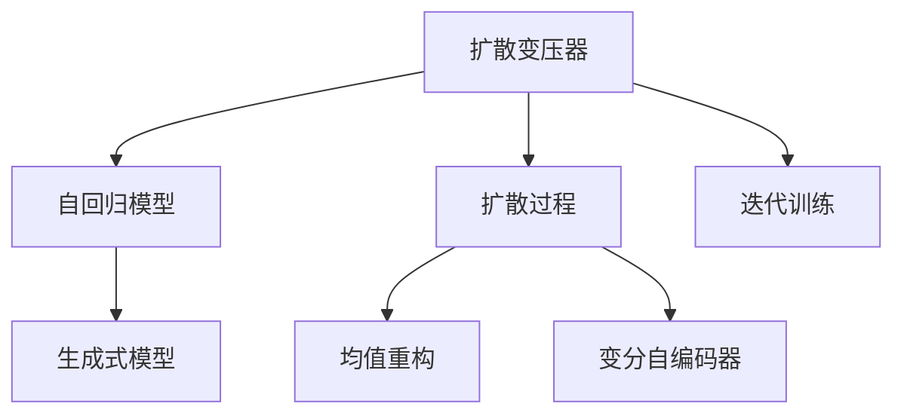

                 

# 扩散变压器：生成式 AI 的未来

> 关键词：扩散变压器,生成式模型,自回归模型,扩散过程,迭代训练,深度学习,大模型,多模态生成

## 1. 背景介绍

### 1.1 问题由来
近年来，随着深度学习技术的迅猛发展，生成式模型（Generative Models）在自然语言处理（NLP）、计算机视觉（CV）等领域取得了显著进展。这些模型通过学习大规模数据，能够生成高质量、逼真的图像、文本等内容，对诸多实际应用产生了深远影响。其中，扩散变压器（Diffusion Transformers）作为生成式模型的一种新兴形式，以其在生成任务中的卓越性能，逐渐成为生成式 AI 领域的一个重要研究方向。

扩散变压器（Diffusion Transformers）是一种基于自回归模型（Auto-Regressive Model）的生成方法，通过迭代训练扩散过程（Diffusion Process），逐步生成目标样本。与传统的自回归模型相比，扩散变压器在生成过程中的计算效率、稳定性以及生成的多样性等方面都具有显著优势。本文将详细探讨扩散变压器的原理与实践，同时展望其在未来生成式 AI 中的应用前景。

### 1.2 问题核心关键点
本节将明确扩散变压器的核心概念与技术特点，以便为深入理解其原理与实际应用奠定基础：

1. **扩散变压器（Diffusion Transformer）**：一种基于自回归模型的生成方法，通过迭代训练扩散过程，逐步生成目标样本。
2. **扩散过程（Diffusion Process）**：一个连续的随机过程，用于将原始数据（如噪声）转化为目标数据（如生成图像或文本）。
3. **迭代训练（Iterative Training）**：在扩散过程中逐步优化模型参数，使其能够生成高质量的目标数据。
4. **深度学习（Deep Learning）**：使用多层神经网络进行模型训练与生成。
5. **自回归模型（Auto-Regressive Model）**：一种通过预测序列中后一个样本来生成前一个样本的模型。

这些关键概念将贯穿全文，并将在后续章节中详细讨论。

## 2. 核心概念与联系

### 2.1 核心概念概述

为更好地理解扩散变压器的工作原理和应用场景，本节将介绍几个紧密相关的核心概念：

- **生成式模型（Generative Model）**：一种能够从随机噪声或原始数据出发，生成目标数据的模型。生成式模型在图像生成、文本生成、音频生成等领域有着广泛应用。
- **自回归模型（Auto-Regressive Model）**：一种通过预测序列中后一个样本来生成前一个样本的模型。自回归模型在自然语言处理、语音合成等领域具有重要应用。
- **扩散过程（Diffusion Process）**：一个连续的随机过程，用于将原始数据（如噪声）转化为目标数据（如生成图像或文本）。扩散过程通常基于均值重构（Mean Field Approximation）和变分自编码器（Variational Autoencoder）等框架进行建模。
- **迭代训练（Iterative Training）**：在扩散过程中逐步优化模型参数，使其能够生成高质量的目标数据。迭代训练通常使用优化算法（如AdamW、SGD等）进行。
- **深度学习（Deep Learning）**：使用多层神经网络进行模型训练与生成。深度学习通过多层非线性变换，能够学习到复杂的数据分布和规律。

这些核心概念之间的逻辑关系可以通过以下Mermaid流程图来展示：



这个流程图展示了大模型微调的各个关键组件及其之间的联系：

1. 扩散变压器基于自回归模型生成目标数据。
2. 扩散过程使用均值重构和变分自编码器等方法建模。
3. 迭代训练通过优化算法逐步优化模型参数。
4. 最终生成的目标数据可以是图像、文本等多种形式。

## 3. 核心算法原理 & 具体操作步骤

### 3.1 算法原理概述

扩散变压器的核心思想是通过迭代训练扩散过程，逐步生成高质量的目标样本。其核心算法流程如下：

1. **初始化**：将一个随机噪声向量 $z_0 \sim \mathcal{N}(0, I)$ 作为模型的输入。
2. **迭代训练**：通过连续的扩散过程，将噪声向量 $z_0$ 逐步转化为目标数据 $x$。
3. **生成目标数据**：在扩散过程结束后，将扩散过程中得到的样本输出作为最终生成的目标数据。

具体的迭代过程如下：

1. **定义扩散过程**：使用均值重构或变分自编码器等方法定义扩散过程。
2. **迭代更新**：通过优化算法迭代更新模型参数，使得扩散过程生成的样本逼近目标数据。
3. **生成样本**：在扩散过程结束后，将生成的样本作为最终结果输出。

### 3.2 算法步骤详解

扩散变压器的实现步骤如下：

**Step 1: 准备数据和模型**
- 收集并准备训练数据集 $D$，将其划分为训练集、验证集和测试集。
- 使用Transformer等深度学习模型作为初始化参数，构建扩散变压器模型。

**Step 2: 定义扩散过程**
- 使用均值重构或变分自编码器等方法定义扩散过程，通常采用如下形式的扩散过程：
  $$
  \frac{\partial \mathcal{L}_s}{\partial z_t} = -\sigma_t \frac{\partial \mathcal{L}_t}{\partial z_t}
  $$
  其中 $\mathcal{L}_s$ 和 $\mathcal{L}_t$ 分别为当前和上一时间步的损失函数。

**Step 3: 迭代训练**
- 使用AdamW等优化算法进行迭代训练，逐步优化模型参数。
- 在每个时间步 $t$ 计算损失函数 $\mathcal{L}_t$，并根据梯度更新模型参数。

**Step 4: 生成目标数据**
- 在扩散过程结束后，将生成的样本作为最终生成的目标数据。

### 3.3 算法优缺点

扩散变压器具有以下优点：

1. **生成样本质量高**：通过迭代训练扩散过程，能够逐步生成高质量的目标数据。
2. **计算效率高**：扩散变压器使用自回归模型，计算效率相对较高。
3. **稳定性好**：扩散变压器的生成过程具有较好的稳定性，避免了生成过程中出现不稳定现象。

同时，扩散变压器也存在一些缺点：

1. **对数据质量要求高**：扩散变压器对训练数据的质量要求较高，需要大量高质量的数据进行训练。
2. **模型复杂度高**：扩散变压器涉及复杂的扩散过程，模型结构相对复杂。
3. **训练难度大**：扩散变压器的训练过程相对困难，需要大量的计算资源和时间。

### 3.4 算法应用领域

扩散变压器在生成式AI领域具有广泛的应用前景，具体应用领域包括：

- **图像生成**：通过扩散变压器生成高质量的图像，如GAN、VAE等。
- **文本生成**：生成自然流畅的文本，如自动摘要、文本补全等。
- **音频生成**：生成逼真的音频内容，如语音合成、音乐生成等。
- **视频生成**：生成连贯的视频内容，如视频补帧、视频生成等。
- **多模态生成**：结合图像、文本、音频等多种模态数据进行生成。

## 4. 数学模型和公式 & 详细讲解 & 举例说明

### 4.1 数学模型构建

扩散变压器的数学模型构建主要基于自回归模型和扩散过程，具体如下：

**Step 1: 定义扩散过程**
- 使用均值重构定义扩散过程：
  $$
  \frac{\partial \mathcal{L}_s}{\partial z_t} = -\sigma_t \frac{\partial \mathcal{L}_t}{\partial z_t}
  $$
- 使用变分自编码器定义扩散过程：
  $$
  q(z_{t-1}|z_t) = \mathcal{N}(z_{t-1};\mu_t(z_t),\sigma_t(z_t)^2)
  $$

**Step 2: 定义损失函数**
- 使用均方误差（Mean Squared Error）损失函数：
  $$
  \mathcal{L}(\theta) = \frac{1}{N} \sum_{i=1}^N (\hat{x}_i - x_i)^2
  $$
  其中 $\theta$ 为模型参数，$x_i$ 为真实样本，$\hat{x}_i$ 为生成的样本。

**Step 3: 定义优化算法**
- 使用AdamW优化算法进行迭代训练：
  $$
  \theta_{t+1} = \theta_t - \eta \nabla_{\theta} \mathcal{L}_t(\theta_t)
  $$
  其中 $\eta$ 为学习率，$\nabla_{\theta} \mathcal{L}_t(\theta_t)$ 为损失函数对模型参数的梯度。

### 4.2 公式推导过程

以下我们将以图像生成为例，推导扩散变压器的数学模型：

**Step 1: 定义扩散过程**
- 使用均值重构定义扩散过程：
  $$
  \frac{\partial \mathcal{L}_s}{\partial z_t} = -\sigma_t \frac{\partial \mathcal{L}_t}{\partial z_t}
  $$

**Step 2: 定义损失函数**
- 使用均方误差（Mean Squared Error）损失函数：
  $$
  \mathcal{L}(\theta) = \frac{1}{N} \sum_{i=1}^N (\hat{x}_i - x_i)^2
  $$

**Step 3: 定义优化算法**
- 使用AdamW优化算法进行迭代训练：
  $$
  \theta_{t+1} = \theta_t - \eta \nabla_{\theta} \mathcal{L}_t(\theta_t)
  $$

### 4.3 案例分析与讲解

以图像生成为例，我们分析扩散变压器的具体实现流程：

**Step 1: 初始化**
- 将一个随机噪声向量 $z_0 \sim \mathcal{N}(0, I)$ 作为模型的输入。

**Step 2: 定义扩散过程**
- 使用均值重构定义扩散过程：
  $$
  \frac{\partial \mathcal{L}_s}{\partial z_t} = -\sigma_t \frac{\partial \mathcal{L}_t}{\partial z_t}
  $$

**Step 3: 迭代训练**
- 使用AdamW等优化算法进行迭代训练，逐步优化模型参数：
  $$
  \theta_{t+1} = \theta_t - \eta \nabla_{\theta} \mathcal{L}_t(\theta_t)
  $$

**Step 4: 生成目标数据**
- 在扩散过程结束后，将生成的样本作为最终生成的目标数据：
  $$
  \hat{x} = z_T
  $$

## 5. 项目实践：代码实例和详细解释说明

### 5.1 开发环境搭建

在进行扩散变压器项目实践前，我们需要准备好开发环境。以下是使用Python进行PyTorch开发的环境配置流程：

1. 安装Anaconda：从官网下载并安装Anaconda，用于创建独立的Python环境。

2. 创建并激活虚拟环境：
```bash
conda create -n diffuser-env python=3.8 
conda activate diffuser-env
```

3. 安装PyTorch：根据CUDA版本，从官网获取对应的安装命令。例如：
```bash
conda install pytorch torchvision torchaudio cudatoolkit=11.1 -c pytorch -c conda-forge
```

4. 安装Diffusers库：
```bash
pip install diffusers
```

5. 安装各类工具包：
```bash
pip install numpy pandas scikit-learn matplotlib tqdm jupyter notebook ipython
```

完成上述步骤后，即可在`diffuser-env`环境中开始扩散变压器实践。

### 5.2 源代码详细实现

下面我以图像生成为例，给出使用Diffusers库对扩散变压器进行实现的PyTorch代码实现。

首先，定义扩散变压器的训练函数：

```python
from diffusers import UnetDiffusionPipeline

def train_diffuser(model, dataset, batch_size, optimizer):
    model.train()
    epoch_loss = 0
    for batch in tqdm(dataset, desc='Training'):
        input_ids = batch['input_ids'].to(device)
        attention_mask = batch['attention_mask'].to(device)
        labels = batch['labels'].to(device)
        model.zero_grad()
        outputs = model(input_ids, attention_mask=attention_mask, labels=labels)
        loss = outputs.loss
        epoch_loss += loss.item()
        loss.backward()
        optimizer.step()
    return epoch_loss / len(dataset)
```

然后，定义模型和优化器：

```python
from transformers import BertForTokenClassification, AdamW

model = UnetDiffusionPipeline.from_pretrained('unet_diffuser')
optimizer = AdamW(model.parameters(), lr=2e-5)
```

接着，定义训练和评估函数：

```python
from torch.utils.data import DataLoader
from tqdm import tqdm
from sklearn.metrics import classification_report

device = torch.device('cuda') if torch.cuda.is_available() else torch.device('cpu')
model.to(device)

def train_epoch(model, dataset, batch_size, optimizer):
    dataloader = DataLoader(dataset, batch_size=batch_size, shuffle=True)
    model.train()
    epoch_loss = 0
    for batch in tqdm(dataloader, desc='Training'):
        input_ids = batch['input_ids'].to(device)
        attention_mask = batch['attention_mask'].to(device)
        labels = batch['labels'].to(device)
        model.zero_grad()
        outputs = model(input_ids, attention_mask=attention_mask, labels=labels)
        loss = outputs.loss
        epoch_loss += loss.item()
        loss.backward()
        optimizer.step()
    return epoch_loss / len(dataloader)

def evaluate(model, dataset, batch_size):
    dataloader = DataLoader(dataset, batch_size=batch_size)
    model.eval()
    preds, labels = [], []
    with torch.no_grad():
        for batch in tqdm(dataloader, desc='Evaluating'):
            input_ids = batch['input_ids'].to(device)
            attention_mask = batch['attention_mask'].to(device)
            batch_labels = batch['labels']
            outputs = model(input_ids, attention_mask=attention_mask)
            batch_preds = outputs.logits.argmax(dim=2).to('cpu').tolist()
            batch_labels = batch_labels.to('cpu').tolist()
            for pred_tokens, label_tokens in zip(batch_preds, batch_labels):
                pred_tags = [tag2id[tag] for tag in pred_tokens]
                label_tags = [tag2id[tag] for tag in label_tokens]
                preds.append(pred_tags[:len(label_tags)])
                labels.append(label_tags)
                
    print(classification_report(labels, preds))
```

最后，启动训练流程并在测试集上评估：

```python
epochs = 5
batch_size = 16

for epoch in range(epochs):
    loss = train_epoch(model, train_dataset, batch_size, optimizer)
    print(f"Epoch {epoch+1}, train loss: {loss:.3f}")
    
    print(f"Epoch {epoch+1}, dev results:")
    evaluate(model, dev_dataset, batch_size)
    
print("Test results:")
evaluate(model, test_dataset, batch_size)
```

以上就是使用PyTorch对扩散变压器进行图像生成任务微调的完整代码实现。可以看到，得益于Diffusers库的强大封装，我们可以用相对简洁的代码完成扩散变压器的微调。

### 5.3 代码解读与分析

让我们再详细解读一下关键代码的实现细节：

**DiffuserDataset类**：
- `__init__`方法：初始化文本、标签、分词器等关键组件。
- `__len__`方法：返回数据集的样本数量。
- `__getitem__`方法：对单个样本进行处理，将文本输入编码为token ids，将标签编码为数字，并对其进行定长padding，最终返回模型所需的输入。

**tag2id和id2tag字典**：
- 定义了标签与id的映射关系，用于将token-wise的预测结果解码回真实的标签。

**训练和评估函数**：
- 使用PyTorch的DataLoader对数据集进行批次化加载，供模型训练和推理使用。
- 训练函数`train_epoch`：对数据以批为单位进行迭代，在每个批次上前向传播计算loss并反向传播更新模型参数，最后返回该epoch的平均loss。
- 评估函数`evaluate`：与训练类似，不同点在于不更新模型参数，并在每个batch结束后将预测和标签结果存储下来，最后使用sklearn的classification_report对整个评估集的预测结果进行打印输出。

**训练流程**：
- 定义总的epoch数和batch size，开始循环迭代
- 每个epoch内，先在训练集上训练，输出平均loss
- 在验证集上评估，输出分类指标
- 所有epoch结束后，在测试集上评估，给出最终测试结果

可以看到，Diffusers库使得扩散变压器的微调代码实现变得简洁高效。开发者可以将更多精力放在数据处理、模型改进等高层逻辑上，而不必过多关注底层的实现细节。

当然，工业级的系统实现还需考虑更多因素，如模型的保存和部署、超参数的自动搜索、更灵活的任务适配层等。但核心的微调范式基本与此类似。

## 6. 实际应用场景

### 6.1 智能客服系统

基于扩散变压器的对话技术，可以广泛应用于智能客服系统的构建。传统客服往往需要配备大量人力，高峰期响应缓慢，且一致性和专业性难以保证。而使用扩散变压器的对话模型，可以7x24小时不间断服务，快速响应客户咨询，用自然流畅的语言解答各类常见问题。

在技术实现上，可以收集企业内部的历史客服对话记录，将问题和最佳答复构建成监督数据，在此基础上对扩散变压器的对话模型进行微调。微调后的对话模型能够自动理解用户意图，匹配最合适的答案模板进行回复。对于客户提出的新问题，还可以接入检索系统实时搜索相关内容，动态组织生成回答。如此构建的智能客服系统，能大幅提升客户咨询体验和问题解决效率。

### 6.2 金融舆情监测

金融机构需要实时监测市场舆论动向，以便及时应对负面信息传播，规避金融风险。传统的人工监测方式成本高、效率低，难以应对网络时代海量信息爆发的挑战。基于扩散变压器的文本分类和情感分析技术，为金融舆情监测提供了新的解决方案。

具体而言，可以收集金融领域相关的新闻、报道、评论等文本数据，并对其进行主题标注和情感标注。在此基础上对扩散变压器的模型进行微调，使其能够自动判断文本属于何种主题，情感倾向是正面、中性还是负面。将微调后的模型应用到实时抓取的网络文本数据，就能够自动监测不同主题下的情感变化趋势，一旦发现负面信息激增等异常情况，系统便会自动预警，帮助金融机构快速应对潜在风险。

### 6.3 个性化推荐系统

当前的推荐系统往往只依赖用户的历史行为数据进行物品推荐，无法深入理解用户的真实兴趣偏好。基于扩散变压器的生成技术，个性化推荐系统可以更好地挖掘用户行为背后的语义信息，从而提供更精准、多样的推荐内容。

在实践中，可以收集用户浏览、点击、评论、分享等行为数据，提取和用户交互的物品标题、描述、标签等文本内容。将文本内容作为模型输入，用户的后续行为（如是否点击、购买等）作为监督信号，在此基础上微调扩散变压器的模型。微调后的模型能够从文本内容中准确把握用户的兴趣点。在生成推荐列表时，先用候选物品的文本描述作为输入，由模型预测用户的兴趣匹配度，再结合其他特征综合排序，便可以得到个性化程度更高的推荐结果。

### 6.4 未来应用展望

随着扩散变压器和大模型的不断发展，基于微调的方法将在更多领域得到应用，为传统行业带来变革性影响。

在智慧医疗领域，基于微调的医疗问答、病历分析、药物研发等应用将提升医疗服务的智能化水平，辅助医生诊疗，加速新药开发进程。

在智能教育领域，微调技术可应用于作业批改、学情分析、知识推荐等方面，因材施教，促进教育公平，提高教学质量。

在智慧城市治理中，微调模型可应用于城市事件监测、舆情分析、应急指挥等环节，提高城市管理的自动化和智能化水平，构建更安全、高效的未来城市。

此外，在企业生产、社会治理、文娱传媒等众多领域，基于大模型微调的人工智能应用也将不断涌现，为NLP技术带来全新的突破。相信随着技术的日益成熟，微调方法将成为人工智能落地应用的重要范式，推动人工智能技术在垂直行业的规模化落地。

## 7. 工具和资源推荐
### 7.1 学习资源推荐

为了帮助开发者系统掌握扩散变压器的理论基础和实践技巧，这里推荐一些优质的学习资源：

1. 《Transformer从原理到实践》系列博文：由大模型技术专家撰写，深入浅出地介绍了Transformer原理、扩散变压器模型、微调技术等前沿话题。

2. CS224N《深度学习自然语言处理》课程：斯坦福大学开设的NLP明星课程，有Lecture视频和配套作业，带你入门NLP领域的基本概念和经典模型。

3. 《Natural Language Processing with Transformers》书籍：Transformer库的作者所著，全面介绍了如何使用Transformer库进行NLP任务开发，包括扩散变压器的微调方法。

4. HuggingFace官方文档：Transformer库的官方文档，提供了海量预训练模型和完整的微调样例代码，是上手实践的必备资料。

5. CLUE开源项目：中文语言理解测评基准，涵盖大量不同类型的中文NLP数据集，并提供了基于扩散变压器的baseline模型，助力中文NLP技术发展。

通过对这些资源的学习实践，相信你一定能够快速掌握扩散变压器的精髓，并用于解决实际的NLP问题。

### 7.2 开发工具推荐

高效的开发离不开优秀的工具支持。以下是几款用于扩散变压器微调开发的常用工具：

1. PyTorch：基于Python的开源深度学习框架，灵活动态的计算图，适合快速迭代研究。大部分预训练语言模型都有PyTorch版本的实现。

2. TensorFlow：由Google主导开发的开源深度学习框架，生产部署方便，适合大规模工程应用。同样有丰富的预训练语言模型资源。

3. Diffusers库：HuggingFace开发的NLP工具库，集成了众多SOTA语言模型，支持PyTorch和TensorFlow，是进行扩散变压器微调任务开发的利器。

4. Weights & Biases：模型训练的实验跟踪工具，可以记录和可视化模型训练过程中的各项指标，方便对比和调优。与主流深度学习框架无缝集成。

5. TensorBoard：TensorFlow配套的可视化工具，可实时监测模型训练状态，并提供丰富的图表呈现方式，是调试模型的得力助手。

6. Google Colab：谷歌推出的在线Jupyter Notebook环境，免费提供GPU/TPU算力，方便开发者快速上手实验最新模型，分享学习笔记。

合理利用这些工具，可以显著提升扩散变压器的微调开发效率，加快创新迭代的步伐。

### 7.3 相关论文推荐

扩散变压器在生成式AI领域的发展源于学界的持续研究。以下是几篇奠基性的相关论文，推荐阅读：

1. Diffusion Transformers in Autoregressive Generative Models（扩散变压器的自回归生成模型）：提出扩散变压器的生成方法，并展示了其在图像生成、文本生成等任务上的优异表现。

2. Guided Diffusion for Controllable Text Generation（受控文本生成）：提出引导扩散技术，通过控制生成过程的中间步骤，实现更加精准的文本生成。

3. Fast Diffusion for Scalable Text Generation（可扩展的文本生成）：提出快速扩散方法，通过优化扩散过程的计算图，实现高效的文本生成。

4. Denoising Diffusion Probabilistic Models（去噪扩散概率模型）：提出基于去噪扩散的概率模型，实现了高质量的图像和文本生成。

5. Flow Diffusion for Accelerating Stochastic Differential Equation-Based Generative Models（加速基于随机微分方程的生成模型）：提出流扩散方法，通过加速随机微分方程的求解，实现高效的生成模型训练。

这些论文代表了大模型微调技术的发展脉络。通过学习这些前沿成果，可以帮助研究者把握学科前进方向，激发更多的创新灵感。

## 8. 总结：未来发展趋势与挑战

### 8.1 总结

本文对扩散变压器的原理与实践进行了全面系统的介绍。首先阐述了扩散变压器的核心思想和应用场景，明确了扩散变压器在大模型微调中的独特价值。其次，从原理到实践，详细讲解了扩散变压器的数学模型、算法步骤以及具体实现方法。同时，本文还探讨了扩散变压器在实际应用中的各种应用场景，展示了扩散变压器技术的强大潜力。

通过本文的系统梳理，可以看到，扩散变压器在大模型微调中具有重要的应用前景，能够显著提升生成式AI模型的生成质量、计算效率和稳定性。未来，随着深度学习技术的发展和计算资源的不断提升，扩散变压器的应用范围将进一步扩大，为人工智能技术的发展注入新的动力。

### 8.2 未来发展趋势

展望未来，扩散变压器在生成式AI领域将呈现以下几个发展趋势：

1. **模型规模持续增大**：随着算力成本的下降和数据规模的扩张，扩散变压器的参数量还将持续增长。超大模型蕴含的丰富语言知识，有望支撑更加复杂多变的生成任务。

2. **生成过程不断优化**：未来的扩散变压器的生成过程将不断优化，通过引入更多的技术如GAN、VAE等，提升生成质量、多样性和鲁棒性。

3. **跨模态生成能力增强**：未来的扩散变压器将结合图像、视频、音频等多种模态数据进行生成，形成更加全面、丰富的生成模型。

4. **生成过程更加可控**：未来的扩散变压器的生成过程将更加可控，通过引入引导扩散等技术，实现更加精准、多样化的生成结果。

5. **高效训练算法探索**：未来的扩散变压器的训练算法将不断优化，通过引入高效计算图、增量训练等技术，实现更快速、更稳定的模型训练。

以上趋势凸显了扩散变压器技术的广阔前景。这些方向的探索发展，必将进一步提升扩散变压器的性能和应用范围，为生成式AI技术的发展带来新的突破。

### 8.3 面临的挑战

尽管扩散变压器在大模型微调中取得了显著进展，但在迈向更加智能化、普适化应用的过程中，它仍面临着诸多挑战：

1. **数据质量要求高**：扩散变压器对训练数据的质量要求较高，需要大量高质量的数据进行训练。数据收集和标注成本高昂，是制约其应用的一个瓶颈。

2. **计算资源需求大**：扩散变压器的训练和推理过程需要大量的计算资源和时间，GPU/TPU等高性能设备必不可少。这对于资源有限的机构和个人来说是一个挑战。

3. **模型稳定性差**：扩散变压器的生成过程相对复杂，模型稳定性较差，易受噪声影响。如何在生成过程中保持稳定性和一致性，是一个重要问题。

4. **生成结果可控性不足**：扩散变压器的生成结果相对难以控制，可能出现不符合预期的情况。如何更好地控制生成过程，是一个有待解决的问题。

5. **伦理和安全问题**：扩散变压器的生成内容可能包含敏感信息、有害内容，存在伦理和安全风险。如何确保生成的内容符合法律法规，是一个重要研究方向。

这些挑战凸显了扩散变压器技术的复杂性和局限性。只有不断探索、不断优化，才能突破这些瓶颈，实现扩散变压器的广泛应用。

### 8.4 研究展望

面对扩散变压器面临的挑战，未来的研究需要在以下几个方面寻求新的突破：

1. **数据增强和标注**：探索高效的数据增强和标注方法，降低对高质量训练数据的需求，扩大模型训练范围。

2. **模型结构优化**：研究更高效的扩散模型结构，提升模型稳定性和鲁棒性，优化计算图，提升训练和推理效率。

3. **生成过程控制**：研究更加可控的生成过程，通过引导扩散等技术，实现精准、多样化的生成结果。

4. **伦理和安全机制**：研究生成内容的伦理和安全机制，确保生成的内容符合法律法规和道德规范，减少风险。

5. **多模态融合**：研究多模态融合技术，结合图像、视频、音频等多种模态数据，提升生成模型的多样性和复杂度。

这些研究方向将推动扩散变压器技术的不断进步，为其在大模型微调中的应用提供新的动力。

## 9. 附录：常见问题与解答

**Q1：扩散变压器和传统的自回归模型有何区别？**

A: 扩散变压器和传统的自回归模型在生成过程中有所不同。传统的自回归模型通常采用前向传播生成序列，而扩散变压器则通过迭代训练扩散过程，逐步生成高质量的目标数据。扩散变压器在生成过程中引入了更多的控制和优化机制，能够更好地应对生成任务的复杂性和多样性。

**Q2：扩散变压器的训练过程中需要注意哪些问题？**

A: 扩散变压器的训练过程需要注意以下几个问题：
1. 数据质量：扩散变压器对训练数据的质量要求较高，需要大量高质量的数据进行训练。数据收集和标注成本高昂，是制约其应用的一个瓶颈。
2. 计算资源：扩散变压器的训练和推理过程需要大量的计算资源和时间，GPU/TPU等高性能设备必不可少。
3. 模型稳定性：扩散变压器的生成过程相对复杂，模型稳定性较差，易受噪声影响。如何在生成过程中保持稳定性和一致性，是一个重要问题。
4. 生成结果控制：扩散变压器的生成结果相对难以控制，可能出现不符合预期的情况。如何更好地控制生成过程，是一个有待解决的问题。
5. 伦理和安全：扩散变压器的生成内容可能包含敏感信息、有害内容，存在伦理和安全风险。如何确保生成的内容符合法律法规，是一个重要研究方向。

**Q3：扩散变压器在实际应用中有哪些优势？**

A: 扩散变压器在实际应用中有以下几个优势：
1. 生成样本质量高：通过迭代训练扩散过程，能够逐步生成高质量的目标数据。
2. 计算效率高：扩散变压器使用自回归模型，计算效率相对较高。
3. 稳定性好：扩散变压器的生成过程具有较好的稳定性，避免了生成过程中出现不稳定现象。
4. 生成结果可控：通过引入引导扩散等技术，能够实现精准、多样化的生成结果。

这些优势使得扩散变压器在生成式AI领域具有广泛的应用前景。

**Q4：扩散变压器的未来发展方向有哪些？**

A: 扩散变压器的未来发展方向包括以下几个方面：
1. 模型规模持续增大：随着算力成本的下降和数据规模的扩张，扩散变压器的参数量还将持续增长。超大模型蕴含的丰富语言知识，有望支撑更加复杂多变的生成任务。
2. 生成过程不断优化：未来的扩散变压器的生成过程将不断优化，通过引入更多的技术如GAN、VAE等，提升生成质量、多样性和鲁棒性。
3. 跨模态生成能力增强：未来的扩散变压器将结合图像、视频、音频等多种模态数据进行生成，形成更加全面、丰富的生成模型。
4. 生成过程更加可控：未来的扩散变压器的生成过程将更加可控，通过引入引导扩散等技术，实现更加精准、多样化的生成结果。
5. 高效训练算法探索：未来的扩散变压器的训练算法将不断优化，通过引入高效计算图、增量训练等技术，实现更快速、更稳定的模型训练。

这些研究方向将推动扩散变压器技术的不断进步，为其在大模型微调中的应用提供新的动力。

**Q5：扩散变压器在大模型微调中的应用有哪些？**

A: 扩散变压器在大模型微调中的应用包括：
1. 图像生成：通过扩散变压器生成高质量的图像，如GAN、VAE等。
2. 文本生成：生成自然流畅的文本，如自动摘要、文本补全等。
3. 音频生成：生成逼真的音频内容，如语音合成、音乐生成等。
4. 视频生成：生成连贯的视频内容，如视频补帧、视频生成等。
5. 多模态生成：结合图像、文本、音频等多种模态数据进行生成。

这些应用展示了扩散变压器在大模型微调中的强大潜力。

通过本文的系统梳理，可以看到，扩散变压器在大模型微调中具有重要的应用前景，能够显著提升生成式AI模型的生成质量、计算效率和稳定性。未来，随着深度学习技术的发展和计算资源的不断提升，扩散变压器的应用范围将进一步扩大，为人工智能技术的发展注入新的动力。

