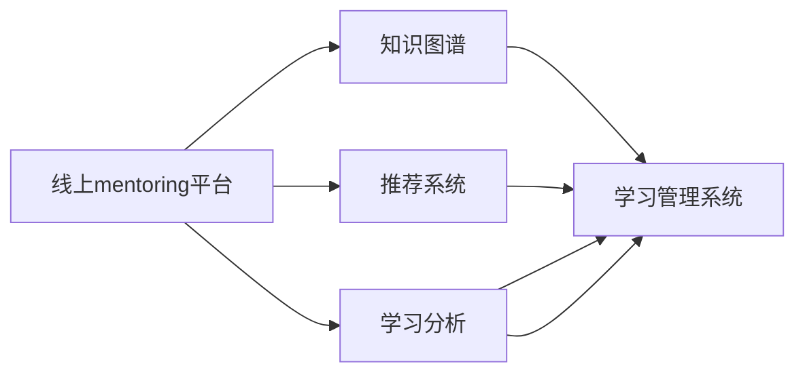

                 

# 技术mentoring：线上平台的搭建与运营

在当前技术快速迭代、人才需求日益增长的背景下，线上技术mentoring平台逐渐成为企业吸引、培养和留住优秀技术人才的重要手段。本文将从背景介绍、核心概念与联系、核心算法原理及具体操作步骤、数学模型和公式、项目实践、实际应用场景、工具和资源推荐、总结与未来发展趋势及挑战等多个方面，系统性地阐述线上技术mentoring平台的搭建与运营。

## 1. 背景介绍

### 1.1 问题由来

随着互联网和信息技术的普及，企业对技术人才的需求日益增长，同时，技术人员的培养成本和难度也在不断提升。传统的线下培训方式已难以满足企业快速迭代的需求。而线上mentoring平台利用互联网技术，提供灵活、便捷、高效的培训和交流平台，成为了解决这一问题的重要工具。

### 1.2 问题核心关键点

线上技术mentoring平台的核心在于如何通过技术手段，实现专家与学习者之间的有效沟通、知识传递和经验共享。其关键点包括：
1. **灵活的互动形式**：支持文本、语音、视频等多种沟通方式，满足不同情境下的互动需求。
2. **高效的知识传递**：通过课程录制、实时演示、代码共享等方式，高效传递知识。
3. **便捷的反馈机制**：建立及时的互动和反馈系统，快速解决学习者的问题，提升学习效果。
4. **可持续的成长路径**：提供系统的学习路径和进阶课程，帮助学习者持续成长。

### 1.3 问题研究意义

构建线上技术mentoring平台，对于企业和技术人才均有重要意义：
1. **提升企业竞争力**：通过系统化、专业化的培训，提升团队的技术水平，增强企业竞争力。
2. **培养技术人才**：为技术人才提供高效的学习途径，加速其技能提升，实现自我价值。
3. **降低培训成本**：线上平台能够节省培训时间和成本，同时，通过技术手段实现知识的自动化传递，进一步降低人工成本。
4. **促进知识共享**：打破物理空间的限制，构建更加开放、共享的知识社区，促进技术知识的广泛传播。

## 2. 核心概念与联系

### 2.1 核心概念概述

为更好地理解线上技术mentoring平台的搭建与运营，本节将介绍几个关键概念及其相互联系：

- **线上mentoring平台**：利用互联网技术搭建的，支持远程教学和交流的平台。
- **知识图谱**：构建知识体系，映射知识间的关系，便于高效搜索和传递。
- **推荐系统**：通过分析学习者的历史行为数据，推荐个性化的课程和学习路径。
- **学习分析**：通过学习者行为数据的分析，评估学习效果，指导课程改进和个性化推荐。
- **学习管理系统(LMS)**：提供课程管理、学习跟踪、进度评估等功能，支持线上学习。

这些核心概念之间通过数据流和控制流紧密联系，共同构成线上技术mentoring平台的完整架构。

### 2.2 核心概念原理和架构的 Mermaid 流程图



这个流程图展示了线上mentoring平台的核心架构和数据流向：

1. 学习者通过学习管理系统(E)进入课程学习。
2. 平台从知识图谱(B)获取相关课程知识，通过推荐系统(C)推送个性化课程。
3. 学习管理系统(E)收集学习者的行为数据，输入学习分析(D)进行评估。
4. 学习分析(D)根据评估结果，指导课程改进和个性化推荐，反馈至学习管理系统(E)。

## 3. 核心算法原理 & 具体操作步骤

### 3.1 算法原理概述

线上技术mentoring平台的搭建与运营，主要基于数据驱动的个性化推荐和自适应学习算法。其核心算法包括知识图谱构建、推荐系统、学习分析等。

1. **知识图谱构建**：通过爬虫技术获取开源文档、论文、技术博客等资源，构建知识图谱，实现知识间的关联和映射。
2. **推荐系统算法**：基于协同过滤、内容推荐、深度学习等技术，构建推荐模型，推荐个性化的课程和学习路径。
3. **学习分析算法**：通过学习者行为数据的分析，构建预测模型，评估学习效果，指导课程改进和个性化推荐。

### 3.2 算法步骤详解

#### 3.2.1 知识图谱构建

1. **数据收集**：使用爬虫技术从开源文档、论文、技术博客等资源中提取知识点。
2. **实体识别**：对提取的知识点进行实体识别，提取关键名词、概念等。
3. **关系抽取**：通过自然语言处理技术，识别知识点间的关系，构建实体-关系图谱。
4. **图谱优化**：对构建的实体关系图谱进行优化，消除冗余和错误信息。

#### 3.2.2 推荐系统

1. **用户画像构建**：通过学习者的历史行为数据，构建用户画像，描述其兴趣和偏好。
2. **课程匹配**：根据用户画像，从知识图谱中选择相关课程，进行匹配。
3. **推荐模型训练**：基于协同过滤、内容推荐、深度学习等技术，训练推荐模型，评估推荐效果。
4. **推荐结果输出**：根据模型评估结果，输出个性化的课程推荐。

#### 3.2.3 学习分析

1. **行为数据收集**：收集学习者的学习行为数据，包括课程观看时间、学习进度、考试成绩等。
2. **数据清洗与预处理**：对收集到的行为数据进行清洗和预处理，确保数据质量。
3. **学习效果评估**：通过机器学习模型，对学习者的学习效果进行评估，生成评估报告。
4. **改进建议生成**：根据评估报告，生成改进建议，指导课程优化和个性化推荐。

### 3.3 算法优缺点

线上技术mentoring平台的搭建与运营算法主要具有以下优点：
1. **个性化推荐**：通过个性化推荐系统，提高学习者的学习效率和兴趣。
2. **自适应学习**：通过学习分析，实现课程和内容的自适应调整，满足不同学习者的需求。
3. **数据驱动**：基于数据驱动的方法，能够及时发现和解决问题，提高平台的用户满意度。

同时，该方法也存在一些缺点：
1. **数据隐私**：学习者的行为数据涉及个人隐私，需要严格保护。
2. **推荐偏差**：推荐系统可能会因数据偏差或算法问题，导致推荐结果的不公正。
3. **学习效果评估难度**：学习效果的评估需要综合多种因素，难度较大。
4. **知识图谱构建复杂**：知识图谱的构建需要大量的人工干预和专家知识，成本较高。

### 3.4 算法应用领域

线上技术mentoring平台的算法和技术，已经在教育、企业培训、技术交流等多个领域得到了广泛应用：

1. **在线教育**：通过个性化推荐和自适应学习，提供高效、灵活的在线学习体验。
2. **企业培训**：帮助企业构建系统化的培训体系，提升员工的技术水平和职业素养。
3. **技术交流**：搭建技术社区，促进技术知识的交流和分享，加速技术创新。
4. **远程学习**：支持远程学习，打破物理空间限制，实现全球范围内的知识共享。

## 4. 数学模型和公式 & 详细讲解 & 举例说明

### 4.1 数学模型构建

本节将使用数学语言对线上技术mentoring平台的搭建与运营过程进行严格刻画。

记平台用户为 $U=\{u_1, u_2, \cdots, u_n\}$，课程为 $C=\{c_1, c_2, \cdots, c_m\}$，知识点为 $K=\{k_1, k_2, \cdots, k_p\}$。用户对课程的评分矩阵为 $R \in \mathbb{R}^{n \times m}$，用户对知识点的评分矩阵为 $S \in \mathbb{R}^{n \times p}$。

### 4.2 公式推导过程

以推荐系统为例，基于协同过滤的推荐公式为：

$$
\hat{r}_{ui} = \frac{\sum_{v=1}^{m} r_{vi} \cdot p_{uv}}{\sqrt{\sum_{v=1}^{m} r_{vi}^2} \cdot \sqrt{\sum_{v=1}^{m} p_{uv}^2}}
$$

其中 $r_{vi}$ 表示用户 $u$ 对课程 $v$ 的评分，$p_{uv}$ 表示用户 $u$ 对课程 $v$ 的兴趣度，$\hat{r}_{ui}$ 表示用户 $u$ 对课程 $i$ 的预测评分。

通过优化上述公式，可以实现课程的个性化推荐。在实际应用中，还需要引入更多的用户画像特征、课程特征等，以提高推荐准确性。

### 4.3 案例分析与讲解

以在线教育平台为例，平台的推荐系统可以使用基于协同过滤的算法。设用户 $u_i$ 对课程 $c_j$ 的评分矩阵为 $R$，课程 $c_j$ 的知识图谱为 $K_j$，用户 $u_i$ 的用户画像为 $P_i$。

根据协同过滤算法，用户 $u_i$ 对课程 $c_j$ 的预测评分 $r'_{ij}$ 可以通过以下公式计算：

$$
r'_{ij} = \frac{\sum_{k=1}^{p} R_{ik} \cdot S_{jk}}{\sqrt{\sum_{k=1}^{p} R_{ik}^2} \cdot \sqrt{\sum_{k=1}^{p} S_{jk}^2}}
$$

其中 $R_{ik}$ 表示用户 $u_i$ 对知识点 $k$ 的评分，$S_{jk}$ 表示课程 $c_j$ 对知识点 $k$ 的评分权重。通过不断迭代优化上述公式，可以实现用户对课程的精准推荐。

## 5. 项目实践：代码实例和详细解释说明

### 5.1 开发环境搭建

在进行线上mentoring平台的开发前，我们需要准备好开发环境。以下是使用Python进行PyTorch开发的环境配置流程：

1. 安装Anaconda：从官网下载并安装Anaconda，用于创建独立的Python环境。
2. 创建并激活虚拟环境：
```bash
conda create -n pytorch-env python=3.8 
conda activate pytorch-env
```

3. 安装PyTorch：根据CUDA版本，从官网获取对应的安装命令。例如：
```bash
conda install pytorch torchvision torchaudio cudatoolkit=11.1 -c pytorch -c conda-forge
```

4. 安装Transformer库：
```bash
pip install transformers
```

5. 安装各类工具包：
```bash
pip install numpy pandas scikit-learn matplotlib tqdm jupyter notebook ipython
```

完成上述步骤后，即可在`pytorch-env`环境中开始开发实践。

### 5.2 源代码详细实现

这里我们以在线教育平台的推荐系统为例，给出使用PyTorch实现课程推荐的Python代码实现。

首先，定义推荐系统的数据处理函数：

```python
from sklearn.metrics.pairwise import cosine_similarity
from scipy.sparse import coo_matrix
import numpy as np

def get_user_item_matrix(data):
    user_ids = list(data.keys())
    item_ids = list(set([user for user, items in data.items() for item in items]))
    user_item_matrix = coo_matrix((np.ones(len(data)), (user_ids, item_ids)))
    return user_item_matrix
```

然后，定义推荐算法函数：

```python
from torch.nn.functional import cosine_similarity
from scipy.sparse import coo_matrix
import numpy as np

def get_user_item_matrix(data):
    user_ids = list(data.keys())
    item_ids = list(set([user for user, items in data.items() for item in items]))
    user_item_matrix = coo_matrix((np.ones(len(data)), (user_ids, item_ids)))
    return user_item_matrix

def get_recommendations(user_id, user_item_matrix, top_n=10):
    user_row = user_item_matrix.getrow(user_id)
    user_row_vector = user_row.A
    item_cos_similarities = cosine_similarity(user_row_vector.reshape(1, -1), user_item_matrix.A)
    item_cos_similarities = np.nan_to_num(item_cos_similarities)
    recommender_scores = item_cos_similarities.dot(user_item_matrix.data)
    top_indices = np.argsort(recommender_scores)[::-1]
    recommendations = top_indices[:top_n]
    return recommendations
```

最后，启动推荐系统并测试：

```python
user_data = {
    'u1': ['c1', 'c2', 'c3'],
    'u2': ['c2', 'c3', 'c4'],
    'u3': ['c3', 'c4', 'c5']
}

user_item_matrix = get_user_item_matrix(user_data)
recommendations = get_recommendations('u1', user_item_matrix, top_n=10)
print(recommendations)
```

以上就是使用PyTorch实现在线教育平台课程推荐的基本代码实现。可以看到，PyTorch配合Scikit-Learn和Scipy库，可以高效实现协同过滤算法。开发者可以将更多精力放在算法优化和模型改进上，而不必过多关注底层的实现细节。

### 5.3 代码解读与分析

让我们再详细解读一下关键代码的实现细节：

**get_user_item_matrix函数**：
- 将用户-课程评分矩阵转换成稀疏矩阵，便于后续计算。

**get_recommendations函数**：
- 通过计算用户对课程的评分向量和课程评分矩阵的余弦相似度，得到推荐课程的得分。
- 将得分按降序排序，取前top_n课程作为推荐结果。

通过这些简单的代码实现，我们展示了基于协同过滤的在线教育平台推荐系统。开发者可以根据具体需求，使用更多的算法和技术进行优化，如引入深度学习模型，实现更精准的推荐。

## 6. 实际应用场景

### 6.1 在线教育平台

在线教育平台通过构建知识图谱、推荐系统和学习分析系统，为学习者提供个性化的学习体验。平台可以利用大数据分析和机器学习技术，分析学习者的学习行为和反馈，及时调整课程内容和推荐算法，提升学习效果。

### 6.2 企业培训系统

企业培训系统通过线上mentoring平台，实现技能培训、知识分享和技术交流。平台可以整合企业内部资源，构建标准化的培训体系，提升员工的技术水平和职业素养。同时，平台还可以实时监测培训效果，调整培训策略，实现持续改进。

### 6.3 技术交流社区

技术交流社区通过线上mentoring平台，促进技术知识的共享和传播。平台可以构建技术论坛、问答系统、代码分享等功能，实现跨行业、跨领域的技术交流和合作。通过社区的良性互动，加速技术创新和应用推广。

### 6.4 未来应用展望

伴随技术的不断进步，线上技术mentoring平台将具备更加丰富的功能和更加智能的算法，具体趋势如下：

1. **更强的自适应学习能力**：通过实时学习分析和推荐系统，实现课程和内容的自适应调整，满足不同学习者的个性化需求。
2. **更高效的数据处理**：通过分布式计算和高效存储技术，提升平台的数据处理能力和用户体验。
3. **更智能的推荐系统**：通过深度学习等技术，构建更加智能的推荐模型，提升推荐准确性和个性化程度。
4. **更全面的知识图谱**：通过自动化的数据爬取和处理，构建更全面、更精确的知识图谱，实现知识的高效传递和共享。
5. **更广泛的应用场景**：通过技术迭代和模式创新，拓展线上mentoring平台的应用场景，覆盖更多行业和领域。

## 7. 工具和资源推荐

### 7.1 学习资源推荐

为了帮助开发者系统掌握线上mentoring平台的技术和实践，这里推荐一些优质的学习资源：

1. **《Python深度学习》系列书籍**：全面介绍了深度学习的基础知识和实现技巧，适合入门学习。
2. **Coursera《深度学习专项课程》**：由斯坦福大学提供的深度学习系列课程，涵盖深度学习的基础理论、应用实践和前沿研究。
3. **Kaggle竞赛平台**：提供丰富的数据集和竞赛项目，通过实战练习，提升数据处理和模型优化能力。
4. **TensorFlow官方文档**：提供完整的TensorFlow开发指南和示例代码，是PyTorch和TensorFlow开发的重要参考。
5. **《深度学习入门》系列博客**：由知名深度学习专家撰写，涵盖深度学习的基础知识和应用案例，适合进阶学习。

通过这些资源的学习实践，相信你一定能够快速掌握线上mentoring平台的技术和实践，并将其应用于实际项目中。

### 7.2 开发工具推荐

高效的开发离不开优秀的工具支持。以下是几款用于线上mentoring平台开发的常用工具：

1. **PyTorch**：基于Python的开源深度学习框架，灵活动态的计算图，适合快速迭代研究。
2. **TensorFlow**：由Google主导开发的开源深度学习框架，生产部署方便，适合大规模工程应用。
3. **Transformer库**：HuggingFace开发的NLP工具库，集成了众多SOTA语言模型，支持PyTorch和TensorFlow，是进行线上mentoring平台开发的利器。
4. **Jupyter Notebook**：支持代码编辑、执行和交互式显示，是Python开发和数据科学常用的工具。
5. **Docker和Kubernetes**：提供容器化和分布式计算功能，提升平台开发和部署的效率和稳定性。

合理利用这些工具，可以显著提升线上mentoring平台的开发效率，加快创新迭代的步伐。

### 7.3 相关论文推荐

线上mentoring平台的发展源于学界的持续研究。以下是几篇奠基性的相关论文，推荐阅读：

1. **《在线教育平台的个性化推荐系统》**：研究在线教育平台的推荐算法，提出协同过滤和深度学习结合的推荐策略。
2. **《基于知识图谱的学习分析框架》**：提出基于知识图谱的学习分析框架，实现学习效果的评估和反馈。
3. **《深度学习在在线教育平台的应用》**：总结深度学习在在线教育平台中的多种应用场景，涵盖推荐系统、自适应学习等内容。
4. **《在线教育平台的用户画像构建》**：研究用户画像的构建方法，实现对用户兴趣和行为的精准刻画。
5. **《分布式计算在在线教育平台中的应用》**：提出分布式计算技术，提升在线教育平台的数据处理和计算能力。

这些论文代表了大规模在线教育平台的研究脉络。通过学习这些前沿成果，可以帮助研究者把握学科前进方向，激发更多的创新灵感。

## 8. 总结：未来发展趋势与挑战

### 8.1 研究成果总结

本文对线上mentoring平台的搭建与运营进行了系统性介绍。首先阐述了平台的发展背景和意义，明确了平台的核心组件和关键算法。其次，从原理到实践，详细讲解了推荐系统的算法实现和代码实现。同时，本文还广泛探讨了平台在多个领域的应用前景，展示了其广泛的应用潜力。

### 8.2 未来发展趋势

展望未来，线上mentoring平台将呈现以下几个发展趋势：

1. **更智能的推荐系统**：通过引入深度学习等技术，构建更加智能的推荐模型，提升推荐准确性和个性化程度。
2. **更高效的数据处理**：通过分布式计算和高效存储技术，提升平台的数据处理能力和用户体验。
3. **更全面的知识图谱**：通过自动化的数据爬取和处理，构建更全面、更精确的知识图谱，实现知识的高效传递和共享。
4. **更广泛的应用场景**：通过技术迭代和模式创新，拓展线上mentoring平台的应用场景，覆盖更多行业和领域。

### 8.3 面临的挑战

尽管线上mentoring平台已经取得了一定的进展，但在迈向更加智能化、普适化应用的过程中，仍面临诸多挑战：

1. **数据隐私**：学习者的行为数据涉及个人隐私，需要严格保护。如何在保证隐私的前提下，进行高效的数据分析和推荐，是一大难题。
2. **推荐偏差**：推荐系统可能会因数据偏差或算法问题，导致推荐结果的不公正。如何优化推荐算法，实现更公平的推荐，需要更多的技术手段。
3. **学习效果评估难度**：学习效果的评估需要综合多种因素，难度较大。如何构建更加全面、精准的评估体系，仍是重要的研究方向。
4. **知识图谱构建复杂**：知识图谱的构建需要大量的人工干预和专家知识，成本较高。如何实现自动化的知识抽取和图谱优化，提高构建效率，是未来的研究重点。

### 8.4 研究展望

面对线上mentoring平台所面临的挑战，未来的研究需要在以下几个方面寻求新的突破：

1. **数据隐私保护技术**：研究数据隐私保护技术，实现数据安全存储和传输，保障用户隐私。
2. **公平推荐算法**：研究公平推荐算法，确保推荐结果的公正性和公平性，提升用户满意度。
3. **自动化知识图谱构建**：研究自动化知识图谱构建技术，降低人工干预成本，提高图谱构建效率。
4. **多模态数据融合**：研究多模态数据融合技术，实现文本、图像、视频等多模态数据的协同建模，提升平台的智能化水平。
5. **实时学习与反馈机制**：研究实时学习与反馈机制，通过动态调整课程和推荐算法，实现平台的持续改进和优化。

这些研究方向的探索，必将引领线上mentoring平台迈向更高的台阶，为构建智能、高效、可控的学习平台提供有力支持。面向未来，线上mentoring平台需要不断结合最新的技术进展，持续优化和创新，才能真正实现其应用价值。

## 9. 附录：常见问题与解答

**Q1：如何构建有效的知识图谱？**

A: 构建有效的知识图谱需要以下步骤：
1. **数据收集**：通过爬虫技术获取开源文档、论文、技术博客等资源。
2. **实体识别**：对提取的知识点进行实体识别，提取关键名词、概念等。
3. **关系抽取**：通过自然语言处理技术，识别知识点间的关系，构建实体-关系图谱。
4. **图谱优化**：对构建的实体关系图谱进行优化，消除冗余和错误信息。

**Q2：如何选择适合的推荐算法？**

A: 推荐算法的选择需考虑多个因素：
1. **数据类型**：根据数据类型选择适合的算法，如基于内容的推荐、协同过滤、深度学习等。
2. **数据规模**：大数据环境下，选择分布式计算和高效的存储技术。
3. **用户画像**：构建用户画像，描述其兴趣和偏好，选择适合的推荐算法。
4. **推荐效果**：通过实验评估推荐效果，选择表现最佳的算法。

**Q3：如何保障数据隐私？**

A: 数据隐私保护需采用以下措施：
1. **数据匿名化**：对用户数据进行匿名化处理，保护用户隐私。
2. **数据加密**：采用加密技术，确保数据传输和存储的安全性。
3. **隐私政策**：制定明确的隐私政策，公开数据使用和保护措施，增强用户信任。
4. **合规监管**：遵守相关法律法规，确保数据使用合规。

**Q4：如何进行推荐算法的优化？**

A: 推荐算法优化需采用以下方法：
1. **特征工程**：优化特征提取和选择，提升特征质量。
2. **算法改进**：改进推荐算法，提高算法效率和准确性。
3. **模型融合**：采用模型融合技术，提升推荐效果。
4. **反馈机制**：建立实时反馈机制，根据用户反馈调整推荐策略。

**Q5：如何实现多模态数据的融合？**

A: 实现多模态数据的融合需采用以下方法：
1. **数据预处理**：对不同模态的数据进行预处理，统一格式和质量。
2. **特征提取**：采用合适的特征提取技术，提取各模态数据的特征。
3. **融合算法**：选择适合的融合算法，实现多模态数据的协同建模。
4. **应用场景**：根据具体应用场景，选择合适的多模态数据融合方案。

通过这些常见问题的解答，相信你能够更好地理解线上mentoring平台的搭建与运营，并应用于实际项目中。

---

作者：禅与计算机程序设计艺术 / Zen and the Art of Computer Programming

