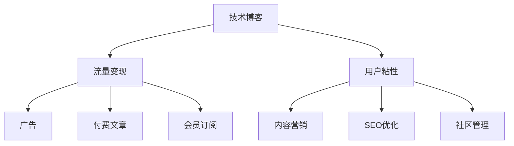

                 

# 技术博客变现：策略与方法

## 1. 背景介绍

### 1.1 问题由来
在信息爆炸的时代，如何吸引公众关注，并通过技术博客变现，成为了许多科技从业者和爱好者面临的重要问题。传统的内容发布渠道，如新闻网站、博客平台、论坛，已经很难吸引足够的流量，用户注意力分散，内容获取门槛也日益增高。加之流量变现模式日趋同质化，广告投放和点击率支付的盈利模式不再具有吸引力，技术博客的生存空间越来越狭小。

如何在众多竞争者中脱颖而出，让博客产生价值，吸引读者并实现变现，成为摆在每个技术博主面前的严峻挑战。本文旨在通过系统分析技术博客的变现策略，并提供一套切实可行的操作路径，助力技术博主在纷繁复杂的互联网环境中生存并发展。

### 1.2 问题核心关键点
通过技术博客变现，核心在于如何提升博客的曝光度、吸引用户关注，以及将用户转化为付费客户。一个成功博客的关键在于内容质量、形式创新和受众互动，这些因素不仅决定了读者的停留时间和转化率，还直接影响着广告和付费文章的收入。因此，技术博客变现的策略和方法需要从这些维度进行深入探讨。

## 2. 核心概念与联系

### 2.1 核心概念概述

为了更好地理解技术博客变现的策略与方法，本节将介绍几个密切相关的核心概念：

- **技术博客**：聚焦于技术内容发布和传播的博客，旨在分享最新的技术趋势、创新成果和实践经验。
- **流量变现**：通过吸引和保留访客，通过广告、付费文章、会员订阅等方式实现经济收益的过程。
- **用户粘性**：指用户对博客内容的持续关注度和互动性，是流量变现的基础。
- **内容营销**：利用内容来吸引和保持用户，并通过这些用户带来潜在收益的一种营销方式。
- **SEO优化**：通过改进博客的搜索引擎排名，吸引更多访问者，提升流量和曝光度。
- **社区管理**：通过维护一个活跃的在线社区，促进用户互动和内容分享，提升用户粘性。

这些概念之间的逻辑关系可以通过以下Mermaid流程图来展示：



这个流程图展示了一个成功的技术博客的关键元素及其相互关系：

1. 技术博客作为内容发布的平台，通过优质内容吸引访客。
2. 访客转化为流量后，通过广告、付费文章和会员订阅等形式进行变现。
3. 访客的停留时间和互动频率提升用户粘性。
4. 通过内容营销、SEO优化和社区管理等手段，进一步提升用户粘性。
5. 提升的用户粘性能够更好地吸引流量，形成良性循环。

## 3. 核心算法原理 & 具体操作步骤

### 3.1 算法原理概述

技术博客变现的策略与方法，本质上是通过提升内容质量和用户粘性，吸引更多的流量，并采取合适的流量变现手段实现收益的过程。

这一过程可以分为以下几个关键步骤：

- **内容创作与优化**：创作优质内容，并进行SEO优化，提升搜索引擎排名，吸引更多访客。
- **用户互动与参与**：通过评论互动、专题讨论、在线活动等方式，增加用户粘性，促进用户长期关注。
- **流量变现手段**：选择合适的流量变现手段，如广告、付费文章、会员订阅等，实现经济收益。
- **持续优化与反馈**：基于用户反馈和流量数据，持续优化内容策略和变现模式，提升整体效果。

### 3.2 算法步骤详解

**Step 1: 内容创作与优化**

- **内容选题**：根据行业热点、技术趋势和读者兴趣，选定博客主题。
- **内容创作**：撰写高质量的文章，确保内容准确、实用、易于理解。
- **SEO优化**：使用关键词优化、元数据优化、内部链接优化等技术，提升博客的搜索引擎排名。
- **内容更新**：定期更新博客内容，保持信息的时效性和相关性。

**Step 2: 用户互动与参与**

- **评论互动**：积极回复评论，与读者建立良好互动，增强用户粘性。
- **专题讨论**：围绕热门话题或技术问题，组织在线讨论，吸引读者参与。
- **在线活动**：定期举办线上直播、讲座、问答等活动，增加与用户的互动频率。
- **社交媒体**：通过微博、知乎、微信等社交平台，推广博客内容，吸引更多访客。

**Step 3: 流量变现手段**

- **广告投放**：通过广告平台投放精准广告，吸引流量并实现收益。
- **付费文章**：针对深度技术内容，提供付费阅读选项，提升用户粘性和收入。
- **会员订阅**：创建付费会员模式，提供独家文章、视频、课程等增值服务，增加长期收入。
- **付费课程**：根据博客粉丝的需求，开发并销售技术相关的在线课程。

**Step 4: 持续优化与反馈**

- **流量数据分析**：定期分析博客流量和用户行为数据，了解读者偏好和需求。
- **内容策略调整**：根据数据分析结果，调整博客的内容策略和发布计划。
- **变现模式优化**：根据流量和用户反馈，优化广告、付费文章、会员订阅等变现模式。
- **用户互动改进**：根据互动数据，改进评论互动、在线活动等互动方式，提升用户体验。

### 3.3 算法优缺点

技术博客变现策略与方法具有以下优点：

1. **灵活多样**：变现手段丰富，可以根据博客特点和用户需求选择最适合的方式。
2. **精准高效**：通过数据驱动的策略，能够精准定位目标用户，提高流量和转化率。
3. **可持续性**：通过持续的内容创作和用户互动，实现长期的流量和收入增长。

同时，该方法也存在一定的局限性：

1. **内容创作成本高**：高质量内容的创作需要投入大量时间和精力。
2. **用户获取难度大**：通过SEO、社交媒体等手段获取新访客需要一定时间。
3. **市场竞争激烈**：技术博客市场竞争激烈，需要持续创新和优化才能保持竞争优势。
4. **用户忠诚度低**：用户容易流失，需要不断提供新内容和新价值。

尽管存在这些局限性，但就目前而言，技术博客变现方法仍然是一种行之有效的策略，特别是在高度专业化和个性化的技术领域。

### 3.4 算法应用领域

技术博客变现策略与方法在技术领域已经得到了广泛应用，例如：

- **软件开发**：通过技术博客分享编程技巧、代码库和开发经验，吸引开发者关注。
- **数据科学**：利用博客发布数据分析项目、代码示例和模型解释，提升数据科学家影响力。
- **人工智能**：通过博客分享AI研究和应用案例，吸引AI从业者交流学习。
- **安全技术**：通过博客分享安全漏洞分析、防护建议，增强安全专家知名度。
- **网络安全**：通过博客分享网络安全实践和解决方案，吸引安全从业者关注。

除了这些传统应用外，技术博客变现还在更多领域得到创新应用，如区块链、金融科技、健康医疗等，为相关行业技术推广提供了新渠道。

## 4. 数学模型和公式 & 详细讲解 & 举例说明

### 4.1 数学模型构建

技术博客的流量变现过程，可以通过以下数学模型进行描述：

设博客流量为 $F$，广告收入为 $A$，付费文章收入为 $P$，会员订阅收入为 $S$，则总收入 $I$ 可表示为：

$$
I = A + P + S
$$

其中，广告收入 $A$ 可以通过广告点击率 $C$ 和每次点击广告收入 $E$ 计算得到：

$$
A = C \times E
$$

付费文章收入 $P$ 可以通过订阅用户数 $U$ 和单篇文章价格 $F$ 计算得到：

$$
P = U \times F
$$

会员订阅收入 $S$ 可以通过会员数量 $M$ 和单月订阅价格 $M$ 计算得到：

$$
S = M \times M
$$

### 4.2 公式推导过程

广告点击率 $C$ 可以通过以下公式计算：

$$
C = \frac{广告展示次数}{总访问者数} \times 100\%
$$

每次点击广告收入 $E$ 可以通过以下公式计算：

$$
E = \frac{广告总收入}{广告点击次数}
$$

订阅用户数 $U$ 可以通过以下公式计算：

$$
U = \frac{付费文章收入}{单篇文章价格}
$$

单篇文章价格 $F$ 可以通过以下公式计算：

$$
F = \frac{付费文章总收入}{付费文章数量}
$$

单月订阅价格 $M$ 可以通过以下公式计算：

$$
M = \frac{会员订阅总收入}{会员数量}
$$

通过这些公式，可以计算出广告、付费文章和会员订阅的各个指标，从而进行流量变现效果的评估和优化。

### 4.3 案例分析与讲解

假设某技术博客一个月内获得1000次访问，其中1000次均展示广告，点击广告的次数为200次，每次点击广告的收入为1元。如果该博客有100篇文章，其中5篇为付费文章，每篇价格为10元，另有50个会员，单月订阅价格为50元。

根据上述公式，可以计算出：

$$
C = \frac{1000}{1000} \times 100\% = 20\%
$$

$$
E = \frac{1000 \times 1}{200} = 5
$$

$$
U = \frac{5 \times 10}{100} = 0.5
$$

$$
F = \frac{5 \times 10}{100} = 0.5
$$

$$
M = \frac{50 \times 50}{50} = 50
$$

$$
M = \frac{50 \times 50}{50} = 50
$$

$$
I = 200 \times 5 + 100 \times 0.5 + 50 \times 50 = 1100
$$

通过计算，可以发现该博客通过广告、付费文章和会员订阅的综合收入为1100元。在实际应用中，这些数据可以帮助博客运营者评估各项变现手段的效果，并优化策略以提高整体收入。

## 5. 项目实践：代码实例和详细解释说明

### 5.1 开发环境搭建

在进行技术博客变现实践前，我们需要准备好开发环境。以下是使用Python进行Flask框架开发的环境配置流程：

1. 安装Flask：从官网下载并安装Flask，用于创建博客网站。

```bash
pip install flask
```

2. 创建虚拟环境：
```bash
python3 -m venv blog-env
source blog-env/bin/activate
```

3. 安装所需库：
```bash
pip install markdown flask-babel flask-marshmallow
```

4. 安装数据库：
```bash
pip install flask-sqlalchemy
```

5. 创建数据库：
```bash
flask db init
```

6. 编写并运行Flask应用：
```bash
flask run
```

完成上述步骤后，即可在虚拟环境中启动Flask应用，搭建博客平台。

### 5.2 源代码详细实现

以下是使用Flask框架创建技术博客的Python代码实现，包括用户注册、文章发布和流量分析等功能：

```python
from flask import Flask, render_template, request, redirect, url_for
from flask_sqlalchemy import SQLAlchemy
from flask_login import LoginManager, login_user, logout_user, login_required, current_user
from werkzeug.security import generate_password_hash, check_password_hash

app = Flask(__name__)
app.config['SECRET_KEY'] = 'secret'
app.config['SQLALCHEMY_DATABASE_URI'] = 'sqlite:///blog.db'
app.config['SQLALCHEMY_TRACK_MODIFICATIONS'] = False

db = SQLAlchemy(app)
login_manager = LoginManager()
login_manager.init_app(app)

class User(db.Model):
    id = db.Column(db.Integer, primary_key=True)
    username = db.Column(db.String(50), unique=True, nullable=False)
    password_hash = db.Column(db.String(60), nullable=False)
    blog_posts = db.relationship('Post', backref='author', lazy=True)

    def set_password(self, password):
        self.password_hash = generate_password_hash(password)

    def check_password(self, password):
        return check_password_hash(self.password_hash, password)

@login_manager.user_loader
def load_user(user_id):
    return User.query.get(int(user_id))

class Post(db.Model):
    id = db.Column(db.Integer, primary_key=True)
    title = db.Column(db.String(100), nullable=False)
    content = db.Column(db.Text, nullable=False)
    author_id = db.Column(db.Integer, db.ForeignKey('user.id'), nullable=False)
    comments = db.relationship('Comment', backref='post', lazy=True)

class Comment(db.Model):
    id = db.Column(db.Integer, primary_key=True)
    content = db.Column(db.Text, nullable=False)
    post_id = db.Column(db.Integer, db.ForeignKey('post.id'), nullable=False)

@app.route('/')
@login_required
def index():
    posts = Post.query.filter_by(author_id=current_user.id).order_by(Post.id.desc()).limit(5).all()
    return render_template('index.html', posts=posts)

@app.route('/login', methods=['GET', 'POST'])
def login():
    if request.method == 'POST':
        username = request.form.get('username')
        password = request.form.get('password')
        user = User.query.filter_by(username=username).first()
        if user and user.check_password(password):
            login_user(user)
            return redirect(url_for('index'))
    return render_template('login.html')

@app.route('/logout')
@login_required
def logout():
    logout_user()
    return redirect(url_for('index'))

@app.route('/register', methods=['GET', 'POST'])
def register():
    if request.method == 'POST':
        username = request.form.get('username')
        password = request.form.get('password')
        user = User(username=username)
        user.set_password(password)
        db.session.add(user)
        db.session.commit()
        return redirect(url_for('login'))
    return render_template('register.html')

@app.route('/post', methods=['GET', 'POST'])
@login_required
def post():
    if request.method == 'POST':
        title = request.form.get('title')
        content = request.form.get('content')
        post = Post(title=title, content=content, author=current_user)
        db.session.add(post)
        db.session.commit()
        return redirect(url_for('index'))
    return render_template('post.html')

@app.route('/post/<int:id>', methods=['GET'])
@login_required
def post_detail(id):
    post = Post.query.get_or_404(id)
    return render_template('post_detail.html', post=post)

if __name__ == '__main__':
    db.create_all()
    app.run(debug=True)
```

以上代码实现了一个基本的博客系统，包括用户注册、文章发布和文章浏览等功能。开发者可以根据实际需求进行扩展，添加评论、标签、分类等功能，进一步提升博客的用户体验。

### 5.3 代码解读与分析

让我们再详细解读一下关键代码的实现细节：

**User类**：
- 定义了用户模型，包括用户名、密码和博客文章等关系。
- `set_password`和`check_password`方法用于密码的哈希存储和验证。

**Post类**：
- 定义了文章模型，包括标题、内容、作者和评论等关系。
- 使用了Flask SQLAlchemy的ORM，方便数据的查询和更新。

**Comment类**：
- 定义了评论模型，与文章模型建立多对一的关系。
- 同样使用了ORM，方便数据的添加和查询。

**login_manager**：
- 配置了登录管理器，支持用户登录和注销等功能。
- `load_user`方法用于加载用户信息，用于登录验证。

**路由和模板**：
- 定义了主要的路由和模板文件，包括首页、登录、注册、发布文章和文章详情等页面。
- 使用Flask的`render_template`方法动态渲染模板，展示文章列表、用户登录、文章详情等页面内容。

通过以上代码的解读和分析，我们可以看到Flask框架提供了一套简洁高效的开发环境，使开发者能够快速搭建博客平台，并通过模板引擎和ORM等技术实现数据的动态展示和交互。

当然，实际应用中还需要进行更多的开发和优化，如安全性、性能调优、数据库迁移等，才能保障博客平台的稳定性和可扩展性。

## 6. 实际应用场景

### 6.1 智能内容推荐系统

技术博客内容繁多，如何向用户推荐感兴趣的博客，是提升用户体验和增加流量的关键。智能内容推荐系统通过分析用户的历史阅读数据和行为偏好，推荐个性化的博客内容，提高用户粘性和停留时间。

在技术博客中，智能推荐系统可以基于用户阅读的文章和评论数据，生成用户画像，识别出用户的兴趣点，并结合热门文章和热门话题，动态推荐相关内容。这不仅能提升用户满意度，还能增加流量和收入。

### 6.2 博客数据分析与优化

通过对技术博客的流量和用户行为数据的分析，可以发现用户对不同类型内容的偏好和需求，从而优化博客的内容策略和发布计划。例如，通过分析访问量、页面停留时间和互动数据，可以找出最受欢迎的文章类型和内容形式，优化后续内容的制作和发布。

具体而言，可以定期收集用户反馈和行为数据，建立用户画像，分析不同类型内容的平均流量和互动率，调整内容发布计划，提升整体效果。

### 6.3 社区互动与内容共享

技术博客不仅仅是内容展示的平台，也是知识交流和社区互动的重要场所。通过组织在线讨论、举办技术沙龙、设立专家专栏等方式，可以促进用户之间的互动和内容共享，提升用户粘性和博客的活跃度。

在博客平台上，可以设置专家专栏、主题讨论区等模块，鼓励用户参与互动，增加用户粘性。通过在线直播、问答等形式，提升用户互动的频率和质量，增加博客的用户基础和内容多样性。

### 6.4 未来应用展望

随着技术博客的发展，未来在以下几个方面将有新的突破：

1. **个性化推荐系统**：通过深度学习算法，构建更加精准的个性化推荐系统，提升用户的满意度和停留时间。
2. **社区知识图谱**：构建社区知识图谱，帮助用户快速找到相关领域的专家和知识，提升社区的交流效率和知识深度。
3. **内容创作工具**：开发智能写作工具和代码生成器，提升内容的创作效率和质量，吸引更多的技术爱好者。
4. **多语言支持**：支持多种语言的内容创作和交流，拓展技术博客的全球影响力。
5. **混合媒体内容**：将文本、视频、音频等混合媒体内容整合到博客平台，提升内容的丰富性和可读性。
6. **区块链技术**：利用区块链技术，实现内容版权保护和去中心化交易，增加内容变现的公平性和透明度。

以上趋势展示了技术博客未来可能的发展方向，通过这些技术创新，技术博客将更好地服务于技术爱好者和从业者，成为知识共享和技术交流的重要平台。

## 7. 工具和资源推荐

### 7.1 学习资源推荐

为了帮助开发者系统掌握技术博客变现的策略与方法，这里推荐一些优质的学习资源：

1. **《Flask Web开发实战》**：深入浅出地介绍了Flask框架的开发技巧和最佳实践，适合初学者快速上手。
2. **《Django Web开发实战》**：全面覆盖了Django框架的核心技术，包括ORM、模板、认证等，适合进阶开发者。
3. **《内容营销的艺术与策略》**：详细介绍了内容营销的基本原理和实践方法，适合博主提升内容创作能力。
4. **《SEO优化实战》**：系统讲解了SEO优化的原理和技巧，适合博主提升博客的搜索引擎排名。
5. **《社区管理与运营》**：介绍了社区管理和运营的基本方法和工具，适合博主提升社区互动和用户粘性。

通过对这些资源的学习实践，相信你一定能够快速掌握技术博客变现的精髓，并用于解决实际的博客问题。

### 7.2 开发工具推荐

高效的开发离不开优秀的工具支持。以下是几款用于技术博客变现开发的常用工具：

1. **Flask**：基于Python的轻量级Web框架，灵活且易于上手，适合快速开发小型博客平台。
2. **Django**：全功能的Web框架，提供ORM、模板、认证等丰富的功能，适合开发大型博客平台。
3. **Jekyll**：基于Ruby的开源博客框架，简洁高效，适合发布静态博客内容。
4. **WordPress**：流行的博客平台，易于使用且插件丰富，适合传统博客形式的发布和维护。
5. **Zendesk**：客户服务管理工具，帮助博客提供更高效的用户支持和反馈机制。

合理利用这些工具，可以显著提升技术博客变现的开发效率，加快创新迭代的步伐。

### 7.3 相关论文推荐

技术博客变现的研究源于学界的持续探索。以下是几篇奠基性的相关论文，推荐阅读：

1. **《Content Generation via Topic-aware Transformers》**：介绍了一种基于Transformers的内容生成模型，适合博客的自动内容创作。
2. **《Improving Search Ranking with User Intent Understanding》**：探讨了如何通过理解用户意图提升博客的搜索引擎排名。
3. **《Community Management for Online Forums》**：介绍了如何通过社区管理提升在线论坛的活跃度和用户粘性。
4. **《Personalization in Content Recommendation》**：介绍了如何通过个性化推荐提升博客的流量和用户满意度。
5. **《Blockchain-based Content Trading System》**：探讨了如何利用区块链技术实现内容版权保护和去中心化交易。

这些论文代表了大语言模型微调技术的发展脉络。通过学习这些前沿成果，可以帮助研究者把握学科前进方向，激发更多的创新灵感。

## 8. 总结：未来发展趋势与挑战

### 8.1 研究成果总结

本文对技术博客变现的策略与方法进行了全面系统的介绍。首先阐述了技术博客变现的背景和意义，明确了流量变现的关键在于内容质量和用户粘性，以及如何通过内容创作、用户互动和流量变现手段实现收益。其次，从原理到实践，详细讲解了流量变现的数学模型和实现步骤，给出了完整的代码实例和详细解释。同时，本文还广泛探讨了流量变现方法在实际应用中的多个场景，展示了微调范式的巨大潜力。此外，本文精选了技术博客变现的相关资源，力求为博主提供全方位的技术指引。

通过本文的系统梳理，可以看到，技术博客变现方法在大数据和互联网技术的支持下，通过提升内容质量和用户粘性，能够实现较好的流量和收入效果。未来，伴随技术博客变现的不断演进，相信技术博客将更好地服务于技术爱好者和从业者，成为知识共享和技术交流的重要平台。

### 8.2 未来发展趋势

展望未来，技术博客变现将呈现以下几个发展趋势：

1. **自动化内容创作**：通过自然语言处理和生成技术，实现文章的自动创作和优化，提高内容创作效率。
2. **智能化推荐系统**：通过机器学习和深度学习算法，构建更加精准的个性化推荐系统，提升用户体验和流量。
3. **社区化交流**：通过构建社区平台，促进用户之间的交流和互动，提升用户粘性和博客的活跃度。
4. **多模态内容整合**：将文本、视频、音频等混合媒体内容整合到博客平台，提升内容的丰富性和可读性。
5. **区块链技术应用**：利用区块链技术，实现内容版权保护和去中心化交易，增加内容变现的公平性和透明度。

以上趋势凸显了技术博客变现技术的广阔前景。这些方向的探索发展，必将进一步提升技术博客的流量和收入，为技术爱好者和从业者提供更好的服务。

### 8.3 面临的挑战

尽管技术博客变现方法已经取得了不错的成效，但在迈向更加智能化和商业化的过程中，它仍面临着诸多挑战：

1. **内容创作的瓶颈**：高质量内容创作需要大量时间和精力，难以快速产出。
2. **用户获取的难度**：通过SEO、社交媒体等手段获取新访客需要一定时间，难以快速提升流量。
3. **市场竞争的激烈**：技术博客市场竞争激烈，需要不断创新和优化才能保持竞争优势。
4. **用户粘性的维持**：用户容易流失，需要不断提供新内容和新价值，维持用户粘性。
5. **流量变现的难度**：流量变现手段多样，需要精细化管理才能实现理想的收入效果。

尽管存在这些挑战，但通过持续的努力和创新，技术博客变现仍然是一个值得探索和发展的方向。相信随着技术博客变现方法的不断演进，技术博客将能够更好地服务于技术爱好者和从业者，成为知识共享和技术交流的重要平台。

### 8.4 研究展望

面对技术博客变现所面临的种种挑战，未来的研究需要在以下几个方面寻求新的突破：

1. **内容创作自动化**：通过自然语言处理和生成技术，实现文章的自动创作和优化，提高内容创作效率。
2. **个性化推荐系统**：通过机器学习和深度学习算法，构建更加精准的个性化推荐系统，提升用户体验和流量。
3. **社区化交流**：通过构建社区平台，促进用户之间的交流和互动，提升用户粘性和博客的活跃度。
4. **多模态内容整合**：将文本、视频、音频等混合媒体内容整合到博客平台，提升内容的丰富性和可读性。
5. **区块链技术应用**：利用区块链技术，实现内容版权保护和去中心化交易，增加内容变现的公平性和透明度。

这些研究方向将引领技术博客变现技术迈向更高的台阶，为技术博客变现带来新的突破和发展。

## 9. 附录：常见问题与解答

**Q1：技术博客变现是否适用于所有技术博客？**

A: 技术博客变现策略适用于大多数技术博客，特别是那些内容质量较高、用户互动频繁的平台。但对于一些以技术资讯、新闻报道为主的内容博客，广告变现可能不是最佳选择。此外，博客平台的初期阶段，流量和用户基数较小，变现效果可能不理想。

**Q2：如何选择合适的流量变现手段？**

A: 选择合适的流量变现手段需要考虑博客的特点和用户需求。广告适合点击率高的博客，付费文章适合深度技术内容的博客，会员订阅适合有稳定用户基础的博客。可以根据博客的内容类型和用户粘性，灵活选择变现手段。

**Q3：技术博客如何提升用户粘性？**

A: 提升用户粘性需要通过多种手段结合，包括内容质量、用户互动、社区管理等。定期发布高质量内容，积极回复评论和互动，组织在线讨论和活动，提供会员订阅等增值服务，都可以增加用户粘性。同时，通过数据分析了解用户偏好，优化内容策略和互动方式，提升用户体验。

**Q4：技术博客的流量分析如何进行？**

A: 技术博客的流量分析可以通过Google Analytics等工具实现。可以分析访问量、页面停留时间、跳出率等指标，了解用户的访问行为和偏好。通过流量分析，可以优化博客的布局和内容策略，提升整体效果。

**Q5：技术博客的收入来源如何多样化？**

A: 技术博客的收入来源可以多样化，包括广告、付费文章、会员订阅、课程销售、广告收入、品牌合作等。可以根据博客的特点和用户需求，灵活选择收入来源，最大化变现效果。

通过以上附录问题的详细解答，可以看到技术博客变现方法在实际应用中需要注意的细节和策略。这些信息的深入理解，将有助于技术博客运营者制定更加有效的变现策略，提升整体效果。

---

作者：禅与计算机程序设计艺术 / Zen and the Art of Computer Programming

