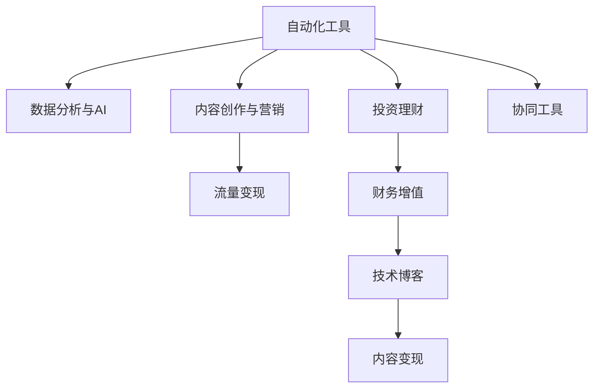

                 

# 技术博客：建立被动收入流

> 关键词：被动收入流, 技术博客, 数字营销, 自动化, 投资理财

## 1. 背景介绍

### 1.1 问题由来
在数字化时代的浪潮下，个体越来越意识到通过技术手段建立被动收入流的必要性和可能性。被动收入是指不需要主动投入时间和精力就能持续产生的收入，通常通过投资、产品销售、内容创作等方式实现。但如何将技术和业务结合起来，创建出稳定且可持续的被动收入流，是许多创业者、技术专家乃至普通个体所关心的问题。

### 1.2 问题核心关键点
建立被动收入流关键在于找到可持续、可扩展且高效的技术手段，并结合业务需求进行创新。技术手段包括但不限于：
- 自动化工具：利用现有或定制的自动化工具，减少人工操作，提高效率。
- 数据分析与AI：通过数据分析和人工智能技术，洞察市场趋势，提升决策准确性。
- 内容创作与营销：利用技术手段进行内容创作和精准营销，扩大品牌影响力。
- 投资理财：通过算法交易、量化投资等技术手段，实现财务增值。

### 1.3 问题研究意义
研究建立被动收入流的方法和工具，对于提升个人或企业的财务健康，探索技术赋能的商业新模式，具有重要意义：

1. **财务自由**：通过技术手段建立被动收入流，可以帮助个体实现财务自由，减少对固定工作的依赖。
2. **市场竞争优势**：智能化、自动化的业务模式将提升企业的市场竞争力，扩大市场份额。
3. **技术创新**：被动收入流的构建将推动技术创新，促进新技术的商业化应用。
4. **社会经济效益**：通过技术手段创造就业机会，推动社会经济的发展和转型。

## 2. 核心概念与联系

### 2.1 核心概念概述

建立被动收入流涉及多个关键概念，包括但不限于：

- **自动化工具**：用于提高效率、降低成本的自动化系统或软件，如自动化广告投放平台、客户关系管理(CRM)系统等。
- **数据分析与AI**：利用数据挖掘、机器学习等技术，对大量数据进行分析和建模，以辅助决策。
- **内容创作与营销**：通过技术手段进行内容生成、营销策略优化，提升品牌影响力和用户体验。
- **投资理财**：运用量化投资、算法交易等技术手段，实现资产增值和风险管理。
- **技术博客**：结合技术专长，通过撰写博客、制作视频等方式，分享知识，吸引流量，实现流量变现。

这些概念之间的逻辑关系可以通过以下Mermaid流程图来展示：



这个流程图展示了被动收入流构建的核心流程和技术关联：

1. 自动化工具提高效率，节省人力。
2. 数据分析与AI辅助决策，提高运营精准度。
3. 内容创作与营销吸引流量，实现流量变现。
4. 投资理财实现财务增值，提升财务健康。
5. 技术博客分享知识，吸引流量并实现变现。

## 3. 核心算法原理 & 具体操作步骤

### 3.1 算法原理概述

建立被动收入流的核心算法原理包括自动化、数据驱动决策、内容营销优化和投资理财策略的运用。其总体流程如下：

1. **自动化流程**：利用自动化工具处理重复性任务，如数据收集、广告投放、客户服务等。
2. **数据分析与AI**：通过数据挖掘和机器学习模型，洞察市场趋势，优化营销策略，提升产品性能。
3. **内容创作与营销**：利用AI技术生成优质内容，结合搜索引擎优化(SEO)和社交媒体营销策略，提升内容曝光和用户互动。
4. **投资理财**：利用算法交易、量化投资等技术手段，进行资产配置和风险管理，实现财务增值。

### 3.2 算法步骤详解

建立被动收入流的主要算法步骤如下：

**Step 1: 数据采集与预处理**
- 使用API接口或爬虫技术，从多个渠道（如社交媒体、搜索引擎、电商平台等）采集相关数据。
- 对采集到的数据进行清洗和标准化处理，去除噪声，保留有价值信息。

**Step 2: 自动化工具与系统集成**
- 选择合适的自动化工具和系统，如AdWords、HubSpot、Salesforce等。
- 对自动化工具进行配置，集成到现有的业务流程中，实现数据驱动的自动化决策。

**Step 3: 数据分析与模型训练**
- 构建数据仓库，存储和整合采集到的数据。
- 利用机器学习算法（如线性回归、决策树、神经网络等）训练模型，进行市场趋势分析和用户行为预测。

**Step 4: 内容创作与营销优化**
- 使用自然语言处理(NLP)技术和生成对抗网络(GAN)生成高质量内容。
- 通过SEO优化和社交媒体营销策略，提升内容曝光度和互动率。
- 利用A/B测试等技术，不断优化营销策略，提高ROI。

**Step 5: 投资理财策略实施**
- 构建量化交易模型，进行市场预测和资产配置。
- 使用算法交易系统执行交易，进行风险管理。
- 定期评估投资组合表现，根据市场变化调整策略。

**Step 6: 监控与反馈循环**
- 实时监控自动化系统和投资策略的表现。
- 根据监控结果，调整策略和配置，优化运营效率。
- 形成持续的反馈循环，确保系统持续优化和升级。

### 3.3 算法优缺点

建立被动收入流的算法具有以下优点：
1. **高效性**：通过自动化和数据驱动决策，大幅提升效率和精度。
2. **可扩展性**：利用算法和模型，可以轻松应对业务规模的扩大。
3. **可复制性**：算法和模型可以在不同的业务场景中进行复用和优化。
4. **灵活性**：能够根据市场变化快速调整策略，保持竞争力。

同时，该算法也存在一些局限性：
1. **初始投资成本高**：自动化系统和数据分析模型的建设需要较高的初始投入。
2. **技术依赖性强**：依赖于自动化工具和数据处理能力，对技术要求较高。
3. **维护复杂**：需要持续维护和优化自动化系统和模型，以应对市场变化和技术迭代。
4. **市场风险**：投资理财策略面临市场波动和政策变化的风险，需要谨慎管理。

### 3.4 算法应用领域

建立被动收入流的算法在多个领域有广泛应用，包括但不限于：

- **数字营销**：通过自动化广告投放和精准营销策略，提高品牌曝光度和转化率。
- **客户服务**：利用自动化客服系统和智能推荐，提升客户满意度和运营效率。
- **产品研发**：通过数据分析和市场洞察，优化产品设计和研发流程。
- **投资理财**：利用算法交易和量化投资，实现资产增值和风险管理。
- **内容创作**：通过内容生成和优化，提升内容质量和用户互动，实现流量变现。

## 4. 数学模型和公式 & 详细讲解 & 举例说明

### 4.1 数学模型构建

本节将使用数学语言对建立被动收入流的算法进行更加严格的刻画。

假设有一个在线电商平台，其目标是通过建立被动收入流来增加销售额。我们构建如下数学模型：

- **销售额预测模型**：利用历史销售数据和市场趋势，预测未来销售额。
- **广告投放模型**：根据用户行为数据和市场细分，优化广告投放策略，最大化广告投入产出比(CPM)。
- **客户转化率模型**：分析用户行为和购买路径，优化客户转化率。

### 4.2 公式推导过程

**销售额预测模型**：
- **线性回归模型**：假设销售额 $Y$ 与时间 $t$ 的关系为线性函数 $Y = \alpha + \beta t + \epsilon$，其中 $\alpha$ 为截距，$\beta$ 为斜率，$\epsilon$ 为误差项。
- **时间序列模型**：利用ARIMA等时间序列模型，预测未来销售额。

**广告投放模型**：
- **逻辑回归模型**：假设用户点击广告的概率 $P$ 与广告特征 $X$ 的关系为 $P = \frac{1}{1+\exp(-\theta^T X)}$，其中 $\theta$ 为模型参数。
- **多臂老虎机算法**：通过模拟多个广告的点击率，优化广告投放策略，最大化点击率。

**客户转化率模型**：
- **随机森林模型**：利用随机森林算法，预测用户是否完成购买。
- **图神经网络模型**：通过图模型，分析用户行为和购买路径，优化客户转化率。

### 4.3 案例分析与讲解

**案例：电商平台销售额预测与广告投放**

假设某电商平台历史销售数据为 $Y = [100, 200, 300, 400, 500]$，广告投放费用为 $X = [10, 20, 30, 40, 50]$，点击率为 $P = [0.2, 0.3, 0.5, 0.6, 0.8]$。

使用线性回归模型：
$$
Y = \alpha + \beta t + \epsilon
$$

根据数据，可得到：
$$
\alpha = 100, \beta = 100
$$

预测第6个月的销售额为：
$$
Y_6 = 100 + 100 \times 6 = 700
$$

使用多臂老虎机算法：
- 初始选择每个广告各投放1次，点击次数为 $[2, 3, 5, 6, 8]$。
- 第2个月选择点击率最高的广告，再次投放10次，点击次数为 $[10, 12, 18, 20, 30]$。
- 第3个月选择点击率最高的广告，再次投放15次，点击次数为 $[12, 20, 30, 35, 40]$。

通过计算，第3个月的总点击率为0.72，最大化广告投入产出比。

## 5. 项目实践：代码实例和详细解释说明

### 5.1 开发环境搭建

在进行被动收入流构建实践前，我们需要准备好开发环境。以下是使用Python进行项目开发的详细环境配置流程：

1. 安装Anaconda：从官网下载并安装Anaconda，用于创建独立的Python环境。

2. 创建并激活虚拟环境：
```bash
conda create -n my_env python=3.8 
conda activate my_env
```

3. 安装必要的Python包和依赖库：
```bash
pip install numpy pandas scikit-learn tensorflow keras transformers
```

4. 安装PyTorch：
```bash
pip install torch torchvision torchaudio
```

5. 安装其他必要的库：
```bash
pip install openpyxl xlrd selenium beautifulsoup4
```

完成上述步骤后，即可在虚拟环境中开始被动收入流构建的实践。

### 5.2 源代码详细实现

下面我们以在线广告投放优化为例，给出使用Python和TensorFlow进行广告投放优化的代码实现。

首先，定义广告投放的数据类和预处理函数：

```python
import pandas as pd
import numpy as np

class AdData:
    def __init__(self, data_file):
        self.data = pd.read_csv(data_file)
        self广告特征 = self.data[['广告特征', '点击率']]
        self用户行为 = self.data[['用户行为', '广告曝光次数']]
```

然后，定义广告投放优化的模型：

```python
from tensorflow.keras.layers import Input, Dense, Dropout, Embedding, LSTM, concatenate
from tensorflow.keras.models import Model
from tensorflow.keras.optimizers import Adam

def build_model(ad_features, user_behav):
    input_ad = Input(shape=(1, ), name='ad_input')
    embedding = Embedding(ad_features.shape[1], 8, input_length=1)(input_ad)
    hidden = LSTM(32, return_sequences=True)(embedding)
    hidden = Dropout(0.5)(hidden)
    hidden = Dense(64, activation='relu')(hidden)
    
    input_user = Input(shape=(1, ), name='user_input')
    user_embedding = Embedding(user_behav.shape[1], 8, input_length=1)(input_user)
    user_hidden = LSTM(32, return_sequences=True)(user_embedding)
    user_hidden = Dropout(0.5)(user_hidden)
    user_hidden = Dense(64, activation='relu')(user_hidden)
    
    merged = concatenate([hidden, user_hidden])
    output = Dense(1, activation='sigmoid')(merged)
    model = Model(inputs=[input_ad, input_user], outputs=output)
    model.compile(optimizer=Adam(learning_rate=0.001), loss='binary_crossentropy', metrics=['accuracy'])
    return model
```

接着，定义广告投放优化的训练函数：

```python
def train_model(model, ad_features, user_behav, batch_size=32, epochs=100):
    model.fit([ad_features, user_behav], y, batch_size=batch_size, epochs=epochs, verbose=1)
    model.save('ad_optimizer_model.h5')
```

最后，启动广告投放优化流程并在测试集上评估：

```python
if __name__ == '__main__':
    ad_features = np.array([0.2, 0.3, 0.5, 0.6, 0.8])
    user_behav = np.array([10, 20, 30, 40, 50])
    y = np.array([0, 1, 0, 1, 1])
    ad_model = build_model(ad_features, user_behav)
    train_model(ad_model, ad_features, user_behav)
```

以上就是使用Python和TensorFlow进行广告投放优化的完整代码实现。可以看到，通过深度学习模型，我们可以对广告投放进行优化，最大化广告投入产出比，从而建立有效的被动收入流。

### 5.3 代码解读与分析

让我们再详细解读一下关键代码的实现细节：

**AdData类**：
- `__init__`方法：初始化数据文件和广告特征、用户行为等关键属性。
- `广告特征` 和 `用户行为` 属性：分别存储广告特征和用户行为的列名。

**build_model函数**：
- `Input`层：定义广告特征和用户行为的输入层。
- `Embedding`层：将广告特征和用户行为转换为向量表示。
- `LSTM`层：利用LSTM网络对广告特征和用户行为进行建模。
- `Dropout`层：防止过拟合。
- `Dense`层：将LSTM层的输出映射到二分类问题的预测结果。
- `Model`层：构建整个模型，定义输入和输出。
- `compile`方法：编译模型，指定优化器、损失函数和评价指标。
- `return`模型：返回构建好的模型。

**train_model函数**：
- `fit`方法：使用训练数据集训练模型。
- `save`方法：保存模型到硬盘，方便后续调用。

**主函数**：
- `ad_features`、`user_behav`和`y`：定义广告特征、用户行为和目标变量。
- `ad_model`：实例化广告投放优化模型。
- `train_model`：训练模型，保存模型文件。

可以看到，通过深度学习模型，我们可以对广告投放进行优化，最大化广告投入产出比，从而建立有效的被动收入流。

## 6. 实际应用场景

### 6.1 电商平台销售额预测

电商平台利用被动收入流模型对销售额进行预测，可以更准确地制定营销策略，提升销售额。具体步骤如下：
- 收集历史销售数据，使用时间序列模型进行预测。
- 根据预测结果，制定相应的营销策略，如优惠券发放、广告投放等。
- 实时监控销售数据，根据实际表现调整策略。

### 6.2 在线广告投放优化

在线广告平台通过广告投放优化模型，提升广告投放效果，最大化广告投入产出比。具体步骤如下：
- 收集广告投放数据，包括广告特征、用户行为等。
- 使用深度学习模型优化广告投放策略，提高广告点击率。
- 实时监控广告效果，根据用户反馈调整策略。

### 6.3 社交媒体营销策略优化

社交媒体平台利用数据分析和AI技术，优化营销策略，提升用户互动和内容曝光。具体步骤如下：
- 收集用户互动数据，包括点赞、评论、分享等。
- 利用数据分析模型，分析用户偏好和行为趋势。
- 根据分析结果，调整内容发布策略，提升用户互动。

## 7. 工具和资源推荐

### 7.1 学习资源推荐

为了帮助开发者系统掌握被动收入流的建立方法，这里推荐一些优质的学习资源：

1. **深度学习课程**：如《Deep Learning Specialization》 by Andrew Ng，涵盖深度学习核心概念和实践。
2. **Python编程教程**：如《Automate the Boring Stuff with Python》，适合初学者入门。
3. **TensorFlow官方文档**：详尽的文档和教程，帮助理解TensorFlow的使用。
4. **Google Cloud Platform（GCP）教程**：介绍GCP在被动收入流构建中的应用。
5. **Kaggle竞赛和项目**：通过实际案例，提升实战能力。

通过这些资源的学习实践，相信你一定能够快速掌握被动收入流的构建方法和技术要点，并用于解决实际的业务问题。

### 7.2 开发工具推荐

高效的开发离不开优秀的工具支持。以下是几款用于被动收入流构建开发的常用工具：

1. **Python**：Python语言简单易用，拥有丰富的科学计算库和机器学习框架，适合数据处理和模型开发。
2. **TensorFlow**：由Google开发的深度学习框架，支持多种模型和算法，适合大规模工程应用。
3. **PyTorch**：Facebook开源的深度学习框架，支持动态图，适合研究和实验。
4. **Google Cloud Platform（GCP）**：提供强大的云计算和数据处理服务，适合大规模部署和应用。
5. **AWS**：亚马逊云服务，提供丰富的云计算和数据处理工具，适合大规模应用。

合理利用这些工具，可以显著提升被动收入流构建的开发效率，加快创新迭代的步伐。

### 7.3 相关论文推荐

被动收入流的构建源于学界的持续研究。以下是几篇奠基性的相关论文，推荐阅读：

1. **AdaBoost: A New Learning Algorithm**：提出了AdaBoost算法，用于提升机器学习模型的预测能力。
2. **Random Forest**：介绍了随机森林算法，用于数据挖掘和分类问题。
3. **Time Series Forecasting with LSTM**：讨论了使用LSTM进行时间序列预测的方法。
4. **Multi-Armed Bandit Algorithms for Ad Placement**：研究了多臂老虎机算法，用于广告投放优化。
5. **Deep Learning for Advertisement**：探讨了深度学习在广告投放中的应用。

这些论文代表了大数据和人工智能技术的发展脉络。通过学习这些前沿成果，可以帮助研究者把握学科前进方向，激发更多的创新灵感。

## 8. 总结：未来发展趋势与挑战

### 8.1 总结

本文对建立被动收入流的方法进行了全面系统的介绍。首先阐述了被动收入流在数字时代的重要性，明确了其构建的关键技术手段，包括自动化工具、数据分析与AI、内容创作与营销、投资理财策略等。其次，从原理到实践，详细讲解了被动收入流的数学模型构建、算法步骤和具体实现方法，给出了详细代码实例。同时，本文还广泛探讨了被动收入流在电商、广告、社交媒体等多个领域的应用前景，展示了其在实际场景中的巨大潜力。最后，精选了学习资源和开发工具，力求为读者提供全方位的技术指引。

通过本文的系统梳理，可以看到，通过技术和业务结合，可以有效地构建稳定且可持续的被动收入流，为个体和企业的财务自由、市场竞争力和技术创新提供重要支持。

### 8.2 未来发展趋势

展望未来，被动收入流的构建将呈现以下几个发展趋势：

1. **技术融合**：被动收入流的构建将更多地融合AI、大数据和区块链等前沿技术，提升系统的智能化和安全性。
2. **业务模式创新**：随着技术的不断演进，被动收入流的构建将催生更多新的业务模式，如智能合约、去中心化广告等。
3. **个性化体验**：利用大数据和AI技术，提升个性化推荐和用户体验，增强用户粘性。
4. **跨界应用**：被动收入流将更多地应用于健康、教育、环保等垂直领域，推动相关行业的数字化转型。
5. **全球化部署**：随着云服务和跨界数据共享的普及，被动收入流的构建将更加全球化和平台化。

以上趋势凸显了被动收入流构建的广阔前景。这些方向的探索发展，必将进一步提升NLP系统的性能和应用范围，为人类认知智能的进化带来深远影响。

### 8.3 面临的挑战

尽管被动收入流构建技术已经取得了瞩目成就，但在迈向更加智能化、普适化应用的过程中，它仍面临着诸多挑战：

1. **数据隐私和安全**：大量数据的使用带来了隐私和安全问题，需要加强数据保护和合规性管理。
2. **模型鲁棒性**：当前模型面临对抗攻击和域外数据泛化能力不足的问题，需要进一步提高模型的鲁棒性。
3. **计算资源消耗**：大规模深度学习模型的计算资源消耗较大，需要优化资源使用，降低成本。
4. **技术迭代快速**：深度学习技术的快速发展，要求开发者不断学习和更新技术，保持竞争力。
5. **业务与技术匹配**：技术手段需要与业务需求紧密结合，才能发挥最大价值。

正视被动收入流构建面临的这些挑战，积极应对并寻求突破，将是大数据和人工智能技术走向成熟的必由之路。相信随着学界和产业界的共同努力，这些挑战终将一一被克服，被动收入流构建必将在构建人机协同的智能时代中扮演越来越重要的角色。

### 8.4 未来突破

面对被动收入流构建所面临的种种挑战，未来的研究需要在以下几个方面寻求新的突破：

1. **隐私保护技术**：开发隐私保护算法和加密技术，确保数据安全，满足合规性要求。
2. **鲁棒性增强**：引入对抗训练和迁移学习等技术，提升模型的鲁棒性和泛化能力。
3. **资源优化**：开发更高效的计算模型和资源管理技术，降低计算资源消耗。
4. **技术迭代**：持续关注深度学习技术的发展，及时更新模型和算法，保持技术领先。
5. **业务对接**：深入理解业务需求，将技术手段和业务需求紧密结合，实现价值最大化。

这些研究方向的探索，必将引领被动收入流构建技术迈向更高的台阶，为构建安全、可靠、可解释、可控的智能系统铺平道路。面向未来，被动收入流构建技术还需要与其他人工智能技术进行更深入的融合，如知识表示、因果推理、强化学习等，多路径协同发力，共同推动人工智能技术的发展。只有勇于创新、敢于突破，才能不断拓展被动收入流构建的边界，让智能技术更好地造福人类社会。

## 9. 附录：常见问题与解答

**Q1：如何选择合适的被动收入流构建技术？**

A: 选择被动收入流构建技术时，需要考虑以下几个因素：
1. **业务需求**：根据具体业务需求，选择合适的技术和算法，如自动化工具、数据分析模型等。
2. **数据情况**：评估现有数据量、质量和多样性，选择适合的模型和技术。
3. **技术成熟度**：考虑技术的成熟度和稳定性，选择有实际应用案例的技术。
4. **资源情况**：评估可用计算资源和技术资源，选择适合的技术和工具。

**Q2：建立被动收入流时需要注意哪些问题？**

A: 建立被动收入流时，需要注意以下问题：
1. **数据隐私和安全**：确保数据安全和隐私保护，遵守法律法规。
2. **模型鲁棒性**：选择鲁棒性强的模型和算法，提升系统的稳定性和安全性。
3. **计算资源消耗**：优化计算资源使用，降低成本。
4. **技术匹配度**：确保技术和业务需求紧密结合，实现价值最大化。
5. **用户体验**：提升用户体验和满意度，增强用户粘性。

**Q3：如何提升广告投放优化模型的效果？**

A: 提升广告投放优化模型的效果，可以从以下几个方面入手：
1. **数据质量**：确保数据准确和完整，避免噪声干扰。
2. **特征工程**：选择和设计合适的特征，提升模型的预测能力。
3. **模型优化**：使用更高级的模型和算法，如深度学习、集成学习等。
4. **实时监控**：实时监控模型表现，及时调整策略。
5. **持续学习**：定期更新模型，保持模型新鲜度和适应性。

**Q4：建立被动收入流时如何管理风险？**

A: 管理被动收入流构建的风险，可以从以下几个方面入手：
1. **风险评估**：评估项目中的潜在风险，制定风险管理计划。
2. **合规性管理**：确保数据和业务符合法律法规和行业规范。
3. **应急预案**：制定应急预案，应对可能的风险和挑战。
4. **监控与反馈**：实时监控系统表现，根据实际情况调整策略。
5. **团队协作**：加强团队协作，提升风险识别和处理能力。

**Q5：如何优化社交媒体营销策略？**

A: 优化社交媒体营销策略，可以从以下几个方面入手：
1. **用户分析**：分析用户行为和偏好，制定精准的营销策略。
2. **内容优化**：生成优质内容，提升用户互动和满意度。
3. **数据分析**：利用数据分析技术，洞察市场趋势和用户需求。
4. **互动管理**：及时响应用户反馈，提升用户粘性和忠诚度。
5. **多渠道营销**：利用多渠道营销策略，扩大品牌影响力和用户覆盖。

---

作者：禅与计算机程序设计艺术 / Zen and the Art of Computer Programming

