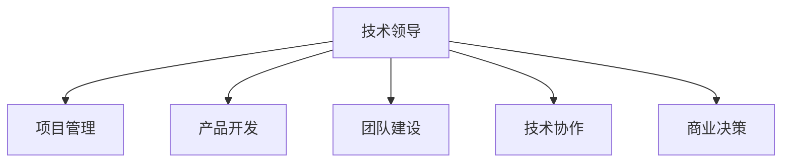

                 

# 技术合伙人：创业路上的角色

> 关键词：技术合伙人, 创业, 角色, 技术领导, 项目管理, 产品开发, 团队建设, 技术协作, 商业决策

## 1. 背景介绍

### 1.1 问题由来

在当今飞速发展的科技浪潮中，创新创业成为了一个极为热门的话题。无论是对个人职业发展，还是对整个社会的发展，创业都扮演着重要的角色。然而，成功创业并非易事，特别是在这个信息爆炸、竞争激烈的时代。其中，技术合伙人的角色不可或缺，他们不仅需要具备卓越的技术能力，还需要在商业、管理和团队协作等多方面展现出卓越的领导力。本文将从技术合伙人在创业路上所扮演的多重角色及其重要性出发，深入探讨这一职业的独特地位和挑战。

## 2. 核心概念与联系

### 2.1 核心概念概述

技术合伙人，又称为CTO（Chief Technology Officer），是指在创业公司中负责技术战略和产品开发的关键职位。他们不仅需要精通技术领域，还需具备商业头脑和团队管理能力，在技术创新、项目管理、团队建设等方面发挥核心作用。本文将围绕技术合伙人的多个核心概念进行探讨：

- **技术领导（Technical Leadership）**：技术合伙人应具备深厚的技术背景和前瞻性的技术视野，能够制定和执行公司的技术路线图。
- **项目管理（Project Management）**：负责项目规划、进度跟踪和风险管理，确保技术团队高效协作，按时完成项目目标。
- **产品开发（Product Development）**：推动产品从构思到上线，进行需求分析、设计、开发和测试。
- **团队建设（Team Building）**：构建高效、和谐的技术团队，培养团队成员的技术能力、合作精神和创新能力。
- **技术协作（Technical Collaboration）**：在跨部门和跨团队的合作中，确保技术方案的可行性和连贯性。
- **商业决策（Business Decision）**：参与商业策略制定，确保技术发展与公司整体战略相匹配。

这些概念之间互相联系，共同构成了技术合伙人的核心职责和职业发展方向。

### 2.2 核心概念原理和架构的 Mermaid 流程图



## 3. 核心算法原理 & 具体操作步骤

### 3.1 算法原理概述

技术合伙人需要在技术、管理和商业等多维度的复杂场景中进行决策和执行。其核心算法原理可概括为：

1. **技术路线图规划（Technical Roadmap Planning）**：基于市场分析、竞争环境和用户需求，制定和优化技术路线图。
2. **项目管理方法论（Project Management Methodology）**：运用敏捷、Scrum等方法论，确保项目按时按质完成。
3. **产品需求分析（Product Requirement Analysis）**：与市场和销售团队协作，明确产品功能需求和优先级。
4. **团队协作和激励（Team Collaboration and Motivation）**：采用有效的沟通和激励机制，提升团队合作效率和创新能力。
5. **商业和技术协同（Business-Technical Synergy）**：确保技术创新与商业目标对齐，推动公司成长。

### 3.2 算法步骤详解

#### 3.2.1 技术路线图规划

1. **市场调研**：
   - 收集行业报告、用户反馈和竞争对手信息。
   - 分析用户痛点和技术趋势，确定产品需求。

2. **技术评估**：
   - 评估现有技术栈和潜在的替代技术。
   - 设计技术架构，确保可扩展性和可靠性。

3. **路线图制定**：
   - 设定短期和长期目标，分解为里程碑。
   - 制定时间表和资源分配。

#### 3.2.2 项目管理方法论

1. **项目启动**：
   - 确定项目范围、目标和关键绩效指标。
   - 组建项目团队，分配任务和责任。

2. **过程监控**：
   - 使用敏捷工具如Jira或Trello，跟踪任务进度和完成情况。
   - 定期召开评审会议，调整计划和策略。

3. **风险管理**：
   - 识别项目中的风险因素，制定应对策略。
   - 建立风险监测和反馈机制，及时调整方案。

#### 3.2.3 产品需求分析

1. **用户访谈**：
   - 与市场和销售团队深入交流，理解用户需求。
   - 组织焦点小组讨论，收集详细的需求描述。

2. **功能设计**：
   - 基于用户需求和竞争分析，设计核心功能。
   - 使用用户体验（UX）设计工具，优化界面和流程。

3. **优先级排序**：
   - 使用MoSCoW法（Must have, Should have, Could have, Won't have）评估需求优先级。
   - 制定迭代计划，逐步实现核心功能。

#### 3.2.4 团队协作和激励

1. **沟通机制**：
   - 建立定期会议和沟通渠道，确保信息透明。
   - 采用文档管理工具，如Confluence或Notion，记录和分享知识。

2. **激励措施**：
   - 设计绩效考核机制，激励团队成员。
   - 提供培训和职业发展机会，提升团队技能。

3. **团队文化**：
   - 营造开放、创新的工作氛围，鼓励创新思维。
   - 推动跨团队合作，促进知识共享和协作。

#### 3.2.5 商业和技术协同

1. **策略对接**：
   - 与业务团队和高层管理者沟通，明确技术目标和商业目标。
   - 在产品设计和开发中，融入商业考量，确保技术与业务协同。

2. **市场验证**：
   - 在产品开发初期，进行市场测试，收集用户反馈。
   - 根据市场反馈，调整产品功能和市场策略。

3. **业绩评估**：
   - 制定关键绩效指标（KPI），评估产品市场表现。
   - 定期评估技术投资回报率（ROI），优化技术决策。

### 3.3 算法优缺点

#### 3.3.1 优点

1. **跨领域整合能力**：技术合伙人能够协调技术、商业和管理多个领域的资源和知识，形成综合决策。
2. **创新驱动**：具备技术创新能力，推动产品和公司的持续进步。
3. **团队协同**：通过有效的沟通和激励机制，提升团队合作效率和创新能力。
4. **战略执行**：确保技术路线与公司整体战略一致，推动公司发展。

#### 3.3.2 缺点

1. **多任务压力**：同时负责技术、管理和商业等多个方面，任务繁重。
2. **沟通协调难度**：需要协调不同部门和团队，沟通复杂，容易产生冲突。
3. **资源分配问题**：在有限资源下，如何平衡技术投入和业务目标是一个挑战。

### 3.4 算法应用领域

技术合伙人在多个领域都有着广泛的应用，包括但不限于：

1. **初创公司**：在初创公司中，技术合伙人不仅负责技术开发，还需要参与公司战略规划和资源分配，确保公司快速成长。
2. **大型企业**：在大型企业中，技术合伙人负责推动技术创新，优化现有系统，提升企业竞争力。
3. **技术创业**：独立创业时，技术合伙人需要独立制定技术路线、项目管理、团队建设和商业决策，推动产品从概念到上线。
4. **产品开发**：在产品开发团队中，技术合伙人负责指导技术方向，优化产品设计和开发流程。
5. **团队管理**：在技术团队管理中，技术合伙人需要招聘、培养和激励技术人才，构建高效团队。

## 4. 数学模型和公式 & 详细讲解 & 举例说明

### 4.1 数学模型构建

技术合伙人需要在数据和模型之间建立桥梁，制定和优化技术路线图。以下是一个简化的数学模型：

设 $T$ 为技术路线图，$C$ 为项目周期，$R$ 为项目需求，$S$ 为资源分配，$M$ 为市场反馈。

$T = f(C, R, S, M)$

其中 $f$ 表示映射关系，涉及多个维度的复杂关系。

### 4.2 公式推导过程

1. **市场调研模型**：
   - 数据来源：行业报告、用户反馈、竞争对手信息。
   - 公式推导：
     - 设 $U$ 为用户需求，$R$ 为市场调研数据。
     - $U = R + E$，其中 $E$ 为误差项。
     - 使用回归分析，推导 $U$ 与 $R$ 的关系。

2. **技术评估模型**：
   - 数据来源：现有技术栈、潜在替代技术。
   - 公式推导：
     - 设 $T$ 为现有技术栈，$N$ 为潜在替代技术。
     - $T = N + W$，其中 $W$ 为权重项。
     - 使用加权平均法，评估 $T$ 的性能。

3. **项目进度模型**：
   - 数据来源：任务分配、资源分配、项目周期。
   - 公式推导：
     - 设 $P$ 为项目进度，$A$ 为任务分配，$R$ 为资源分配，$C$ 为项目周期。
     - $P = f(A, R, C)$。
     - 使用Gantt图，可视化进度情况。

### 4.3 案例分析与讲解

**案例1：市场需求分析**

某创业公司开发一款智能家居应用，技术合伙人进行市场需求分析：

1. **数据收集**：
   - 收集用户反馈和市场调研数据。
   - 使用问卷调查和访谈，了解用户痛点和期望。

2. **数据分析**：
   - 使用统计分析方法，提取关键需求点。
   - 通过文本分析，挖掘用户隐含需求。

3. **需求映射**：
   - 将用户需求映射到产品功能。
   - 使用MoSCoW法，确定功能优先级。

**案例2：技术评估和架构设计**

某创业公司考虑引入区块链技术，技术合伙人进行技术评估：

1. **现有技术栈**：
   - 现有系统是基于REST API的。
   - 评估REST API的性能和扩展性。

2. **潜在替代技术**：
   - 区块链技术、微服务架构。
   - 比较两种技术的优缺点。

3. **架构设计**：
   - 决定采用微服务架构。
   - 设计数据流、接口和系统模块。

## 5. 项目实践：代码实例和详细解释说明

### 5.1 开发环境搭建

技术合伙人需要在项目实践中掌握多种开发环境，包括编程语言、框架和工具等。以下是Python环境搭建的步骤：

1. **安装Python**：
   - 从官网下载Python 3.x版本。
   - 安装并配置环境变量。

2. **安装虚拟环境**：
   - 使用 `pip` 安装 `virtualenv`。
   - 创建虚拟环境 `venv`，并激活环境。

3. **安装依赖库**：
   - 使用 `pip` 安装项目所需依赖库。
   - 如 `numpy`、`pandas`、`flask` 等。

### 5.2 源代码详细实现

以下是一个简单的Python Flask应用示例：

```python
from flask import Flask, jsonify, request

app = Flask(__name__)

@app.route('/api/data', methods=['POST'])
def get_data():
    data = request.json
    result = process_data(data)
    return jsonify(result)

def process_data(data):
    # 处理数据逻辑
    return data

if __name__ == '__main__':
    app.run(debug=True)
```

### 5.3 代码解读与分析

**代码解读**：

1. **Flask框架**：
   - Flask是Python的轻量级Web框架，用于快速搭建Web应用。
   - 使用 `Flask` 和 `jsonify` 处理请求和响应。

2. **路由和请求处理**：
   - 定义路由 `/api/data`，处理 POST 请求。
   - 使用 `request.json` 获取请求体数据。

3. **数据处理**：
   - 定义 `process_data` 函数，处理接收到的数据。
   - 在函数内部进行数据清洗、转换和计算。

4. **应用运行**：
   - 使用 `app.run()` 启动应用，设置调试模式。

**代码分析**：

1. **框架选择**：
   - Flask框架简单易用，适合小型项目。
   - 结合Django等更复杂的框架，适用于大中型应用。

2. **请求处理**：
   - 使用路由和请求处理，确保应用能够接收和响应外部请求。
   - 通过JSON格式传递数据，提高跨语言通信效率。

3. **数据处理**：
   - 数据处理逻辑需要根据具体需求设计。
   - 可以通过函数封装和模块化，提高代码可复用性。

4. **应用运行**：
   - 使用 `run()` 方法启动应用，设置调试模式有助于快速迭代。
   - 注意生产环境中，应使用Gunicorn等工具管理应用进程。

### 5.4 运行结果展示

运行上述代码后，可以使用 Postman 或 curl 工具向 `http://localhost:5000/api/data` 发送 POST 请求，检查处理结果是否正确。

## 6. 实际应用场景

### 6.1 创业公司

技术合伙人在创业公司中扮演多重角色，需要具备多维度的能力：

1. **技术路线图规划**：
   - 制定公司技术战略，推动产品从概念到上线。
   - 使用敏捷方法，确保技术路线图与市场变化相适应。

2. **项目管理**：
   - 使用Scrum或Kanban方法，管理项目进度和资源。
   - 确保产品按时高质量上线，满足用户需求。

3. **产品开发**：
   - 与市场和销售团队协作，明确产品功能需求和优先级。
   - 设计用户体验（UX），优化产品界面和流程。

4. **团队建设**：
   - 招聘和培养技术人才，构建高效团队。
   - 激励团队成员，提升合作效率和创新能力。

### 6.2 大型企业

在大型企业中，技术合伙人不仅负责技术开发，还需推动技术创新和优化现有系统：

1. **技术路线图规划**：
   - 制定公司技术战略，推动技术创新和系统优化。
   - 使用数据分析和市场调研，优化技术路线图。

2. **项目管理**：
   - 使用敏捷和DevOps方法，管理项目进度和资源。
   - 确保技术项目按时高质量完成，提升企业竞争力。

3. **产品开发**：
   - 推动产品迭代和版本升级，满足用户需求和市场变化。
   - 优化产品性能和用户体验，提升市场占有率。

4. **团队建设**：
   - 招聘和培养技术人才，构建高效团队。
   - 推动知识共享和协作，提升团队创新能力。

### 6.3 技术创业

独立创业时，技术合伙人需要独立制定技术路线、项目管理、团队建设和商业决策：

1. **技术路线图规划**：
   - 制定技术战略，推动产品从概念到上线。
   - 使用数据分析和市场调研，优化技术路线图。

2. **项目管理**：
   - 使用敏捷和Scrum方法，管理项目进度和资源。
   - 确保项目按时高质量完成，提升产品市场表现。

3. **产品开发**：
   - 推动产品迭代和版本升级，满足用户需求和市场变化。
   - 优化产品性能和用户体验，提升市场占有率。

4. **团队建设**：
   - 招聘和培养技术人才，构建高效团队。
   - 推动知识共享和协作，提升团队创新能力。

## 7. 工具和资源推荐

### 7.1 学习资源推荐

为了帮助技术合伙人系统掌握技术管理和项目开发的知识，以下是一些推荐的资源：

1. **《技术合伙人手册》**：
   - 全面介绍技术合伙人的角色和职责，提供实用的管理技巧。
   - 涵盖技术路线图规划、项目管理、团队建设等多个方面。

2. **Coursera《技术管理》课程**：
   - 提供系统性的技术管理课程，包括敏捷方法、项目管理等。
   - 来自世界顶尖大学和企业的讲师授课，理论与实践相结合。

3. **LinkedIn Learning《技术领导力》课程**：
   - 提供技术领导力和管理技巧的培训，涵盖团队协作、激励机制等。
   - 案例分析、视频讲解和互动练习相结合，易于理解。

4. **GitHub官方文档**：
   - 提供Git和GitHub的详细文档，帮助开发者提高版本控制能力。
   - 丰富的示例项目和开源工具，支持技术实践和协作。

5. **《PMBOK指南》**：
   - 项目管理领域权威指南，涵盖项目启动、计划、执行、监控和收尾等全流程。
   - 提供项目管理方法和工具，帮助技术合伙人高效管理项目。

### 7.2 开发工具推荐

技术合伙人需要熟练使用多种开发工具，提高工作效率和代码质量：

1. **IDE开发环境**：
   - **IntelliJ IDEA**：
     - 功能强大、界面友好，支持多种编程语言和框架。
     - 提供丰富的插件和模板，提高开发效率。

2. **版本控制工具**：
   - **Git**：
     - 基于分布式版本控制，支持分支管理、代码合并等功能。
     - 支持GitHub、GitLab等远程仓库，方便团队协作。

3. **项目管理工具**：
   - **Jira**：
     - 集任务管理、进度跟踪和协作于一体的工具。
     - 支持敏捷和Scrum方法，适合项目管理。

4. **代码协作工具**：
   - **GitHub/GitLab**：
     - 提供代码托管、版本控制和协作平台。
     - 支持开源项目管理和团队协作。

5. **文档管理工具**：
   - **Confluence/Notion**：
     - 提供文档创建、编辑和分享功能。
     - 支持团队协作和知识管理。

### 7.3 相关论文推荐

技术合伙人的实践离不开理论和研究的支持，以下是几篇推荐的相关论文：

1. **《敏捷软件开发：原则、模式与实践》**：
   - 介绍敏捷开发的原则和实践，提供实用的项目管理方法。
   - 案例分析和实用技巧相结合，适合技术合伙人参考。

2. **《技术领导力：塑造未来的技术团队》**：
   - 提供技术领导力的理论和实践，涵盖团队建设、激励机制等。
   - 实用案例和访谈内容，帮助技术合伙人提升领导能力。

3. **《精益创业：用创新打造有意义的产品》**：
   - 介绍精益创业的方法和原则，提供实战指导。
   - 案例分析和工具推荐，帮助技术合伙人快速迭代和创新。

## 8. 总结：未来发展趋势与挑战

### 8.1 研究成果总结

技术合伙人作为创业公司中的关键角色，其职责涵盖技术领导、项目管理、产品开发、团队建设和商业决策等多个方面。通过不断的学习和实践，技术合伙人能够在多维度的复杂场景中做出高效决策，推动公司成长和产品创新。

### 8.2 未来发展趋势

展望未来，技术合伙人的职业发展将呈现以下趋势：

1. **技术创新**：
   - 技术合伙人将推动更多前沿技术的应用，如人工智能、区块链、大数据等。
   - 持续学习新技术，保持技术敏锐性和创新能力。

2. **项目管理**：
   - 引入更多敏捷和DevOps方法，提高项目管理和交付效率。
   - 推动持续交付和持续集成（CI/CD），提升团队协作和交付速度。

3. **团队协作**：
   - 采用更多协作工具和平台，促进跨团队合作和知识共享。
   - 推动多元化团队建设，提升团队多样性和创新能力。

4. **商业决策**：
   - 深入了解商业和市场，制定和优化技术战略。
   - 推动技术创新与业务目标对齐，提升公司价值。

### 8.3 面临的挑战

技术合伙人在职业发展中面临诸多挑战：

1. **技术更新迅速**：
   - 技术迭代加速，需要不断学习和适应新技术。
   - 保持技术敏锐性，避免被快速变化的技术市场淘汰。

2. **多任务压力**：
   - 同时负责技术、管理和商业等多个方面，任务繁重。
   - 需要高效时间管理和优先级排序，避免过度负荷。

3. **沟通协调难度**：
   - 需要协调不同部门和团队，沟通复杂，容易产生冲突。
   - 建立良好的沟通机制和协作文化，提高团队合作效率。

4. **资源分配问题**：
   - 在有限资源下，如何平衡技术投入和业务目标是一个挑战。
   - 合理分配资源，确保技术投入能够产生最大价值。

### 8.4 研究展望

未来，技术合伙人的研究和发展将重点关注以下几个方面：

1. **技术创新和前沿探索**：
   - 持续关注和探索新技术，推动技术创新和应用。
   - 参与行业研究和技术交流，推动技术前沿发展。

2. **项目管理方法论**：
   - 引入更多敏捷和DevOps方法，提高项目管理效率。
   - 探索新的项目管理工具和方法，提升团队协作能力。

3. **团队协作与激励**：
   - 采用更多协作工具和平台，促进跨团队合作和知识共享。
   - 设计有效的激励机制，提升团队成员的合作效率和创新能力。

4. **商业和技术协同**：
   - 深入了解商业和市场，制定和优化技术战略。
   - 推动技术创新与业务目标对齐，提升公司价值。

通过深入研究和不断实践，技术合伙人将能够在复杂多变的创业环境中游刃有余，推动公司和技术不断进步。相信随着技术的发展和市场的变化，技术合伙人的角色和能力将不断提升，为创业公司的发展注入新的动力。

## 9. 附录：常见问题与解答

**Q1：技术合伙人的职责和角色有哪些？**

A: 技术合伙人的职责和角色包括技术领导、项目管理、产品开发、团队建设和商业决策等多个方面。需要具备技术背景、商业思维和管理能力，能够协调多方资源，推动公司成长和产品创新。

**Q2：如何平衡技术投入和业务目标？**

A: 在有限资源下，合理分配技术投入和业务目标是技术合伙人的重要任务。可以采用MoSCoW法（Must have, Should have, Could have, Won't have）评估需求优先级，确保关键技术投入能够满足业务目标。

**Q3：如何提高团队协作效率？**

A: 建立良好的沟通机制和协作文化，采用协作工具和平台，如Jira、GitHub、Confluence等，可以显著提高团队协作效率。同时，设计有效的激励机制，提升团队成员的合作效率和创新能力。

**Q4：如何应对技术更新迅速的挑战？**

A: 持续学习和适应新技术，保持技术敏锐性。参加技术会议、行业交流和培训课程，不断提升自己的技术能力和知识水平。同时，建立技术文档和知识库，确保团队成员共享最新技术信息。

**Q5：技术合伙人如何管理跨团队合作？**

A: 采用跨团队协作工具和平台，如Jira、Slack等，促进信息透明和知识共享。建立跨团队沟通机制，定期召开协调会议，解决合作中遇到的问题。同时，推动跨部门项目，增强团队之间的协同效应。

---

作者：禅与计算机程序设计艺术 / Zen and the Art of Computer Programming

