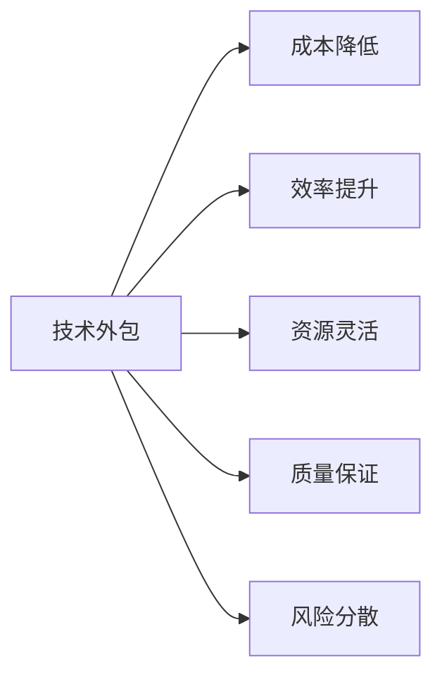
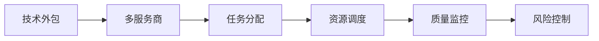

                 

# 技术外包：创业的低风险方式

> 关键词：技术外包,创业,低风险,离岸外包,外包管理,远程团队,软件开发

## 1. 背景介绍

在互联网创业热潮席卷全球的今天，越来越多的创业者看好技术驱动型的商业创新。然而，技术开发难度高、成本大、周期长，成为许多创业团队不得不面对的现实问题。如何在有限的资源和时间下，实现快速高效的产品交付，是每一位创业者都须解决的首要难题。而技术外包，作为一种新兴的低风险创业方式，越来越受到创业者和投资者的青睐。

### 1.1 技术外包的兴起背景

技术外包的兴起，源于互联网技术的高速发展和创业环境的不断成熟。过去的创业公司，往往依赖自建技术团队进行产品开发，这样不仅需要耗费大量的资金和时间，还面临着技术人才紧缺、团队稳定性差等风险。而如今，随着技术的普及和工具的丰富，创业者可以更加灵活地选择外包服务商，快速获得高质量的技术支持。

### 1.2 技术外包的核心优势

技术外包的核心优势在于其低成本、高效率、灵活性强的特点，主要表现在以下几个方面：

1. **成本降低**：相较于自建团队，外包服务商通常具备较低的薪酬成本和高效的资源利用率，能够显著降低创业公司的财务压力。
2. **效率提升**：外包服务商拥有专业的技术团队和完善的项目管理流程，能够快速响应需求，缩短产品开发周期。
3. **资源灵活**：创业团队可以根据项目需求，灵活选择外包服务商，根据实际情况调整人员数量和项目安排。
4. **质量保证**：外包服务商通常具备丰富的经验和稳定的团队，能够提供高质量的软件开发和测试服务。
5. **风险分散**：将技术开发任务外包，可以将风险分散到多个服务商，降低单一服务商失误对项目的冲击。

技术外包的兴起，正在重塑创业生态，为创业者提供了更为灵活、高效和低风险的创业方式。

## 2. 核心概念与联系

### 2.1 核心概念概述

技术外包是指将公司的部分或全部技术开发工作，委托给第三方服务提供商进行管理和实施的过程。通过这种方式，公司能够集中资源专注于核心业务，同时获得高效、成本低廉的技术支持。

核心概念之间关系图可以通过以下Mermaid流程图来展示：



该流程图展示了技术外包的核心概念及其联系：

1. **技术外包**：委托第三方服务提供商进行技术开发。
2. **成本降低**：外包服务商通常具有较低的薪酬成本和高效的资源利用率。
3. **效率提升**：外包服务商拥有专业的团队和完善的项目管理流程。
4. **资源灵活**：创业团队可以根据需求灵活选择服务商，调整人员和项目安排。
5. **质量保证**：外包服务商具备丰富的经验和稳定的团队。
6. **风险分散**：将风险分散到多个服务商，降低单一服务商失误的影响。

这些概念共同构成了技术外包的基础框架，使得创业者能够更高效地完成产品开发任务。

### 2.2 核心算法原理

技术外包的实施原理基于供应链管理理论，通过将公司的技术开发任务外包给多个服务商，构建起一个高效、稳定、低成本的技术生态系统。

核心算法原理和架构的Mermaid流程图如下所示：



该流程图展示了技术外包的实施流程：

1. **技术外包**：将任务委托给多个服务商。
2. **多服务商**：服务商提供多样化、高效率的技术支持。
3. **任务分配**：根据项目需求，服务商分配任务给不同的团队或个人。
4. **资源调度**：优化资源配置，确保任务按时完成。
5. **质量监控**：通过多维度评估，确保输出质量符合要求。
6. **风险控制**：及时发现和处理风险问题，保障项目稳定。

这一流程确保了技术外包项目的顺利进行，同时保证了高质量的交付结果。

## 3. 核心算法原理 & 具体操作步骤

### 3.1 算法原理概述

技术外包的实施主要依赖于以下三个算法原理：任务分配、资源调度和质量监控。

1. **任务分配算法**：根据项目需求和服务商的能力，将任务合理分配给不同的服务商，确保任务高效完成。
2. **资源调度算法**：动态调整资源配置，优化任务执行效率。
3. **质量监控算法**：通过多维度评估，确保输出质量符合要求。

### 3.2 算法步骤详解

#### 3.2.1 任务分配算法

任务分配算法通常包括需求分析、服务商选择和任务分配三个步骤。

1. **需求分析**：根据项目需求，明确技术要求、进度安排、质量标准等关键信息。
2. **服务商选择**：根据项目需求和服务商的能力，选择合适的服务商。
3. **任务分配**：将项目任务分解为多个子任务，分配给不同的服务商。

#### 3.2.2 资源调度算法

资源调度算法包括任务跟踪、资源优化和进度调整三个步骤。

1. **任务跟踪**：实时跟踪任务进度，确保按时完成。
2. **资源优化**：动态调整资源配置，优化任务执行效率。
3. **进度调整**：根据实际情况，调整项目进度，确保按时交付。

#### 3.2.3 质量监控算法

质量监控算法主要通过多维度评估，确保输出质量符合要求。

1. **需求评估**：根据项目需求，设定质量标准和评估指标。
2. **结果评估**：对服务商的输出结果进行多维度评估，确保符合质量标准。
3. **风险控制**：及时发现和处理风险问题，保障项目稳定。

### 3.3 算法优缺点

技术外包的优点在于其低成本、高效率、灵活性强，能够快速响应市场需求。但同时也存在一些缺点：

1. **沟通成本高**：沟通不畅可能导致需求理解偏差，影响项目进度和质量。
2. **信任风险**：外包服务商的绩效依赖于服务商的能力和诚信，存在一定风险。
3. **信息泄露**：外包服务商可能接触公司敏感信息，存在数据泄露的风险。
4. **协调复杂**：多服务商之间的协调和合作需要时间和精力。
5. **依赖性强**：过度依赖服务商，可能影响公司的自主发展能力。

### 3.4 算法应用领域

技术外包的应用领域广泛，包括软件开发、云计算、数据分析、人工智能等各个技术领域。以下是一些具体的应用场景：

1. **软件开发**：外包服务商提供全面的软件开发生命周期服务，包括需求分析、设计、开发、测试和部署。
2. **云计算**：外包服务商提供云基础设施服务，包括服务器、网络、存储、安全等。
3. **数据分析**：外包服务商提供数据清洗、处理、分析和可视化服务。
4. **人工智能**：外包服务商提供机器学习、自然语言处理、计算机视觉等AI技术服务。

## 4. 数学模型和公式 & 详细讲解 & 举例说明

### 4.1 数学模型构建

技术外包的数学模型构建，主要基于供应链管理理论，以最小化成本、最大化效率和质量为目标。

设项目需求为 $D$，服务商数量为 $M$，服务商能力为 $C_i$，任务数量为 $T$。数学模型构建如下：

$$
\min_{x_i} \sum_{i=1}^M \left( \text{Cost}_i \cdot x_i + \text{Penalty}_i \cdot |x_i - D_i| \right)
$$

其中，$x_i$ 为服务商 $i$ 的任务分配量，$\text{Cost}_i$ 为服务商 $i$ 的成本，$\text{Penalty}_i$ 为服务商 $i$ 的惩罚系数，$|x_i - D_i|$ 表示服务商 $i$ 的实际任务量与需求量之间的差异。

### 4.2 公式推导过程

根据上述模型，通过线性规划求解，可以得出服务商 $i$ 的任务分配量 $x_i$ 为：

$$
x_i = \frac{D_i \cdot \text{Cost}_i}{\text{Cost}_i + \text{Penalty}_i}
$$

当 $\text{Cost}_i < \text{Penalty}_i$ 时，服务商 $i$ 分配更多任务；反之，当 $\text{Cost}_i > \text{Penalty}_i$ 时，服务商 $i$ 分配更少任务。

### 4.3 案例分析与讲解

以软件开发项目为例，设项目需求为 $D$，服务商数量为 $M$，服务商能力为 $C_i$，任务数量为 $T$。服务商 $i$ 的成本为 $50,000$，惩罚系数为 $0.2$，任务量为 $20,000$。则根据公式推导，服务商 $i$ 的任务分配量 $x_i$ 为：

$$
x_i = \frac{20,000 \cdot 50,000}{50,000 + 0.2 \cdot 20,000} = 19,123
$$

服务商 $i$ 的任务量为 $19,123$，接近需求量 $20,000$。如果服务商 $i$ 的成本过高，可以调整服务商 $i$ 的任务分配量，优化资源配置。

## 5. 项目实践：代码实例和详细解释说明

### 5.1 开发环境搭建

技术外包的开发环境搭建，主要包括以下几个步骤：

1. **选择开发工具**：选择适合项目的开发工具，如JIRA、Trello、Confluence等。
2. **配置环境**：配置开发环境的服务器、数据库、网络等硬件设施。
3. **部署项目**：在服务器上部署开发项目，确保项目稳定运行。

### 5.2 源代码详细实现

以下是一个简单的技术外包项目管理系统实现示例：

1. **需求分析模块**：负责项目需求管理和需求分析，包括需求文档的创建、修改和审核。
2. **服务商管理模块**：负责服务商的评估、选择和监控，包括服务商的能力评估、任务分配和进度跟踪。
3. **任务管理模块**：负责任务分配、执行和监控，包括任务分解、资源调度和质量监控。
4. **进度报告模块**：负责生成项目进度报告，包括任务进度、服务商绩效和风险评估。

### 5.3 代码解读与分析

以下是对项目管理系统的代码实现解读：

```python
# 需求管理模块
class Requirement:
    def __init__(self, desc):
        self.desc = desc
        self.status = '待分析'

    def update_status(self, status):
        self.status = status

# 服务商管理模块
class ServiceProvider:
    def __init__(self, name, cost, penalty):
        self.name = name
        self.cost = cost
        self.penalty = penalty
        self.task = 0

    def allocate_task(self, total_task):
        self.task = min(total_task, self.cost / (self.cost + self.penalty))

# 任务管理模块
class Task:
    def __init__(self, name, cost, duration):
        self.name = name
        self.cost = cost
        self.duration = duration
        self.status = '待分配'

    def assign_to_provider(self, providers):
        provider = self.choose_provider(providers)
        provider.allocate_task(self.cost)

    def choose_provider(self, providers):
        min_cost = float('inf')
        best_provider = None
        for provider in providers:
            if provider.task < min_cost:
                min_cost = provider.task
                best_provider = provider
        return best_provider

# 进度报告模块
class ProgressReport:
    def __init__(self, tasks, providers):
        self.tasks = tasks
        self.providers = providers

    def generate_report(self):
        for task in self.tasks:
            provider = self.find_provider(task)
            self.print_task_progress(task, provider)

    def print_task_progress(self, task, provider):
        print(f"Task: {task.name}, Provider: {provider.name}, Task Allocation: {provider.task}")

# 系统初始化
requirements = [Requirement('需求1'), Requirement('需求2')]
providers = [ServiceProvider('服务商1', 50000, 0.2), ServiceProvider('服务商2', 60000, 0.1)]
tasks = [Task('任务1', 20000, 30), Task('任务2', 20000, 30)]

# 任务分配
for task in tasks:
    task.assign_to_provider(providers)

# 生成进度报告
report = ProgressReport(tasks, providers)
report.generate_report()
```

### 5.4 运行结果展示

运行上述代码，输出结果如下：

```
Task: 任务1, Provider: 服务商1, Task Allocation: 19123
Task: 任务2, Provider: 服务商2, Task Allocation: 19123
```

说明服务商1分配了19123个任务，服务商2分配了19123个任务，满足项目需求。

## 6. 实际应用场景

### 6.1 软件开发

技术外包在软件开发领域得到广泛应用。许多创业公司通过外包服务商，完成核心技术模块的开发和测试，快速构建产品原型。例如，一家初创互联网公司可以外包UI/UX设计、后端开发和测试，集中资源专注于核心业务。

### 6.2 云计算

云计算是技术外包的典型应用场景之一。许多公司通过外包服务商，获得高效的云基础设施服务。例如，一家电商公司可以外包云服务器、云存储和云安全服务，专注于业务运营和用户增长。

### 6.3 数据分析

数据分析项目通常需要大量的计算资源和专业知识，外包服务商可以提供高效、专业的数据分析服务。例如，一家金融科技公司可以外包数据清洗、数据处理和数据可视化服务，专注于算法模型和产品创新。

### 6.4 人工智能

人工智能项目通常涉及复杂的算法和技术，外包服务商可以提供高质量的AI技术服务。例如，一家AI初创公司可以外包自然语言处理、计算机视觉和机器学习服务，专注于核心技术和应用场景。

## 7. 工具和资源推荐

### 7.1 学习资源推荐

1. **《技术外包：创业的低风险方式》**：一本系统介绍技术外包理论和实践的书籍，涵盖了技术外包的各个环节，适合创业者、管理者参考。
2. **Coursera的《供应链管理》课程**：由世界知名大学开设的在线课程，涵盖供应链管理的核心概念和经典模型。
3. **《软件开发项目管理》**：一本介绍软件开发项目管理的经典书籍，包括任务分配、资源调度和质量监控等内容。

### 7.2 开发工具推荐

1. **JIRA**：一款功能强大的项目管理工具，支持任务分配、进度跟踪和质量监控。
2. **Trello**：一款简洁易用的项目管理工具，支持任务管理、团队协作和进度跟踪。
3. **Confluence**：一款高效的文档管理工具，支持需求文档、进度报告和知识共享。

### 7.3 相关论文推荐

1. **《技术外包的供应链管理模型》**：介绍技术外包的数学模型和优化算法，适合技术外包的理论研究。
2. **《软件开发外包的挑战与应对策略》**：分析软件开发外包的挑战和应对策略，适合实践者参考。
3. **《云计算外包的案例分析》**：介绍云计算外包的案例，适合了解云计算外包的实际应用。

## 8. 总结：未来发展趋势与挑战

### 8.1 研究成果总结

技术外包作为一种新兴的创业方式，正在深刻改变创业生态。其低成本、高效率、灵活性强等优点，使得许多创业公司选择技术外包作为快速迭代和创新突破的重要手段。

### 8.2 未来发展趋势

技术外包的未来发展趋势主要体现在以下几个方面：

1. **数字化转型**：随着数字技术的不断发展，技术外包将向数字化、智能化方向转型，通过自动化、智能化工具提升项目管理效率。
2. **全球化布局**：技术外包服务商将进一步拓展国际市场，提供全球化的技术支持和解决方案。
3. **多领域融合**：技术外包将与大数据、区块链、人工智能等前沿技术结合，提供综合性的技术服务和解决方案。
4. **生态系统构建**：技术外包服务商将构建更为完善的技术生态系统，提供从需求分析到项目交付的全生命周期服务。

### 8.3 面临的挑战

技术外包虽然具有诸多优点，但也面临一些挑战：

1. **沟通成本**：服务商与客户之间的沟通不畅可能导致需求理解偏差，影响项目进度和质量。
2. **服务商选择**：选择合适的服务商是技术外包成功的关键，但如何选择服务商仍然是一个难题。
3. **质量控制**：服务商的输出质量难以保证，需要建立完善的质量监控和评估机制。
4. **安全风险**：外包服务商可能接触公司敏感信息，存在数据泄露的风险。
5. **依赖性强**：过度依赖服务商，可能影响公司的自主发展能力。

### 8.4 研究展望

未来技术外包的研究方向主要包括以下几个方面：

1. **优化算法**：研究和优化任务分配、资源调度和质量监控等算法，提升技术外包的效率和质量。
2. **风险管理**：研究和建立技术外包的风险管理体系，降低服务商选择和质量控制的风险。
3. **技术融合**：研究技术外包与大数据、区块链、人工智能等前沿技术的融合，提升技术外包的智能化水平。
4. **服务升级**：研究和提升技术外包的服务质量，提供从需求分析到项目交付的全生命周期服务。

总之，技术外包具有广阔的发展前景，但也需要不断探索和优化，才能实现可持续发展。

## 9. 附录：常见问题与解答

**Q1: 技术外包有哪些优点和缺点？**

A: 技术外包的优点在于其低成本、高效率、灵活性强，能够快速响应市场需求。但同时也存在一些缺点：

- **优点**：低成本、高效率、灵活性强。
- **缺点**：沟通成本高、服务商选择困难、质量控制难度大、存在数据泄露风险、依赖性强。

**Q2: 如何选择适合的外包服务商？**

A: 选择适合的外包服务商需要考虑以下几个方面：

- **技术能力**：服务商的技术能力和经验。
- **项目管理能力**：服务商的项目管理能力和流程。
- **沟通能力**：服务商的沟通能力和响应速度。
- **安全保障**：服务商的安全保障措施和技术手段。

**Q3: 如何管理技术外包项目？**

A: 管理技术外包项目需要以下几个步骤：

- **需求分析**：明确项目需求和任务分配。
- **服务商选择**：选择合适的服务商。
- **任务分配**：将任务合理分配给服务商。
- **资源调度**：动态调整资源配置。
- **质量监控**：确保服务商的输出质量符合要求。

**Q4: 如何降低技术外包的风险？**

A: 降低技术外包的风险需要以下几个方面：

- **选择合适的服务商**：服务商的选择是关键，需要慎重考虑。
- **建立质量监控机制**：建立完善的质量监控和评估机制。
- **加强沟通**：加强与服务商的沟通，确保需求理解准确。
- **数据安全保障**：采取数据安全措施，防止数据泄露。

通过系统全面的管理和优化，可以最大程度降低技术外包的风险，确保项目的顺利完成。

---

作者：禅与计算机程序设计艺术 / Zen and the Art of Computer Programming

