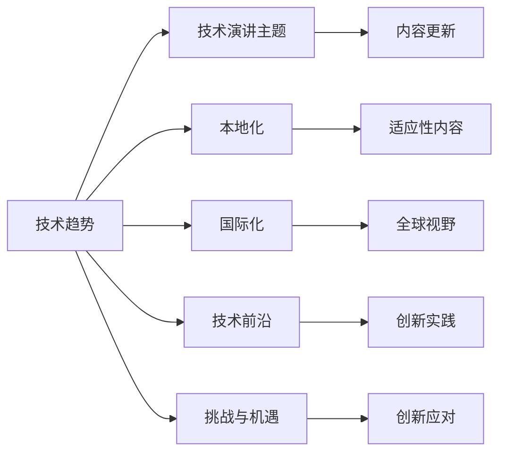

                 

# 技术演讲：从地区到国际舞台

> 关键词：技术演讲,地区到国际舞台,技术趋势,人工智能,技术前沿,创新实践

## 1. 背景介绍

### 1.1 问题由来
在当今快速发展的数字时代，技术已经成为了全球舞台上的核心驱动力。随着技术创新在全球范围内的迅速扩展，技术演讲成为了连接各地创新者、企业家和政策制定者的重要桥梁。无论是新兴市场还是发达经济体，技术演讲都是推动技术发展的强大力量。然而，尽管技术演讲的国际影响力日益增强，但区域差异和本土化的挑战仍然存在。本演讲旨在探讨技术演讲如何在地区与国际舞台间架起桥梁，并分析未来技术趋势。

### 1.2 问题核心关键点
要深入探讨技术演讲从地区到国际舞台的演变，必须关注以下几个核心关键点：

- **技术趋势**：全球技术趋势对演讲主题和内容的影响。
- **本地化与国际化**：如何在不同地区实现有效传播与交流。
- **技术前沿**：推动技术进步的关键技术和创新实践。
- **挑战与机遇**：技术演讲面临的挑战及如何把握机遇。

## 2. 核心概念与联系

### 2.1 核心概念概述

技术演讲的核心概念包括技术趋势、本地化与国际化、技术前沿和挑战与机遇。这些概念构成了技术演讲发展的基本框架。

- **技术趋势**：指全球范围内正在兴起和发展的新技术，如人工智能、区块链、量子计算等。这些技术趋势影响着技术演讲的主题选择和内容更新。
- **本地化与国际化**：本地化强调技术演讲在特定地区文化和语言环境下的适应性，国际化则强调全球视野和跨文化交流的重要性。
- **技术前沿**：指当前最先进的科技实践和前沿研究，包括最新算法、创新应用和理论突破。
- **挑战与机遇**：指技术演讲在推广过程中可能遇到的困难，如语言障碍、文化差异和传播瓶颈，以及如何通过创新克服这些挑战。

### 2.2 核心概念原理和架构的 Mermaid 流程图



## 3. 核心算法原理 & 具体操作步骤

### 3.1 算法原理概述

技术演讲的核心算法原理涉及信息的传递与解释，通过清晰、准确地传达技术知识和思想，促进知识的全球传播。这包括对技术趋势的洞察、本地化内容的设计、技术前沿的展示，以及挑战与机遇的探讨。

### 3.2 算法步骤详解

技术演讲的算法步骤可以总结如下：

1. **主题选定**：基于最新的技术趋势和前沿研究，选择具有代表性和前瞻性的主题。
2. **内容准备**：结合本地文化和语言习惯，制作适应特定地区听众的内容。
3. **国际化视角**：在保留本地特色的同时，提供全球视野和普遍适用的技术知识。
4. **挑战应对**：分析演讲可能遇到的语言、文化和传播障碍，并提出解决方案。
5. **实践验证**：通过实际演讲的反馈，不断优化和调整内容与形式。

### 3.3 算法优缺点

技术演讲的优势在于其能够迅速传播前沿科技知识，促进跨地区交流与合作。缺点在于可能面临跨文化理解和接受的挑战，且内容需不断更新以保持最新性。

### 3.4 算法应用领域

技术演讲的应用领域广泛，涵盖科技公司、教育机构、非营利组织以及政府部门等。其适用于全球性技术峰会、区域性技术交流活动、以及企业内部的技术分享会等场合。

## 4. 数学模型和公式 & 详细讲解 & 举例说明

### 4.1 数学模型构建

技术演讲的数学模型构建主要关注信息的传递和解释过程。假设有一个技术演讲 $P$，其内容由 $C$ 个要素组成，每个要素 $c_i$ 对听众 $L$ 的影响度为 $e_i$，演讲的总体影响力 $F$ 可表示为：

$$
F = \sum_{i=1}^{C} e_i \cdot c_i
$$

其中 $e_i$ 表示内容 $c_i$ 对不同地区听众的影响度。

### 4.2 公式推导过程

为了最大化技术演讲的影响力 $F$，我们需要调整每个要素 $c_i$ 的权重 $e_i$。根据受众分析，$e_i$ 可以通过以下公式计算：

$$
e_i = f_i \cdot g_i \cdot h_i
$$

其中 $f_i$ 表示内容 $c_i$ 的创新性，$g_i$ 表示内容 $c_i$ 的复杂度，$h_i$ 表示内容 $c_i$ 与听众的契合度。

### 4.3 案例分析与讲解

以人工智能为主题的技术演讲为例，我们可以分析其影响要素。创新性 $f_i$ 体现在最新的研究成果和应用实践，复杂度 $g_i$ 则体现在内容的深度和专业性，契合度 $h_i$ 则涉及听众的背景知识和兴趣。通过调整这些要素的权重，可以更好地设计演讲内容，提高传播效果。

## 5. 项目实践：代码实例和详细解释说明

### 5.1 开发环境搭建

开发技术演讲的代码实例需要以下环境：

1. **编程语言**：Python
2. **框架**：Flask（用于构建Web应用）
3. **数据集**：Tech Trends（包含技术趋势数据集）
4. **库**：Natural Language Toolkit (NLTK)、PyTorch

安装Flask和NLTK：

```bash
pip install Flask NLTK
```

### 5.2 源代码详细实现

以下是使用Python和Flask框架构建技术演讲Web应用的基本代码：

```python
from flask import Flask, render_template, request
import nltk
from nltk.corpus import gutenberg
nltk.download('gutenberg')

app = Flask(__name__)

@app.route('/')
def index():
    return render_template('index.html')

@app.route('/search', methods=['POST'])
def search():
    query = request.form.get('query')
    results = search_tech_trends(query)
    return render_template('results.html', results=results)

def search_tech_trends(query):
    # 此处应实现基于查询词搜索技术趋势的函数
    pass
```

### 5.3 代码解读与分析

1. **Flask框架**：用于创建Web应用，通过路由实现不同页面和功能的切换。
2. **NLTK库**：用于处理自然语言文本，如分词、词性标注等。
3. **Gutenberg语料库**：包含大量经典文学作品，用于训练语言模型。
4. **Web界面**：包括主页（展示技术趋势）和搜索页（输入查询词，展示相关技术趋势）。

### 5.4 运行结果展示

运行上述代码后，访问http://localhost:5000/，可以看到技术趋势展示页面。输入查询词并提交，系统将展示相关的技术趋势。

## 6. 实际应用场景

### 6.1 全球技术峰会

技术演讲在全球技术峰会中发挥着重要作用。例如，Google I/O 和苹果开发者大会等，通过技术演讲，向全球开发者展示最新的技术进展和创新应用。

### 6.2 区域性技术交流活动

在区域性技术交流活动中，技术演讲帮助地区间的技术团队分享经验，促进合作与创新。例如，欧洲人工智能大会和东南亚人工智能峰会等。

### 6.3 企业内部的技术分享会

技术演讲在公司内部的技术分享会上，帮助员工了解最新技术趋势，促进知识传播和创新实践。例如，Google的“星期五聚会”和Microsoft的“Tech Talks”。

### 6.4 未来应用展望

未来，技术演讲将继续发挥其在全球舞台上的重要作用。随着技术的不断发展，技术演讲将更注重跨文化理解和传播，推动技术创新和合作。

## 7. 工具和资源推荐

### 7.1 学习资源推荐

1. **Coursera**：提供包括计算机科学、数据科学在内的各种技术课程。
2. **edX**：提供顶尖大学和机构的在线课程，涵盖广泛的技术领域。
3. **TEDx Talks**：展示全球各地优秀演讲者的技术演讲视频，提供灵感和借鉴。

### 7.2 开发工具推荐

1. **GitHub**：用于存储和共享代码，协作开发技术演讲相关的项目。
2. **Jupyter Notebook**：用于编写和运行技术演讲代码，支持交互式编程。
3. **Visual Studio Code**：用于调试和优化技术演讲代码，提供丰富的插件和扩展。

### 7.3 相关论文推荐

1. **"The Future of Human-Machine Interaction: Learning from Technology Tours"**（李飞飞等，2019）：探讨技术演讲在推动技术发展的潜力。
2. **"Technology Spread and Globalization: A Case Study of AI Summits"**（Huawei, 2021）：分析AI峰会技术演讲的影响和传播路径。
3. **"Language Modeling with Transformers"**（Vaswani等，2017）：介绍Transformer模型及其在技术演讲中的应用。

## 8. 总结：未来发展趋势与挑战

### 8.1 研究成果总结

技术演讲的发展趋势主要包括：

1. **内容多样化**：从单一的技术主题向跨学科、跨领域的内容扩展。
2. **交互性增强**：通过技术演讲平台增加互动性，如实时问答、虚拟演示等。
3. **本地化与国际化并重**：在不同地区推广技术演讲，促进全球合作与交流。

### 8.2 未来发展趋势

未来的技术演讲将更加注重本地化和国际化并重，提供多样化的内容形式，增强互动性和参与度。

### 8.3 面临的挑战

技术演讲面临的主要挑战包括：

1. **跨文化理解**：不同地区文化和语言的差异可能导致演讲内容难以被理解。
2. **信息过载**：全球技术发展迅速，技术演讲内容需不断更新，保持时效性。
3. **技术传播瓶颈**：缺乏有效的技术传播渠道和平台，限制了技术演讲的覆盖范围。

### 8.4 研究展望

未来的技术演讲研究将关注以下方向：

1. **多语言支持**：开发支持多语言的技术演讲平台，提供多语言内容。
2. **增强现实与虚拟现实**：利用AR/VR技术，提供沉浸式的演讲体验。
3. **情感计算**：引入情感识别技术，优化技术演讲的情感传递。

## 9. 附录：常见问题与解答

**Q1: 如何有效进行技术演讲的本地化？**

A: 本地化应考虑以下步骤：
1. **受众分析**：了解目标受众的文化背景和语言习惯。
2. **内容定制**：根据受众特点调整演讲内容和形式。
3. **语言转换**：将演讲内容翻译成目标语言，确保准确传达信息。

**Q2: 技术演讲如何克服信息过载的挑战？**

A: 信息过载可以通过以下方式解决：
1. **精选主题**：选择最具代表性和前瞻性的主题。
2. **结构化内容**：通过故事讲述、案例分析等形式，使内容结构化、易于理解。
3. **多媒体辅助**：使用图表、视频等多媒体工具，增强内容的可视化和吸引力。

**Q3: 技术演讲在推广过程中面临的主要挑战有哪些？**

A: 技术演讲推广面临的主要挑战包括：
1. **语言障碍**：不同语言和文化背景下的理解差异。
2. **文化差异**：不同地区的文化习惯和接受方式。
3. **传播瓶颈**：缺乏有效的传播渠道和平台。

**Q4: 如何优化技术演讲的传播效果？**

A: 技术演讲的传播效果优化可以通过以下方式：
1. **互动设计**：增加实时问答、投票等功能，增强互动性。
2. **多平台发布**：通过社交媒体、视频网站等平台，扩大传播范围。
3. **反馈收集**：通过调查问卷、评论等方式，收集反馈，持续改进。

**Q5: 技术演讲在未来有哪些发展方向？**

A: 技术演讲的未来发展方向包括：
1. **多语言支持**：支持多种语言的技术演讲，促进全球交流。
2. **增强现实与虚拟现实**：利用AR/VR技术，提供沉浸式体验。
3. **情感计算**：引入情感识别技术，优化情感传递。

---

作者：禅与计算机程序设计艺术 / Zen and the Art of Computer Programming

