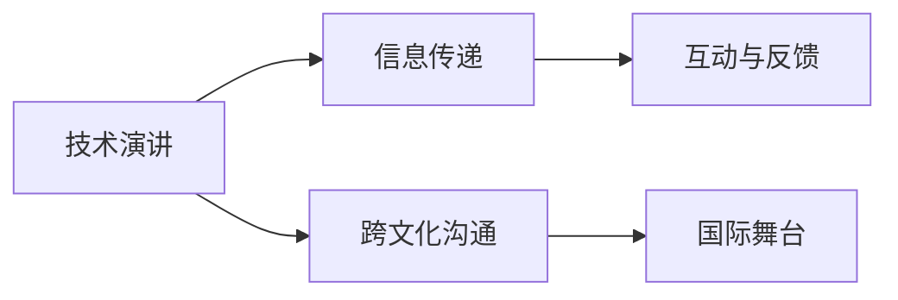

                 

# 技术演讲：从地区到国际舞台

> 关键词：技术演讲,国际舞台,人工智能,创新科技,数字时代

## 1. 背景介绍

### 1.1 技术演讲的演变

技术演讲是人类智慧与科技结合的结晶，是跨地域、跨文化、跨行业知识交流的重要桥梁。从最初的学术会议、工程论坛到现在的技术大会、行业峰会，技术演讲的形式和内容不断演变，成为展示创新成果、推动行业发展的重要平台。

### 1.2 国际舞台的机遇与挑战

在数字时代，技术演讲不再局限于地域限制，而是成为全球技术交流的重要工具。各大国际技术会议如CES、CES Asia、CCF等，吸引全球顶尖科技公司、学术机构和专业人士参与，共同探讨前沿技术、分享最佳实践、促进合作创新。然而，这也带来了挑战：如何在技术演讲中跨越语言、文化和认知差异，让全球观众理解和接受你的思想？

## 2. 核心概念与联系

### 2.1 核心概念概述

在技术演讲中，掌握核心概念是成功的关键。以下是几个必须理解的核心概念：

- **技术演讲**：以技术为主题的演讲，旨在分享创新成果、推动行业发展。
- **国际舞台**：全球技术会议、论坛等国际技术交流平台。
- **跨文化沟通**：在演讲中跨越语言、文化和认知差异，让不同背景的听众理解并接受演讲内容。
- **信息传递**：有效传达技术信息、观点和创新思想，促进知识交流和合作。
- **互动与反馈**：通过问答、讨论等形式，与听众互动，收集反馈，提升演讲效果。

这些概念通过以下Mermaid流程图展示它们之间的联系：



### 2.2 核心概念原理和架构

技术演讲的本质是将复杂技术问题简化，通过生动的语言、丰富的案例和互动手段，将技术原理、创新成果和未来趋势传递给听众。其核心在于：

- **内容的高度凝练**：将庞杂的技术信息提炼为易于理解的关键点，避免过多专业术语。
- **案例的精准选择**：结合具体案例和数据，生动展示技术的应用和影响。
- **语言的通俗易懂**：使用形象生动的比喻和类比，让非专业人士也能理解技术内容。
- **互动的灵活运用**：通过提问、投票、现场演示等手段，增强听众的参与感和体验感。

## 3. 核心算法原理 & 具体操作步骤

### 3.1 算法原理概述

技术演讲的成功，往往依赖于一套完整的算法原理。这里介绍一些核心的演讲技巧：

- **故事化讲述**：通过讲述引人入胜的故事，将技术信息嵌入故事情节，使听众更加容易理解和记忆。
- **关键点提炼**：识别出技术演讲的核心要点，将这些关键点贯穿始终，帮助听众抓住演讲主旨。
- **视觉辅助工具**：利用幻灯片、图表、视频等多媒体工具，增强信息传递的直观性。
- **现场互动**：通过提问、投票、现场演示等方式，激发听众的兴趣和参与感。

### 3.2 算法步骤详解

技术演讲的具体操作分为以下几个步骤：

**Step 1: 准备内容**
- 确定演讲主题和目标，确保内容贴近听众需求。
- 精炼演讲内容，提炼核心要点，避免冗长。

**Step 2: 设计演讲框架**
- 安排演讲结构，如引言、主体、结论，保证逻辑清晰。
- 设计互动环节，如提问、投票、现场演示，增强参与感。

**Step 3: 制作演讲材料**
- 制作PPT、视频等辅助材料，确保视觉呈现的专业性和美观性。
- 准备演讲稿，注意语速、语调，避免过快或单调。

**Step 4: 练习和优化**
- 多次练习演讲，确保内容的流畅性和自信心。
- 收集反馈，根据听众反应优化演讲内容。

**Step 5: 现场演讲**
- 确保现场设备正常运行，避免技术问题。
- 灵活应对现场变化，如突发问题，保持镇定和幽默感。

### 3.3 算法优缺点

技术演讲的优势在于：
- **跨越地域限制**：通过技术演讲，可以在全球范围内进行知识分享和交流。
- **推广创新成果**：高质量的演讲能够有效传达技术信息，推动行业发展。
- **促进合作交流**：演讲中的互动环节，有助于建立联系，促进合作。

然而，技术演讲也面临一些挑战：
- **语言和文化障碍**：不同语言和文化背景的听众可能难以完全理解演讲内容。
- **信息量过大**：演讲时间有限，难以涵盖所有信息。
- **观众注意力分散**：长时间的信息传递容易使听众疲劳，难以保持全程关注。

### 3.4 算法应用领域

技术演讲不仅在科技公司、学术界得到广泛应用，也在教育、医疗、政府等多个领域推广先进技术。

- **教育领域**：通过技术演讲，教授学生科技知识，激发学习兴趣。
- **医疗领域**：向医务人员介绍最新医疗技术，推动医疗创新。
- **政府部门**：向政策制定者展示技术成果，支持政策制定。
- **企业培训**：通过技术演讲，培训员工，提升企业竞争力。

## 4. 数学模型和公式 & 详细讲解 & 举例说明

### 4.1 数学模型构建

技术演讲的数学模型可以简化为以下公式：

$$
\text{演讲效果} = f(\text{内容质量}, \text{语言表达}, \text{视觉辅助}, \text{互动反馈})
$$

其中，$f$ 为函数关系，表示演讲效果随各因素变化的综合影响。

### 4.2 公式推导过程

我们可以通过分析公式，推导出提高演讲效果的几个关键点：

- **内容质量**：高质量的演讲内容能够有效传达技术信息，吸引听众注意力。
- **语言表达**：生动的语言和形象的比喻，能够简化技术原理，使听众易于理解。
- **视觉辅助**：多媒体工具增强了信息传递的直观性和吸引力。
- **互动反馈**：听众的参与感和互动反馈，能够提升演讲效果，增强记忆。

### 4.3 案例分析与讲解

以“区块链技术在金融领域的应用”为例，展示如何通过技术演讲将复杂技术信息传递给听众：

1. **引言**：解释区块链的基本概念，引入演讲主题。
2. **主体**：通过案例分析，展示区块链技术在支付、清算、合规等方面的应用。
3. **结论**：总结区块链技术的优势和未来前景，提出可能的挑战和应对措施。

## 5. 项目实践：代码实例和详细解释说明

### 5.1 开发环境搭建

技术演讲的开发环境包括PPT制作工具和现场演示设备。建议使用Microsoft PowerPoint或Keynote等专业软件，以及高分辨率投影仪和麦克风等硬件设备。

### 5.2 源代码详细实现

技术演讲的代码实现主要涉及PPT的制作和演示脚本的编写。这里以Microsoft PowerPoint为例，介绍演讲材料的制作过程：

1. **幻灯片制作**：使用幻灯片模板，添加图表、图片和视频等多媒体元素。
2. **演讲稿编写**：撰写流畅的演讲稿，注意语速和语调，避免专业术语过多。
3. **演示脚本编写**：编写现场演示脚本，包括提问、投票等互动环节的设计。

### 5.3 代码解读与分析

技术演讲的代码实现相对简单，主要涉及PPT的制作和演示脚本的编写。代码的核心在于确保内容的专业性和互动的灵活性，以下是示例代码：

```python
import matplotlib.pyplot as plt

# 创建幻灯片
def create_slide(title, content):
    # 添加标题和内容
    plt.title(title)
    plt.text(0.1, 0.9, content, ha='left', va='top', transform=plt.gca().transAxes)
    plt.show()

# 演示脚本编写
def demo_script():
    # 添加现场演示脚本，包括提问、投票等环节
    print("现在开始现场演示，请各位认真听讲。")
    # 演示第一个案例
    create_slide("区块链技术的基本概念", "区块链是一种分布式账本技术，通过去中心化方式记录交易数据。")
    # 演示第二个案例
    create_slide("区块链在金融支付中的应用", "区块链通过智能合约自动执行支付，提升交易效率和安全性。")
    # 提问环节
    print("请问，区块链技术在金融支付中的优势是什么？")
    # 投票环节
    # 统计投票结果，展示分析结果
    print("感谢大家的参与，我们接下来进行总结。")
    # 总结环节
    create_slide("区块链技术的优势与未来前景", "区块链技术具有去中心化、安全性、透明性等优势，未来在金融、供应链等领域将有广泛应用。")

# 调用函数进行演示
demo_script()
```

### 5.4 运行结果展示

上述代码的运行结果将展示一个简单的技术演讲过程，包括标题、内容、多媒体元素和互动环节。演示结束后，可以通过提问和投票环节，与听众互动，收集反馈。

## 6. 实际应用场景

### 6.1 教育课堂

技术演讲在教育课堂上，可以生动有趣地展示科技知识，激发学生对技术的兴趣和理解。例如，通过演讲区块链技术，学生不仅了解其基本原理，还能通过实际案例理解其在金融支付中的应用。

### 6.2 企业培训

企业通过技术演讲，向员工介绍最新技术，提升其专业技能和工作效率。例如，通过演讲区块链技术，员工能够理解其基本概念和应用场景，推动企业内部的技术革新和业务提升。

### 6.3 政府政策制定

政府通过技术演讲，向政策制定者展示最新技术成果，支持政策制定。例如，通过演讲区块链技术在医疗、教育等领域的创新应用，政府能够制定更具前瞻性的政策，推动社会进步。

### 6.4 国际会议

技术演讲在国际会议中，展示中国在人工智能、量子计算等领域的最新进展，推动国际科技合作。例如，通过演讲区块链技术，展示中国在金融科技、供应链管理等方面的创新成果，增强国际影响力。

## 7. 工具和资源推荐

### 7.1 学习资源推荐

1. **《TED Talks: The Official TED Guide to Public Speaking》**：TED Talks作为技术演讲的典范，本书提供了大量优秀演讲的案例分析和实战技巧，适合所有技术演讲的初学者。
2. **《演讲的力量》**：这本书由Natasha Remers和Julian Treasure合著，详细介绍了演讲的技巧和策略，是提升演讲能力的优秀读物。
3. **《TED演讲与培训课程》**：在线课程平台如Udemy、Coursera等提供的TED演讲培训课程，提供了丰富的演讲练习和互动反馈。

### 7.2 开发工具推荐

1. **Microsoft PowerPoint/Keynote**：专业的幻灯片制作工具，支持丰富的多媒体元素和互动设计。
2. **Zoom/Google Meet**：视频会议工具，支持远程演讲和互动。
3. **Prezi**：创新的幻灯片制作工具，支持动态展示和互动设计。

### 7.3 相关论文推荐

1. **《技术演讲的心理学原理》**：探讨技术演讲的心理机制和观众接受度，有助于理解演讲的底层原理。
2. **《跨文化技术传播的策略》**：研究如何通过跨文化技术演讲，提升不同文化背景听众的理解和接受度。
3. **《技术演讲的创新与实践》**：收集了众多成功的技术演讲案例，提供了宝贵的实践经验和理论支持。

## 8. 总结：未来发展趋势与挑战

### 8.1 研究成果总结

技术演讲作为技术传播的重要手段，经历了从学术会议到国际会议的发展历程，已经成为推动技术创新和行业发展的重要平台。随着技术演讲的普及和提升，其影响力不断扩大，未来将更加多样化和全球化。

### 8.2 未来发展趋势

1. **虚拟技术的应用**：虚拟现实(VR)和增强现实(AR)技术的应用，将提升技术演讲的互动性和沉浸感，增强听众的体验和参与度。
2. **语言和文化的多样性**：跨语言、跨文化的技术演讲将更加普遍，通过翻译和本地化，打破地域限制，实现全球知识共享。
3. **数据驱动的演讲**：大数据和人工智能技术的应用，将使技术演讲更具个性化和精准度，根据听众背景和兴趣，提供定制化的内容。

### 8.3 面临的挑战

技术演讲的普及和发展，也面临一些挑战：

1. **信息过载**：随着技术演讲的增多，如何筛选高质量的演讲内容，避免信息过载，成为关键问题。
2. **语言和文化差异**：不同语言和文化背景的听众，可能难以完全理解演讲内容，如何跨越这些差异，提高理解度，是重要挑战。
3. **演讲效果评估**：如何科学评估技术演讲的效果，建立标准化的评估体系，也是未来需要解决的问题。

### 8.4 研究展望

未来，技术演讲的研究方向将集中在以下几个方面：

1. **演讲内容的自动化生成**：利用自然语言处理技术，自动生成高质量的演讲稿和PPT，提升演讲效率和效果。
2. **跨语言文化的研究**：深入研究跨语言文化的技术演讲，建立通用的演讲模型和框架，提高演讲的可接受度。
3. **交互式演讲系统**：开发交互式演讲系统，结合AI技术，根据听众的反应动态调整演讲内容，提升互动性和参与感。

## 9. 附录：常见问题与解答

**Q1：如何提高技术演讲的互动性？**

A: 互动性是技术演讲的核心，以下是一些提高互动性的方法：
1. **提问环节**：在演讲过程中，适时提出问题，引导听众思考和回答，增加互动。
2. **现场投票**：通过现场投票或在线投票，收集听众意见，展示分析结果，增加参与感。
3. **现场演示**：通过实际操作、模拟演示等方式，展示技术应用和效果，增强互动效果。

**Q2：如何选择演讲主题？**

A: 选择演讲主题应考虑以下因素：
1. **目标听众**：了解听众的背景、兴趣和需求，选择与听众相关的主题。
2. **技术前沿**：选择最新、最有前景的技术主题，展示技术进步和创新。
3. **案例丰富**：选择有丰富实际案例的主题，通过具体案例展示技术应用和效果。

**Q3：如何准备演讲稿？**

A: 准备演讲稿应遵循以下步骤：
1. **核心要点提炼**：将技术信息提炼为易于理解的关键点，避免冗长。
2. **逻辑清晰**：安排好演讲结构，确保内容逻辑清晰，易于听众理解。
3. **生动的语言**：使用形象生动的比喻和类比，使技术内容易于理解。

**Q4：如何克服语言和文化障碍？**

A: 克服语言和文化障碍需要多方面的努力：
1. **翻译和本地化**：提供多语言版本的演讲内容，并进行本地化处理，适应不同语言和文化背景的听众。
2. **跨文化培训**：对演讲者进行跨文化培训，提高其跨文化沟通能力。
3. **文化适应性设计**：在演讲内容中加入文化适应性元素，增加文化共鸣。

---

作者：禅与计算机程序设计艺术 / Zen and the Art of Computer Programming

