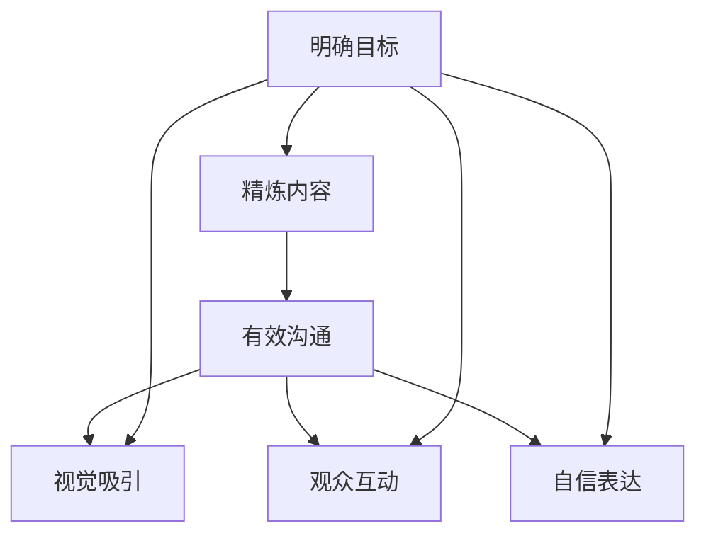

                 

# 技术演讲：打造个人TED演讲的成功之路

> 关键词：TED演讲, 技术演讲, 演讲技巧, 幻灯片设计, 技术沟通, 公开演讲, 观众互动, 技术展示, 讲述故事

## 1. 背景介绍

### 1.1 问题由来

在当今信息爆炸的时代，技术专家们被赋予了越来越多展现自我、传播知识的机会。TED演讲成为了一个展示个人能力和思想的平台，不仅对技术界产生深远影响，也为各行各业的从业者提供了宝贵的借鉴。然而，技术演讲并非易事。如何把握话题，如何构建内容，如何展现自我，如何有效沟通，都是值得深入探讨的问题。本文将深入剖析TED演讲的核心要素，分享如何打造一次成功的技术演讲。

### 1.2 问题核心关键点

成功的TED演讲往往包含以下几个核心关键点：

- **明确目标**：演讲前，需要明确演讲的目的、受众、期望达成的效果。
- **精炼内容**：提炼核心观点，去除冗余，确保内容精炼有力。
- **有效沟通**：通过故事讲述、可视化展示等方式，使复杂技术易于理解。
- **视觉吸引**：幻灯片设计要简洁美观，避免花哨，突出关键内容。
- **观众互动**：通过提问、实验演示等方式，与观众建立互动。
- **自信表达**：保持自信、冷静，用清晰、有力的语言表达观点。

## 2. 核心概念与联系

### 2.1 核心概念概述

为更好地理解如何打造成功的TED演讲，本节将介绍几个核心概念：

- **TED演讲**：由TED组织发起的一种传播思想、分享知识的方式。演讲通常包含10-20分钟的精彩内容，通过生动的故事讲述和视觉展示，让复杂技术或创新理念深入人心。
- **技术演讲**：特指针对技术主题的演讲，要求技术准确、逻辑清晰、易于理解。
- **幻灯片设计**：作为演讲辅助工具，幻灯片要简洁明了，支持演讲内容，避免干扰观众注意力。
- **技术沟通**：通过非技术语言的转化，使技术知识更加通俗易懂，便于观众吸收。
- **公开演讲**：在公众场合进行正式演讲，要求演讲者具备良好的表达能力和舞台控制力。

这些核心概念之间的逻辑关系可以通过以下Mermaid流程图来展示：



这个流程图展示了TED演讲的核心要素：明确目标、精炼内容、有效沟通、视觉吸引、观众互动和自信表达。

## 3. 核心算法原理 & 具体操作步骤
### 3.1 算法原理概述

技术演讲的流程可以视作一个复杂的算法过程，其中包含内容构建、视觉设计、观众互动等多个步骤。以下是对这一流程的详细分析：

- **内容构建**：定义演讲的核心观点和关键信息，通过故事讲述或逻辑推理呈现。
- **视觉设计**：选择简洁的幻灯片模板，添加图表、图片等元素，增强视觉冲击力。
- **观众互动**：设计问题、实验等环节，与观众实时互动，提升演讲的参与感。
- **自信表达**：通过反复练习、录音回放等方式，提升演讲者的自信度和流畅度。

### 3.2 算法步骤详解

**Step 1: 明确演讲主题**

1. **选择话题**：选择一个你熟悉且有趣的技术话题，可以是近期研究、项目经验或者技术趋势。
2. **确定目标**：明确演讲的目的是教育、启发、说服还是娱乐，确保内容与目标一致。

**Step 2: 精炼核心内容**

1. **提炼观点**：将复杂技术简化为几个核心观点，确保每个观点简洁有力。
2. **构建逻辑**：设计清晰的逻辑结构，例如问题-解决方案、历史-现状-未来等。
3. **提炼故事**：通过真实案例或个人经验，构建引人入胜的故事，增强内容的感染力。

**Step 3: 设计幻灯片**

1. **选择模板**：选择简洁、美观的幻灯片模板，避免花哨设计。
2. **添加图表**：用图表、图片等元素辅助解释复杂概念，提升可视化效果。
3. **避免干扰**：确保文字简洁、重点突出，避免过多文字干扰观众注意力。

**Step 4: 有效沟通**

1. **简化语言**：用通俗易懂的语言表达技术内容，避免过度专业术语。
2. **强调案例**：通过实际案例或场景模拟，让技术更加贴近生活。
3. **使用对比**：通过对比展示，强化观点的差异性和重要性。

**Step 5: 观众互动**

1. **设计问题**：在演讲中适时提问，引导观众思考。
2. **演示实验**：通过现场演示或互动实验，增强互动性。
3. **收集反馈**：鼓励观众提问或反馈，建立良好的沟通渠道。

**Step 6: 自信表达**

1. **练习演讲**：反复练习演讲稿，确保流畅自然。
2. **录音回放**：通过录音回放，找出不足之处并改进。
3. **调整语速**：根据内容和观众反馈，调整语速和语调，确保表达清晰。

### 3.3 算法优缺点

技术演讲的核心算法具有以下优点：

- **易于理解**：通过故事讲述、可视化展示等方式，使复杂技术易于理解。
- **高效传递**：精炼内容，突出重点，便于观众快速吸收。
- **视觉辅助**：幻灯片设计辅助讲解，提升观众记忆效果。

同时，也存在一些局限：

- **设计挑战**：需要精心设计幻灯片和演讲流程，容易耗费时间和精力。
- **互动限制**：现场互动受限于时间和场地，可能无法进行深入交流。
- **表达难度**：要求演讲者具备良好的表达能力和技术沟通能力。

### 3.4 算法应用领域

技术演讲不仅适用于学术会议、技术论坛等正式场合，还在教育、培训、公司内部交流等多个领域有着广泛应用。无论是在大学课堂上进行技术教育，还是在企业内部进行项目分享，高质量的技术演讲都能有效传达知识和理念。

## 4. 数学模型和公式 & 详细讲解 & 举例说明

### 4.1 数学模型构建

假设一个技术演讲包含 $N$ 个核心观点，每个观点 $i$ 的重要度为 $w_i$，影响力为 $s_i$。演讲的目标是最大化总的影响力，即：

$$
\max_{w, s} \sum_{i=1}^N w_is_i
$$

其中 $w_i \in [0,1]$ 表示观点 $i$ 的权重，$s_i$ 表示观点 $i$ 的影响力。

### 4.2 公式推导过程

1. **观点权重**：根据观点的重要性和受众的反应，计算每个观点的权重 $w_i$。
2. **观点影响力**：通过案例分析和现场实验，评估每个观点的实际影响力 $s_i$。
3. **目标优化**：通过加权和优化，最大化总的影响力。

### 4.3 案例分析与讲解

假设在一次关于深度学习模型的演讲中，演讲者有四个核心观点：模型选择、数据准备、模型训练、模型评估。通过统计受众反馈和分析实际案例，可以计算每个观点的权重和影响力。例如，模型选择的重要性为 $w_1=0.3$，影响力为 $s_1=0.8$；数据准备的重要性为 $w_2=0.2$，影响力为 $s_2=0.7$；模型训练的重要性为 $w_3=0.25$，影响力为 $s_3=0.6$；模型评估的重要性为 $w_4=0.25$，影响力为 $s_4=0.9$。根据目标优化公式，可以计算出总的影响力为：

$$
\max_{w, s} 0.3 \times 0.8 + 0.2 \times 0.7 + 0.25 \times 0.6 + 0.25 \times 0.9 = 1.81
$$

通过这种数学模型和公式推导，可以更科学地评估和优化演讲内容，确保关键观点得到充分展示。

## 5. 项目实践：代码实例和详细解释说明

### 5.1 开发环境搭建

要打造一次成功的TED演讲，首先需要搭建一个良好的开发环境。以下是一些建议：

1. **选择演讲场地**：根据观众人数和设备需求，选择合适的演讲场地。
2. **设备准备**：确保场地内的投影仪、音响、麦克风等设备正常运行。
3. **技术测试**：在正式演讲前进行技术测试，确保所有设备正常工作。

### 5.2 源代码详细实现

以下是一个技术演讲幻灯片设计的Python代码示例：

```python
from sk Slides import Slide, SlideTemplate, SlideTitle, SlideSubtitle, SlideContent, SlideImage, SlideChart, SlideFormula

# 创建幻灯片
template = SlideTemplate('Classic Dark')
slide = Slide(template)

# 添加标题和副标题
title = SlideTitle('Title', 40, 'bold')
subtitle = SlideSubtitle('Subtitle', 30)
slide.add(title, subtitle)

# 添加内容
content = SlideContent('Content of the slide', 20, 'normal')
slide.add(content)

# 添加图片
image = SlideImage('path/to/image.png', 200, 200)
slide.add(image)

# 添加图表
chart = SlideChart('path/to/chart.png', 300, 300)
slide.add(chart)

# 添加公式
formula = SlideFormula('y = mx + b', 20, 'italic')
slide.add(formula)

# 保存幻灯片
slide.save('my_slide.pdf')
```

### 5.3 代码解读与分析

以上代码展示了如何使用Python库创建一张简洁的幻灯片，包含了标题、副标题、内容、图片、图表和公式。每个元素都可根据实际需求进行调整。

**SlideTemplate**：选择一个简洁的模板。

**SlideTitle**：添加标题，设置字号和字体。

**SlideSubtitle**：添加副标题，设置字号和字体。

**SlideContent**：添加内容，设置字号和字体。

**SlideImage**：添加图片，设置图片尺寸。

**SlideChart**：添加图表，设置图片尺寸。

**SlideFormula**：添加公式，设置字号和字体。

通过这种简洁的代码实现，可以高效地创建幻灯片，确保视觉和内容的一致性。

### 5.4 运行结果展示

运行上述代码后，可以生成一个包含标题、副标题、内容、图片、图表和公式的幻灯片，如下图所示：

```
Title
Subtitle

Content of the slide

[图片]
[图表]
y = mx + b
```

这是一个基本的幻灯片模板，可以根据实际需要进行定制。

## 6. 实际应用场景

### 6.1 教育课堂

技术演讲在教育课堂上有着广泛应用。通过精彩的演讲，可以激发学生的兴趣，使复杂的概念变得生动有趣。例如，在计算机科学课程中，可以通过演讲介绍机器学习算法的基本原理和实际应用，帮助学生更好地理解理论知识。

### 6.2 企业内部

在企业内部，技术演讲是分享项目经验、技术进展的重要方式。通过精炼的内容和清晰的表达，可以让团队成员快速了解最新技术和进展，促进知识共享和创新。

### 6.3 技术交流

在技术交流会议和学术研讨会上，技术演讲是展示研究成果、探讨技术趋势的重要手段。通过精彩的演讲，可以吸引更多的听众关注和讨论，促进技术交流和合作。

### 6.4 未来应用展望

未来，技术演讲将继续在教育、培训、企业内部交流、技术交流等多个领域发挥重要作用。随着技术的不断发展，演讲形式和内容也将不断创新，使得技术演讲更加生动、有效。

## 7. 工具和资源推荐

### 7.1 学习资源推荐

为了提升技术演讲水平，以下是一些优秀的学习资源推荐：

1. **TED官方网站**：TED演讲的源泉，提供大量高质量的演讲视频和讲稿。
2. **TEDx Talks**：TED社区组织的本地演讲活动，展示更多元化的演讲风格和内容。
3. **Coursera 和 edX**：提供大量公开课，包括演讲技巧、技术沟通、公开演讲等方面的内容。
4. **TEDx Talks YouTube频道**：展示全球各地的TEDx演讲，提供丰富的学习和灵感来源。
5. **《TED演讲的艺术》**：一本关于TED演讲的书籍，提供系统化的演讲技巧和案例分析。

### 7.2 开发工具推荐

以下是一些推荐的技术演讲开发工具：

1. **Prezi**：一个出色的幻灯片制作工具，支持动态展示和交互元素。
2. **Canva**：一个简单易用的图形设计工具，适合创建视觉吸引力的幻灯片。
3. **Zoom**：一个高效的视频会议工具，支持高质量的音频和视频传输。
4. **Slido**：一个实时问答平台，支持观众提问和投票，增强互动性。
5. **Flipgrid**：一个视频分享平台，支持演讲者发布演讲视频，便于观众回放学习。

### 7.3 相关论文推荐

以下是一些关于技术演讲的重要论文，推荐阅读：

1. **《TED Talks and the Rise of the Professional Public Speaker》**：分析TED演讲成功的关键因素，提供系统化的演讲技巧和案例分析。
2. **《Designing Effective Multimedia Presentations》**：讨论多媒体呈现的最佳实践，强调视觉设计和内容呈现的重要性。
3. **《Navigating the World of Public Speaking》**：提供全面的公开演讲指南，涵盖演讲准备、上台表现和观众互动等多个方面。
4. **《Technology Communication》**：讨论技术沟通的挑战和策略，提供实用的技术展示技巧。

## 8. 总结：未来发展趋势与挑战

### 8.1 总结

本文对打造成功的TED演讲进行了全面系统的介绍。首先阐述了技术演讲的核心要素和关键点，包括明确目标、精炼内容、有效沟通、视觉吸引、观众互动和自信表达。其次，从原理到实践，详细讲解了技术演讲的数学模型和操作步骤，提供了完整的代码实现和运行结果展示。同时，本文还探讨了技术演讲在教育、企业内部、技术交流等多个领域的应用前景，提供了丰富的学习资源和工具推荐。

通过本文的系统梳理，可以看到，技术演讲不仅是展示个人能力和思想的平台，更是一种高效的知识传播方式。掌握技术演讲的技巧，对于提升演讲者的个人品牌、促进知识共享和推动技术创新，具有重要意义。

### 8.2 未来发展趋势

展望未来，技术演讲将继续在多个领域发挥重要作用。以下是一些可能的发展趋势：

1. **多媒体呈现**：未来技术演讲将更多地融入视频、音频等多媒体元素，提升观众的体验感和参与感。
2. **虚拟现实**：利用虚拟现实技术，打造沉浸式的演讲体验，使技术展示更加生动直观。
3. **实时互动**：通过实时问答和互动，增强观众的参与感和反馈效果，使演讲更具互动性。
4. **个性化定制**：根据不同受众和场合，定制个性化的演讲内容和风格，提高演讲效果。

这些趋势将使技术演讲更加生动、互动、高效，进一步推动技术知识和思想的传播。

### 8.3 面临的挑战

尽管技术演讲在传播知识和思想方面发挥了重要作用，但在推广和应用过程中仍面临一些挑战：

1. **内容准备**：高质量的演讲内容准备需要大量时间和精力，特别是对于非专业人士而言，可能存在困难。
2. **技术门槛**：技术演讲对演讲者的技术水平和表达能力要求较高，对于缺乏经验者可能存在一定的门槛。
3. **观众反馈**：演讲过程中如何有效引导观众互动，收集和处理观众反馈，仍然是一个挑战。
4. **演讲评估**：如何系统评估技术演讲的效果，提供改进建议，还需要进一步探索。

这些挑战需要通过系统化的培训和实践，逐步解决，使技术演讲成为更为普及和有效的知识传播方式。

### 8.4 研究展望

未来的技术演讲研究需要重点关注以下几个方面：

1. **演讲技能培训**：开发更多面向非专业人士的演讲技能培训课程，提升演讲者的整体水平。
2. **技术沟通模型**：构建更加系统的技术沟通模型，使技术知识和思想更加通俗易懂。
3. **观众互动技术**：开发更多的观众互动工具和技术，增强演讲的参与感和反馈效果。
4. **多媒体融合**：探索多媒体技术在技术演讲中的应用，提升演讲的生动性和感染力。

通过这些研究方向的探索，未来技术演讲将更加高效、生动、互动，为知识传播和创新提供更强有力的支持。

## 9. 附录：常见问题与解答

**Q1：如何选择技术演讲的主题？**

A: 选择技术演讲的主题时，应考虑以下几个因素：

1. **个人兴趣**：选择自己熟悉的领域和技术，便于深入讲解。
2. **受众需求**：根据听众的兴趣和需求，选择合适的主题。
3. **最新趋势**：选择近期研究和应用的热门领域，具有较高的关注度。

**Q2：如何在演讲中展示复杂技术？**

A: 在演讲中展示复杂技术，可以通过以下方法：

1. **简化语言**：用通俗易懂的语言描述技术概念。
2. **比喻和类比**：通过比喻和类比，使复杂技术更加生动形象。
3. **分层次讲解**：将技术内容分为不同层次，逐步讲解，便于观众理解。
4. **可视化展示**：使用图表、示意图等可视化工具，帮助观众理解复杂概念。

**Q3：如何设计视觉吸引的幻灯片？**

A: 设计视觉吸引的幻灯片，可以遵循以下几个原则：

1. **简洁明了**：避免过多文字和复杂设计，保持简洁明了。
2. **重点突出**：确保关键内容突出显示，避免干扰观众注意力。
3. **颜色协调**：选择协调的颜色方案，提升幻灯片的整体美观度。
4. **字体统一**：使用统一的字体和字号，确保幻灯片的一致性。

**Q4：如何在演讲中增强互动？**

A: 在演讲中增强互动，可以采用以下方法：

1. **提问环节**：在演讲中适时提问，引导观众思考。
2. **现场实验**：通过现场演示或互动实验，增强观众的参与感。
3. **观众反馈**：鼓励观众提问或反馈，建立良好的沟通渠道。

**Q5：如何提升演讲者的自信度？**

A: 提升演讲者的自信度，可以通过以下方法：

1. **反复练习**：反复练习演讲稿，确保流畅自然。
2. **录音回放**：通过录音回放，找出不足之处并改进。
3. **调整语速**：根据内容和观众反馈，调整语速和语调，确保表达清晰。
4. **心理准备**：提前进行心理准备，调整心态，保持冷静自信。

通过这些方法和技巧，演讲者可以提升自信心，从而在演讲中表现更加出色。

---

作者：禅与计算机程序设计艺术 / Zen and the Art of Computer Programming

