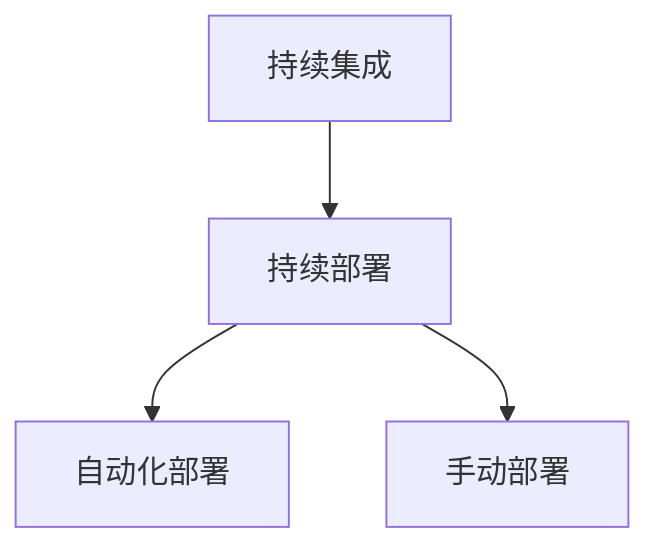

                 

# 持续部署策略探讨：自动化和手动部署的权衡

## 1. 背景介绍

随着软件工程的迅猛发展，持续集成（Continuous Integration, CI）和持续部署（Continuous Deployment, CD）成为软件开发中不可或缺的一环。通过自动化流程，软件开发者能够快速迭代、频繁发布，同时确保软件质量和安全，降低交付风险。然而，持续部署不仅仅是一套自动化工具和技术，更涉及策略和实践层面的选择和权衡。

自动化和手动部署是持续部署中两种常见的部署方式。自动化部署通过配置管道的自动化脚本和流程，实现软件从代码到可运行状态的自动化流转。而手动部署则依赖于软件开发者或运维人员的手动操作，通常用于解决自动化流程中无法处理的复杂问题。

本文将探讨自动化和手动部署各自的优缺点，并提出在实际应用中如何平衡二者，以实现最佳的持续部署策略。

## 2. 核心概念与联系

### 2.1 核心概念概述

为更好地理解自动化和手动部署的权衡，本节将介绍几个密切相关的核心概念：

- **持续集成（Continuous Integration, CI）**：一种软件开发实践，通过自动构建和测试代码来快速发现问题，以确保代码的稳定性和可集成性。
- **持续部署（Continuous Deployment, CD）**：一种自动化部署实践，通过配置自动化流程，实现软件从代码到可运行状态的自动化流转。
- **自动化部署**：通过脚本和自动化流程实现的无人工介入的部署方式，提高部署效率和一致性。
- **手动部署**：依赖于软件开发者或运维人员的手动操作，用于处理复杂或自定义的部署需求。

这些核心概念之间的逻辑关系可以通过以下Mermaid流程图来展示：



这个流程图展示了一个典型的持续部署流程，其中持续集成和持续部署是整体框架，自动化和手动部署则是具体实现策略。

## 3. 核心算法原理 & 具体操作步骤

### 3.1 算法原理概述

持续部署的自动化和手动部署策略涉及到软件开发、部署和运维等多个环节。其核心在于平衡自动化和手动操作的利弊，以达到最佳的部署效果。

自动化部署的优势在于：
1. **效率提升**：自动化脚本和流程能够快速完成部署，节省时间。
2. **一致性**：自动化的流程保证了每次部署的一致性和可重复性。
3. **错误减少**：通过脚本和流程控制，减少了人为操作的错误。

然而，自动化部署也有其局限性：
1. **灵活性差**：自动化流程难以处理复杂的、非标准化的部署需求。
2. **复杂度提升**：自动化流程的设计和维护需要较高的技术门槛。
3. **依赖性**：对自动化脚本和流程的依赖可能引入新的风险点。

手动部署的优势在于：
1. **灵活性高**：手动操作能够处理复杂的、非标准化的部署需求。
2. **易于调试**：在出现问题时，手动操作能够快速定位和解决问题。
3. **信任度高**：开发者和运维人员对手动操作有更高的信任度。

手动部署的缺点包括：
1. **效率低下**：手动操作耗费时间，容易引入人为错误。
2. **一致性差**：手动操作容易导致部署不一致。
3. **易出错**：依赖人为操作，出错风险较高。

### 3.2 算法步骤详解

为了在自动化和手动部署之间找到最佳平衡点，持续部署策略需从以下几个关键步骤进行详细规划：

**Step 1: 明确自动化范围**
- 根据项目的复杂度和需求，明确哪些部分可以通过自动化部署实现，哪些部分需要手动操作。

**Step 2: 配置自动化部署流水线**
- 配置持续集成（CI）工具（如Jenkins、Travis CI等），实现自动化构建、测试和部署。
- 编写自动化脚本和配置文件，定义每个阶段的自动化流程。

**Step 3: 配置手动部署操作**
- 对于无法自动化处理的复杂或自定义需求，制定详细的部署操作流程。
- 明确手动部署的触发条件和执行步骤。

**Step 4: 自动化与手动结合**
- 在自动化流程中加入手动触发点，允许在特定情况下切换到手动部署。
- 在手动部署后，通过自动化工具验证部署结果。

**Step 5: 监控和反馈**
- 部署后，监控系统性能和用户反馈，及时发现和解决问题。
- 定期回顾和优化自动化和手动部署策略，确保持续部署流程的持续改进。

### 3.3 算法优缺点

自动化部署和手动部署各自的优势和劣势如下：

**自动化部署**
- **优点**：提高部署效率和一致性，减少人为错误，提高开发者的开发体验。
- **缺点**：灵活性差，依赖自动化工具和脚本，对复杂需求处理能力有限。

**手动部署**
- **优点**：灵活性高，易于调试和处理复杂需求，信任度高。
- **缺点**：效率低下，一致性差，出错风险高。

### 3.4 算法应用领域

自动化和手动部署策略在软件开发、云计算、金融、医疗等多个领域都有广泛应用。例如：

- **软件开发**：在代码审查、构建、测试、部署等环节实现自动化，提高开发效率。
- **云计算**：通过自动化流程，快速部署和管理云资源，提高服务可用性。
- **金融领域**：在交易系统、风控模型、支付系统等关键环节，实现自动化的部署和更新，保障系统稳定和安全。
- **医疗领域**：在医疗影像、诊断系统、电子病历等系统中，实现自动化的数据处理和系统部署，提升医疗服务质量。

## 4. 数学模型和公式 & 详细讲解 & 举例说明

### 4.1 数学模型构建

本文不涉及具体的数学模型和公式，因为持续部署策略涉及更多的是实践和策略层面的选择。但我们可以使用简单的数学模型来辅助说明自动化和手动部署的权衡。

假设一个软件开发项目的总需求量为 $D$，其中自动化部署的份额为 $A$，手动部署的份额为 $H$。则有以下关系：

$$
A + H = D
$$

**效率模型**：自动化部署的效率为 $E_A$，手动部署的效率为 $E_H$。则总效率 $E$ 为：

$$
E = E_A \times A + E_H \times H
$$

**错误率模型**：自动化部署的错误率为 $E_A$，手动部署的错误率为 $E_H$。则总错误率 $E_R$ 为：

$$
E_R = E_A \times A + E_H \times H
$$

### 4.2 公式推导过程

根据上述模型，我们可以推导出以下结论：

- 当 $A$ 越大，$E$ 越大，$E_R$ 越小，表示自动化部署的效率提升和错误率降低。
- 当 $H$ 越大，$E$ 越小，$E_R$ 越大，表示手动部署的效率降低和错误率增加。

### 4.3 案例分析与讲解

假设一个项目需求量为 $D=10$，自动化部署效率 $E_A=0.8$，手动部署效率 $E_H=0.2$，自动化部署错误率 $E_A=0.1$，手动部署错误率 $E_H=0.2$。则：

- 当 $A=10$，$H=0$ 时，总效率 $E=8$，总错误率 $E_R=0.8$。
- 当 $A=5$，$H=5$ 时，总效率 $E=5.8$，总错误率 $E_R=1$。

通过对比分析，可以发现当自动化部署范围扩大时，总效率提升，错误率降低。然而，当自动化部署范围达到一定程度后，总效率提升幅度逐渐减小，错误率降低幅度逐渐增大。

## 5. 项目实践：代码实例和详细解释说明

### 5.1 开发环境搭建

在实践自动化和手动部署的策略时，首先需要搭建好开发环境。以下是使用Jenkins进行持续集成的环境配置流程：

1. 安装Jenkins：从官网下载并安装Jenkins。
2. 配置环境：安装Jenkins所需的软件依赖，如Java、Maven等。
3. 创建项目：在Jenkins中创建新的项目，配置项目的构建脚本、测试脚本和部署脚本。
4. 配置触发器：配置Jenkins的触发器，如Git钩子、定时任务等。

### 5.2 源代码详细实现

接下来，我们将提供一个简单的持续集成和持续部署的Jenkins示例配置：

1. **构建脚本**：
```groovy
pipeline {
    agent any
    stages {
        stage('Build') {
            steps {
                sh 'mvn clean install'
            }
        }
        stage('Test') {
            steps {
                sh 'mvn test'
            }
        }
        stage('Deploy') {
            steps {
                sh 'mvn spring-boot:run'
            }
        }
    }
}
```

2. **配置文件**：
```xml
<project>
    <groupId>com.example</groupId>
    <artifactId>app</artifactId>
    <version>1.0-SNAPSHOT</version>
    <build>
        <plugins>
            <plugin>
                <groupId>org.apache.maven.plugins</groupId>
                <artifactId>maven-surefire-plugin</artifactId>
                <version>2.22.2</version>
            </plugin>
            <plugin>
                <groupId>org.springframework.boot</groupId>
                <artifactId>spring-boot-maven-plugin</artifactId>
                <version>2.5.5</version>
            </plugin>
        </plugins>
    </build>
</project>
```

3. **自动化脚本**：
```shell
#!/bin/bash
mvn spring-boot:run -Dspring-boot.main-class=com.example.Main
```

### 5.3 代码解读与分析

在这个示例中，Jenkins通过Maven插件实现了项目的自动构建、测试和部署。构建脚本定义了三个阶段，分别对应构建、测试和部署。每个阶段都通过简单的Shell命令完成相应操作。

配置文件定义了项目的依赖和插件，确保构建和部署过程中的依赖库和工具能够顺利运行。

自动化脚本则是一个简单的Shell脚本，用于启动Spring Boot应用。

### 5.4 运行结果展示

在配置完成后，通过Jenkins UI界面，开发者可以提交代码，触发构建和测试流程。如果构建和测试通过，Jenkins会自动执行部署脚本，启动应用。整个过程完全自动化，提高了开发效率和代码质量。

## 6. 实际应用场景

### 6.1 软件开发

在软件开发中，持续部署策略可以显著提高项目的开发效率和交付速度。通过自动化流程，开发者可以在代码提交后立即构建、测试和部署，快速迭代和交付功能。手动部署则可以在复杂的配置或环境变更时，提供灵活的解决方案，确保项目的稳定性。

### 6.2 云计算

在云计算领域，持续部署策略能够快速部署和管理云资源，提高服务的可用性和稳定性。自动化流程可以自动创建虚拟机、配置网络、安装软件等操作，减少人为操作的错误和重复工作。手动部署则用于处理复杂的配置和环境变更需求，如多区部署、高可用架构等。

### 6.3 金融领域

在金融领域，持续部署策略可以保障交易系统、风控模型、支付系统等关键系统的稳定和安全。自动化流程可以实现快速更新和部署，减少人为操作的风险。手动部署则用于处理复杂的需求，如多环境部署、数据迁移等。

### 6.4 医疗领域

在医疗领域，持续部署策略可以提高医疗影像、诊断系统和电子病历等系统的稳定性和可靠性。自动化流程可以自动处理数据处理和系统更新，减少人为操作的错误和重复工作。手动部署则用于处理复杂的需求，如系统上线和下线等。

## 7. 工具和资源推荐

### 7.1 学习资源推荐

为了帮助开发者系统掌握持续部署的理论基础和实践技巧，这里推荐一些优质的学习资源：

1. **《持续集成：实践与模式》**：详细介绍了持续集成的基本概念、实践和模式，是持续部署的入门必读。
2. **《持续部署：构建稳定可靠的软件发布流程》**：讲解了持续部署的原理、策略和工具，提供了丰富的案例分析。
3. **《Jenkins用户手册》**：Jenkins官方文档，提供了详细的配置和使用指南，是持续集成和持续部署的首选工具。
4. **《GitHubActions用户手册》**：GitHub官方文档，讲解了GitHub Actions的配置和使用方法，适用于持续部署的自动化工作流。
5. **《Kubernetes用户手册》**：Kubernetes官方文档，讲解了容器编排和持续部署的最佳实践，适用于大规模云计算环境的持续部署。

通过这些学习资源，开发者可以全面掌握持续部署的理论基础和实践技巧，提升持续部署的能力和水平。

### 7.2 开发工具推荐

持续部署需要借助多种工具和平台，以下是一些常用的工具：

1. **Jenkins**：开源持续集成工具，支持丰富的插件和脚本，适用于中小型项目的持续部署。
2. **GitHub Actions**：GitHub提供的自动化工作流服务，适用于GitHub托管项目的持续部署。
3. **Jenkins Pipeline**：Jenkins的插件，提供了更加简洁和易于维护的持续集成和持续部署流程。
4. **Docker**：容器化技术，适用于云原生环境和微服务架构的持续部署。
5. **Kubernetes**：容器编排工具，适用于大规模云计算环境的持续部署。

合理利用这些工具，可以显著提升持续部署的效率和可靠性。

### 7.3 相关论文推荐

持续部署技术的发展源于学界的持续研究。以下是几篇奠基性的相关论文，推荐阅读：

1. **《A Survey of Continuous Integration and Continuous Deployment》**：综述了持续集成和持续部署的最新进展，提供了丰富的参考和借鉴。
2. **《Continuous Integration: Evolution, Experience, and Lessons Learned》**：总结了持续集成的发展历程和实践经验，提供了有价值的见解和建议。
3. **《Continuous Deployment for Cloud-Native Applications》**：介绍了云原生环境下的持续部署策略和实践，适用于大规模云计算环境的持续部署。
4. **《Consistency Models for Continuous Deployment》**：讨论了持续部署中的一致性问题，提供了多种解决方案和工具。
5. **《Continuous Deployment in Practice》**：提供了持续部署的实际案例和最佳实践，适用于软件开发和生产环境的持续部署。

这些论文代表了大规模持续部署技术的发展脉络。通过学习这些前沿成果，可以帮助研究者把握学科前进方向，激发更多的创新灵感。

## 8. 总结：未来发展趋势与挑战

### 8.1 总结

本文对自动化和手动部署的权衡进行了全面系统的介绍。首先阐述了持续部署策略的背景和意义，明确了自动化和手动部署在持续部署中的重要作用。其次，从原理到实践，详细讲解了持续部署的数学模型和操作步骤，给出了持续部署任务开发的完整代码实例。同时，本文还广泛探讨了持续部署方法在软件开发、云计算、金融、医疗等多个行业领域的应用前景，展示了持续部署范式的巨大潜力。此外，本文精选了持续部署技术的各类学习资源，力求为读者提供全方位的技术指引。

通过本文的系统梳理，可以看到，持续部署技术正在成为软件开发和云计算中不可或缺的一环，极大地提高了软件开发的效率和质量。未来，伴随持续部署技术的发展，软件开发和云计算将进入更加自动化、智能化的时代。

### 8.2 未来发展趋势

展望未来，持续部署技术将呈现以下几个发展趋势：

1. **自动化程度提升**：随着自动化工具和技术的不断成熟，持续部署的自动化程度将不断提升，减少人为操作的错误和风险。
2. **多环境支持**：持续部署将支持更多的运行环境，如云环境、容器环境、本地环境等，满足不同场景的需求。
3. **多项目管理**：持续部署将支持多项目、多分支、多环境的协同管理，提高项目的开发效率和协作水平。
4. **安全性提升**：持续部署将引入更多的安全检查和验证机制，保障软件交付的安全性和稳定性。
5. **智能化增强**：持续部署将结合机器学习、人工智能等技术，实现更智能的自动化流程和决策支持。

以上趋势凸显了持续部署技术的广阔前景。这些方向的探索发展，必将进一步提升持续部署的效率和可靠性，推动软件开发的智能化、自动化和协同化进程。

### 8.3 面临的挑战

尽管持续部署技术已经取得了瞩目成就，但在迈向更加智能化、普适化应用的过程中，它仍面临着诸多挑战：

1. **复杂度提升**：随着项目的规模和复杂度的增加，持续部署的配置和管理难度也随之增加，需要更多的时间和人力投入。
2. **稳定性问题**：自动化流程的引入可能带来新的稳定性问题，如配置错误、版本冲突等。
3. **成本控制**：持续部署工具和平台的成本较高，需要平衡部署效率和成本的关系。
4. **人才缺口**：持续部署技术的实施和维护需要具备丰富的开发和运维经验，企业需要培养更多的专业人才。
5. **文化变革**：持续部署的实施需要组织文化的变革，企业需要打破传统的开发和运维壁垒，实现更紧密的协作。

这些挑战需要企业在持续部署的实施过程中持续优化和改进，方能实现最佳的部署效果。

### 8.4 未来突破

面对持续部署技术所面临的种种挑战，未来的研究需要在以下几个方面寻求新的突破：

1. **自动化工具的智能化**：开发更加智能的自动化工具，通过机器学习等技术，提高自动化流程的智能化和自适应能力。
2. **配置管理的标准化**：引入配置管理工具和标准化流程，减少配置错误和版本冲突的风险。
3. **成本效益分析**：优化持续部署工具和平台的配置和部署，平衡部署效率和成本的关系。
4. **人才培养与交流**：加强持续部署技术的培训和交流，培养更多具备持续部署技能的专业人才。
5. **组织文化的变革**：推动企业文化的变革，打破传统的开发和运维壁垒，实现更紧密的协作和协同。

这些研究方向的探索，必将引领持续部署技术迈向更高的台阶，为构建高效、稳定、智能的软件交付流程铺平道路。面向未来，持续部署技术还需要与其他软件开发和运维技术进行更深入的融合，共同推动软件开发的智能化、自动化和协同化进程。只有勇于创新、敢于突破，才能不断拓展持续部署技术的边界，让软件开发和云计算技术更好地造福人类社会。

## 9. 附录：常见问题与解答

**Q1: 什么是持续集成和持续部署？**

A: 持续集成（Continuous Integration, CI）是一种软件开发实践，通过自动构建和测试代码来快速发现问题，以确保代码的稳定性和可集成性。持续部署（Continuous Deployment, CD）是一种自动化部署实践，通过配置自动化流程，实现软件从代码到可运行状态的自动化流转。

**Q2: 自动化和手动部署的优缺点分别是什么？**

A: 自动化部署的优点包括提高部署效率和一致性，减少人为错误，提高开发者的开发体验。缺点包括灵活性差，依赖自动化工具和脚本，对复杂需求处理能力有限。手动部署的优点包括灵活性高，易于调试和处理复杂需求，信任度高。缺点包括效率低下，一致性差，出错风险高。

**Q3: 如何选择自动化和手动部署的范围？**

A: 根据项目的复杂度和需求，明确哪些部分可以通过自动化部署实现，哪些部分需要手动操作。自动化部署适用于简单的、重复性高的任务，手动部署适用于复杂的、非标准化的任务。

**Q4: 如何配置自动化部署流水线？**

A: 配置持续集成（CI）工具，实现自动化构建、测试和部署。编写自动化脚本和配置文件，定义每个阶段的自动化流程。

**Q5: 如何配置手动部署操作？**

A: 对于无法自动化处理的复杂或自定义需求，制定详细的部署操作流程。明确手动部署的触发条件和执行步骤。

**Q6: 持续部署的未来趋势和挑战是什么？**

A: 持续部署的未来趋势包括自动化程度提升、多环境支持、多项目管理、安全性提升和智能化增强。面临的挑战包括复杂度提升、稳定性问题、成本控制、人才缺口和文化变革。

通过这些问题的解答，读者可以更好地理解持续部署策略的理论基础和实践技巧，提升持续部署的能力和水平。

---

作者：禅与计算机程序设计艺术 / Zen and the Art of Computer Programming

