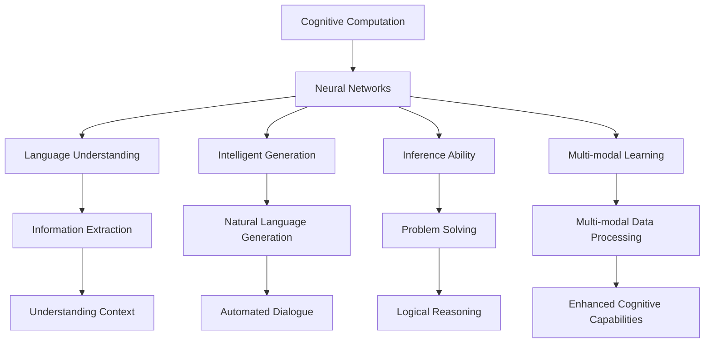

                 

## 1. 背景介绍

### 1.1 问题由来
在人类认知和思维研究的历史长河中，对人工智能（AI）和计算机科学的探索，始终伴随着人类对于自身大脑的深刻思考。近年来，随着深度学习、计算神经科学等技术的飞速进步，我们终于有机会从计算角度，重新审视并理解人类的认知过程。

现代认知科学研究已经证实，人类的思维和认知能力不仅仅是高度复杂的生物过程，也是可以通过算法和计算进行模拟和理解的。但是，如何通过计算方法精确地模拟人类思维的复杂性和多样性，仍然是一个巨大的挑战。

### 1.2 问题核心关键点
人类计算旨在通过模拟人类的认知过程，开发能够理解、生成和推理的语言模型，其核心关键点包括：

- **计算模型**：如何设计计算模型，以模拟人类大脑处理信息的方式。
- **神经网络**：如何构建神经网络结构，以适应人类的思维和认知模式。
- **语言理解**：如何使计算模型理解自然语言，包括语法、语义和上下文理解。
- **智能生成**：如何使计算模型能够生成自然语言，包括自动生成对话、摘要、翻译等。
- **推理能力**：如何使计算模型具备推理能力，解决诸如数学问题、逻辑问题等复杂任务。
- **多模态学习**：如何使计算模型处理视觉、听觉、触觉等多模态信息，提升认知能力。

### 1.3 问题研究意义
研究人类计算，不仅有助于我们更好地理解人类思维的本质，还能为开发更智能、更人性化的计算系统提供新的思路和方法。具体而言：

1. **理解思维本质**：人类计算可以揭示人类认知过程的计算规律，帮助我们更好地理解人类思维的本质。
2. **开发智能系统**：基于人类计算的模型可以开发出具备高度智能化、自适应能力的计算系统，提升人类生活质量。
3. **促进跨学科发展**：人类计算涉及计算机科学、认知科学、神经科学等多个学科，可以促进这些学科之间的深度融合和交叉研究。
4. **推动科技进步**：人类计算的发展将推动计算科学的进步，为新一代人工智能技术的突破提供理论支持。

## 2. 核心概念与联系

### 2.1 核心概念概述
在探讨人类计算时，有几个核心概念需要重点理解：

- **认知计算**：通过计算模型来模拟人类思维过程，理解人类认知能力的科学。
- **神经网络**：一种模拟人类神经系统的计算模型，通过学习优化权重和结构来适应输入数据。
- **语言理解**：使计算模型能够理解自然语言，并从中提取有价值的信息。
- **智能生成**：使计算模型能够生成自然语言，作为对输入的响应或处理结果。
- **推理能力**：使计算模型能够解决逻辑和数学问题，具备抽象思维和推理能力。
- **多模态学习**：使计算模型能够处理视觉、听觉、触觉等多模态信息，提升认知能力。

### 2.2 核心概念联系
这些核心概念之间的逻辑关系可以通过以下Mermaid流程图来展示：



这个流程图展示了几组核心概念之间的关系：

1. **认知计算与神经网络**：认知计算以神经网络为工具，模拟人类大脑的计算过程。
2. **语言理解与智能生成**：神经网络通过语言理解处理输入数据，通过智能生成生成自然语言输出。
3. **推理能力与多模态学习**：智能生成和推理能力有助于多模态学习的实现，而多模态学习又进一步增强了推理能力。
4. **信息提取与上下文理解**：语言理解中的信息提取和上下文理解是认知计算的重要组成部分。
5. **对话与问题解决**：智能生成和推理能力在对话系统和问题解决中都有重要应用。

## 3. 核心算法原理 & 具体操作步骤
### 3.1 算法原理概述

人类计算的核心算法原理主要基于计算模型和神经网络，通过学习训练和优化算法，模拟人类大脑处理信息的方式。具体包括以下步骤：

1. **数据准备**：收集大量语料和任务数据，准备进行神经网络训练。
2. **模型设计**：选择合适的神经网络结构和参数，设计输入和输出层。
3. **模型训练**：使用优化算法，如反向传播、梯度下降等，优化神经网络的权重和偏置。
4. **模型评估**：使用测试数据评估模型性能，进行必要的调整和优化。

### 3.2 算法步骤详解
下面以一个典型的认知计算模型为例，介绍其详细步骤：

**Step 1: 数据准备**
- **收集语料**：从公共语料库、网络爬虫、专业领域文献中收集大量文本数据。
- **标注数据**：对部分文本数据进行标注，用于监督学习训练。
- **数据预处理**：进行分词、去除停用词、标准化等预处理操作。

**Step 2: 模型设计**
- **选择神经网络结构**：如循环神经网络（RNN）、卷积神经网络（CNN）、长短期记忆网络（LSTM）、变压器网络（Transformer）等。
- **设计输入输出层**：输入层通常为文本的token序列，输出层为预测的目标标签或生成序列。
- **初始化参数**：随机初始化网络权重和偏置。

**Step 3: 模型训练**
- **前向传播**：将输入数据传递通过网络，计算出中间特征。
- **计算损失函数**：根据预测结果和真实标签，计算出损失函数值。
- **反向传播**：通过链式法则计算出各层权重的梯度。
- **更新参数**：使用优化算法（如梯度下降、Adam）更新网络参数。

**Step 4: 模型评估**
- **划分数据集**：将数据集划分为训练集、验证集和测试集。
- **评估指标**：使用准确率、召回率、F1分数等指标评估模型性能。
- **调优参数**：调整超参数，如学习率、批大小、迭代次数等。

### 3.3 算法优缺点
人类计算基于神经网络的算法具有以下优点：

1. **高效性**：神经网络可以通过并行计算高效处理大量数据。
2. **适应性**：神经网络具有自适应性，可以不断学习和优化。
3. **泛化能力**：通过大量数据训练，神经网络具有较强的泛化能力。

同时，神经网络也存在一些缺点：

1. **复杂性**：神经网络结构复杂，需要大量计算资源进行训练和推理。
2. **局部最优**：存在局部最优解的风险，需要通过优化算法和超参数调整来避免。
3. **过拟合**：在数据不足的情况下，容易发生过拟合。

### 3.4 算法应用领域

人类计算的算法已经在多个领域得到了广泛应用，包括但不限于：

1. **自然语言处理**：如机器翻译、文本摘要、情感分析、问答系统等。
2. **计算机视觉**：如图像分类、目标检测、语义分割等。
3. **语音识别**：如自动语音识别、语音合成、情感分析等。
4. **推荐系统**：如协同过滤、内容推荐、广告推荐等。
5. **智能交互**：如智能客服、聊天机器人、虚拟助手等。
6. **医疗诊断**：如病历分析、病理诊断、药物研发等。

## 4. 数学模型和公式 & 详细讲解 & 举例说明
### 4.1 数学模型构建

考虑一个简单的认知计算模型，其输入为自然语言文本，输出为文本分类标签。数学模型构建如下：

- **输入**：自然语言文本 $x$，表示为词嵌入向量 $\boldsymbol{x}$。
- **输出**：分类标签 $y$，表示为独热编码向量 $\boldsymbol{y}$。
- **损失函数**：交叉熵损失 $L$。

形式化地，假设模型参数为 $\boldsymbol{\theta}$，则模型的预测输出为：

$$
\boldsymbol{\hat{y}} = \text{softmax}(\boldsymbol{W}^T \boldsymbol{x} + b)
$$

其中 $\boldsymbol{W}$ 为权重矩阵，$b$ 为偏置向量。损失函数定义为：

$$
L(\boldsymbol{\theta}) = -\frac{1}{N}\sum_{i=1}^N \sum_{j=1}^K y_{ij} \log \hat{y}_{ij}
$$

### 4.2 公式推导过程

以二分类任务为例，推导交叉熵损失函数及其梯度的计算公式。

假设模型输出为 $\hat{y}_1$ 和 $\hat{y}_2$，对应两个类别 $y=0$ 和 $y=1$。则二分类交叉熵损失函数为：

$$
L = -(y_1\log \hat{y}_1 + (1-y_1)\log (1-\hat{y}_1))
$$

将 $y_1$ 替换为概率输出 $\hat{y}_1$，得：

$$
L = -\sum_{i=1}^N [y_i \log \hat{y}_i + (1-y_i) \log (1-\hat{y}_i)]
$$

其中 $N$ 为样本数量，$y_i \in \{0,1\}$，$\hat{y}_i \in (0,1)$。

求损失函数对模型参数的梯度，根据链式法则，得：

$$
\frac{\partial L}{\partial \boldsymbol{\theta}} = -\frac{1}{N}\sum_{i=1}^N \left( \frac{y_i}{\hat{y}_i} - \frac{1-y_i}{1-\hat{y}_i} \right) \frac{\partial \hat{y}_i}{\partial \boldsymbol{\theta}}
$$

其中 $\frac{\partial \hat{y}_i}{\partial \boldsymbol{\theta}}$ 可以通过神经网络的前向传播和反向传播计算得到。

### 4.3 案例分析与讲解

以一个具体的情感分析任务为例，展示人类计算模型的工作过程：

1. **数据准备**：收集包含正面和负面情感的社交媒体评论。
2. **模型设计**：使用双向LSTM网络，输入为评论的词嵌入向量，输出为分类标签。
3. **模型训练**：使用交叉熵损失函数，通过梯度下降优化模型参数。
4. **模型评估**：在验证集上评估模型性能，调整超参数。
5. **模型应用**：将训练好的模型应用于新的社交媒体评论，预测情感倾向。

## 5. 项目实践：代码实例和详细解释说明
### 5.1 开发环境搭建

进行人类计算模型的开发，需要一个高效、灵活的开发环境。以下是Python开发环境的具体搭建步骤：

1. **安装Anaconda**：
   - 从官网下载并安装Anaconda，创建虚拟环境：
   ```bash
   conda create -n myenv python=3.8
   conda activate myenv
   ```

2. **安装TensorFlow和Keras**：
   ```bash
   pip install tensorflow==2.7.0 keras
   ```

3. **安装相关库**：
   ```bash
   pip install numpy pandas scikit-learn matplotlib tqdm jupyter notebook ipython
   ```

### 5.2 源代码详细实现

以下是一个基于Keras的情感分析模型的代码实现：

```python
import tensorflow as tf
from tensorflow.keras import layers, models

# 构建模型
model = models.Sequential([
    layers.Embedding(vocab_size, embedding_dim, input_length=max_length),
    layers.Bidirectional(layers.LSTM(32)),
    layers.Dense(1, activation='sigmoid')
])

# 编译模型
model.compile(optimizer='adam', loss='binary_crossentropy', metrics=['accuracy'])

# 训练模型
model.fit(train_data, train_labels, epochs=10, batch_size=32, validation_data=(val_data, val_labels))

# 评估模型
test_loss, test_acc = model.evaluate(test_data, test_labels)
print('Test accuracy:', test_acc)

# 预测情感倾向
predictions = model.predict(new_data)
```

**代码解读与分析**：

1. **模型构建**：使用Keras构建一个包含嵌入层、双向LSTM层和全连接层的序列模型。
2. **模型编译**：指定优化器、损失函数和评估指标。
3. **模型训练**：使用交叉熵损失函数训练模型，指定训练轮数和批大小。
4. **模型评估**：在测试集上评估模型性能，输出准确率。
5. **模型预测**：对新的评论数据进行情感倾向预测。

## 6. 实际应用场景
### 6.1 智能客服系统

智能客服系统通过认知计算模型，可以处理大量的客户咨询请求，提供24/7不间断服务。具体而言，系统可以使用认知计算模型进行对话理解、意图识别、上下文跟踪等任务，提供快速、准确的答复。

在技术实现上，系统可以收集客户历史咨询数据，训练情感分析模型，自动理解客户情绪和需求。当新客户提出咨询时，系统可以使用多轮对话模型生成自然语言回复，并通过不断优化模型参数，逐步提升客户满意度。

### 6.2 医疗诊断系统

医疗诊断系统通过认知计算模型，可以实现高效、精准的病历分析、病理诊断和治疗方案推荐。具体而言，系统可以使用认知计算模型进行病历分类、疾病预测、药物匹配等任务，辅助医生进行诊断和治疗。

在技术实现上，系统可以收集医疗领域的大量病历数据，训练疾病预测模型，自动分析病人的病理特征和症状，提出诊断建议和治疗方案。当医生遇到疑难病例时，系统可以进一步使用模型进行推理和辅助决策，提升诊疗效果。

### 6.3 自动驾驶系统

自动驾驶系统通过认知计算模型，可以实现环境感知、路径规划、决策制定等任务，提升驾驶安全和效率。具体而言，系统可以使用认知计算模型进行道路识别、障碍物检测、交通信号解读等任务，实时规划行车路线和行为。

在技术实现上，系统可以收集驾驶场景的多模态数据，训练环境感知模型，自动识别道路和障碍物，并根据实时交通情况调整行车策略。当遇到复杂的驾驶场景时，系统可以使用认知计算模型进行推理和决策，避免交通事故和违规行为。

## 7. 工具和资源推荐
### 7.1 学习资源推荐

为了帮助开发者系统掌握认知计算的理论基础和实践技巧，以下是几本推荐书籍：

1. **《深度学习》** 作者：Ian Goodfellow、Yoshua Bengio 和 Aaron Courville，是深度学习领域的经典教材。
2. **《认知计算》** 作者：Dorai Sitaram 和 Masanori Hayashi，详细介绍了认知计算的基本概念和应用。
3. **《神经网络与深度学习》** 作者：Michael Nielsen，介绍了神经网络和深度学习的原理和实现。
4. **《自然语言处理综述》** 作者：Christopher D. Manning 和 Hinrich Schütze，涵盖了自然语言处理的基本理论和应用。
5. **《计算机视觉：模型、学习和推理》** 作者：Simon J.D. Prince 和 Miroslav Kubiny，介绍了计算机视觉的模型、算法和应用。

通过对这些资源的学习，相信你一定能够全面掌握认知计算的理论基础和实践技巧，并在实际项目中取得优异成果。

### 7.2 开发工具推荐

高效的开发离不开优秀的工具支持。以下是几款用于认知计算开发的常用工具：

1. **TensorFlow**：由Google主导开发的开源深度学习框架，生产部署方便，适合大规模工程应用。
2. **PyTorch**：由Facebook开发的开源深度学习框架，灵活的动态计算图，适合快速迭代研究。
3. **Keras**：基于TensorFlow的高级神经网络API，易于上手和使用。
4. **MXNet**：由Apache开发的多语言深度学习框架，支持多种编程语言和分布式训练。
5. **Jupyter Notebook**：开源的交互式笔记本，方便进行代码实验和数据探索。
6. **Google Colab**：谷歌提供的免费Jupyter Notebook环境，支持GPU/TPU算力，适合大型模型训练。

合理利用这些工具，可以显著提升认知计算模型的开发效率，加快创新迭代的步伐。

### 7.3 相关论文推荐

认知计算和人类计算领域的研究论文，为我们提供了许多宝贵的知识和灵感。以下是几篇经典论文的推荐：

1. **《Cognitive Computation: Understanding the Human Brain with Computation》** 作者：Kenneth M. Joy，详细介绍了认知计算的基本概念和实现方法。
2. **《Deep Learning》** 作者：Ian Goodfellow、Yoshua Bengio 和 Aaron Courville，介绍了深度学习的原理和应用。
3. **《A Survey of Human Computation》** 作者：Ian McGregor，介绍了人类计算的基本概念、方法和应用。
4. **《Neural Networks and Deep Learning》** 作者：Michael Nielsen，介绍了神经网络和深度学习的原理和实现。
5. **《Understanding the Dynamics of Neural Computational Models》** 作者：Wiesław Strzelczyk 和 Richard George Buzbee，介绍了神经计算模型的动态特性和应用。

这些论文代表了大计算和人类计算的发展脉络，通过学习这些前沿成果，可以帮助研究者把握学科前进方向，激发更多的创新灵感。

## 8. 总结：未来发展趋势与挑战
### 8.1 研究成果总结

人类计算的认知模型已经在多个领域取得了显著成果，涵盖了自然语言处理、计算机视觉、语音识别、推荐系统等多个方向。通过深度学习、神经网络和计算模型的结合，我们逐步理解了人类思维和认知的计算规律，并应用于实际问题中，提升了智能化水平。

### 8.2 未来发展趋势

展望未来，人类计算的认知模型将呈现以下几个发展趋势：

1. **更高效的计算模型**：随着计算资源的不断增加，神经网络结构和参数将不断优化，计算速度和效率将大幅提升。
2. **更广泛的应用场景**：认知模型将逐渐应用于更多领域，如医疗、金融、教育等，提升相关行业的服务水平。
3. **更精准的认知理解**：通过多模态学习和因果推理，认知模型将更好地理解人类认知过程，提升推理和生成能力。
4. **更智能的交互系统**：通过对话系统和情感分析，认知模型将实现更加智能、自然的人机交互。
5. **更丰富的先验知识**：结合外部知识库和规则库，认知模型将更好地整合先验知识，提升决策的准确性。
6. **更强的伦理和安全性**：在模型训练和应用中引入伦理导向和安全性约束，确保认知模型的使用安全可靠。

### 8.3 面临的挑战

尽管认知计算在多个领域取得了显著进展，但仍面临许多挑战：

1. **数据获取难度**：高质量的数据获取和标注，对于认知计算模型的训练至关重要，但许多领域的数据获取难度较大。
2. **模型复杂度**：神经网络和深度学习模型的复杂度，使得训练和推理资源消耗较大，需要高效优化算法和分布式计算。
3. **计算资源成本**：大规模模型的训练和推理需要大量的计算资源，成本较高，需要更高效的计算框架和资源管理工具。
4. **模型解释性**：认知模型的决策过程复杂，难以解释和调试，需要引入更多可解释性方法和技术。
5. **伦理和安全问题**：认知模型可能会学习到有偏见、有害的信息，需要通过技术手段确保模型的伦理和安全。

### 8.4 研究展望

面对人类计算的认知模型所面临的挑战，未来的研究需要在以下几个方面寻求新的突破：

1. **高效数据获取方法**：探索更多无监督和半监督学习的方法，降低高质量数据获取的难度。
2. **高效计算框架**：开发更高效的计算框架和分布式计算方法，提升计算资源的利用效率。
3. **可解释性方法**：引入更多可解释性方法和技术，增强认知模型的决策过程的可解释性。
4. **伦理和安全约束**：在模型训练和应用中引入伦理导向和安全性约束，确保模型的使用安全可靠。
5. **多模态学习**：结合视觉、听觉、触觉等多模态数据，提升认知模型的认知能力和决策水平。
6. **跨学科融合**：结合认知科学、神经科学、心理学等学科知识，提升认知模型的认知理解能力。

这些研究方向和突破，将使人类计算的认知模型更加智能、全面和可靠，为构建智能系统提供更强大的计算基础。通过技术创新和学科融合，人类计算将进一步推动人工智能技术的发展，提升人类生活质量和社会进步。

## 9. 附录：常见问题与解答

**Q1：人类计算的认知模型是否适用于所有领域？**

A: 人类计算的认知模型在多个领域已经取得了显著成果，但并不是所有领域都适合使用认知模型。对于一些需要高度专业知识和领域背景的任务，认知模型需要结合外部知识和规则库，才能达到较好的效果。

**Q2：如何选择适合认知计算的神经网络结构？**

A: 选择适合的神经网络结构需要考虑任务特点和数据特性。例如，对于序列数据，可以使用循环神经网络（RNN）、长短时记忆网络（LSTM）、变压器网络（Transformer）等。对于图像数据，可以使用卷积神经网络（CNN）。对于多模态数据，可以使用多模态神经网络（MMN）。

**Q3：如何进行高效的认知计算模型训练？**

A: 高效的认知计算模型训练需要结合多线程和分布式计算技术，优化模型参数和计算图。例如，使用梯度累积、混合精度训练、模型并行等方法，可以显著提升训练效率。

**Q4：如何提高认知计算模型的可解释性？**

A: 提高认知计算模型的可解释性可以通过多种方法，如引入可解释性模块、可视化决策过程、引入专家规则等。同时，可以通过自监督学习、半监督学习等方法，提高模型的鲁棒性和泛化能力。

**Q5：如何保证认知计算模型的伦理和安全？**

A: 保证认知计算模型的伦理和安全需要引入伦理导向和安全性约束，例如在模型训练和应用中引入公平性、透明性、可解释性等指标。同时，需要对模型进行定期的审核和监控，确保其使用安全可靠。

---

作者：禅与计算机程序设计艺术 / Zen and the Art of Computer Programming

