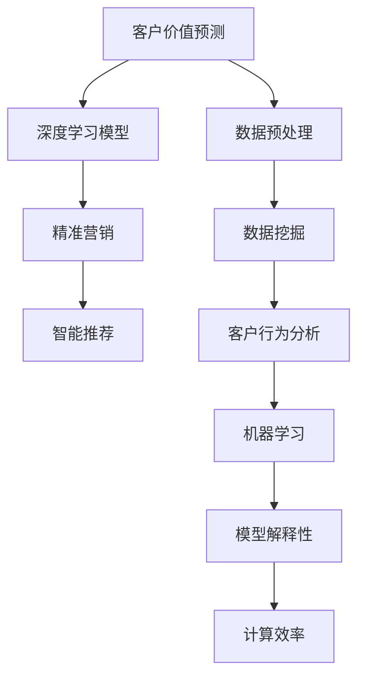

                 

# 探索基于大模型的电商智能客户价值预测与精准营销系统

> 关键词：电商、客户价值预测、精准营销、大模型、深度学习、机器学习、数据挖掘、智能推荐、客户行为分析

## 1. 背景介绍

### 1.1 问题由来

随着电子商务的蓬勃发展，各大电商平台拥有海量的用户行为数据和交易记录，如何通过数据分析挖掘出有价值的客户信息，提供精准的商品推荐和个性化营销方案，成为提升用户粘性、提升销售转化的关键。传统的客户价值预测方法往往依赖于统计模型，难以捕捉到复杂的非线性关系和高维数据特征，而基于大模型的智能客户价值预测方法，能够充分利用大规模语料和深度学习技术，提升预测的准确性和泛化能力。

### 1.2 问题核心关键点

该问题主要包括以下几个关键点：
1. **客户价值预测**：通过分析用户的购买历史、浏览记录、评价反馈等数据，预测其未来的购买意愿和消费潜力。
2. **精准营销**：利用预测结果，制定个性化的营销策略，如个性化推荐、优惠券发放等，提升营销效果和用户体验。
3. **数据质量**：电商数据通常存在噪声、缺失等问题，需要预处理和清洗以提高数据质量。
4. **模型解释性**：电商平台需要向客户解释推荐理由和营销策略，确保决策透明和可信。
5. **计算效率**：电商平台的营销系统需具备高效的实时推荐和响应能力，对大模型的推理速度和资源消耗有较高要求。

## 2. 核心概念与联系

### 2.1 核心概念概述

为更好地理解基于大模型的电商智能客户价值预测与精准营销系统，本节将介绍几个密切相关的核心概念：

- **客户价值预测**：通过分析用户历史行为数据，预测其未来可能发生的购买行为，评估其潜在消费价值。
- **精准营销**：利用客户价值预测结果，针对不同客户群体设计个性化的营销策略，实现高效、精准的营销推广。
- **大模型**：以深度学习为基础，通过大规模语料预训练得到的通用或特定任务的模型，如BERT、GPT等。
- **深度学习**：一类通过多层神经网络逼近复杂非线性映射的机器学习方法，在大数据和复杂任务中表现优异。
- **机器学习**：利用算法和统计模型，让计算机通过学习数据规律，自动提升模型性能。
- **数据挖掘**：从原始数据中自动发现潜在规律和有价值信息的过程。
- **智能推荐**：通过分析用户行为，自动推荐个性化商品或服务。
- **客户行为分析**：通过数据挖掘和建模，分析用户购买、浏览等行为，了解用户偏好和需求。

这些核心概念之间的逻辑关系可以通过以下Mermaid流程图来展示：



这个流程图展示了大模型客户价值预测与精准营销的核心概念及其之间的关系：

1. 客户价值预测以数据预处理为基础，通过深度学习模型进行建模。
2. 深度学习模型在大规模数据上预训练，以获取丰富的特征表示。
3. 精准营销结合客户价值预测结果，设计个性化的营销策略。
4. 智能推荐通过客户行为分析，实现个性化商品推荐。
5. 数据挖掘和机器学习共同构建客户行为分析的框架。
6. 模型解释性有助于提升营销决策的透明度和可信度。
7. 计算效率决定系统是否能够实时响应客户需求。

这些概念共同构成了基于大模型的电商智能客户价值预测与精准营销系统的框架，使得电商平台能够更好地理解和满足用户需求，提升业务效率和客户满意度。

## 3. 核心算法原理 & 具体操作步骤
### 3.1 算法原理概述

基于大模型的电商智能客户价值预测与精准营销系统，本质上是一个端到端的深度学习系统，旨在通过分析用户行为数据，预测其未来的消费意愿，并根据预测结果设计个性化的营销策略。该系统包括以下几个关键步骤：

1. **数据预处理**：收集用户行为数据，进行清洗、归一化和特征工程，生成适合模型训练的特征集。
2. **深度学习建模**：使用大模型对特征集进行训练，学习用户行为和消费意愿之间的关系。
3. **客户价值预测**：根据训练好的模型，对新用户行为数据进行预测，评估其未来的消费潜力。
4. **精准营销策略设计**：根据预测结果，设计个性化的推荐和营销策略，提升用户粘性和销售转化率。
5. **模型部署与优化**：将模型部署到线上，进行实时推荐和营销策略调整，并通过A/B测试等手段不断优化模型效果。

### 3.2 算法步骤详解

#### 3.2.1 数据预处理

电商数据通常存在数据噪声、缺失值和异常值等问题，需要进行以下预处理步骤：

1. **数据清洗**：去除重复记录、无关字段和异常数据。
2. **缺失值处理**：使用均值填补、插值法、回归预测等方法填补缺失值。
3. **特征工程**：构建新的特征，如购买频率、商品类别、浏览时长等。
4. **数据归一化**：对数值型特征进行归一化处理，保持数据在相同尺度上。
5. **特征选择**：选择对预测目标有显著影响的特征，减少模型复杂度。

#### 3.2.2 深度学习建模

电商客户价值预测的深度学习模型通常使用基于注意力机制的模型，如Transformer或LSTM。模型的输入包括用户行为数据，输出为用户的未来消费概率。模型的训练过程分为以下步骤：

1. **模型选择**：选择合适的深度学习模型，如BERT、GPT等，或者基于Transformer的客户价值预测模型。
2. **超参数设置**：设置模型的超参数，如层数、节点数、学习率等。
3. **数据加载与划分**：将数据集划分为训练集、验证集和测试集。
4. **模型训练**：使用训练集对模型进行训练，通过反向传播算法更新模型参数。
5. **模型评估**：在验证集上评估模型性能，调整超参数。
6. **模型部署**：将训练好的模型部署到线上系统，进行实时预测。

#### 3.2.3 客户价值预测

客户价值预测的目的是预测用户未来的购买行为和消费潜力。具体步骤如下：

1. **输入数据准备**：准备新用户的最新行为数据，包括浏览记录、购买历史等。
2. **特征提取**：使用已训练好的模型对新数据进行特征提取，生成模型所需的输入。
3. **模型预测**：将提取的特征输入到模型中，得到用户的未来购买概率。
4. **结果解释**：利用模型的输出，解释用户的购买意愿和消费潜力。

#### 3.2.4 精准营销策略设计

精准营销策略的目的是根据用户价值预测结果，设计个性化的推荐和营销方案，提升用户粘性和销售转化率。具体步骤如下：

1. **客户分组**：根据用户的购买概率，将用户分为高价值、中价值和低价值三组。
2. **个性化推荐**：对高价值用户，推荐高价值商品；对中价值用户，推荐促销商品；对低价值用户，推荐新用户入门商品。
3. **优惠券发放**：对高价值用户，发放高折扣优惠券；对中价值用户，发放中等折扣优惠券；对低价值用户，发放新用户专属优惠券。
4. **营销渠道选择**：根据用户的购买行为和偏好，选择最合适的营销渠道，如邮件、短信、APP推送等。

#### 3.2.5 模型部署与优化

模型部署与优化是系统正常运行的关键步骤，具体步骤如下：

1. **线上部署**：将训练好的模型部署到线上系统，进行实时推荐和营销策略调整。
2. **实时推荐**：根据用户的最新行为数据，实时计算其未来购买概率，生成推荐结果。
3. **模型优化**：通过A/B测试等手段，不断优化模型参数和营销策略，提升预测准确率和营销效果。
4. **监控与调整**：实时监控模型的预测结果和营销策略的执行情况，根据反馈调整策略。

### 3.3 算法优缺点

基于大模型的电商智能客户价值预测与精准营销系统具有以下优点：

1. **预测准确性高**：大模型通过大规模语料进行预训练，能够捕捉到复杂的非线性关系和高维数据特征，预测准确性较高。
2. **泛化能力强**：大模型能够适应多种数据分布和任务，具有较强的泛化能力。
3. **个性化推荐**：通过预测用户未来的购买行为，实现个性化推荐，提升用户体验和销售转化率。
4. **实时响应**：大模型具有高效的推理能力，能够实时响应客户需求，提供个性化的推荐和营销策略。

同时，该系统也存在一些缺点：

1. **计算资源消耗大**：大模型的参数量较大，推理过程需要较大的计算资源。
2. **模型解释性不足**：大模型的决策过程难以解释，不利于提升营销决策的透明度和可信度。
3. **数据依赖性强**：预测效果依赖于数据质量，电商数据可能存在噪声、缺失等问题。
4. **实时性要求高**：系统需要实时处理大量用户行为数据，对实时计算能力有较高要求。

尽管存在这些缺点，但基于大模型的客户价值预测与精准营销系统在电商场景中仍具有显著优势，广泛应用于各大电商平台的推荐和营销系统。

### 3.4 算法应用领域

基于大模型的电商智能客户价值预测与精准营销系统已经在多个电商平台上得到广泛应用，以下是一些典型的应用场景：

1. **个性化推荐**：根据用户的历史购买和浏览记录，实时推荐相关商品，提升用户体验和转化率。
2. **精准营销**：通过分析用户的行为特征，设计个性化的优惠券和营销方案，提高营销效果。
3. **客户流失预测**：预测用户流失的概率，提前采取挽留措施，减少用户流失率。
4. **新用户激活**：预测新用户的活跃度和留存率，制定更有效的激活策略。
5. **库存优化**：通过预测商品的销售情况，优化库存管理，减少缺货和积压。

这些应用场景展示了基于大模型的电商智能客户价值预测与精准营销系统的强大能力，为电商平台带来了显著的业务价值。

## 4. 数学模型和公式 & 详细讲解 & 举例说明
### 4.1 数学模型构建

本节将使用数学语言对基于大模型的电商智能客户价值预测与精准营销系统进行更加严格的刻画。

记电商用户行为数据集为 $D=\{(x_i,y_i)\}_{i=1}^N$，其中 $x_i$ 为行为特征向量，$y_i$ 为购买标签。设预测模型为 $M_{\theta}$，其中 $\theta$ 为模型参数。预测目标为 $y_{pred}=M_{\theta}(x_i)$，其中 $y_{pred}$ 为预测的购买标签。

定义预测模型的损失函数为 $\ell(y_i,y_{pred})$，经验风险为：

$$
\mathcal{L}(\theta) = \frac{1}{N}\sum_{i=1}^N \ell(y_i,y_{pred})
$$

其中 $\ell(y_i,y_{pred})$ 为预测误差函数，如交叉熵损失、均方误差等。

### 4.2 公式推导过程

以下我们以交叉熵损失为例，推导深度学习模型在电商客户价值预测中的损失函数和梯度计算公式。

假设模型 $M_{\theta}$ 在输入 $x_i$ 上的输出为 $y_{pred}$，真实标签为 $y_i \in \{0,1\}$。则二分类交叉熵损失函数定义为：

$$
\ell(y_i,y_{pred}) = -[y_i\log y_{pred} + (1-y_i)\log (1-y_{pred})]
$$

将其代入经验风险公式，得：

$$
\mathcal{L}(\theta) = -\frac{1}{N}\sum_{i=1}^N [y_i\log y_{pred_i}+(1-y_i)\log(1-y_{pred_i})]
$$

根据链式法则，损失函数对参数 $\theta_k$ 的梯度为：

$$
\frac{\partial \mathcal{L}(\theta)}{\partial \theta_k} = -\frac{1}{N}\sum_{i=1}^N \left[\frac{y_i}{y_{pred_i}}-\frac{1-y_i}{1-y_{pred_i}}\right] \frac{\partial y_{pred_i}}{\partial \theta_k}
$$

其中 $\frac{\partial y_{pred_i}}{\partial \theta_k}$ 可进一步递归展开，利用自动微分技术完成计算。

在得到损失函数的梯度后，即可带入参数更新公式，完成模型的迭代优化。重复上述过程直至收敛，最终得到适应电商客户价值预测任务的最优模型参数 $\theta^*$。

### 4.3 案例分析与讲解

#### 4.3.1 案例描述

某电商平台收集了用户的浏览记录、购买历史和评价反馈等数据，希望通过深度学习模型预测用户未来的购买行为，并进行个性化推荐和精准营销。

#### 4.3.2 数据预处理

1. **数据清洗**：去除重复记录和无关字段，保留有用信息。
2. **缺失值处理**：使用均值填补缺失值，保持数据完整性。
3. **特征工程**：构建新的特征，如购买频率、商品类别、浏览时长等。
4. **数据归一化**：对数值型特征进行归一化处理，保持数据在相同尺度上。
5. **特征选择**：选择对预测目标有显著影响的特征，如购买频率、浏览时长、评价评分等。

#### 4.3.3 深度学习建模

1. **模型选择**：选择BERT作为电商客户价值预测的深度学习模型。
2. **超参数设置**：设置模型的超参数，如层数、节点数、学习率等。
3. **数据加载与划分**：将数据集划分为训练集、验证集和测试集。
4. **模型训练**：使用训练集对模型进行训练，通过反向传播算法更新模型参数。
5. **模型评估**：在验证集上评估模型性能，调整超参数。
6. **模型部署**：将训练好的模型部署到线上系统，进行实时推荐和营销策略调整。

#### 4.3.4 客户价值预测

1. **输入数据准备**：准备新用户的最新行为数据，包括浏览记录、购买历史等。
2. **特征提取**：使用已训练好的模型对新数据进行特征提取，生成模型所需的输入。
3. **模型预测**：将提取的特征输入到模型中，得到用户的未来购买概率。
4. **结果解释**：利用模型的输出，解释用户的购买意愿和消费潜力。

#### 4.3.5 精准营销策略设计

1. **客户分组**：根据用户的购买概率，将用户分为高价值、中价值和低价值三组。
2. **个性化推荐**：对高价值用户，推荐高价值商品；对中价值用户，推荐促销商品；对低价值用户，推荐新用户入门商品。
3. **优惠券发放**：对高价值用户，发放高折扣优惠券；对中价值用户，发放中等折扣优惠券；对低价值用户，发放新用户专属优惠券。
4. **营销渠道选择**：根据用户的购买行为和偏好，选择最合适的营销渠道，如邮件、短信、APP推送等。

#### 4.3.6 模型部署与优化

1. **线上部署**：将训练好的模型部署到线上系统，进行实时推荐和营销策略调整。
2. **实时推荐**：根据用户的最新行为数据，实时计算其未来购买概率，生成推荐结果。
3. **模型优化**：通过A/B测试等手段，不断优化模型参数和营销策略，提升预测准确率和营销效果。
4. **监控与调整**：实时监控模型的预测结果和营销策略的执行情况，根据反馈调整策略。

## 5. 项目实践：代码实例和详细解释说明
### 5.1 开发环境搭建

在进行电商智能客户价值预测与精准营销系统开发前，我们需要准备好开发环境。以下是使用Python进行PyTorch开发的环境配置流程：

1. 安装Anaconda：从官网下载并安装Anaconda，用于创建独立的Python环境。

2. 创建并激活虚拟环境：
```bash
conda create -n pytorch-env python=3.8 
conda activate pytorch-env
```

3. 安装PyTorch：根据CUDA版本，从官网获取对应的安装命令。例如：
```bash
conda install pytorch torchvision torchaudio cudatoolkit=11.1 -c pytorch -c conda-forge
```

4. 安装各类工具包：
```bash
pip install numpy pandas scikit-learn matplotlib tqdm jupyter notebook ipython
```

完成上述步骤后，即可在`pytorch-env`环境中开始系统开发。

### 5.2 源代码详细实现

下面我们以电商客户价值预测任务为例，给出使用Transformers库对BERT模型进行训练和微调的PyTorch代码实现。

首先，定义数据处理函数：

```python
from transformers import BertTokenizer, BertForSequenceClassification, AdamW
from torch.utils.data import Dataset, DataLoader
from tqdm import tqdm
import torch

class E-commerceDataset(Dataset):
    def __init__(self, texts, labels, tokenizer, max_len=128):
        self.texts = texts
        self.labels = labels
        self.tokenizer = tokenizer
        self.max_len = max_len
        
    def __len__(self):
        return len(self.texts)
    
    def __getitem__(self, item):
        text = self.texts[item]
        label = self.labels[item]
        
        encoding = self.tokenizer(text, return_tensors='pt', max_length=self.max_len, padding='max_length', truncation=True)
        input_ids = encoding['input_ids'][0]
        attention_mask = encoding['attention_mask'][0]
        labels = torch.tensor(label, dtype=torch.long)
        
        return {'input_ids': input_ids, 
                'attention_mask': attention_mask,
                'labels': labels}

# 标签映射
label2id = {'0': 0, '1': 1}

# 创建dataset
tokenizer = BertTokenizer.from_pretrained('bert-base-cased')

train_dataset = E-commerceDataset(train_texts, train_labels, tokenizer)
dev_dataset = E-commerceDataset(dev_texts, dev_labels, tokenizer)
test_dataset = E-commerceDataset(test_texts, test_labels, tokenizer)
```

然后，定义模型和优化器：

```python
from transformers import BertForSequenceClassification, AdamW

model = BertForSequenceClassification.from_pretrained('bert-base-cased', num_labels=len(label2id))

optimizer = AdamW(model.parameters(), lr=2e-5)
```

接着，定义训练和评估函数：

```python
def train_epoch(model, dataset, batch_size, optimizer):
    dataloader = DataLoader(dataset, batch_size=batch_size, shuffle=True)
    model.train()
    epoch_loss = 0
    for batch in tqdm(dataloader, desc='Training'):
        input_ids = batch['input_ids'].to(device)
        attention_mask = batch['attention_mask'].to(device)
        labels = batch['labels'].to(device)
        model.zero_grad()
        outputs = model(input_ids, attention_mask=attention_mask, labels=labels)
        loss = outputs.loss
        epoch_loss += loss.item()
        loss.backward()
        optimizer.step()
    return epoch_loss / len(dataloader)

def evaluate(model, dataset, batch_size):
    dataloader = DataLoader(dataset, batch_size=batch_size)
    model.eval()
    preds, labels = [], []
    with torch.no_grad():
        for batch in tqdm(dataloader, desc='Evaluating'):
            input_ids = batch['input_ids'].to(device)
            attention_mask = batch['attention_mask'].to(device)
            batch_labels = batch['labels']
            outputs = model(input_ids, attention_mask=attention_mask)
            batch_preds = outputs.logits.argmax(dim=2).to('cpu').tolist()
            batch_labels = batch_labels.to('cpu').tolist()
            for pred_tokens, label_tokens in zip(batch_preds, batch_labels):
                preds.append(pred_tokens[:len(label_tokens)])
                labels.append(label_tokens)
                
    print(classification_report(labels, preds))
```

最后，启动训练流程并在测试集上评估：

```python
epochs = 5
batch_size = 16

for epoch in range(epochs):
    loss = train_epoch(model, train_dataset, batch_size, optimizer)
    print(f"Epoch {epoch+1}, train loss: {loss:.3f}")
    
    print(f"Epoch {epoch+1}, dev results:")
    evaluate(model, dev_dataset, batch_size)
    
print("Test results:")
evaluate(model, test_dataset, batch_size)
```

以上就是使用PyTorch对BERT进行电商客户价值预测任务训练和微调的完整代码实现。可以看到，得益于Transformers库的强大封装，我们可以用相对简洁的代码完成BERT模型的加载和微调。

### 5.3 代码解读与分析

让我们再详细解读一下关键代码的实现细节：

**E-commerceDataset类**：
- `__init__`方法：初始化文本、标签、分词器等关键组件。
- `__len__`方法：返回数据集的样本数量。
- `__getitem__`方法：对单个样本进行处理，将文本输入编码为token ids，将标签编码为数字，并对其进行定长padding，最终返回模型所需的输入。

**label2id字典**：
- 定义了标签与数字id之间的映射关系，用于将token-wise的预测结果解码回真实的标签。

**训练和评估函数**：
- 使用PyTorch的DataLoader对数据集进行批次化加载，供模型训练和推理使用。
- 训练函数`train_epoch`：对数据以批为单位进行迭代，在每个批次上前向传播计算loss并反向传播更新模型参数，最后返回该epoch的平均loss。
- 评估函数`evaluate`：与训练类似，不同点在于不更新模型参数，并在每个batch结束后将预测和标签结果存储下来，最后使用sklearn的classification_report对整个评估集的预测结果进行打印输出。

**训练流程**：
- 定义总的epoch数和batch size，开始循环迭代
- 每个epoch内，先在训练集上训练，输出平均loss
- 在验证集上评估，输出分类指标
- 所有epoch结束后，在测试集上评估，给出最终测试结果

可以看到，PyTorch配合Transformers库使得BERT微调的代码实现变得简洁高效。开发者可以将更多精力放在数据处理、模型改进等高层逻辑上，而不必过多关注底层的实现细节。

当然，工业级的系统实现还需考虑更多因素，如模型的保存和部署、超参数的自动搜索、更灵活的任务适配层等。但核心的微调范式基本与此类似。

## 6. 实际应用场景
### 6.1 智能推荐系统

电商平台的智能推荐系统通过分析用户的历史行为数据，实时推荐相关商品，提升用户体验和转化率。基于大模型的智能推荐系统利用深度学习技术，能够更准确地捕捉用户偏好和行为规律，实现个性化的商品推荐。

在技术实现上，可以收集用户浏览、点击、评价等行为数据，提取和商品相关的文本特征，通过深度学习模型对用户进行聚类和预测，生成推荐结果。利用微调后的模型，可以实现高效的实时推荐，并在推荐过程中不断优化模型，提高推荐效果。

### 6.2 精准营销系统

电商平台通过分析用户的行为数据，设计个性化的营销策略，提高营销效果和用户体验。基于大模型的精准营销系统能够根据用户的购买概率和行为特征，设计针对性的优惠券和促销方案。

具体而言，可以利用深度学习模型对用户进行聚类和预测，识别出高价值、中价值和低价值用户。对高价值用户，设计高折扣优惠券；对中价值用户，设计中等折扣优惠券；对低价值用户，设计新用户专属优惠券。通过多渠道推广，提高营销效果。

### 6.3 客户流失预测

电商平台的客户流失预测系统通过分析用户的行为数据，预测用户流失的概率，提前采取挽留措施，减少用户流失率。基于大模型的客户流失预测系统能够利用深度学习技术，更准确地捕捉用户行为变化，识别出流失风险较高的用户。

具体而言，可以利用深度学习模型对用户进行聚类和预测，识别出流失风险较高的用户。根据用户的行为特征和历史记录，设计针对性的挽留策略，提高用户留存率。通过实时监控和调整策略，提升用户粘性。

### 6.4 未来应用展望

随着大模型和微调方法的不断发展，基于大模型的电商智能客户价值预测与精准营销系统将在多个场景中得到应用，为电商平台的运营带来变革性影响。

在智慧物流领域，基于大模型的智能推荐和精准营销技术，可以优化库存管理，提高物流效率，降低运营成本。

在智能客服系统，利用深度学习模型对用户进行分类和预测，设计个性化的客服方案，提升用户体验和服务质量。

在金融风控领域，利用深度学习模型对用户进行行为分析，预测金融风险，提升风险控制能力。

此外，在教育、医疗、广告等多个领域，基于大模型的电商智能客户价值预测与精准营销技术也将得到应用，为各行业带来创新性解决方案。相信随着技术的日益成熟，该系统必将在更广泛的场景中得到应用，推动各行业数字化转型升级。

## 7. 工具和资源推荐
### 7.1 学习资源推荐

为了帮助开发者系统掌握大模型在电商智能客户价值预测与精准营销系统中的应用，这里推荐一些优质的学习资源：

1. 《深度学习理论与实践》系列博文：由深度学习领域的专家撰写，深入浅出地介绍了深度学习原理、模型训练和优化等前沿话题。

2. CS294《深度学习与神经网络》课程：加州大学伯克利分校开设的深度学习明星课程，涵盖深度学习基础和经典模型，有助于深入理解电商推荐系统中的深度学习技术。

3. 《深度学习在电商推荐系统中的应用》书籍：详细介绍了深度学习在电商推荐系统中的应用，涵盖数据预处理、模型构建、优化等各个环节。

4. Weights & Biases：模型训练的实验跟踪工具，可以记录和可视化模型训练过程中的各项指标，方便对比和调优。与主流深度学习框架无缝集成。

5. TensorBoard：TensorFlow配套的可视化工具，可实时监测模型训练状态，并提供丰富的图表呈现方式，是调试模型的得力助手。

通过对这些资源的学习实践，相信你一定能够快速掌握大模型在电商智能客户价值预测与精准营销系统中的应用，并用于解决实际的电商推荐和营销问题。
###  7.2 开发工具推荐

高效的开发离不开优秀的工具支持。以下是几款用于大模型应用开发的常用工具：

1. PyTorch：基于Python的开源深度学习框架，灵活动态的计算图，适合快速迭代研究。大部分预训练语言模型都有PyTorch版本的实现。

2. TensorFlow：由Google主导开发的开源深度学习框架，生产部署方便，适合大规模工程应用。同样有丰富的预训练语言模型资源。

3. Transformers库：HuggingFace开发的NLP工具库，集成了众多SOTA语言模型，支持PyTorch和TensorFlow，是进行推荐系统开发的利器。

4. Weights & Biases：模型训练的实验跟踪工具，可以记录和可视化模型训练过程中的各项指标，方便对比和调优。与主流深度学习框架无缝集成。

5. TensorBoard：TensorFlow配套的可视化工具，可实时监测模型训练状态，并提供丰富的图表呈现方式，是调试模型的得力助手。

6. Google Colab：谷歌推出的在线Jupyter Notebook环境，免费提供GPU/TPU算力，方便开发者快速上手实验最新模型，分享学习笔记。

合理利用这些工具，可以显著提升大模型应用的开发效率，加快创新迭代的步伐。

### 7.3 相关论文推荐

大模型和推荐系统的发展源于学界的持续研究。以下是几篇奠基性的相关论文，推荐阅读：

1. Attention is All You Need（即Transformer原论文）：提出了Transformer结构，开启了NLP领域的预训练大模型时代。

2. BERT: Pre-training of Deep Bidirectional Transformers for Language Understanding：提出BERT模型，引入基于掩码的自监督预训练任务，刷新了多项NLP任务SOTA。

3. Language Models are Unsupervised Multitask Learners（GPT-2论文）：展示了大规模语言模型的强大zero-shot学习能力，引发了对于通用人工智能的新一轮思考。

4. Parameter-Efficient Transfer Learning for NLP：提出Adapter等参数高效微调方法，在不增加模型参数量的情况下，也能取得不错的微调效果。

5. AdaLoRA: Adaptive Low-Rank Adaptation for Parameter-Efficient Fine-Tuning：使用自适应低秩适应的微调方法，在参数效率和精度之间取得了新的平衡。

这些论文代表了大模型推荐系统的发展脉络。通过学习这些前沿成果，可以帮助研究者把握学科前进方向，激发更多的创新灵感。

## 8. 总结：未来发展趋势与挑战

### 8.1 总结

本文对基于大模型的电商智能客户价值预测与精准营销系统进行了全面系统的介绍。首先阐述了电商客户价值预测与精准营销的重要性和难点，明确了微调在大模型应用中的核心价值。其次，从原理到实践，详细讲解了电商推荐系统中的深度学习建模、客户价值预测和精准营销策略设计等关键步骤，给出了系统开发的完整代码实例。同时，本文还广泛探讨了该系统在智能推荐、客户流失预测等多个电商应用场景中的应用前景，展示了微调方法的强大能力。此外，本文精选了微调技术的各类学习资源，力求为读者提供全方位的技术指引。

通过本文的系统梳理，可以看到，基于大模型的电商智能客户价值预测与精准营销系统在电商场景中具有显著优势，广泛应用于各大电商平台的推荐和营销系统。该系统不仅提升了用户体验和销售转化率，还优化了库存管理和物流效率，为电商平台带来了显著的业务价值。

### 8.2 未来发展趋势

展望未来，基于大模型的电商智能客户价值预测与精准营销系统将呈现以下几个发展趋势：

1. **模型规模持续增大**：随着算力成本的下降和数据规模的扩张，预训练语言模型的参数量还将持续增长。超大规模语言模型蕴含的丰富语言知识，有望支撑更加复杂多变的电商推荐任务。

2. **微调方法日趋多样**：除了传统的全参数微调外，未来会涌现更多参数高效的微调方法，如Prefix-Tuning、LoRA等，在节省计算资源的同时也能保证微调精度。

3. **实时性要求提高**：电商平台的推荐和营销系统需具备高效的实时响应能力，对大模型的推理速度和资源消耗有较高要求。

4. **模型通用性增强**：通过多领域任务的微调，大模型将具备更强大的跨领域迁移能力和泛化能力，支持更多类型的电商推荐任务。

5. **多模态融合**：未来的电商推荐系统将更加注重多模态数据的融合，如图像、视频、文本等多模态信息的协同建模，提升推荐效果。

6. **自动化推荐**：利用深度学习模型对用户进行聚类和预测，自动生成推荐结果，减少人工干预，提高推荐效率和精准度。

以上趋势凸显了大模型电商推荐系统的广阔前景。这些方向的探索发展，必将进一步提升电商平台的业务价值，推动电商行业的数字化转型升级。

### 8.3 面临的挑战

尽管基于大模型的电商智能客户价值预测与精准营销系统已经取得了瞩目成就，但在迈向更加智能化、普适化应用的过程中，它仍面临着诸多挑战：

1. **数据依赖性强**：电商推荐系统的效果依赖于数据质量，电商数据可能存在噪声、缺失等问题，如何提高数据质量，仍需不断优化数据预处理和特征工程。

2. **模型复杂度高**：大模型的参数量较大，推理过程需要较大的计算资源。如何在保证效果的同时，优化模型结构，提升计算效率，仍需不断探索。

3. **实时性要求高**：电商平台的推荐和营销系统需具备高效的实时响应能力，对大模型的推理速度和资源消耗有较高要求。

4. **模型解释性不足**：大模型的决策过程难以解释，不利于提升营销决策的透明度和可信度。如何赋予模型更强的可解释性，仍需不断探索。

5. **用户隐私保护**：电商平台需保护用户隐私，如何在推荐过程中保护用户隐私，仍需不断优化数据隐私保护策略。

6. **市场竞争加剧**：电商平台需面对激烈的市场竞争，如何提升推荐系统的竞争力，仍需不断优化推荐策略和用户体验。

尽管存在这些挑战，但基于大模型的电商智能客户价值预测与精准营销系统在电商场景中仍具有显著优势，广泛应用于各大电商平台的推荐和营销系统。相信随着技术的不断进步和优化，这些挑战终将逐步得到解决，大模型推荐系统必将在电商领域得到更广泛的应用。

### 8.4 研究展望

面对电商推荐系统面临的挑战，未来的研究需要在以下几个方面寻求新的突破：

1. **无监督和半监督学习**：探索无监督和半监督学习范式，摆脱对大规模标注数据的依赖，利用自监督学习、主动学习等无监督和半监督方法，最大限度利用非结构化数据，实现更加灵活高效的微调。

2. **参数高效微调方法**：开发更加参数高效的微调方法，如Prefix-Tuning、LoRA等，在节省计算资源的同时也能保证微调精度。

3. **多模态融合推荐**：将图像、视频等多模态信息与文本信息进行协同建模，提升推荐效果和用户体验。

4. **实时推荐系统**：开发高效的实时推荐系统，支持大规模数据实时处理和推荐，提升推荐系统的响应速度和用户体验。

5. **自动化推荐系统**：利用深度学习模型对用户进行聚类和预测，自动生成推荐结果，减少人工干预，提高推荐效率和精准度。

6. **模型解释性增强**：通过引入因果推断和对比学习思想，增强推荐模型的可解释性，提高营销决策的透明度和可信度。

这些研究方向的探索，必将引领大模型推荐系统迈向更高的台阶，为电商平台的推荐和营销系统带来新的突破。只有勇于创新、敢于突破，才能不断拓展电商推荐系统的边界，让智能技术更好地服务电商用户。

## 9. 附录：常见问题与解答

**Q1：电商推荐系统的效果依赖于哪些因素？**

A: 电商推荐系统的效果主要依赖于以下因素：

1. **数据质量**：电商数据通常存在噪声、缺失等问题，需要预处理和清洗以提高数据质量。

2. **模型选择**：选择合适的深度学习模型，如BERT、GPT等，能够提升预测准确性。

3. **特征工程**：构建新的特征，如购买频率、商品类别、浏览时长等，能够提升模型的泛化能力。

4. **超参数调整**：合理设置模型的超参数，如层数、节点数、学习率等，能够提升模型性能。

5. **实时性**：电商平台的推荐和营销系统需具备高效的实时响应能力，对大模型的推理速度和资源消耗有较高要求。

6. **模型部署**：将训练好的模型部署到线上系统，进行实时推荐和营销策略调整，需要考虑计算效率和部署复杂度。

**Q2：电商推荐系统的推荐策略有哪些？**

A: 电商推荐系统的推荐策略主要包括以下几种：

1. **协同过滤推荐**：利用用户的历史行为数据进行推荐，用户行为相似则推荐相似的商品。

2. **基于内容的推荐**：根据商品的特征进行推荐，相似商品则推荐相似商品。

3. **混合推荐**：将协同过滤和基于内容的推荐进行结合，综合两种推荐策略，提升推荐效果。

4. **深度学习推荐**：利用深度学习模型对用户进行聚类和预测，自动生成推荐结果。

5. **上下文推荐**：根据用户当前的行为上下文，实时生成推荐结果，提高推荐的相关性和时效性。

**Q3：电商推荐系统如何平衡个性化推荐和多样性？**

A: 电商推荐系统需要在个性化推荐和多样性之间找到平衡，具体策略包括：

1. **用户分层推荐**：对不同用户群体设计不同的推荐策略，确保个性化推荐的同时，也能够覆盖多样性商品。

2. **多样性约束**：在推荐算法中加入多样性约束，保证推荐的商品种类丰富。

3. **多样性推荐**：在推荐结果中插入多样性商品，提升推荐的多样性。

4. **混合推荐**：将协同过滤和基于内容的推荐进行结合，综合两种推荐策略，提升推荐效果。

5. **实时调整**：根据用户行为实时调整推荐策略，提升推荐的相关性和多样性。

通过以上策略，电商推荐系统可以在个性化推荐和多样性之间找到平衡，提升用户体验和销售转化率。

**Q4：如何优化电商推荐系统的推荐效果？**

A: 电商推荐系统的推荐效果可以通过以下方式进行优化：

1. **数据清洗**：去除重复记录和无关字段，保留有用信息。

2. **特征工程**：构建新的特征，如购买频率、商品类别、浏览时长等。

3. **模型选择**：选择合适的深度学习模型，如BERT、GPT等，能够提升预测准确性。

4. **超参数调整**：合理设置模型的超参数，如层数、节点数、学习率等，能够提升模型性能。

5. **实时性**：电商平台的推荐和营销系统需具备高效的实时响应能力，对大模型的推理速度和资源消耗有较高要求。

6. **模型部署**：将训练好的模型部署到线上系统，进行实时推荐和营销策略调整，需要考虑计算效率和部署复杂度。

7. **A/B测试**：通过A/B测试不断优化推荐策略，提升推荐效果。

通过以上优化策略，电商推荐系统可以不断提升推荐效果，提高用户满意度和销售转化率。

---

作者：禅与计算机程序设计艺术 / Zen and the Art of Computer Programming

