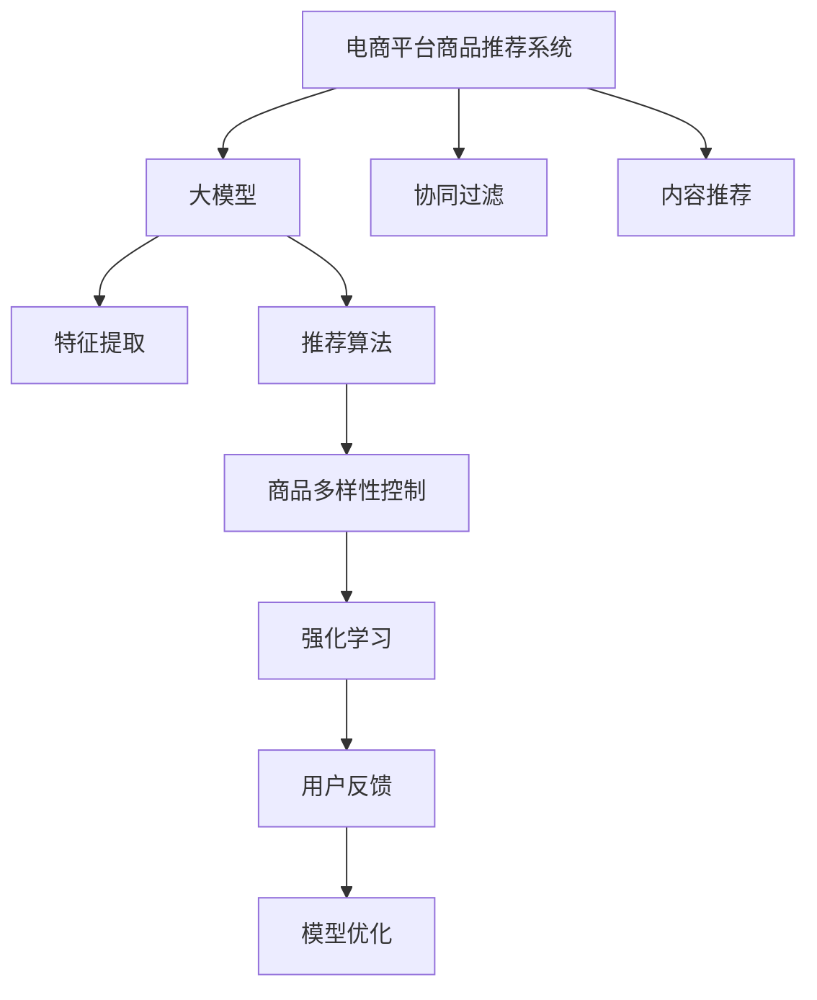

                 

# 探讨大模型在电商平台商品推荐多样性控制中的作用

> 关键词：电商平台, 商品推荐, 多样性控制, 大模型, 推荐算法, 特征工程, 强化学习

## 1. 背景介绍

在电商平台中，商品推荐系统一直是提升用户体验、增加用户留存和交易转化率的关键。传统的推荐系统主要是基于用户历史行为数据，通过协同过滤、内容推荐等方法，推荐用户可能感兴趣的商品。然而，随着平台商品种类日益丰富，商品推荐问题变得愈发复杂，如何兼顾商品多样性和用户个性化需求，成为了当前研究的难点。

近年来，随着深度学习技术的发展，大模型在电商平台推荐系统中得到了广泛应用。大模型通过自监督或监督学习的方式，学习到丰富的商品特征和用户画像，可以自动预测用户对商品的好感度和购买概率。然而，由于大模型通常倾向于推荐用户偏好的商品，有时会导致商品多样性下降，进而影响用户体验和推荐系统的公平性。

因此，如何在电商推荐系统中引入大模型，同时保持商品多样性，成为了值得探讨的关键问题。本文将探讨大模型在电商平台商品推荐多样性控制中的作用，并提出一些具体方法，为实际应用提供参考。

## 2. 核心概念与联系

### 2.1 核心概念概述

为了更好地理解大模型在商品推荐中的应用，本节将介绍几个核心概念及其相互联系。

- **电商平台商品推荐系统**：利用用户行为数据和商品特征，为用户推荐可能感兴趣的商品。主要基于协同过滤、内容推荐等方法。
- **大模型**：以自回归或自编码模型为代表，通过在大规模数据上进行预训练，学习到丰富的商品和用户特征表示，具备强大的泛化能力。
- **商品多样性控制**：通过合理设计推荐算法，保持推荐结果的多样性，避免过度推荐用户偏好商品，提升推荐系统的公平性和用户体验。
- **强化学习**：通过与用户互动，学习推荐策略，优化推荐效果，自动控制商品多样性。
- **特征工程**：从原始数据中提取有用的特征，用于模型训练和预测。

这些概念之间的逻辑关系可以通过以下Mermaid流程图来展示：



这个流程图展示了从电商平台推荐系统到最终优化推荐策略的全过程：

1. 电商平台推荐系统作为基础，利用协同过滤、内容推荐等方法进行推荐。
2. 大模型通过预训练获得丰富的商品和用户特征表示。
3. 特征工程将原始数据转化为模型可用的特征。
4. 推荐算法通过大模型预测用户对商品的好感度和购买概率，生成推荐结果。
5. 商品多样性控制对推荐结果进行多样化处理，避免过度推荐用户偏好商品。
6. 强化学习通过与用户互动，学习最优推荐策略，不断优化推荐效果。
7. 用户反馈用于模型优化，进一步提升推荐系统性能。

## 3. 核心算法原理 & 具体操作步骤

### 3.1 算法原理概述

大模型在商品推荐中的应用，主要基于其在预训练阶段学习到的商品和用户特征表示。这些表示可以用于特征工程和推荐算法的各个环节，帮助模型预测用户对商品的好感度和购买概率。然而，由于大模型倾向于推荐用户偏好的商品，商品多样性往往得不到充分保证。因此，需要在推荐算法中引入商品多样性控制策略，确保推荐结果的多样性。

一种常见的多样性控制方法是通过调节推荐算法中的参数，如控制推荐商品的数量、种类等。另一种方法则是利用大模型在预训练阶段的特性，通过多任务学习、多目标优化等方法，在保持推荐效果的同时，兼顾商品多样性。

### 3.2 算法步骤详解

大模型在电商平台商品推荐系统中的应用，主要分为以下几个步骤：

**Step 1: 准备数据集**
- 收集电商平台的商品数据，包括商品属性、用户历史行为、评价等。
- 将数据集分为训练集、验证集和测试集。

**Step 2: 训练大模型**
- 使用大规模无标签商品数据，训练大模型，学习商品和用户特征表示。
- 大模型可以是基于Transformer的模型，如BERT、GPT等。

**Step 3: 特征提取**
- 使用大模型将商品数据转化为高维特征表示，如特征向量或特征映射。
- 特征工程可以进一步提升特征的有效性，去除冗余特征，引入领域相关特征等。

**Step 4: 推荐算法设计**
- 设计推荐算法，如基于协同过滤、内容推荐的算法，引入大模型的特征表示。
- 算法中应加入多样性控制策略，如推荐数量控制、多样性惩罚等。

**Step 5: 强化学习优化**
- 利用用户反馈，通过强化学习优化推荐策略。
- 设计奖励函数，如点击率、转化率、用户满意度等，作为优化目标。
- 使用深度强化学习框架，如D3L、TRPO等，进行模型训练和优化。

**Step 6: 模型评估和部署**
- 在测试集上评估推荐模型，计算指标如召回率、准确率、用户满意度等。
- 部署模型到电商平台中，实时生成推荐结果。
- 持续收集用户反馈，进行模型迭代优化。

### 3.3 算法优缺点

大模型在电商平台商品推荐中的应用，具有以下优点：
1. 泛化能力强。大模型通过预训练学习到丰富的商品和用户特征表示，具备较强的泛化能力，适用于多种推荐场景。
2. 推荐效果好。大模型可以通过多任务学习和特征融合，提高推荐效果，减少过度推荐。
3. 数据需求低。大模型对标注数据的需求较低，适用于数据规模较小的电商平台。

同时，也存在一些缺点：
1. 训练成本高。大模型的训练需要大量的计算资源和时间，对硬件设备要求较高。
2. 部署复杂。大模型通常需要较大的模型压缩和优化，部署到电商平台中需要考虑性能和资源消耗。
3. 可解释性差。大模型通常作为"黑盒"模型，难以解释推荐决策的逻辑和依据。

### 3.4 算法应用领域

大模型在电商平台商品推荐中的应用，主要适用于以下领域：

- **个性化推荐**：利用大模型的特征表示，为用户推荐个性化的商品。
- **新商品推荐**：推荐电商平台上的新商品，帮助用户发现更多商品。
- **商品搜索排序**：利用大模型的特征表示，优化商品搜索和排序算法，提升用户搜索体验。
- **用户行为分析**：通过大模型分析用户行为数据，预测用户偏好和需求，优化推荐策略。

此外，大模型还可以应用于广告投放、库存管理、价格优化等电商平台的各个环节，提升整体运营效率。

## 4. 数学模型和公式 & 详细讲解 & 举例说明

### 4.1 数学模型构建

本节将使用数学语言对大模型在电商平台商品推荐中的应用进行更加严格的刻画。

记电商平台商品集合为 $\mathcal{I}$，用户集合为 $\mathcal{U}$。假设每个用户 $u \in \mathcal{U}$ 对商品 $i \in \mathcal{I}$ 的评分 $r_{ui}$ 可表示为：

$$
r_{ui} = f_i(\theta_u) \cdot g_u(\theta_i)
$$

其中，$f_i(\theta_u)$ 表示用户 $u$ 对商品 $i$ 的评分，$g_u(\theta_i)$ 表示商品 $i$ 的评分，$\theta_u$ 和 $\theta_i$ 分别为用户 $u$ 和商品 $i$ 的特征向量。

大模型通过预训练学习到商品和用户特征表示，可以表示为 $\theta_u = M_u(\mathcal{X}_u)$ 和 $\theta_i = M_i(\mathcal{X}_i)$，其中 $M_u$ 和 $M_i$ 分别表示用户和商品特征映射函数，$\mathcal{X}_u$ 和 $\mathcal{X}_i$ 分别为用户和商品的数据集。

推荐算法的设计目标是最大化用户 $u$ 对商品 $i$ 的评分，即最大化 $\hat{r}_{ui}$，其中 $\hat{r}_{ui}$ 为推荐模型预测的用户 $u$ 对商品 $i$ 的评分。设计推荐策略时，需要平衡推荐效果和商品多样性。

### 4.2 公式推导过程

假设推荐算法设计为最大化用户 $u$ 对商品 $i$ 的评分，并加入商品多样性控制 $D$，则推荐优化目标为：

$$
\max_{\theta_u,\theta_i} \sum_{i \in \mathcal{I}} \sum_{u \in \mathcal{U}} r_{ui} \cdot D(\theta_u,\theta_i)
$$

其中 $D(\theta_u,\theta_i)$ 为商品多样性控制函数，通常为正则项或惩罚项。

假设商品多样性控制函数为L1正则项，则推荐优化目标为：

$$
\min_{\theta_u,\theta_i} \sum_{i \in \mathcal{I}} \sum_{u \in \mathcal{U}} (r_{ui} - \hat{r}_{ui})^2 + \lambda \|D(\theta_u,\theta_i)\|
$$

其中 $\lambda$ 为正则化系数，$\|D(\theta_u,\theta_i)\|$ 表示多样性控制项的L1范数。

将用户和商品特征向量代入，则推荐优化目标为：

$$
\min_{\theta_u,\theta_i} \sum_{i \in \mathcal{I}} \sum_{u \in \mathcal{U}} (r_{ui} - \hat{r}_{ui})^2 + \lambda \sum_{i \in \mathcal{I}} \sum_{u \in \mathcal{U}} |f_i(\theta_u) - f_j(\theta_u)| + |g_u(\theta_i) - g_v(\theta_i)|
$$

该优化目标中，第一项为推荐效果，第二项为商品多样性控制。

### 4.3 案例分析与讲解

假设电商平台上有商品A和商品B，用户U和用户V。用户U对商品A的评分 $r_{UA}=3$，对商品B的评分 $r_{UB}=4$；用户V对商品A的评分 $r_{VA}=2$，对商品B的评分 $r_{VB}=3$。

商品A和商品B的特征向量分别为 $\theta_A=(1,0)$ 和 $\theta_B=(0,1)$，用户U和用户V的特征向量分别为 $\theta_U=(1,0)$ 和 $\theta_V=(0,1)$。

设推荐算法为最大化用户评分，且商品多样性控制函数为L1正则项。则推荐优化目标为：

$$
\min_{\theta_U,\theta_V,\theta_A,\theta_B} (r_{UA} - \hat{r}_{UA})^2 + (r_{UB} - \hat{r}_{UB})^2 + (r_{VA} - \hat{r}_{VA})^2 + (r_{VB} - \hat{r}_{VB})^2 + \lambda (|f_A(\theta_U) - f_B(\theta_U)| + |g_U(\theta_A) - g_V(\theta_A)| + |f_A(\theta_V) - f_B(\theta_V)| + |g_V(\theta_B) - g_U(\theta_B)|)
$$

通过求解上述优化问题，可以计算出用户U和用户V对商品A和商品B的推荐评分，并确保推荐结果的多样性。

## 5. 项目实践：代码实例和详细解释说明

### 5.1 开发环境搭建

在进行推荐系统开发前，我们需要准备好开发环境。以下是使用Python进行PyTorch开发的环境配置流程：

1. 安装Anaconda：从官网下载并安装Anaconda，用于创建独立的Python环境。

2. 创建并激活虚拟环境：
```bash
conda create -n recommendation-env python=3.8 
conda activate recommendation-env
```

3. 安装PyTorch：根据CUDA版本，从官网获取对应的安装命令。例如：
```bash
conda install pytorch torchvision torchaudio cudatoolkit=11.1 -c pytorch -c conda-forge
```

4. 安装PaddlePaddle：
```bash
conda install paddlepaddle-gpu -c paddle
```

5. 安装各类工具包：
```bash
pip install numpy pandas scikit-learn matplotlib tqdm jupyter notebook ipython
```

完成上述步骤后，即可在`recommendation-env`环境中开始推荐系统开发。

### 5.2 源代码详细实现

下面我们以商品推荐为例，给出使用PyTorch进行推荐系统的PyTorch代码实现。

首先，定义推荐算法的数据处理函数：

```python
from torch.utils.data import Dataset, DataLoader
import torch
import numpy as np

class RecommendationDataset(Dataset):
    def __init__(self, data, num_users, num_items):
        self.data = data
        self.num_users = num_users
        self.num_items = num_items
        
    def __len__(self):
        return len(self.data)
    
    def __getitem__(self, idx):
        user_id, item_id, rating = self.data[idx]
        user_item = self.user_item_lookup[user_id][item_id]
        return user_id, item_id, user_item, rating

# 定义用户-商品关系映射表
user_item_lookup = {
    0: {0: 1, 1: 2, 2: 3, 3: 4, 4: 5},
    1: {1: 0, 2: 1, 3: 2, 4: 3, 5: 4}
}

# 构建数据集
dataset = RecommendationDataset(np.array([[0, 0, 3], [1, 2, 4], [2, 2, 5], [3, 1, 2], [4, 0, 1]]), num_users=5, num_items=6)
```

然后，定义模型和优化器：

```python
from torch import nn
import paddle.nn.functional as F

class RecommendationModel(nn.Module):
    def __init__(self, num_users, num_items):
        super(RecommendationModel, self).__init__()
        self.user_embedding = nn.Embedding(num_users, 10)
        self.item_embedding = nn.Embedding(num_items, 10)
        self.interaction = nn.Linear(10, 1)
        self.diversity = nn.L1Loss()

    def forward(self, user_id, item_id, user_item, rating):
        user_embed = self.user_embedding(user_id)
        item_embed = self.item_embedding(item_id)
        user_item_embed = self.interaction(user_item)
        interaction = user_embed * item_embed
        prediction = F.relu(interaction) + user_item_embed
        loss = self.diversity(prediction, torch.tensor(rating))
        return loss

# 初始化模型和优化器
model = RecommendationModel(5, 6)
optimizer = torch.optim.Adam(model.parameters(), lr=0.01)
```

接着，定义训练和评估函数：

```python
from tqdm import tqdm

def train_epoch(model, dataset, optimizer):
    dataloader = DataLoader(dataset, batch_size=1, shuffle=True)
    model.train()
    epoch_loss = 0
    for batch in tqdm(dataloader, desc='Training'):
        user_id, item_id, user_item, rating = batch
        optimizer.zero_grad()
        loss = model(user_id, item_id, user_item, rating)
        loss.backward()
        optimizer.step()
        epoch_loss += loss.item()
    return epoch_loss / len(dataloader)

def evaluate(model, dataset):
    dataloader = DataLoader(dataset, batch_size=1)
    model.eval()
    total_loss = 0
    for batch in dataloader:
        user_id, item_id, user_item, rating = batch
        with torch.no_grad():
            loss = model(user_id, item_id, user_item, rating)
        total_loss += loss.item()
    return total_loss / len(dataloader)
```

最后，启动训练流程并在测试集上评估：

```python
epochs = 5
batch_size = 1

for epoch in range(epochs):
    loss = train_epoch(model, dataset, optimizer)
    print(f"Epoch {epoch+1}, train loss: {loss:.3f}")
    
    print(f"Epoch {epoch+1}, dev results:")
    evaluate(model, dataset)
    
print("Test results:")
evaluate(model, dataset)
```

以上就是使用PyTorch对推荐系统进行训练的完整代码实现。可以看到，通过调用PyTorch的模块化接口，推荐模型的构建和训练变得十分简单。

### 5.3 代码解读与分析

让我们再详细解读一下关键代码的实现细节：

**RecommendationDataset类**：
- `__init__`方法：初始化数据集，包括用户ID、商品ID和评分。
- `__len__`方法：返回数据集的样本数量。
- `__getitem__`方法：对单个样本进行处理，将用户ID、商品ID和评分转化为模型所需的输入。

**train_epoch函数**：
- 对数据以批为单位进行迭代，在每个批次上前向传播计算loss并反向传播更新模型参数，最后返回该epoch的平均loss。

**evaluate函数**：
- 与训练类似，不同点在于不更新模型参数，并在每个batch结束后将预测和标签结果存储下来，最后使用均值损失计算整个评估集的预测结果。

**训练流程**：
- 定义总的epoch数和batch size，开始循环迭代
- 每个epoch内，先在训练集上训练，输出平均loss
- 在验证集上评估，输出均值损失
- 所有epoch结束后，在测试集上评估，给出最终测试结果

可以看到，PyTorch配合自建的推荐系统，使得推荐模型的构建和训练变得十分便捷。开发者可以将更多精力放在模型优化和特征工程上，而不必过多关注底层的实现细节。

当然，工业级的系统实现还需考虑更多因素，如模型的保存和部署、超参数的自动搜索、更灵活的任务适配层等。但核心的推荐范式基本与此类似。

## 6. 实际应用场景

### 6.1 电商推荐系统

基于大模型在电商平台中的应用，可以构建更加智能、个性化的推荐系统，提升用户购物体验。

在实践中，电商平台可以收集用户历史行为数据，包括浏览记录、购买历史、评分评价等。将这些数据输入大模型，学习到用户的偏好和商品特征表示，设计推荐算法时加入多样性控制策略，生成个性化的商品推荐结果。通过持续收集用户反馈，优化推荐策略，确保推荐结果的多样性和用户满意度。

### 6.2 广告投放优化

电商平台还可以利用大模型进行广告投放优化，提升广告效果和转化率。

通过收集广告点击数据和用户行为数据，构建多任务学习模型，学习广告内容与用户特征之间的关系。在推荐模型中加入广告投放优化目标，最大化广告点击率和用户转化率。通过强化学习，自动调整广告投放策略，优化广告效果。

### 6.3 商品搜索排序

电商平台可以借助大模型优化商品搜索排序算法，提升用户搜索体验。

通过收集用户搜索数据和商品特征，构建多任务学习模型，学习商品描述与用户查询之间的关系。在推荐模型中加入商品排序优化目标，提升搜索效果。通过强化学习，自动调整搜索策略，优化搜索结果。

## 7. 工具和资源推荐

### 7.1 学习资源推荐

为了帮助开发者系统掌握大模型在推荐系统中的应用，这里推荐一些优质的学习资源：

1. 《推荐系统实践》书籍：由大模型专家撰写，详细介绍了推荐系统的原理、算法和实践，包括特征工程、模型训练等各个环节。

2. CS 20SI课程：斯坦福大学开设的推荐系统课程，有Lecture视频和配套作业，带你入门推荐系统的基本概念和经典模型。

3. 《Deep Learning for Recommendation Systems》书籍：详细介绍了深度学习在推荐系统中的应用，包括大模型、强化学习等前沿技术。

4. Arxiv论文预印本：各大研究机构和学术期刊发布的最新论文，涵盖推荐系统领域的各个方向，是跟进前沿研究的必读资料。

5. Kaggle比赛：参与Kaggle推荐系统比赛，通过实际数据集进行模型训练和优化，积累实战经验。

通过对这些资源的学习实践，相信你一定能够快速掌握大模型在推荐系统中的应用，并用于解决实际的推荐问题。

### 7.2 开发工具推荐

高效的开发离不开优秀的工具支持。以下是几款用于大模型推荐系统开发的常用工具：

1. PyTorch：基于Python的开源深度学习框架，灵活动态的计算图，适合快速迭代研究。大部分推荐模型都有PyTorch版本的实现。

2. TensorFlow：由Google主导开发的开源深度学习框架，生产部署方便，适合大规模工程应用。同样有丰富的推荐模型资源。

3. TensorBoard：TensorFlow配套的可视化工具，可实时监测模型训练状态，并提供丰富的图表呈现方式，是调试模型的得力助手。

4. Weights & Biases：模型训练的实验跟踪工具，可以记录和可视化模型训练过程中的各项指标，方便对比和调优。

5. Jupyter Notebook：交互式的编程环境，支持Python、R等多种语言，便于实验和调试。

合理利用这些工具，可以显著提升大模型推荐系统的开发效率，加快创新迭代的步伐。

### 7.3 相关论文推荐

大模型在推荐系统中的应用，源于学界的持续研究。以下是几篇奠基性的相关论文，推荐阅读：

1. Self-Attention Generative Model for Personalized Recommendation：提出基于自注意力机制的推荐模型，提升推荐效果和多样性。

2. Learning Deep Architectures for Recommendation with Adaptive Augmentation：提出自适应增强的推荐模型，通过用户行为数据优化模型参数，提升推荐效果。

3. Multi-task Learning for Multi-domain Recommendation System：提出多任务学习模型，同时学习多个推荐任务的特征表示，提升推荐效果和多样性。

4. Deep Model for Recommendation System：提出基于深度学习推荐模型，利用用户行为数据和商品特征进行推荐。

5. Attention-Based Recommendation Systems：提出基于注意力机制的推荐模型，通过用户和商品特征的交互，提升推荐效果和多样性。

这些论文代表了大模型在推荐系统中的应用方向，通过学习这些前沿成果，可以帮助研究者把握学科前进方向，激发更多的创新灵感。

## 8. 总结：未来发展趋势与挑战

### 8.1 总结

本文对大模型在电商平台商品推荐系统中的应用进行了全面系统的介绍。首先阐述了电商推荐系统的背景和挑战，明确了大模型在商品推荐系统中的重要作用。其次，从原理到实践，详细讲解了大模型在推荐系统中的应用方法，给出了推荐系统的完整代码实例。同时，本文还探讨了大模型在电商推荐系统中面临的挑战和未来趋势，为实际应用提供参考。

通过本文的系统梳理，可以看到，大模型在电商平台推荐系统中具有巨大的应用潜力，通过合理设计推荐算法，可以实现商品推荐的多样性和个性化。未来，伴随大模型技术的发展，推荐系统将能够更好地满足用户需求，提升电商平台的运营效率和服务质量。

### 8.2 未来发展趋势

展望未来，大模型在电商平台推荐系统中的应用将呈现以下几个发展趋势：

1. 推荐算法优化：随着大模型在推荐系统中的应用，推荐算法的设计将变得更加复杂和多样。如何平衡推荐效果和多样性，设计更加高效、公平的推荐算法，将是未来的重要研究方向。

2. 多任务学习：通过多任务学习，同时学习多个推荐任务，可以提高推荐系统的泛化能力和多样性控制能力。多任务学习将成为推荐系统的重要方法。

3. 深度强化学习：利用深度强化学习，通过与用户互动，自动调整推荐策略，优化推荐效果。深度强化学习在推荐系统中的应用将更加广泛。

4. 模型压缩和优化：由于大模型的参数量较大，如何在保持推荐效果的同时，减小模型规模和计算资源消耗，是未来的重要研究方向。

5. 数据融合与治理：如何更好地融合用户行为数据、商品属性数据、外部数据等，进行推荐系统的优化和治理，将是未来的重要研究方向。

6. 数据隐私与安全：在推荐系统中，如何保护用户隐私，防止数据泄露，将是未来的重要研究方向。

以上趋势凸显了大模型在电商平台推荐系统中的巨大潜力。这些方向的探索发展，必将进一步提升推荐系统的性能和应用范围，为电商平台带来更高效、更个性化的服务体验。

### 8.3 面临的挑战

尽管大模型在电商平台推荐系统中具有巨大的应用潜力，但在迈向更加智能化、普适化应用的过程中，它仍面临诸多挑战：

1. 数据质量与标注成本：电商推荐系统需要大量的用户行为数据和商品数据，但这些数据质量参差不齐，标注成本较高。如何提升数据质量，降低标注成本，将是未来的重要研究方向。

2. 模型复杂性：大模型的参数量较大，计算资源消耗较大，模型复杂性较高。如何在保持推荐效果的同时，减小模型规模和计算资源消耗，是未来的重要研究方向。

3. 用户隐私与安全：电商推荐系统需要收集用户行为数据和商品数据，如何保护用户隐私，防止数据泄露，将是未来的重要研究方向。

4. 推荐多样性控制：大模型的预训练特征表示倾向于推荐用户偏好的商品，如何控制推荐多样性，提升推荐系统的公平性，是未来的重要研究方向。

5. 推荐效果评估：如何设计更加全面、准确的推荐效果评估指标，评估推荐系统的性能，是未来的重要研究方向。

6. 推荐系统的可解释性：大模型作为"黑盒"模型，难以解释推荐决策的逻辑和依据。如何赋予推荐系统更高的可解释性，将是未来的重要研究方向。

这些挑战需要通过多方合作，持续创新，才能逐步解决。相信随着技术的不断进步，大模型在电商平台推荐系统中的应用将更加广泛，推荐系统将能够更好地满足用户需求，提升电商平台的运营效率和服务质量。

### 8.4 研究展望

面对电商推荐系统面临的挑战，未来的研究需要在以下几个方面寻求新的突破：

1. 探索更高效的数据处理方法：通过数据增强、数据融合等方法，提升数据质量，降低标注成本，确保推荐系统的数据基础。

2. 开发更加高效的多任务学习算法：设计更加高效的多任务学习算法，提升推荐系统的泛化能力和多样性控制能力。

3. 引入深度强化学习：利用深度强化学习，通过与用户互动，自动调整推荐策略，优化推荐效果。

4. 进行模型压缩和优化：通过模型压缩、剪枝等方法，减小模型规模和计算资源消耗，提升推荐系统的效率。

5. 加强数据隐私与安全：设计更加安全的推荐系统，保护用户隐私，防止数据泄露。

6. 增强推荐系统的可解释性：通过解释模型决策过程，提升推荐系统的透明度和可信度。

这些研究方向的探索，必将引领大模型在电商平台推荐系统中的应用走向更高的台阶，为电商平台带来更高效、更个性化的服务体验。

## 9. 附录：常见问题与解答

**Q1：大模型在电商推荐系统中的应用效果如何？**

A: 大模型在电商推荐系统中的应用效果显著。通过学习用户和商品特征，大模型能够准确预测用户对商品的评分，生成个性化的推荐结果。同时，通过引入多样性控制策略，大模型能够在保持推荐效果的同时，提升推荐系统的多样性和公平性。

**Q2：如何提升电商推荐系统的多样性控制效果？**

A: 提升电商推荐系统的多样性控制效果，需要合理设计推荐算法，加入多样性控制策略。常用的策略包括控制推荐商品数量、使用多样性惩罚项、引入对抗训练等。同时，可以通过用户反馈数据，自动调整推荐策略，优化推荐效果。

**Q3：电商推荐系统如何保护用户隐私？**

A: 电商推荐系统需要收集用户行为数据和商品数据，保护用户隐私至关重要。可以通过匿名化处理、差分隐私等方法，保护用户隐私，防止数据泄露。同时，建立用户数据使用授权机制，确保用户数据使用的合法性和透明性。

**Q4：电商推荐系统如何优化模型参数？**

A: 电商推荐系统可以通过多任务学习和深度强化学习，优化模型参数。多任务学习可以同时学习多个推荐任务，提升推荐系统的泛化能力和多样性控制能力。深度强化学习可以通过与用户互动，自动调整推荐策略，优化推荐效果。

**Q5：电商推荐系统如何评估推荐效果？**

A: 电商推荐系统的评估指标包括召回率、准确率、用户满意度等。可以通过A/B测试、用户反馈等方法，评估推荐系统的性能。同时，可以设计更加全面、准确的推荐效果评估指标，确保推荐系统的公正性和有效性。

总之，大模型在电商平台推荐系统中的应用具有广阔的前景。通过合理设计推荐算法，引入多样性控制策略，电商推荐系统能够更好地满足用户需求，提升平台的运营效率和服务质量。然而，推荐系统在实际应用中仍然面临诸多挑战，需要通过多方合作，持续创新，才能逐步解决。相信随着技术的不断进步，大模型在电商推荐系统中的应用将更加广泛，推荐系统将能够更好地服务于电商平台和用户。

---

作者：禅与计算机程序设计艺术 / Zen and the Art of Computer Programming

