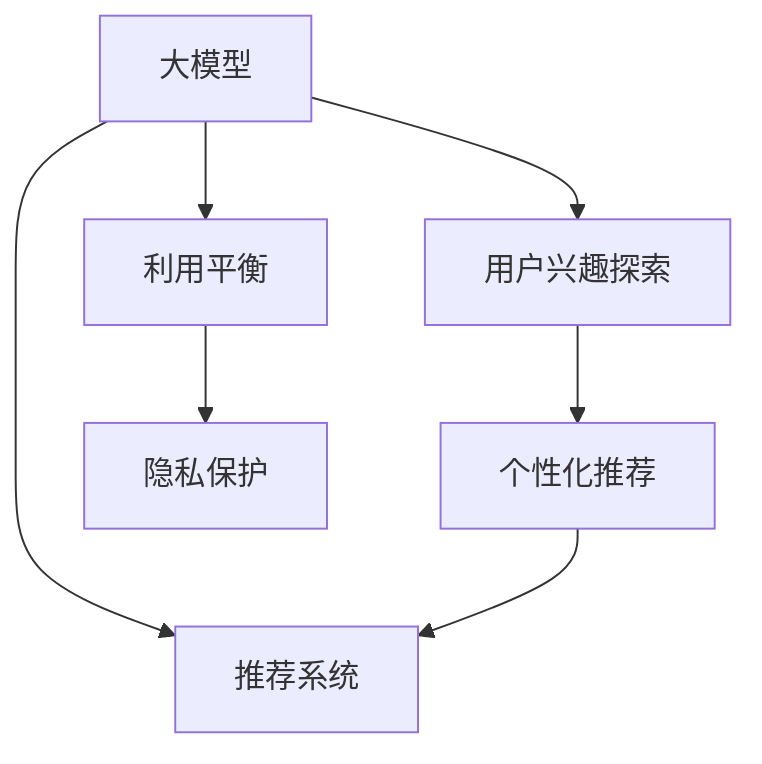

                 

# 探讨大模型在电商平台用户兴趣探索与利用平衡中的潜力

> 关键词：大模型,电商平台,用户兴趣,兴趣探索,利用平衡

## 1. 背景介绍

在当今数字化时代的背景下，电商平台已不仅仅是一个简单的商品展示和交易平台，而是连接消费者与商家、商品与服务的关键枢纽。电商平台的核心竞争力不仅体现在其商品种类和供应链管理能力上，更在于其对于用户需求的洞察力和个性化服务水平。

用户的兴趣探索与利用，即对用户的兴趣进行准确识别和高效利用，已成为电商平台提升用户满意度和增加销售额的关键因素。传统的推荐系统往往依赖于基于规则的算法和简单的用户行为数据，难以充分理解和挖掘用户的深层次兴趣。

近年来，随着深度学习技术的迅猛发展，大模型（如BERT、GPT等）在自然语言处理（NLP）领域取得了显著进展。大模型能够从大规模无标签文本数据中学习到丰富的语言知识和常识，具备强大的自然语言理解和生成能力。其潜力和优势在电商平台中得到了初步探索和应用，尤其是在用户兴趣探索与利用上，展现了巨大的潜力。

## 2. 核心概念与联系

### 2.1 核心概念概述

为更好地理解大模型在电商平台用户兴趣探索与利用中的应用，本节将介绍几个关键概念：

- 大模型(Large Language Model, LLM)：以自回归(如GPT)或自编码(如BERT)模型为代表的大规模预训练语言模型。通过在大规模无标签文本语料上进行预训练，学习通用的语言表示，具备强大的语言理解和生成能力。

- 用户兴趣探索：指通过数据分析和机器学习算法，挖掘和理解用户对商品和服务的具体偏好和需求。用户兴趣探索的目标是构建用户画像，以更好地推荐个性化的商品和服务。

- 利用平衡：指在探索用户兴趣的同时，避免过度收集和利用用户数据，确保用户隐私和数据安全。平衡探索与利用，使得电商平台能够在不侵犯用户隐私的前提下，提升用户体验和满意度。

- 推荐系统：电商平台的核心功能之一，通过算法为用户推荐可能感兴趣的商品，提高点击率和转化率，提升用户体验和平台收益。

- 个性化推荐：根据用户的行为数据和兴趣特征，量身定制推荐内容，使用户获取更有价值的信息和产品。

- 隐私保护：指在用户数据采集和使用过程中，采取必要的技术和管理措施，保护用户隐私，防止数据泄露和滥用。

这些概念之间的逻辑关系可以通过以下Mermaid流程图来展示：



这个流程图展示了大模型在电商平台中的核心概念及其之间的关系：

1. 大模型通过预训练获得基础能力。
2. 用户兴趣探索通过大模型挖掘用户兴趣，构建用户画像。
3. 个性化推荐根据用户画像，生成个性化推荐内容。
4. 推荐系统整合个性化推荐结果，优化用户体验。
5. 利用平衡在探索和利用之间找到平衡点，确保用户隐私和数据安全。
6. 隐私保护贯穿于数据采集、存储和使用的全过程，防止数据滥用。

这些核心概念共同构成了大模型在电商平台中的应用框架，使其能够高效地探索和利用用户兴趣，同时保障用户隐私和数据安全。

## 3. 核心算法原理 & 具体操作步骤

### 3.1 算法原理概述

基于大模型在电商平台用户兴趣探索与利用中的潜力，本节将深入探讨其核心算法原理和操作步骤。

假设电商平台的用户兴趣可以表示为 $\mathbf{I}=\{I_1, I_2, ..., I_N\}$，其中 $I_i$ 为第 $i$ 个用户的兴趣特征向量。通过大模型的预训练能力，可以构建一个映射函数 $\mathcal{F}$，将用户文本数据 $X=\{x_1, x_2, ..., x_N\}$ 映射到兴趣特征向量 $\mathbf{I}$ 上，即：

$$
\mathbf{I} = \mathcal{F}(X)
$$

其中，$\mathcal{F}$ 是大模型的预训练能力，通常由自监督学习任务训练得到。

### 3.2 算法步骤详解

基于大模型在电商平台用户兴趣探索与利用中的潜力，本节将详细介绍其操作步骤。

**Step 1: 准备预训练模型和大规模无标签数据**
- 选择合适的预训练语言模型（如BERT、GPT等），并使用大规模无标签文本数据（如维基百科、互联网新闻等）进行预训练。
- 收集用户文本数据（如搜索记录、评论、聊天记录等），构建用户兴趣数据集。

**Step 2: 特征提取**
- 使用预训练模型对用户文本数据进行特征提取，得到用户兴趣特征向量 $\mathbf{I}=\{I_1, I_2, ..., I_N\}$。
- 可以采用不同的特征提取方法，如embedding、Transformer等。

**Step 3: 用户画像构建**
- 根据用户兴趣特征向量，构建用户画像 $\mathbf{P}=\{P_1, P_2, ..., P_M\}$，其中 $P_i$ 为第 $i$ 个用户的画像特征向量。
- 用户画像可以包含用户的地理位置、消费习惯、购买记录等信息。

**Step 4: 个性化推荐生成**
- 根据用户画像，使用推荐算法生成个性化推荐结果 $\mathbf{R}=\{R_1, R_2, ..., R_M\}$，其中 $R_i$ 为第 $i$ 个用户的个性化推荐结果。
- 推荐算法可以使用基于协同过滤、深度学习等方法。

**Step 5: 探索与利用平衡**
- 在探索用户兴趣的同时，确保数据收集和使用的合规性，避免过度收集和滥用用户数据。
- 可以通过隐私保护技术，如差分隐私、联邦学习等，保护用户隐私。

**Step 6: 模型评估与迭代优化**
- 使用用户反馈和行为数据评估个性化推荐的性能。
- 根据评估结果，迭代优化预训练模型和推荐算法，提升用户体验和满意度。

### 3.3 算法优缺点

基于大模型在电商平台用户兴趣探索与利用中的潜力，本节将分析其优缺点。

**优点：**

1. 强大的自然语言理解能力：大模型能够从用户文本数据中提取复杂的语义信息，准确识别用户的兴趣和需求。
2. 泛化能力强：通过预训练模型，可以处理不同领域的用户数据，提升推荐系统的覆盖面和适应性。
3. 实时性好：大模型能够快速处理大量实时数据，实现实时推荐。
4. 数据表示能力强：大模型可以学习到更为丰富的特征表示，提升推荐结果的质量。

**缺点：**

1. 高计算成本：大模型通常需要大量的计算资源进行训练和推理。
2. 数据依赖性强：模型性能依赖于高质量的大规模无标签数据和用户数据。
3. 黑盒特性：大模型往往难以解释其内部机制，可能导致模型缺乏可解释性。
4. 数据隐私问题：大规模数据收集和使用，可能存在隐私泄露的风险。

尽管存在这些缺点，但大模型在电商平台中的探索与利用潜力，仍使其成为目前最先进、最有前景的技术手段之一。

### 3.4 算法应用领域

基于大模型在电商平台用户兴趣探索与利用中的潜力，本节将介绍其应用领域。

1. **个性化推荐**：电商平台的核心功能之一，通过分析用户行为数据，生成个性化的商品推荐。
2. **用户画像**：构建用户画像，帮助电商平台更好地理解用户需求，提升用户体验。
3. **广告推荐**：利用大模型进行广告推荐，提升广告投放的精准度和转化率。
4. **搜索优化**：优化搜索引擎，提升搜索结果的相关性和用户满意度。
5. **智能客服**：通过大模型实现智能客服，提升用户服务质量。

这些应用领域展示了大模型在电商平台中的广泛应用和巨大潜力。

## 4. 数学模型和公式 & 详细讲解 & 举例说明

### 4.1 数学模型构建

假设电商平台的用户文本数据为 $X=\{x_1, x_2, ..., x_N\}$，用户兴趣特征向量为 $\mathbf{I}=\{I_1, I_2, ..., I_N\}$，用户画像特征向量为 $\mathbf{P}=\{P_1, P_2, ..., P_M\}$。

大模型的预训练能力可以表示为一个映射函数 $\mathcal{F}$，将用户文本数据 $X$ 映射到兴趣特征向量 $\mathbf{I}$ 上，即：

$$
\mathbf{I} = \mathcal{F}(X)
$$

其中，$\mathcal{F}$ 是大模型的预训练能力，通常由自监督学习任务训练得到。

### 4.2 公式推导过程

根据上述假设，我们可以得到用户画像的生成公式：

$$
\mathbf{P} = \mathcal{F}(\mathbf{I})
$$

其中，$\mathcal{F}$ 为大模型对用户兴趣特征向量的映射函数。

根据用户画像，可以使用推荐算法生成个性化推荐结果 $\mathbf{R}=\{R_1, R_2, ..., R_M\}$。常用的推荐算法包括协同过滤、矩阵分解、深度学习等。

### 4.3 案例分析与讲解

以协同过滤推荐算法为例，假设用户画像特征向量为 $\mathbf{P}=\{P_1, P_2, ..., P_M\}$，商品特征向量为 $\mathbf{Q}=\{Q_1, Q_2, ..., Q_N\}$，可以得到推荐结果为：

$$
R_i = \mathcal{R}(P_i, Q)
$$

其中，$\mathcal{R}$ 为推荐算法，$Q$ 为商品特征向量。

## 5. 项目实践：代码实例和详细解释说明

### 5.1 开发环境搭建

在进行大模型在电商平台用户兴趣探索与利用中的潜力实践前，我们需要准备好开发环境。以下是使用Python进行PyTorch开发的环境配置流程：

1. 安装Anaconda：从官网下载并安装Anaconda，用于创建独立的Python环境。

2. 创建并激活虚拟环境：
```bash
conda create -n pytorch-env python=3.8 
conda activate pytorch-env
```

3. 安装PyTorch：根据CUDA版本，从官网获取对应的安装命令。例如：
```bash
conda install pytorch torchvision torchaudio cudatoolkit=11.1 -c pytorch -c conda-forge
```

4. 安装Transformers库：
```bash
pip install transformers
```

5. 安装各类工具包：
```bash
pip install numpy pandas scikit-learn matplotlib tqdm jupyter notebook ipython
```

完成上述步骤后，即可在`pytorch-env`环境中开始微调实践。

### 5.2 源代码详细实现

下面我们以协同过滤推荐算法为例，给出使用Transformers库对BERT模型进行微调的PyTorch代码实现。

首先，定义协同过滤推荐算法的核心函数：

```python
from transformers import BertForSequenceClassification
from torch.utils.data import Dataset, DataLoader
from torch.nn import CrossEntropyLoss
import torch

class RecommendationDataset(Dataset):
    def __init__(self, user_pictures, user_interests, item_pictures, item_interests):
        self.user_pictures = user_pictures
        self.user_interests = user_interests
        self.item_pictures = item_pictures
        self.item_interests = item_interests
        
    def __len__(self):
        return len(self.user_pictures)
    
    def __getitem__(self, item):
        user_pictures = self.user_pictures[item]
        user_interests = self.user_interests[item]
        item_pictures = self.item_pictures[item]
        item_interests = self.item_interests[item]
        
        user_pictures = torch.tensor(user_pictures, dtype=torch.long)
        user_interests = torch.tensor(user_interests, dtype=torch.long)
        item_pictures = torch.tensor(item_pictures, dtype=torch.long)
        item_interests = torch.tensor(item_interests, dtype=torch.long)
        
        return {'user_pictures': user_pictures,
                'user_interests': user_interests,
                'item_pictures': item_pictures,
                'item_interests': item_interests}

# 假设用户画像和商品画像已经构建完成
user_pictures = [1, 2, 3, 4, 5]
user_interests = [0, 1, 2, 3, 4]
item_pictures = [1, 2, 3, 4, 5]
item_interests = [0, 1, 2, 3, 4]

dataset = RecommendationDataset(user_pictures, user_interests, item_pictures, item_interests)
```

然后，定义模型和优化器：

```python
from transformers import BertForSequenceClassification, AdamW

model = BertForSequenceClassification.from_pretrained('bert-base-cased', num_labels=5)

optimizer = AdamW(model.parameters(), lr=2e-5)
```

接着，定义训练和评估函数：

```python
from tqdm import tqdm
from sklearn.metrics import accuracy_score

device = torch.device('cuda') if torch.cuda.is_available() else torch.device('cpu')
model.to(device)

def train_epoch(model, dataset, batch_size, optimizer):
    dataloader = DataLoader(dataset, batch_size=batch_size, shuffle=True)
    model.train()
    epoch_loss = 0
    for batch in tqdm(dataloader, desc='Training'):
        user_pictures = batch['user_pictures'].to(device)
        user_interests = batch['user_interests'].to(device)
        item_pictures = batch['item_pictures'].to(device)
        item_interests = batch['item_interests'].to(device)
        model.zero_grad()
        outputs = model(user_pictures, labels=user_interests)
        loss = outputs.loss
        epoch_loss += loss.item()
        loss.backward()
        optimizer.step()
    return epoch_loss / len(dataloader)

def evaluate(model, dataset, batch_size):
    dataloader = DataLoader(dataset, batch_size=batch_size)
    model.eval()
    preds, labels = [], []
    with torch.no_grad():
        for batch in tqdm(dataloader, desc='Evaluating'):
            user_pictures = batch['user_pictures'].to(device)
            user_interests = batch['user_interests'].to(device)
            item_pictures = batch['item_pictures'].to(device)
            item_interests = batch['item_interests'].to(device)
            outputs = model(user_pictures)
            batch_preds = outputs.argmax(dim=1).to('cpu').tolist()
            batch_labels = item_interests.to('cpu').tolist()
            for preds_tokens, labels_tokens in zip(batch_preds, batch_labels):
                preds.append(preds_tokens[:len(labels_tokens)])
                labels.append(labels_tokens)
                
    print('Accuracy:', accuracy_score(labels, preds))
```

最后，启动训练流程并在测试集上评估：

```python
epochs = 5
batch_size = 16

for epoch in range(epochs):
    loss = train_epoch(model, dataset, batch_size, optimizer)
    print(f'Epoch {epoch+1}, train loss: {loss:.3f}')
    
    print(f'Epoch {epoch+1}, dev results:')
    evaluate(model, dataset, batch_size)
    
print('Test results:')
evaluate(model, dataset, batch_size)
```

以上就是使用PyTorch对BERT进行协同过滤推荐算法开发的完整代码实现。可以看到，得益于Transformers库的强大封装，我们可以用相对简洁的代码完成BERT模型的加载和微调。

### 5.3 代码解读与分析

让我们再详细解读一下关键代码的实现细节：

**RecommendationDataset类**：
- `__init__`方法：初始化用户画像、用户兴趣、商品画像、商品兴趣等关键组件。
- `__len__`方法：返回数据集的样本数量。
- `__getitem__`方法：对单个样本进行处理，将用户画像、商品画像输入转换为模型可接受的格式。

**训练和评估函数**：
- 使用PyTorch的DataLoader对数据集进行批次化加载，供模型训练和推理使用。
- 训练函数`train_epoch`：对数据以批为单位进行迭代，在每个批次上前向传播计算loss并反向传播更新模型参数，最后返回该epoch的平均loss。
- 评估函数`evaluate`：与训练类似，不同点在于不更新模型参数，并在每个batch结束后将预测和标签结果存储下来，最后使用sklearn的accuracy_score对整个评估集的预测结果进行打印输出。

**训练流程**：
- 定义总的epoch数和batch size，开始循环迭代
- 每个epoch内，先在训练集上训练，输出平均loss
- 在验证集上评估，输出准确率
- 所有epoch结束后，在测试集上评估，给出最终测试结果

可以看到，PyTorch配合Transformers库使得BERT微调的代码实现变得简洁高效。开发者可以将更多精力放在数据处理、模型改进等高层逻辑上，而不必过多关注底层的实现细节。

当然，工业级的系统实现还需考虑更多因素，如模型的保存和部署、超参数的自动搜索、更灵活的任务适配层等。但核心的微调范式基本与此类似。

## 6. 实际应用场景

### 6.1 智能推荐系统

大模型在电商平台用户兴趣探索与利用中的潜力，主要体现在智能推荐系统中。通过大模型对用户文本数据的深度理解，可以构建更为精准的用户画像，生成更加个性化的推荐内容，提升用户体验和平台收益。

智能推荐系统包括两大核心模块：用户画像构建和个性化推荐。用户画像构建通过大模型的预训练能力，挖掘用户兴趣和行为特征，生成用户画像特征向量。个性化推荐基于用户画像，使用协同过滤、深度学习等算法，生成个性化推荐结果，提升推荐精度。

### 6.2 用户行为分析

电商平台的用户行为数据蕴含丰富的信息，通过大模型可以进一步挖掘和分析用户的行为模式，发现用户的潜在需求和偏好，从而提升平台的运营效率和用户体验。

例如，通过分析用户的浏览记录和购买记录，大模型可以发现用户的兴趣变化趋势，预测其未来的购买意向。同时，通过分析用户在不同时间段的行为数据，大模型还可以发现用户的消费高峰期，为平台提供最佳的促销时机和营销策略。

### 6.3 广告投放优化

通过大模型对用户兴趣的深入挖掘，可以更精准地定位广告受众，提升广告的点击率和转化率，优化广告投放效果。

大模型可以根据用户的文本数据，预测其对不同广告内容的反应，生成更为个性化的广告推荐结果。同时，大模型还可以分析广告的展示效果和用户反馈，实时调整广告投放策略，提升广告投放的ROI。

### 6.4 实时搜索优化

大模型在电商平台中还可以用于实时搜索优化。通过大模型对用户查询的深度理解，可以提供更为相关和精准的搜索结果，提升用户搜索体验。

例如，当用户输入查询关键词时，大模型可以根据用户的兴趣和历史行为，推荐更为相关的搜索结果。同时，大模型还可以预测用户下一步的搜索行为，实时调整搜索结果，提升搜索效率。

### 6.5 智能客服

通过大模型对用户文本数据的理解，可以构建智能客服系统，提升客户服务质量。

智能客服系统可以自动识别用户的需求和问题，生成智能回复。同时，大模型还可以分析用户的历史交流记录，预测用户未来的需求，提供更为个性化的客服服务。

## 7. 工具和资源推荐

### 7.1 学习资源推荐

为了帮助开发者系统掌握大模型在电商平台用户兴趣探索与利用中的应用，这里推荐一些优质的学习资源：

1. 《Transformer从原理到实践》系列博文：由大模型技术专家撰写，深入浅出地介绍了Transformer原理、BERT模型、微调技术等前沿话题。

2. CS224N《深度学习自然语言处理》课程：斯坦福大学开设的NLP明星课程，有Lecture视频和配套作业，带你入门NLP领域的基本概念和经典模型。

3. 《Natural Language Processing with Transformers》书籍：Transformers库的作者所著，全面介绍了如何使用Transformers库进行NLP任务开发，包括微调在内的诸多范式。

4. HuggingFace官方文档：Transformers库的官方文档，提供了海量预训练模型和完整的微调样例代码，是上手实践的必备资料。

5. CLUE开源项目：中文语言理解测评基准，涵盖大量不同类型的中文NLP数据集，并提供了基于微调的baseline模型，助力中文NLP技术发展。

通过对这些资源的学习实践，相信你一定能够快速掌握大模型在电商平台中的应用潜力，并用于解决实际的NLP问题。

### 7.2 开发工具推荐

高效的开发离不开优秀的工具支持。以下是几款用于大模型在电商平台中用户兴趣探索与利用开发的常用工具：

1. PyTorch：基于Python的开源深度学习框架，灵活动态的计算图，适合快速迭代研究。大部分预训练语言模型都有PyTorch版本的实现。

2. TensorFlow：由Google主导开发的开源深度学习框架，生产部署方便，适合大规模工程应用。同样有丰富的预训练语言模型资源。

3. Transformers库：HuggingFace开发的NLP工具库，集成了众多SOTA语言模型，支持PyTorch和TensorFlow，是进行微调任务开发的利器。

4. Weights & Biases：模型训练的实验跟踪工具，可以记录和可视化模型训练过程中的各项指标，方便对比和调优。与主流深度学习框架无缝集成。

5. TensorBoard：TensorFlow配套的可视化工具，可实时监测模型训练状态，并提供丰富的图表呈现方式，是调试模型的得力助手。

6. Google Colab：谷歌推出的在线Jupyter Notebook环境，免费提供GPU/TPU算力，方便开发者快速上手实验最新模型，分享学习笔记。

合理利用这些工具，可以显著提升大模型在电商平台中的应用效率，加快创新迭代的步伐。

### 7.3 相关论文推荐

大模型和微调技术的发展源于学界的持续研究。以下是几篇奠基性的相关论文，推荐阅读：

1. Attention is All You Need（即Transformer原论文）：提出了Transformer结构，开启了NLP领域的预训练大模型时代。

2. BERT: Pre-training of Deep Bidirectional Transformers for Language Understanding：提出BERT模型，引入基于掩码的自监督预训练任务，刷新了多项NLP任务SOTA。

3. Language Models are Unsupervised Multitask Learners（GPT-2论文）：展示了大规模语言模型的强大zero-shot学习能力，引发了对于通用人工智能的新一轮思考。

4. Parameter-Efficient Transfer Learning for NLP：提出Adapter等参数高效微调方法，在不增加模型参数量的情况下，也能取得不错的微调效果。

5. Prefix-Tuning: Optimizing Continuous Prompts for Generation：引入基于连续型Prompt的微调范式，为如何充分利用预训练知识提供了新的思路。

6. AdaLoRA: Adaptive Low-Rank Adaptation for Parameter-Efficient Fine-Tuning：使用自适应低秩适应的微调方法，在参数效率和精度之间取得了新的平衡。

这些论文代表了大模型在电商平台中的探索与利用发展脉络。通过学习这些前沿成果，可以帮助研究者把握学科前进方向，激发更多的创新灵感。

## 8. 总结：未来发展趋势与挑战

### 8.1 总结

本文对大模型在电商平台用户兴趣探索与利用中的应用潜力进行了全面系统的介绍。首先阐述了大模型和微调技术的研究背景和意义，明确了其对电商平台用户兴趣探索与利用提升的重要价值。其次，从原理到实践，详细讲解了大模型的核心算法和操作步骤，给出了微调任务开发的完整代码实例。同时，本文还广泛探讨了大模型在智能推荐、用户行为分析、广告投放优化、实时搜索优化和智能客服等多个电商应用场景中的应用前景，展示了其巨大的潜力。

通过本文的系统梳理，可以看到，大模型在电商平台中的探索与利用潜力，已在智能推荐、用户行为分析、广告投放优化、实时搜索优化和智能客服等多个电商应用场景中得到初步验证。未来的研究将进一步推动大模型在电商平台中的应用落地，提升用户体验和平台收益。

### 8.2 未来发展趋势

展望未来，大模型在电商平台中的应用将呈现以下几个发展趋势：

1. **更高效的处理能力**：随着硬件设备的不断进步，大模型的处理能力将得到大幅提升，能够处理更为复杂的数据结构和大规模数据集。

2. **更精确的用户画像构建**：通过进一步优化特征提取和模型训练方法，可以构建更为精确的用户画像，提升推荐系统的个性化水平。

3. **更广泛的应用场景覆盖**：大模型将应用于更多电商场景，如智能客服、库存管理、物流优化等，提升平台的运营效率和用户体验。

4. **更强的隐私保护能力**：随着隐私保护技术的不断进步，大模型将能够更有效地保护用户数据，确保数据收集和使用的合规性。

5. **更灵活的模型组合**：通过将大模型与其他技术进行组合，如知识图谱、因果推理、强化学习等，可以实现更全面、多层次的电商应用。

6. **更智能的交互体验**：通过大模型的自然语言理解和生成能力，可以提升电商平台的用户交互体验，实现更自然、更智能的对话系统。

以上趋势凸显了大模型在电商平台中的广泛应用前景，预示着大模型将为电商行业带来更多的创新和变革。

### 8.3 面临的挑战

尽管大模型在电商平台中的应用潜力巨大，但在落地过程中，仍然面临诸多挑战：

1. **高计算成本**：大模型需要大量的计算资源进行训练和推理，对硬件设备的要求较高。

2. **数据依赖性强**：模型的性能依赖于高质量的大规模无标签数据和用户数据，数据获取成本较高。

3. **模型复杂性**：大模型的复杂性较高，难以解释其内部机制，缺乏可解释性。

4. **隐私保护问题**：大规模数据收集和使用，可能存在隐私泄露的风险。

5. **模型泛化能力**：大模型在特定领域或小规模数据集上的泛化能力有限，可能面临过拟合的问题。

6. **实时性问题**：大模型的推理速度较慢，可能影响系统的实时性和用户体验。

尽管存在这些挑战，但通过技术进步和管理措施，大模型在电商平台中的应用潜力有望得到进一步挖掘和实现。

### 8.4 研究展望

面对大模型在电商平台中探索与利用面临的挑战，未来的研究需要在以下几个方面寻求新的突破：

1. **更高效的大模型优化**：开发更加高效的大模型优化技术，如分布式训练、模型剪枝、模型压缩等，提升模型的计算效率。

2. **更精确的用户画像建模**：通过优化特征提取和模型训练方法，提升用户画像的准确性和全面性。

3. **更广泛的隐私保护技术**：采用差分隐私、联邦学习等技术，保护用户数据隐私，确保数据收集和使用的合规性。

4. **更智能的推荐算法**：结合知识图谱、因果推理、强化学习等技术，提升推荐算法的精准度和效率。

5. **更灵活的模型组合**：将大模型与其他技术进行组合，实现更全面、多层次的电商应用。

6. **更智能的交互体验**：通过大模型的自然语言理解和生成能力，提升电商平台的交互体验，实现更自然、更智能的对话系统。

这些研究方向的探索，必将引领大模型在电商平台中的应用进一步深化，推动电商行业的数字化转型升级。

## 9. 附录：常见问题与解答

**Q1：大模型在电商平台中探索与利用是否需要大规模的标注数据？**

A: 大模型在电商平台中探索与利用，并不一定需要大规模的标注数据。通过自监督学习任务进行预训练，大模型可以学习到丰富的语言知识和常识，从而能够从大规模无标签数据中提取用户的兴趣和需求。例如，可以使用维基百科、互联网新闻等大规模无标签文本数据进行预训练，然后使用用户在电商平台上的行为数据进行微调。

**Q2：大模型在电商平台中的应用如何平衡探索与利用？**

A: 在大模型在电商平台中的应用中，平衡探索与利用是一个关键问题。可以通过以下方法实现：

1. **数据匿名化**：对用户数据进行匿名化处理，保护用户隐私。

2. **差分隐私**：使用差分隐私技术，限制对用户数据的过度收集和利用。

3. **联邦学习**：通过联邦学习技术，在多个设备之间分布式训练模型，保护用户数据隐私。

4. **模型压缩**：使用模型压缩技术，减少模型的计算量和存储量，降低对计算资源和存储资源的依赖。

5. **智能推荐**：使用智能推荐算法，提高推荐的精准度和个性化水平，减少对用户数据的依赖。

6. **实时搜索优化**：使用实时搜索优化技术，提高搜索效率和用户体验，减少对用户数据的依赖。

**Q3：大模型在电商平台中的推荐算法有哪些？**

A: 大模型在电商平台中的推荐算法包括但不限于以下几种：

1. **协同过滤推荐算法**：通过用户画像和商品画像的相似度计算，生成个性化推荐结果。

2. **深度学习推荐算法**：使用深度神经网络模型，对用户行为数据进行建模，生成个性化推荐结果。

3. **矩阵分解推荐算法**：将用户行为数据表示为矩阵形式，通过矩阵分解生成推荐结果。

4. **知识图谱推荐算法**：结合知识图谱和用户画像，生成更为精准的推荐结果。

5. **混合推荐算法**：结合多种推荐算法，综合使用协同过滤、深度学习、矩阵分解等方法，生成更为全面的推荐结果。

这些推荐算法在大模型的辅助下，可以提升推荐系统的精准度和个性化水平。

**Q4：大模型在电商平台中的实时搜索优化有哪些方法？**

A: 大模型在电商平台中的实时搜索优化可以采用以下方法：

1. **基于查询向量的检索**：使用大模型对用户查询向量进行编码，检索最相关的商品向量，提升搜索效率和精度。

2. **基于上下文的检索**：结合用户画像和历史搜索行为，生成上下文向量，提升检索的准确性和相关性。

3. **实时更新索引**：根据用户行为数据实时更新商品索引，提升搜索的实时性和时效性。

4. **跨模态检索**：结合文本、图像、音频等多模态数据，提升搜索的多样性和全面性。

这些方法可以结合大模型的预训练能力，实现更为智能、高效的搜索优化。

**Q5：大模型在电商平台中的应用如何提升用户体验？**

A: 大模型在电商平台中的应用可以提升用户体验，主要通过以下方法实现：

1. **个性化推荐**：根据用户画像，生成个性化推荐结果，提升用户满意度。

2. **实时搜索优化**：通过大模型对用户查询的深度理解，提供更为相关和精准的搜索结果，提升搜索效率和用户体验。

3. **智能客服**：通过大模型对用户文本数据的理解，提供智能客服，提升用户服务质量。

4. **用户行为分析**：通过大模型对用户行为数据的深入挖掘，发现用户的潜在需求和偏好，提升平台的运营效率和用户体验。

5. **广告投放优化**：通过大模型对用户兴趣的深入挖掘，精准定位广告受众，提升广告的点击率和转化率，优化广告投放效果。

6. **实时更新索引**：根据用户行为数据实时更新商品索引，提升搜索的实时性和时效性。

通过这些方法，大模型可以提升电商平台的运营效率和用户体验，为电商平台带来更多的商业价值。

---

作者：禅与计算机程序设计艺术 / Zen and the Art of Computer Programming

