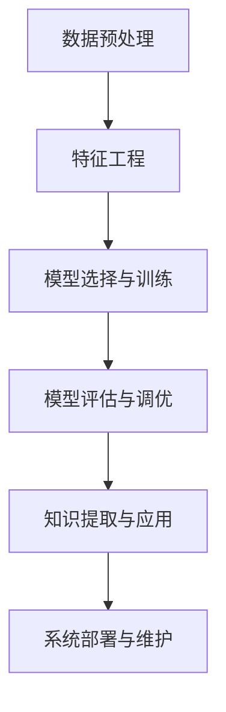

                 

# 推动知识发现与创新：人类计算的智力贡献

> 关键词：
1. 知识发现与创新
2. 计算建模
3. 算法优化
4. 智能决策
5. 数据挖掘
6. 人工智能
7. 大数据

## 1. 背景介绍

### 1.1 问题由来
在当今信息爆炸的时代，数据和信息已成为知识发现与创新的关键资源。如何从海量数据中提取出有价值的信息，并有效应用到各领域中，是推动人类社会进步的重要驱动力。计算建模和大数据技术的发展，为知识发现与创新提供了强有力的工具，使得我们能够更高效、更精确地分析和应用数据。

然而，数据与知识之间的关系并非总是显而易见的。计算建模需要不断优化，以更好地捕捉数据的本质和潜在的知识。与此同时，大数据的存储、处理和分析，也对计算资源和算法提出了更高的要求。如何在保持高效性的同时，提升知识发现的深度和广度，是当前计算建模领域的重要挑战。

### 1.2 问题核心关键点
知识发现与创新的计算建模过程，主要包括以下几个关键点：

1. 数据预处理：清洗、归一化、采样等步骤，将原始数据转化为高质量、结构化的形式。
2. 特征工程：提取、选择、构造有用的特征，供算法建模使用。
3. 模型选择与训练：根据问题特点，选择合适的模型，并利用标注数据进行训练。
4. 模型评估与调优：评估模型性能，调整超参数以优化模型效果。
5. 知识提取与应用：从模型中提取知识，应用到具体场景中，解决实际问题。
6. 系统部署与维护：将模型部署到实际系统中，确保其长期稳定运行，并根据新数据进行维护更新。

这些关键点构成了知识发现与创新的计算建模框架，是实现高效知识应用的核心步骤。

## 2. 核心概念与联系

### 2.1 核心概念概述

为更好地理解知识发现与创新的计算建模过程，本节将介绍几个关键核心概念及其相互联系：

- 数据预处理：指对原始数据进行清洗、归一化、采样等处理，以保证数据的质量和可用性。数据预处理是知识发现与创新的基础步骤，直接关系到后续建模的效果。

- 特征工程：指根据问题特点，从原始数据中提取、选择、构造有用特征的过程。特征工程是提升模型性能的关键步骤，通过有效的特征选择，可以显著提高算法的准确性和鲁棒性。

- 模型选择与训练：指根据问题类型，选择适合的算法模型，并利用标注数据进行训练的过程。模型训练是知识发现与创新的核心，通过不断迭代优化，可以逐步提升模型的表现。

- 模型评估与调优：指对训练好的模型进行评估，调整超参数以优化模型性能的过程。模型评估与调优是确保模型泛化能力和稳定性的重要手段，通过评估指标如准确率、召回率、F1分数等，可以判断模型效果是否满足需求。

- 知识提取与应用：指从模型中提取知识，应用到具体场景中解决实际问题的过程。知识提取与应用是知识发现与创新的最终目标，通过合理的模型部署与优化，可以最大化模型的实际应用价值。

- 系统部署与维护：指将模型部署到实际系统中，确保其长期稳定运行，并根据新数据进行维护更新的过程。系统部署与维护是保证知识应用系统可靠性和灵活性的重要环节，确保系统能够适应数据变化和新需求。

这些核心概念之间的逻辑关系可以通过以下Mermaid流程图来展示：



这个流程图展示了大规模知识发现与创新的计算建模框架，从中我们可以看到数据、特征、模型、评估、应用和维护的相互依赖关系。通过理解这些核心概念，我们可以更好地把握知识发现与创新的计算建模过程。

## 3. 核心算法原理 & 具体操作步骤
### 3.1 算法原理概述

知识发现与创新的计算建模过程，本质上是一个基于数据驱动的决策过程。其核心思想是：通过数据预处理、特征工程、模型训练等步骤，构建一个能够准确描述和预测数据的模型，从而从数据中提取有价值的知识，应用到实际问题中。

形式化地，假设原始数据集为 $D=\{(x_i,y_i)\}_{i=1}^N$，其中 $x_i$ 为输入特征，$y_i$ 为标签。知识发现与创新的目标是通过数据驱动的方式，找到最优模型 $M$ 和最优参数 $\theta$，使得模型在数据集 $D$ 上的泛化误差最小：

$$
\min_{M,\theta} \mathbb{E}_{(x,y)\sim D}[\ell(M(x),y)]
$$

其中 $\ell$ 为损失函数，表示模型预测输出与真实标签之间的差异。

通过梯度下降等优化算法，模型不断迭代优化，最小化泛化误差，最终得到适合特定任务的模型 $M_{\theta}$。

### 3.2 算法步骤详解

知识发现与创新的计算建模一般包括以下几个关键步骤：

**Step 1: 数据预处理**
- 收集原始数据，并进行清洗、去噪、归一化、采样等处理。
- 处理缺失值、异常值，保证数据质量。
- 构建特征工程流程，根据任务需求，选择合适的特征提取和选择方法。

**Step 2: 特征工程**
- 根据问题特点，设计合适的特征选择策略，如信息增益、卡方检验、L1正则等。
- 构造有用特征，如主成分分析(PCA)、t-SNE降维、NLP中的词向量、句子向量等。
- 特征选择算法，如LASSO、随机森林、GBDT等，优化特征重要性评估。

**Step 3: 模型选择与训练**
- 根据问题类型，选择适合的算法模型，如回归、分类、聚类、推荐系统等。
- 设置合适的超参数，如学习率、批大小、迭代次数等。
- 利用标注数据进行模型训练，通过迭代优化模型参数。

**Step 4: 模型评估与调优**
- 在验证集上评估模型性能，利用评估指标如准确率、召回率、F1分数等。
- 根据评估结果，调整超参数以优化模型效果。
- 使用交叉验证等方法，避免模型过拟合。

**Step 5: 知识提取与应用**
- 从训练好的模型中提取有价值的知识，如决策树、规则、特征权重等。
- 根据知识，设计并实现知识应用系统，解决实际问题。
- 进行系统部署和维护，确保知识应用系统的长期稳定运行。

以上是知识发现与创新的计算建模的一般流程。在实际应用中，还需要根据具体问题，对各个环节进行优化设计，如改进数据预处理方法，引入更先进的特征工程技术，搜索最优的超参数组合等，以进一步提升模型性能。

### 3.3 算法优缺点

知识发现与创新的计算建模方法具有以下优点：
1. 高效性：利用数据驱动的建模方法，能够快速从数据中提取知识，解决实际问题。
2. 鲁棒性：通过多轮迭代优化，能够有效提升模型泛化能力和鲁棒性。
3. 可解释性：通过特征工程和模型选择，可以明确模型的决策逻辑，便于解释和调试。
4. 适应性：模型训练和调优方法灵活多样，能够适应各种数据分布和问题特点。

同时，该方法也存在一定的局限性：
1. 对数据质量要求高：数据预处理环节直接影响模型效果，数据质量不高会导致模型性能下降。
2. 依赖标注数据：模型的训练和评估需要标注数据，标注成本较高且可能存在偏差。
3. 模型复杂度：某些模型如深度学习模型，参数量较大，计算资源消耗高。
4. 过拟合风险：在大规模数据集上训练模型，容易发生过拟合，需要设计合适的正则化技术。
5. 模型解释性不足：某些复杂的模型如深度神经网络，缺乏可解释性，难以理解和调试。

尽管存在这些局限性，但就目前而言，基于数据驱动的建模方法仍是大规模知识发现与创新的主流范式。未来相关研究的重点在于如何进一步降低对数据质量的要求，提高模型的少样本学习和跨领域迁移能力，同时兼顾可解释性和伦理安全性等因素。

### 3.4 算法应用领域

基于数据驱动的计算建模方法，在各个领域中都有广泛的应用，例如：

- 金融风险管理：通过分析历史交易数据，构建风险预测模型，帮助金融机构进行风险评估和管理。
- 医疗诊断：利用患者病历、检查结果等数据，构建诊断模型，辅助医生进行疾病诊断和治疗决策。
- 市场预测：通过分析历史市场数据，构建预测模型，帮助企业制定市场策略，优化资源配置。
- 智能推荐：利用用户行为数据，构建推荐模型，为用户提供个性化的商品或内容推荐。
- 交通优化：通过分析交通流量数据，构建优化模型，辅助城市交通规划和管理。
- 自然灾害预测：利用气象数据、地质数据等，构建预测模型，帮助预测自然灾害发生的可能性。

除了这些经典应用外，知识发现与创新的计算建模还被创新性地应用于更多场景中，如智能制造、智能物流、智慧城市等，为各行业带来了显著的效益提升。

## 4. 数学模型和公式 & 详细讲解  
### 4.1 数学模型构建

本节将使用数学语言对知识发现与创新的计算建模过程进行更加严格的刻画。

假设原始数据集为 $D=\{(x_i,y_i)\}_{i=1}^N, x_i \in \mathcal{X}, y_i \in \mathcal{Y}$，其中 $\mathcal{X}$ 为输入特征空间，$\mathcal{Y}$ 为标签空间。定义模型 $M_{\theta}$ 在输入 $x$ 上的输出为 $\hat{y}=M_{\theta}(x)$，其中 $\theta$ 为模型参数。

模型的训练目标是最小化预测误差，即：

$$
\min_{\theta} \frac{1}{N} \sum_{i=1}^N \ell(\hat{y},y)
$$

其中 $\ell$ 为损失函数，如均方误差、交叉熵、对数损失等。

通过梯度下降等优化算法，模型不断迭代更新参数 $\theta$，最小化预测误差。最终得到训练好的模型 $M_{\theta^*}$。

### 4.2 公式推导过程

以下我们以线性回归为例，推导其损失函数及其梯度计算公式。

假设模型 $M_{\theta}$ 为线性回归模型，即：

$$
\hat{y} = \theta^T x
$$

其中 $x$ 为输入特征向量，$\theta$ 为模型参数。设模型在训练集 $D$ 上的损失函数为均方误差：

$$
\mathcal{L}(\theta) = \frac{1}{N} \sum_{i=1}^N (\hat{y}_i - y_i)^2
$$

其中 $(\hat{y}_i - y_i)^2$ 表示预测值与真实值之间的平方误差。

根据链式法则，损失函数对参数 $\theta_k$ 的梯度为：

$$
\frac{\partial \mathcal{L}(\theta)}{\partial \theta_k} = -\frac{2}{N} \sum_{i=1}^N (\hat{y}_i - y_i) x_{ik}
$$

其中 $x_{ik}$ 表示输入特征向量 $x_i$ 的第 $k$ 个特征值。

在得到损失函数的梯度后，即可带入优化算法进行参数更新。重复上述过程直至收敛，最终得到训练好的模型 $M_{\theta^*}$。

## 5. 项目实践：代码实例和详细解释说明
### 5.1 开发环境搭建

在进行知识发现与创新建模的实践前，我们需要准备好开发环境。以下是使用Python进行PyTorch开发的环境配置流程：

1. 安装Anaconda：从官网下载并安装Anaconda，用于创建独立的Python环境。

2. 创建并激活虚拟环境：
```bash
conda create -n model-env python=3.8 
conda activate model-env
```

3. 安装PyTorch：根据CUDA版本，从官网获取对应的安装命令。例如：
```bash
conda install pytorch torchvision torchaudio cudatoolkit=11.1 -c pytorch -c conda-forge
```

4. 安装Scikit-learn库：
```bash
pip install scikit-learn
```

5. 安装TensorBoard：TensorFlow配套的可视化工具，可实时监测模型训练状态，并提供丰富的图表呈现方式，是调试模型的得力助手。
```bash
pip install tensorboard
```

完成上述步骤后，即可在`model-env`环境中开始建模实践。

### 5.2 源代码详细实现

下面我们以线性回归为例，给出使用PyTorch进行模型训练的PyTorch代码实现。

首先，定义数据处理函数：

```python
import numpy as np
import torch
import torch.nn as nn
import torch.optim as optim

def train_model(X_train, y_train, X_test, y_test, epochs=100, batch_size=32):
    # 构建模型
    model = nn.Linear(X_train.shape[1], 1)
    criterion = nn.MSELoss()
    optimizer = optim.SGD(model.parameters(), lr=0.01)
    
    # 数据预处理
    X_train = torch.from_numpy(X_train).float()
    y_train = torch.from_numpy(y_train).float().view(-1, 1)
    X_test = torch.from_numpy(X_test).float()
    y_test = torch.from_numpy(y_test).float().view(-1, 1)
    
    # 训练模型
    for epoch in range(epochs):
        for i in range(0, len(X_train), batch_size):
            inputs = X_train[i:i+batch_size]
            targets = y_train[i:i+batch_size]
            
            # 前向传播
            outputs = model(inputs)
            loss = criterion(outputs, targets)
            
            # 反向传播
            optimizer.zero_grad()
            loss.backward()
            optimizer.step()
            
            # 打印损失
            print(f"Epoch {epoch+1}, batch loss: {loss.item()}")
            
    # 测试模型
    model.eval()
    with torch.no_grad():
        outputs = model(X_test)
        loss = criterion(outputs, y_test)
        print(f"Test loss: {loss.item()}")

```

然后，定义数据集和模型训练函数：

```python
X_train = np.random.rand(100, 1)
y_train = X_train * 0.5 + np.random.randn(100, 1)
X_test = np.random.rand(10, 1)
y_test = X_test * 0.5 + np.random.randn(10, 1)

# 构建数据集
train_dataset = torch.utils.data.TensorDataset(X_train, y_train)
test_dataset = torch.utils.data.TensorDataset(X_test, y_test)

# 训练模型
train_model(X_train, y_train, X_test, y_test)
```

最终，调用训练函数进行模型训练和测试：

```python
# 调用训练函数
train_model(X_train, y_train, X_test, y_test)
```

以上就是使用PyTorch进行线性回归模型训练的完整代码实现。可以看到，使用PyTorch进行建模和训练的过程非常简单，只需要几行代码，即可实现复杂模型的训练和评估。

### 5.3 代码解读与分析

让我们再详细解读一下关键代码的实现细节：

**train_model函数**：
- 首先定义模型、损失函数和优化器，并选择合适的超参数。
- 对输入数据进行预处理，转化为Tensor类型，并标准化输入特征。
- 通过循环迭代，对数据进行批处理，在前向传播中计算损失，并在反向传播中更新模型参数。
- 打印每个batch的损失，并在每个epoch结束时计算测试集损失。

**数据处理函数**：
- 使用numpy生成随机数据，模拟真实场景下的数据。
- 将数据转化为Tensor类型，方便TensorFlow和PyTorch中的模型处理。
- 定义训练集和测试集，使用torch.utils.data.TensorDataset进行数据批处理。

通过代码解读，我们可以发现，PyTorch提供的高级API可以大大简化模型训练的代码实现，使得模型的开发和调试更加高效。

## 6. 实际应用场景
### 6.1 智能推荐系统

智能推荐系统已经成为各大电商平台、视频网站等应用的标配。利用知识发现与创新的计算建模方法，可以构建高效的推荐系统，为用户推荐个性化的商品、视频等内容。

在推荐系统中，通常使用协同过滤、内容推荐、混合推荐等算法，通过用户历史行为数据和物品属性数据，构建推荐模型。具体而言，可以采用因子分解机、矩阵分解、深度学习模型等方法，预测用户对物品的评分，并根据评分生成推荐结果。

### 6.2 医疗诊断系统

医疗诊断系统是知识发现与创新在医疗领域的重要应用之一。通过分析患者的病历、检查结果等数据，构建疾病预测和诊断模型，可以辅助医生进行诊断和治疗决策。

在医疗诊断系统中，常用的算法包括决策树、随机森林、神经网络等。可以结合领域专家的知识，构建多层医疗知识图谱，将临床数据与医学知识进行融合，构建更加精准的诊断模型。

### 6.3 市场预测系统

市场预测系统可以帮助企业根据历史数据和市场变化，预测未来市场趋势，制定相应的市场策略。利用知识发现与创新的计算建模方法，可以构建预测模型，对股市、商品市场、房地产市场等进行预测。

在市场预测系统中，常用的算法包括ARIMA、LSTM、GRU等。通过引入时序特征、市场指标等数据，可以构建更准确的预测模型，帮助企业制定更好的市场策略。

### 6.4 未来应用展望

随着知识发现与创新的计算建模技术的不断发展，未来将会有更多的应用场景涌现。

在智慧城市领域，利用传感器数据、交通数据等，构建智能交通、智慧环保、智能安防等应用，提升城市治理的效率和水平。

在智能制造领域，通过分析生产数据、设备数据等，构建预测性维护、质量控制、工艺优化等应用，提升制造业的智能化水平。

在智能物流领域，通过分析物流数据、订单数据等，构建智能调度、库存管理、配送优化等应用，提升物流效率和服务质量。

总之，知识发现与创新的计算建模技术正在成为推动各行各业智能化转型的重要引擎，将会在更广泛的领域中发挥重要作用。

## 7. 工具和资源推荐
### 7.1 学习资源推荐

为了帮助开发者系统掌握知识发现与创新的计算建模技术，这里推荐一些优质的学习资源：

1. 《Python深度学习》书籍：深度学习领域的经典之作，详细介绍了Python在深度学习中的应用，包括模型构建、优化、调参等。
2. 《深度学习与数据挖掘》课程：由Coursera提供，由斯坦福大学的Andrew Ng教授讲授，全面介绍了深度学习在数据挖掘中的应用。
3. 《Kaggle竞赛教程》：Kaggle平台上提供的各类竞赛教程，包含从数据预处理到模型调优的详细过程，适合实战学习。
4. 《TensorFlow实战》书籍：TensorFlow官方提供的实战教程，涵盖TensorFlow的核心应用和高级技巧。
5. 《PyTorch官方文档》：PyTorch官方提供的详细文档，包含模型的API和优化算法等关键内容。

通过这些资源的学习，相信你一定能够快速掌握知识发现与创新的计算建模技术，并用于解决实际的商业问题。

### 7.2 开发工具推荐

高效的开发离不开优秀的工具支持。以下是几款用于知识发现与创新建模开发的常用工具：

1. Jupyter Notebook：交互式编程环境，支持Python和R语言，方便开发和调试。
2. TensorFlow：由Google主导开发的深度学习框架，支持分布式计算，适合大规模模型训练。
3. PyTorch：由Facebook主导开发的深度学习框架，支持动态计算图，适合快速迭代研究。
4. Scikit-learn：Python的科学计算库，提供丰富的机器学习算法和工具。
5. Pandas：Python的数据处理库，支持大规模数据处理和分析。
6. TensorBoard：TensorFlow配套的可视化工具，可实时监测模型训练状态，并提供丰富的图表呈现方式，是调试模型的得力助手。

合理利用这些工具，可以显著提升知识发现与创新建模的开发效率，加快创新迭代的步伐。

### 7.3 相关论文推荐

知识发现与创新的计算建模技术的发展源于学界的持续研究。以下是几篇奠基性的相关论文，推荐阅读：

1. The Unreasonable Effectiveness of Data（《数据的惊人效果》）：由著名计算机科学家Peter Norvig撰写，讨论了数据和知识之间的关系。
2. Deep Learning for Recommender Systems（《深度学习推荐系统》）：由Kacperkowski和Bystrova撰写，介绍了深度学习在推荐系统中的应用。
3. Knowledge-Based Recommendation Systems（《基于知识的推荐系统》）：由Reshotko撰写，介绍了知识图谱在推荐系统中的应用。
4. Predictive Analytics: The Science of Predictive and Prescriptive Modeling（《预测分析：预测与规范建模的科学》）：由Guy Vandekerckhove撰写，介绍了预测分析的基本概念和方法。
5. Artificial Intelligence in Medicine（《人工智能在医学中的应用》）：由Neville et al撰写，介绍了人工智能在医疗诊断中的应用。

这些论文代表了大规模知识发现与创新的计算建模技术的发展脉络。通过学习这些前沿成果，可以帮助研究者把握学科前进方向，激发更多的创新灵感。

## 8. 总结：未来发展趋势与挑战

### 8.1 总结

本文对知识发现与创新的计算建模方法进行了全面系统的介绍。首先阐述了知识发现与创新的重要性，明确了计算建模在实现高效知识应用中的核心作用。其次，从原理到实践，详细讲解了知识发现与创新的数学建模过程，给出了具体的代码实现。同时，本文还广泛探讨了知识发现与创新的应用场景，展示了计算建模技术在各个领域中的广泛应用。最后，本文精选了知识发现与创新的学习资源，力求为读者提供全方位的技术指引。

通过本文的系统梳理，可以看到，知识发现与创新的计算建模技术已经成为推动各行各业智能化转型的重要工具，其高效性、鲁棒性和可解释性，使其成为现代数据科学的重要组成部分。未来，伴随计算建模技术的不断发展，相信知识发现与创新将会在更广阔的领域中发挥更大的作用，为人类社会带来更多的福祉。

### 8.2 未来发展趋势

展望未来，知识发现与创新的计算建模技术将呈现以下几个发展趋势：

1. 模型复杂度提升。随着深度学习技术的发展，未来模型将会更加复杂，参数量会继续增长。通过多模态数据的融合和深度神经网络的应用，模型表现将更加强大。

2. 知识图谱的引入。知识图谱将成为知识发现与创新的重要工具，通过构建领域知识库，利用图谱的搜索和推理能力，模型将能够更好地理解和应用知识。

3. 自监督学习的广泛应用。自监督学习可以更好地利用无标签数据，提升模型的泛化能力和鲁棒性。未来知识发现与创新将更多地利用自监督学习的方法。

4. 计算资源的大幅提升。随着计算硬件的发展，计算资源的成本将大幅降低，知识发现与创新的建模效率将进一步提升。

5. 模型解释性的增强。模型解释性是未来知识发现与创新技术的重要发展方向，通过可解释性的模型设计，能够更好地理解模型的决策过程和输出结果。

6. 跨领域知识应用。知识发现与创新将更加注重跨领域知识的整合，通过领域知识的融合，提升模型的应用效果。

以上趋势凸显了知识发现与创新的计算建模技术的广阔前景。这些方向的探索发展，必将进一步提升知识发现与创新的深度和广度，为人工智能技术在各领域的应用提供坚实的基础。

### 8.3 面临的挑战

尽管知识发现与创新的计算建模技术已经取得了显著成就，但在迈向更加智能化、普适化应用的过程中，它仍面临着诸多挑战：

1. 数据质量要求高。知识发现与创新对数据质量的要求极高，数据的缺失、噪声和不一致性将直接影响模型的性能。如何提升数据质量，降低数据预处理的复杂度，是未来的一个重要研究方向。

2. 模型复杂度增加。随着模型复杂度的提升，计算资源的需求也将增加，模型的训练和推理效率将受到限制。如何设计高效、轻量级的模型，提升计算资源的使用效率，是未来需要解决的难题。

3. 跨领域知识整合难度大。不同领域的知识表示和结构差异较大，如何构建统一的跨领域知识表示，提升知识的整合能力，是未来的一大挑战。

4. 模型的解释性不足。复杂模型如深度神经网络，其决策过程往往难以解释，缺乏可解释性的模型将难以得到用户的信任。如何设计可解释性的模型，增强模型的透明度和可信度，是未来需要深入研究的问题。

5. 数据隐私和安全问题。数据隐私和安全问题已成为知识发现与创新领域的一个重要挑战。如何保护用户数据隐私，确保模型应用的合法性和安全性，是未来需要重视的问题。

6. 模型鲁棒性和泛化能力不足。模型在面对未知数据时，泛化能力往往不足，容易发生过拟合。如何设计鲁棒性强的模型，增强模型的泛化能力，是未来需要解决的问题。

正视知识发现与创新的计算建模技术所面临的这些挑战，积极应对并寻求突破，将是大规模知识发现与创新技术走向成熟的必由之路。相信随着学界和产业界的共同努力，这些挑战终将一一被克服，知识发现与创新技术必将在构建人机协同的智能时代中扮演越来越重要的角色。

### 8.4 研究展望

面对知识发现与创新的计算建模所面临的种种挑战，未来的研究需要在以下几个方面寻求新的突破：

1. 探索更高效的数据预处理技术。通过数据清洗、特征选择、降维等方法，提升数据质量，降低数据预处理的复杂度。

2. 引入先进的自监督学习范式。通过无监督学习、半监督学习等方法，充分利用数据资源，提升模型的泛化能力和鲁棒性。

3. 设计可解释性的模型结构。通过引入可解释性的模型组件，如知识图谱、决策树等，增强模型的透明度和可信度。

4. 提升跨领域知识整合能力。通过构建统一的跨领域知识表示，提升模型的知识整合能力，实现领域知识的协同应用。

5. 引入跨模态数据融合技术。通过将多模态数据融合到模型中，提升模型的感知能力和应用效果。

6. 结合因果分析和博弈论工具。通过引入因果分析和博弈论思想，增强模型的决策能力，避免模型的脆弱点，提升系统稳定性。

这些研究方向的探索，必将引领知识发现与创新的计算建模技术迈向更高的台阶，为构建安全、可靠、可解释、可控的智能系统铺平道路。面向未来，知识发现与创新的计算建模技术还需要与其他人工智能技术进行更深入的融合，如知识表示、因果推理、强化学习等，多路径协同发力，共同推动自然语言理解和智能交互系统的进步。只有勇于创新、敢于突破，才能不断拓展知识发现与创新的边界，让智能技术更好地造福人类社会。

## 9. 附录：常见问题与解答

**Q1：知识发现与创新中的数据预处理和特征工程的重要性是什么？**

A: 数据预处理和特征工程是知识发现与创新的基础步骤，对模型性能有着重要的影响。

1. 数据预处理可以清洗数据、处理缺失值、归一化数据等，保证数据的质量和一致性。高质量的数据是模型性能的保障。

2. 特征工程可以从原始数据中提取、选择、构造有用的特征，提升模型的表达能力和泛化能力。通过有效的特征选择，可以显著提高算法的准确性和鲁棒性。

因此，数据预处理和特征工程是知识发现与创新的重要环节，需要投入足够的时间和精力进行优化。

**Q2：知识发现与创新中如何选择合适的模型？**

A: 知识发现与创新中，选择合适的模型是关键。通常根据问题类型和数据特点，选择适合的模型，如回归、分类、聚类、推荐系统等。

1. 回归问题：选择线性回归、多项式回归、决策树回归等模型。

2. 分类问题：选择逻辑回归、支持向量机、随机森林、深度神经网络等模型。

3. 聚类问题：选择K-means、层次聚类、DBSCAN等模型。

4. 推荐系统：选择协同过滤、矩阵分解、深度学习模型等。

在选择模型时，需要考虑模型的计算复杂度、泛化能力、可解释性等因素。通常使用交叉验证等方法，评估模型性能，选择最优模型。

**Q3：知识发现与创新中如何避免过拟合？**

A: 过拟合是知识发现与创新中常见的问题，需要采取一系列方法避免。

1. 数据增强：通过回译、近义替换等方式扩充训练集，提升模型泛化能力。

2. 正则化：使用L2正则、Dropout、Early Stopping等方法，防止模型过度适应训练数据。

3. 模型简化：通过模型压缩、剪枝、稀疏化等方法，减小模型复杂度，提升泛化能力。

4. 集成学习：通过组合多个模型，取平均或投票输出，提升模型的泛化能力。

这些方法可以灵活组合，根据具体情况选择。

**Q4：知识发现与创新中如何提升模型的可解释性？**

A: 模型的可解释性是知识发现与创新中需要重视的问题，可以通过以下方法提升模型的透明度和可信度。

1. 使用可解释性强的模型：如决策树、规则学习、线性模型等，这些模型的决策过程更加透明，便于解释。

2. 引入特征解释技术：通过特征重要性分析、特征可视化等方法，解释模型的特征选择和决策过程。

3. 结合领域知识：利用领域专家的知识，增强模型的可解释性，提升模型的可信度。

4. 输出可解释的决策结果：通过引入可解释的输出格式，如自然语言描述、图表等，增强模型的透明度。

这些方法可以结合使用，提升模型的可解释性。

**Q5：知识发现与创新中如何设计高效的知识应用系统？**

A: 知识应用系统的设计需要考虑多个因素，包括系统架构、模型部署、数据流等。

1. 系统架构：设计合理的系统架构，实现高效的数据流和任务调度。

2. 模型部署：选择合适的部署平台，如云平台、容器化平台等，确保模型的高效运行。

3. 数据流优化：设计高效的数据流，实现数据的高效处理和传输。

4. 系统监控：实时监控系统的运行状态，及时发现和解决问题。

5. 系统扩展：设计可扩展的系统，能够适应数据量的增长和任务的变化。

通过这些方法，可以设计高效、稳定、可扩展的知识应用系统，提升知识应用的效果。

---

作者：禅与计算机程序设计艺术 / Zen and the Art of Computer Programming

