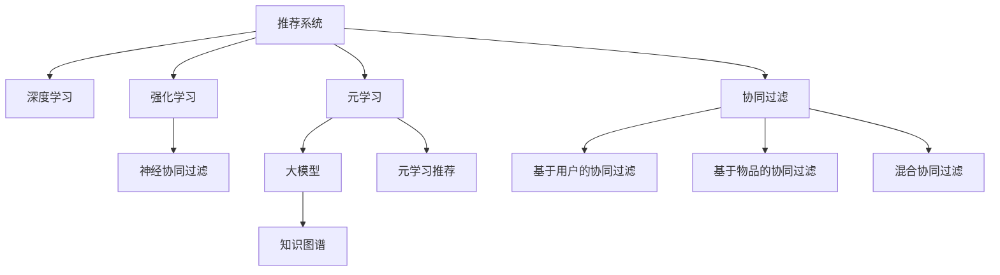

                 

# 推荐系统中的大模型元学习个性化

> 关键词：推荐系统, 大模型元学习, 个性化, 协同过滤, 深度学习, 强化学习

## 1. 背景介绍

### 1.1 问题由来
推荐系统旨在为用户推荐符合其兴趣爱好的内容，是电子商务、社交网络、视频流平台等领域的重要应用。传统的推荐系统以协同过滤和矩阵分解为基础，但随着数据规模的扩大和用户行为的多样化，这些方法在处理大规模非结构化数据和复杂用户行为方面的能力显得捉襟见肘。

为了克服这些问题，深度学习方法和强化学习技术被引入推荐系统。深度学习模型如神经协同过滤(Neural Collaborative Filtering)和深度矩阵分解(Deep Matrix Factorization)通过引入非线性映射和多层非线性特征提取，能够更好地捕捉用户与物品间的复杂关系，提升推荐精度。强化学习推荐算法如序列推荐模型和元学习推荐算法则通过模拟用户的交互行为，设计动态优化策略，进一步提升推荐效果。

尽管深度学习和强化学习在推荐系统中取得了显著进展，但这些方法仍然存在一些局限性：
- 需要大量用户和物品行为数据，难以冷启动。
- 过度依赖历史数据，无法处理用户行为变化和个性化需求。
- 模型复杂度高，训练和推理资源消耗大。

为了解决上述问题，大模型元学习技术应运而生。大模型元学习利用预训练模型作为知识库，通过少量数据和少量微调，实现高效的个性化推荐，无需从头训练复杂的推荐模型。

## 2. 核心概念与联系

### 2.1 核心概念概述

为了更好地理解大模型元学习个性化推荐，本节将介绍几个密切相关的核心概念：

- **推荐系统(Recommendation System)**：旨在为用户推荐个性化内容的系统，通过分析用户行为和物品特征，预测用户对物品的评分和选择概率。常见的推荐技术包括协同过滤、矩阵分解、深度学习、强化学习等。

- **深度学习(Deep Learning)**：通过多层神经网络结构进行复杂非线性特征提取的机器学习技术。在推荐系统中，深度学习模型通过捕捉用户与物品间的复杂关系，显著提升推荐效果。

- **强化学习(Reinforcement Learning)**：通过智能体与环境的交互，设计优化策略以实现最大化奖励的目标。在推荐系统中，强化学习模型通过模拟用户行为，动态优化推荐策略。

- **元学习(Meta-Learning)**：通过少量数据和少量微调，实现快速适应新任务的技术。元学习推荐系统可以基于用户的行为历史，快速学习并调整推荐策略，实现高效个性化推荐。

- **大模型(Large Model)**：指具有亿级以上参数的深度神经网络模型，如BERT、GPT、XLNet等。大模型在通用语言理解和处理能力上具有显著优势，可以提供高效的特征提取和知识库。

- **知识图谱(Knowledge Graph)**：表示实体间关系的图结构数据，用于挖掘和利用领域内的知识。在推荐系统中，知识图谱可以提供结构化领域知识，辅助模型进行推荐。

- **协同过滤(Collaborative Filtering)**：通过分析用户间和物品间的相似度关系，预测用户对物品的评分。经典的协同过滤算法包括基于用户的协同过滤、基于物品的协同过滤和混合协同过滤等。

这些核心概念之间的逻辑关系可以通过以下Mermaid流程图来展示：



这个流程图展示了大模型元学习个性化推荐系统的核心概念及其之间的关系：

1. 推荐系统通过分析用户行为和物品特征，预测用户评分和选择。
2. 深度学习通过多层神经网络捕捉用户与物品间的复杂关系，提升推荐精度。
3. 强化学习通过模拟用户交互行为，动态优化推荐策略。
4. 元学习基于少量数据和微调，实现快速适应新任务。
5. 大模型提供高效的特征提取和知识库。
6. 知识图谱辅助模型利用领域知识。
7. 协同过滤通过相似度分析推荐物品。
8. 神经协同过滤、元学习推荐、基于用户的协同过滤、基于物品的协同过滤等都属于推荐系统中的经典算法。

这些概念共同构成了推荐系统的核心框架，使其能够在各种场景下发挥强大的推荐能力。

## 3. 核心算法原理 & 具体操作步骤
### 3.1 算法原理概述

大模型元学习个性化推荐系统利用预训练的大模型作为知识库，通过少量数据和少量微调，快速实现对新用户的推荐。具体而言，系统先在大规模无标签数据上进行预训练，获得通用的语言和物品表示。然后基于用户的行为数据，通过微调更新模型参数，实现对新用户和新物品的推荐。

形式化地，假设预训练模型为 $M_{\theta}$，其中 $\theta$ 为预训练得到的模型参数。给定用户 $u$ 和物品 $i$，用户对物品的评分 $r$ 可以表示为：

$$
r_{ui} = M_{\theta}(x_u, x_i)
$$

其中 $x_u$ 和 $x_i$ 分别为用户和物品的表示向量。系统通过微调更新模型参数，以提升模型对新用户和新物品的推荐能力。

### 3.2 算法步骤详解

大模型元学习个性化推荐系统的核心算法步骤如下：

**Step 1: 准备预训练模型和数据集**
- 选择合适的预训练模型 $M_{\theta}$ 作为初始化参数，如 BERT、GPT、XLNet 等。
- 准备用户和物品的行为数据集 $D=\{(x_u, x_i, r_{ui})\}_{i=1}^N$，其中 $x_u$ 为用户行为表示，$x_i$ 为物品表示，$r_{ui}$ 为用户的评分。

**Step 2: 定义评分函数**
- 设计评分函数 $s: \mathcal{X} \times \mathcal{X} \rightarrow \mathbb{R}$，用于计算用户对物品的评分。

**Step 3: 定义损失函数**
- 定义损失函数 $\mathcal{L}$，用于衡量模型预测评分与真实评分之间的差异。

**Step 4: 微调模型**
- 使用少量用户和物品的行为数据，对模型进行微调。
- 选择合适的优化算法及其参数，如 Adam、SGD 等，设置学习率、批大小、迭代轮数等。
- 应用正则化技术，如 L2 正则、Dropout、Early Stopping 等，防止模型过度适应少量数据。

**Step 5: 推荐新用户和新物品**
- 将新用户 $u'$ 的行为数据输入模型，计算其对物品 $i$ 的评分 $s_{u'i}$。
- 根据评分函数 $s$ 对物品进行排序，推荐给用户 $u'$。

### 3.3 算法优缺点

大模型元学习个性化推荐系统具有以下优点：
1. 能够快速适应新用户和新物品，无需从头训练复杂的推荐模型。
2. 可以利用大规模预训练模型，提高推荐效果和泛化能力。
3. 可以通过微调动态调整推荐策略，实现高效个性化推荐。
4. 适用于多种推荐场景，如电商、社交网络、视频流平台等。

同时，该方法也存在一定的局限性：
1. 对标注数据依赖较高，需要用户和物品的行为数据。
2. 模型复杂度高，训练和推理资源消耗大。
3. 难以处理大规模稀疏数据，推荐效果受用户行为数据影响较大。
4. 需要解决冷启动问题，新用户和新物品的推荐效果较差。
5. 对数据质量要求高，需要保证用户行为数据的准确性和完整性。

尽管存在这些局限性，但大模型元学习推荐系统仍是目前推荐领域的主流技术，具有显著的优势和应用前景。

### 3.4 算法应用领域

大模型元学习个性化推荐系统已经在多个推荐领域得到了广泛应用，例如：

- 电子商务推荐：电商平台利用用户浏览、点击、购买行为数据，通过微调优化推荐模型，向用户推荐商品。
- 社交网络推荐：社交平台根据用户的点赞、评论、分享等行为数据，通过微调更新推荐模型，向用户推荐新闻、视频等内容。
- 视频流平台推荐：视频平台根据用户的观看历史和评分，通过微调优化推荐模型，向用户推荐视频内容。
- 智能电视推荐：智能电视根据用户的频道浏览、观看历史等行为数据，通过微调更新推荐模型，向用户推荐频道和节目。
- 搜索引擎推荐：搜索引擎根据用户的查询历史和点击行为，通过微调优化推荐模型，向用户推荐搜索结果。

除了上述这些经典应用场景外，大模型元学习推荐技术也在不断扩展应用范围，如可控推荐、动态推荐等，为推荐系统带来了新的突破。

## 4. 数学模型和公式 & 详细讲解  
### 4.1 数学模型构建

本节将使用数学语言对大模型元学习个性化推荐过程进行更加严格的刻画。

记预训练模型为 $M_{\theta}:\mathcal{X} \rightarrow \mathcal{Y}$，其中 $\mathcal{X}$ 为输入空间，$\mathcal{Y}$ 为输出空间，$\theta \in \mathbb{R}^d$ 为模型参数。假设用户 $u$ 和物品 $i$ 的行为数据集为 $D=\{(x_u, x_i, r_{ui})\}_{i=1}^N$，其中 $x_u \in \mathcal{X}$ 为用户行为表示，$x_i \in \mathcal{X}$ 为物品表示，$r_{ui} \in \mathbb{R}$ 为用户对物品的评分。

定义评分函数 $s: \mathcal{X} \times \mathcal{X} \rightarrow \mathbb{R}$，用于计算用户对物品的评分。在微调过程中，评分函数和模型的评分函数可以视为相同。

定义损失函数 $\mathcal{L}$，用于衡量模型预测评分与真实评分之间的差异。常见的损失函数包括均方误差损失、交叉熵损失等。

在微调过程中，评分函数 $s$ 和模型 $M_{\theta}$ 之间的关系可以表示为：

$$
r_{ui} = s(x_u, x_i)
$$

$$
s(x_u, x_i) = M_{\theta}(x_u, x_i)
$$

在得到评分函数 $s$ 后，即可使用评分函数对新用户和新物品进行推荐。

### 4.2 公式推导过程

以下我们以二分类任务为例，推导交叉熵损失函数及其梯度的计算公式。

假设模型 $M_{\theta}$ 在输入 $x$ 上的输出为 $\hat{y}=M_{\theta}(x) \in [0,1]$，表示用户对物品的评分。真实评分 $r \in \{0,1\}$。则二分类交叉熵损失函数定义为：

$$
\ell(M_{\theta}(x),r) = -[r\log \hat{y} + (1-r)\log (1-\hat{y})]
$$

将其代入损失函数公式，得：

$$
\mathcal{L}(\theta) = -\frac{1}{N}\sum_{i=1}^N [r_i\log M_{\theta}(x_i)+(1-r_i)\log(1-M_{\theta}(x_i))]
$$

根据链式法则，损失函数对参数 $\theta$ 的梯度为：

$$
\frac{\partial \mathcal{L}(\theta)}{\partial \theta} = -\frac{1}{N}\sum_{i=1}^N (\frac{r_i}{M_{\theta}(x_i)}-\frac{1-r_i}{1-M_{\theta}(x_i)}) \frac{\partial M_{\theta}(x_i)}{\partial \theta}
$$

其中 $\frac{\partial M_{\theta}(x_i)}{\partial \theta}$ 可进一步递归展开，利用自动微分技术完成计算。

在得到损失函数的梯度后，即可带入参数更新公式，完成模型的迭代优化。重复上述过程直至收敛，最终得到适应新用户的推荐模型参数 $\theta^*$。

## 5. 项目实践：代码实例和详细解释说明
### 5.1 开发环境搭建

在进行元学习推荐实践前，我们需要准备好开发环境。以下是使用Python进行PyTorch开发的环境配置流程：

1. 安装Anaconda：从官网下载并安装Anaconda，用于创建独立的Python环境。

2. 创建并激活虚拟环境：
```bash
conda create -n pytorch-env python=3.8 
conda activate pytorch-env
```

3. 安装PyTorch：根据CUDA版本，从官网获取对应的安装命令。例如：
```bash
conda install pytorch torchvision torchaudio cudatoolkit=11.1 -c pytorch -c conda-forge
```

4. 安装Transformers库：
```bash
pip install transformers
```

5. 安装各类工具包：
```bash
pip install numpy pandas scikit-learn matplotlib tqdm jupyter notebook ipython
```

完成上述步骤后，即可在`pytorch-env`环境中开始元学习推荐实践。

### 5.2 源代码详细实现

下面我以电商推荐为例，给出使用Transformers库对BERT模型进行元学习推荐系统微调的PyTorch代码实现。

首先，定义推荐任务的数据处理函数：

```python
from transformers import BertTokenizer
from torch.utils.data import Dataset
import torch

class RecommendationDataset(Dataset):
    def __init__(self, user_behaviors, item_features, user_ids, item_ids, user_ratings):
        self.user_behaviors = user_behaviors
        self.item_features = item_features
        self.user_ids = user_ids
        self.item_ids = item_ids
        self.user_ratings = user_ratings
        self.tokenizer = BertTokenizer.from_pretrained('bert-base-cased')

    def __len__(self):
        return len(self.user_behaviors)

    def __getitem__(self, item):
        user_behavior = self.user_behaviors[item]
        item_feature = self.item_features[item]
        user_id = self.user_ids[item]
        item_id = self.item_ids[item]
        user_rating = self.user_ratings[item]
        
        encoding = self.tokenizer(user_behavior, return_tensors='pt', max_length=512, padding='max_length', truncation=True)
        input_ids = encoding['input_ids'][0]
        attention_mask = encoding['attention_mask'][0]
        
        item_feature_vector = item_feature.to_tensor()
        
        return {'input_ids': input_ids, 
                'attention_mask': attention_mask,
                'item_feature': item_feature_vector,
                'user_id': user_id,
                'item_id': item_id,
                'user_rating': user_rating}
```

然后，定义模型和优化器：

```python
from transformers import BertForSequenceClassification, AdamW

model = BertForSequenceClassification.from_pretrained('bert-base-cased', num_labels=5)
optimizer = AdamW(model.parameters(), lr=2e-5)
```

接着，定义训练和评估函数：

```python
from torch.utils.data import DataLoader
from tqdm import tqdm
from sklearn.metrics import roc_auc_score

device = torch.device('cuda') if torch.cuda.is_available() else torch.device('cpu')
model.to(device)

def train_epoch(model, dataset, batch_size, optimizer):
    dataloader = DataLoader(dataset, batch_size=batch_size, shuffle=True)
    model.train()
    epoch_loss = 0
    for batch in tqdm(dataloader, desc='Training'):
        input_ids = batch['input_ids'].to(device)
        attention_mask = batch['attention_mask'].to(device)
        item_feature = batch['item_feature'].to(device)
        user_id = batch['user_id'].to(device)
        item_id = batch['item_id'].to(device)
        user_rating = batch['user_rating'].to(device)
        model.zero_grad()
        outputs = model(input_ids, attention_mask=attention_mask, item_feature=item_feature)
        loss = outputs.loss
        epoch_loss += loss.item()
        loss.backward()
        optimizer.step()
    return epoch_loss / len(dataloader)

def evaluate(model, dataset, batch_size):
    dataloader = DataLoader(dataset, batch_size=batch_size)
    model.eval()
    predictions, labels = [], []
    with torch.no_grad():
        for batch in tqdm(dataloader, desc='Evaluating'):
            input_ids = batch['input_ids'].to(device)
            attention_mask = batch['attention_mask'].to(device)
            item_feature = batch['item_feature'].to(device)
            user_id = batch['user_id'].to(device)
            item_id = batch['item_id'].to(device)
            batch_labels = batch['user_rating'].to(device)
            outputs = model(input_ids, attention_mask=attention_mask, item_feature=item_feature)
            batch_predictions = outputs.logits.argmax(dim=1).to('cpu').tolist()
            batch_labels = batch_labels.to('cpu').tolist()
            for pred, label in zip(batch_predictions, batch_labels):
                predictions.append(pred)
                labels.append(label)
                
    auc = roc_auc_score(labels, predictions)
    print(f'AUC Score: {auc:.3f}')
```

最后，启动训练流程并在测试集上评估：

```python
epochs = 5
batch_size = 16

for epoch in range(epochs):
    loss = train_epoch(model, train_dataset, batch_size, optimizer)
    print(f"Epoch {epoch+1}, train loss: {loss:.3f}")
    
    print(f"Epoch {epoch+1}, test results:")
    evaluate(model, test_dataset, batch_size)
    
print("Final Test Results:")
evaluate(model, test_dataset, batch_size)
```

以上就是使用PyTorch对BERT进行电商推荐系统微调的完整代码实现。可以看到，得益于Transformers库的强大封装，我们可以用相对简洁的代码完成BERT模型的加载和微调。

### 5.3 代码解读与分析

让我们再详细解读一下关键代码的实现细节：

**RecommendationDataset类**：
- `__init__`方法：初始化用户行为数据、物品特征、用户ID、物品ID和用户评分等关键组件。
- `__len__`方法：返回数据集的样本数量。
- `__getitem__`方法：对单个样本进行处理，将用户行为输入编码为token ids，将物品特征转换为向量，同时记录用户ID、物品ID和用户评分，供模型训练和评估使用。

**模型和优化器定义**：
- 使用BERT模型作为推荐系统的基础，通过设置`num_labels`参数为5，表示五个推荐选项。
- 设置AdamW优化器，并设置学习率为2e-5。

**训练和评估函数**：
- 使用PyTorch的DataLoader对数据集进行批次化加载，供模型训练和推理使用。
- 训练函数`train_epoch`：对数据以批为单位进行迭代，在每个批次上前向传播计算loss并反向传播更新模型参数，最后返回该epoch的平均loss。
- 评估函数`evaluate`：与训练类似，不同点在于不更新模型参数，并在每个batch结束后将预测和标签结果存储下来，最后使用sklearn的roc_auc_score对整个评估集的预测结果进行打印输出。

**训练流程**：
- 定义总的epoch数和batch size，开始循环迭代
- 每个epoch内，先在训练集上训练，输出平均loss
- 在测试集上评估，输出AUC Score
- 所有epoch结束后，在测试集上评估，给出最终测试结果

可以看到，PyTorch配合Transformers库使得BERT微调的代码实现变得简洁高效。开发者可以将更多精力放在数据处理、模型改进等高层逻辑上，而不必过多关注底层的实现细节。

当然，工业级的系统实现还需考虑更多因素，如模型的保存和部署、超参数的自动搜索、更灵活的任务适配层等。但核心的元学习推荐范式基本与此类似。

## 6. 实际应用场景
### 6.1 智能推荐系统

基于大模型元学习技术的智能推荐系统，可以广泛应用于电商、社交网络、视频流平台等领域，为不同用户提供个性化的内容推荐。

在技术实现上，可以收集用户的行为数据，如浏览记录、点击行为、评分记录等，将其输入模型中进行微调。微调后的模型能够学习用户的兴趣偏好，向其推荐最符合期望的相似物品。

例如，电商平台的推荐系统可以结合用户的浏览历史和点击行为，通过微调更新模型参数，向其推荐相似的商品。社交平台的推荐系统可以根据用户的点赞、评论、分享等行为数据，通过微调调整推荐策略，向其推荐相关的新闻、视频等内容。

### 6.2 音乐推荐系统

音乐推荐系统也可以利用大模型元学习技术，为用户提供个性化的音乐推荐。用户的行为数据包括听歌记录、评分记录等。

系统可以将用户的行为数据输入模型中进行微调，学习用户的音乐偏好。对于新用户的推荐，可以结合知识图谱中的音乐属性，通过微调调整推荐策略，向其推荐符合偏好的相似音乐。

例如，音乐平台可以结合用户的听歌历史和评分记录，通过微调更新模型参数，向其推荐相似的歌曲。同时，平台还可以引入知识图谱中的音乐属性，如曲风、流派、歌手等，通过微调优化推荐策略，向用户推荐更多高质量的音乐。

### 6.3 视频推荐系统

视频推荐系统也可以利用大模型元学习技术，为用户推荐个性化的视频内容。用户的行为数据包括观看记录、评分记录等。

系统可以将用户的行为数据输入模型中进行微调，学习用户的观看偏好。对于新用户的推荐，可以结合知识图谱中的视频属性，通过微调调整推荐策略，向其推荐符合偏好的相似视频。

例如，视频平台可以结合用户的观看历史和评分记录，通过微调更新模型参数，向其推荐相似的视频内容。同时，平台还可以引入知识图谱中的视频属性，如导演、演员、评分等，通过微调优化推荐策略，向用户推荐更多高质量的视频。

### 6.4 未来应用展望

随着大模型元学习技术的不断发展，基于元学习技术的推荐系统将在更多领域得到应用，为推荐系统带来新的突破：

- 多模态推荐：推荐系统不仅仅局限于文本数据，可以引入图像、视频等多模态信息，增强推荐效果。
- 个性化推荐：推荐系统可以根据用户的历史行为和当前兴趣，提供更加精准、个性化的推荐。
- 实时推荐：推荐系统可以结合用户当前行为，实时调整推荐策略，提升用户体验。
- 推荐效果可解释：推荐系统可以提供推荐理由，增强推荐过程的可解释性和可信度。
- 推荐模型的可迁移性：推荐系统可以在不同的场景和领域进行迁移，提升推荐效果和泛化能力。

以上趋势凸显了大模型元学习技术的广阔前景。这些方向的探索发展，必将进一步提升推荐系统的性能和应用范围，为智能推荐带来新的突破。

## 7. 工具和资源推荐
### 7.1 学习资源推荐

为了帮助开发者系统掌握大模型元学习个性化推荐技术的理论基础和实践技巧，这里推荐一些优质的学习资源：

1. 《Transformers from the Inside to the Outside》系列博文：由大模型技术专家撰写，深入浅出地介绍了Transformer原理、BERT模型、元学习推荐技术等前沿话题。

2. CS224W《Deep Learning for Natural Language Processing》课程：斯坦福大学开设的NLP明星课程，有Lecture视频和配套作业，带你入门NLP领域的基本概念和经典模型。

3. 《Reinforcement Learning for Recommendation Systems》书籍：全面介绍了强化学习推荐技术，涵盖经典算法和最新进展。

4. Kaggle推荐系统竞赛：参与Kaggle推荐系统竞赛，利用公开数据集进行模型训练和评估，积累实战经验。

5. 《推荐系统实战》书籍：全面介绍了推荐系统的理论基础和实际应用，涵盖协同过滤、深度学习、强化学习等多种推荐技术。

通过对这些资源的学习实践，相信你一定能够快速掌握大模型元学习个性化推荐技术的精髓，并用于解决实际的推荐问题。
###  7.2 开发工具推荐

高效的开发离不开优秀的工具支持。以下是几款用于大模型元学习推荐系统开发的常用工具：

1. PyTorch：基于Python的开源深度学习框架，灵活动态的计算图，适合快速迭代研究。大部分预训练语言模型都有PyTorch版本的实现。

2. TensorFlow：由Google主导开发的开源深度学习框架，生产部署方便，适合大规模工程应用。同样有丰富的预训练语言模型资源。

3. Transformers库：HuggingFace开发的NLP工具库，集成了众多SOTA语言模型，支持PyTorch和TensorFlow，是进行元学习推荐系统开发的利器。

4. Weights & Biases：模型训练的实验跟踪工具，可以记录和可视化模型训练过程中的各项指标，方便对比和调优。与主流深度学习框架无缝集成。

5. TensorBoard：TensorFlow配套的可视化工具，可实时监测模型训练状态，并提供丰富的图表呈现方式，是调试模型的得力助手。

6. Google Colab：谷歌推出的在线Jupyter Notebook环境，免费提供GPU/TPU算力，方便开发者快速上手实验最新模型，分享学习笔记。

合理利用这些工具，可以显著提升大模型元学习推荐系统的开发效率，加快创新迭代的步伐。

### 7.3 相关论文推荐

大模型元学习推荐技术的发展源于学界的持续研究。以下是几篇奠基性的相关论文，推荐阅读：

1. Deep Learning Recommendation Systems: A Survey and Tutorial：全面介绍了深度学习在推荐系统中的应用，涵盖协同过滤、矩阵分解、深度学习等多种推荐技术。

2. Meta-Learning in Recommendation Systems：提出元学习推荐技术，通过少量数据和少量微调，实现高效推荐。

3. Learning to Recommend What You Have Not Seen Before（CF-PCA）：提出了一种基于协同过滤和矩阵分解的推荐方法，利用矩阵分解后的低维特征，实现对未见过的物品推荐。

4. Neural Collaborative Filtering（NeuMF）：提出了一种基于神经网络的协同过滤方法，利用神经网络捕捉用户与物品间的复杂关系，提升推荐效果。

5. Recommender Systems and Deep Learning：全面介绍了深度学习在推荐系统中的应用，涵盖协同过滤、矩阵分解、深度学习等多种推荐技术。

这些论文代表了大模型元学习推荐技术的发展脉络。通过学习这些前沿成果，可以帮助研究者把握学科前进方向，激发更多的创新灵感。

## 8. 总结：未来发展趋势与挑战

### 8.1 总结

本文对大模型元学习个性化推荐系统进行了全面系统的介绍。首先阐述了推荐系统、深度学习、强化学习、元学习和知识图谱等核心概念，并详细讲解了其在大模型元学习推荐系统中的应用。其次，从原理到实践，详细介绍了元学习推荐系统的工作流程和核心算法，提供了完整的代码实现和详细解释说明。同时，本文还广泛探讨了元学习推荐系统在电商、社交网络、音乐、视频等多个推荐场景中的应用前景，展示了其强大的推荐能力。

通过本文的系统梳理，可以看到，大模型元学习推荐系统已经在推荐领域取得了显著进展，具有广阔的应用前景。未来，伴随元学习推荐技术的持续演进，推荐系统必将在更多领域得到应用，为推荐系统带来新的突破。

### 8.2 未来发展趋势

展望未来，大模型元学习个性化推荐系统将呈现以下几个发展趋势：

1. 多模态融合推荐：推荐系统不仅仅局限于文本数据，可以引入图像、视频等多模态信息，增强推荐效果。

2. 实时动态推荐：推荐系统可以结合用户当前行为，实时调整推荐策略，提升用户体验。

3. 个性化推荐效果提升：推荐系统可以根据用户的历史行为和当前兴趣，提供更加精准、个性化的推荐。

4. 推荐效果可解释：推荐系统可以提供推荐理由，增强推荐过程的可解释性和可信度。

5. 推荐模型的可迁移性：推荐系统可以在不同的场景和领域进行迁移，提升推荐效果和泛化能力。

以上趋势凸显了大模型元学习个性化推荐技术的广阔前景。这些方向的探索发展，必将进一步提升推荐系统的性能和应用范围，为智能推荐带来新的突破。

### 8.3 面临的挑战

尽管大模型元学习推荐系统取得了显著进展，但在迈向更加智能化、普适化应用的过程中，它仍面临着诸多挑战：

1. 数据隐私和安全：用户的浏览、点击、评分等行为数据具有隐私性，如何在保护隐私的同时，实现高效推荐，是重要的研究课题。

2. 推荐模型复杂度：大规模推荐模型参数量较大，训练和推理资源消耗大，如何简化模型结构，提高推荐效率，是重要的优化方向。

3. 用户冷启动问题：新用户和新物品的推荐效果较差，需要设计有效的推荐策略，解决冷启动问题。

4. 知识图谱的构建和应用：知识图谱的构建和应用需要大量领域知识和专家支持，如何高效利用知识图谱辅助推荐，是重要的研究方向。

5. 推荐模型的公平性和可解释性：推荐系统容易产生偏见，如何构建公平、可解释的推荐模型，是重要的研究课题。

6. 推荐模型的鲁棒性：推荐系统面对不同领域和场景，需要设计鲁棒性强的推荐策略，避免过拟合和异常数据的影响。

这些挑战凸显了大模型元学习个性化推荐系统的发展潜力和研究需求。只有解决这些关键问题，才能使推荐系统真正发挥其在实际应用中的价值。

### 8.4 研究展望

面对大模型元学习推荐系统所面临的种种挑战，未来的研究需要在以下几个方面寻求新的突破：

1. 数据隐私保护技术：开发基于隐私保护的推荐系统，如差分隐私、联邦学习等，确保用户数据的隐私和安全。

2. 模型压缩和优化技术：设计高效的推荐模型压缩和优化方法，如知识蒸馏、量化加速等，提升推荐模型的效率。

3. 冷启动推荐技术：开发高效的冷启动推荐方法，如基于知识图谱的推荐、零样本推荐等，提升推荐系统的初期效果。

4. 知识图谱的构建和应用：探索高效的知识图谱构建和应用方法，如知识图谱嵌入、知识图谱融合等，提升推荐模型的泛化能力。

5. 公平性和可解释性推荐技术：开发公平、可解释的推荐模型，如公平性优化算法、可解释性增强算法等，提升推荐系统的公正性和可信度。

6. 鲁棒性推荐技术：开发鲁棒性强的推荐模型，如对抗训练、噪声注入等，提升推荐模型的稳定性和鲁棒性。

这些研究方向的探索，必将引领大模型元学习推荐系统走向更加成熟、高效、公平、可解释的新阶段，为推荐系统带来新的突破和应用前景。

## 9. 附录：常见问题与解答

**Q1：大模型元学习推荐系统是否适用于所有推荐场景？**

A: 大模型元学习推荐系统在大多数推荐场景上都能取得不错的效果，特别是对于数据量较小的推荐场景。但对于一些特定领域的推荐场景，如医疗、法律等，仅仅依靠通用语料预训练的模型可能难以很好地适应。此时需要在特定领域语料上进一步预训练，再进行微调，才能获得理想效果。

**Q2：元学习推荐过程中如何选择合适的学习率？**

A: 元学习推荐的学习率一般要比预训练时小1-2个数量级，如果使用过大的学习率，容易破坏预训练权重，导致过拟合。一般建议从1e-5开始调参，逐步减小学习率，直至收敛。也可以使用warmup策略，在开始阶段使用较小的学习率，再逐渐过渡到预设值。需要注意的是，不同的优化器(如Adam、Adafactor等)以及不同的学习率调度策略，可能需要设置不同的学习率阈值。

**Q3：推荐系统在落地部署时需要注意哪些问题？**

A: 将元学习推荐模型转化为实际应用，还需要考虑以下因素：
1. 模型裁剪：去除不必要的层和参数，减小模型尺寸，加快推理速度
2. 量化加速：将浮点模型转为定点模型，压缩存储空间，提高计算效率
3. 服务化封装：将模型封装为标准化服务接口，便于集成调用
4. 弹性伸缩：根据请求流量动态调整资源配置，平衡服务质量和成本
5. 监控告警：实时采集系统指标，设置异常告警阈值，确保服务稳定性
6. 安全防护：采用访问鉴权、数据脱敏等措施，保障数据和模型安全

大模型元学习推荐系统为推荐系统带来了新的突破，但如何将强大的性能转化为稳定、高效、安全的业务价值，还需要工程实践的不断打磨。唯有从数据、算法、工程、业务等多个维度协同发力，才能真正实现人工智能技术在推荐系统中的规模化落地。总之，元学习推荐需要开发者根据具体场景，不断迭代和优化模型、数据和算法，方能得到理想的效果。

---

作者：禅与计算机程序设计艺术 / Zen and the Art of Computer Programming

