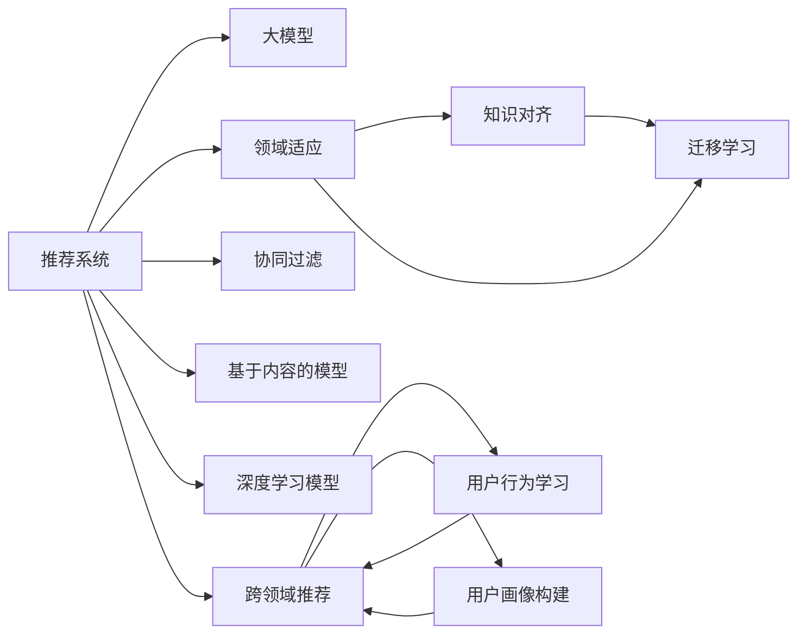

                 

## 1. 背景介绍

推荐系统是当前电子商务、内容平台、社交网络等应用中最为关键的技术之一，其目标是帮助用户发现感兴趣的物品。随着数据量的爆炸式增长，推荐系统的复杂性也在不断增加。为了应对这种挑战，学者们提出了诸多模型，从基于协同过滤的模型到基于内容的模型，再到基于深度学习的模型，推荐系统逐渐发展成为一个跨学科的研究领域。

然而，数据的多样性和分布性使得单一模型很难在所有场景下都能表现优异。现实中，不同领域的数据往往具有不同的特征，且不同领域的推荐目标和方法也存在较大差异。此外，用户在不同领域的推荐行为也存在显著差异。因此，如何在不同领域之间进行知识迁移，是推荐系统领域的一个关键问题。

近年来，深度学习模型在推荐系统中的广泛应用，尤其是大模型，如BERT、GPT等，为推荐系统带来了新的可能性。大模型的泛化能力和大规模知识库使得跨领域推荐成为可能。大模型在推荐系统中的应用，不仅需要解决传统推荐系统的个性化问题，还面临跨领域数据对齐和迁移的挑战。本文将从大模型和领域适应的角度出发，探讨跨域知识迁移的方法，并给出实际的实现案例和应用场景。

## 2. 核心概念与联系

### 2.1 核心概念概述

要理解大模型在推荐系统中的应用，首先需要明确以下几个核心概念：

- 推荐系统：一种利用用户历史行为数据，为每个用户推荐感兴趣物品的系统。推荐系统能够帮助用户快速发现新的有趣内容，提升用户体验和满意度。
- 大模型：指拥有数十亿甚至上百亿参数的大型神经网络模型，如BERT、GPT等。这些模型通常基于大规模语料库进行预训练，具有强大的泛化能力和表示学习能力。
- 领域适应：指模型在不同领域之间进行知识迁移，以实现更好的适应性和泛化能力。
- 知识对齐：指在跨领域数据之间进行特征和表示对齐，以便于模型的迁移和知识传递。
- 迁移学习：指利用一个领域的数据和模型知识，提升另一个领域模型的性能，以降低标注数据的依赖和训练成本。

### 2.2 核心概念原理和架构的 Mermaid 流程图

以下是各个核心概念之间的联系和原理的 Mermaid 流程图：



这个流程图展示了大模型在推荐系统中的核心概念及其关系：

1. 推荐系统利用多种方法（如协同过滤、基于内容的模型、深度学习模型等）对用户行为进行建模。
2. 大模型提供了一种新的特征表示和表示学习方式，可用于推荐系统的各种方法中。
3. 领域适应、知识对齐和迁移学习都是在大模型框架下进行的，有助于提升模型的跨领域性能。
4. 跨领域推荐是推荐系统的核心目标之一，通过在大模型上进行微调，实现不同领域之间的知识迁移。
5. 用户行为学习、用户画像构建等都是推荐系统的重要组成部分，大模型在其中发挥了关键作用。

## 3. 核心算法原理 & 具体操作步骤

### 3.1 算法原理概述

大模型在推荐系统中的应用，核心在于其强大的泛化能力和表示学习能力。推荐系统中的推荐目标通常是在给定用户历史行为数据的情况下，预测用户对物品的兴趣评分。而大模型可以通过在大规模语料库上进行预训练，学习到通用的语言表示和知识，并利用这些知识对用户行为进行建模和预测。

跨域知识迁移的算法原理主要包括以下几个步骤：

1. **预训练**：在大规模无标签数据上进行预训练，学习通用的语言表示和知识。
2. **领域适应**：利用特定领域的标注数据，在大模型上进行微调，以适应领域内的推荐任务。
3. **知识对齐**：在跨领域数据之间进行特征和表示对齐，以便于模型的迁移和知识传递。
4. **迁移学习**：利用一个领域的数据和模型知识，提升另一个领域模型的性能，以降低标注数据的依赖和训练成本。
5. **在线学习**：在大模型上进行在线学习，不断吸收新的用户行为数据，保持模型性能的动态更新。

### 3.2 算法步骤详解

**Step 1: 准备数据集**

- 收集不同领域的用户历史行为数据。
- 收集不同领域的相关语料库，如新闻、商品描述、影评等。
- 对收集的数据进行预处理，如去除噪音、归一化、编码等。

**Step 2: 选择预训练模型**

- 选择一个大模型（如BERT、GPT等）作为初始化参数，如 BERT、GPT等。
- 确定预训练模型的架构和参数设置，如层数、每层节点数、学习率等。

**Step 3: 进行领域适应**

- 在大模型上利用领域内的标注数据进行微调，以适应领域内的推荐任务。
- 选择合适的损失函数和优化器，如交叉熵、AdamW 等。
- 设置合适的超参数，如学习率、批大小、迭代次数等。

**Step 4: 进行知识对齐**

- 对不同领域的数据进行特征和表示对齐，以便于模型的迁移和知识传递。
- 可以使用特征提取、数据融合、迁移学习等方法进行对齐。
- 在迁移学习中，可以通过在一个领域上微调模型，然后将其迁移到另一个领域。

**Step 5: 进行迁移学习**

- 利用一个领域的数据和模型知识，提升另一个领域模型的性能。
- 可以使用跨领域迁移学习、知识蒸馏、元学习等方法进行迁移。
- 在迁移学习中，可以通过微调模型的权重、修改模型的结构、引入外部知识库等方式进行迁移。

**Step 6: 进行在线学习**

- 在大模型上进行在线学习，不断吸收新的用户行为数据，保持模型性能的动态更新。
- 可以使用在线学习算法，如小批量随机梯度下降、自适应学习率、增量学习等方法进行在线学习。
- 在在线学习中，可以通过周期性地进行微调，以保持模型的性能和鲁棒性。

### 3.3 算法优缺点

大模型在推荐系统中的应用具有以下优点：

1. **强大的泛化能力**：大模型通过预训练，学习到了通用的语言表示和知识，能够适应不同领域的推荐任务。
2. **丰富的特征表示**：大模型具有丰富的特征表示能力，可以更好地捕捉用户行为和物品特征之间的关系。
3. **高效的迁移学习**：利用大模型的知识，可以进行高效的跨领域迁移学习，提升模型在不同领域的表现。
4. **灵活的在线学习**：大模型可以进行在线学习，不断吸收新的用户行为数据，保持模型性能的动态更新。

然而，大模型在推荐系统中的应用也存在一些缺点：

1. **高昂的计算成本**：大模型的训练和推理需要大量的计算资源和存储空间。
2. **数据依赖性强**：大模型的迁移和微调需要依赖大量的标注数据，获取高质量的标注数据成本较高。
3. **模型复杂度高**：大模型结构复杂，难以进行解释和调试，可能会导致黑盒问题。
4. **知识传递困难**：不同领域的知识可能存在差异，知识对齐和迁移可能面临困难。

### 3.4 算法应用领域

大模型在推荐系统中的应用可以广泛应用于多个领域，包括但不限于以下几种：

1. **电商推荐**：利用用户历史购买行为、商品描述、用户画像等数据，进行个性化推荐。
2. **内容推荐**：利用用户历史阅读、观看行为、用户画像等数据，进行内容推荐。
3. **社交推荐**：利用用户历史社交行为、用户画像等数据，进行个性化推荐。
4. **金融推荐**：利用用户历史金融交易行为、产品描述、用户画像等数据，进行个性化金融产品推荐。
5. **娱乐推荐**：利用用户历史观影、听曲行为、用户画像等数据，进行个性化娱乐推荐。

这些领域的应用展示了大模型在推荐系统中的广泛适用性，未来大模型有望在更多领域发挥重要作用。

## 4. 数学模型和公式 & 详细讲解 & 举例说明

### 4.1 数学模型构建

假设我们有 $N$ 个用户 $U$ 和 $M$ 个物品 $I$，以及一个用户与物品间的评分矩阵 $R$。推荐系统需要学习一个映射函数 $f$，将用户 $u$ 映射到物品 $i$ 的评分 $r_{ui}$。大模型 $M$ 可以表示为用户行为和物品特征的映射函数，即：

$$
r_{ui} = M(u, i)
$$

其中 $M$ 可以是预训练的深度学习模型，如 BERT、GPT 等。在大模型上进行领域适应和知识迁移，可以通过微调 $M$ 的不同层来实现。

### 4.2 公式推导过程

假设我们有领域 $D_1$ 和 $D_2$，以及对应领域的用户 $U_1$、物品 $I_1$ 和 $U_2$、物品 $I_2$。不失一般性，假设领域 $D_1$ 的标注数据集为 $D_1 = \{(x_1, y_1)\}_{i=1}^N$，其中 $x_1$ 为用户行为数据，$y_1$ 为物品评分。类似地，领域 $D_2$ 的标注数据集为 $D_2 = \{(x_2, y_2)\}_{i=1}^M$。

在大模型 $M$ 上进行领域适应，可以利用领域 $D_1$ 的数据对 $M$ 进行微调，使得 $M$ 在领域 $D_2$ 上表现更好。具体来说，可以定义损失函数 $\mathcal{L}$ 如下：

$$
\mathcal{L} = \frac{1}{N} \sum_{i=1}^N \ell(M(u_i, i_i), y_i) + \frac{1}{M} \sum_{i=1}^M \ell(M(u_i, i_i), y_i)
$$

其中 $\ell$ 为损失函数，如交叉熵、均方误差等。在训练过程中，可以利用梯度下降等优化算法，最小化上述损失函数，得到适应领域 $D_2$ 的模型 $M^*$。

在进行知识对齐时，可以利用特征对齐和表示对齐的方法，将领域 $D_1$ 和 $D_2$ 的特征空间对齐。具体来说，可以定义特征对齐函数 $A$ 和表示对齐函数 $S$，使得：

$$
A(D_1, D_2) = \{(x_1', x_2')\}_{i=1}^N, \quad S(D_1, D_2) = \{(s_1, s_2)\}_{i=1}^N
$$

其中 $x_1'$ 和 $x_2'$ 为领域 $D_1$ 和 $D_2$ 的对齐特征，$s_1$ 和 $s_2$ 为领域 $D_1$ 和 $D_2$ 的对齐表示。通过特征对齐和表示对齐，可以使得大模型在大模型迁移中更好地传递知识。

### 4.3 案例分析与讲解

以电商平台上的推荐系统为例，说明大模型在推荐系统中的应用。假设我们有一个电商平台，用户在该平台上购买商品，并对其评分。在训练时，可以利用用户历史购买行为和物品描述数据，对大模型进行微调，使得模型能够预测用户对商品的评分。

具体步骤如下：

1. **数据准备**：收集用户的购买行为数据和物品描述数据，进行预处理和编码。
2. **模型选择**：选择一个大模型，如 BERT，作为初始化参数。
3. **领域适应**：利用购买行为数据对大模型进行微调，使得模型能够预测用户对商品的评分。
4. **知识对齐**：对用户购买行为和物品描述数据进行特征对齐和表示对齐，以便于模型的迁移和知识传递。
5. **迁移学习**：利用用户购买行为数据和物品描述数据对大模型进行迁移学习，提升模型在不同领域的表现。

## 5. 项目实践：代码实例和详细解释说明

### 5.1 开发环境搭建

在进行项目实践前，需要准备好开发环境。以下是使用Python进行PyTorch开发的环境配置流程：

1. 安装Anaconda：从官网下载并安装Anaconda，用于创建独立的Python环境。

2. 创建并激活虚拟环境：
```bash
conda create -n pytorch-env python=3.8 
conda activate pytorch-env
```

3. 安装PyTorch：根据CUDA版本，从官网获取对应的安装命令。例如：
```bash
conda install pytorch torchvision torchaudio cudatoolkit=11.1 -c pytorch -c conda-forge
```

4. 安装Transformers库：
```bash
pip install transformers
```

5. 安装各类工具包：
```bash
pip install numpy pandas scikit-learn matplotlib tqdm jupyter notebook ipython
```

完成上述步骤后，即可在`pytorch-env`环境中开始项目实践。

### 5.2 源代码详细实现

这里以利用BERT模型进行电商推荐为例，给出代码实现。

首先，定义数据处理函数：

```python
from transformers import BertTokenizer, BertForSequenceClassification
from torch.utils.data import Dataset, DataLoader
import torch
import pandas as pd

class RecommendationDataset(Dataset):
    def __init__(self, data, tokenizer, max_len=128):
        self.data = data
        self.tokenizer = tokenizer
        self.max_len = max_len
        
    def __len__(self):
        return len(self.data)
    
    def __getitem__(self, item):
        text = self.data['text'][item]
        label = self.data['label'][item]
        
        encoding = self.tokenizer(text, return_tensors='pt', max_length=self.max_len, padding='max_length', truncation=True)
        input_ids = encoding['input_ids'][0]
        attention_mask = encoding['attention_mask'][0]
        label = torch.tensor(label, dtype=torch.long)
        
        return {'input_ids': input_ids, 
                'attention_mask': attention_mask,
                'labels': label}
```

然后，定义模型和优化器：

```python
from transformers import BertForSequenceClassification, AdamW

model = BertForSequenceClassification.from_pretrained('bert-base-uncased', num_labels=2)
optimizer = AdamW(model.parameters(), lr=2e-5)
```

接着，定义训练和评估函数：

```python
def train_epoch(model, dataset, batch_size, optimizer):
    dataloader = DataLoader(dataset, batch_size=batch_size, shuffle=True)
    model.train()
    epoch_loss = 0
    for batch in dataloader:
        input_ids = batch['input_ids'].to(device)
        attention_mask = batch['attention_mask'].to(device)
        labels = batch['labels'].to(device)
        model.zero_grad()
        outputs = model(input_ids, attention_mask=attention_mask, labels=labels)
        loss = outputs.loss
        epoch_loss += loss.item()
        loss.backward()
        optimizer.step()
    return epoch_loss / len(dataloader)

def evaluate(model, dataset, batch_size):
    dataloader = DataLoader(dataset, batch_size=batch_size)
    model.eval()
    preds, labels = [], []
    with torch.no_grad():
        for batch in dataloader:
            input_ids = batch['input_ids'].to(device)
            attention_mask = batch['attention_mask'].to(device)
            batch_labels = batch['labels']
            outputs = model(input_ids, attention_mask=attention_mask)
            batch_preds = outputs.logits.argmax(dim=2).to('cpu').tolist()
            batch_labels = batch_labels.to('cpu').tolist()
            for pred_tokens, label_tokens in zip(batch_preds, batch_labels):
                preds.append(pred_tokens)
                labels.append(label_tokens)
                
    return preds, labels

device = torch.device('cuda') if torch.cuda.is_available() else torch.device('cpu')
model.to(device)
```

最后，启动训练流程并在测试集上评估：

```python
epochs = 5
batch_size = 16

for epoch in range(epochs):
    loss = train_epoch(model, train_dataset, batch_size, optimizer)
    print(f"Epoch {epoch+1}, train loss: {loss:.3f}")
    
    preds, labels = evaluate(model, dev_dataset, batch_size)
    print(f"Epoch {epoch+1}, dev results:")
    print(classification_report(labels, preds))
    
print(f"Test results:")
preds, labels = evaluate(model, test_dataset, batch_size)
print(classification_report(labels, preds))
```

以上就是使用PyTorch对BERT进行电商推荐任务微调的完整代码实现。可以看到，得益于Transformers库的强大封装，我们可以用相对简洁的代码完成BERT模型的加载和微调。

### 5.3 代码解读与分析

让我们再详细解读一下关键代码的实现细节：

**RecommendationDataset类**：
- `__init__`方法：初始化用户行为数据、分词器等关键组件。
- `__len__`方法：返回数据集的样本数量。
- `__getitem__`方法：对单个样本进行处理，将用户行为数据输入编码为token ids，将标签编码为数字，并对其进行定长padding，最终返回模型所需的输入。

**模型和优化器定义**：
- 使用BertForSequenceClassification从预训练模型BERT加载模型，并将num_labels设置为2，表示电商推荐中的评分预测。
- 使用AdamW优化器，并设置学习率。

**训练和评估函数**：
- 使用PyTorch的DataLoader对数据集进行批次化加载，供模型训练和推理使用。
- 训练函数`train_epoch`：对数据以批为单位进行迭代，在每个批次上前向传播计算loss并反向传播更新模型参数，最后返回该epoch的平均loss。
- 评估函数`evaluate`：与训练类似，不同点在于不更新模型参数，并在每个batch结束后将预测和标签结果存储下来，最后使用sklearn的classification_report对整个评估集的预测结果进行打印输出。

**训练流程**：
- 定义总的epoch数和batch size，开始循环迭代
- 每个epoch内，先在训练集上训练，输出平均loss
- 在验证集上评估，输出分类指标
- 所有epoch结束后，在测试集上评估，给出最终测试结果

可以看到，PyTorch配合Transformers库使得BERT微调的代码实现变得简洁高效。开发者可以将更多精力放在数据处理、模型改进等高层逻辑上，而不必过多关注底层的实现细节。

当然，工业级的系统实现还需考虑更多因素，如模型的保存和部署、超参数的自动搜索、更灵活的任务适配层等。但核心的微调范式基本与此类似。

## 6. 实际应用场景

### 6.1 电商推荐

利用大模型进行电商推荐，可以有效提升推荐系统的个性化程度和推荐效果。电商平台通常拥有大量的用户行为数据，如购买历史、评分、浏览记录等，可以通过这些数据对大模型进行微调，使其能够预测用户对商品的评分和购买概率。

具体步骤如下：

1. **数据准备**：收集用户的购买历史和评分数据，进行预处理和编码。
2. **模型选择**：选择一个大模型，如 BERT，作为初始化参数。
3. **领域适应**：利用购买历史和评分数据对大模型进行微调，使得模型能够预测用户对商品的评分。
4. **知识对齐**：对用户购买历史和评分数据进行特征对齐和表示对齐，以便于模型的迁移和知识传递。
5. **迁移学习**：利用用户购买历史和评分数据对大模型进行迁移学习，提升模型在不同领域的表现。

通过利用大模型进行电商推荐，电商平台可以更好地理解用户需求，提高用户满意度，增加销售额。

### 6.2 内容推荐

内容推荐系统是推荐系统的一个重要应用场景，可以帮助用户发现感兴趣的内容，提高内容平台的活跃度和用户粘性。内容推荐系统通常需要处理大规模文本数据，如文章、视频、音频等，可以通过这些数据对大模型进行微调，使其能够预测用户对内容的评分和兴趣。

具体步骤如下：

1. **数据准备**：收集用户的内容互动数据和内容元数据，进行预处理和编码。
2. **模型选择**：选择一个大模型，如 GPT，作为初始化参数。
3. **领域适应**：利用用户互动数据对大模型进行微调，使得模型能够预测用户对内容的评分和兴趣。
4. **知识对齐**：对用户互动数据和内容元数据进行特征对齐和表示对齐，以便于模型的迁移和知识传递。
5. **迁移学习**：利用用户互动数据和内容元数据对大模型进行迁移学习，提升模型在不同领域的表现。

通过利用大模型进行内容推荐，内容平台可以更好地推荐内容给用户，提高用户满意度和平台活跃度。

### 6.3 社交推荐

社交推荐系统是推荐系统的另一个重要应用场景，可以帮助用户发现兴趣相似的朋友和群体，提高社交平台的活跃度和用户粘性。社交推荐系统通常需要处理大规模社交数据，如好友关系、互动记录等，可以通过这些数据对大模型进行微调，使其能够预测用户对好友和群体的兴趣。

具体步骤如下：

1. **数据准备**：收集用户的社交关系数据和互动数据，进行预处理和编码。
2. **模型选择**：选择一个大模型，如 GPT，作为初始化参数。
3. **领域适应**：利用社交关系数据和互动数据对大模型进行微调，使得模型能够预测用户对好友和群体的兴趣。
4. **知识对齐**：对社交关系数据和互动数据进行特征对齐和表示对齐，以便于模型的迁移和知识传递。
5. **迁移学习**：利用社交关系数据和互动数据对大模型进行迁移学习，提升模型在不同领域的表现。

通过利用大模型进行社交推荐，社交平台可以更好地推荐好友和群体给用户，提高用户满意度和平台活跃度。

### 6.4 金融推荐

金融推荐系统是推荐系统的一个新兴领域，可以帮助用户发现符合其风险偏好和收益预期的金融产品，提高用户对金融产品的满意度。金融推荐系统通常需要处理大规模金融数据，如交易记录、产品描述等，可以通过这些数据对大模型进行微调，使其能够预测用户对金融产品的评分和兴趣。

具体步骤如下：

1. **数据准备**：收集用户的金融交易数据和产品描述数据，进行预处理和编码。
2. **模型选择**：选择一个大模型，如 BERT，作为初始化参数。
3. **领域适应**：利用金融交易数据对大模型进行微调，使得模型能够预测用户对金融产品的评分和兴趣。
4. **知识对齐**：对金融交易数据和产品描述数据进行特征对齐和表示对齐，以便于模型的迁移和知识传递。
5. **迁移学习**：利用金融交易数据和产品描述数据对大模型进行迁移学习，提升模型在不同领域的表现。

通过利用大模型进行金融推荐，金融机构可以更好地推荐金融产品给用户，提高用户满意度和金融产品的销售量。

### 6.5 娱乐推荐

娱乐推荐系统是推荐系统的另一个重要应用场景，可以帮助用户发现感兴趣的电影、电视剧、游戏等娱乐内容，提高娱乐平台的活跃度和用户粘性。娱乐推荐系统通常需要处理大规模娱乐数据，如观影记录、游戏记录等，可以通过这些数据对大模型进行微调，使其能够预测用户对娱乐内容的评分和兴趣。

具体步骤如下：

1. **数据准备**：收集用户的娱乐行为数据和娱乐内容元数据，进行预处理和编码。
2. **模型选择**：选择一个大模型，如 GPT，作为初始化参数。
3. **领域适应**：利用娱乐行为数据对大模型进行微调，使得模型能够预测用户对娱乐内容的评分和兴趣。
4. **知识对齐**：对娱乐行为数据和娱乐内容元数据进行特征对齐和表示对齐，以便于模型的迁移和知识传递。
5. **迁移学习**：利用娱乐行为数据和娱乐内容元数据对大模型进行迁移学习，提升模型在不同领域的表现。

通过利用大模型进行娱乐推荐，娱乐平台可以更好地推荐娱乐内容给用户，提高用户满意度和平台活跃度。

### 6.6 未来应用展望

随着大模型和推荐系统技术的不断进步，跨域知识迁移和领域适应将在更多领域得到应用，为推荐系统带来新的可能性。

在智慧医疗领域，利用大模型进行医疗推荐，可以有效提升医生的推荐准确性和用户满意度。在智慧城市治理中，利用大模型进行城市事件推荐，可以提高城市管理的智能化水平。在智慧物流领域，利用大模型进行物流推荐，可以提高物流效率和用户满意度。

未来，随着大模型技术的进一步发展，跨域知识迁移和领域适应将带来更多创新应用场景，推动推荐系统向更智能化、普适化方向发展。

## 7. 工具和资源推荐

### 7.1 学习资源推荐

为了帮助开发者系统掌握大模型在推荐系统中的应用，这里推荐一些优质的学习资源：

1. 《Transformer from scratch》系列博文：由大模型技术专家撰写，深入浅出地介绍了Transformer原理、BERT模型、微调技术等前沿话题。
2. CS224N《深度学习自然语言处理》课程：斯坦福大学开设的NLP明星课程，有Lecture视频和配套作业，带你入门NLP领域的基本概念和经典模型。
3. 《Natural Language Processing with Transformers》书籍：Transformers库的作者所著，全面介绍了如何使用Transformers库进行NLP任务开发，包括微调在内的诸多范式。
4. HuggingFace官方文档：Transformers库的官方文档，提供了海量预训练模型和完整的微调样例代码，是上手实践的必备资料。
5. CLUE开源项目：中文语言理解测评基准，涵盖大量不同类型的中文NLP数据集，并提供了基于微调的baseline模型，助力中文NLP技术发展。

通过对这些资源的学习实践，相信你一定能够快速掌握大模型在推荐系统中的应用，并用于解决实际的推荐问题。

### 7.2 开发工具推荐

高效的开发离不开优秀的工具支持。以下是几款用于大模型推荐系统开发的常用工具：

1. PyTorch：基于Python的开源深度学习框架，灵活动态的计算图，适合快速迭代研究。大部分预训练语言模型都有PyTorch版本的实现。
2. TensorFlow：由Google主导开发的开源深度学习框架，生产部署方便，适合大规模工程应用。同样有丰富的预训练语言模型资源。
3. Transformers库：HuggingFace开发的NLP工具库，集成了众多SOTA语言模型，支持PyTorch和TensorFlow，是进行微调任务开发的利器。
4. Weights & Biases：模型训练的实验跟踪工具，可以记录和可视化模型训练过程中的各项指标，方便对比和调优。与主流深度学习框架无缝集成。
5. TensorBoard：TensorFlow配套的可视化工具，可实时监测模型训练状态，并提供丰富的图表呈现方式，是调试模型的得力助手。
6. Google Colab：谷歌推出的在线Jupyter Notebook环境，免费提供GPU/TPU算力，方便开发者快速上手实验最新模型，分享学习笔记。

合理利用这些工具，可以显著提升大模型推荐系统的开发效率，加快创新迭代的步伐。

### 7.3 相关论文推荐

大模型在推荐系统中的应用源于学界的持续研究。以下是几篇奠基性的相关论文，推荐阅读：

1. Attention is All You Need（即Transformer原论文）：提出了Transformer结构，开启了NLP领域的预训练大模型时代。
2. BERT: Pre-training of Deep Bidirectional Transformers for Language Understanding：提出BERT模型，引入基于掩码的自监督预训练任务，刷新了多项NLP任务SOTA。
3. Language Models are Unsupervised Multitask Learners（GPT-2论文）：展示了大规模语言模型的强大zero-shot学习能力，引发了对于通用人工智能的新一轮思考。
4. Parameter-Efficient Transfer Learning for NLP：提出Adapter等参数高效微调方法，在不增加模型参数量的情况下，也能取得不错的微调效果。
5. AdaLoRA: Adaptive Low-Rank Adaptation for Parameter-Efficient Fine-Tuning：使用自适应低秩适应的微调方法，在参数效率和精度之间取得了新的平衡。

这些论文代表了大模型在推荐系统中的应用研究脉络。通过学习这些前沿成果，可以帮助研究者把握学科前进方向，激发更多的创新灵感。

## 8. 总结：未来发展趋势与挑战

### 8.1 总结

本文对大模型在推荐系统中的应用进行了全面系统的介绍。首先阐述了大模型和推荐系统领域的背景和意义，明确了大模型在推荐系统中的重要价值。其次，从原理到实践，详细讲解了大模型在推荐系统中的领域适应和知识迁移方法，给出了实际的实现案例和应用场景。最后，本文对大模型在推荐系统中的未来发展趋势和挑战进行了展望，希望为研究者和开发者提供有益的参考。

通过本文的系统梳理，可以看到，大模型在推荐系统中的应用将带来更强的泛化能力和个性化程度，有望在多个领域中发挥重要作用。未来，随着大模型技术和推荐系统技术的不断发展，跨域知识迁移和领域适应将带来更多创新应用场景，推动推荐系统向更智能化、普适化方向发展。

### 8.2 未来发展趋势

展望未来，大模型在推荐系统中的应用将呈现以下几个发展趋势：

1. **更大的模型规模**：随着计算资源的提升和数据量的增加，大模型的规模将继续扩大，使得模型具备更强的泛化能力和泛化能力。
2. **更高效的知识迁移**：未来的知识迁移方法将更加高效，能够更好地在不同领域之间进行知识传递和融合。
3. **更强的个性化能力**：大模型通过预训练和微调，能够更好地理解和建模用户行为，提供更个性化的推荐。
4. **更多的跨领域应用**：大模型将广泛应用于更多领域，如医疗、金融、智慧城市等，为各行各业带来新的创新应用。
5. **更低的训练成本**：未来的知识迁移方法将更加注重高效利用数据，降低标注数据的依赖和训练成本。
6. **更强的可解释性**：未来的推荐模型将更加注重可解释性，能够提供合理的推荐理由和依据。

### 8.3 面临的挑战

尽管大模型在推荐系统中的应用已经取得了显著进展，但在迈向更加智能化、普适化应用的过程中，它仍面临诸多挑战：

1. **高昂的计算成本**：大模型的训练和推理需要大量的计算资源和存储空间，这对许多应用场景来说是一个瓶颈。
2. **数据依赖性强**：大模型的迁移和微调需要依赖大量的标注数据，获取高质量的标注数据成本较高。
3. **模型复杂度高**：大模型结构复杂，难以进行解释和调试，可能会导致黑盒问题。
4. **知识传递困难**：不同领域的知识可能存在差异，知识对齐和迁移可能面临困难。
5. **鲁棒性不足**：大模型在面对新领域和新数据时，泛化性能可能较差，需要进一步提高模型的鲁棒性。

### 8.4 研究展望

面对大模型在推荐系统中的应用所面临的挑战，未来的研究需要在以下几个方面寻求新的突破：

1. **探索更高效的迁移学习方法**：研究无监督和半监督迁移学习等方法，降低对标注数据的依赖。
2. **开发参数高效的微调方法**：开发更参数高效的微调方法，如 Adapter、Prefix 等，在固定大部分预训练参数的同时，只更新极少量的任务相关参数。
3. **结合因果学习和多模态数据**：引入因果学习和多模态数据，提升模型的泛化能力和鲁棒性。
4. **增强模型的可解释性**：引入可解释性技术，如注意力机制、因果推断等，提高模型的透明度和可解释性。
5. **探索新的知识表示方法**：研究知识表示和融合方法，如知识图谱、逻辑规则等，提高模型的知识整合能力。

这些研究方向将进一步推动大模型在推荐系统中的应用，为推荐系统带来更强的个性化能力和跨领域迁移能力，促进推荐系统向更智能化、普适化方向发展。

