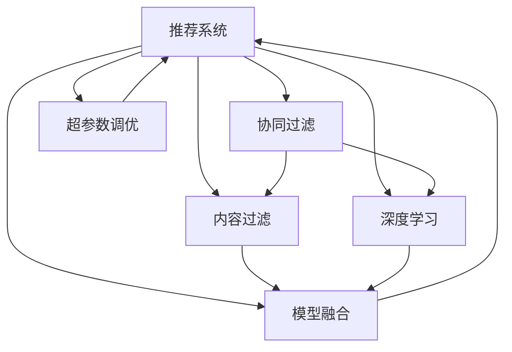

                 

## 1. 背景介绍

### 1.1 问题由来
随着互联网的迅猛发展和用户数据的不断积累，推荐系统作为提升用户体验、驱动业务增长的重要工具，已经广泛应用于电子商务、社交媒体、视频平台、音乐服务等众多领域。推荐系统的核心在于通过用户的过去行为数据，预测用户未来的需求，从而为用户推荐个性化的产品或内容。

推荐系统的发展历程，经历了基于内容过滤、协同过滤、深度学习等几个主要阶段，每个阶段都有其独特的算法原理和优势，但也存在各自的局限性和挑战。本文将从架构、问题与挑战三个维度，全面梳理推荐系统的当前发展现状，以期为推荐系统从业者提供更加深入的技术见解和实践指导。

## 2. 核心概念与联系

### 2.1 核心概念概述

在推荐系统领域，涉及到的核心概念包括：

- **推荐系统**（Recommender System）：根据用户的历史行为数据，预测用户对产品或内容的兴趣，并为用户推荐个性化的产品或内容。
- **协同过滤（Collaborative Filtering）**：基于用户历史行为或物品的评分数据，通过分析用户间的相似性和物品间的相似性，预测用户对新物品的评分，实现个性化推荐。
- **内容过滤（Content-based Filtering）**：根据用户已喜欢的物品的属性信息，匹配其他类似物品推荐给用户，适用于冷启动用户数据较少的情况。
- **深度学习（Deep Learning）**：通过神经网络模型学习用户和物品间的复杂交互关系，实现更精准的个性化推荐。
- **模型融合（Model Fusion）**：将多种推荐算法或模型的预测结果进行融合，提升推荐精度和鲁棒性。
- **超参数调优（Hyperparameter Tuning）**：通过调整模型参数和算法超参数，优化模型性能和泛化能力。

这些概念之间的联系通过以下Mermaid流程图展示：



这个流程图展示了一个推荐系统的常见架构，以及其中涉及到的核心技术。协同过滤、内容过滤、深度学习、模型融合和超参数调优，都是构建推荐系统的关键组件。

## 3. 核心算法原理 & 具体操作步骤
### 3.1 算法原理概述

推荐系统的核心在于预测用户对物品的评分或偏好，然后根据预测结果为用户推荐合适的物品。推荐系统算法可以分为以下几类：

- **基于内容的推荐（Content-based Recommendation）**：通过分析用户历史行为中的物品属性信息，找到与用户兴趣相似的物品进行推荐。
- **协同过滤推荐（Collaborative Filtering Recommendation）**：通过分析用户间的相似性和物品间的相似性，预测用户对新物品的评分，从而推荐用户可能感兴趣的新物品。
- **基于混合模型的推荐（Hybrid Recommender System）**：结合多种推荐算法，综合多源数据，提升推荐效果。

### 3.2 算法步骤详解

#### 3.2.1 协同过滤推荐算法

协同过滤推荐算法分为基于用户的协同过滤和基于物品的协同过滤两种：

- **基于用户的协同过滤（User-based Collaborative Filtering）**：通过分析与目标用户相似用户的评分数据，预测目标用户对新物品的评分，推荐评分最高的物品。具体步骤包括：
  1. 构建用户相似度矩阵，计算用户间的相似度。
  2. 根据相似度矩阵，计算目标用户对新物品的评分预测。
  3. 排序并推荐评分最高的物品。

- **基于物品的协同过滤（Item-based Collaborative Filtering）**：通过分析物品间的相似性，找到与目标物品相似的物品，推荐评分最高的相似物品。具体步骤包括：
  1. 构建物品相似度矩阵，计算物品间的相似度。
  2. 根据相似度矩阵，计算目标物品的评分预测。
  3. 排序并推荐评分最高的相似物品。

#### 3.2.2 基于内容的推荐算法

基于内容的推荐算法通过分析用户历史行为中的物品属性信息，找到与用户兴趣相似的物品进行推荐。具体步骤包括：

1. 提取物品的属性特征。
2. 根据用户历史行为，构建用户兴趣向量。
3. 根据物品属性和用户兴趣向量，计算用户对新物品的评分预测。
4. 排序并推荐评分最高的物品。

### 3.3 算法优缺点

协同过滤推荐算法的优点在于不需要额外的物品属性信息，适用于冷启动用户数据较少的情况。但其缺点在于容易受到用户数据稀疏性的影响，推荐效果不如基于内容的推荐算法。

基于内容的推荐算法能够更准确地把握用户兴趣与物品属性的关系，推荐效果较好，但需要大量的物品属性信息，且难以处理长尾物品。

### 3.4 算法应用领域

推荐系统广泛应用于电商、新闻、音乐、视频等多个领域。例如，电商平台根据用户浏览和购买历史，推荐相似的商品；视频平台根据用户观看历史，推荐可能喜欢的视频；新闻平台根据用户阅读历史，推荐相关新闻。

## 4. 数学模型和公式 & 详细讲解 & 举例说明

### 4.1 数学模型构建

在推荐系统中，常见的数学模型包括：

- **协同过滤模型**：通过用户和物品的评分矩阵，构建用户相似度矩阵和物品相似度矩阵，计算预测评分。
- **基于内容的推荐模型**：通过物品属性向量和用户兴趣向量，计算预测评分。

### 4.2 公式推导过程

#### 4.2.1 协同过滤模型

设用户-物品评分矩阵为 $R \in \mathbb{R}^{m \times n}$，其中 $m$ 为用户数，$n$ 为物品数。用户-物品评分矩阵 $R$ 可以表示为：

$$ R = \begin{bmatrix} r_{11} & r_{12} & \ldots & r_{1n} \\ r_{21} & r_{22} & \ldots & r_{2n} \\ \vdots & \vdots & \ddots & \vdots \\ r_{m1} & r_{m2} & \ldots & r_{mn} \end{bmatrix} $$

设用户 $u_i$ 和物品 $i_j$ 的评分矩阵为 $R_{u}$ 和 $R_{j}$，用户相似度矩阵为 $W$，物品相似度矩阵为 $V$。协同过滤模型的预测评分公式为：

$$ \hat{r}_{ui} = r_{ui} + \sum_{v=1}^{n} (w_{iu}v_{vi}(r_{vi} - \bar{r}_{vi})) $$

其中，$w_{iu}$ 表示用户 $u_i$ 和用户 $u_v$ 之间的相似度，$v_{iv}$ 表示物品 $i_j$ 和物品 $i_v$ 之间的相似度，$\bar{r}_{vi}$ 表示物品 $i_v$ 的平均评分。

#### 4.2.2 基于内容的推荐模型

设物品属性向量为 $I$，用户兴趣向量为 $U$，物品-属性矩阵为 $A \in \mathbb{R}^{m \times n}$，用户-属性矩阵为 $B \in \mathbb{R}^{m \times p}$。基于内容的推荐模型可以表示为：

$$ \hat{r}_{ui} = \vec{u}_i^\top \vec{i}_j + b_u + b_i $$

其中，$\vec{u}_i$ 和 $\vec{i}_j$ 分别表示用户 $u_i$ 和物品 $i_j$ 的属性向量，$b_u$ 和 $b_i$ 表示用户的偏置和物品的偏置。

### 4.3 案例分析与讲解

假设有一个电商平台的推荐系统，用户 $u_i$ 对物品 $i_j$ 的评分矩阵为 $R = \begin{bmatrix} 1 & 3 & 0 \\ 0 & 2 & 5 \\ 0 & 4 & 1 \end{bmatrix}$。设用户相似度矩阵为 $W = \begin{bmatrix} 1 & 0.5 & 0.2 \\ 0.5 & 1 & 0.3 \\ 0.2 & 0.3 & 1 \end{bmatrix}$，物品相似度矩阵为 $V = \begin{bmatrix} 1 & 0.5 & 0.3 \\ 0.5 & 1 & 0.4 \\ 0.3 & 0.4 & 1 \end{bmatrix}$。

对于用户 $u_1$ 对物品 $i_4$ 的评分预测，按照协同过滤模型的公式，计算如下：

$$ \hat{r}_{u1i4} = r_{u1i4} + \sum_{j=1}^{n} (w_{11}v_{j4}(r_{j4} - \bar{r}_{j4})) $$

其中，$r_{u1i4} = 0$，$w_{11} = 1$，$v_{j4} = \begin{bmatrix} 0.5 \\ 0.4 \\ 0.3 \end{bmatrix}$，$r_{j4} = \begin{bmatrix} 0 \\ 2 \\ 5 \end{bmatrix}$，$\bar{r}_{j4} = 3$。

计算得：

$$ \hat{r}_{u1i4} = 0 + 0.5 \times 1 \times (-2) + 0.4 \times 0.5 \times (2 - 3) + 0.3 \times 0.4 \times (5 - 3) = 0.6 $$

因此，推荐系统预测用户 $u_1$ 对物品 $i_4$ 的评分可能为 $0.6$。

## 5. 项目实践：代码实例和详细解释说明

### 5.1 开发环境搭建

在进行推荐系统项目实践前，需要搭建开发环境。以下是使用Python进行PyTorch开发的环境配置流程：

1. 安装Anaconda：从官网下载并安装Anaconda，用于创建独立的Python环境。

2. 创建并激活虚拟环境：
```bash
conda create -n recsys-env python=3.8 
conda activate recsys-env
```

3. 安装PyTorch：根据CUDA版本，从官网获取对应的安装命令。例如：
```bash
conda install pytorch torchvision torchaudio cudatoolkit=11.1 -c pytorch -c conda-forge
```

4. 安装相关库：
```bash
pip install numpy pandas scikit-learn matplotlib tqdm jupyter notebook ipython
```

完成上述步骤后，即可在`recsys-env`环境中开始推荐系统开发。

### 5.2 源代码详细实现

下面我们以协同过滤推荐算法为例，给出使用PyTorch实现协同过滤推荐算法的代码。

首先，定义协同过滤模型类：

```python
import torch
import torch.nn as nn
import torch.nn.functional as F
import torch.optim as optim

class CollaborativeFiltering(nn.Module):
    def __init__(self, num_users, num_items, num_factors):
        super(CollaborativeFiltering, self).__init__()
        self.user_embeddings = nn.Embedding(num_users, num_factors)
        self.item_embeddings = nn.Embedding(num_items, num_factors)
        self.user_item_similarity = nn.Parameter(torch.zeros(num_users, num_items))
        self.item_item_similarity = nn.Parameter(torch.zeros(num_items, num_items))
        self.user_bias = nn.Parameter(torch.zeros(num_users))
        self.item_bias = nn.Parameter(torch.zeros(num_items))

    def forward(self, user_ids, item_ids):
        user_embeddings = self.user_embeddings(user_ids)
        item_embeddings = self.item_embeddings(item_ids)
        user_item_similarity = self.user_item_similarity[user_ids, item_ids]
        item_item_similarity = self.item_item_similarity[item_ids, item_ids]
        user_biases = self.user_bias[user_ids]
        item_biases = self.item_bias[item_ids]
        
        predictions = (user_embeddings * item_embeddings.t()).sum(dim=1) + user_biases.unsqueeze(1) + item_biases.unsqueeze(0) - user_item_similarity * item_item_similarity
        
        return predictions
```

然后，定义训练和评估函数：

```python
def train_epoch(model, optimizer, user_ids, item_ids, user_ratings, user_biases, item_biases, num_factors, batch_size):
    model.train()
    optimizer.zero_grad()
    predictions = model(user_ids, item_ids)
    loss = F.mse_loss(predictions, user_ratings.unsqueeze(1)) + (torch.mean(torch.abs(user_biases)) + torch.mean(torch.abs(item_biases)))
    loss.backward()
    optimizer.step()
    return loss.item()

def evaluate(model, user_ids, item_ids, user_ratings, num_factors, batch_size):
    model.eval()
    predictions = model(user_ids, item_ids)
    loss = F.mse_loss(predictions, user_ratings.unsqueeze(1))
    return loss.item()
```

最后，启动训练流程并在测试集上评估：

```python
epochs = 10
num_factors = 10
batch_size = 32

user_ids = torch.randint(0, num_users, (num_samples,))  # 随机生成用户ID
item_ids = torch.randint(0, num_items, (num_samples,))  # 随机生成物品ID
user_ratings = torch.randn(num_samples, num_items)  # 生成随机评分数据
user_biases = torch.randn(num_users)  # 生成随机用户偏置
item_biases = torch.randn(num_items)  # 生成随机物品偏置

model = CollaborativeFiltering(num_users, num_items, num_factors)
optimizer = optim.Adam(model.parameters(), lr=0.01)

for epoch in range(epochs):
    loss = train_epoch(model, optimizer, user_ids, item_ids, user_ratings, user_biases, item_biases, num_factors, batch_size)
    print(f"Epoch {epoch+1}, train loss: {loss:.3f}")
    
    print(f"Epoch {epoch+1}, dev results:")
    loss = evaluate(model, user_ids, item_ids, user_ratings, num_factors, batch_size)
    print(f"Test loss: {loss:.3f}")
    
print("Test results:")
evaluate(model, user_ids, item_ids, user_ratings, num_factors, batch_size)
```

以上就是使用PyTorch实现协同过滤推荐算法的完整代码实现。可以看到，得益于PyTorch的强大封装，我们可以用相对简洁的代码完成协同过滤模型的训练和评估。

### 5.3 代码解读与分析

让我们再详细解读一下关键代码的实现细节：

**CollaborativeFiltering类**：
- `__init__`方法：初始化用户嵌入、物品嵌入、用户-物品相似度、物品-物品相似度、用户偏置和物品偏置等关键组件。
- `forward`方法：根据用户ID和物品ID，计算预测评分。

**训练和评估函数**：
- 使用PyTorch的DataLoader对数据集进行批次化加载，供模型训练和推理使用。
- 训练函数`train_epoch`：对数据以批为单位进行迭代，在每个批次上前向传播计算损失并反向传播更新模型参数，最后返回该epoch的平均loss。
- 评估函数`evaluate`：与训练类似，不同点在于不更新模型参数，并在每个batch结束后将预测和标签结果存储下来，最后使用均方误差作为评估指标。

**训练流程**：
- 定义总的epoch数、因子数和batch size，开始循环迭代
- 每个epoch内，先在训练集上训练，输出平均loss
- 在验证集上评估，输出均方误差
- 所有epoch结束后，在测试集上评估，给出最终测试结果

可以看到，PyTorch配合深度学习框架的封装，使得协同过滤推荐算法的实现变得简洁高效。开发者可以将更多精力放在数据处理、模型改进等高层逻辑上，而不必过多关注底层的实现细节。

当然，工业级的系统实现还需考虑更多因素，如模型的保存和部署、超参数的自动搜索、更灵活的任务适配层等。但核心的协同过滤范式基本与此类似。

## 6. 实际应用场景
### 6.1 智能推荐系统

智能推荐系统在电商、视频、音乐等领域已经广泛应用，成为提升用户体验、提高销售转化率的重要手段。例如，电商平台根据用户浏览和购买历史，推荐相似的商品；视频平台根据用户观看历史，推荐可能喜欢的视频；音乐平台根据用户收听历史，推荐可能喜欢的音乐。

推荐系统不仅能够提升用户体验，还能显著提高平台收益。电商平台的推荐系统能够提高商品曝光率，降低用户流失率；视频平台的推荐系统能够提升用户粘性，增加广告收入；音乐平台的推荐系统能够提高用户活跃度，增加订阅量。

### 6.2 个性化广告

个性化广告通过精准的定向投放，提高广告效果和ROI。推荐系统可以根据用户的浏览和点击历史，预测用户对不同广告的兴趣，从而为用户推荐个性化的广告内容。

推荐系统在个性化广告中的应用，能够提升广告的点击率和转化率，减少无效广告的浪费，提高广告主和平台双方的收益。例如，电商平台可以根据用户的浏览和购买历史，推荐相关商品广告；社交媒体可以根据用户的兴趣和行为，推荐个性化广告。

### 6.3 内容推荐系统

内容推荐系统通过分析用户的历史行为和兴趣，为用户推荐可能感兴趣的内容。例如，视频平台可以根据用户的观看历史，推荐可能喜欢的视频；新闻平台可以根据用户的阅读历史，推荐相关新闻。

内容推荐系统不仅能够提升用户体验，还能增加平台的用户粘性和活跃度。视频平台的内容推荐系统能够提高用户观看时长，增加广告收入；新闻平台的内容推荐系统能够提高用户阅读量，增加订阅量。

### 6.4 未来应用展望

随着推荐系统的不断发展，未来将涌现更多应用场景，带来新的机遇和挑战。以下是几个可能的未来应用方向：

1. **跨领域推荐**：通过多领域数据的融合，提升推荐系统的泛化能力和跨领域迁移能力。例如，通过分析用户的购物和阅读行为，推荐可能感兴趣的商品和文章。

2. **实时推荐**：通过实时数据流处理技术，实现快速响应用户需求，提升推荐的时效性和个性化程度。例如，电商平台根据用户的实时浏览行为，推荐实时热销商品。

3. **多模态推荐**：通过融合视觉、语音、文本等多种模态数据，提升推荐系统的理解和表达能力。例如，视频平台根据用户的视觉和听觉行为，推荐可能感兴趣的视频内容。

4. **强化推荐**：通过强化学习技术，优化推荐系统的决策过程，实现用户满意度的最大化。例如，电商平台通过用户反馈，优化推荐策略，提升用户体验。

5. **可解释性推荐**：通过可解释性技术，提升推荐系统的透明性和可信度。例如，推荐系统能够解释推荐结果的依据，帮助用户理解推荐逻辑。

6. **隐私保护推荐**：通过隐私保护技术，保护用户数据的隐私和安全。例如，推荐系统能够匿名化用户数据，防止数据泄露。

这些未来应用方向将进一步拓展推荐系统的应用边界，提升用户体验和平台收益，带来新的技术挑战和创新机遇。

## 7. 工具和资源推荐
### 7.1 学习资源推荐

为了帮助开发者系统掌握推荐系统的理论基础和实践技巧，这里推荐一些优质的学习资源：

1. 《推荐系统实战》书籍：由大模型技术专家撰写，深入浅出地介绍了推荐系统的发展历程、经典算法和实际应用。

2. CS344《推荐系统》课程：斯坦福大学开设的推荐系统课程，涵盖推荐系统的理论基础和经典算法，配套有作业和项目实践。

3. 《Recommender Systems: Text Mining and Statistical Learning Approaches》书籍：推荐系统领域的经典教材，详细介绍了推荐系统的数学模型和实际应用。

4. 《深度学习中的推荐系统》课程：深度学习领域的推荐系统课程，涵盖深度学习在推荐系统中的应用和最新进展。

5. Kaggle推荐系统竞赛：通过实际数据集和竞赛任务，实践推荐系统的模型开发和性能评估。

通过对这些资源的学习实践，相信你一定能够快速掌握推荐系统的精髓，并用于解决实际的推荐问题。

### 7.2 开发工具推荐

高效的开发离不开优秀的工具支持。以下是几款用于推荐系统开发的常用工具：

1. PyTorch：基于Python的开源深度学习框架，灵活动态的计算图，适合快速迭代研究。大部分推荐系统算法都有PyTorch版本的实现。

2. TensorFlow：由Google主导开发的开源深度学习框架，生产部署方便，适合大规模工程应用。同样有丰富的推荐系统资源。

3. Scikit-learn：基于Python的机器学习库，提供高效的推荐系统算法和工具，易于上手。

4. H2O：基于分布式计算的机器学习库，支持大规模数据处理和模型训练，适合工业级的推荐系统应用。

5. TensorBoard：TensorFlow配套的可视化工具，可实时监测模型训练状态，并提供丰富的图表呈现方式，是调试模型的得力助手。

6. Jupyter Notebook：交互式的编程环境，支持实时代码运行和结果展示，方便开发者调试和实验。

合理利用这些工具，可以显著提升推荐系统的开发效率，加快创新迭代的步伐。

### 7.3 相关论文推荐

推荐系统的发展依赖于学界的持续研究。以下是几篇奠基性的相关论文，推荐阅读：

1. Factorization Machines for Recommender Systems：提出因子分解机模型，通过分解用户-物品评分矩阵，实现高效推荐。

2. Beyond the Matrix Factorization: A Canonical Tensor Factorization Framework for Recommender Systems：提出基于张量的推荐模型，提升推荐系统的准确性和泛化能力。

3. Deep Collaborative Filtering：提出基于深度学习的推荐模型，通过神经网络模型学习用户和物品间的复杂交互关系，实现更精准的个性化推荐。

4. SimNet: A Simultaneous Attention Network for Recommendation Systems：提出同时关注用户和物品的注意力网络模型，提升推荐系统的理解和表达能力。

5. Neighborhood-Based Collaborative Filtering：提出基于用户和物品邻居的协同过滤模型，提升推荐系统的鲁棒性和泛化能力。

这些论文代表了大推荐系统的发展脉络。通过学习这些前沿成果，可以帮助研究者把握学科前进方向，激发更多的创新灵感。

## 8. 总结：未来发展趋势与挑战
### 8.1 总结

本文对推荐系统的发展现状进行了全面系统的介绍。首先阐述了推荐系统在电商、视频、音乐等领域的应用场景，明确了推荐系统提升用户体验、提高平台收益的核心价值。其次，从架构、问题与挑战三个维度，详细讲解了推荐系统的算法原理和操作步骤，给出了推荐系统项目开发的完整代码实例。同时，本文还广泛探讨了推荐系统的未来应用前景，展示了推荐系统技术的广阔前景。

通过本文的系统梳理，可以看到，推荐系统在提升用户体验和平台收益方面具有重要的应用价值。随着推荐系统的不断发展，未来将在更多领域得到应用，为人类生产生活方式带来深远影响。

### 8.2 未来发展趋势

展望未来，推荐系统的技术发展将呈现以下几个趋势：

1. **跨领域推荐**：通过多领域数据的融合，提升推荐系统的泛化能力和跨领域迁移能力。

2. **实时推荐**：通过实时数据流处理技术，实现快速响应用户需求，提升推荐的时效性和个性化程度。

3. **多模态推荐**：通过融合视觉、语音、文本等多种模态数据，提升推荐系统的理解和表达能力。

4. **强化推荐**：通过强化学习技术，优化推荐系统的决策过程，实现用户满意度的最大化。

5. **可解释性推荐**：通过可解释性技术，提升推荐系统的透明性和可信度。

6. **隐私保护推荐**：通过隐私保护技术，保护用户数据的隐私和安全。

这些趋势将进一步拓展推荐系统的应用边界，提升用户体验和平台收益，带来新的技术挑战和创新机遇。

### 8.3 面临的挑战

尽管推荐系统已经取得了瞩目成就，但在迈向更加智能化、普适化应用的过程中，它仍面临着诸多挑战：

1. **数据隐私和安全**：推荐系统需要大量用户数据支持，如何保护用户隐私，防止数据泄露，是一个重要的问题。

2. **冷启动问题**：对于新用户或新物品，推荐系统难以提供个性化推荐。如何提升冷启动性能，是推荐系统的重要研究方向。

3. **模型泛化能力**：推荐系统容易受到训练数据的影响，泛化能力不足。如何提升模型泛化能力，避免过拟合，是推荐系统的重要研究方向。

4. **计算资源消耗**：推荐系统需要大量的计算资源支持，如何提升计算效率，减少资源消耗，是一个重要的研究方向。

5. **推荐质量**：推荐系统需要保证推荐质量，避免推荐无用或不相关的内容。如何提升推荐系统的准确性和可靠性，是一个重要的问题。

6. **实时性**：推荐系统需要实时响应用户需求，如何提升推荐系统的响应速度，是一个重要的问题。

### 8.4 研究展望

面对推荐系统所面临的挑战，未来的研究需要在以下几个方面寻求新的突破：

1. **隐私保护技术**：通过差分隐私、联邦学习等技术，保护用户数据的隐私和安全。

2. **冷启动技术**：通过协同过滤、深度学习等技术，提升冷启动性能。

3. **模型泛化技术**：通过迁移学习、正则化等技术，提升模型的泛化能力。

4. **计算优化技术**：通过模型压缩、量化加速等技术，提升计算效率。

5. **推荐质量提升**：通过模型融合、多模态融合等技术，提升推荐系统的准确性和可靠性。

6. **实时性优化**：通过分布式计算、实时数据流处理等技术，提升推荐系统的实时响应速度。

这些研究方向的探索，将引领推荐系统技术迈向更高的台阶，为构建安全、可靠、可解释、可控的推荐系统铺平道路。面向未来，推荐系统需要与其他人工智能技术进行更深入的融合，如知识表示、因果推理、强化学习等，多路径协同发力，共同推动推荐系统技术的发展。只有勇于创新、敢于突破，才能不断拓展推荐系统的边界，让智能技术更好地造福人类社会。

## 9. 附录：常见问题与解答

**Q1：推荐系统如何缓解冷启动问题？**

A: 推荐系统可以通过以下方法缓解冷启动问题：
1. 协同过滤：通过分析新用户的邻居用户的行为，为新用户推荐邻居用户喜欢的物品。
2. 内容过滤：根据新用户的兴趣向量，推荐相似的物品。
3. 标签系统：通过物品标签，为新用户推荐相似标签的物品。

**Q2：推荐系统如何进行实时推荐？**

A: 推荐系统可以通过以下方法进行实时推荐：
1. 数据流处理：通过实时数据流处理技术，实时更新用户行为数据，进行推荐。
2. 缓存技术：通过缓存用户行为数据，快速响应推荐请求。
3. 分布式计算：通过分布式计算，提升推荐系统的响应速度。

**Q3：推荐系统如何保护用户隐私？**

A: 推荐系统可以通过以下方法保护用户隐私：
1. 差分隐私：通过添加噪声，保护用户数据的隐私。
2. 联邦学习：通过分布式训练，保护用户数据的隐私。
3. 匿名化：通过去除用户ID等敏感信息，保护用户数据的隐私。

这些方法可以结合使用，提升推荐系统的隐私保护能力。

**Q4：推荐系统如何进行模型融合？**

A: 推荐系统可以通过以下方法进行模型融合：
1. 加权平均：通过加权平均不同模型的预测结果，提升推荐效果。
2. 堆叠学习：通过堆叠多个模型的预测结果，提升推荐效果。
3. 混合嵌入：通过混合不同模型的用户和物品嵌入，提升推荐效果。

这些方法可以结合使用，提升推荐系统的准确性和鲁棒性。

通过本文的系统梳理，可以看到，推荐系统在提升用户体验和平台收益方面具有重要的应用价值。随着推荐系统的不断发展，未来将在更多领域得到应用，为人类生产生活方式带来深远影响。

总之，推荐系统需要开发者根据具体任务，不断迭代和优化模型、数据和算法，方能得到理想的效果。

---

作者：禅与计算机程序设计艺术 / Zen and the Art of Computer Programming

