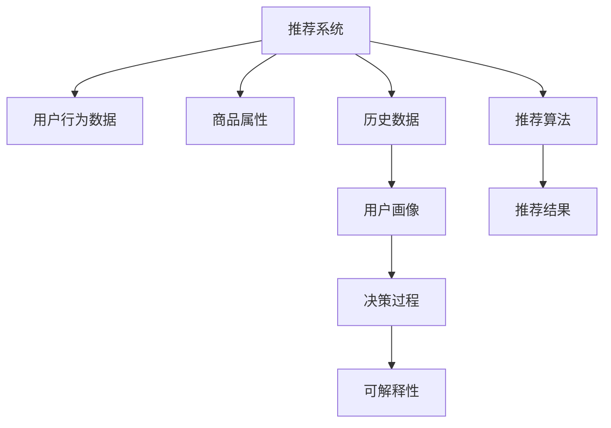

                 

# 推荐系统的可解释性：用户的信任

## 1. 背景介绍

### 1.1 问题由来

推荐系统在电子商务、新闻媒体、社交网络等众多领域得到了广泛应用，极大地提升了用户体验和运营效率。然而，推荐算法的"黑盒"特性，导致其决策过程难以解释和理解。用户的信任是推荐系统成功的关键，缺乏可解释性容易导致用户对推荐结果产生不信任感，甚至造成用户流失。

### 1.2 问题核心关键点

当前推荐系统的瓶颈在于算法的可解释性不足，用户在接受推荐结果时往往无法理解推荐理由，难以对其决策逻辑进行信任。为了增强推荐系统的透明度和可理解性，有必要对推荐算法的可解释性进行深入研究。

## 2. 核心概念与联系

### 2.1 核心概念概述

推荐系统（Recommender System）是基于用户行为数据和商品属性信息，预测用户可能感兴趣的商品，并给出推荐结果的系统。其核心在于分析用户的历史行为数据和商品属性，预测用户可能感兴趣的潜在商品，从而提升用户体验和业务效果。

推荐系统的可解释性（Explainability）指推荐算法输出的推荐结果以及其决策过程可以被用户理解和解释的程度。推荐系统的可解释性有助于增强用户信任，提升用户体验，促进算法公平透明，维护数据隐私。

### 2.2 核心概念原理和架构的 Mermaid 流程图



### 2.3 核心概念关系解析

推荐系统通过分析用户行为数据和商品属性信息，构建用户画像（User Profile），并使用推荐算法（Recommendation Algorithm）进行预测。用户画像和推荐算法是推荐系统的核心组成部分，用户画像描述了用户的兴趣和偏好，推荐算法则根据用户画像和商品属性生成推荐结果。可解释性则通过解析推荐算法和用户画像，向用户解释推荐过程，增强用户信任。

## 3. 核心算法原理 & 具体操作步骤

### 3.1 算法原理概述

推荐系统的可解释性可以分为两个层面：

1. **结果可解释性**：向用户解释推荐结果背后的原因。
2. **过程可解释性**：解释推荐算法的决策过程。

常见的结果可解释性方法包括：

- **基于内容的方法**：推荐相似商品，解释推荐理由为相似属性特征。
- **协同过滤**：推荐邻居评分最高的商品，解释推荐理由为邻居用户偏好。
- **基于混合模型的方法**：综合多种模型结果，解释推荐理由为多模型融合效果。

常见的过程可解释性方法包括：

- **特征重要性解释**：通过特征贡献度分析，解释模型内部特征重要性。
- **决策路径解释**：追踪决策过程中涉及的关键特征和计算步骤。
- **局部可解释模型**：对推荐结果进行局部解释，解释单个推荐实例的决策过程。

### 3.2 算法步骤详解

推荐系统的可解释性通常涉及以下步骤：

1. **数据准备**：收集和处理用户行为数据和商品属性信息，构建用户画像。
2. **特征提取**：对用户画像和商品属性进行特征工程，提取有意义的特征。
3. **模型训练**：选择合适的推荐算法，并根据历史数据进行训练。
4. **解释生成**：生成推荐结果的可解释性报告，解释推荐原因和决策过程。
5. **结果反馈**：将解释报告反馈给用户，增强用户对推荐系统的信任感。

### 3.3 算法优缺点

基于可解释性的推荐系统具有以下优点：

- **增强用户信任**：通过向用户解释推荐理由，提升用户对推荐结果的信任感。
- **促进用户交互**：解释推荐决策过程，有助于用户理解推荐系统的设计逻辑，激发用户兴趣。
- **提升系统透明度**：帮助开发者理解和优化推荐算法，提高系统性能。

然而，可解释性推荐系统也存在以下缺点：

- **计算复杂度高**：生成推荐结果和解释报告，需要更多的计算资源和存储空间。
- **可解释性限制**：某些推荐算法的内部机制复杂，难以完全解释清楚。
- **信息噪声**：过度解释可能导致用户被冗余信息干扰，降低推荐效果。

### 3.4 算法应用领域

推荐系统的可解释性在以下领域具有广泛应用：

1. **电商推荐**：解释商品推荐原因，提升用户购买决策信心。
2. **内容推荐**：解释文章推荐依据，增强用户阅读体验。
3. **社交网络**：解释好友推荐理由，促进用户社交互动。
4. **广告推荐**：解释广告推荐原因，提升广告投放效果。
5. **智能家居**：解释智能设备推荐理由，提升用户体验。

## 4. 数学模型和公式 & 详细讲解 & 举例说明

### 4.1 数学模型构建

推荐系统的可解释性模型通常基于以下假设：

- 用户行为数据和商品属性信息可以充分描述用户偏好。
- 推荐算法能够根据用户画像和商品属性生成准确的推荐结果。

推荐系统可以表示为：

$$
R(u,i) = f(\mathbf{X}_u, \mathbf{Y}_i, \mathbf{Z}_{ui})
$$

其中，$R(u,i)$ 表示用户 $u$ 对商品 $i$ 的评分，$f$ 为推荐算法，$\mathbf{X}_u$ 为用户画像特征，$\mathbf{Y}_i$ 为商品属性特征，$\mathbf{Z}_{ui}$ 为历史交互特征。

### 4.2 公式推导过程

以协同过滤算法为例，用户 $u$ 对商品 $i$ 的评分可以表示为：

$$
R(u,i) = \sum_{v \in N(u)} \frac{\alpha}{1+\exp(-\mathbf{w} \cdot (\mathbf{X}_v - \mathbf{X}_u))} y_{vi}
$$

其中，$N(u)$ 为用户 $u$ 的邻居集合，$\mathbf{w}$ 为权重向量，$y_{vi}$ 为邻居用户 $v$ 对商品 $i$ 的评分。

用户画像和商品属性的特征贡献度可以表示为：

$$
\mathbf{w} = (\mathbf{W} \mathbf{X}_u)^T (\mathbf{W} \mathbf{X}_u + \mathbf{W} \mathbf{Y}_i)
$$

其中，$\mathbf{W}$ 为特征权重矩阵，可以通过交叉验证等方法求解。

### 4.3 案例分析与讲解

以协同过滤算法为例，分析用户对商品推荐的可解释性：

- **特征贡献度解释**：通过分析 $\mathbf{w}$ 的各个分量，解释用户画像和商品属性对推荐结果的贡献度。
- **邻居影响解释**：分析邻居用户的评分 $y_{vi}$ 对推荐结果的影响，解释推荐结果的依据。
- **权重调整解释**：通过调整权重向量 $\mathbf{w}$ 的各个分量，解释不同特征对推荐结果的相对重要性。

## 5. 项目实践：代码实例和详细解释说明

### 5.1 开发环境搭建

推荐系统可解释性开发的开发环境搭建如下：

1. 安装Python：通过Anaconda安装Python 3.8，并创建虚拟环境。
2. 安装相关库：安装Pandas、NumPy、Scikit-learn、matplotlib等数据处理和可视化库。
3. 搭建开发环境：使用Jupyter Notebook创建开发环境，连接数据库和存储系统。

### 5.2 源代码详细实现

以协同过滤算法为例，推荐系统的代码实现如下：

```python
import pandas as pd
import numpy as np
from sklearn.decomposition import PCA
from sklearn.metrics.pairwise import cosine_similarity

# 加载数据
df = pd.read_csv('user_item_ratings.csv')

# 构建用户-商品邻接矩阵
user_id, item_id = df['user_id'], df['item_id']
user_ratings = df.groupby('user_id').mean()
user_ratings = user_ratings.reset_index()

# 计算用户-商品相似度
similarity_matrix = cosine_similarity(user_ratings.values, user_ratings.values)

# 推荐商品
def recommend_items(user_id, k=10):
    user_row = similarity_matrix[user_id]
    top_k_indices = np.argsort(user_row)[-k:] + 1
    return df['item_id'].iloc[top_k_indices]

# 生成解释报告
def generate_explanation(user_id, item_id):
    user_row = similarity_matrix[user_id]
    top_k_indices = np.argsort(user_row)[-k:] + 1
    neighbor_scores = df['user_id'].iloc[top_k_indices].tolist()
    neighbor_ratings = df.iloc[top_k_indices]['rating'].values
    return {
        'neighbor_scores': neighbor_scores,
        'neighbor_ratings': neighbor_ratings,
    }

# 测试推荐系统
user_id = 1
recommended_items = recommend_items(user_id)
explanation = generate_explanation(user_id, recommended_items[0])
print('Recommended items:', recommended_items)
print('Explanation:', explanation)
```

### 5.3 代码解读与分析

上述代码实现了基于协同过滤的推荐系统，并通过生成解释报告向用户解释推荐理由。具体解释如下：

- **数据加载**：从CSV文件中加载用户评分数据，构建用户-商品邻接矩阵。
- **相似度计算**：计算用户-商品相似度，用于排序推荐商品。
- **推荐商品**：根据用户画像和相似度矩阵推荐商品，返回商品ID列表。
- **解释报告生成**：通过邻居评分和评分计算生成解释报告，返回邻居用户评分和评分。
- **测试**：测试推荐系统，并输出推荐商品和解释报告。

## 6. 实际应用场景

### 6.1 电商平台推荐

电商平台的推荐系统需要向用户推荐商品，并向用户解释推荐理由，提升用户购买决策信心。在电商推荐系统中，可以通过基于协同过滤和混合模型的推荐方法，生成推荐结果和解释报告，增强用户对推荐系统的信任感。

### 6.2 内容平台推荐

内容平台的推荐系统需要向用户推荐文章和视频，并通过解释推荐理由，提升用户阅读或观看体验。在内容推荐系统中，可以通过基于内容过滤和协同过滤的推荐方法，生成推荐结果和解释报告，增强用户对推荐系统的信任感。

### 6.3 社交网络推荐

社交网络的推荐系统需要向用户推荐好友和群组，并通过解释推荐理由，促进用户社交互动。在社交推荐系统中，可以通过基于用户画像和社交网络特征的推荐方法，生成推荐结果和解释报告，增强用户对推荐系统的信任感。

### 6.4 未来应用展望

未来，推荐系统的可解释性将面临以下发展趋势：

1. **自动解释**：通过机器学习模型自动生成推荐解释，减少人工干预。
2. **多模型融合**：综合多种推荐算法，生成多维度解释报告，增强推荐系统鲁棒性。
3. **实时生成**：在推荐过程中实时生成解释报告，提升用户体验。
4. **个性化定制**：根据用户偏好，生成个性化解释报告，增强用户信任。
5. **隐私保护**：在生成解释报告时，保护用户隐私，避免敏感信息泄露。

## 7. 工具和资源推荐

### 7.1 学习资源推荐

1. **《推荐系统算法》**：介绍推荐系统基础算法和应用场景的书籍。
2. **《深度学习与推荐系统》**：涵盖深度学习在推荐系统中的应用的书籍。
3. **Kaggle竞赛平台**：提供大量推荐系统竞赛数据集和模型实现，供开发者学习和实践。
4. **arXiv预印本平台**：获取最新的推荐系统研究成果，跟踪领域前沿动态。
5. **《Python推荐系统实战》**：涵盖推荐系统实现和优化技巧的书籍。

### 7.2 开发工具推荐

1. **Jupyter Notebook**：用于快速迭代开发和数据可视化。
2. **Scikit-learn**：用于数据处理和模型训练。
3. **TensorFlow和PyTorch**：用于深度学习模型实现。
4. **Elasticsearch和Apache Spark**：用于大规模数据处理和分布式计算。
5. **RapidMiner**：用于数据探索和可视化。

### 7.3 相关论文推荐

1. **《A Survey on Explainable Recommendation Systems》**：综述推荐系统可解释性的经典论文。
2. **《Neural Collaborative Filtering》**：介绍神经网络在协同过滤中的应用。
3. **《Deep Neural Networks for Recommendation Systems》**：介绍深度学习在推荐系统中的应用。
4. **《Multimodal Recommendation Systems》**：介绍多模态推荐系统的研究进展。
5. **《Real-Time Recommendation Systems》**：介绍实时推荐系统的实现和优化。

## 8. 总结：未来发展趋势与挑战

### 8.1 研究成果总结

推荐系统的可解释性是近年来研究的热点，研究人员从多个角度进行了深入探索。基于协同过滤、混合模型和深度学习等方法，生成推荐结果和解释报告，增强用户对推荐系统的信任感。

### 8.2 未来发展趋势

推荐系统的可解释性将面临以下发展趋势：

1. **自动化**：通过自动解释技术，减少人工干预，提升解释效率。
2. **多模态融合**：将视觉、语音等模态数据与文本数据结合，生成多维度解释报告。
3. **实时性**：在推荐过程中实时生成解释报告，增强用户体验。
4. **个性化**：根据用户偏好，生成个性化解释报告，增强用户信任。
5. **隐私保护**：在生成解释报告时，保护用户隐私，避免敏感信息泄露。

### 8.3 面临的挑战

推荐系统可解释性面临的挑战包括：

1. **计算复杂度高**：生成推荐结果和解释报告，需要更多的计算资源和存储空间。
2. **解释精度有限**：某些推荐算法的内部机制复杂，难以完全解释清楚。
3. **信息噪声**：过度解释可能导致用户被冗余信息干扰，降低推荐效果。

### 8.4 研究展望

未来，推荐系统可解释性研究的方向包括：

1. **自动解释技术**：通过机器学习模型自动生成推荐解释，减少人工干预。
2. **多模态融合**：将视觉、语音等模态数据与文本数据结合，生成多维度解释报告。
3. **实时性**：在推荐过程中实时生成解释报告，增强用户体验。
4. **个性化**：根据用户偏好，生成个性化解释报告，增强用户信任。
5. **隐私保护**：在生成解释报告时，保护用户隐私，避免敏感信息泄露。

## 9. 附录：常见问题与解答

**Q1：推荐系统的可解释性是否会影响推荐效果？**

A: 推荐系统的可解释性可能会引入一定的计算复杂度，影响推荐效率。但通过合理的优化和算法选择，可以平衡解释性和推荐效果。实际上，可解释性推荐系统在一些特定场景下，如电商推荐、内容推荐等，表现得更为出色。

**Q2：推荐系统可解释性如何衡量？**

A: 推荐系统可解释性通常通过以下几个指标衡量：

- **精度和召回率**：推荐系统输出的推荐结果的准确性和相关性。
- **可解释性得分**：推荐解释的清晰度和有用性，可以通过用户反馈或专家评分等方式衡量。
- **用户满意度**：用户对推荐结果的满意度和信任感，可以通过问卷调查等方式获取。

**Q3：推荐系统可解释性的应用有哪些？**

A: 推荐系统可解释性在以下领域具有广泛应用：

1. **电商推荐**：解释商品推荐原因，提升用户购买决策信心。
2. **内容推荐**：解释文章推荐依据，增强用户阅读体验。
3. **社交网络推荐**：解释好友推荐理由，促进用户社交互动。
4. **广告推荐**：解释广告推荐原因，提升广告投放效果。
5. **智能家居**：解释智能设备推荐理由，提升用户体验。

**Q4：推荐系统可解释性面临的挑战有哪些？**

A: 推荐系统可解释性面临的挑战包括：

1. **计算复杂度高**：生成推荐结果和解释报告，需要更多的计算资源和存储空间。
2. **解释精度有限**：某些推荐算法的内部机制复杂，难以完全解释清楚。
3. **信息噪声**：过度解释可能导致用户被冗余信息干扰，降低推荐效果。

---

作者：禅与计算机程序设计艺术 / Zen and the Art of Computer Programming

