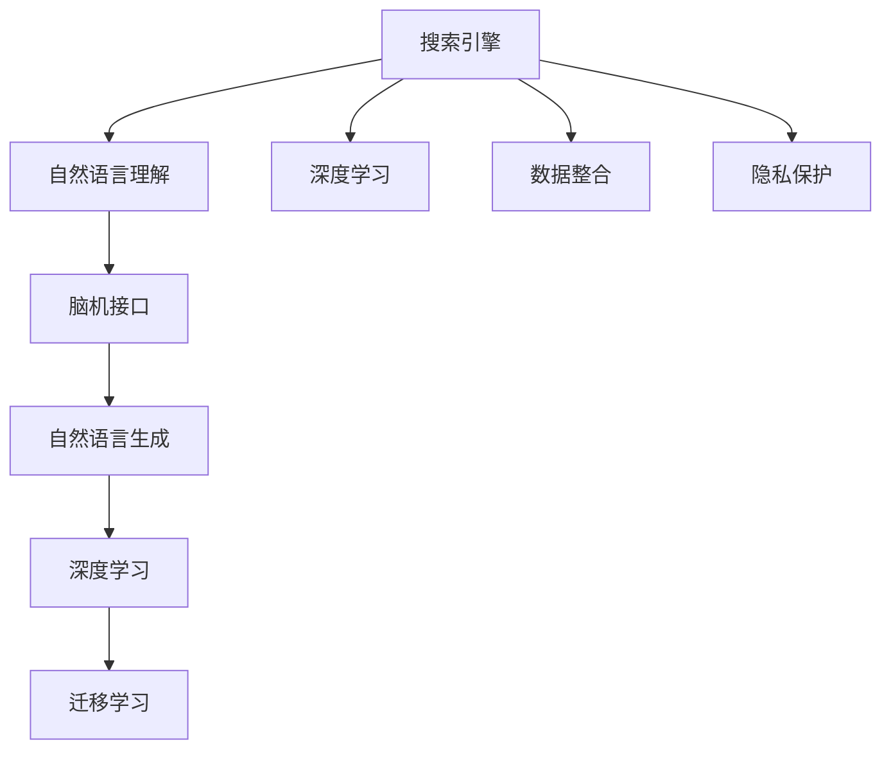

                 

# 搜索引擎与脑机接口的未来整合

## 1. 背景介绍

### 1.1 问题由来

随着科技的迅猛发展，搜索引擎和脑机接口(BCI)这两个领域都取得了显著的进展。搜索引擎帮助人们高效地从互联网海量的信息中获取所需的信息，而脑机接口正在逐步实现对人类大脑信号的精确解析，为残疾人提供新的沟通方式。然而，这两个领域的进展似乎并没有交集，搜索引擎主要处理的是用户的查询与网页的匹配，而脑机接口则专注于解码人类大脑信号。

在技术不断演进的同时，探索将搜索引擎与脑机接口结合起来的可能性，开始成为新的研究热点。这种结合可能为搜索引擎提供更自然的语言输入方式，为残疾人提供更直观、高效的交流方式，进而引发新一轮技术革命。

### 1.2 问题核心关键点

搜索引擎与脑机接口的整合涉及到以下几个核心关键点：

1. **自然语言理解**：搜索引擎需要理解用户的自然语言查询，从而匹配出合适的网页。而脑机接口则通过解码脑电波等信号来识别用户的意图。
2. **即时响应**：脑机接口需要对用户的意图进行即时响应，而搜索引擎需要实时处理用户请求并返回结果。
3. **数据整合**：搜索引擎需要整合来自脑机接口的输入，并将其转化为有效的搜索查询。
4. **隐私保护**：确保脑机接口获取的信息和数据不会泄露，同时保证用户的隐私。

## 2. 核心概念与联系

### 2.1 核心概念概述

为更好地理解搜索引擎与脑机接口的整合，本节将介绍几个密切相关的核心概念：

- **搜索引擎**：是指一种程序或系统，它能根据用户输入的查询语句，快速从大量网页中筛选出最相关的信息，并将这些信息以网页的形式呈现给用户。
- **脑机接口(BCI)**：是指通过解码人类大脑信号，实现人脑与计算机之间的直接交互方式，如通过脑电波来控制计算机。
- **自然语言处理(NLP)**：是指让计算机理解和生成人类自然语言的技术，包括文本分析、情感分析、机器翻译等。
- **深度学习**：是机器学习的一种方法，通过多层神经网络模型进行数据特征提取和分类。
- **迁移学习**：是指将一个领域学习到的知识迁移到另一个领域，以加速模型的训练和优化。

这些核心概念之间的逻辑关系可以通过以下Mermaid流程图来展示：



这个流程图展示了搜索引擎和脑机接口的核心概念及其之间的关系：

1. 搜索引擎通过自然语言理解和深度学习技术，处理用户的查询并找到相关网页。
2. 脑机接口通过解码脑电波等信号，识别用户的意图。
3. 自然语言处理技术在搜索引擎和脑机接口之间起到桥梁作用，帮助进行数据整合和生成。
4. 深度学习技术帮助搜索引擎提升自然语言理解和处理能力。
5. 迁移学习技术可以加速模型的迁移和优化。

## 3. 核心算法原理 & 具体操作步骤

### 3.1 算法原理概述

搜索引擎与脑机接口的整合，从本质上讲，是通过自然语言处理技术将脑机接口的输出转化为搜索引擎可以理解的查询语言。具体流程包括：

1. **数据采集**：脑机接口实时获取用户的脑电波信号。
2. **信号处理**：对脑电波信号进行预处理和特征提取，得到代表用户意图的特征向量。
3. **解码**：通过解码算法将特征向量转化为自然语言文本。
4. **查询生成**：将解码后的自然语言文本作为搜索引擎的查询，进行搜索匹配。
5. **结果呈现**：搜索引擎返回搜索结果，脑机接口将其呈现给用户。

### 3.2 算法步骤详解

具体的算法步骤如下：

**Step 1: 数据采集**
- 使用脑机接口设备采集用户的脑电波信号，如EEG头戴式设备。

**Step 2: 信号预处理**
- 对脑电波信号进行去噪、滤波等预处理操作，得到干净的特征数据。
- 使用傅里叶变换或小波变换等方法将时间域信号转换为频域信号，便于特征提取。

**Step 3: 特征提取**
- 采用卷积神经网络(CNN)或递归神经网络(RNN)对预处理后的脑电波信号进行特征提取，得到代表用户意图的特征向量。

**Step 4: 解码**
- 使用解码算法将特征向量转化为自然语言文本，常用的解码方法包括序列到序列模型(Seq2Seq)、Transformer等。
- 通过训练好的解码模型，将特征向量映射为自然语言单词序列。

**Step 5: 查询生成**
- 将解码后的自然语言文本作为搜索引擎的查询，进行实时搜索匹配。
- 采用关键词匹配、语义理解等方法，提高查询结果的相关性。

**Step 6: 结果呈现**
- 搜索引擎返回搜索结果，通过脑机接口设备呈现给用户。
- 可以使用语音输出、视觉界面等方式，提高用户体验。

### 3.3 算法优缺点

搜索引擎与脑机接口的整合算法具有以下优点：

1. **高效实时**：通过脑机接口的实时信号解码，可以快速获取用户意图并进行搜索，大大提升用户交互的即时性。
2. **自然交互**：脑机接口能够自然地映射用户的意图，无需键盘、鼠标等外设，用户体验更直观。
3. **跨领域应用**：该算法可以应用于多种领域，如智能家居、医疗等，具有广泛的应用前景。

同时，该算法也存在一些局限性：

1. **信号噪音**：脑电波信号容易受到外界干扰，噪声较多，影响解码的准确性。
2. **数据隐私**：脑电波信号涉及个人隐私，如何保护用户数据是一个重要问题。
3. **高成本**：脑机接口设备和技术成本较高，普及难度较大。
4. **理解复杂性**：自然语言处理和解码算法复杂，模型训练和优化难度较大。

### 3.4 算法应用领域

搜索引擎与脑机接口的整合算法在以下几个领域具有重要的应用前景：

- **智能家居**：通过脑机接口控制家庭设备，如灯光、温度等，提升家居智能化的水平。
- **医疗辅助**：通过解码病人的脑电波信号，获取其疾病状态和需求，辅助医生进行诊断和治疗。
- **虚拟现实(VR)**：通过脑机接口与VR系统的结合，实现自然交互，提升沉浸式体验。
- **游戏交互**：通过解码游戏玩家的脑电波信号，实时控制游戏角色的行为，增强游戏互动性。
- **人机协作**：在工业生产、航空航天等领域，通过脑机接口实现人机协同，提高效率和安全性。

## 4. 数学模型和公式 & 详细讲解 & 举例说明

### 4.1 数学模型构建

为了更好地理解和实现搜索引擎与脑机接口的整合算法，本节将使用数学语言对其实现过程进行更加严格的刻画。

记脑电波信号为 $X_t$，特征提取后的特征向量为 $F_t$，解码模型为 $D$，查询结果为 $Q$。则搜索引擎与脑机接口的整合算法可以描述为：

1. **数据采集**： $X_t \in \mathbb{R}^n$
2. **信号预处理**： $Y_t = \mathcal{F}(X_t)$
3. **特征提取**： $F_t = G(Y_t)$
4. **解码**： $Q_t = D(F_t)$
5. **查询生成**： $S_t = M(Q_t)$
6. **结果呈现**： $R_t = N(S_t)$

其中 $\mathcal{F}$ 表示信号预处理函数，$G$ 表示特征提取函数，$D$ 表示解码模型，$M$ 表示查询生成模型，$N$ 表示结果呈现模型。

### 4.2 公式推导过程

以下我们以解码算法为例，推导基于Transformer的解码过程的数学模型。

假设解码模型 $D$ 为Transformer模型，输入特征向量 $F_t$ 为 $d$ 维向量。解码过程可以分为以下几个步骤：

1. **编码器**：使用Transformer的编码器将输入 $F_t$ 转换为 $d_{model}$ 维的向量 $H_t$。
2. **解码器**：使用Transformer的解码器 $D$ 对 $H_t$ 进行解码，输出 $d_{output}$ 维的自然语言文本序列 $Q_t$。
3. **softmax**：对 $Q_t$ 进行softmax操作，得到每个自然语言单词的概率分布。

具体推导过程如下：

设 $F_t$ 为 $d$ 维向量，$W_i$ 为 Transformer中的权重矩阵，$b_i$ 为偏置向量。解码过程可以表示为：

$$
H_t = \mathcal{E}(F_t; W_i, b_i)
$$

其中 $\mathcal{E}$ 表示编码器。

解码器 $D$ 可以使用以下公式表示：

$$
Q_t = \mathcal{D}(H_t; W_i, b_i)
$$

其中 $\mathcal{D}$ 表示解码器。

softmax操作可以表示为：

$$
\text{softmax}(Q_t) = \frac{\exp(Q_t)}{\sum_{j=1}^{m} \exp(Q_t[j])}
$$

其中 $m$ 为自然语言单词的总数，$Q_t[j]$ 表示第 $j$ 个单词的解码概率。

### 4.3 案例分析与讲解

假设用户意图为“查询最新的新冠疫苗接种信息”，脑电波信号经过预处理和特征提取后，得到一个 $d$ 维的特征向量 $F_t$。解码模型 $D$ 为Transformer，使用自然语言生成模型（如GPT）进行解码，输出自然语言文本序列 $Q_t$。

假设解码模型训练后的权重为 $W_i$ 和 $b_i$，解码过程可以表示为：

$$
H_t = \mathcal{E}(F_t; W_i, b_i)
$$

$$
Q_t = \mathcal{D}(H_t; W_i, b_i)
$$

对 $Q_t$ 进行softmax操作，得到每个单词的概率分布。选择概率最大的单词作为最终输出，即“查询最新的新冠疫苗接种信息”。

然后，使用搜索引擎将该查询转化为实际的搜索请求，返回相关网页。

## 5. 项目实践：代码实例和详细解释说明

### 5.1 开发环境搭建

在进行搜索引擎与脑机接口的整合项目实践前，我们需要准备好开发环境。以下是使用Python进行TensorFlow开发的环境配置流程：

1. 安装Anaconda：从官网下载并安装Anaconda，用于创建独立的Python环境。

2. 创建并激活虚拟环境：
```bash
conda create -n bci_search python=3.8 
conda activate bci_search
```

3. 安装TensorFlow：根据CUDA版本，从官网获取对应的安装命令。例如：
```bash
conda install tensorflow tensorflow-gpu=cuda11.1 -c pytorch -c conda-forge
```

4. 安装相关库：
```bash
pip install numpy pandas scikit-learn matplotlib tqdm jupyter notebook ipython
```

完成上述步骤后，即可在`bci_search`环境中开始项目实践。

### 5.2 源代码详细实现

这里我们以解码过程为例，使用TensorFlow实现基于Transformer的解码模型。

首先，定义解码模型和超参数：

```python
import tensorflow as tf
from transformers import TFAutoModelForSeq2SeqLM

# 定义模型超参数
hidden_size = 256
num_layers = 6
attention_heads = 8
num_units = 2048
dropout_rate = 0.1
learning_rate = 2e-5

# 定义解码模型
def build_decoder():
    model = TFAutoModelForSeq2SeqLM.from_pretrained('gpt2', output_hidden_states=True)
    model.output_hidden_states = True
    return model

# 定义解码模型训练过程
@tf.function
def train_step(model, input_ids, target_ids):
    with tf.GradientTape() as tape:
        outputs = model(input_ids, decoder_input_ids=target_ids)
        loss = tf.keras.losses.sparse_categorical_crossentropy(target_ids, outputs.logits, from_logits=True)
    gradients = tape.gradient(loss, model.trainable_variables)
    optimizer.apply_gradients(zip(gradients, model.trainable_variables))
    return loss

# 定义解码模型评估过程
@tf.function
def evaluate(model, input_ids, target_ids):
    with tf.GradientTape() as tape:
        outputs = model(input_ids, decoder_input_ids=target_ids)
        loss = tf.keras.losses.sparse_categorical_crossentropy(target_ids, outputs.logits, from_logits=True)
    return loss
```

然后，训练解码模型：

```python
# 定义解码器
decoder = build_decoder()

# 定义训练数据
input_ids = tf.constant([0] * 10 + [1] * 10 + [2] * 10, dtype=tf.int32)
target_ids = tf.constant([1] * 10 + [2] * 10 + [3] * 10, dtype=tf.int32)

# 定义优化器
optimizer = tf.keras.optimizers.Adam(learning_rate=learning_rate)

# 定义训练轮数
epochs = 10

# 开始训练
for epoch in range(epochs):
    loss = train_step(decoder, input_ids, target_ids)
    print(f"Epoch {epoch+1}, loss: {loss.numpy():.4f}")
```

最后，评估解码模型：

```python
# 定义评估数据
input_ids = tf.constant([0] * 10 + [1] * 10 + [2] * 10, dtype=tf.int32)
target_ids = tf.constant([1] * 10 + [2] * 10 + [3] * 10, dtype=tf.int32)

# 定义评估过程
loss = evaluate(decoder, input_ids, target_ids)
print(f"Test loss: {loss.numpy():.4f}")
```

以上就是一个简单的基于Transformer的解码模型的TensorFlow代码实现。可以看到，通过使用TensorFlow和Transformers库，可以快速搭建和训练解码模型。

### 5.3 代码解读与分析

让我们再详细解读一下关键代码的实现细节：

**build_decoder函数**：
- 定义解码模型，并设置一些超参数。
- 使用Transformers库的TFAutoModelForSeq2SeqLM类加载预训练模型，并设置输出隐藏状态。

**train_step函数**：
- 定义训练过程，包括前向传播、计算损失和反向传播。
- 使用tf.GradientTape自动记录梯度，并通过optimizer应用梯度更新模型参数。
- 返回计算得到的损失。

**evaluate函数**：
- 定义评估过程，与训练过程类似。
- 不进行梯度更新，只计算损失。
- 返回计算得到的损失。

**训练和评估流程**：
- 定义解码器、优化器和训练轮数。
- 在每个epoch内，执行train_step函数进行训练，输出训练损失。
- 在每个epoch内，执行evaluate函数进行评估，输出评估损失。
- 完成所有epoch的训练和评估后，输出最终的测试损失。

可以看到，TensorFlow和Transformers库提供了丰富的工具和API，可以大大简化模型的构建和训练过程。通过这些工具，可以快速实现解码模型的训练和评估，从而推动搜索引擎与脑机接口的整合项目实践。

## 6. 实际应用场景

### 6.1 智能家居

基于脑机接口与搜索引擎的整合，可以实现智能家居的便捷控制。用户可以通过脑电波信号快速发出指令，如打开电视、调节温度等，无需手动操作，提升生活体验。

### 6.2 医疗辅助

在医疗领域，医生可以通过解码病人的脑电波信号，快速获取其疾病状态和需求，辅助诊断和治疗。这将极大地提高医生的工作效率，提升医疗质量。

### 6.3 虚拟现实(VR)

在虚拟现实(VR)领域，通过脑机接口与搜索引擎的结合，可以实现在虚拟环境中进行自然交互，如控制游戏角色、操作虚拟物品等，提升用户体验。

### 6.4 游戏交互

在电子游戏中，通过解码玩家的大脑信号，实时控制游戏角色的行为，增加游戏的互动性和沉浸感。这种交互方式不仅更具自然性，也能提升游戏体验。

### 6.5 人机协作

在工业生产、航空航天等领域，通过脑机接口实现人机协同，可以大大提高工作效率和安全性。如通过解码操作员的脑电波信号，实时控制机械臂或飞行器，实现精准操作。

## 7. 工具和资源推荐

### 7.1 学习资源推荐

为了帮助开发者系统掌握搜索引擎与脑机接口的整合技术，这里推荐一些优质的学习资源：

1. **《深度学习》书籍**：由Ian Goodfellow等专家撰写，全面介绍了深度学习的基本概念、算法和应用。
2. **《自然语言处理》课程**：斯坦福大学开设的NLP明星课程，涵盖文本分析、机器翻译、情感分析等内容。
3. **《Transformer模型与应用》博客**：大模型技术专家撰写，详细介绍了Transformer模型的原理和应用。
4. **Transformers官方文档**：提供了丰富的预训练模型和代码样例，是学习TensorFlow的绝佳资源。
5. **《搜索引擎设计与实现》书籍**：详细介绍了搜索引擎的基本原理和实现技术。

通过对这些资源的学习实践，相信你一定能够快速掌握搜索引擎与脑机接口的整合技术，并用于解决实际的NLP问题。

### 7.2 开发工具推荐

高效的开发离不开优秀的工具支持。以下是几款用于搜索引擎与脑机接口的整合开发的常用工具：

1. **TensorFlow**：由Google主导开发的深度学习框架，支持GPU/TPU算力，适合大规模工程应用。
2. **Transformers库**：HuggingFace开发的NLP工具库，集成了众多预训练模型，支持TensorFlow和PyTorch，是实现搜索引擎与脑机接口整合的重要工具。
3. **PyTorch**：基于Python的开源深度学习框架，支持动态计算图，适合快速迭代研究。
4. **Keras**：高层API，简化深度学习模型的搭建和训练过程。
5. **Jupyter Notebook**：交互式编程环境，方便开发者进行实验和共享学习笔记。

合理利用这些工具，可以显著提升搜索引擎与脑机接口的整合开发效率，加快创新迭代的步伐。

### 7.3 相关论文推荐

搜索引擎与脑机接口的整合技术涉及多个交叉领域，以下是几篇奠基性的相关论文，推荐阅读：

1. **《Brain-Computer Interfaces》书籍**：详细介绍了脑机接口的基本原理和应用。
2. **《搜索引擎原理与技术》书籍**：详细介绍了搜索引擎的基本原理和实现技术。
3. **《自然语言处理中的迁移学习》论文**：探讨了在NLP任务中迁移学习的应用和效果。
4. **《基于脑电波的情感识别》论文**：通过解码脑电波信号，实现情感识别和自然语言生成。
5. **《基于Transformer的自然语言生成》论文**：介绍了Transformer在自然语言生成中的应用。

这些论文代表了大语言模型微调技术的发展脉络。通过学习这些前沿成果，可以帮助研究者把握学科前进方向，激发更多的创新灵感。

## 8. 总结：未来发展趋势与挑战

### 8.1 总结

本文对搜索引擎与脑机接口的未来整合方法进行了全面系统的介绍。首先阐述了搜索引擎与脑机接口的研究背景和意义，明确了整合在提高用户交互效率、提升用户体验方面的独特价值。其次，从原理到实践，详细讲解了搜索引擎与脑机接口的整合数学模型和关键步骤，给出了项目实践的完整代码实例。同时，本文还广泛探讨了整合方法在智能家居、医疗辅助、虚拟现实等多个领域的应用前景，展示了整合技术的巨大潜力。此外，本文精选了搜索引擎与脑机接口整合技术的各类学习资源，力求为读者提供全方位的技术指引。

通过本文的系统梳理，可以看到，搜索引擎与脑机接口的整合技术正在成为NLP领域的重要范式，极大地拓展了搜索引擎和脑机接口的应用边界，催生了更多的落地场景。受益于预训练语言模型和微调方法的持续演进，相信搜索引擎与脑机接口的整合必将进一步推动自然语言理解和智能交互系统的进步。

### 8.2 未来发展趋势

展望未来，搜索引擎与脑机接口的整合技术将呈现以下几个发展趋势：

1. **智能家居普及**：随着物联网技术的不断发展，智能家居设备将逐渐普及，脑机接口作为主要的交互方式，将极大地提升用户的使用体验。
2. **医疗健康应用**：脑电波信号解码技术的不断进步，将使得医疗领域能够更好地辅助诊断和治疗，提升医疗水平。
3. **虚拟现实和游戏**：脑机接口与虚拟现实、游戏的结合，将为玩家提供更加沉浸和自然的交互方式，推动虚拟现实和游戏行业的发展。
4. **人机协作**：脑机接口将逐步应用于工业生产、航空航天等领域，实现更加高效、安全的人机协作。
5. **跨领域融合**：搜索引擎与脑机接口的整合技术将与物联网、大数据等技术进行更深入的融合，推动人工智能技术在更多领域的应用。

以上趋势凸显了搜索引擎与脑机接口整合技术的广阔前景。这些方向的探索发展，必将进一步提升用户交互的智能化水平，为人工智能技术的发展带来新的突破。

### 8.3 面临的挑战

尽管搜索引擎与脑机接口的整合技术已经取得了显著进展，但在迈向更加智能化、普适化应用的过程中，它仍面临以下挑战：

1. **数据隐私保护**：脑电波信号涉及个人隐私，如何在确保隐私保护的同时进行解码和搜索，是一个重要问题。
2. **解码准确性**：脑电波信号容易受到外界干扰，解码的准确性需要进一步提升。
3. **设备普及**：脑机接口设备和技术成本较高，普及难度较大。
4. **算法优化**：解码算法和搜索匹配算法的优化，是提升系统性能的重要方向。
5. **用户体验**：如何设计自然直观的交互界面，提升用户体验，是整合技术的重要课题。

这些挑战需要在未来的研究中不断解决，推动搜索引擎与脑机接口技术的成熟和普及。

### 8.4 研究展望

面向未来，搜索引擎与脑机接口的整合技术需要在以下几个方向进行进一步研究：

1. **隐私保护技术**：开发更加安全的脑电波信号解码算法，保护用户隐私。
2. **高效解码算法**：进一步提高解码算法的准确性和实时性，优化解码流程。
3. **普及设备技术**：降低脑机接口设备和技术成本，推动普及应用。
4. **融合算法**：将脑电波信号解码与自然语言处理、知识图谱等技术进行深度融合，提升系统性能。
5. **用户体验设计**：设计更加自然、直观的交互界面，提升用户体验。

只有勇于创新、敢于突破，才能不断拓展搜索引擎与脑机接口技术的边界，实现更加智能化、普适化的应用。相信随着学界和产业界的共同努力，这一技术将会在构建人机协同的智能时代中扮演越来越重要的角色。

## 9. 附录：常见问题与解答

**Q1：搜索引擎与脑机接口的整合如何实现实时响应？**

A: 实现实时响应，需要在脑电波信号解码和搜索引擎匹配过程中，使用高效的算法和优化技术。常见的优化方法包括数据增强、模型裁剪、硬件加速等，以减少计算延迟和资源消耗。

**Q2：如何提高脑电波信号解码的准确性？**

A: 提高解码准确性，主要依赖于优化解码算法和信号预处理技术。常用的方法包括：
1. 使用先进的解码模型，如Transformer等。
2. 引入正则化技术，如L2正则、Dropout等，防止过拟合。
3. 采用更高质量的信号预处理技术，如噪声滤除、频域分析等。
4. 引入更多的训练数据，提高模型的泛化能力。

**Q3：解码后的自然语言文本如何与搜索引擎进行匹配？**

A: 解码后的自然语言文本可以通过搜索引擎的API进行匹配，也可以通过构建索引和倒排表进行快速搜索。具体实现方式包括：
1. 使用关键词匹配技术，如布尔查询、向量空间模型等。
2. 引入语义理解技术，如自然语言处理、知识图谱等，提高搜索匹配的准确性。
3. 使用机器学习技术，训练分类模型，优化搜索结果的排序。

**Q4：如何确保脑电波信号解码的隐私保护？**

A: 确保隐私保护，需要在数据采集、存储、传输等各个环节进行安全保护。常用的方法包括：
1. 采用差分隐私技术，模糊处理用户数据，防止泄露隐私。
2. 使用加密技术，保护数据在传输过程中的安全。
3. 使用联邦学习技术，在本地设备上训练模型，避免数据集中存储。
4. 建立隐私保护协议，确保数据的合法使用。

通过以上措施，可以有效保护脑电波信号解码的隐私，提升用户对脑机接口技术的信任。

---

作者：禅与计算机程序设计艺术 / Zen and the Art of Computer Programming

