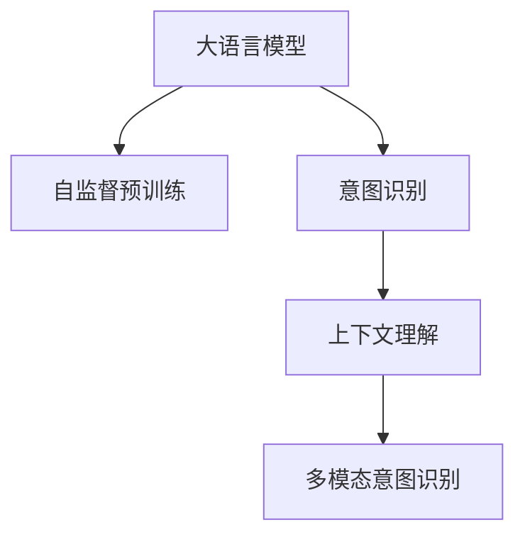

                 

## 1. 背景介绍

### 1.1 问题由来

随着搜索引擎和智能对话系统的不断进化，理解和满足用户搜索意图（Search Intent）成为了至关重要的任务。用户的搜索意图不仅包括对具体信息的查询，还可能包含求助、建议、评论等不同形式。搜索引擎和聊天机器人必须能够准确识别并响应用户的意图，从而提供最相关、最有帮助的结果。

然而，目前广泛使用的基于规则和关键词匹配的方法，在复杂多变的真实查询中表现不佳。为了更精准地识别用户意图，深度学习技术应运而生。特别是，预训练的大语言模型在处理自然语言理解和生成方面表现出色，逐渐成为意图识别的有力工具。

### 1.2 问题核心关键点

意图识别核心在于：
- 通过自然语言处理(NLP)技术，理解用户输入的自然语言文本。
- 从文本中提取关键信息，如关键词、实体、关系等。
- 结合上下文信息，推理出用户意图。
- 对不同查询进行分类，确定最匹配的意图类型。

**目标**：
- 快速识别用户意图，提升搜索和对话系统效率。
- 减少对规则和人工设计的依赖，提升系统的灵活性。
- 提升用户体验，提供更精准的搜索结果和对话内容。

## 2. 核心概念与联系

### 2.1 核心概念概述

为更好地理解基于大模型的意图识别方法，本节将介绍几个密切相关的核心概念：

- 大语言模型(Large Language Model, LLM)：如BERT、GPT等，通过大规模无标签文本预训练学习通用的语言表示。
- 自监督预训练：在无标签数据上进行预训练，学习语言的知识表示，为意图识别提供基础能力。
- 意图识别(Intent Recognition)：识别和分类用户输入的自然语言文本，确定其意图。
- 上下文理解(Contextual Understanding)：在处理自然语言时，考虑上下文信息，理解句子意义。
- 多模态意图识别(Multi-modal Intent Recognition)：结合文本和多媒体数据，提升意图识别准确率。

这些概念之间的逻辑关系可以通过以下Mermaid流程图来展示：



这个流程图展示了意图识别的核心概念及其之间的关系：

1. 大语言模型通过自监督预训练获得语言知识，为意图识别提供基础。
2. 意图识别通过理解输入文本，提取关键信息，推理用户意图。
3. 上下文理解结合文本前后文，提升意图识别的准确率。
4. 多模态意图识别结合文本和多媒体数据，提升识别效果。

## 3. 核心算法原理 & 具体操作步骤

### 3.1 算法原理概述

意图识别本质上是一个序列标注问题，通过标注每个词的意图标签，使得模型能够理解整个句子的意图。核心思想是：将自然语言处理任务映射为序列标注问题，利用序列标注模型学习输入文本的意图标签序列。

假设输入文本为 $X = (x_1, x_2, ..., x_n)$，对应的意图标签序列为 $Y = (y_1, y_2, ..., y_n)$，其中 $y_i \in \{I_1, I_2, ..., I_m\}$，$I_i$ 表示意图类型。意图识别模型的目标是最小化预测序列与真实标签序列之间的交叉熵损失，即：

$$
\min_{\theta} -\frac{1}{N} \sum_{i=1}^N \sum_{j=1}^n \ell(p(y_i|x_i), y_i)
$$

其中，$\theta$ 为模型参数，$\ell$ 为交叉熵损失函数。

### 3.2 算法步骤详解

基于大模型的意图识别一般包括以下关键步骤：

**Step 1: 准备预训练模型和数据集**
- 选择合适的预训练语言模型 $M_{\theta}$ 作为初始化参数，如 BERT、GPT等。
- 准备标注数据集 $D=\{(x_i, y_i)\}_{i=1}^N$，其中 $x_i$ 为自然语言文本，$y_i$ 为意图标签序列。

**Step 2: 添加意图标注层**
- 设计合适的模型架构，将输入文本编码为嵌入向量，进行上下文理解。
- 对嵌入向量序列进行分类，输出意图标签序列。
- 选择适合的损失函数，如交叉熵损失、Focal Loss等。

**Step 3: 设置训练超参数**
- 选择合适的优化器及其参数，如 AdamW、SGD等，设置学习率、批大小、迭代轮数等。
- 设置正则化技术及强度，包括权重衰减、Dropout、Early Stopping等。

**Step 4: 执行序列标注训练**
- 将训练集数据分批次输入模型，前向传播计算损失函数。
- 反向传播计算参数梯度，根据设定的优化算法和学习率更新模型参数。
- 周期性在验证集上评估模型性能，根据性能指标决定是否触发 Early Stopping。
- 重复上述步骤直到满足预设的迭代轮数或 Early Stopping 条件。

**Step 5: 测试和部署**
- 在测试集上评估意图识别模型 $M_{\hat{\theta}}$ 的性能，对比微调前后的精度提升。
- 使用模型对新样本进行推理预测，集成到实际的应用系统中。
- 持续收集新的数据，定期重新微调模型，以适应数据分布的变化。

以上是基于大模型进行意图识别的一般流程。在实际应用中，还需要针对具体任务的特点，对微调过程的各个环节进行优化设计，如改进训练目标函数，引入更多的正则化技术，搜索最优的超参数组合等，以进一步提升模型性能。

### 3.3 算法优缺点

基于大模型的意图识别方法具有以下优点：
1. 简单高效。只需要准备少量标注数据，即可对预训练模型进行快速适配，获得较大的性能提升。
2. 通用适用。适用于各种意图识别任务，如搜索查询、智能对话、客服聊天等，设计合适的意图标注层即可实现意图识别。
3. 参数高效。利用参数高效微调技术，在固定大部分预训练参数的情况下，仍可取得不错的识别效果。
4. 效果显著。在学术界和工业界的诸多任务上，基于意图识别的微调方法已经刷新了最先进的性能指标。

同时，该方法也存在一定的局限性：
1. 依赖标注数据。意图识别的效果很大程度上取决于标注数据的质量和数量，获取高质量标注数据的成本较高。
2. 迁移能力有限。当目标任务与预训练数据的分布差异较大时，意图识别的性能提升有限。
3. 对抗样本敏感。大模型的固有鲁棒性问题可能会影响意图识别的准确性。
4. 可解释性不足。意图识别模型的决策过程通常缺乏可解释性，难以对其推理逻辑进行分析和调试。

尽管存在这些局限性，但就目前而言，基于大模型的意图识别方法仍是最主流范式。未来相关研究的重点在于如何进一步降低意图识别对标注数据的依赖，提高模型的少样本学习和跨领域迁移能力，同时兼顾可解释性和伦理安全性等因素。

### 3.4 算法应用领域

基于大模型意图识别的监督学习方法，在NLP领域已经得到了广泛的应用，覆盖了几乎所有常见任务，例如：

- 搜索查询意图识别：对用户输入的搜索查询进行意图分类，如信息查询、问题解答、购买等。
- 智能客服对话意图识别：对客户输入的对话文本进行意图分类，如问题咨询、订单查询、反馈投诉等。
- 智能推荐意图识别：对用户输入的推荐请求进行意图分类，如推荐商品、查看评价、设置偏好等。
- 金融风险意图识别：对用户输入的金融查询进行意图分类，如账户咨询、交易记录、投诉举报等。

除了上述这些经典任务外，意图识别技术也被创新性地应用到更多场景中，如情感分析、舆情监测、健康咨询等，为NLP技术带来了全新的突破。随着预训练模型和意图识别方法的不断进步，相信意图识别技术将在更广阔的应用领域大放异彩。

## 4. 数学模型和公式 & 详细讲解 & 举例说明

### 4.1 数学模型构建

假设输入文本为 $X = (x_1, x_2, ..., x_n)$，对应的意图标签序列为 $Y = (y_1, y_2, ..., y_n)$，其中 $y_i \in \{I_1, I_2, ..., I_m\}$，$I_i$ 表示意图类型。意图识别模型的目标是最小化预测序列与真实标签序列之间的交叉熵损失，即：

$$
\min_{\theta} -\frac{1}{N} \sum_{i=1}^N \sum_{j=1}^n \ell(p(y_i|x_i), y_i)
$$

其中，$\theta$ 为模型参数，$\ell$ 为交叉熵损失函数。

### 4.2 公式推导过程

以BERT为代表的大语言模型，通过将输入文本转化为词嵌入向量，进行序列标注任务。假设模型对输入文本 $x_i$ 的嵌入向量表示为 $E_{x_i}$，对应的意图标签 $y_i$ 的概率分布为 $P(y_i|x_i)$。交叉熵损失函数为：

$$
\ell(p(y_i|x_i), y_i) = -\sum_{i=1}^m p(y_i|x_i) \log q(y_i|x_i)
$$

其中，$q(y_i|x_i)$ 为模型预测的意图标签分布，$p(y_i|x_i)$ 为真实意图标签分布。

结合上下文信息，通过双向Transformer编码器 $E_{x_i} = E_{x_i}^{\text{left}} + E_{x_i}^{\text{right}}$ 进行编码，得到上下文嵌入向量 $E_{x_i}^{\text{context}}$。模型输出层的输出为 $S_i = \text{softmax}(W E_{x_i}^{\text{context}})$，其中 $W$ 为可训练的线性变换矩阵。

### 4.3 案例分析与讲解

以下以BERT模型为例，进行意图识别任务的数学推导：

1. 预训练BERT模型对输入文本 $x_i$ 进行编码，得到嵌入向量序列 $E_{x_i}$。
2. 对嵌入向量序列进行分类，得到意图标签序列 $Y$ 的概率分布 $P(Y|x_i)$。
3. 计算交叉熵损失，回传梯度更新模型参数 $\theta$。
4. 重复步骤2-3，直至模型收敛。

具体而言，假设输入文本为 "I want to buy a laptop"，模型预测的意图标签为 "buy"。根据上述公式，计算损失函数：

$$
\ell(p(y_i|x_i), y_i) = -p(buy|I want to buy a laptop) \log q(buy|I want to buy a laptop)
$$

利用训练数据和交叉熵损失，不断调整模型参数，最终得到最优意图识别模型。

## 5. 项目实践：代码实例和详细解释说明

### 5.1 开发环境搭建

在进行意图识别实践前，我们需要准备好开发环境。以下是使用Python进行PyTorch开发的环境配置流程：

1. 安装Anaconda：从官网下载并安装Anaconda，用于创建独立的Python环境。

2. 创建并激活虚拟环境：
```bash
conda create -n pytorch-env python=3.8 
conda activate pytorch-env
```

3. 安装PyTorch：根据CUDA版本，从官网获取对应的安装命令。例如：
```bash
conda install pytorch torchvision torchaudio cudatoolkit=11.1 -c pytorch -c conda-forge
```

4. 安装Transformers库：
```bash
pip install transformers
```

5. 安装各类工具包：
```bash
pip install numpy pandas scikit-learn matplotlib tqdm jupyter notebook ipython
```

完成上述步骤后，即可在`pytorch-env`环境中开始意图识别实践。

### 5.2 源代码详细实现

下面我们以命名实体识别(NER)任务为例，给出使用Transformers库对BERT模型进行意图识别的PyTorch代码实现。

首先，定义意图识别任务的数据处理函数：

```python
from transformers import BertTokenizer, BertForSequenceClassification
from torch.utils.data import Dataset
import torch

class IntentDataset(Dataset):
    def __init__(self, texts, intents, tokenizer, max_len=128):
        self.texts = texts
        self.intents = intents
        self.tokenizer = tokenizer
        self.max_len = max_len
        
    def __len__(self):
        return len(self.texts)
    
    def __getitem__(self, item):
        text = self.texts[item]
        intent = self.intents[item]
        
        encoding = self.tokenizer(text, return_tensors='pt', max_length=self.max_len, padding='max_length', truncation=True)
        input_ids = encoding['input_ids'][0]
        attention_mask = encoding['attention_mask'][0]
        
        # 对意图标签进行编码
        encoded_intent = [intent2id[intent] for intent in intent]
        encoded_intent.extend([intent2id['O']] * (self.max_len - len(encoded_intent)))
        labels = torch.tensor(encoded_intent, dtype=torch.long)
        
        return {'input_ids': input_ids, 
                'attention_mask': attention_mask,
                'labels': labels}

# 意图标签与id的映射
intent2id = {'buy': 0, 'sell': 1, 'ask': 2, 'complain': 3, 'consult': 4}
id2intent = {v: k for k, v in intent2id.items()}

# 创建dataset
tokenizer = BertTokenizer.from_pretrained('bert-base-cased')

train_dataset = IntentDataset(train_texts, train_intents, tokenizer)
dev_dataset = IntentDataset(dev_texts, dev_intents, tokenizer)
test_dataset = IntentDataset(test_texts, test_intents, tokenizer)
```

然后，定义模型和优化器：

```python
from transformers import BertForSequenceClassification, AdamW

model = BertForSequenceClassification.from_pretrained('bert-base-cased', num_labels=len(intent2id))

optimizer = AdamW(model.parameters(), lr=2e-5)
```

接着，定义训练和评估函数：

```python
from torch.utils.data import DataLoader
from tqdm import tqdm
from sklearn.metrics import classification_report

device = torch.device('cuda') if torch.cuda.is_available() else torch.device('cpu')
model.to(device)

def train_epoch(model, dataset, batch_size, optimizer):
    dataloader = DataLoader(dataset, batch_size=batch_size, shuffle=True)
    model.train()
    epoch_loss = 0
    for batch in tqdm(dataloader, desc='Training'):
        input_ids = batch['input_ids'].to(device)
        attention_mask = batch['attention_mask'].to(device)
        labels = batch['labels'].to(device)
        model.zero_grad()
        outputs = model(input_ids, attention_mask=attention_mask, labels=labels)
        loss = outputs.loss
        epoch_loss += loss.item()
        loss.backward()
        optimizer.step()
    return epoch_loss / len(dataloader)

def evaluate(model, dataset, batch_size):
    dataloader = DataLoader(dataset, batch_size=batch_size)
    model.eval()
    preds, labels = [], []
    with torch.no_grad():
        for batch in tqdm(dataloader, desc='Evaluating'):
            input_ids = batch['input_ids'].to(device)
            attention_mask = batch['attention_mask'].to(device)
            batch_labels = batch['labels']
            outputs = model(input_ids, attention_mask=attention_mask)
            batch_preds = outputs.logits.argmax(dim=2).to('cpu').tolist()
            batch_labels = batch_labels.to('cpu').tolist()
            for pred_tokens, label_tokens in zip(batch_preds, batch_labels):
                pred_intents = [id2intent[_id] for _id in pred_tokens]
                label_intents = [id2intent[_id] for _id in label_tokens]
                preds.append(pred_intents[:len(label_intents)])
                labels.append(label_intents)
                
    print(classification_report(labels, preds))
```

最后，启动训练流程并在测试集上评估：

```python
epochs = 5
batch_size = 16

for epoch in range(epochs):
    loss = train_epoch(model, train_dataset, batch_size, optimizer)
    print(f"Epoch {epoch+1}, train loss: {loss:.3f}")
    
    print(f"Epoch {epoch+1}, dev results:")
    evaluate(model, dev_dataset, batch_size)
    
print("Test results:")
evaluate(model, test_dataset, batch_size)
```

以上就是使用PyTorch对BERT进行意图识别任务微调的完整代码实现。可以看到，得益于Transformers库的强大封装，我们可以用相对简洁的代码完成BERT模型的加载和微调。

### 5.3 代码解读与分析

让我们再详细解读一下关键代码的实现细节：

**IntentDataset类**：
- `__init__`方法：初始化文本、意图、分词器等关键组件。
- `__len__`方法：返回数据集的样本数量。
- `__getitem__`方法：对单个样本进行处理，将文本输入编码为token ids，将意图标签编码为数字，并对其进行定长padding，最终返回模型所需的输入。

**intent2id和id2intent字典**：
- 定义了意图标签与数字id之间的映射关系，用于将token-wise的预测结果解码回真实的意图标签。

**训练和评估函数**：
- 使用PyTorch的DataLoader对数据集进行批次化加载，供模型训练和推理使用。
- 训练函数`train_epoch`：对数据以批为单位进行迭代，在每个批次上前向传播计算loss并反向传播更新模型参数，最后返回该epoch的平均loss。
- 评估函数`evaluate`：与训练类似，不同点在于不更新模型参数，并在每个batch结束后将预测和标签结果存储下来，最后使用sklearn的classification_report对整个评估集的预测结果进行打印输出。

**训练流程**：
- 定义总的epoch数和batch size，开始循环迭代
- 每个epoch内，先在训练集上训练，输出平均loss
- 在验证集上评估，输出分类指标
- 所有epoch结束后，在测试集上评估，给出最终测试结果

可以看到，PyTorch配合Transformers库使得BERT微调的代码实现变得简洁高效。开发者可以将更多精力放在数据处理、模型改进等高层逻辑上，而不必过多关注底层的实现细节。

当然，工业级的系统实现还需考虑更多因素，如模型的保存和部署、超参数的自动搜索、更灵活的任务适配层等。但核心的微调范式基本与此类似。

## 6. 实际应用场景
### 6.1 智能客服系统

基于大语言模型意图识别的对话技术，可以广泛应用于智能客服系统的构建。传统客服往往需要配备大量人力，高峰期响应缓慢，且一致性和专业性难以保证。而使用意图识别对话模型，可以7x24小时不间断服务，快速响应客户咨询，用自然流畅的语言解答各类常见问题。

在技术实现上，可以收集企业内部的历史客服对话记录，将问题和最佳答复构建成监督数据，在此基础上对预训练对话模型进行意图识别微调。微调后的对话模型能够自动理解用户意图，匹配最合适的答案模板进行回复。对于客户提出的新问题，还可以接入检索系统实时搜索相关内容，动态组织生成回答。如此构建的智能客服系统，能大幅提升客户咨询体验和问题解决效率。

### 6.2 金融舆情监测

金融机构需要实时监测市场舆论动向，以便及时应对负面信息传播，规避金融风险。传统的人工监测方式成本高、效率低，难以应对网络时代海量信息爆发的挑战。基于大语言模型意图识别的文本分类和情感分析技术，为金融舆情监测提供了新的解决方案。

具体而言，可以收集金融领域相关的新闻、报道、评论等文本数据，并对其进行主题标注和情感标注。在此基础上对预训练语言模型进行意图识别微调，使其能够自动判断文本属于何种主题，情感倾向是正面、中性还是负面。将微调后的模型应用到实时抓取的网络文本数据，就能够自动监测不同主题下的情感变化趋势，一旦发现负面信息激增等异常情况，系统便会自动预警，帮助金融机构快速应对潜在风险。

### 6.3 个性化推荐系统

当前的推荐系统往往只依赖用户的历史行为数据进行物品推荐，无法深入理解用户的真实兴趣偏好。基于大语言模型意图识别的个性化推荐系统可以更好地挖掘用户行为背后的语义信息，从而提供更精准、多样的推荐内容。

在实践中，可以收集用户浏览、点击、评论、分享等行为数据，提取和用户交互的物品标题、描述、标签等文本内容。将文本内容作为模型输入，用户的后续行为（如是否点击、购买等）作为监督信号，在此基础上微调预训练语言模型。微调后的模型能够从文本内容中准确把握用户的兴趣点。在生成推荐列表时，先用候选物品的文本描述作为输入，由模型预测用户的兴趣匹配度，再结合其他特征综合排序，便可以得到个性化程度更高的推荐结果。

### 6.4 未来应用展望

随着大语言模型意图识别技术的发展，基于意图识别的对话、推荐、舆情监测等应用将在更多领域得到应用，为NLP技术带来了新的突破。

在智慧医疗领域，基于意图识别的医疗问答、病历分析、药物研发等应用将提升医疗服务的智能化水平，辅助医生诊疗，加速新药开发进程。

在智能教育领域，意图识别技术可应用于作业批改、学情分析、知识推荐等方面，因材施教，促进教育公平，提高教学质量。

在智慧城市治理中，意图识别技术可应用于城市事件监测、舆情分析、应急指挥等环节，提高城市管理的自动化和智能化水平，构建更安全、高效的未来城市。

此外，在企业生产、社会治理、文娱传媒等众多领域，基于大语言模型意图识别的AI应用也将不断涌现，为经济社会发展注入新的动力。相信随着技术的日益成熟，意图识别技术将成为AI落地应用的重要范式，推动AI技术在更广阔的领域加速渗透。

## 7. 工具和资源推荐
### 7.1 学习资源推荐

为了帮助开发者系统掌握大语言模型意图识别的理论基础和实践技巧，这里推荐一些优质的学习资源：

1. 《Transformer从原理到实践》系列博文：由大模型技术专家撰写，深入浅出地介绍了Transformer原理、BERT模型、意图识别技术等前沿话题。

2. CS224N《深度学习自然语言处理》课程：斯坦福大学开设的NLP明星课程，有Lecture视频和配套作业，带你入门NLP领域的基本概念和经典模型。

3. 《Natural Language Processing with Transformers》书籍：Transformers库的作者所著，全面介绍了如何使用Transformers库进行NLP任务开发，包括意图识别在内的诸多范式。

4. HuggingFace官方文档：Transformers库的官方文档，提供了海量预训练模型和完整的意图识别样例代码，是上手实践的必备资料。

5. CLUE开源项目：中文语言理解测评基准，涵盖大量不同类型的中文NLP数据集，并提供了基于意图识别的baseline模型，助力中文NLP技术发展。

通过对这些资源的学习实践，相信你一定能够快速掌握大语言模型意图识别的精髓，并用于解决实际的NLP问题。
###  7.2 开发工具推荐

高效的开发离不开优秀的工具支持。以下是几款用于大语言模型意图识别开发的常用工具：

1. PyTorch：基于Python的开源深度学习框架，灵活动态的计算图，适合快速迭代研究。大部分预训练语言模型都有PyTorch版本的实现。

2. TensorFlow：由Google主导开发的开源深度学习框架，生产部署方便，适合大规模工程应用。同样有丰富的预训练语言模型资源。

3. Transformers库：HuggingFace开发的NLP工具库，集成了众多SOTA语言模型，支持PyTorch和TensorFlow，是进行意图识别任务的开发的利器。

4. Weights & Biases：模型训练的实验跟踪工具，可以记录和可视化模型训练过程中的各项指标，方便对比和调优。与主流深度学习框架无缝集成。

5. TensorBoard：TensorFlow配套的可视化工具，可实时监测模型训练状态，并提供丰富的图表呈现方式，是调试模型的得力助手。

6. Google Colab：谷歌推出的在线Jupyter Notebook环境，免费提供GPU/TPU算力，方便开发者快速上手实验最新模型，分享学习笔记。

合理利用这些工具，可以显著提升大语言模型意图识别的开发效率，加快创新迭代的步伐。

### 7.3 相关论文推荐

大语言模型和意图识别技术的发展源于学界的持续研究。以下是几篇奠基性的相关论文，推荐阅读：

1. Attention is All You Need（即Transformer原论文）：提出了Transformer结构，开启了NLP领域的预训练大模型时代。

2. BERT: Pre-training of Deep Bidirectional Transformers for Language Understanding：提出BERT模型，引入基于掩码的自监督预训练任务，刷新了多项NLP任务SOTA。

3. Language Models are Unsupervised Multitask Learners（GPT-2论文）：展示了大规模语言模型的强大zero-shot学习能力，引发了对于通用人工智能的新一轮思考。

4. Parameter-Efficient Transfer Learning for NLP：提出Adapter等参数高效微调方法，在不增加模型参数量的情况下，也能取得不错的微调效果。

5. Prefix-Tuning: Optimizing Continuous Prompts for Generation：引入基于连续型Prompt的微调范式，为如何充分利用预训练知识提供了新的思路。

6. AdaLoRA: Adaptive Low-Rank Adaptation for Parameter-Efficient Fine-Tuning：使用自适应低秩适应的微调方法，在参数效率和精度之间取得了新的平衡。

这些论文代表了大语言模型意图识别的发展脉络。通过学习这些前沿成果，可以帮助研究者把握学科前进方向，激发更多的创新灵感。

## 8. 总结：未来发展趋势与挑战

### 8.1 总结

本文对基于大模型的意图识别方法进行了全面系统的介绍。首先阐述了意图识别的研究背景和意义，明确了意图识别在提升搜索引擎和智能对话系统效率中的重要价值。其次，从原理到实践，详细讲解了意图识别的数学原理和关键步骤，给出了意图识别任务开发的完整代码实例。同时，本文还广泛探讨了意图识别方法在智能客服、金融舆情、个性化推荐等多个行业领域的应用前景，展示了意图识别技术的巨大潜力。此外，本文精选了意图识别技术的各类学习资源，力求为读者提供全方位的技术指引。

通过本文的系统梳理，可以看到，基于大模型的意图识别技术正在成为NLP领域的重要范式，极大地拓展了预训练语言模型的应用边界，催生了更多的落地场景。受益于大规模语料的预训练，意图识别技术以更低的时间和标注成本，在小样本条件下也能取得不俗的效果，有力推动了NLP技术的产业化进程。未来，伴随预训练语言模型和意图识别方法的不断进步，相信意图识别技术将在更广阔的应用领域大放异彩，深刻影响人类的生产生活方式。

### 8.2 未来发展趋势

展望未来，大语言模型意图识别技术将呈现以下几个发展趋势：

1. 模型规模持续增大。随着算力成本的下降和数据规模的扩张，预训练语言模型的参数量还将持续增长。超大规模语言模型蕴含的丰富语言知识，有望支撑更加复杂多变的意图识别任务。

2. 意图识别方法日趋多样。除了传统的全参数意图识别外，未来会涌现更多参数高效的意图识别方法，如Prefix-Tuning、LoRA等，在节省计算资源的同时也能保证意图识别的精度。

3. 上下文理解能力增强。未来的意图识别模型将更好地利用上下文信息，提升理解多义句和复杂句的能力，进一步提高识别准确率。

4. 多模态意图识别崛起。当前的意图识别主要聚焦于文本数据，未来会进一步拓展到图像、视频、语音等多模态数据意图识别。多模态信息的融合，将显著提升语言模型对现实世界的理解和建模能力。

5. 情感理解和生成能力提升。未来的意图识别技术将更好地理解和生成用户情感，实现更自然、更个性化的对话体验。

6. 零样本和少样本学习能力增强。受启发于提示学习(Prompt-based Learning)的思路，未来的意图识别模型将更好地利用大模型的语言理解能力，通过更加巧妙的任务描述，在更少的标注样本上也能实现理想的意图识别效果。

以上趋势凸显了大语言模型意图识别技术的广阔前景。这些方向的探索发展，必将进一步提升意图识别系统的性能和应用范围，为构建人机协同的智能交互系统铺平道路。

### 8.3 面临的挑战

尽管大语言模型意图识别技术已经取得了瞩目成就，但在迈向更加智能化、普适化应用的过程中，它仍面临着诸多挑战：

1. 标注成本瓶颈。尽管意图识别技术在标注数据需求上较传统方法有所降低，但对于长尾应用场景，获取充足的高质量标注数据，仍然是一个成本高昂的过程。如何进一步降低意图识别对标注数据的依赖，将是一大难题。

2. 意图识别模型的鲁棒性不足。大模型的固有鲁棒性问题可能会影响意图识别的准确性。对于域外数据和对抗样本，模型的泛化性能往往大打折扣。如何提高意图识别模型的鲁棒性，避免灾难性遗忘，还需要更多理论和实践的积累。

3. 推理效率有待提高。大规模语言模型虽然精度高，但在实际部署时往往面临推理速度慢、内存占用大等效率问题。如何在保证性能的同时，简化模型结构，提升推理速度，优化资源占用，将是重要的优化方向。

4. 可解释性亟需加强。意图识别模型的决策过程通常缺乏可解释性，难以对其推理逻辑进行分析和调试。对于医疗、金融等高风险应用，算法的可解释性和可审计性尤为重要。如何赋予意图识别模型更强的可解释性，将是亟待攻克的难题。

5. 安全性有待保障。预训练语言模型难免会学习到有偏见、有害的信息，通过意图识别传递到下游任务，产生误导性、歧视性的输出，给实际应用带来安全隐患。如何从数据和算法层面消除模型偏见，避免恶意用途，确保输出的安全性，也将是重要的研究课题。

6. 知识整合能力不足。现有的意图识别模型往往局限于任务内数据，难以灵活吸收和运用更广泛的先验知识。如何让意图识别过程更好地与外部知识库、规则库等专家知识结合，形成更加全面、准确的信息整合能力，还有很大的想象空间。

正视意图识别面临的这些挑战，积极应对并寻求突破，将是大语言模型意图识别走向成熟的必由之路。相信随着学界和产业界的共同努力，这些挑战终将一一被克服，大语言模型意图识别技术必将在构建安全、可靠、可解释、可控的智能系统铺平道路。

### 8.4 未来突破

面对大语言模型意图识别所面临的种种挑战，未来的研究需要在以下几个方面寻求新的突破：

1. 探索无监督和半监督意图识别方法。摆脱对大规模标注数据的依赖，利用自监督学习、主动学习等无监督和半监督范式，最大限度利用非结构化数据，实现更加灵活高效的意图识别。

2. 研究参数高效和计算高效的意图识别范式。开发更加参数高效的意图识别方法，在固定大部分预训练参数的同时，只更新极少量的任务相关参数。同时优化意图识别模型的计算图，减少前向传播和反向传播的资源消耗，实现更加轻量级、实时性的部署。

3. 融合因果和对比学习范式。通过引入因果推断和对比学习思想，增强意图识别模型建立稳定因果关系的能力，学习更加普适、鲁棒的语言表征，从而提升模型泛化性和抗干扰能力。

4. 引入更多先验知识。将符号化的先验知识，如知识图谱、逻辑规则等，与神经网络模型进行巧妙融合，引导意图识别过程学习更准确、合理的语言模型。同时加强不同模态数据的整合，实现视觉、语音等多模态信息与文本信息的协同建模。

5. 结合因果分析和博弈论工具。将因果分析方法引入意图识别模型，识别出模型决策的关键特征，增强输出解释的因果性和逻辑性。借助博弈论工具刻画人机交互过程，主动探索并规避模型的脆弱点，提高系统稳定性。

6. 纳入伦理道德约束。在模型训练目标中引入伦理导向的评估指标，过滤和惩罚有偏见、有害的输出倾向。同时加强人工干预和审核，建立模型行为的监管机制，确保输出符合人类价值观和伦理道德。

这些研究方向的探索，必将引领大语言模型意图识别技术迈向更高的台阶，为构建安全、可靠、可解释、可控的智能系统铺平道路。面向未来，大语言模型意图识别技术还需要与其他人工智能技术进行更深入的融合，如知识表示、因果推理、强化学习等，多路径协同发力，共同推动自然语言理解和智能交互系统的进步。只有勇于创新、敢于突破，才能不断拓展语言模型的边界，让智能技术更好地造福人类社会。

## 9. 附录：常见问题与解答

**Q1：大语言模型意图识别是否适用于所有NLP任务？**

A: 大语言模型意图识别在大多数NLP任务上都能取得不错的效果，特别是对于数据量较小的任务。但对于一些特定领域的任务，如医学、法律等，仅仅依靠通用语料预训练的模型可能难以很好地适应。此时需要在特定领域语料上进一步预训练，再进行意图识别微调，才能获得理想效果。此外，对于一些需要时效性、个性化很强的任务，如对话、推荐等，意图识别方法也需要针对性的改进优化。

**Q2：微调过程中如何选择合适的学习率？**

A: 意图识别微调的学习率一般要比预训练时小1-2个数量级，如果使用过大的学习率，容易破坏预训练权重，导致过拟合。一般建议从1e-5开始调参，逐步减小学习率，直至收敛。也可以使用warmup策略，在开始阶段使用较小的学习率，再逐渐过渡到预设值。需要注意的是，不同的优化器(如AdamW、Adafactor等)以及不同的学习率调度策略，可能需要设置不同的学习率阈值。

**Q3：采用大模型意图识别时会面临哪些资源瓶颈？**

A: 目前主流的预训练大模型动辄以亿计的参数规模，对算力、内存、存储都提出了很高的要求。GPU/TPU等高性能设备是必不可少的，但即便如此，超大批次的训练和推理也可能遇到显存不足的问题。因此需要采用一些资源优化技术，如梯度积累、混合精度训练、模型并行等，来突破硬件瓶颈。同时，模型的存储和读取也可能占用大量时间和空间，需要采用模型压缩、稀疏化存储等方法进行优化。

**Q4：如何缓解意图识别过程中的过拟合问题？**

A: 过拟合是意图识别面临的主要挑战，尤其是在标注数据不足的情况下。常见的缓解策略包括：
1. 数据增强：通过回译、近义替换等方式扩充训练集
2. 正则化：使用L2正则、Dropout、Early Stopping等避免过拟合
3. 对抗训练：引入对抗样本，提高模型鲁棒性
4. 参数高效微调：只调整少量参数(如Adapter、Prefix等)，减小过拟合风险
5. 多模型集成：训练多个意图识别模型，取平均输出，抑制过拟合

这些策略往往需要根据具体任务和数据特点进行灵活组合。只有在数据、模型、训练、推理等各环节进行全面优化，才能最大限度地发挥大模型意图识别的威力。

**Q5：意图识别模型在落地部署时需要注意哪些问题？**

A: 将意图识别模型转化为实际应用，还需要考虑以下因素：
1. 模型裁剪：去除不必要的层和参数，减小模型尺寸，加快推理速度
2. 量化加速：将浮点模型转为定点模型，压缩存储空间，提高计算效率
3. 服务化封装：将模型封装为标准化服务接口，便于集成调用
4. 弹性伸缩：根据请求流量动态调整资源配置，平衡服务质量和成本
5. 监控告警：实时采集系统指标，设置异常告警阈值，确保服务稳定性
6. 安全防护：采用访问鉴权、数据脱敏等措施，保障数据和模型安全

大语言模型意图识别为NLP应用开启了广阔的想象空间，但如何将强大的性能转化为稳定、高效、安全的业务价值，还需要工程实践的不断打磨。唯有从数据、算法、工程、业务等多个维度协同发力，才能真正实现人工智能技术在垂直行业的规模化落地。总之，意图识别需要开发者根据具体任务，不断迭代和优化模型、数据和算法，方能得到理想的效果。

---

作者：禅与计算机程序设计艺术 / Zen and the Art of Computer Programming

