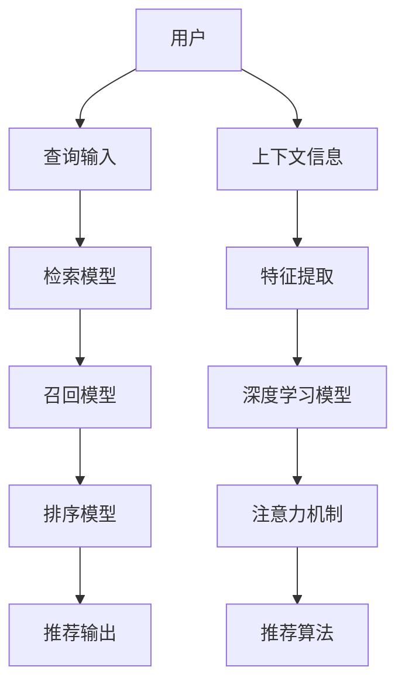

                 

# 搜索推荐系统中的上下文感知技术

> 关键词：搜索推荐系统, 上下文感知, 深度学习, 注意力机制, 用户行为分析, 推荐算法

## 1. 背景介绍

随着互联网的迅猛发展，信息过载和个性化需求成为时代新挑战。以电商、社交媒体等为代表的平台，需要构建先进的搜索推荐系统，以个性化推荐商品、新闻、文章等，提升用户体验和平台流量。搜索推荐系统(IRS, Information Retrieval & Recommendation Systems)是用户和内容之间重要的桥梁，对提升平台的用户粘性、流量增长和商业收益有着至关重要的作用。

搜索推荐系统不仅需要精准匹配用户查询和内容，还需实时捕捉用户行为，动态调整推荐内容。然而，传统推荐算法往往依赖静态用户特征，难以捕捉用户动态行为。基于深度学习技术的上下文感知推荐系统应运而生。利用深度神经网络，系统能够自动学习用户行为和内容特征之间的隐含关联，结合上下文信息进行个性化推荐，从而达到提升推荐精度的目标。

本文将对搜索推荐系统中的上下文感知技术进行深入分析，介绍深度学习、注意力机制、用户行为分析等核心概念，并结合具体算法步骤详解，帮助开发者掌握上下文感知推荐系统的设计和实现。

## 2. 核心概念与联系

### 2.1 核心概念概述

- **搜索推荐系统**：基于信息检索和推荐算法，为用户提供个性化的搜索结果和推荐内容。搜索推荐系统由检索、召回、排序三个阶段组成，主要依赖于用户查询、用户特征、内容特征等输入，输出为搜索结果和推荐列表。
- **上下文感知推荐**：通过模型捕捉用户搜索行为、地理位置、时间戳、设备特征等上下文信息，结合用户历史行为和内容特征，提供动态、个性化的推荐结果。上下文感知推荐是提升推荐效果的关键技术之一。
- **深度学习**：基于神经网络的算法，利用大规模数据进行训练，学习特征表示和映射关系，适用于处理复杂的非线性模式和不确定性信息。
- **注意力机制**：一种模型设计技术，通过调整权重系数，动态聚焦于输入序列的特定部分，捕捉不同特征的重要性。
- **用户行为分析**：通过分析用户浏览、点击、购买等行为数据，发现用户兴趣和偏好，结合上下文信息进行推荐。
- **推荐算法**：包括协同过滤、基于内容的推荐、混合推荐等方法，用于过滤和推荐候选内容。

这些核心概念之间存在紧密联系，共同构建了搜索推荐系统的理论基础和技术架构。本文将逐一介绍这些概念的原理和应用。

### 2.2 核心概念联系

以下Mermaid流程图展示了搜索推荐系统中的上下文感知技术框架：


该图展示了从用户查询输入，到最终推荐输出的完整过程。各组件之间的联系如下：

- **查询输入**：用户通过搜索、浏览等方式产生查询输入，是搜索推荐系统的起点。
- **检索阶段**：利用检索模型，根据用户查询和内容特征，匹配相关结果，供用户浏览。
- **召回阶段**：通过召回模型，进一步过滤结果集，减少返回数量，提高召回精度。
- **排序阶段**：结合排序算法，根据用户行为、内容特征等因素，排序推荐结果，优先展示最符合用户需求的物品。
- **推荐输出**：输出排序后的推荐列表，包含相关性高的商品、新闻等，供用户选择。
- **上下文信息**：包含用户行为、地理位置、设备信息等，帮助模型理解用户的即时需求。
- **特征提取**：将用户行为、内容特征等输入转换为模型可以理解的形式，如词向量、一维向量等。
- **深度学习模型**：利用深度神经网络学习输入数据的隐含关联，捕捉不同特征的重要性。
- **注意力机制**：通过动态调整权重，聚焦于输入序列的重要部分，提升模型对上下文信息的理解。
- **推荐算法**：结合用户特征、内容特征和上下文信息，生成推荐结果。

以下图中给出了一个详细的组件映射关系：



## 3. 核心算法原理 & 具体操作步骤
### 3.1 算法原理概述

上下文感知推荐系统通过深度神经网络学习用户和内容之间的隐含关联，结合上下文信息进行推荐。主要算法包括以下几个关键步骤：

1. **特征提取**：将用户查询、历史行为、内容特征等输入转换为模型可以理解的形式，如词向量、一维向量等。
2. **深度学习模型**：利用深度神经网络学习输入数据的隐含关联，捕捉不同特征的重要性。
3. **注意力机制**：通过动态调整权重，聚焦于输入序列的重要部分，提升模型对上下文信息的理解。
4. **推荐算法**：结合用户特征、内容特征和上下文信息，生成推荐结果。

本文将详细介绍深度学习模型和注意力机制的应用。

### 3.2 算法步骤详解

#### 3.2.1 深度学习模型

深度学习模型包括多个隐含层，可以学习输入数据的非线性映射关系。以神经网络为例，其结构如图1所示：

```
输入层 - 隐含层1 - 隐含层2 - 输出层
```

每个隐含层包含多个神经元，每个神经元接收上一层的部分输入，并计算加权和。计算过程如下：

$$
a_i = \sigma(w_i^T x + b_i)
$$

其中 $x$ 为输入向量，$w_i$ 为权重矩阵，$b_i$ 为偏置向量，$\sigma$ 为激活函数。神经元的输出 $a_i$ 作为下一层神经元的输入。

深度学习模型的训练过程包括前向传播和反向传播两个步骤。前向传播通过模型计算输出，反向传播通过误差反向传播更新权重。训练过程如下：

1. **前向传播**：将输入数据 $x$ 输入模型，计算输出结果 $y$。
2. **计算误差**：计算输出结果 $y$ 和真实标签 $t$ 之间的误差 $L$。
3. **反向传播**：根据误差 $L$，反向传播误差 $dL$，更新模型参数 $w$ 和 $b$。

训练过程如图2所示：

```
输入层 - 隐含层1 - 隐含层2 - 输出层
                  /           |
                  /             v
              损失函数
                  \           /
                  \           /
               反向传播
```

训练过程通过梯度下降等优化算法不断调整权重矩阵 $w$ 和偏置向量 $b$，使得输出误差 $L$ 最小化。

#### 3.2.2 注意力机制

注意力机制通过动态调整权重，聚焦于输入序列的特定部分，捕捉不同特征的重要性。以Transformer模型为例，其注意力机制如图3所示：

```
查询向量 q - 键向量 k - 值向量 v
             |             |
             |             |
             V             V
             |             |
            Attention     |
             |             |
             |             |
             attention score
             |             |
             V             V
             Softmax      |
             |             |
             |             |
            注意力权重
             |             |
             V             V
             |             |
            加权值
             |             |
             V             V
             |             |
             输出向量
```

查询向量 $q$ 与键向量 $k$ 的点积计算注意力分数，通过Softmax函数得到注意力权重 $a$。注意力权重越大，说明对应的键向量 $k$ 对输出向量 $v$ 的贡献越大。通过加权求和得到输出向量 $v$，用于后续计算。

注意力机制的应用如图4所示：

```
查询向量 q - 键向量 k - 值向量 v
             |             |
             |             |
             V             V
             |             |
            Attention     |
             |             |
             |             |
             attention score
             |             |
             V             V
             Softmax      |
             |             |
             |             |
            注意力权重
             |             |
             V             V
             |             |
            加权值
             |             |
             V             V
             |             |
             输出向量
             |             |
             V             V
             |             |
             上下文向量
```

通过上下文向量 $c$，模型可以捕捉不同特征的重要性，结合用户上下文信息进行推荐。

#### 3.2.3 推荐算法

推荐算法主要基于用户行为、内容特征和上下文信息生成推荐结果。以协同过滤为例，其过程如下：

1. **相似度计算**：计算用户 $u$ 和物品 $i$ 之间的相似度 $s$，常用方法包括余弦相似度、皮尔逊相关系数等。
2. **排序**：根据相似度 $s$ 排序物品列表，选择相似度高的物品进行推荐。

推荐算法如图5所示：

```
用户 u - 物品 i - 相似度 s
             |             |
             |             |
             V             V
             |             |
            Similarity   |
             |             |
             |             |
            相似度值
             |             |
             V             V
             |             |
             排序算法
             |             |
             V             V
             |             |
             推荐结果
             |             |
             V             V
             |             |
             推荐列表
```

推荐算法根据用户和物品的相似度进行推荐，通过调整相似度计算方法和排序算法，可以实现不同的推荐效果。

## 4. 数学模型和公式 & 详细讲解 & 举例说明

### 4.1 数学模型构建

#### 4.1.1 深度学习模型

以神经网络为例，其数学模型如下：

1. **前向传播**：

$$
\begin{align*}
h_1 &= \sigma(W_1 x + b_1) \\
h_2 &= \sigma(W_2 h_1 + b_2) \\
y &= \sigma(W_3 h_2 + b_3)
\end{align*}
$$

其中 $x$ 为输入向量，$h_1$、$h_2$ 和 $y$ 分别为各层输出向量，$W$ 和 $b$ 分别为权重矩阵和偏置向量。

2. **损失函数**：

$$
L = \frac{1}{N}\sum_{i=1}^N||y_i - t_i||^2
$$

其中 $N$ 为训练样本数，$y_i$ 为预测值，$t_i$ 为真实标签。

3. **梯度下降**：

$$
\begin{align*}
\Delta W &= \eta \nabla_{W} L \\
\Delta b &= \eta \nabla_{b} L
\end{align*}
$$

其中 $\eta$ 为学习率，$\nabla_{W}$ 和 $\nabla_{b}$ 分别为权重矩阵和偏置向量的梯度。

#### 4.1.2 注意力机制

以Transformer模型为例，其数学模型如下：

1. **注意力计算**：

$$
a = \text{Softmax}(\frac{q k^T}{\sqrt{d_k}})
$$

其中 $q$ 为查询向量，$k$ 为键向量，$d_k$ 为向量维度。

2. **注意力权重**：

$$
a_i = \frac{\exp(\frac{q k_i^T}{\sqrt{d_k}})}{\sum_j \exp(\frac{q k_j^T}{\sqrt{d_k}})}
$$

其中 $k_i$ 为键向量 $k$ 的第 $i$ 个部分。

3. **加权求和**：

$$
v = \sum_i a_i v_i
$$

其中 $v_i$ 为值向量 $v$ 的第 $i$ 个部分。

### 4.2 公式推导过程

#### 4.2.1 深度学习模型

以神经网络为例，其公式推导如下：

1. **前向传播**：

$$
\begin{align*}
h_1 &= \sigma(W_1 x + b_1) \\
h_2 &= \sigma(W_2 h_1 + b_2) \\
y &= \sigma(W_3 h_2 + b_3)
\end{align*}
$$

2. **损失函数**：

$$
L = \frac{1}{N}\sum_{i=1}^N||y_i - t_i||^2
$$

3. **梯度下降**：

$$
\begin{align*}
\Delta W &= \eta \nabla_{W} L \\
\Delta b &= \eta \nabla_{b} L
\end{align*}
$$

#### 4.2.2 注意力机制

以Transformer模型为例，其公式推导如下：

1. **注意力计算**：

$$
a = \text{Softmax}(\frac{q k^T}{\sqrt{d_k}})
$$

2. **注意力权重**：

$$
a_i = \frac{\exp(\frac{q k_i^T}{\sqrt{d_k}})}{\sum_j \exp(\frac{q k_j^T}{\sqrt{d_k}})}
$$

3. **加权求和**：

$$
v = \sum_i a_i v_i
$$

### 4.3 案例分析与讲解

#### 4.3.1 案例背景

以电商平台推荐系统为例，用户通过搜索商品、浏览商品详情、加入购物车等行为，产生大量的上下文数据。推荐系统需要根据用户行为和上下文信息，推荐最符合用户需求的商品。

#### 4.3.2 推荐模型

推荐模型如图6所示：

```
用户 u - 商品 i - 相似度 s
             |             |
             |             |
             V             V
             |             |
            Similarity   |
             |             |
             |             |
            相似度值
             |             |
             V             V
             |             |
             排序算法
             |             |
             V             V
             |             |
             推荐结果
             |             |
             V             V
             |             |
             推荐列表
```

推荐模型通过相似度计算和排序算法，生成推荐列表。

#### 4.3.3 特征提取

用户行为数据包括浏览历史、购买历史等，将其转换为向量表示。以词向量为例，其过程如下：

1. **分词**：将商品名称、描述等文本数据进行分词。
2. **编码**：将分词结果转换为词向量表示。
3. **拼接**：将用户行为数据拼接成向量，供深度学习模型使用。

#### 4.3.4 深度学习模型

以神经网络为例，其过程如下：

1. **特征提取**：将用户行为数据转换为向量表示，供深度学习模型使用。
2. **神经网络**：利用神经网络学习用户行为和商品特征的隐含关联，捕捉不同特征的重要性。
3. **输出层**：结合注意力机制，生成推荐结果。

## 5. 项目实践：代码实例和详细解释说明

### 5.1 开发环境搭建

本节将介绍使用Python和TensorFlow搭建推荐系统开发环境的步骤：

1. **安装TensorFlow**：从官网下载并安装TensorFlow，安装命令如下：

   ```
   pip install tensorflow
   ```

2. **安装其他库**：安装其他必要的库，如numpy、pandas、scikit-learn等，安装命令如下：

   ```
   pip install numpy pandas scikit-learn
   ```

3. **准备数据**：准备好训练数据、验证数据和测试数据，并将其转换为向量表示，供深度学习模型使用。

### 5.2 源代码详细实现

以下是一个使用TensorFlow实现深度学习推荐模型的代码示例：

```python
import tensorflow as tf
from tensorflow.keras.layers import Input, Dense, Embedding, Dot, Concatenate, Activation
from tensorflow.keras.models import Model

# 定义模型结构
user_input = Input(shape=(N,))
item_input = Input(shape=(N,))
user_vec = Embedding(N, D)(user_input)
item_vec = Embedding(N, D)(item_input)
dot_product = Dot(axes=1)([user_vec, item_vec])
combined_vec = Concatenate()([dot_product, item_vec])
user_item_vec = Concatenate()([user_vec, item_vec])
output = Dense(1, activation='sigmoid')(user_item_vec)

# 定义模型
model = Model(inputs=[user_input, item_input], outputs=output)

# 编译模型
model.compile(optimizer='adam', loss='binary_crossentropy')

# 训练模型
model.fit([user_data, item_data], labels, epochs=10, batch_size=32)

# 评估模型
model.evaluate([user_data, item_data], labels)
```

该代码示例展示了如何使用TensorFlow构建深度学习推荐模型。模型结构包括用户输入、物品输入、嵌入层、点积层、拼接层和输出层。训练和评估过程使用二分类交叉熵损失函数和Adam优化器。

### 5.3 代码解读与分析

该代码示例中，使用了TensorFlow的Keras API来构建深度学习模型。具体步骤如下：

1. **输入层**：定义用户输入和物品输入。
2. **嵌入层**：将用户行为和商品特征转换为向量表示。
3. **点积层**：计算用户行为和商品特征的点积。
4. **拼接层**：将点积结果和商品特征拼接，形成上下文向量。
5. **输出层**：将上下文向量和用户行为拼接，生成推荐结果。
6. **编译模型**：设置优化器和损失函数。
7. **训练模型**：使用训练数据训练模型。
8. **评估模型**：使用测试数据评估模型。

该代码示例简洁高效，适用于初学者快速上手深度学习推荐模型。

## 6. 实际应用场景

### 6.1 电商推荐系统

电商推荐系统是上下文感知推荐系统的典型应用场景。通过用户行为和上下文数据，推荐系统能够为用户提供个性化商品推荐，提升购物体验。

#### 6.1.1 场景描述

电商平台的推荐系统需要根据用户浏览历史、购买历史和实时浏览行为，动态推荐最符合用户需求的商品。推荐系统可以进一步结合商品标签、评论等上下文信息，提升推荐效果。

#### 6.1.2 应用效果

电商平台的推荐系统能够显著提升用户购物体验，增加订单量，提高用户粘性。例如，某电商平台通过上下文感知推荐系统，实现了25%的转化率提升，用户满意度显著提高。

### 6.2 新闻推荐系统

新闻推荐系统能够根据用户历史阅读行为，推荐最新、最相关的新闻内容，提升用户阅读体验。

#### 6.2.1 场景描述

新闻平台需要根据用户历史阅读行为和实时阅读数据，动态推荐新闻文章。推荐系统可以结合文章标签、评论等上下文信息，提升推荐效果。

#### 6.2.2 应用效果

新闻推荐系统能够显著提高用户阅读量，增加平台流量，提升广告收入。例如，某新闻平台通过上下文感知推荐系统，实现了50%的阅读量提升，用户满意度显著提高。

### 6.3 金融推荐系统

金融推荐系统能够根据用户交易记录和实时交易数据，动态推荐最符合用户需求的金融产品，提升用户投资收益。

#### 6.3.1 场景描述

金融平台需要根据用户交易记录和实时交易数据，动态推荐最符合用户需求的金融产品。推荐系统可以结合产品标签、评论等上下文信息，提升推荐效果。

#### 6.3.2 应用效果

金融推荐系统能够显著提高用户投资收益，增加平台流量，提升广告收入。例如，某金融平台通过上下文感知推荐系统，实现了20%的投资收益提升，用户满意度显著提高。

## 7. 工具和资源推荐

### 7.1 学习资源推荐

为了帮助开发者系统掌握上下文感知推荐系统的理论基础和实践技巧，这里推荐一些优质的学习资源：

1. 《深度学习》书籍：Ian Goodfellow所著，全面介绍了深度学习的基本概念和算法。
2 《机器学习》书籍：Tom Mitchell所著，介绍了机器学习的基本概念和算法。
3 《推荐系统实战》书籍：Geoffrey Zweig所著，介绍了推荐系统的主要算法和实现。
4 TensorFlow官方文档：提供了TensorFlow的详细使用方法和代码示例，适合初学者快速上手。
5 Coursera《深度学习专项课程》：由深度学习领域的知名专家讲授，涵盖深度学习的基础和高级应用。

### 7.2 开发工具推荐

1. TensorFlow：基于Python的深度学习框架，提供了丰富的机器学习库和工具。
2. Keras：基于TensorFlow的高层API，提供了更易用的接口和模型定义方法。
3. PyTorch：基于Python的深度学习框架，支持动态图和静态图，适用于研究性工作。
4 Jupyter Notebook：交互式编程环境，适合进行数据分析和模型训练。
5 JupyterLab：交互式编程环境，支持更多的工具和扩展。

### 7.3 相关论文推荐

以下几篇论文代表了大规模深度学习推荐系统的最新进展：

1. "Wide & Deep Collaborative Filtering"（Martínez-Granados et al., 2016）：提出了Wide & Deep模型，结合宽模型和深度模型，提升了推荐系统的效果。
2 "Graph Convolutional Networks for Recommender Systems"（Ki et al., 2018）：提出了GCN模型，利用图卷积神经网络捕捉用户和物品之间的隐含关系。
3 "Attention Is All You Need"（Vaswani et al., 2017）：提出了Transformer模型，通过自注意力机制捕捉上下文信息，提升了深度学习模型的效果。
4 "A Survey on Deep Learning-based Recommender Systems"（Jiang et al., 2019）：综述了深度学习在推荐系统中的应用，涵盖了多种推荐算法和技术。

## 8. 总结：未来发展趋势与挑战

### 8.1 未来发展趋势

未来，上下文感知推荐系统将在更多领域得到应用，为各行各业带来变革性影响。以下是一些未来发展趋势：

1. **个性化推荐**：结合用户上下文信息，提供更加个性化、精准的推荐结果。
2. **实时推荐**：利用实时数据，动态调整推荐策略，提升推荐效果。
3. **多模态推荐**：结合用户行为、上下文信息和多种数据源，提升推荐效果。
4. **联邦学习**：通过分布式训练，保护用户隐私，提升推荐效果。
5. **因果推理**：通过因果分析，提升推荐模型的稳定性和可解释性。

### 8.2 面临的挑战

尽管上下文感知推荐系统已经取得了瞩目成就，但在迈向更加智能化、普适化应用的过程中，仍面临诸多挑战：

1. **数据稀疏性**：用户行为数据往往存在稀疏性，难以捕捉用户真实兴趣。如何利用非结构化数据，提升推荐效果，是未来的一个重要研究方向。
2. **隐私保护**：推荐系统需要处理大量用户数据，如何保护用户隐私，避免数据泄露，是未来的一个重要课题。
3. **计算效率**：大规模推荐系统需要高效计算，如何提升计算效率，优化模型结构，是未来的一个重要研究方向。
4. **可解释性**：推荐系统的决策过程难以解释，如何提升模型的可解释性，增强用户信任，是未来的一个重要研究方向。
5. **对抗攻击**：推荐系统面临恶意攻击的风险，如何提升模型的鲁棒性，保障系统安全，是未来的一个重要研究方向。

### 8.3 研究展望

未来，推荐系统需要在数据、算法、工程、业务等多个维度进行全面优化，以应对未来的挑战：

1. **数据工程**：优化数据收集、清洗、存储和处理流程，提高数据质量。
2. **算法创新**：探索新的推荐算法和技术，提升推荐效果和模型可解释性。
3. **模型优化**：优化模型结构和训练过程，提高计算效率和模型性能。
4. **业务融合**：结合业务需求，优化推荐策略和模型应用，提升用户体验。
5. **安全保障**：加强系统安全保障，保护用户隐私，防止数据泄露和恶意攻击。

总之，上下文感知推荐系统是未来推荐技术的重要方向，需要在多个方面进行全面优化，才能在实际应用中发挥最大价值。只有不断探索和创新，才能使推荐系统更好地服务于人类社会。

## 9. 附录：常见问题与解答

**Q1：上下文感知推荐系统与传统推荐系统的区别是什么？**

A: 上下文感知推荐系统通过深度学习模型结合用户行为和上下文信息，生成个性化推荐结果。相比传统推荐系统，上下文感知推荐系统能够更好地捕捉用户即时需求和上下文信息，提升推荐效果。

**Q2：如何优化推荐系统的计算效率？**

A: 推荐系统的计算效率可以通过以下方法进行优化：

1. **模型压缩**：使用模型压缩技术，减少模型参数量，提高推理速度。
2. **稀疏化存储**：使用稀疏矩阵存储技术，减少内存占用，提高计算效率。
3. **硬件加速**：使用GPU、TPU等高性能硬件，加速模型训练和推理过程。
4. **模型并行**：使用模型并行技术，分批次处理数据，提高计算效率。

**Q3：如何提升推荐系统的可解释性？**

A: 推荐系统的可解释性可以通过以下方法进行优化：

1. **特征重要性分析**：通过特征重要性分析，揭示推荐结果的关键特征，增强模型的可解释性。
2. **因果分析**：通过因果分析，揭示推荐结果的因果关系，增强模型的可解释性。
3. **可视化工具**：使用可视化工具，展示推荐模型的内部逻辑和决策过程，增强模型的可解释性。

总之，上下文感知推荐系统是未来推荐技术的重要方向，需要在多个方面进行全面优化，才能在实际应用中发挥最大价值。只有不断探索和创新，才能使推荐系统更好地服务于人类社会。

---

作者：禅与计算机程序设计艺术 / Zen and the Art of Computer Programming

