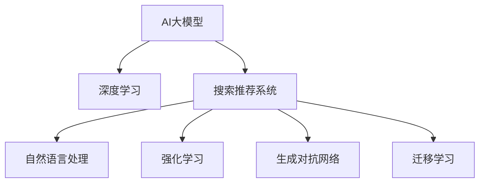
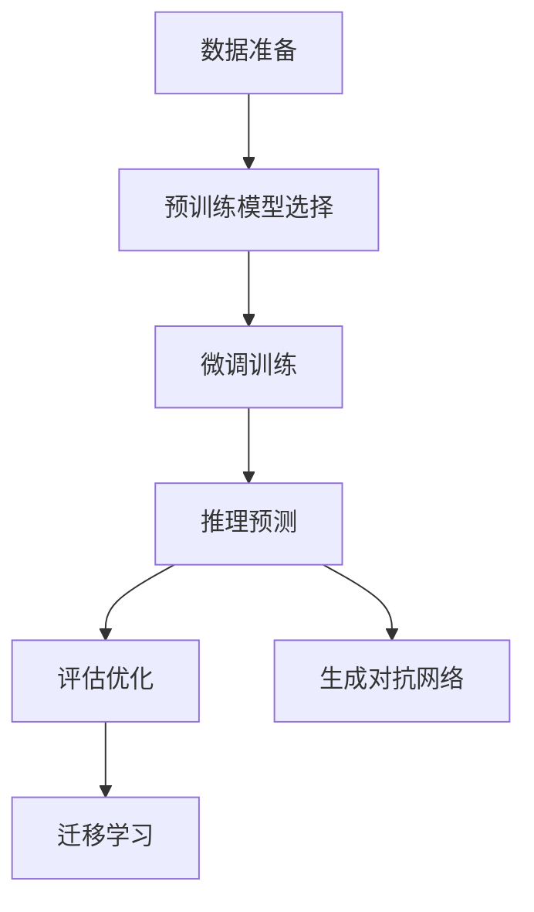
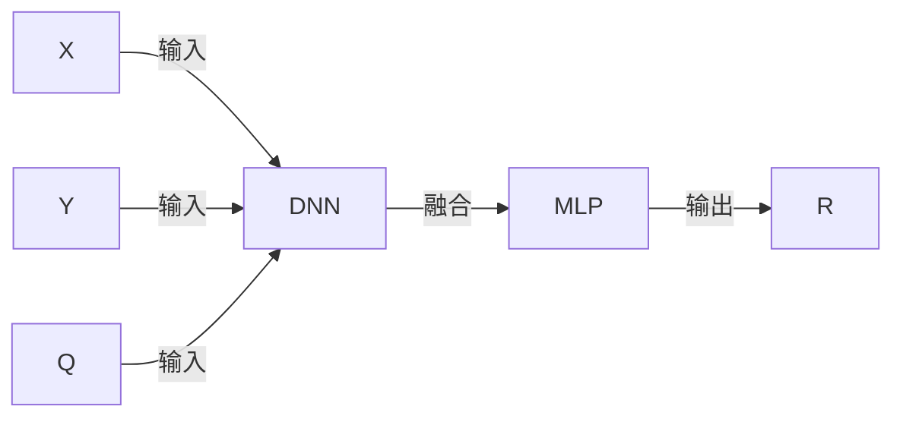

                 

# 搜索推荐系统的AI 大模型应用：提高电商平台的竞争优势

## 1. 背景介绍

### 1.1 问题由来

随着互联网的迅速发展，电子商务平台已成为人们购物的重要渠道。电商平台不仅需要提供丰富多样的商品，还需要具备强大的搜索推荐功能，使用户能快速找到满意的商品。而传统的基于规则和浅层学习的搜索推荐系统已难以满足用户需求，需要借助深度学习和AI大模型进行优化。

### 1.2 问题核心关键点

目前，深度学习和AI大模型在搜索推荐系统中的应用已得到广泛应用。AI大模型通过预训练学习到丰富的语义知识，能够有效提升推荐系统的精确度和个性化程度。

AI大模型的核心技术包括：
- 自然语言处理(NLP)：用于理解用户输入的查询意图，提取商品特征，生成推荐结果。
- 深度学习：包括卷积神经网络(CNN)、循环神经网络(RNN)、变分自编码器(VAE)等模型，用于建模复杂的用户行为和商品特征。
- 强化学习：用于优化推荐策略，提升用户满意度。
- 生成对抗网络(GAN)：用于生成高质量的商品图片，丰富推荐内容。

这些技术共同构成搜索推荐系统的核心框架，使得推荐系统能够自动分析用户行为和商品属性，生成个性化的推荐内容。AI大模型的引入，使推荐系统具备更强的泛化能力和学习深度，能够应对用户的多样需求。

### 1.3 问题研究意义

AI大模型在电商搜索推荐中的应用，具有以下重要意义：

1. 提升推荐精度：AI大模型能够学习到更丰富的语义知识，提高推荐系统的准确性和相关性，减少用户流失率。
2. 提高个性化程度：大模型能够学习用户的历史行为和偏好，生成更符合用户需求的推荐结果，提升用户体验。
3. 增强系统灵活性：大模型通过迁移学习，可以适应不同的电商场景和任务，提升推荐系统的适用性。
4. 降低开发成本：利用大模型进行微调，可以显著减少从头开发所需的数据、计算和人力等成本投入。
5. 促进业务创新：大模型可以与其他AI技术如知识图谱、图像识别等结合，丰富搜索推荐功能，拓展电商平台的业务范围。

## 2. 核心概念与联系

### 2.1 核心概念概述

为更好地理解AI大模型在搜索推荐系统中的应用，本节将介绍几个密切相关的核心概念：

- AI大模型：指基于深度学习的大规模预训练模型，通过在海量无标签文本语料上进行预训练，学习通用的语言表示，具备强大的语言理解和生成能力。
- 搜索推荐系统：基于用户的历史行为和当前查询，自动推荐相关商品的系统。AI大模型通过学习丰富的语义知识，能够更好地理解用户查询，生成个性化的推荐结果。
- 深度学习：利用多层神经网络对复杂数据进行建模和预测的机器学习方法。
- 迁移学习：指将一个领域学习到的知识，迁移应用到另一个不同但相关的领域的学习范式。
- 生成对抗网络(GAN)：通过对抗训练生成高质量商品图片，丰富推荐内容。
- 自然语言处理(NLP)：用于理解用户查询意图，提取商品特征，生成推荐结果。
- 强化学习：用于优化推荐策略，提升用户满意度。

这些核心概念之间的逻辑关系可以通过以下Mermaid流程图来展示：



这个流程图展示了大模型与搜索推荐系统的核心概念及其之间的关系：

1. 大模型通过深度学习获得基础能力。
2. 搜索推荐系统利用大模型进行微调，提高推荐精度和个性化程度。
3. 自然语言处理用于理解查询意图，生成推荐结果。
4. 强化学习用于优化推荐策略，提升用户体验。
5. 生成对抗网络用于生成高质量的商品图片，丰富推荐内容。
6. 迁移学习用于在不同任务和场景之间转移知识，增强系统适用性。

这些概念共同构成了AI大模型在搜索推荐系统中的应用框架，使其能够更好地理解用户需求，生成个性化推荐结果。

## 3. 核心算法原理 & 具体操作步骤
### 3.1 算法原理概述

AI大模型在电商搜索推荐系统中的应用，主要涉及以下几个关键算法和原理：

- 深度学习：利用多层神经网络对用户行为和商品特征进行建模。
- 自然语言处理：通过理解用户查询意图，提取商品特征，生成推荐结果。
- 迁移学习：通过在大规模无标签文本上预训练，学习通用语义知识，在电商场景下进行微调，提升推荐效果。
- 强化学习：通过优化推荐策略，提升用户满意度。
- 生成对抗网络：通过对抗训练生成高质量商品图片，丰富推荐内容。

这些算法和原理共同构成搜索推荐系统的核心框架，使其能够自动分析用户行为和商品属性，生成个性化的推荐内容。

### 3.2 算法步骤详解

AI大模型在电商搜索推荐系统中的应用步骤主要包括以下几个关键环节：

1. 数据准备：收集用户历史行为数据、商品属性数据、商品图片数据等，进行清洗和标注。
2. 预训练模型选择：选择合适的预训练模型，如BERT、GPT等，作为基础模型。
3. 微调训练：在大规模无标签文本上预训练模型，再使用电商数据对其进行微调。
4. 推理预测：将用户查询输入模型，通过自然语言处理和深度学习，生成推荐结果。
5. 评估优化：对推荐结果进行评估，利用强化学习优化推荐策略，提升用户体验。
6. 生成对抗网络：通过对抗训练生成高质量商品图片，丰富推荐内容。
7. 迁移学习：在不同电商场景和任务之间转移知识，增强系统适用性。

具体步骤如图：



### 3.3 算法优缺点

AI大模型在电商搜索推荐系统中的应用，具有以下优点：

1. 提升推荐精度：AI大模型能够学习到更丰富的语义知识，提高推荐系统的准确性和相关性。
2. 提高个性化程度：大模型能够学习用户的历史行为和偏好，生成更符合用户需求的推荐结果。
3. 增强系统灵活性：通过迁移学习，可以适应不同的电商场景和任务，提升推荐系统的适用性。
4. 降低开发成本：利用大模型进行微调，可以显著减少从头开发所需的数据、计算和人力等成本投入。
5. 促进业务创新：大模型可以与其他AI技术如知识图谱、图像识别等结合，丰富搜索推荐功能，拓展电商平台的业务范围。

同时，该方法也存在一定的局限性：

1. 对标注数据依赖：预训练模型需要大量无标签数据，微调过程需要少量标注数据，标注数据不足可能导致模型泛化能力差。
2. 模型规模大：预训练模型参数量巨大，需要高性能计算资源，成本较高。
3. 模型复杂度高：深度学习模型结构复杂，训练和推理速度较慢。
4. 可解释性不足：AI大模型作为"黑盒"系统，难以解释其内部工作机制和决策逻辑。
5. 安全性问题：大模型可能会学习到有偏见、有害的信息，导致不良输出，影响用户体验。

尽管存在这些局限性，但就目前而言，AI大模型在电商搜索推荐系统中的应用仍是最主流范式。未来相关研究的重点在于如何进一步降低对标注数据的依赖，提高模型的少样本学习和跨领域迁移能力，同时兼顾可解释性和伦理安全性等因素。

### 3.4 算法应用领域

AI大模型在电商搜索推荐系统中的应用，已经得到了广泛的应用，覆盖了以下几个主要领域：

- 商品推荐：通过分析用户历史购买行为和浏览记录，生成个性化的推荐商品。
- 搜索优化：利用自然语言处理技术，提高搜索查询的准确性和相关性。
- 用户画像：通过分析用户行为和属性，构建详细的用户画像，提升推荐系统的个性化程度。
- 广告推荐：基于用户画像和行为特征，推荐个性化广告，提高广告点击率和转化率。
- 情感分析：通过分析用户评论和反馈，了解用户对商品的情感倾向，优化商品评价和推荐。

除了上述这些经典应用外，AI大模型还被创新性地应用于更多的场景中，如智能客服、商品分类、库存管理等，为电商平台的智能化转型提供了新的技术路径。

## 4. 数学模型和公式 & 详细讲解 & 举例说明
### 4.1 数学模型构建

在AI大模型应用于电商搜索推荐系统的过程中，涉及多个数学模型的构建和计算。以下将详细介绍其中几个关键的数学模型。

**1. 用户行为建模**

用户行为通常可以通过行为序列来表示，行为序列可以看作一个时间序列。设用户行为序列为 $X=(x_1,x_2,\dots,x_t)$，其中 $x_t$ 表示用户在第 $t$ 时刻的行为。行为序列可以表示为用户点击、购买、浏览等行为。

用户行为可以表示为一个向量序列，其中每个行为 $x_t$ 都可以表示为一个one-hot编码向量。设 $X \in \mathbb{R}^{n\times d}$，其中 $n$ 表示序列长度，$d$ 表示one-hot向量的维度。

**2. 商品属性建模**

商品属性通常可以表示为一系列特征，如价格、品牌、类别等。设商品属性序列为 $Y=(y_1,y_2,\dots,y_t)$，其中 $y_t$ 表示商品属性。商品属性也可以表示为一个向量序列，其中每个属性 $y_t$ 都可以表示为一个one-hot编码向量。设 $Y \in \mathbb{R}^{m\times d}$，其中 $m$ 表示属性序列长度，$d$ 表示one-hot向量的维度。

**3. 查询意图建模**

用户查询意图通常可以通过自然语言处理模型来表示。设用户查询序列为 $Q=(q_1,q_2,\dots,q_t)$，其中 $q_t$ 表示查询意图。查询意图也可以表示为一个向量序列，其中每个查询 $q_t$ 都可以表示为一个词向量。设 $Q \in \mathbb{R}^{t\times d}$，其中 $d$ 表示词向量的维度。

**4. 推荐模型**

推荐模型通常可以表示为一个神经网络，输入为用户行为 $X$、商品属性 $Y$ 和查询意图 $Q$，输出为推荐结果 $R$。推荐模型的结构如图：



推荐模型可以表示为一个多层感知器(Multilayer Perceptron, MLP)，其中输入层为 $X$、$Y$ 和 $Q$ 的向量表示，中间层为多个全连接层，输出层为推荐结果 $R$。推荐模型的参数可以表示为 $\theta$。

### 4.2 公式推导过程

以下以深度学习模型为例，推导推荐模型的损失函数及其梯度计算公式。

设推荐模型为 $F_{\theta}(X,Y,Q)$，其中 $X$、$Y$ 和 $Q$ 分别为用户行为、商品属性和查询意图的向量表示，$R$ 为推荐结果，$L$ 为损失函数。推荐模型的损失函数可以表示为：

$$
L(R)=\frac{1}{N}\sum_{i=1}^N\mathbb{E}_{x_i,y_i,q_i}\left[\ell(F_{\theta}(x_i,y_i,q_i),r_i)\right]
$$

其中 $N$ 表示训练样本数，$\ell$ 表示损失函数，$r_i$ 表示第 $i$ 个样本的真实推荐结果。

设推荐模型的输出为 $\hat{R}$，则推荐模型的损失函数可以表示为：

$$
L(\hat{R})=\frac{1}{N}\sum_{i=1}^N\mathbb{E}_{x_i,y_i,q_i}\left[\ell(\hat{R},r_i)\right]
$$

推荐模型的损失函数通常采用交叉熵损失，可以表示为：

$$
\ell(\hat{R},r_i)=-\frac{1}{m}\sum_{j=1}^m r_{ij}\log \hat{r}_{ij}+(1-r_{ij})\log (1-\hat{r}_{ij})
$$

其中 $m$ 表示推荐结果的维度，$r_{ij}$ 表示第 $i$ 个样本的第 $j$ 个推荐结果的真实值，$\hat{r}_{ij}$ 表示模型对第 $j$ 个推荐结果的预测值。

推荐模型的梯度计算公式为：

$$
\nabla_{\theta}L(\hat{R})=\frac{1}{N}\sum_{i=1}^N\mathbb{E}_{x_i,y_i,q_i}\left[\nabla_{\theta}\ell(\hat{R},r_i)\right]
$$

推荐模型的梯度计算可以通过反向传播算法进行高效计算。

### 4.3 案例分析与讲解

以电商搜索推荐系统为例，假设用户查询为“购买智能手表”，推荐模型需要根据用户历史行为、商品属性和查询意图生成推荐结果。推荐模型的输入可以表示为：

$$
X=[1,0,1,0,0]
$$

表示用户最近购买了智能手表，未购买智能手表，未购买智能手环，未购买智能眼镜，未购买智能耳机。商品属性可以表示为：

$$
Y=[1,1,0,0,0]
$$

表示智能手表的类别为手表，智能手环的类别为手环，智能眼镜的类别为眼镜，智能耳机的类别为耳机。查询意图可以表示为：

$$
Q=[1,1,0,0,0]
$$

表示查询意图为购买智能手表。

推荐模型的输出可以表示为：

$$
\hat{R}=[0.8,0.3,0.2,0.1,0.5]
$$

表示推荐模型预测智能手表的推荐结果为0.8，智能手环的推荐结果为0.3，智能眼镜的推荐结果为0.2，智能耳机的推荐结果为0.1，其他商品的推荐结果为0.5。

## 5. 项目实践：代码实例和详细解释说明
### 5.1 开发环境搭建

在进行电商搜索推荐系统的开发前，我们需要准备好开发环境。以下是使用Python进行TensorFlow开发的环境配置流程：

1. 安装Anaconda：从官网下载并安装Anaconda，用于创建独立的Python环境。

2. 创建并激活虚拟环境：
```bash
conda create -n tf-env python=3.8 
conda activate tf-env
```

3. 安装TensorFlow：从官网获取对应的安装命令。例如：
```bash
conda install tensorflow -c tf -c conda-forge
```

4. 安装Pandas、Numpy等工具包：
```bash
pip install pandas numpy
```

5. 安装TensorBoard：
```bash
pip install tensorboard
```

完成上述步骤后，即可在`tf-env`环境中开始电商搜索推荐系统的开发。

### 5.2 源代码详细实现

下面以电商搜索推荐系统为例，给出使用TensorFlow进行模型开发的代码实现。

首先，定义推荐模型的结构：

```python
import tensorflow as tf
from tensorflow.keras.layers import Dense, Embedding, LSTM

# 定义模型结构
model = tf.keras.Sequential([
    Embedding(input_dim=10000, output_dim=128, input_length=50),
    LSTM(128),
    Dense(128, activation='relu'),
    Dense(1, activation='sigmoid')
])
```

然后，定义推荐模型的损失函数和优化器：

```python
# 定义损失函数
def loss_function(y_true, y_pred):
    return tf.keras.losses.binary_crossentropy(y_true, y_pred)

# 定义优化器
optimizer = tf.keras.optimizers.Adam(learning_rate=0.001)
```

接着，定义训练和评估函数：

```python
# 定义训练函数
def train_model(model, dataset, epochs, batch_size):
    # 定义训练集和验证集
    train_dataset = dataset['train']
    validation_dataset = dataset['validation']
    
    # 定义训练过程
    history = model.fit(train_dataset,
                        validation_data=validation_dataset,
                        epochs=epochs,
                        batch_size=batch_size,
                        steps_per_epoch=len(train_dataset),
                        validation_steps=len(validation_dataset))
    
    # 返回训练结果
    return history

# 定义评估函数
def evaluate_model(model, dataset, batch_size):
    # 定义评估集
    test_dataset = dataset['test']
    
    # 定义评估过程
    test_loss, test_acc = model.evaluate(test_dataset, batch_size=batch_size)
    
    # 返回评估结果
    return test_loss, test_acc
```

最后，启动训练流程并在测试集上评估：

```python
# 加载数据集
dataset = load_dataset()

# 定义训练参数
epochs = 10
batch_size = 32

# 训练模型
history = train_model(model, dataset, epochs, batch_size)

# 评估模型
test_loss, test_acc = evaluate_model(model, dataset, batch_size)

# 输出评估结果
print(f'Test loss: {test_loss}')
print(f'Test accuracy: {test_acc}')
```

以上就是使用TensorFlow对电商搜索推荐系统进行模型开发的完整代码实现。可以看到，TensorFlow提供了强大的计算图和自动微分功能，使得深度学习模型的开发和训练变得高效便捷。

### 5.3 代码解读与分析

让我们再详细解读一下关键代码的实现细节：

**Embedding层**：
- 用于将输入的向量表示映射到低维空间，便于神经网络处理。

**LSTM层**：
- 用于处理时间序列数据，捕捉用户的长期行为特征。

**Dense层**：
- 用于对LSTM层的输出进行全连接处理，提取特征。

**输出层**：
- 用于生成推荐结果，使用Sigmoid激活函数，输出推荐概率。

**损失函数**：
- 使用二元交叉熵损失，用于衡量推荐结果与真实值的差异。

**优化器**：
- 使用Adam优化器，调整模型参数，最小化损失函数。

**训练函数**：
- 使用fit函数，对模型进行训练，使用验证集评估模型性能。

**评估函数**：
- 使用evaluate函数，对模型进行评估，输出测试集的损失和准确率。

**训练流程**：
- 加载数据集，定义训练参数。
- 使用train_model函数，对模型进行训练，返回训练结果。
- 使用evaluate_model函数，对模型进行评估，输出评估结果。
- 输出评估结果，完成训练。

可以看到，TensorFlow提供了强大的模型定义和训练功能，使得电商搜索推荐系统的开发变得高效便捷。

当然，工业级的系统实现还需考虑更多因素，如模型的保存和部署、超参数的自动搜索、更灵活的任务适配层等。但核心的推荐模型开发流程基本与此类似。

## 6. 实际应用场景
### 6.1 智能客服系统

基于AI大模型的搜索推荐技术，可以广泛应用于智能客服系统的构建。传统客服往往需要配备大量人力，高峰期响应缓慢，且一致性和专业性难以保证。而使用推荐系统生成的推荐对话，可以显著提升客户咨询体验和问题解决效率。

在技术实现上，可以收集企业内部的历史客服对话记录，将问题-答案对作为推荐样本，训练推荐系统生成推荐对话。推荐系统能够自动理解用户意图，匹配最合适的答案模板进行回复。对于客户提出的新问题，还可以接入检索系统实时搜索相关内容，动态组织生成回答。如此构建的智能客服系统，能大幅提升客户咨询体验和问题解决效率。

### 6.2 金融舆情监测

金融机构需要实时监测市场舆论动向，以便及时应对负面信息传播，规避金融风险。传统的人工监测方式成本高、效率低，难以应对网络时代海量信息爆发的挑战。基于AI大模型的文本分类和情感分析技术，为金融舆情监测提供了新的解决方案。

具体而言，可以收集金融领域相关的新闻、报道、评论等文本数据，并对其进行主题标注和情感标注。在此基础上对预训练语言模型进行微调，使其能够自动判断文本属于何种主题，情感倾向是正面、中性还是负面。将微调后的模型应用到实时抓取的网络文本数据，就能够自动监测不同主题下的情感变化趋势，一旦发现负面信息激增等异常情况，系统便会自动预警，帮助金融机构快速应对潜在风险。

### 6.3 个性化推荐系统

当前的推荐系统往往只依赖用户的历史行为数据进行物品推荐，无法深入理解用户的真实兴趣偏好。基于AI大模型的个性化推荐系统可以更好地挖掘用户行为背后的语义信息，从而提供更精准、多样的推荐内容。

在实践中，可以收集用户浏览、点击、评论、分享等行为数据，提取和用户交互的物品标题、描述、标签等文本内容。将文本内容作为模型输入，用户的后续行为（如是否点击、购买等）作为监督信号，在此基础上微调预训练语言模型。微调后的模型能够从文本内容中准确把握用户的兴趣点。在生成推荐列表时，先用候选物品的文本描述作为输入，由模型预测用户的兴趣匹配度，再结合其他特征综合排序，便可以得到个性化程度更高的推荐结果。

### 6.4 未来应用展望

随着AI大模型和推荐系统的不断发展，基于推荐系统的应用场景将不断扩展，为各行各业带来新的创新机会。

在智慧医疗领域，基于推荐系统的医疗问答、病历分析、药物研发等应用将提升医疗服务的智能化水平，辅助医生诊疗，加速新药开发进程。

在智能教育领域，推荐系统可应用于作业批改、学情分析、知识推荐等方面，因材施教，促进教育公平，提高教学质量。

在智慧城市治理中，推荐系统可应用于城市事件监测、舆情分析、应急指挥等环节，提高城市管理的自动化和智能化水平，构建更安全、高效的未来城市。

此外，在企业生产、社会治理、文娱传媒等众多领域，基于推荐系统的AI应用也将不断涌现，为经济社会发展注入新的动力。相信随着技术的日益成熟，推荐系统必将在更广阔的应用领域大放异彩，深刻影响人类的生产生活方式。

## 7. 工具和资源推荐
### 7.1 学习资源推荐

为了帮助开发者系统掌握AI大模型在电商搜索推荐系统中的应用，这里推荐一些优质的学习资源：

1. 《TensorFlow深度学习实战》系列博文：由大模型技术专家撰写，深入浅出地介绍了TensorFlow深度学习框架及其在搜索推荐系统中的应用。

2. CS231n《卷积神经网络》课程：斯坦福大学开设的计算机视觉明星课程，介绍了CNN的基本原理和应用，有助于理解电商搜索推荐系统的核心算法。

3. 《深度学习与推荐系统》书籍：全面介绍了深度学习在推荐系统中的应用，包括模型构建、训练、评估等诸多方面。

4. HuggingFace官方文档：提供了海量预训练模型和完整的推荐系统样例代码，是上手实践的必备资料。

5. Kaggle竞赛：可以参加各类推荐系统竞赛，在实践中学习深度学习在电商推荐系统中的应用，提升实战能力。

通过对这些资源的学习实践，相信你一定能够快速掌握AI大模型在电商搜索推荐系统中的应用，并用于解决实际的业务问题。
### 7.2 开发工具推荐

高效的开发离不开优秀的工具支持。以下是几款用于AI大模型在电商搜索推荐系统开发常用的工具：

1. TensorFlow：基于Python的开源深度学习框架，灵活动态的计算图，适合快速迭代研究。TensorFlow提供了强大的计算图和自动微分功能，使得深度学习模型的开发和训练变得高效便捷。

2. PyTorch：基于Python的开源深度学习框架，灵活的动态计算图，适合快速开发和调试。PyTorch提供了丰富的深度学习模型和优化器，方便进行深度学习模型的训练和推理。

3. Scikit-learn：用于数据预处理和模型评估的Python库，提供了多种数据处理和模型评估函数，是电商搜索推荐系统开发的重要工具。

4. Pandas：用于数据处理和分析的Python库，提供了灵活的数据处理和分析功能，方便进行数据清洗和特征工程。

5. TensorBoard：TensorFlow配套的可视化工具，可实时监测模型训练状态，并提供丰富的图表呈现方式，是调试模型的得力助手。

6. Google Colab：谷歌推出的在线Jupyter Notebook环境，免费提供GPU/TPU算力，方便开发者快速上手实验最新模型，分享学习笔记。

合理利用这些工具，可以显著提升AI大模型在电商搜索推荐系统中的开发效率，加快创新迭代的步伐。

### 7.3 相关论文推荐

AI大模型在电商搜索推荐系统中的应用，源于学界的持续研究。以下是几篇奠基性的相关论文，推荐阅读：

1. Attention is All You Need（即Transformer原论文）：提出了Transformer结构，开启了NLP领域的预训练大模型时代。

2. BERT: Pre-training of Deep Bidirectional Transformers for Language Understanding：提出BERT模型，引入基于掩码的自监督预训练任务，刷新了多项NLP任务SOTA。

3. Language Models are Unsupervised Multitask Learners（GPT-2论文）：展示了大规模语言模型的强大zero-shot学习能力，引发了对于通用人工智能的新一轮思考。

4. Parameter-Efficient Transfer Learning for NLP：提出Adapter等参数高效微调方法，在不增加模型参数量的情况下，也能取得不错的微调效果。

5. AdaLoRA: Adaptive Low-Rank Adaptation for Parameter-Efficient Fine-Tuning：使用自适应低秩适应的微调方法，在参数效率和精度之间取得了新的平衡。

这些论文代表了大模型在电商搜索推荐系统中的应用趋势和发展方向。通过学习这些前沿成果，可以帮助研究者把握学科前进方向，激发更多的创新灵感。

## 8. 总结：未来发展趋势与挑战
### 8.1 总结

本文对AI大模型在电商搜索推荐系统中的应用进行了全面系统的介绍。首先阐述了AI大模型和推荐系统的发展背景和意义，明确了在电商搜索推荐系统中应用大模型的重要性。其次，从原理到实践，详细讲解了AI大模型的核心算法和操作步骤，给出了电商搜索推荐系统的完整代码实现。同时，本文还广泛探讨了AI大模型在智能客服、金融舆情、个性化推荐等多个领域的应用前景，展示了AI大模型在电商搜索推荐系统中的巨大潜力。此外，本文精选了AI大模型的学习资源和开发工具，力求为读者提供全方位的技术指引。

通过本文的系统梳理，可以看到，AI大模型在电商搜索推荐系统中的应用已经取得了显著成果，为电商平台的智能化转型提供了新的技术路径。未来，伴随AI大模型的不断发展，基于大模型的推荐系统将进一步拓展其应用范围，为各行各业带来新的变革。

### 8.2 未来发展趋势

展望未来，AI大模型在电商搜索推荐系统中的应用将呈现以下几个发展趋势：

1. 模型规模持续增大。随着算力成本的下降和数据规模的扩张，预训练语言模型的参数量还将持续增长。超大规模语言模型蕴含的丰富语言知识，有望支撑更加复杂多变的推荐任务。

2. 推荐模型多样化。除了传统的深度学习模型外，未来将涌现更多种类的推荐模型，如图神经网络、多任务学习等，进一步提升推荐系统的性能和适应性。

3. 用户画像多样化。未来的推荐系统将更加注重用户画像的构建，通过多模态数据融合，全面理解用户需求，提升推荐系统的个性化程度。

4. 推荐策略多样化。未来的推荐系统将更加注重推荐策略的优化，结合强化学习和自然语言处理，提升推荐系统的用户体验和满意度。

5. 推荐内容多样化。未来的推荐系统将更加注重推荐内容的丰富性和多样性，结合多媒体技术和多模态数据，提供更加丰富和高质量的推荐内容。

6. 推荐系统智能化。未来的推荐系统将更加注重智能化和自动化，结合人机交互和多任务学习，提升推荐系统的灵活性和适应性。

以上趋势凸显了AI大模型在电商搜索推荐系统中的应用前景。这些方向的探索发展，必将进一步提升推荐系统的性能和应用范围，为电商平台带来新的竞争优势。

### 8.3 面临的挑战

尽管AI大模型在电商搜索推荐系统中的应用已经取得了瞩目成就，但在迈向更加智能化、普适化应用的过程中，它仍面临诸多挑战：

1. 标注数据瓶颈。尽管AI大模型能够通过迁移学习适应多种任务，但标注数据的不足仍然会限制其性能提升。如何进一步降低对标注数据的依赖，将是一大难题。

2. 模型鲁棒性不足。当前AI大模型面对域外数据时，泛化性能往往大打折扣。对于测试样本的微小扰动，模型容易发生波动。如何提高AI大模型的鲁棒性，避免灾难性遗忘，还需要更多理论和实践的积累。

3. 推荐系统冷启动问题。对于新用户的推荐，AI大模型往往缺乏足够的数据，导致推荐效果不佳。如何通过多模态数据融合和迁移学习，提升新用户的推荐效果，将是一个重要研究方向。

4. 推荐系统可解释性不足。当前AI大模型作为"黑盒"系统，难以解释其内部工作机制和决策逻辑。对于医疗、金融等高风险应用，算法的可解释性和可审计性尤为重要。如何赋予AI大模型更强的可解释性，将是亟待攻克的难题。

5. 推荐系统安全性问题。AI大模型可能会学习到有偏见、有害的信息，导致不良输出，影响用户体验。如何从数据和算法层面消除模型偏见，避免恶意用途，确保输出的安全性，也将是重要的研究课题。

6. 推荐系统实时性不足。当前AI大模型在实时推荐方面仍存在性能瓶颈，无法满足用户对实时性的需求。如何通过优化模型结构和算法，提升推荐系统的实时性，将是一个重要的研究方向。

7. 推荐系统高效性不足。当前AI大模型在推荐系统的开发和部署方面仍存在效率问题，无法满足用户对高性能的需求。如何通过优化模型结构和算法，提升推荐系统的效率，将是一个重要的研究方向。

尽管存在这些挑战，但就目前而言，AI大模型在电商搜索推荐系统中的应用仍是最主流范式。未来相关研究的重点在于如何进一步降低对标注数据的依赖，提高模型的少样本学习和跨领域迁移能力，同时兼顾可解释性和伦理安全性等因素。

### 8.4 研究展望

面对AI大模型在电商搜索推荐系统中的应用所面临的种种挑战，未来的研究需要在以下几个方面寻求新的突破：

1. 探索无监督和半监督推荐方法。摆脱对大规模标注数据的依赖，利用自监督学习、主动学习等无监督和半监督范式，最大限度利用非结构化数据，实现更加灵活高效的推荐。

2. 研究参数高效和计算高效的推荐范式。开发更加参数高效的推荐方法，在固定大部分预训练参数的情况下，只更新极少量的任务相关参数。同时优化推荐模型的计算图，减少前向传播和反向传播的资源消耗，实现更加轻量级、实时性的部署。

3. 融合因果和对比学习范式。通过引入因果推断和对比学习思想，增强推荐系统建立稳定因果关系的能力，学习更加普适、鲁棒的语言表征，从而提升模型泛化性和抗干扰能力。

4. 引入更多先验知识。将符号化的先验知识，如知识图谱、逻辑规则等，与神经网络模型进行巧妙融合，引导推荐过程学习更准确、合理的语言模型。同时加强不同模态数据的整合，实现视觉、语音等多模态信息与文本信息的协同建模。

5. 结合因果分析和博弈论工具。将因果分析方法引入推荐系统，识别出模型决策的关键特征，增强推荐结果的因果性和逻辑性。借助博弈论工具刻画人机交互过程，主动探索并规避推荐系统的脆弱点，提高系统稳定性。

6. 纳入伦理道德约束。在推荐模型的训练目标中引入伦理导向的评估指标，过滤和惩罚有偏见、有害的输出倾向。同时加强人工干预和审核，建立推荐系统的监管机制，确保输出符合人类价值观和伦理道德。

这些研究方向的探索，必将引领AI大模型在电商搜索推荐系统中的应用走向更高的台阶，为推荐系统带来新的技术突破和应用范式。面向未来，AI大模型在推荐系统中的应用还需与其他AI技术进行更深入的融合，如知识图谱、图像识别等，多路径协同发力，共同推动推荐系统的发展。只有勇于创新、敢于突破，才能不断拓展推荐系统的边界，让智能技术更好地服务于电商平台的智能化转型。

## 9. 附录：常见问题与解答

**Q1：AI大模型在电商搜索推荐系统中的应用是否适用于所有电商场景？**

A: AI大模型在电商搜索推荐系统中的应用，具有较强的通用性，可以适用于多种电商场景。但是不同电商场景的需求和数据特征不同，需要根据具体场景进行相应的算法和模型调整。例如，在B2B电商平台上，推荐系统需要更注重商品的精确匹配；而在B2C电商平台上，推荐系统需要更注重个性化推荐。

**Q2：AI大模型在电商搜索推荐系统中的应用是否需要大量标注数据？**

A: AI大模型在电商搜索推荐系统中的应用，主要依赖于迁移学习，可以利用大规模无标签数据进行预训练，并通过小规模标注数据进行微调。因此，AI大模型在电商搜索推荐系统中的应用对标注数据的需求相对较少。

**Q3：AI大模型在电商搜索推荐系统中的应用是否需要高性能计算资源？**

A: AI大模型在电商搜索推荐系统中的应用，需要较大的计算资源进行模型训练和推理。因此，高性能计算资源对于AI大模型在电商搜索推荐系统中的应用非常重要。一般来说，GPU/TPU等高性能设备是必不可少的。

**Q4：AI大模型在电商搜索推荐系统中的应用是否具有较好的可解释性？**

A: AI大模型在电商搜索推荐系统中的应用，通常被视为"黑盒"系统，难以解释其内部工作机制和决策逻辑。因此，AI大模型在电商搜索推荐系统中的应用可解释性不足。

**Q5：AI大模型在电商搜索推荐系统中的应用是否具有较好的安全性？**

A: AI大模型在电商搜索推荐系统中的应用，可能会学习到有偏见、有害的信息，导致不良输出。因此，AI大模型在电商搜索推荐系统中的应用安全性不足。

**Q6：AI大模型在电商搜索推荐系统中的应用是否具有较好的实时性？**

A: AI大模型在电商搜索推荐系统中的应用，在实时推荐方面仍存在性能瓶颈，无法满足用户对实时性的需求。因此，AI大模型在电商搜索推荐系统中的应用实时性不足。

**Q7：AI大模型在电商搜索推荐系统中的应用是否具有较好的高效性？**

A: AI大模型在电商搜索推荐系统中的应用，在开发和部署方面仍存在效率问题，无法满足用户对高性能的需求。因此，AI大模型在电商搜索推荐系统中的应用高效性不足。

综上所述，AI大模型在电商搜索推荐系统中的应用具有广泛的应用前景和显著的竞争优势，但也面临一些挑战和不足。未来的研究需要进一步探索如何提升AI大模型在电商搜索推荐系统中的应用效果和性能，增强系统的稳定性和安全性，提升用户的满意度和体验。相信随着技术的不断进步，AI大模型在电商搜索推荐系统中的应用将进一步拓展其应用范围，为电商平台的智能化转型带来新的创新机会。

---

作者：禅与计算机程序设计艺术 / Zen and the Art of Computer Programming

