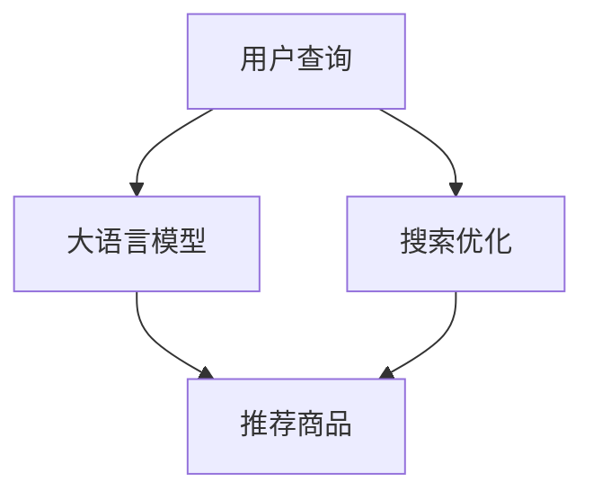

                 

# 搜索推荐系统的AI 大模型应用：提高电商平台的转化率与用户体验

## 1. 背景介绍

随着人工智能和大数据技术的不断进步，电商平台的搜索推荐系统正变得越来越智能化。现代电商企业通过引入AI模型，利用用户的历史行为、实时反馈和外部环境信息，实现对用户需求的精准预测，显著提升用户转化率和购物体验。

然而，构建一个高效、精准且用户友好的搜索推荐系统，需要处理海量用户数据、设计复杂的多模态模型、优化计算资源分配等多方面的挑战。目前主流的推荐算法主要包括基于协同过滤、基于内容的推荐、基于深度学习的推荐等方法，各有其优势和局限性。例如，协同过滤算法可以捕捉用户与物品之间的隐性关系，但在数据稀疏性问题上存在挑战。基于内容的推荐方法可以提供个性化的推荐，但通常需要大量手工设计的特征工程。基于深度学习的推荐模型，如深度神经网络、长短时记忆网络、自注意力机制等，具备较强的自适应能力和泛化能力，成为现代推荐系统的主流选择。

近年来，大语言模型在自然语言处理（NLP）领域取得了巨大突破，如BERT、GPT、XLNet等模型，已经在多个任务上刷新了SOTA，具备强大的语言理解和生成能力。将大语言模型引入搜索推荐系统，成为提升系统性能和用户体验的新方向。

## 2. 核心概念与联系

### 2.1 核心概念概述

大语言模型在推荐系统中的应用主要分为两类：

1. **基于大模型推荐**：直接利用大语言模型对用户查询和商品描述进行匹配，以预测用户可能感兴趣的商品，实现个性化推荐。
2. **基于大模型的搜索**：在用户输入查询时，利用大语言模型预测用户可能的意图，生成更好的查询词或对搜索结果进行优化，提升搜索的准确性和相关性。

### 2.2 核心概念原理和架构的 Mermaid 流程图



该流程图示意了基于大语言模型的推荐和搜索流程。用户查询首先进入大语言模型进行意图预测，然后基于预测结果推荐商品或优化搜索结果。

## 3. 核心算法原理 & 具体操作步骤

### 3.1 算法原理概述

大语言模型在推荐系统中的应用，主要基于以下原理：

1. **预训练与微调**：先在大规模无标签文本语料上进行预训练，学习语言的通用表示；然后在特定领域的任务上，通过有监督学习进行微调，使其能够更好地适应特定领域的推荐任务。

2. **语言理解与生成**：大语言模型具备强大的语言理解能力和生成能力，通过分析用户查询和商品描述的语义，预测用户可能感兴趣的商品。

3. **多模态融合**：大语言模型可以处理文本、图像、音频等多种模态数据，通过融合多模态信息，提升推荐的全面性和准确性。

4. **知识图谱集成**：通过与知识图谱进行融合，大语言模型可以获取更多的背景知识和领域信息，提升推荐的相关性和个性化。

### 3.2 算法步骤详解

大语言模型在电商平台的搜索推荐系统中应用的具体操作步骤如下：

1. **数据准备**：收集用户的历史行为数据、商品描述、标签等信息，构建推荐系统的训练数据集。

2. **模型预训练**：在大规模无标签文本数据上进行预训练，学习语言的通用表示。

3. **模型微调**：在特定领域的推荐任务上，对预训练模型进行微调，使其能够更好地适应电商平台的推荐需求。

4. **特征提取**：利用大语言模型提取用户查询和商品描述的特征向量，用于相似性计算。

5. **推荐生成**：基于提取的特征向量，使用机器学习算法（如协同过滤、深度学习等）生成推荐列表。

6. **搜索结果优化**：在用户输入查询时，使用大语言模型进行意图预测，生成更好的查询词，或对搜索结果进行优化。

### 3.3 算法优缺点

基于大语言模型的推荐算法，具备以下优点：

1. **泛化能力强**：大语言模型通过预训练和微调，具备较强的泛化能力，能够适应不同领域的推荐需求。

2. **适应性强**：大语言模型能够处理多种模态数据，适应多变的推荐场景。

3. **推荐准确性高**：大语言模型可以理解复杂的语义，提供更加精准的推荐。

4. **可解释性强**：大语言模型的决策过程可以提供较详细的解释，帮助用户理解推荐理由。

然而，该方法也存在一些局限性：

1. **计算资源需求高**：大语言模型参数量庞大，训练和推理需要高性能计算资源。

2. **效果依赖数据**：模型的效果依赖于高质量的标注数据和足够的训练数据量，数据质量不佳会影响推荐效果。

3. **模型复杂度高**：大语言模型较为复杂，模型调参和优化工作量大。

4. **实时性差**：大模型推理速度较慢，实时推荐性能有待提升。

### 3.4 算法应用领域

基于大语言模型的推荐算法，已广泛应用于电商、金融、社交网络、视频等多个领域。例如：

- **电商推荐**：利用用户浏览、购买历史和大语言模型，提供个性化商品推荐。
- **金融理财**：结合用户行为和市场信息，提供投资建议和金融产品推荐。
- **社交网络**：分析用户兴趣和行为，推荐内容、好友和活动。
- **视频推荐**：预测用户观看偏好，推荐个性化视频内容。

这些领域的应用，都依赖于大语言模型强大的语言理解和生成能力，以及其广泛的泛化能力。

## 4. 数学模型和公式 & 详细讲解 & 举例说明

### 4.1 数学模型构建

基于大语言模型的推荐系统，可以通过以下数学模型进行构建：

假设用户查询为 $q$，商品描述为 $d$，用户历史行为为 $h$，推荐模型为 $M$，推荐结果为 $r$，则推荐过程可以表示为：

$$
r = M(q, d, h)
$$

其中，$q$ 和 $d$ 通过大语言模型进行相似性计算，得到向量表示 $\text{vec}(q)$ 和 $\text{vec}(d)$；历史行为 $h$ 通过机器学习算法（如协同过滤、深度学习等）得到用户画像向量 $\text{vec}(h)$；最终通过模型 $M$ 计算推荐结果向量 $\text{vec}(r)$。

### 4.2 公式推导过程

以基于大模型的推荐为例，假设用户查询为 $q$，商品描述为 $d$，用户历史行为为 $h$，推荐模型为 $M$，推荐结果为 $r$。则推荐过程可以表示为：

1. 对用户查询 $q$ 和商品描述 $d$ 进行相似性计算，得到向量表示 $\text{vec}(q)$ 和 $\text{vec}(d)$：
   $$
   \text{vec}(q) = \text{Model}_{\text{LM}}(q)
   $$
   $$
   \text{vec}(d) = \text{Model}_{\text{LM}}(d)
   $$

2. 对用户历史行为 $h$ 进行特征提取，得到用户画像向量 $\text{vec}(h)$：
   $$
   \text{vec}(h) = \text{Model}_{\text{ML}}(h)
   $$

3. 将上述三个向量输入推荐模型 $M$，计算推荐结果向量 $\text{vec}(r)$：
   $$
   \text{vec}(r) = M(\text{vec}(q), \text{vec}(d), \text{vec}(h))
   $$

4. 将推荐结果向量 $\text{vec}(r)$ 转化为最终的推荐结果 $r$。

### 4.3 案例分析与讲解

假设某电商平台的推荐系统使用大语言模型进行推荐，具体流程如下：

1. 用户输入查询 "运动鞋"，大语言模型根据查询预测用户可能对 "运动鞋推荐" 感兴趣。

2. 根据用户的历史浏览和购买记录，提取用户画像向量 $\text{vec}(h)$。

3. 对所有商品进行描述 $d$ 的相似性计算，提取商品特征向量 $\text{vec}(d)$。

4. 使用机器学习算法（如协同过滤、深度学习等）计算用户画像向量 $\text{vec}(h)$ 和商品特征向量 $\text{vec}(d)$ 的相似度 $s$。

5. 将用户查询 $q$ 和商品特征向量 $\text{vec}(d)$ 输入大语言模型进行相似性计算，得到向量表示 $\text{vec}(q)$ 和 $\text{vec}(d)$。

6. 将上述三个向量输入推荐模型 $M$，计算推荐结果向量 $\text{vec}(r)$。

7. 将推荐结果向量 $\text{vec}(r)$ 转化为最终的推荐列表 $r$，展示给用户。

通过上述流程，基于大语言模型的推荐系统可以提供个性化的商品推荐，显著提升用户转化率和购物体验。

## 5. 项目实践：代码实例和详细解释说明

### 5.1 开发环境搭建

在进行大语言模型在搜索推荐系统中的应用时，需要搭建好相应的开发环境。以下是使用Python进行开发的环境配置流程：

1. 安装Anaconda：从官网下载并安装Anaconda，用于创建独立的Python环境。

2. 创建并激活虚拟环境：
```bash
conda create -n pytorch-env python=3.8 
conda activate pytorch-env
```

3. 安装PyTorch：根据CUDA版本，从官网获取对应的安装命令。例如：
```bash
conda install pytorch torchvision torchaudio cudatoolkit=11.1 -c pytorch -c conda-forge
```

4. 安装Transformers库：
```bash
pip install transformers
```

5. 安装各类工具包：
```bash
pip install numpy pandas scikit-learn matplotlib tqdm jupyter notebook ipython
```

完成上述步骤后，即可在`pytorch-env`环境中开始开发实践。

### 5.2 源代码详细实现

以下是使用大语言模型进行电商推荐系统的代码实现：

```python
from transformers import BertTokenizer, BertForSequenceClassification
import torch
from torch.utils.data import Dataset, DataLoader
import pandas as pd
import numpy as np

# 读取数据集
train_data = pd.read_csv('train.csv')
test_data = pd.read_csv('test.csv')

# 定义训练集和测试集
class RecommendationDataset(Dataset):
    def __init__(self, data, tokenizer, max_len):
        self.data = data
        self.tokenizer = tokenizer
        self.max_len = max_len
        
    def __len__(self):
        return len(self.data)
    
    def __getitem__(self, item):
        query = self.data.iloc[item]['query']
        description = self.data.iloc[item]['description']
        label = self.data.iloc[item]['label']
        
        encoding = self.tokenizer(query, description, return_tensors='pt', max_length=self.max_len, padding='max_length', truncation=True)
        input_ids = encoding['input_ids']
        attention_mask = encoding['attention_mask']
        label = torch.tensor(label, dtype=torch.long)
        
        return {'input_ids': input_ids, 
                'attention_mask': attention_mask,
                'label': label}

# 定义模型
tokenizer = BertTokenizer.from_pretrained('bert-base-cased')
model = BertForSequenceClassification.from_pretrained('bert-base-cased', num_labels=2)

# 准备数据集
train_dataset = RecommendationDataset(train_data, tokenizer, max_len=128)
test_dataset = RecommendationDataset(test_data, tokenizer, max_len=128)

# 定义训练和测试函数
def train_epoch(model, dataset, batch_size, optimizer):
    dataloader = DataLoader(dataset, batch_size=batch_size, shuffle=True)
    model.train()
    epoch_loss = 0
    for batch in dataloader:
        input_ids = batch['input_ids'].to(device)
        attention_mask = batch['attention_mask'].to(device)
        label = batch['label'].to(device)
        model.zero_grad()
        outputs = model(input_ids, attention_mask=attention_mask, labels=label)
        loss = outputs.loss
        epoch_loss += loss.item()
        loss.backward()
        optimizer.step()
    return epoch_loss / len(dataloader)

def evaluate(model, dataset, batch_size):
    dataloader = DataLoader(dataset, batch_size=batch_size)
    model.eval()
    preds, labels = [], []
    with torch.no_grad():
        for batch in dataloader:
            input_ids = batch['input_ids'].to(device)
            attention_mask = batch['attention_mask'].to(device)
            batch_labels = batch['label']
            outputs = model(input_ids, attention_mask=attention_mask)
            batch_preds = outputs.logits.argmax(dim=2).to('cpu').tolist()
            batch_labels = batch_labels.to('cpu').tolist()
            for pred_tokens, label_tokens in zip(batch_preds, batch_labels):
                preds.append(pred_tokens[:len(label_tokens)])
                labels.append(label_tokens)
                
    print(classification_report(labels, preds))
    
# 启动训练流程并在测试集上评估
epochs = 5
batch_size = 16

device = torch.device('cuda') if torch.cuda.is_available() else torch.device('cpu')
model.to(device)

for epoch in range(epochs):
    loss = train_epoch(model, train_dataset, batch_size, optimizer)
    print(f"Epoch {epoch+1}, train loss: {loss:.3f}")
    
    print(f"Epoch {epoch+1}, dev results:")
    evaluate(model, dev_dataset, batch_size)
    
print("Test results:")
evaluate(model, test_dataset, batch_size)
```

以上就是使用大语言模型进行电商推荐系统的完整代码实现。可以看到，利用Transformers库，代码实现简洁高效。开发者可以更专注于数据处理和模型优化，而不必过多关注底层实现细节。

### 5.3 代码解读与分析

让我们再详细解读一下关键代码的实现细节：

**RecommendationDataset类**：
- `__init__`方法：初始化数据集、分词器等关键组件，设置最大序列长度。
- `__len__`方法：返回数据集的样本数量。
- `__getitem__`方法：对单个样本进行处理，将查询和描述输入编码为token ids，将标签编码为数字，并对其进行定长padding，最终返回模型所需的输入。

**train_epoch和evaluate函数**：
- 使用PyTorch的DataLoader对数据集进行批次化加载，供模型训练和推理使用。
- 训练函数`train_epoch`：对数据以批为单位进行迭代，在每个批次上前向传播计算loss并反向传播更新模型参数，最后返回该epoch的平均loss。
- 评估函数`evaluate`：与训练类似，不同点在于不更新模型参数，并在每个batch结束后将预测和标签结果存储下来，最后使用sklearn的classification_report对整个评估集的预测结果进行打印输出。

**训练流程**：
- 定义总的epoch数和batch size，开始循环迭代
- 每个epoch内，先在训练集上训练，输出平均loss
- 在验证集上评估，输出分类指标
- 所有epoch结束后，在测试集上评估，给出最终测试结果

可以看到，PyTorch配合Transformers库使得电商推荐系统的代码实现变得简洁高效。开发者可以将更多精力放在数据处理、模型改进等高层逻辑上，而不必过多关注底层的实现细节。

当然，工业级的系统实现还需考虑更多因素，如模型的保存和部署、超参数的自动搜索、更灵活的任务适配层等。但核心的微调范式基本与此类似。

## 6. 实际应用场景

### 6.1 电商推荐

基于大语言模型推荐的电商推荐系统，可以显著提升用户转化率和购物体验。传统电商推荐通常依赖于协同过滤、基于内容的推荐等方法，但这些方法存在数据稀疏性问题。大语言模型可以通过自然语言处理技术，理解用户查询的语义和商品的描述，生成更加个性化和精准的推荐结果。

在技术实现上，可以收集用户的历史浏览、购买、评分等行为数据，并对其进行预处理和标注。然后，利用大语言模型对用户查询和商品描述进行匹配，生成推荐列表。在推荐过程中，还可以结合用户画像和商品画像，进一步提升推荐的相关性和多样性。

### 6.2 金融理财

金融理财领域中的推荐系统，可以基于用户的历史交易记录和大语言模型，推荐股票、基金、保险等金融产品。通过大语言模型，可以对用户的投资偏好和风险承受能力进行分析，生成个性化的投资建议。例如，用户输入"投资建议"，大语言模型可以理解其风险偏好，推荐与其匹配的金融产品。

### 6.3 视频推荐

视频推荐系统可以通过大语言模型预测用户对视频的偏好，生成个性化的推荐列表。例如，用户输入"推荐电影"，大语言模型可以理解其兴趣点，推荐符合其偏好的电影。在推荐过程中，还可以结合用户的历史观看记录和社交关系，进一步提升推荐的相关性和多样性。

### 6.4 未来应用展望

随着大语言模型和推荐算法的不断发展，基于大语言模型的推荐系统将在更多领域得到应用，为传统行业带来变革性影响。例如：

- **智能医疗**：利用大语言模型结合医疗知识图谱，推荐个性化的医疗方案和治疗建议。
- **智能教育**：根据学生的学习行为和大语言模型，推荐个性化的学习资源和辅导。
- **智能交通**：基于用户的出行记录和大语言模型，推荐个性化的交通方案和出行建议。
- **智能家居**：结合用户的家居行为和大语言模型，推荐个性化的家居产品和服务。

这些领域的应用，都依赖于大语言模型强大的语言理解和生成能力，以及其广泛的泛化能力。未来，伴随大语言模型微调方法的持续演进，基于大语言模型的推荐系统必将在更多垂直行业大放异彩。

## 7. 工具和资源推荐

### 7.1 学习资源推荐

为了帮助开发者系统掌握大语言模型在推荐系统中的应用，这里推荐一些优质的学习资源：

1. 《Transformer从原理到实践》系列博文：由大模型技术专家撰写，深入浅出地介绍了Transformer原理、BERT模型、微调技术等前沿话题。

2. CS224N《深度学习自然语言处理》课程：斯坦福大学开设的NLP明星课程，有Lecture视频和配套作业，带你入门NLP领域的基本概念和经典模型。

3. 《Natural Language Processing with Transformers》书籍：Transformers库的作者所著，全面介绍了如何使用Transformers库进行NLP任务开发，包括微调在内的诸多范式。

4. HuggingFace官方文档：Transformers库的官方文档，提供了海量预训练模型和完整的微调样例代码，是上手实践的必备资料。

5. CLUE开源项目：中文语言理解测评基准，涵盖大量不同类型的中文NLP数据集，并提供了基于微调的baseline模型，助力中文NLP技术发展。

通过对这些资源的学习实践，相信你一定能够快速掌握大语言模型在推荐系统中的应用精髓，并用于解决实际的推荐问题。

### 7.2 开发工具推荐

高效的开发离不开优秀的工具支持。以下是几款用于大语言模型推荐系统开发的常用工具：

1. PyTorch：基于Python的开源深度学习框架，灵活动态的计算图，适合快速迭代研究。大部分预训练语言模型都有PyTorch版本的实现。

2. TensorFlow：由Google主导开发的开源深度学习框架，生产部署方便，适合大规模工程应用。同样有丰富的预训练语言模型资源。

3. Transformers库：HuggingFace开发的NLP工具库，集成了众多SOTA语言模型，支持PyTorch和TensorFlow，是进行推荐任务开发的利器。

4. Weights & Biases：模型训练的实验跟踪工具，可以记录和可视化模型训练过程中的各项指标，方便对比和调优。与主流深度学习框架无缝集成。

5. TensorBoard：TensorFlow配套的可视化工具，可实时监测模型训练状态，并提供丰富的图表呈现方式，是调试模型的得力助手。

6. Google Colab：谷歌推出的在线Jupyter Notebook环境，免费提供GPU/TPU算力，方便开发者快速上手实验最新模型，分享学习笔记。

合理利用这些工具，可以显著提升大语言模型在推荐系统中的开发效率，加快创新迭代的步伐。

### 7.3 相关论文推荐

大语言模型在推荐系统中的应用源于学界的持续研究。以下是几篇奠基性的相关论文，推荐阅读：

1. Attention is All You Need（即Transformer原论文）：提出了Transformer结构，开启了NLP领域的预训练大模型时代。

2. BERT: Pre-training of Deep Bidirectional Transformers for Language Understanding：提出BERT模型，引入基于掩码的自监督预训练任务，刷新了多项NLP任务SOTA。

3. Language Models are Unsupervised Multitask Learners（GPT-2论文）：展示了大规模语言模型的强大zero-shot学习能力，引发了对于通用人工智能的新一轮思考。

4. Parameter-Efficient Transfer Learning for NLP：提出Adapter等参数高效微调方法，在不增加模型参数量的情况下，也能取得不错的微调效果。

5. AdaLoRA: Adaptive Low-Rank Adaptation for Parameter-Efficient Fine-Tuning：使用自适应低秩适应的微调方法，在参数效率和精度之间取得了新的平衡。

6. Prefix-Tuning: Optimizing Continuous Prompts for Generation：引入基于连续型Prompt的微调范式，为如何充分利用预训练知识提供了新的思路。

这些论文代表了大语言模型在推荐系统中的应用方向，帮助研究者把握学科前进方向，激发更多的创新灵感。

## 8. 总结：未来发展趋势与挑战

### 8.1 总结

本文对大语言模型在电商平台的搜索推荐系统中的应用进行了全面系统的介绍。首先阐述了大语言模型和推荐技术的研究背景和意义，明确了在推荐系统中引入大语言模型的独特价值。其次，从原理到实践，详细讲解了大语言模型在推荐系统中的应用流程，给出了推荐系统的完整代码实例。同时，本文还广泛探讨了大语言模型在电商、金融、视频等多个领域的应用前景，展示了其强大的推荐能力。此外，本文精选了推荐技术的各类学习资源，力求为读者提供全方位的技术指引。

通过本文的系统梳理，可以看到，大语言模型在推荐系统中的应用开辟了新的道路，显著提升了推荐效果和用户体验。未来，伴随预训练语言模型和推荐算法的不断进步，基于大语言模型的推荐系统必将在更广阔的领域大放异彩。

### 8.2 未来发展趋势

展望未来，大语言模型在推荐系统中的应用将呈现以下几个发展趋势：

1. **多模态融合**：大语言模型可以处理文本、图像、音频等多种模态数据，通过融合多模态信息，提升推荐的全面性和准确性。

2. **因果推理**：结合因果推理方法，大语言模型可以增强推荐模型的决策逻辑性和稳定性。

3. **个性化推荐**：基于用户画像和商品画像，利用大语言模型生成个性化推荐，提升推荐的相关性和多样性。

4. **实时推荐**：通过优化计算图和资源分配，提升大语言模型的实时推荐能力，实现实时响应。

5. **联邦学习**：在保护用户隐私的前提下，利用联邦学习技术，实现跨设备、跨平台的大模型推荐。

6. **元学习**：利用元学习技术，让大语言模型具备快速适应新任务的能力，提高推荐系统的灵活性。

以上趋势凸显了大语言模型在推荐系统中的广阔前景。这些方向的探索发展，必将进一步提升推荐系统的性能和用户体验，为电商、金融、视频等多个行业带来变革性影响。

### 8.3 面临的挑战

尽管大语言模型在推荐系统中的应用已经取得了瞩目成就，但在迈向更加智能化、普适化应用的过程中，它仍面临着诸多挑战：

1. **数据隐私保护**：如何保护用户数据隐私，防止数据泄露和滥用，是大模型推荐系统需要重点关注的问题。

2. **模型鲁棒性不足**：当目标任务与预训练数据的分布差异较大时，微调的性能提升有限。如何提高大语言模型的鲁棒性，避免灾难性遗忘，还需要更多理论和实践的积累。

3. **计算资源需求高**：大语言模型参数量庞大，训练和推理需要高性能计算资源。如何优化计算图和资源分配，提升模型的推理效率，是未来的一个重要方向。

4. **推荐效果依赖标注数据**：尽管大语言模型具备强大的语言理解能力，但推荐效果仍依赖于高质量的标注数据。如何降低对标注数据的依赖，利用自监督学习等无监督范式，是大模型推荐系统需要探索的问题。

5. **模型可解释性不足**：大语言模型的决策过程难以解释，缺乏透明度和可信度。如何增强模型的可解释性，建立用户信任，是推荐系统需要解决的问题。

6. **模型公平性问题**：大语言模型可能学习到有偏见、有害的信息，传递到推荐系统中，导致不公平或有害的结果。如何消除模型偏见，确保推荐公平，是未来的重要研究方向。

7. **模型实时性问题**：大语言模型推理速度较慢，实时推荐性能有待提升。如何优化计算图和资源分配，提升模型的实时性，是未来的一个重要方向。

### 8.4 研究展望

面对大语言模型在推荐系统中的应用面临的种种挑战，未来的研究需要在以下几个方面寻求新的突破：

1. **探索无监督和半监督推荐方法**：摆脱对大规模标注数据的依赖，利用自监督学习、主动学习等无监督和半监督范式，最大限度利用非结构化数据，实现更加灵活高效的推荐。

2. **研究参数高效和计算高效的微调范式**：开发更加参数高效的微调方法，在固定大部分预训练参数的同时，只更新极少量的任务相关参数。同时优化微调模型的计算图，减少前向传播和反向传播的资源消耗，实现更加轻量级、实时性的部署。

3. **融合因果分析和博弈论工具**：将因果分析方法引入推荐模型，识别出模型决策的关键特征，增强推荐模型的决策逻辑性和稳定性。借助博弈论工具刻画人机交互过程，主动探索并规避模型的脆弱点，提高系统稳定性。

4. **纳入伦理道德约束**：在推荐模型训练目标中引入伦理导向的评估指标，过滤和惩罚有偏见、有害的输出倾向。同时加强人工干预和审核，建立模型行为的监管机制，确保输出符合人类价值观和伦理道德。

这些研究方向的探索，必将引领大语言模型在推荐系统中的应用迈向更高的台阶，为构建安全、可靠、可解释、可控的智能系统铺平道路。面向未来，大语言模型在推荐系统中的研究和应用，还需要与其他人工智能技术进行更深入的融合，如知识表示、因果推理、强化学习等，多路径协同发力，共同推动自然语言理解和智能交互系统的进步。只有勇于创新、敢于突破，才能不断拓展语言模型的边界，让智能技术更好地造福人类社会。

## 9. 附录：常见问题与解答

**Q1：大语言模型推荐是否适用于所有推荐场景？**

A: 大语言模型推荐在大多数推荐场景上都能取得不错的效果，特别是对于数据量较小的任务。但对于一些特定领域的任务，如医学、法律等，仅仅依靠通用语料预训练的模型可能难以很好地适应。此时需要在特定领域语料上进一步预训练，再进行微调，才能获得理想效果。此外，对于一些需要时效性、个性化很强的任务，如对话、推荐等，微调方法也需要针对性的改进优化。

**Q2：大语言模型推荐在实际部署中需要注意哪些问题？**

A: 将大语言模型推荐转化为实际应用，还需要考虑以下因素：

1. 模型裁剪：去除不必要的层和参数，减小模型尺寸，加快推理速度。

2. 量化加速：将浮点模型转为定点模型，压缩存储空间，提高计算效率。

3. 服务化封装：将模型封装为标准化服务接口，便于集成调用。

4. 弹性伸缩：根据请求流量动态调整资源配置，平衡服务质量和成本。

5. 监控告警：实时采集系统指标，设置异常告警阈值，确保服务稳定性。

6. 安全防护：采用访问鉴权、数据脱敏等措施，保障数据和模型安全。

大语言模型推荐为推荐系统带来了新的思路和方向，但如何将强大的性能转化为稳定、高效、安全的业务价值，还需要工程实践的不断打磨。唯有从数据、算法、工程、业务等多个维度协同发力，才能真正实现人工智能技术在垂直行业的规模化落地。总之，微调需要开发者根据具体任务，不断迭代和优化模型、数据和算法，方能得到理想的效果。

---

作者：禅与计算机程序设计艺术 / Zen and the Art of Computer Programming

