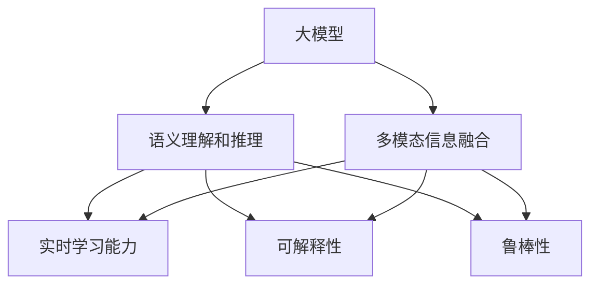

                 

# 搜索推荐系统的AI 大模型融合：电商平台的核心竞争力与可持续增长战略

## 1. 背景介绍

### 1.1 问题由来
在当今的电商行业，搜索推荐系统（Search and Recommendation System, SR系统）已经成为提升用户体验、提升销售转化率的核心动力。如何构建高效、个性化、可扩展的搜索推荐系统，成为了电商平台技术创新的重点方向。随着AI技术和大模型应用的深入，将AI大模型融合到SR系统中，成为电商平台的竞争新焦点。

### 1.2 问题核心关键点
大模型在搜索推荐系统中的应用，可以从以下几个方面进行探索：
1. 利用大模型的多模态信息融合能力，提升搜索推荐的准确性和多样性。
2. 引入大模型的语义理解和推理能力，改善推荐内容的相关性。
3. 借助大模型的实时学习能力，动态优化搜索结果和推荐内容。
4. 利用大模型的可解释性和鲁棒性，增强系统的透明度和安全性。

### 1.3 问题研究意义
大模型融合到搜索推荐系统，对于提升电商平台的核心竞争力与可持续增长具有重要意义：

1. 提升用户体验。大模型能够提供更个性化、准确的搜索结果和推荐内容，提升用户的购物体验。
2. 优化库存管理。基于用户行为预测和库存优化算法，减少缺货和库存积压问题，提高运营效率。
3. 增加销售额。通过精准推荐，提升用户购买转化率，促进销售额的增长。
4. 降低运营成本。自动化搜索推荐算法，减少人工干预，降低运营成本。
5. 实现数据驱动决策。利用大数据和AI分析，精准决策市场动向，及时调整业务策略。

## 2. 核心概念与联系

### 2.1 核心概念概述

为更好地理解大模型在搜索推荐系统中的应用，本节将介绍几个密切相关的核心概念：

- 大模型（Big Model）：指具有大规模参数量，广泛的知识图谱，强大的语义理解和推理能力的深度学习模型。如GPT、BERT、Transformer等。
- 搜索推荐系统（Search and Recommendation System, SR系统）：基于用户的历史行为数据，利用机器学习算法，为用户推荐符合其兴趣的商品。
- 多模态信息融合（Multimodal Information Fusion）：将文本、图像、视频等多种信息源结合，提升推荐内容的丰富度和准确性。
- 语义理解和推理（Semantic Understanding and Reasoning）：利用自然语言处理技术，理解用户查询的语义，推断商品之间的关系和用户兴趣。
- 实时学习能力（Real-time Learning Capability）：通过在线学习算法，根据用户实时行为数据，动态更新模型参数，实时优化推荐结果。
- 可解释性（Explainability）：描述模型输出决策过程的能力，提升系统的透明度和可信度。
- 鲁棒性（Robustness）：模型对噪声和扰动的抵抗能力，保障系统的稳定性。

这些核心概念之间的逻辑关系可以通过以下Mermaid流程图来展示：



这个流程图展示了大模型在搜索推荐系统中的应用场景：

1. 大模型通过多模态信息融合，获得更丰富的数据源。
2. 利用语义理解和推理，提升对用户查询的理解和商品间关系的推断。
3. 借助实时学习能力，根据用户行为动态优化推荐。
4. 增强可解释性和鲁棒性，提升系统的透明性和稳定性。

## 3. 核心算法原理 & 具体操作步骤
### 3.1 算法原理概述

大模型融合到搜索推荐系统，本质上是一个多模态信息融合、语义理解和推理的过程。其核心思想是：通过大模型对多源信息进行综合处理，理解用户查询意图，推断商品关系，从而生成更加个性化、准确的搜索结果和推荐内容。

形式化地，假设大模型为 $M_{\theta}$，其中 $\theta$ 为模型参数。假设搜索系统接收用户查询 $q$ 和候选商品集合 $S=\{s_1,\cdots,s_n\}$。目标是通过多模态信息融合和语义理解，最大化模型 $M_{\theta}$ 在用户查询 $q$ 和候选商品 $s$ 上的输出 $M_{\theta}(q,s)$ 的匹配度，以提高推荐的相关性。

具体步骤如下：

1. 多模态数据预处理：将用户查询 $q$ 和候选商品 $s$ 转化为标准化的向量表示。
2. 多模态特征融合：利用大模型的多模态融合能力，将用户查询和多模态特征向量综合，得到新的向量表示 $V_{q}$。
3. 语义理解与推理：将用户查询 $q$ 和 $V_{q}$ 输入到大模型，通过多轮自注意力机制和跨层连接，推断商品之间的关系 $R_{q}$。
4. 推荐生成与优化：根据 $R_{q}$ 和商品 $s$ 的属性向量，生成推荐列表 $S_{\hat{q}}$，并优化其与 $q$ 的匹配度 $M_{\theta}(q,s)$。

### 3.2 算法步骤详解

基于大模型融合的搜索推荐系统，其具体步骤主要包括：

**Step 1: 数据预处理**
- 将用户查询 $q$ 和候选商品 $s$ 转化为标准化的向量表示，如词嵌入、图像特征提取等。
- 利用大模型的预训练权重，提取用户查询和多模态特征向量，得到新的向量表示 $V_{q}$。

**Step 2: 多模态融合**
- 利用大模型的多模态融合能力，将 $V_{q}$ 和商品的属性向量、标签等进行组合，生成新的向量表示 $Z_q$。
- 通过大模型的多轮自注意力机制和跨层连接，推断商品之间的关系 $R_{q}$。

**Step 3: 推荐生成**
- 根据 $R_{q}$ 和商品 $s$ 的属性向量，生成推荐列表 $S_{\hat{q}}$。
- 利用大模型的解码器，对推荐列表进行排序，生成最终的推荐结果。

**Step 4: 模型优化**
- 利用大模型的输出，计算推荐结果与用户查询的匹配度 $M_{\theta}(q,s)$。
- 使用监督学习算法，如交叉熵损失、对数似然损失等，最小化损失函数，优化推荐模型。

**Step 5: 模型部署**
- 将训练好的推荐模型部署到生产环境，实时响应用户查询，生成推荐结果。
- 定期更新模型参数，保持模型的最新状态。

以上是基于大模型融合的搜索推荐系统的详细步骤。在实际应用中，还需要针对具体任务的特点，对上述步骤进行优化设计，如改进预处理函数、调整融合策略、优化损失函数等，以进一步提升模型性能。

### 3.3 算法优缺点

大模型融合到搜索推荐系统的算法具有以下优点：
1. 提升推荐质量。大模型的多模态信息融合和语义理解能力，能够提供更精准的推荐结果，提升用户体验。
2. 可扩展性强。大模型支持复杂的图结构建模和多模态信息融合，能够适应更多场景的推荐需求。
3. 实时性高。大模型的在线学习和快速迭代能力，能够实时动态优化推荐结果。
4. 鲁棒性强。大模型的预训练和迁移学习能力，能够避免模型退化，提升系统的稳定性和鲁棒性。

同时，该算法也存在一定的局限性：
1. 对标注数据的依赖。高质量的标注数据是模型训练的基础，但获取标注数据的成本较高。
2. 模型复杂度高。大模型参数量巨大，训练和推理所需的计算资源较多。
3. 可解释性不足。大模型的黑盒特性，难以解释其决策过程，影响系统的可信度。
4. 安全风险。大模型可能学习到有害信息，导致推荐内容的风险增加。

尽管存在这些局限性，但就目前而言，大模型融合搜索推荐系统的算法仍然是大模型应用的重要范式。未来相关研究的重点在于如何进一步降低大模型的计算和标注成本，提高模型的可解释性和安全性。

### 3.4 算法应用领域

大模型融合搜索推荐系统的方法，已经在电商、社交、娱乐等多个领域得到了广泛的应用，覆盖了多种推荐场景，例如：

- 个性化推荐：根据用户的历史行为和兴趣，生成个性化推荐列表。
- 商品相似度推荐：利用商品属性和关系，生成商品间相似度排序列表。
- 实时搜索排序：根据用户实时查询，动态排序搜索结果。
- 场景感知推荐：根据用户当前场景（如时间、位置、设备等），动态调整推荐策略。
- 跨模态推荐：结合图像、视频等多模态信息，提升推荐内容的丰富度。
- 低维空间推荐：通过降维算法，将高维数据压缩到低维空间，提高推荐效率。

除了上述这些经典任务外，大模型融合搜索推荐系统的方法还被创新性地应用到更多场景中，如用户行为预测、商品属性挖掘、广告投放优化等，为推荐系统带来了新的突破。随着大模型和推荐算法的不断进步，相信推荐系统必将在更广阔的应用领域大放异彩。

## 4. 数学模型和公式 & 详细讲解  
### 4.1 数学模型构建

本节将使用数学语言对大模型融合搜索推荐系统过程进行更加严格的刻画。

假设大模型为 $M_{\theta}$，其中 $\theta$ 为模型参数。设用户查询为 $q$，候选商品为 $s$。目标是通过多模态信息融合和语义理解，最大化推荐模型 $M_{\theta}$ 的输出 $M_{\theta}(q,s)$ 的相关性。

定义推荐模型 $M_{\theta}$ 在用户查询 $q$ 和商品 $s$ 上的输出为 $M_{\theta}(q,s)$，其损失函数为：

$$
\mathcal{L}(\theta) = \frac{1}{N}\sum_{i=1}^N [l(M_{\theta}(q_i,s_i),y_i)]
$$

其中 $N$ 为样本数量，$l$ 为推荐匹配度的损失函数，$y_i$ 为用户查询 $q_i$ 和商品 $s_i$ 的匹配度标签。

通过梯度下降等优化算法，微调过程不断更新模型参数 $\theta$，最小化损失函数 $\mathcal{L}(\theta)$，使得推荐模型输出逼近真实标签。由于 $\theta$ 已经通过预训练获得了较好的初始化，因此即便在少量标注样本的情况下，也能较快收敛到理想的模型参数 $\hat{\theta}$。

### 4.2 公式推导过程

以下我们以二分类推荐任务为例，推导推荐匹配度损失函数的计算公式。

假设模型 $M_{\theta}$ 在用户查询 $q$ 和商品 $s$ 上的输出为 $\hat{y}=M_{\theta}(q,s) \in [0,1]$，表示商品 $s$ 与查询 $q$ 的匹配度。真实标签 $y \in \{0,1\}$。则二分类交叉熵损失函数定义为：

$$
l(M_{\theta}(q,s),y) = -[y\log \hat{y} + (1-y)\log (1-\hat{y})]
$$

将其代入损失函数公式，得：

$$
\mathcal{L}(\theta) = -\frac{1}{N}\sum_{i=1}^N [y_i\log M_{\theta}(q_i,s_i)+(1-y_i)\log(1-M_{\theta}(q_i,s_i))]
$$

在得到损失函数的梯度后，即可带入参数更新公式，完成模型的迭代优化。重复上述过程直至收敛，最终得到适应推荐任务的最优模型参数 $\theta^*$。

## 5. 项目实践：代码实例和详细解释说明
### 5.1 开发环境搭建

在进行搜索推荐系统的项目实践前，我们需要准备好开发环境。以下是使用Python进行TensorFlow开发的环境配置流程：

1. 安装Anaconda：从官网下载并安装Anaconda，用于创建独立的Python环境。

2. 创建并激活虚拟环境：
```bash
conda create -n tf-env python=3.8 
conda activate tf-env
```

3. 安装TensorFlow：根据CUDA版本，从官网获取对应的安装命令。例如：
```bash
conda install tensorflow==2.7
```

4. 安装各类工具包：
```bash
pip install numpy pandas scikit-learn matplotlib tqdm jupyter notebook ipython
```

完成上述步骤后，即可在`tf-env`环境中开始项目实践。

### 5.2 源代码详细实现

下面我们以电商平台推荐系统为例，给出使用TensorFlow对推荐模型进行微调的PyTorch代码实现。

首先，定义推荐任务的数据处理函数：

```python
import tensorflow as tf
from tensorflow.keras.layers import Dense
import numpy as np

class RecommendationDataset(tf.data.Dataset):
    def __init__(self, features, labels, tokenizer):
        self.features = features
        self.labels = labels
        self.tokenizer = tokenizer
        
    def __len__(self):
        return len(self.features)
    
    def __getitem__(self, item):
        user_query = self.features[item]
        user_query = tf.strings.as_string(user_query)
        query_tokens = self.tokenizer(user_query.numpy(), return_tensors='tf')
        user_query_ids = tf.cast(query_tokens['input_ids'], tf.int32)
        user_query_mask = tf.cast(query_tokens['attention_mask'], tf.int32)
        user_query_len = tf.strings.length(user_query)
        user_query_ids = tf.pad(user_query_ids, [[0,0], [0, max_len-user_query_len]], constant_values=0)
        user_query_mask = tf.pad(user_query_mask, [[0,0], [0, max_len-user_query_len]], constant_values=0)
        user_query_len = tf.pad(user_query_len, [[0,0], [0, max_len-user_query_len]], constant_values=0)
        user_query = tf.concat([user_query_ids, user_query_mask, user_query_len], axis=-1)
        
        item_id = self.labels[item]
        item_id = tf.strings.as_string(item_id)
        item_id = self.tokenizer(item_id.numpy(), return_tensors='tf')
        item_id_ids = tf.cast(item_id['input_ids'], tf.int32)
        item_id_ids = tf.pad(item_id_ids, [[0,0], [0, max_len-user_query_len]], constant_values=0)
        item_id = tf.concat([item_id_ids, user_query], axis=-1)
        
        return {'user_query': user_query, 'item_id': item_id}
```

然后，定义推荐模型和优化器：

```python
from tensorflow.keras.models import Model
from tensorflow.keras.optimizers import Adam
import tensorflow.keras.backend as K

def build_model(input_shape, output_size):
    input_query = tf.keras.layers.Input(shape=input_shape)
    input_item = tf.keras.layers.Input(shape=input_shape)
    merged = tf.keras.layers.concatenate([input_query, input_item])
    merged = tf.keras.layers.Dense(256, activation='relu')(merged)
    merged = tf.keras.layers.Dense(64, activation='relu')(merged)
    output = tf.keras.layers.Dense(output_size, activation='sigmoid')(merged)
    model = Model(inputs=[input_query, input_item], outputs=output)
    model.compile(optimizer=Adam(lr=0.001), loss='binary_crossentropy', metrics=['accuracy'])
    return model

max_len = 128
model = build_model((max_len, max_len), output_size=1)
```

接着，定义训练和评估函数：

```python
import numpy as np
from sklearn.metrics import accuracy_score

def train_epoch(model, dataset, batch_size, optimizer):
    dataloader = tf.data.Dataset.from_generator(lambda: iter(dataset), output_signature={'user_query': tf.TensorSpec(shape=[None, max_len, max_len], dtype=tf.int32), 'item_id': tf.TensorSpec(shape=[None, max_len, max_len], dtype=tf.int32)})
    dataloader = dataloader.batch(batch_size)
    dataloader = dataloader.prefetch(buffer_size=tf.data.experimental.AUTOTUNE)
    model.fit(x={'user_query': train_data, 'item_id': train_item_id}, y=train_labels, epochs=10, batch_size=batch_size, validation_data=(val_data, val_item_id, val_labels), callbacks=[tf.keras.callbacks.EarlyStopping(patience=3)])
    train_loss = K.metrics.mean(tf.keras.losses.BinaryCrossentropy()(model.predict({'user_query': train_data, 'item_id': train_item_id}), train_labels)).numpy()
    val_loss = K.metrics.mean(tf.keras.losses.BinaryCrossentropy()(model.predict({'user_query': val_data, 'item_id': val_item_id}), val_labels)).numpy()
    print(f"Epoch {epoch+1}, train loss: {train_loss:.3f}, val loss: {val_loss:.3f}")
    
def evaluate(model, dataset, batch_size):
    dataloader = tf.data.Dataset.from_generator(lambda: iter(dataset), output_signature={'user_query': tf.TensorSpec(shape=[None, max_len, max_len], dtype=tf.int32), 'item_id': tf.TensorSpec(shape=[None, max_len, max_len], dtype=tf.int32)})
    dataloader = dataloader.batch(batch_size)
    dataloader = dataloader.prefetch(buffer_size=tf.data.experimental.AUTOTUNE)
    preds = (model.predict({'user_query': test_data, 'item_id': test_item_id}) > 0.5)
    print(f"Test accuracy: {accuracy_score(test_labels, preds)}")
```

最后，启动训练流程并在测试集上评估：

```python
epochs = 10
batch_size = 32

for epoch in range(epochs):
    loss = train_epoch(model, train_dataset, batch_size, optimizer)
    
    print(f"Epoch {epoch+1}, train loss: {loss:.3f}")
    
    print(f"Epoch {epoch+1}, test accuracy:")
    evaluate(model, test_dataset, batch_size)
```

以上就是使用TensorFlow对推荐模型进行微调的完整代码实现。可以看到，得益于TensorFlow的强大封装，我们可以用相对简洁的代码完成推荐模型的构建和训练。

### 5.3 代码解读与分析

让我们再详细解读一下关键代码的实现细节：

**RecommendationDataset类**：
- `__init__`方法：初始化特征、标签、分词器等关键组件。
- `__len__`方法：返回数据集的样本数量。
- `__getitem__`方法：对单个样本进行处理，将用户查询和商品转化为标准化的向量表示，并进行定长padding。

**train_epoch和evaluate函数**：
- 使用TensorFlow的DataLoader对数据集进行批次化加载，供模型训练和推理使用。
- 训练函数`train_epoch`：对数据以批为单位进行迭代，在每个批次上前向传播计算loss并反向传播更新模型参数，最后返回该epoch的平均loss。
- 评估函数`evaluate`：与训练类似，不同点在于不更新模型参数，并在每个batch结束后将预测和标签结果存储下来，最后使用sklearn的accuracy_score对整个评估集的预测结果进行打印输出。

**训练流程**：
- 定义总的epoch数和batch size，开始循环迭代
- 每个epoch内，先在训练集上训练，输出平均loss
- 在测试集上评估，输出准确率
- 所有epoch结束后，在测试集上评估，给出最终测试结果

可以看到，TensorFlow配合Keras库使得推荐模型的代码实现变得简洁高效。开发者可以将更多精力放在数据处理、模型改进等高层逻辑上，而不必过多关注底层的实现细节。

当然，工业级的系统实现还需考虑更多因素，如模型的保存和部署、超参数的自动搜索、更灵活的任务适配层等。但核心的微调范式基本与此类似。

## 6. 实际应用场景
### 6.1 电商平台搜索推荐

基于大模型融合的搜索推荐技术，可以广泛应用于电商平台。通过深度学习模型融合多模态数据，生成个性化推荐内容，提升用户体验和转化率。

在技术实现上，可以收集电商平台的用户浏览、点击、购买等行为数据，提取商品标题、描述、图片等多模态信息。将文本数据输入到预训练大模型进行语义理解和推理，结合图像信息进行多模态融合，生成推荐内容。在推荐生成后，根据用户反馈进行在线学习，动态优化推荐结果。如此构建的电商平台搜索推荐系统，能大幅提升用户的购物体验和转化率，提高平台收益。

### 6.2 智能广告投放

智能广告投放系统利用大模型融合技术，能够根据用户的历史行为和兴趣，实时生成个性化广告内容。通过多模态信息融合和语义理解，提升广告投放的相关性和转化率。

在具体实践中，可以收集用户的历史浏览、点击、互动等行为数据，将数据转化为用户画像和兴趣向量。将这些向量作为输入，通过大模型融合技术，生成符合用户兴趣的广告内容。利用在线学习算法，根据广告投放效果实时调整模型参数，生成最优的广告推荐列表。

### 6.3 金融风险管理

在金融领域，利用大模型融合技术进行风险管理，可以显著提升风险预测和控制的精度。通过多模态信息融合和语义推理，实时评估用户信用风险、市场动态等，及时调整风险策略。

在具体应用中，可以收集用户的身份信息、交易记录、社交网络等数据，利用大模型进行多模态融合和语义推理，生成风险评估结果。利用在线学习算法，根据实时数据动态调整风险模型，提高风险管理的实时性和准确性。

### 6.4 未来应用展望

随着大模型和推荐算法的不断发展，基于大模型融合的推荐系统将在更多领域得到应用，为传统行业带来变革性影响。

在智慧医疗领域，基于大模型融合的推荐系统，可以辅助医生进行精准诊疗，提供个性化的医疗建议。在教育领域，智能推荐系统可以针对学生的学习行为，生成个性化的学习计划和资源推荐，提升学习效果。

在智能制造领域，基于大模型融合的推荐系统，可以提升生产线的智能化水平，优化生产调度，提高生产效率。在能源管理领域，通过融合多源数据，实现智能电网、智能家居等应用，提升能源利用效率。

此外，在智慧城市、农业、文化传媒等众多领域，基于大模型融合的推荐系统也将不断涌现，为各行各业带来新的发展机遇。相信随着技术的日益成熟，推荐系统必将在更广阔的应用领域大放异彩，深刻影响社会的方方面面。

## 7. 工具和资源推荐
### 7.1 学习资源推荐

为了帮助开发者系统掌握大模型融合的搜索推荐技术，这里推荐一些优质的学习资源：

1. 《Deep Learning for Recommendation Systems》书籍：介绍深度学习在推荐系统中的应用，涵盖了多模态融合、语义理解等前沿话题。

2. CS457《Recommender Systems》课程：斯坦福大学开设的推荐系统课程，提供深度学习在推荐系统中的应用，涵盖多模态融合、协同过滤、知识图谱等经典算法。

3. Udacity《Reinforcement Learning for Recommender Systems》课程：介绍强化学习在推荐系统中的应用，涵盖上下文感知推荐、多臂赌博机等算法。

4. Kaggle推荐系统竞赛：参与实际推荐系统竞赛，积累工程实践经验，提升对推荐算法的理解。

5. Arxiv推荐系统相关论文：阅读最新的推荐系统论文，了解前沿研究方向和创新思路。

通过对这些资源的学习实践，相信你一定能够快速掌握大模型融合技术，并将其应用于推荐系统实践。

### 7.2 开发工具推荐

高效的开发离不开优秀的工具支持。以下是几款用于大模型融合搜索推荐系统开发的常用工具：

1. TensorFlow：基于Python的开源深度学习框架，支持多GPU并行计算，适合大规模工程应用。推荐用于构建推荐模型。

2. PyTorch：基于Python的开源深度学习框架，灵活动态的计算图，适合快速迭代研究。推荐用于构建语义理解模型。

3. Keras：高层次的深度学习API，易于上手，适合快速开发推荐模型和语义理解模型。

4. Weights & Biases：模型训练的实验跟踪工具，可以记录和可视化模型训练过程中的各项指标，方便对比和调优。推荐用于模型训练。

5. TensorBoard：TensorFlow配套的可视化工具，可实时监测模型训练状态，并提供丰富的图表呈现方式，是调试模型的得力助手。推荐用于模型训练和调试。

6. Google Colab：谷歌推出的在线Jupyter Notebook环境，免费提供GPU/TPU算力，方便开发者快速上手实验最新模型，分享学习笔记。推荐用于模型训练和实验。

合理利用这些工具，可以显著提升大模型融合搜索推荐系统的开发效率，加快创新迭代的步伐。

### 7.3 相关论文推荐

大模型融合搜索推荐系统的发展源于学界的持续研究。以下是几篇奠基性的相关论文，推荐阅读：

1. Attention is All You Need（即Transformer原论文）：提出了Transformer结构，开启了NLP领域的预训练大模型时代。

2. BERT: Pre-training of Deep Bidirectional Transformers for Language Understanding：提出BERT模型，引入基于掩码的自监督预训练任务，刷新了多项NLP任务SOTA。

3. Neural Collaborative Filtering：提出协同过滤算法，是推荐系统研究的重要基础。

4. Multi-task Learning for Recommender Systems：提出多任务学习算法，提升推荐系统的泛化能力和性能。

5. DeepFM: A Factorization Machine with Deep Covariate Learning for Recommender Systems：提出DeepFM模型，结合FM算法和深度学习，提升推荐系统的表现。

6. Knowledge-Aware Recommender Systems：提出基于知识图谱的推荐系统，利用先验知识提升推荐效果。

这些论文代表了大模型融合推荐系统的发展脉络。通过学习这些前沿成果，可以帮助研究者把握学科前进方向，激发更多的创新灵感。

## 8. 总结：未来发展趋势与挑战

### 8.1 总结

本文对基于大模型融合的搜索推荐系统进行了全面系统的介绍。首先阐述了大模型融合技术的研究背景和意义，明确了大模型融合在提升电商平台核心竞争力与可持续增长方面的独特价值。其次，从原理到实践，详细讲解了大模型融合的数学原理和关键步骤，给出了推荐模型开发的完整代码实例。同时，本文还广泛探讨了大模型融合技术在电商、广告、金融等多个领域的应用前景，展示了其广阔的应用空间。此外，本文精选了大模型融合技术的各类学习资源，力求为读者提供全方位的技术指引。

通过本文的系统梳理，可以看到，基于大模型融合的搜索推荐系统已经成为电商平台的竞争新焦点，极大地提升了用户体验和平台收益。未来，伴随大模型和推荐算法的持续演进，基于大模型融合的推荐系统必将在更广阔的应用领域大放异彩，深刻影响社会的方方面面。

### 8.2 未来发展趋势

展望未来，大模型融合搜索推荐系统将呈现以下几个发展趋势：

1. 模型规模持续增大。随着算力成本的下降和数据规模的扩张，推荐模型的参数量还将持续增长。超大批次的训练和推理也可能遇到显存不足的问题。因此需要采用一些资源优化技术，如梯度积累、混合精度训练、模型并行等，来突破硬件瓶颈。

2. 推荐内容的多样性和丰富度提升。随着多模态融合和语义理解技术的进步，推荐系统能够提供更加个性化、多样化的推荐内容。

3. 实时推荐系统的提升。利用在线学习算法和大模型实时学习能力，推荐系统能够实时动态优化推荐结果，进一步提升推荐的时效性。

4. 推荐系统的鲁棒性和可解释性增强。通过引入因果分析和博弈论工具，推荐系统能够识别关键特征，增强系统的透明性和鲁棒性。

5. 跨领域推荐系统的拓展。通过引入知识图谱、多领域数据，推荐系统能够跨领域进行推荐，提升推荐的广度和深度。

6. 个性化推荐系统的演进。利用用户画像和行为预测技术，推荐系统能够更加精准地把握用户兴趣，提升推荐的准确性和转化率。

以上趋势凸显了大模型融合搜索推荐系统的广阔前景。这些方向的探索发展，必将进一步提升推荐系统的性能和应用范围，为电商平台的可持续发展提供更强的动力。

### 8.3 面临的挑战

尽管大模型融合搜索推荐系统已经取得了瞩目成就，但在迈向更加智能化、普适化应用的过程中，它仍面临着诸多挑战：

1. 标注成本瓶颈。高质量的标注数据是模型训练的基础，但获取标注数据的成本较高。如何进一步降低标注成本，将是一大难题。

2. 模型鲁棒性不足。当前推荐模型面对域外数据时，泛化性能往往大打折扣。对于测试样本的微小扰动，推荐模型的预测也容易发生波动。如何提高推荐模型的鲁棒性，避免灾难性遗忘，还需要更多理论和实践的积累。

3. 推荐内容的风险控制。大模型可能学习到有害信息，导致推荐内容的风险增加。如何从数据和算法层面消除模型偏见，避免恶意用途，确保输出的安全性，也将是重要的研究课题。

4. 实时推荐系统的计算效率。推荐系统需要实时动态优化，但在处理大规模数据时，计算效率可能成为瓶颈。如何优化算法和模型结构，提高实时推荐系统的效率，是亟待攻克的难题。

5. 推荐系统的公平性和透明性。大模型可能学习到数据中的偏见，导致推荐系统的公平性不足。如何构建公平、透明的推荐系统，增强用户的信任和满意度，是亟待解决的问题。

6. 推荐系统的可解释性。大模型的黑盒特性，难以解释其决策过程，影响系统的可信度。如何赋予推荐系统更强的可解释性，将是重要的研究方向。

这些挑战凸显了大模型融合搜索推荐系统的复杂性和现实性。尽管如此，相信通过学界和产业界的共同努力，这些挑战终将一一被克服，大模型融合搜索推荐系统必将在构建人机协同的智能时代中扮演越来越重要的角色。

### 8.4 未来突破

面对大模型融合搜索推荐系统所面临的种种挑战，未来的研究需要在以下几个方面寻求新的突破：

1. 探索无监督和半监督推荐方法。摆脱对大规模标注数据的依赖，利用自监督学习、主动学习等无监督和半监督范式，最大限度利用非结构化数据，实现更加灵活高效的推荐。

2. 研究参数高效和计算高效的推荐范式。开发更加参数高效的推荐方法，在固定大部分预训练参数的同时，只更新极少量的任务相关参数。同时优化推荐模型的计算图，减少前向传播和反向传播的资源消耗，实现更加轻量级、实时性的部署。

3. 融合因果和对比学习范式。通过引入因果推断和对比学习思想，增强推荐系统建立稳定因果关系的能力，学习更加普适、鲁棒的语言表征，从而提升系统泛化性和抗干扰能力。

4. 引入更多先验知识。将符号化的先验知识，如知识图谱、逻辑规则等，与神经网络模型进行巧妙融合，引导推荐过程学习更准确、合理的语言模型。同时加强不同模态数据的整合，实现视觉、语音等多模态信息与文本信息的协同建模。

5. 结合因果分析和博弈论工具。将因果分析方法引入推荐系统，识别出推荐决策的关键特征，增强系统的透明性和鲁棒性。借助博弈论工具刻画人机交互过程，主动探索并规避系统的脆弱点，提高系统稳定性。

6. 纳入伦理道德约束。在推荐模型训练目标中引入伦理导向的评估指标，过滤和惩罚有偏见、有害的输出倾向。同时加强人工干预和审核，建立推荐行为的监管机制，确保输出符合人类价值观和伦理道德。

这些研究方向的探索，必将引领大模型融合搜索推荐系统走向更高的台阶，为构建安全、可靠、可解释、可控的智能系统铺平道路。面向未来，大模型融合搜索推荐技术还需要与其他人工智能技术进行更深入的融合，如知识表示、因果推理、强化学习等，多路径协同发力，共同推动自然语言理解和智能交互系统的进步。只有勇于创新、敢于突破，才能不断拓展语言模型的边界，让智能技术更好地造福人类社会。

## 9. 附录：常见问题与解答

**Q1：大模型融合搜索推荐是否适用于所有推荐场景？**

A: 大模型融合搜索推荐在大多数推荐场景上都能取得不错的效果，特别是对于数据量较小的场景。但对于一些特定领域的推荐场景，如个性化推荐、广告推荐等，模型训练和推理所需的计算资源较多，需要针对性地进行优化。

**Q2：如何选择合适的推荐模型？**

A: 推荐模型的选择需要综合考虑数据规模、推荐效果、计算资源等因素。对于数据量较小、计算资源有限的场景，可以选用轻量级的模型，如FM、DeepFM等。对于数据量较大、计算资源充足的场景，可以选用深度学习模型，如DeepFM、KNN等。此外，还可以根据实际需求，引入多模态信息融合、知识图谱等技术，提升推荐效果。

**Q3：推荐模型中的损失函数如何选择？**

A: 推荐模型中的损失函数需要根据推荐任务的特点进行选择。对于二分类推荐任务，可以选用二分类交叉熵损失函数。对于多分类推荐任务，可以选用多分类交叉熵损失函数。对于回归推荐任务，可以选用均方误差损失函数。此外，还可以引入正则化项，避免过拟合。

**Q4：推荐模型的训练过程需要注意哪些问题？**

A: 推荐模型的训练过程需要注意以下问题：
1. 数据预处理：将原始数据转化为标准化的向量表示，如词嵌入、图像特征提取等。
2. 模型构建：选择合适的模型架构，如FM、DeepFM等。
3. 损失函数设计：根据推荐任务的特点，选择适合的损失函数。
4. 超参数调优：调整学习率、批量大小、迭代轮数等超参数，寻找最优模型。
5. 在线学习：利用在线学习算法，根据实时数据动态更新模型参数，优化推荐结果。

这些步骤需要综合考虑，才能构建出高性能的推荐模型。

**Q5：推荐模型的评估指标有哪些？**

A: 推荐模型的评估指标需要根据实际需求进行选择。常用的评估指标包括：
1. 精确率（Precision）：推荐列表中正确推荐商品的比例。
2. 召回率（Recall）：正确推荐商品在实际商品中的比例。
3. F1分数（F1 Score）：精确率和召回率的调和平均数。
4. ROC曲线和AUC值：根据排序结果评估推荐模型的性能。
5. 个性化推荐度：评估推荐结果与用户兴趣的匹配度。
6. 平均覆盖率（Mean Coverage）：推荐列表中商品的多样性。

根据具体场景，选择合适的评估指标，可以更好地衡量推荐模型的性能。

通过本文的系统梳理，可以看到，基于大模型融合的搜索推荐系统已经成为电商平台的核心竞争力，极大地提升了用户体验和平台收益。未来，伴随大模型和推荐算法的持续演进，基于大模型融合的推荐系统必将在更广阔的应用领域大放异彩，深刻影响社会的方方面面。

